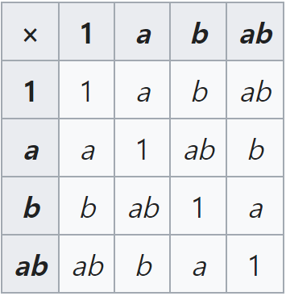

# § 5. Subgroups

## Notation and Terminology

In addition, we use $0$ as identity element, and $-a$ as the inverse of $a$.
Also, for $n \in \mathbb{N}$, we denote $a+a+\cdots+a$ for $n$ summands by $na$, denote $(-a)+(-a)+\cdots+(-a)$ for $n$ summands by $-na$, and let $0a$ be the identity element $0$.

In multiplication, we use $e$ as identity element, and $a^{-1}$ as the inverse of $a$.
Also, for $n \in \mathbb{N}$, we denote $aa \cdots a$ for $n$ factors $a$ by $a^n$, denote $a^{-1}a^{-1} \cdots a^{-1}$ for $n$ factors $a^{-1}$ by $a^{-n}$, and let $a^0$ be the identity element $e$.  
For $m, n \in \mathbb{Z}$, $a^m a^n = a^{m+n}$ holds.

!!! definition "Definition 5.3 : Order"
    If $G$ is a group, then the **order** $|G|$ of $G$ is the number of elements in $G$.

## Subsets and Subgroups

!!! definition "Definition 5.4 : Subgroup"
    If a subset $H$ of a group $G$ is closed under the binary operation of $G$ and if $H$ with the induced operation from $G$ is itself a group, then $H$ is a subgroup of $G$.  
    $H \le G$ means that $H$ is a subgroup of $G$, and $H < G$ means that $H \le G$, $H \ne G$.

!!! definition "Definition 5.5 : Proper / Improper / Trivial / Nontrivial Subgroup"
    $G$ is the **improper subgroup** of $G$.  
    All other subgroups except $G$ is the **proper subgroup** of $G$.  
    $\{e\}$ is the **trivial subgroup** of $G$.  
    All other subgroups except $\{e\}$ is the **trivial subgroup** of $G$.  

!!! example "Example 5.9 : Klein 4-Group"
    There are two different types of group structures of order 4, which is $\mathbb{Z}_4$ and **Klein 4-Group**.
    

    {: width="25%"}
    

!!! theorem "Theorem 5.14 : Property of Subgroups"
    A subset $H$ of a group $G$ is a subgroup of $G$ iff  
    1. $H$ is closed under the binary operation of $G$.  
    2. The identity element $e$ of $G$, $e \in H$.  
    3. $\forall \ a \in H$, $a^{-1} \in H$.  

    !!! proof
        ($\Rightarrow$)  
        Since $H \le G$, $H$ is closed under the binary operation.  
        Let $e_H$ be the identity element of $H$, and $e$ be the identity element of $G$.
        $x \in H$, $e_H * x = x$, $e * x = x$.
        By **Property 4.15**, $e=e_H$.
        Since the identity element of $H$ and $G$ are same, inverses must also be same.  
        ($\Leftarrow$)  
        By Conditions 1, 2, 3, and the associative law, $H$ is a group, and a subset of $G$.
        So, $H$ is a subgroup of $G$.

## Cyclic Subgroups

!!! theorem "Theorem 5.17 : Cyclic Subgroups"
    Let $G$ be a group, $a \in G$.  
    $H = \{ a^n \ | \ n \in \mathbb{Z}\}$ is a subgroup of $G$.  
    $H$ is the smallest subgroup of $G$ that contains $a$.  
    Every subgroup containing $a$ contains $H$.  

    !!! proof
        By **Theorem 5.14**, since $H$ is closed under the group operation, and has identity element and inverse, $H$ is a subgroup of $G$.  
        Also, in any subgroup that includes $a$, it is trivial that it must also include $H$.

!!! definition "Definition 5.18 : Cyclic Subgroup of $G$ Generated by $a$"
    Let $G$ be a group, $a \in G$.  
    $\{ a^n \ | \ n \in \mathbb{Z}\}$ is the **cyclic subgroup of $G$ generated by $a$**, and denoted by $\langle a \rangle$.

!!! definition "Definition 5.19 : $a$ Generates $G$ / Cyclic Group"
    $a \in G$ **generates** $G$ and is a **generator for** $G$ iff $\langle a \rangle=G$.  
    A group $G$ is **cyclic** if there is some element $a \in G$ that generates $G$.

!!! definition "Definition 5.20 : Order of $a$"
    If $\langle a \rangle$ is finite, **order of $a$** is the order $|\langle a \rangle|$.
    Otherwise, $a$ is of **infinite order**.
