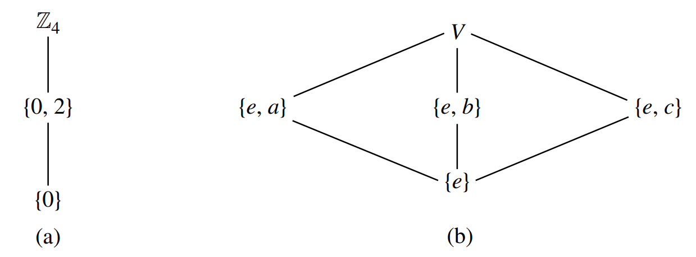

# § 5. Subgroups

## Notation and Terminology

In additive notation, we use $0$ as identity element, and $-a$ as the inverse of $a$.
Also, for $n \in \mathbb{N}$, we denote $a+a+\cdots+a$ for $n$ summands by $na$, denote $(-a)+(-a)+\cdots+(-a)$ for $n$ summands by $-na$, and let $0a$ be the identity element $0$.

In multiplicative notation, we use $e$ as identity element, and $a^{-1}$ as the inverse of $a$.
Also, for $n \in \mathbb{N}$, we denote $aa \cdots a$ for $n$ factors $a$ by $a^n$, denote $a^{-1}a^{-1} \cdots a^{-1}$ for $n$ factors $a^{-1}$ by $a^{-n}$, and let $a^0$ be the identity element $e$.
For $m, n \in \mathbb{Z}$, $a^m a^n = a^{m+n}$ holds.

!!! definition "Definition 5.3 : Order"
    If $G$ is a group, then the **order** $|G|$ of $G$ is the number of elements in $G$. (Recall that, for any set $S,|S|$ is the cardinality of $S$.)

## Subsets and Subgroups

!!! definition "Definition 5.4 : Subgroup"
    If a subset $H$ of a group $G$ is closed under the binary operation of $G$ and if $H$ with the induced operation from $G$ is itself a group, then $H$ is a **subgroup** of $G$.
    We shall let $H \leq G$ or $G \geq H$ denote that $H$ is a subgroup of $G$, and $H<G$ or $G>H$ shall mean $H \leq G$ but $H \neq G$.

!!! definition "Definition 5.5 : Proper / Improper / Trivial / Nontrivial Subgroup"
    If $G$ is a group, then the subgroup consisting of $G$ itself is the **improper subgroup** of $G$.
    All other subgroups are **proper subgroups**.
    The subgroup $\{e\}$ is the **trivial subgroup** of $G$.
    All other subgroups are subgroups **nontrivial**.

!!! example "Example 5.9 : Groups of Order 4"
    There are two different types of group structures of order 4, which is $\mathbb{Z}_4$ and **Klein 4-Group**.

    $$
    \mathbb{Z}_4 \ : \ 
    \begin{array}{c|c|c|c|c}
    + & 0 & 1 & 2 & 3 \\
    \hline
    0 & 0 & 1 & 2 & 3 \\
    \hline
    1 & 1 & 2 & 3 & 0\\
    \hline
    2 & 2 & 3 & 0 & 1 \\
    \hline
    3 & 3 & 0 & 1 & 2 \\
    \end{array}
    \qquad
    V \ : \ 
    \begin{array}{c|c|c|c|c}
     & e & a & b & c \\
    \hline
    e & e & a & b & c \\
    \hline
    a & a & e & c & b\\
    \hline
    b & b & c & e & a \\
    \hline
    c & c & b & a & e \\
    \end{array}
    $$

    

    {: width="20%"}  
    (Klein 4-group in multiplicative notation)
    

    The only nontrivial proper subgroup of $\mathbb{Z}_{4}$ is $\{0,2\}$.
    However, the group $V$ has three nontrivial proper subgroups, $\{e, a\},\{e, b\}$, and $\{e, c\}$.

    ---

    It is often useful to draw a subgroup diagram of the subgroups of a group.
    In such a diagram, a line running downward from a group $G$ to a group $H$ means that $H$ is a subgroup of $G$.
    Thus the larger group is placed nearer the top of the diagram.

    

    {: width="75%"}
    

!!! theorem "Theorem 5.14 : Another Definition for Subgroups"
    A subset $H$ of a group $G$ is a subgroup of $G$ if and only if

    1. $H$ is closed under the binary operation of $G$,
    2. the identity element $e$ of $G$ is in $H$,
    3. for all $a \in H$ it is true that $a^{-1} \in H$ also.

    !!! proof
        The fact that if $H \leq G$ then Conditions 1, 2, and 3 must hold follows at once from the definition of a subgroup and from the following remarks.

        If $H \leq G$ and $a \in H$, then by **Theorem 4.16**, the equation $a x=a$ must have a unique solution, namely the identity element of $H$.
        But this equation can also be viewed as one in $G$, and we see that this unique solution must also be the identity element $e$ of $G$.
        A similar argument then applied to the equation $a x=e$, viewed in both $H$ and $G$, shows that the inverse $a^{-1}$ of $a$ in $G$ is also the inverse of $a$ in the subgroup $H$.

        Conversely, suppose $H$ is a subset of a group $G$ such that Conditions 1, 2, and 3 hold.
        By 2 we have at once that $\mathscr{S}_{2}$ is satisfied.
        Also $\mathscr{S}_{3}$ is satisfied by 3.
        It remains to check the associative axiom, $\mathscr{C}_{1}$.
        But surely for all $a, b, c \in H$ it is true that $(a b) c=a(b c)$ in $H$, for we may actually view this as an equation in $G$, where the associative law holds.
        Hence $H \leq G$.

## Cyclic Subgroups

!!! theorem "Theorem 5.17 : Smallest Subgroup Containing $a$"
    Let $G$ be a group and let $a \in G$.
    Then

    $$
    H=\left\{a^{n} \mid n \in \mathbb{Z}\right\}
    $$

    is a subgroup of $G$ and is the smallest subgroup of $G$ that contains $a$, that is, every subgroup containing $a$ contains $H$.

    !!! proof
        We check the three conditions given in **Theorem 5.14** for a subset of a group to give a subgroup.
        Since $a^{r} a^{s}=a^{r+s}$ for $r, s \in \mathbb{Z}$, we see that the product in $G$ of two elements of $H$ is again in $H$.
        Thus $H$ is closed under the group operation of $G$.
        Also $a^{0}=e$, so $e \in H$, and for $a^{r} \in H, a^{-r} \in H$ and $a^{-r} a^{r}=e$.
        Hence all the conditions are satisfied, and $H \leq G$.

        A subgroup of $G$ containing $a$ must, by **Theorem 5.14**, contain $a^{n}$, the result of computing products of $a$ and itself for $n$ factors for every positive integer $n$.
        Of course, a subgroup containing $a$ must also contain $a^{-1}$, and, in general, it must contain $a^{-m}$ for all $m \in \mathbb{Z}^{+}$.
        It must contain the identity element $e=a^{0}$.
        Summarizing, a subgroup of $G$ containing the element a must contain all elements $a^{n}$ (or $na$ for additive groups) for all $n \in \mathbb{Z}$. That is, a subgroup containing $a$ must contain $\left\{a^{n} \mid n \in \mathbb{Z}\right\}$. Observe that these powers $a^{n}$ of $a$ need not be distinct.

        Our arguments above showed that any subgroup of $G$ containing $a$ must contain $H$, so $H$ is the smallest subgroup of $G$ containing $a$.

!!! definition "Definition 5.18 : Cyclic Subgroup of $G$ Generated by $a$"
    Let $G$ be a group and let $a \in G$.
    Then the subgroup $\left\{a^{n} \mid n \in \mathbb{Z}\right\}$ of $G$, characterized in **Theorem 5.17**, is called the **cyclic subgroup of $G$ generated by $a$**, and denoted by $\langle a\rangle$.

!!! definition "Definition 5.19 : $a$ Generates $G$ / Cyclic Group"
    An element $a$ of a group $G$ **generates** $G$ and is a **generator for** $G$ if $\langle a\rangle=G$.
    A group $G$ is **cyclic** if there is some element $a$ in $G$ that generates $G$.