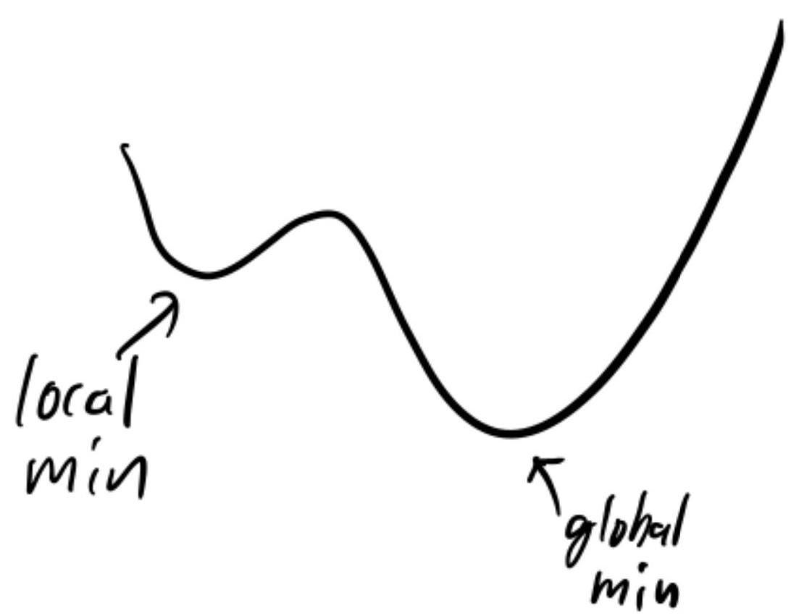

# § 1. Optimization Problem

## Definition of Optimization Problem

!!! definition "Definition 1.1 : Optimization Problem"
    In an **optimization problem**, we minimize or maximize a function value, possibly subject to constraints.

    $$
    \begin{array}{ll}
    \underset{\theta \in \mathbb{R}^{p}}{\operatorname{minimize}} & f(\theta) \\
    \text { subject to } & h_{1}(\theta)=0, & \cdots & , \ h_{m}(\theta)=0, \\
    & g_{1}(\theta) \le 0, & \cdots & , \ g_{n}(\theta) \le 0
    \end{array}
    $$

    - Decision variable: $\theta$
    - Objective function: $f$
    - Equality constraint: $h_{i}(\theta)=0$ for $i=1, \ldots, m$
    - Inequality constraint: $g_{j}(\theta) \leq 0$ for $j=1, \ldots, n$

In machine learning (ML), we often minimize a "loss", but sometimes we maximize the "likelihood".
In any case, minimization and maximization are equivalent since

$$
\text { maximize } f(\theta) \quad \Leftrightarrow \quad \text { minimize }-f(\theta).
$$

!!! definition "Definition 1.2 : Feasible Point and Constraints"
    $\theta \in \mathbb{R}^{p}$ is a **feasible point** if it satisfies all constraints:

    $$
    \begin{array}{cc}
    h_{1}(\theta)=0 & g_{1}(\theta) \leq 0 \\
    \vdots & \vdots \\
    h_{m}(\theta)=0 & g_{n}(\theta) \leq 0
    \end{array}
    $$

    Optimization problem is **infeasible** if there is no feasible point.

    An optimization problem with no constraint is called an **unconstrained optimization problem**. Optimization problems with constraints is called a **constrained optimization problem**.

!!! definition "Definition 1.3 : Optimal Value and Solution"
    **Optimal value** of an optimization problem is

    $$
    p^{\star}=\inf \left\{f(\theta) \mid \theta \in \mathbb{R}^{n}, \theta \text { feasible }\right\}
    $$

    - $p^{\star}=\infty$ if problem is infeasible
    - $p^{\star}=-\infty$ is possible
    - In ML, it is often a priori clear that $0 \leq p^{\star}<\infty$.

    If $f\left(\theta^{\star}\right)=p^{\star}$, we say $\theta^{\star}$ is a **solution** or $\theta^{\star}$ is **optimal**.  
    A solution may or may not exist, and a solution may or may not be unique.

## Examples of Optimization Problem

!!! example "Example 1.4 : Curve Fitting"
    Consider setup with data $X_{1}, \ldots, X_{N}$ and corresponding labels $Y_{1}, \ldots, Y_{N}$ satisfying the relationship
    
    $$
    Y_{i}=f_{\star}\left(X_{i}\right)+\text { error }
    $$

    for $i=1, \ldots, N$. Hopefully, "error" is small. True function $f_{\star}$ is unknown.

    Goal is to find a function (curve) $f$ such that $f \approx f_{\star}$.

!!! example "Example 1.5 : Least-Squares Minimization"
    - **Problem**

        $$
        \underset{\theta \in \mathbb{R}^{p}}{\operatorname{minimize}} \quad \frac{1}{2}\|X \theta-Y\|^{2}
        $$

        where $X \in \mathbb{R}^{N \times p}$ and $Y \in \mathbb{R}^{N}$. Equivalent to
        
        $$
        \underset{\theta \in \mathbb{R}^{p}}{\operatorname{minimize}} \frac{1}{2} \sum_{i=1}^{N}\left(X_{i}^{\top} \theta-Y_{i}\right)^{2}
        $$
        
        where $X=\left[\begin{array}{c}X_{1}^{\top} \\ \vdots \\ X_{N}^{\top}\end{array}\right]$ and $Y=\left[\begin{array}{c}Y_{1} \\ \vdots \\ Y_{N}\end{array}\right]$.

    - **Solution**

        To solve

        $$
        \underset{\theta \in \mathbb{R}^{p}}{\operatorname{minimize}} \frac{1}{2}\|X \theta-Y\|^{2}
        $$

        take gradient and set it to $0$.

        $$
        \nabla_{\theta} \frac{1}{2}\|X \theta-Y\|^{2}=X^{\top}(X \theta-Y)
        $$

        $$
        \begin{gathered}
        X^{\top}\left(X \theta^{\star}-Y\right)=0 \\
        \theta^{\star}=\left(X^{\top} X\right)^{-1} X^{\top} Y
        \end{gathered}
        $$

        Here, we assume $X^{\top} X$ is invertible.

!!! concept "Concept 1.6 : Least squares is an instance of curve fitting."
    Define $f_{\theta}(x)=x^{\top} \theta$.
    Then LS becomes

    $$
    \underset{\theta \in \mathbb{R}^{p}}{\operatorname{minimize}} \frac{1}{2} \sum_{i=1}^{N}\left(f_{\theta}\left(X_{i}\right)-Y_{i}\right)^{2}
    $$

    and the solution hopefully satisfies

    $$
    Y_{i}=f_{\theta}\left(X_{i}\right)+\text { small. }
    $$

    Since $X_{i}$ and $Y_{i}$ is assumed to satisfy

    $$
    Y_{i}=f_{\star}\left(X_{i}\right)+\text { error }
    $$

    we are searching over linear functions (linear curves) $f_{\theta}$ that best fit (approximate) $f_{\star}$.

## Local and Global Minimum

!!! definition "Definition 1.7 : Local vs Global Minima"
    $\theta^{\star}$ is a **local minimum** if $f(\theta) \geq f\left(\theta^{\star}\right)$ for all feasible $\theta$ within a small neighborhood.

    $\theta^{\star}$ is a **global minimum** if $f(\theta) \geq f\left(\theta^{\star}\right)$ for all feasible $\theta$.

    

    {: width="50%"}
    

    In the worst case, finding the global minimum of an optimization problem is difficult.
    However, in deep learning, optimization problems are often "solved" without any guarantee of global optimality.