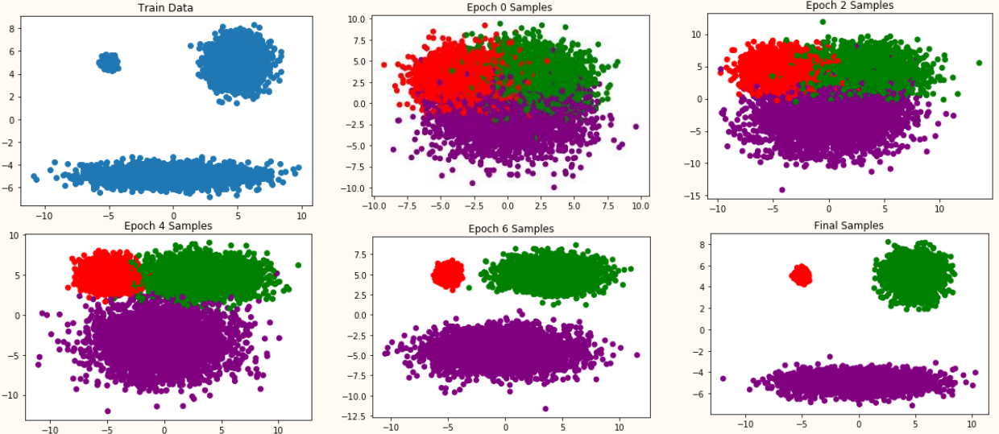
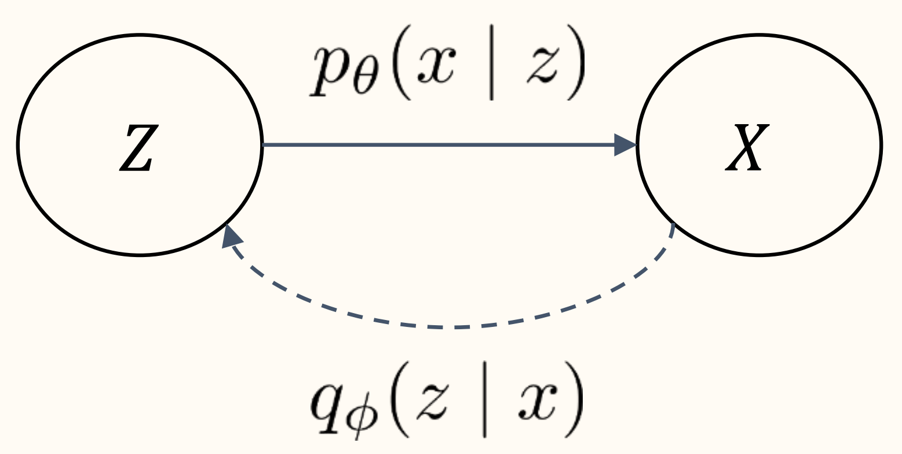

# § 11. Variational Autoencoders

**Prerequisites** : [Ch A. Appendix - Basics of Monte Carlo](./13.md)

!!! concept "Concept 11.1 : Math Review : Conditional Probabilities"
    Let $A$ and $B$ be probabilistic events. Assume $A$ has nonzero probability.

    **Conditional probability** satisfies
    
    $$
    \mathbb{P}(B \mid A) \mathbb{P}(A)=\mathbb{P}(A \cap B)
    $$

    **Bayes' theorem** is an application of conditional probability:
    
    $$
    \mathbb{P}(B \mid A)=\frac{\mathbb{P}(A \mid B) \mathbb{P}(B)}{\mathbb{P}(A)}
    $$

!!! concept "Concept 11.2 : Math Review: Conditional Densities"
    Let $X \in \mathbb{R}^{m}$ and $Z \in \mathbb{R}^{n}$ be continuous random variables with joint density $p(x, z)$.

    The marginal densities are defined by
    
    $$
    p_{X}(x)=\int_{\mathbb{R}^{n}} p(x, z) d z, \quad p_{Z}(z)=\int_{\mathbb{R}^{m}} p(x, z) d x
    $$

    The conditional density function $p(z \mid x)$ has the following properties
    
    $$
    \begin{gathered}
    \mathbb{P}(Z \in S \mid X=x)=\int_{S} p(z \mid x) d z \\
    p(z \mid x) p_{X}(x)=p(x, z), \quad p(z \mid x)=\frac{p(x \mid z) p_{Z}(z)}{p_{X}(x)}
    \end{gathered}
    $$

!!! concept "Concept 11.3 : Introduction for Variational Autoencoders (VAE)"
    Key idea of **VAE**:

    - **Latent variable model** with conditional probability distribution represented by $p_{\theta}(x \mid z)$.
    - Efficiently estimate $p_{\theta}(x)=\mathbb{E}_{Z \sim p_{Z}}\left[p_{\theta}(x \mid Z)\right]$ by **importance sampling** with $Z \sim q_{\phi}(z \mid x)$.

    We can interpret $q_{\phi}(z \mid x)$ as an encoder and $p_{\theta}(x \mid z)$ as a decoder.

    VAEs differ from autoencoders as follows:

    - Derivations (latent variable model vs. dimensionality reduction)
    - VAE regularizes/controls latent distribution, while AE does not.

{: width="80%"}

These are synthetic (fake) images made with VAE.

(A. Vahdat and J. Kautz, NVAE: A deep hierarchical variational autoencoder, NeurIPS, 2020.)

## Latent Variable Model

- Assumption on data $X_{1}, \ldots, X_{N}$

    Assumes there is an underlying latent variable $Z$ representing the "essential structure" of the data and an observable variable $X$ which generation is conditioned on $Z$. Implicitly assumes the conditional randomness of $X \sim p_{X \mid Z}$ is significantly smaller than the overall randomness $X \sim p_{X}$.

- Example

    $X$ is a cat picture. $Z$ encodes information about the body position, fur color, and facial expression of a cat. Latent variable $Z$ encodes the overall content of the image, but $X$ does contain details not specified in $Z$.

!!! definition "Definition 11.4 : Latent Variable Model"
    VAEs implements a **latent variable model** with a NN that generates $X$ given $Z$. More precisely, NN is a deterministic function that outputs the conditional distribution $p_{\theta}(x \mid Z)$, and $X$ is randomly generated according to this distribution. This structure may effectively learn the latent structure from data if the assumption on data is accurate.

    ---

    

    {: width="20%"}
    

    Sampling process:

    $$
    X \sim p_{\theta}(x \mid Z), \quad Z \sim p_{Z}(z)
    $$

    Usually $p_{Z}$ is a Gaussian (fixed) and $p_{\theta}(x \mid z)$ is a NN parameterized by $\theta$.

    Evaluating density (likelihood):

    $$
    p_{\theta}\left(X_{i}\right)=\int_{z} p_{Z}(z) p_{\theta}\left(X_{i} \mid z\right) d z=\mathbb{E}_{Z \sim p_{Z}}\left[p_{\theta}\left(X_{i} \mid Z\right)\right]
    $$

    Training via MLE:
    
    $$
    \underset{\theta \in \Theta}{\operatorname{maximize}} \sum_{i=1}^{N} \log p_{\theta}\left(X_{i}\right)=\underset{\theta \in \Theta}{\operatorname{maximize}} \sum_{i=1}^{N} \log \mathbb{E}_{Z \sim p_{Z}}\left[p_{\theta}\left(X_{i} \mid Z\right)\right]
    $$

    ---

    When $p_{Z}$ is a discrete:
    
    $$
    p_{\theta}(x)=\mathbb{E}_{Z \sim p_{Z}}\left[p_{\theta}(x \mid Z)\right]=\sum_{z} p_{Z}(z) p_{\theta}(x \mid Z)
    $$

    When $p_{Z}$ is a continuous:
    
    $$
    p_{\theta}(x)=\mathbb{E}_{Z \sim p_{Z}}\left[p_{\theta}(x \mid Z)\right]=\int_{z} p_{Z}(z) p_{\theta}(x \mid z) d z
    $$

    To clarify, specification of $p_{Z}(z)$ and $p_{\theta}(x \mid z)$ fully determines $p_{\theta}(x)$ (as above) and
    
    $$
    p_{\theta}(z \mid x)=\frac{p_{\theta}(x \mid z) p_{Z}(z)}{p_{\theta}(x)}
    $$

    ---

    Training

    $$
    \underset{\theta \in \Theta}{\operatorname{maximize}} \sum_{i=1}^{N} \log p_{\theta}\left(X_{i}\right)=\underset{\theta \in \Theta}{\operatorname{maximize}} \sum_{i=1}^{N} \log \mathbb{E}_{Z \sim p_{Z}}\left[p_{\theta}\left(X_{i} \mid Z\right)\right]
    $$
    
    requires evaluation $\mathbb{E}_{Z}$.

    - Scenario 1: If $Z$ is discrete and takes a few of values, then compute $\sum_{z}$ exactly.
    - Scenario 2: If $Z$ takes many values or if it is a continuous, then $\sum_{z}$ or $\mathbb{E}_{Z}$ is impractical to compute. In this case, approximate expectation with Monte Carlo and importance sampling.

!!! example "Example 11.5 : Example Latent Variable Model: Mixture of Gaussians"
    Mixture of 3 Gaussians in $\mathbb{R}^{2}$, uniform prior over components. (We can make the mixture weights a trainable parameter.)
    
    $$
    \begin{gathered}
    p_{Z}(Z=A)=p_{Z}(Z=B)=p_{Z}(Z=C)=\frac{1}{3} \\
    p_{\theta}(x \mid Z=k)=\frac{1}{2 \pi\left|\Sigma_{k}\right|^{\frac{1}{2}}} \exp \left(-\frac{1}{2}\left(x-\mu_{k}\right)^{\top} \Sigma_{k}^{-1}\left(x-\mu_{k}\right)\right)
    \end{gathered}
    $$

    Training objective:
    
    $$
    \begin{aligned}
    \underset{\mu, \Sigma}{\operatorname{maximize}} \sum_{i=1}^{N} \log p_{\theta}\left(X_{i}\right)=\underset{\mu, \Sigma}{\operatorname{maximize}} \sum_{i=1}^{N} \log & \left[ \frac{1}{3} \frac{1}{2 \pi\left|\Sigma_{A}\right|^{\frac{1}{2}}} \exp \left(-\frac{1}{2}\left(X_{i}-\mu_{A}\right)^{\top} \Sigma_{A}^{-1}\left(X_{i}-\mu_{A}\right)\right) \right.\\
    & +\frac{1}{3} \frac{1}{2 \pi\left|\Sigma_{B}\right|^{\frac{1}{2}}} \exp \left(-\frac{1}{2}\left(X_{i}-\mu_{B}\right)^{\top} \Sigma_{B}^{-1}\left(X_{i}-\mu_{B}\right)\right) \\
    & \left.+\frac{1}{3} \frac{1}{2 \pi\left|\Sigma_{C}\right|^{\frac{1}{2}}} \exp \left(-\frac{1}{2}\left(X_{i}-\mu_{C}\right)^{\top} \Sigma_{C}^{-1}\left(X_{i}-\mu_{C}\right)\right)\right]
    \end{aligned}
    $$

    

    {: width="100%"}
    

## Training Latent Variable Model with Importance Sampling

From now on, we will focus on **HOW** to train latent variable model with MLE,
    
$$
\underset{\theta \in \Theta}{\operatorname{maximize}} \sum_{i=1}^{N} \log p_{\theta}\left(X_{i}\right)=\underset{\theta \in \Theta}{\operatorname{maximize}} \sum_{i=1}^{N} \log \mathbb{E}_{Z \sim p_{Z}}\left[p_{\theta}\left(X_{i} \mid Z\right)\right]
$$

!!! concept "Concept 11.6 : VAE Outline"
    Outline of variational autoencoder (VAE):
    
    1. (Choice 1) Approximate intractable objective with a single $Z$ sample
        
        $$
        \sum_{i=1}^{N} \log \mathbb{E}_{Z \sim p_{Z}}\left[p_{\theta}\left(X_{i} \mid Z\right)\right] \approx \sum_{i=1}^{N} \log p_{\theta}\left(X_{i} \mid Z_{i}\right), \quad Z_{i} \sim p_{Z}
        $$
    
    2. (Choice 2) Improve accuracy of approximation by sampling $Z_{i}$ with importance sampling
        
        $$
        \sum_{i=1}^{N} \log \mathbb{E}_{Z \sim p_{Z}}\left[p_{\theta}\left(X_{i} \mid Z\right)\right] \approx \sum_{i=1}^{N} \log \frac{p_{\theta}\left(X_{i} \mid Z_{i}\right) p_{Z}\left(Z_{i}\right)}{q_{i}\left(Z_{i}\right)}, \quad Z_{i} \sim q_{i}
        $$
    
    3. Optimize approximate objective with SGD.
 
    (D. Kingma and M. Welling, VAE: Auto-encoding variational Bayes, ICLR, 2014.)

!!! concept "Concept 11.7 : IWAE Outline"
    Importance weighted autoencoders (IWAE) approximates intractable with $K$ samples of $Z$ :
    
    $$
    \sum_{i=1}^{N} \log \mathbb{E}_{Z \sim p_{Z}}\left[p_{\theta}\left(X_{i} \mid Z\right)\right] \approx \sum_{i=1}^{N} \log \frac{1}{K} \sum_{k=1}^{K} \frac{p_{\theta}\left(X_{i} \mid Z_{i, k}\right) p_{Z}\left(Z_{i, k}\right)}{q_{i}\left(Z_{i, k}\right)}, \quad Z_{i, 1}, \ldots, Z_{i, K} \sim q_{i}
    $$

    (Y. Burda, R. Grosse, and R. Salakhutdinov, Importance weighted autoencoders, ICLR, 2016.)

!!! concept "Concept 11.8 : Why does VAE need IS?"
    Among the two choices given in **Concept 11.6**, VAEs improve the accuracy of latent variable model with IS (Choice 2).

    Sampling $Z_{i} \sim p_{Z}$ (Choice 1) results in a high-variance estimator:
    
    $$
    \mathbb{E}_{Z \sim p_{Z}}\left[p_{\theta}\left(X_{i} \mid Z\right)\right] \approx p_{\theta}\left(X_{i} \mid Z_{i}\right),
    $$

    In the Gaussian mixture example (**Example 11.5**), only $1 / 3$ of the $Z$ samples meaningfully contribute to the estimate. More specifically, if $X_{i}$ is near $\mu_{A}$ but is far from $\mu_{B}$ and $\mu_{C}$, then $p_{\theta}\left(X_{i} \mid Z=A\right) \gg 0$ but $p_{\theta}\left(X_{i} \mid Z=B\right) \approx 0$ and $p_{\theta}\left(X_{i} \mid Z=C\right) \approx 0$.

    The issue worsens as the observable and latent variable dimension increases.

---

!!! concept "Concept 11.9 : Naïve Approach : Naïvely using IS for each $X_{i}$"
    To improve estimation of $\mathbb{E}_{Z \sim p_{Z}}\left[p_{\theta}\left(X_{i} \mid Z\right)\right]$, consider importance sampling (IS) with sampling distribution $Z_{i} \sim q_{i}(z)$ :
    
    $$
    \mathbb{E}_{Z \sim p_{Z}}\left[p_{\theta}\left(X_{i} \mid Z\right)\right] \approx p_{\theta}\left(X_{i} \mid Z_{i}\right) \frac{p_{Z}\left(Z_{i}\right)}{q_{i}\left(Z_{i}\right)}
    $$

    Optimal IS sampling distribution
    
    $$
    q_{i}^{\star}(z)=\frac{p_{\theta}\left(X_{i} \mid z\right) p_{Z}(z)}{\textcolor{red}{p_{\theta}\left(X_{i}\right)}}=\textcolor{red}{p_{\theta}\left(z \mid X_{i}\right)}
    $$

    To clarify, optimal sampling distribution depends on $X_{i}$.
    To clarify, $\textcolor{red}{p_{\theta}\left(X_{i}\right)}$ is the unkown normalizing factor so $\textcolor{red}{p_{\theta}\left(z \mid X_{i}\right)}$ is also unkown.
    We call $q_{i}^{\star}(z)=p_{\theta}\left(z \mid X_{i}\right)$ the true **posterior** distribution and we will soon consider the approximation $q_{\phi}(z \mid x) \approx p_{\theta}(z \mid x)$, which we call the **approximate posterior**.

    ---

    For each $X_{i}$, let $q_i(z)$ be the optimal approximate posterior dependent on $X_i$, and consider
    
    $$
    \begin{gathered}
    \underset{q_{i}}{\operatorname{minimize}} D_{\mathrm{KL}}\left(q_{i}(\cdot) \| \textcolor{red}{p_{\theta}\left(\cdot \mid X_{i}\right)} \right)\\
    =\underset{q_{i}}{\operatorname{minimize}} \mathbb{E}_{Z \sim q_{i}} \log \left(\frac{q_{i}(Z)}{\textcolor{red}{p_{\theta}\left(Z \mid X_{i}\right)}}\right) \\
    =\underset{q_{i}}{\operatorname{minimize}} \mathbb{E}_{Z \sim q_{i}} \log \left(\frac{q_{i}(Z)}{p_{\theta}\left(X_{i} \mid Z\right) p_{Z}(Z) / \textcolor{red}{p_{\theta}\left(X_{i}\right)}}\right) \\
    =\underset{Z \sim q_{i}}{\operatorname{minimize}}\left[\log q_{i}(Z)-\log p_{Z}(Z)-\log p_{\theta}\left(X_{i} \mid Z\right)\right]+\textcolor{red}{\log p_{\theta}\left(X_{i}\right)}
    \end{gathered}
    $$

    Note, $q_{i}(z), p_{Z}(z)$, and $p_{\theta}(x \mid z)$ are tractable/known while $\textcolor{red}{p_{\theta}\left(X_{i}\right)}$ and $\textcolor{red}{p_{\theta}\left(z \mid X_{i}\right)}$ are intractable/unknown. Since $\textcolor{red}{\log p_{\theta}\left(X_{i}\right)}$ does not depend on $q_{i}$, all quantities needed in the optimization problems are tractable. However, solving this minimization problem to obtain each $q_{i}$ for each data point $X_{i}$ is computationally too expensive.

    ---

    Individual inference (not amortized): For each $X_{1}, \ldots, X_{N}$, find corresponding optimal $q_{1}, \ldots, q_{N}$ by solving
    
    $$
    \underset{q_{i}}{\operatorname{minimize}} \quad D_{\mathrm{KL}}\left(q_{i}(\cdot) \| p_{\theta}\left(\cdot \mid X_{i}\right)\right)
    $$

    This is expensive as it requires solving $N$ separate optimization problems.

    We need variational approach and amortized inference.

!!! concept "Concept 11.10 : Variational Approach and Amortized Inference"

    General principle of variational approach: We can't directly use the $q$ we want. So, instead, we propose a parameterized distribution $q_{\phi}$ that we can work with easily (in this case, sample from easily), and find a parameter setting that makes it as good as possible.

    Parametrization of VAE:
    
    $$
    q_{\phi}\left(z \mid X_{i}\right) \approx q_{i}^{\star}(z)=p_{\theta}\left(z \mid X_{i}\right) \quad \text { for all } i=1, \ldots, N
    $$

    Amortized inference: Train a neural network $q_{\phi}(\cdot \mid x)$ such that $q_{\phi}\left(\cdot \mid X_{i}\right)$ approximates the optimal $q_{i}(\cdot)$.
    
    $$
    \underset{\phi \in \Phi}{\operatorname{minimize}} \sum_{i=1}^{N} D_{\mathrm{KL}}\left(q_{\phi}\left(\cdot \mid X_{i}\right) \| p_{\theta}\left(\cdot \mid X_{i}\right)\right)
    $$

    Approximation $q_{\phi}\left(z \mid X_{i}\right) \approx p_{\theta}\left(z \mid X_{i}\right)$ is often less precise than that of individual inference $q_{i}(z) \approx$ $p_{\theta}\left(z \mid X_{i}\right)$, but amortized inference is often significantly faster.

!!! concept "Concept 11.11 : Encoder $q_{\phi}$ Optimization"
    In analogy with autoencoders, we call $q_{\phi}$ the **encoder**.

    Optimization problem for encoder (derived from **Concept 11.9**) :
    
    $$
    \begin{aligned}
    & \underset{\phi \in \Phi}{\operatorname{minimize}} \sum_{i=1}^{N} D_{\mathrm{KL}}\left(q_{\phi}\left(\cdot \mid X_{i}\right) \| p_{\theta}\left(\cdot \mid X_{i}\right)\right) \\
    = & \underset{\phi \in \Phi}{\operatorname{maximize}} \sum_{i=1}^{N} \mathbb{E}_{Z \sim q_{\phi}\left(z \mid X_{i}\right)}\left[\log \left(\frac{p_{\theta}\left(X_{i} \mid Z\right) p_{Z}(Z)}{q_{\phi}\left(Z \mid X_{i}\right)}\right)\right]+\text { constant independent of } \phi \\
    = & \underset{\phi \in \Phi}{\operatorname{maximize}} \sum_{i=1}^{N} \mathbb{E}_{Z \sim q_{\phi}\left(z \mid X_{i}\right)}\left[\log p_{\theta}\left(X_{i} \mid Z\right)\right]-D_{\mathrm{KL}}\left(q_{\phi}\left(\cdot \mid X_{i}\right) \| p_{Z}(\cdot)\right)
    \end{aligned}
    $$

!!! concept "Concept 11.12 : Decoder $p_{\theta}$ Optimization"
    
    In analogy with autoencoders, we call $p_{\theta}$ the **decoder**.
    Perform approximate MLE (derived from IS, Choice 2 of **Concept 11.6**) :
    
    $$
    \begin{aligned}
    & \underset{\theta \in \Theta}{\operatorname{maximize}} \sum_{i=1}^{N} \log p_{\theta}\left(X_{i}\right)=\underset{\theta \in \Theta}{\operatorname{maximize}} \sum_{i=1}^{N} \log \mathbb{E}_{Z \sim p_{Z}}\left[p_{\theta}\left(X_{i} \mid Z\right)\right] \\
    \stackrel{(a)}{\approx} & \underset{\theta \in \Theta}{\operatorname{maximize}} \sum_{i=1}^{N} \log \left(\frac{p_{\theta}\left(X_{i} \mid Z_{i}\right) p_{Z}\left(Z_{i}\right)}{q_{\phi}\left(Z_{i} \mid X_{i}\right)}\right), \quad Z_{i} \sim q_{\phi}\left(z \mid X_{i}\right) \\
    \stackrel{(b)}{\approx} & \underset{\theta \in \Theta}{\operatorname{maximize}} \sum_{i=1}^{N} \mathbb{E}_{Z \sim q_{\phi}\left(z \mid X_{i}\right)}\left[\log \left(\frac{p_{\theta}\left(X_{i} \mid Z\right) p_{Z}(Z)}{q_{\phi}\left(Z \mid X_{i}\right)}\right)\right] \\
    = & \underset{\theta \in \Theta}{\operatorname{maximize}} \sum_{i=1}^{N} \mathbb{E}_{Z \sim q_{\phi}\left(z \mid X_{i}\right)}\left[\log p_{\theta}\left(X_{i} \mid Z\right)\right]-D_{\mathrm{KL}}\left(q_{\phi}\left(\cdot \mid X_{i}\right) \| p_{Z}(\cdot)\right)
    \end{aligned}
    $$

    The $\stackrel{(a)}{\approx}$ step replaces expectation inside the log with an estimate with $Z_{i}$.
    The $\stackrel{(b)}{\approx}$ step replaces the random variable with the expectation.
    These steps take $\mathbb{E}_{Z}$ outside of the log (which can not be normally done).
    More on this later (**Concept 11.14**).

## Definition of VAE

!!! definition "Definition 11.13 : Variational Lower Bound (VLB)"
    The optimization objectives for the encoder (**Concept 11.11**) and decoder (**Concept 11.12**) are the same!

    Simultaneously train $p_{\theta}$ and $q_{\phi}$ by solving
    
    $$
    \underset{\theta \in \Theta, \phi \in \Phi}{\operatorname{maximize}} \sum_{i=1}^{N} \underbrace{\mathbb{E}_{Z \sim q_{\phi}\left(z \mid X_{i}\right)}\left[\log p_{\theta}\left(X_{i} \mid Z\right)\right]-D_{\mathrm{KL}}\left(q_{\phi}\left(\cdot \mid X_{i}\right) \| p_{Z}(\cdot)\right)}_{\stackrel{\text { def }}{=} \mathrm{VLB}_{\theta, \phi}\left(X_{i}\right)}
    $$

    We refer to the optimization objective as the **variational lower bound (VLB)** or **evidence lower bound (ELBO)** for reasons that will be explained soon (**Concept 11.14**).

!!! concept "Concept 11.14 : How tight lower bound is the VLB?"
    How accurate is the approximation?
    
    $$
    \begin{aligned}
    & \underset{\theta \in \Theta}{\operatorname{maximize}} \sum_{i=1}^{N} \log p_{\theta}\left(X_{i}\right)=\underset{\theta \in \Theta}{\operatorname{maximize}} \sum_{i=1}^{N} \log \mathbb{E}_{Z \sim q_{\phi}\left(z \mid X_{i}\right)}\left[\frac{p_{\theta}\left(X_{i} \mid Z\right) p_{Z}(Z)}{q_{\phi}\left(Z \mid X_{i}\right)}\right] \\
    & \stackrel{?}{\approx} \underset{\theta \in \Theta, \phi \in \Phi}{\operatorname{maximize}} \sum_{i=1}^{N} \mathbb{E}_{Z \sim q_{\phi}\left(z \mid X_{i}\right)}\left[\log \left(\frac{p_{\theta}\left(X_{i} \mid Z\right) p_{Z}(Z)}{q_{\phi}\left(Z \mid X_{i}\right)}\right)\right] \\
    &=\underset{\theta \in \Theta, \phi \in \Phi}{\operatorname{maximize}} \sum_{i=1}^{N} \operatorname{VLB}_{\theta, \phi}\left(X_{i}\right)
    \end{aligned}
    $$

    This turns out that 
    
    $$
    \log p_{\theta}\left(X_{i}\right) \geq \operatorname{VLB}_{\theta, \phi}\left(X_{i}\right)
    $$
    
    So we are maximizing a lower bound of the log likelihood. How large is the gap?

    ---

    - Log-likelihood $\geq$ VLB: Derivation 1

    !!! proof
        Derivation via Jensen inequality:

        $$
        \begin{aligned}
        \log p_{\theta}\left(X_{i}\right) & =\log \mathbb{E}_{Z \sim p_{Z}}\left[p_{\theta}\left(X_{i} \mid Z\right)\right] \\
        & =\log \left(\mathbb{E}_{Z \sim q_{\phi}\left(Z \mid X_{i}\right)}\left[p_{\theta}\left(X_{i} \mid Z\right) \frac{p_{Z}(Z)}{q_{\phi}\left(Z \mid X_{i}\right)}\right]\right) \\
        & \geq \mathbb{E}_{Z \sim q_{\phi}\left(Z \mid X_{i}\right)}\left[\log \left(p_{\theta}\left(X_{i} \mid Z\right) \frac{p_{Z}(Z)}{q_{\phi}\left(Z \mid X_{i}\right)}\right)\right] \\
        & \stackrel{\text { def }}{=} \mathrm{VLB}_{\theta, \phi}\left(X_{i}\right)
        \end{aligned}
        $$

    Does not explicitly characterize gap.

    ---

    - Log-likelihood $\geq$ VLB: Derivation 2

    !!! proof    
        Derivation via KL divergence:
        
        $$
        \begin{aligned}
        D_{\mathrm{KL}}\left[q_{\phi}\left(\cdot \mid X_{i}\right) \| p_{\theta}\left(\cdot \mid X_{i}\right)\right] & =\mathbb{E}_{Z \sim q_{\theta}\left(z \mid X_{i}\right)}\left[\log q_{\theta}\left(Z \mid X_{i}\right)-\log p_{\theta}\left(Z \mid X_{i}\right)\right] \\
        & =\underbrace{\mathbb{E}_{Z \sim q_{\theta}\left(z \mid X_{i}\right)}\left[\log q_{\theta}\left(Z \mid X_{i}\right)-\log p_{Z}(Z)-\log p_{\theta}\left(X_{i} \mid Z\right)\right]}_{=-\mathrm{VLB}_{\theta, \phi}\left(X_{i}\right)}+\log p_{\theta}\left(X_{i}\right)
        \end{aligned}
        $$
        
        and
        
        $$
        \begin{aligned}
        \log p_{\theta}\left(X_{i}\right) &= \operatorname{VLB}_{\theta, \phi}\left(X_{i}\right)+\underbrace{D_{\mathrm{KL}}\left[q_{\phi}\left(\cdot \mid X_{i}\right) \| p_{\theta}\left(\cdot \mid X_{i}\right)\right]}_{\geq 0} \\
        & \geq \operatorname{VLB}_{\theta, \phi}\left(X_{i}\right)
        \end{aligned}
        $$

    This derivation explicitly characterizes the gap as $D_{\mathrm{KL}}\left[q_{\phi}\left(\cdot \mid X_{i}\right) \| p_{\theta}\left(\cdot \mid X_{i}\right)\right]$.

    $$
    \log p_{\theta}\left(X_{i}\right) - \operatorname{VLB}_{\theta, \phi}\left(X_{i}\right) = D_{\mathrm{KL}}\left[q_{\phi}\left(\cdot \mid X_{i}\right) \| p_{\theta}\left(\cdot \mid X_{i}\right)\right]
    $$

!!! concept "Concept 11.15 : VLB is tight if encoder is infinitely powerful."
    If the encoder $q_{\phi}$ is powerful enough such that there is a $\phi^{\star}$ achieving
    
    $$
    q_{\phi^{\star}}\left(\cdot \mid X_{i}\right)=p_{\theta}\left(\cdot \mid X_{i}\right)
    $$
    
    or equivalently
    
    $$
    D_{\mathrm{KL}}\left[q_{\phi^{\star}}\left(\cdot \mid X_{i}\right) \| p_{\theta}\left(\cdot \mid X_{i}\right)\right]=0
    $$

    Then
    
    $$
    \underset{\theta \in \Theta}{\operatorname{maximize}} \sum_{i=1}^{N} \log p_{\theta}\left(X_{i}\right)=\underset{\theta \in \Theta, \phi \in \Phi}{\operatorname{maximize}} \sum_{i=1}^{N} \operatorname{VLB}_{\theta, \phi}\left(X_{i}\right)
    $$

!!! definition "Definition 11.16 : Variational Autoencoder (VAE) Terminology"
    
    

    {: width="50%"}
    

    - **Likelihood** : $\textcolor{red}{p_{\theta}(x)}$ (exact evaluation intractable)
    - **Prior** : $p_{Z}(z)$
    - **Conditional distribution (decoder)** : $p_{\theta}(x \mid z)$
    - **True posterior** : $\textcolor{red}{p_{\theta}(z \mid x)}$ (exact evaluation intractable)
    - **Approximate posterior (encoder)** : $q_{\phi}(z \mid x)$
    
    ---

    Conditional distribution $p_{\theta}(x \mid z)$ and prior $p_{Z}(z)$ determines the posterior $p_{\theta}(z \mid x)$.

    There is no easy way to evaluate $p_{\theta}(x)$, but we can sample $X \sim p_{\theta}(x)$ easily: $Z \sim p_{Z}(z)$ then $X \sim p_{\theta}(x \mid Z)$.

    NN in VAE do not directly generate random output. NN outputs parameters for random sampling.

## VAE Standard Instance

!!! definition "Definition 11.17 : VAE Standard Instance"

    A **standard VAE setup**:
    
    $$
    \begin{aligned}
    & p_{Z}=\mathcal{N}(0, I) \\
    & q_{\phi}(z \mid x)=\mathcal{N}\left(\mu_{\phi}(x), \Sigma_{\phi}(x)\right) \text { with diagonal } \Sigma_{\phi} \\
    & p_{\theta}(x \mid z)=\mathcal{N}\left(f_{\theta}(z), \sigma^{2} I\right)
    \end{aligned}
    $$
    
    $\mu_{\phi}(x), \Sigma_{\phi}^{2}(x)$, and $f_{\theta}(z)$ are deterministic NN.

    ---

    Using the following equation,

    $$
    \begin{aligned}
    & D_{\mathrm{KL}}\left(\mathcal{N}\left(\mu_{\phi}(X), \Sigma_{\phi}(X)\right) \| \mathcal{N}(0, I)\right) \\
    = & \frac{1}{2}\left(\operatorname{tr}\left(\Sigma_{\phi}(X)\right)+\left\|\mu_{\phi}(X)\right\|^{2}-d-\log \operatorname{det}\left(\Sigma_{\phi}(X)\right)\right) \\
    \end{aligned}
    $$
    
    the training objective
    
    $$
    \underset{\theta \in \Theta, \phi \in \Phi}{\operatorname{maximize}} \sum_{i=1}^{N} \mathbb{E}_{Z \sim q_{\phi}\left(z \mid X_{i}\right)}\left[\log p_{\theta}\left(X_{i} \mid Z\right)\right]-D_{\mathrm{KL}}\left(q_{\phi}\left(\cdot \mid X_{i}\right) \| p_{Z}(\cdot)\right)
    $$
    
    becomes
    
    $$
    \underset{\theta \in \Theta, \phi \in \Phi}{\operatorname{minimize}} \sum_{i=1}^{N} \frac{1}{\sigma^{2}} \mathbb{E}_{Z \sim \mathcal{N}\left(\mu_{\phi}\left(X_{i}\right), \Sigma_{\phi}\left(X_{i}\right)\right)}\left\|X_{i}-f_{\theta}(Z)\right\|^{2}+\operatorname{tr}\left(\Sigma_{\phi}\left(X_{i}\right)\right)+\left\|\mu_{\phi}\left(X_{i}\right)\right\|^{2}-\log \operatorname{det}\left(\Sigma_{\phi}\left(X_{i}\right)\right)
    $$

!!! concept "Concept 11.18 : VAE Standard Instance with Reparameterization Trick"
    The standard instance of VAE
    
    $$
    \underset{\theta \in \Theta, \phi \in \Phi}{\operatorname{minimize}} \sum_{i=1}^{N} \frac{1}{\sigma^{2}} \mathbb{E}_{Z \sim \mathcal{N}\left(\mu_{\phi}\left(X_{i}\right), \Sigma_{\phi}\left(X_{i}\right)\right)}\left\|X_{i}-f_{\theta}(Z)\right\|^{2}+\operatorname{tr}\left(\Sigma_{\phi}\left(X_{i}\right)\right)+\left\|\mu_{\phi}\left(X_{i}\right)\right\|^{2}-\log \operatorname{det}\left(\Sigma_{\phi}\left(X_{i}\right)\right)
    $$

    can be equivalently written with the reparameterization trick
    
    $$
    \underset{\theta \in \Theta, \phi \in \Phi}{\operatorname{minimize}} \sum_{i=1}^{N} \frac{1}{\sigma^{2}} \mathbb{E}_{\varepsilon \sim \mathcal{N}(0, I)}\left\|X_{i}-f_{\theta}\left(\mu_{\phi}\left(X_{i}\right)+\Sigma_{\phi}^{1 / 2}\left(X_{i}\right) \varepsilon\right)\right\|^{2}+\operatorname{tr}\left(\Sigma_{\phi}\left(X_{i}\right)\right)+\left\|\mu_{\phi}\left(X_{i}\right)\right\|^{2}-\log \operatorname{det}\left(\Sigma_{\phi}\left(X_{i}\right)\right)
    $$

    where $\Sigma_{\phi}^{1 / 2}$ is diagonal with $\sqrt{\cdot}$ of the diagonal elements of $\Sigma_{\phi}$.
    (Remember, $\Sigma_{\phi}$ is diagonal.)

    To clarify $Z \stackrel{\mathcal{D}}{=} \mu_{\phi}\left(X_{i}\right)+\Sigma_{\phi}^{1 / 2}\left(X_{i}\right) \varepsilon$, where $\stackrel{\mathcal{D}}{=}$ denotes equality in distribution.

    We now have an objective amenable to stochastic optimization.

!!! concept "Concept 11.19 : VAE Standard Instance Architecture"
    - Training (Without reparameterization trick)
    
    

    {: width="70%"}
    

    - Training (With reparameterization trick)
    
    

    {: width="70%"}
    

    ---

    - Sampling
    
        During sampling, only the decoder network is used.

    

    {: width="40%"}
    

!!! concept "Concept 11.20 : Why variational "autoencoder"?"
    VAE loss (VLB) contains a reconstruction loss resembling that of an autoencoder.
    
    $$
    \begin{aligned}
    \operatorname{VLB}_{\theta, \phi}\left(X_{i}\right) & =\mathbb{E}_{Z \sim q_{\phi}\left(z \mid X_{i}\right)}\left[\log p_{\theta}\left(X_{i} \mid Z\right)\right]-D_{\mathrm{KL}}\left(q_{\phi}\left(\cdot \mid X_{i}\right) \| p_{Z}(\cdot)\right) \\
    & =-\frac{1}{2 \sigma^{2}} \mathbb{E}_{Z \sim q_{\phi}\left(z \mid X_{i}\right)}\left[\left\|X_{i}-f_{\theta}(Z)\right\|^{2}\right]-D_{\mathrm{KL}}\left(q_{\phi}\left(\cdot \mid X_{i}\right) \| p_{Z}(\cdot)\right) \\
    & =-\underbrace{\frac{1}{2 \sigma^{2}} \mathbb{E}_{\varepsilon \sim \mathcal{N}(0, I)}\left\|X_{i}-f_{\theta}\left(\mu_{\phi}\left(X_{i}\right)+\Sigma_{\phi}^{1 / 2}\left(X_{i}\right) \varepsilon\right)\right\|^{2}}_{\text {Reconstruction loss }}-\underbrace{D_{\mathrm{KL}}\left(q_{\phi}\left(\cdot \mid X_{i}\right) \| p_{Z}(\cdot)\right)}_{\text {Regularization }}
    \end{aligned}
    $$

    VLB also contains a regularization term on the output of the encoder, which is not present in standard autoencoder losses.

    The choice of $\sigma$ determines the relative weight between the reconstruction loss and the regularization.

## Training VAE

!!! concept "Concept 11.21 : Training VAE with RT"
    To obtain stochastic gradients of the VAE standard instance 
    
    $$
    \underset{\theta \in \Theta, \phi \in \Phi}{\operatorname{minimize}} \sum_{i=1}^{N} \frac{1}{\sigma^{2}} \mathbb{E}_{\varepsilon \sim \mathcal{N}(0, I)}\left\|X_{i}-f_{\theta}\left(\mu_{\phi}\left(X_{i}\right)+\Sigma_{\phi}^{1 / 2}\left(X_{i}\right) \varepsilon\right)\right\|^{2}+\operatorname{tr}\left(\Sigma_{\phi}\left(X_{i}\right)\right)+\left\|\mu_{\phi}\left(X_{i}\right)\right\|^{2}-\log \operatorname{det}\left(\Sigma_{\phi}\left(X_{i}\right)\right)
    $$

    select a data $X_{i}$, sample $\varepsilon_{i} \sim \mathcal{N}(0, I)$, evaluate
    
    $$
    -\operatorname{VLB}_{\theta, \phi}\left(X_{i}, \varepsilon_{i}\right) \stackrel{\text { def }}{=} \frac{1}{\sigma^{2}}\left\|X_{i}-f_{\theta}\left(\mu_{\phi}\left(X_{i}\right)+\Sigma_{\phi}^{1 / 2}\left(X_{i}\right) \varepsilon_{i}\right)\right\|^{2}+\operatorname{tr}\left(\Sigma_{\phi}\left(X_{i}\right)\right)+\left\|\mu_{\phi}\left(X_{i}\right)\right\|^{2}-\log \operatorname{det}\left(\Sigma_{\phi}\left(X_{i}\right)\right)
    $$
    
    and backprop on $\operatorname{VLB}_{\theta, \phi}\left(X_{i}, \varepsilon_{i}\right)$.

    Usually, batch of $X_{i}$ is selected.  
    One can sample multiple $Z_{i, 1}, \ldots, Z_{i, K}$ (equivalently $\varepsilon_{i, 1}, \ldots, \varepsilon_{i, K}$ ) for each $X_{i}$.

!!! concept "Concept 11.22 : Traning VAE with Log-Derivative Trick"
    Computing stochastic gradients without the reparameterization trick.
    
    $$
    \underset{\theta \in \Theta, \phi \in \Phi}{\operatorname{maximize}} \sum_{i=1}^{N} \underbrace{\mathbb{E}_{Z \sim q_{\phi}\left(z \mid X_{i}\right)}\left[\log \left(\frac{p_{\theta}\left(X_{i} \mid Z\right) p_{Z}(Z)}{q_{\phi}\left(Z \mid X_{i}\right)}\right)\right]}_{\stackrel{\text { def }}{=} \operatorname{VLB}_{\theta, \phi}\left(X_{i}\right)}
    $$

    To obtain unbiased estimates of $\nabla_{\theta}$, compute
    
    $$
    \frac{1}{K} \sum_{k=1}^{K} \log p_{\theta}\left(X_{i} \mid Z_{i, k}\right), \quad Z_{i, 1}, \ldots, Z_{i, K} \sim q_{\phi}\left(z \mid X_{i}\right)
    $$
    
    and backprop with respect to $\theta$.

    We differentiate the VLB objectives
    
    $$
    \begin{aligned}
    \nabla_{\phi} \mathbb{E}_{Z \sim q_{\phi}\left(z \mid X_{i}\right)}\left[\log \left(\frac{p_{\theta}\left(X_{i} \mid Z\right) p_{Z}(Z)}{q_{\phi}\left(Z \mid X_{i}\right)}\right)\right] & =\nabla_{\phi} \int \log \left(\frac{p_{\theta}\left(X_{i} \mid z\right) p_{Z}(z)}{q_{\phi}\left(z \mid X_{i}\right)}\right) q_{\phi}\left(z \mid X_{i}\right) d z \\
    & =\mathbb{E}_{Z \sim q_{\phi}\left(z \mid X_{i}\right)}\left[\left(\nabla_{\phi} \log q_{\phi}\left(Z \mid X_{i}\right)\right) \log \left(\frac{p_{\theta}\left(X_{i} \mid Z\right) p_{Z}(Z)}{q_{\phi}\left(Z \mid X_{i}\right)}\right)\right]
    \end{aligned}
    $$

    To obtain unbiased estimates of $\nabla_{\phi}$, compute
    
    $$
    \frac{1}{K} \sum_{k=1}^{K}\left(\nabla_{\phi} \log q_{\phi}\left(Z_{i, k} \mid X_{i}\right)\right) \log \left(\frac{p_{\theta}\left(X_{i} \mid Z_{i, k}\right) p_{Z}\left(Z_{i, k}\right)}{q_{\phi}\left(Z_{i, k} \mid X_{i}\right)}\right), \quad Z_{i, 1}, \ldots, Z_{i, K} \sim q_{\phi}\left(z \mid X_{i}\right)
    $$

## Researches

!!! concept "Concept 11.23 : VQ-VAE"
    

    {: width="100%"}
    {: width="100%"}
    

    (A. van den Oord, O. Vinyals, and K. Kavukcuoglu, Neural discrete representation learning, NeurIPS, 2017.)

!!! concept "Concept 11.24 : VQ-VAE-2"
    

    {: width="50%"}
    {: width="70%"}
    {: width="100%"}
    

    (A. Razavi, A. van den Oord, and O. Vinyals, Generating diverse high-fidelity images with VQ-VAE-2, NeurIPS, 2019.)

!!! concept "Concept 11.25 : $\beta$-VAE"
    Uses the loss

    $$
    \ell_{\theta, \phi}\left(X_{i}\right)=\mathbb{E}_{Z \sim q_{\phi}\left(z \mid X_{i}\right)}\left[\log p_{\theta}\left(X_{i} \mid Z\right)\right]-\beta D_{\mathrm{KL}}\left(q_{\phi}\left(\cdot \mid X_{i}\right) \| p_{Z}(\cdot)\right)
    $$
    
    when $\beta=1, \ell_{\theta, \phi}\left(X_{i}\right)=\operatorname{VLB}_{\theta, \phi}\left(X_{i}\right)$, i.e., $\beta$-VAE coincides with VAE when $\beta=1$.

    With $\beta>1$, authors observed better feature disentanglement.
    
    (I. Higgins, L. Matthey, A. Pal, C. Burgess, X. Glorot, M. Botvinick, S. Mohamed, and A. Lerchner, β-VAE: Learning basic visual concepts with a constrained variational framework, ICLR, 2017.)