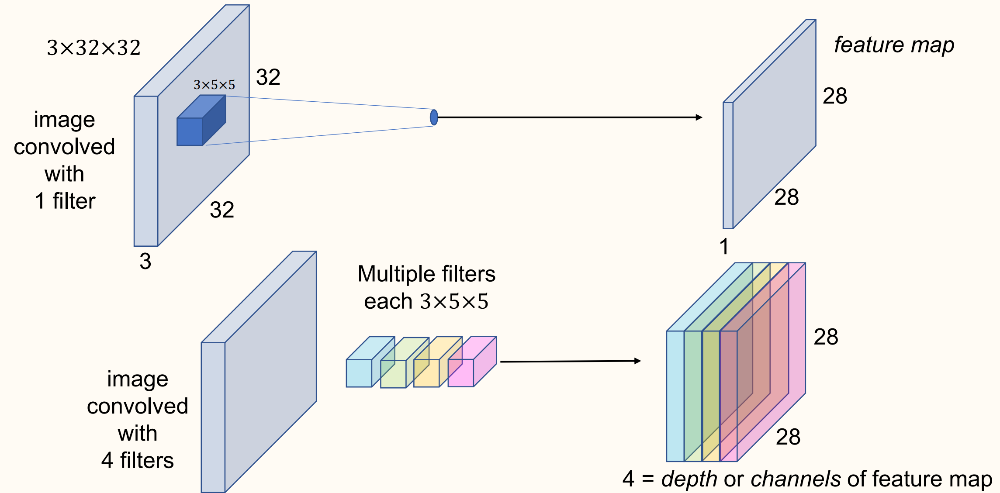
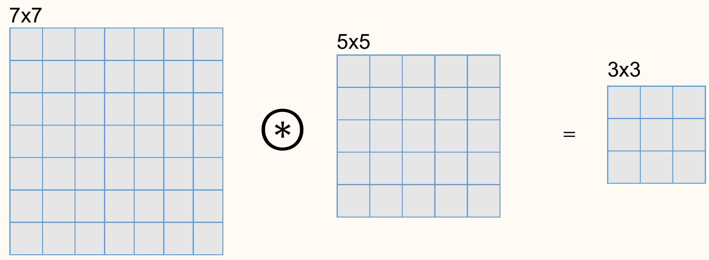
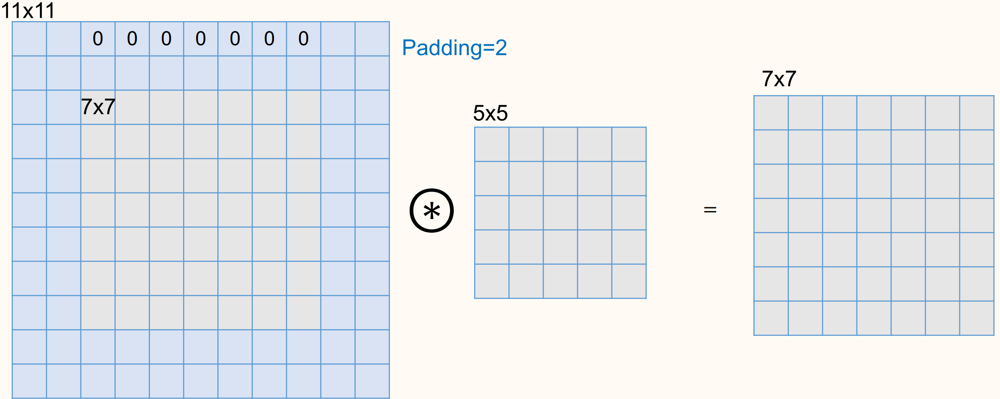
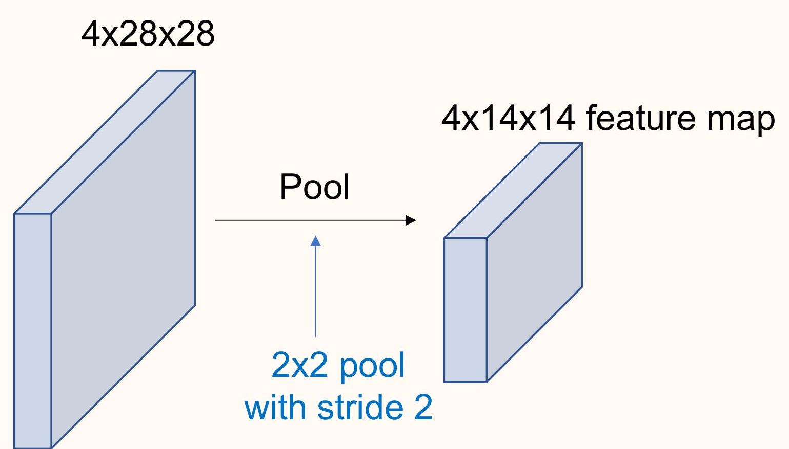
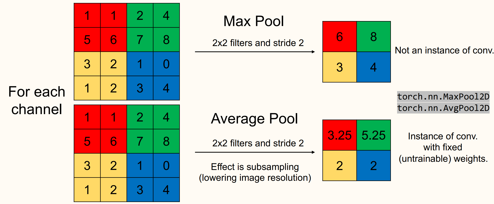
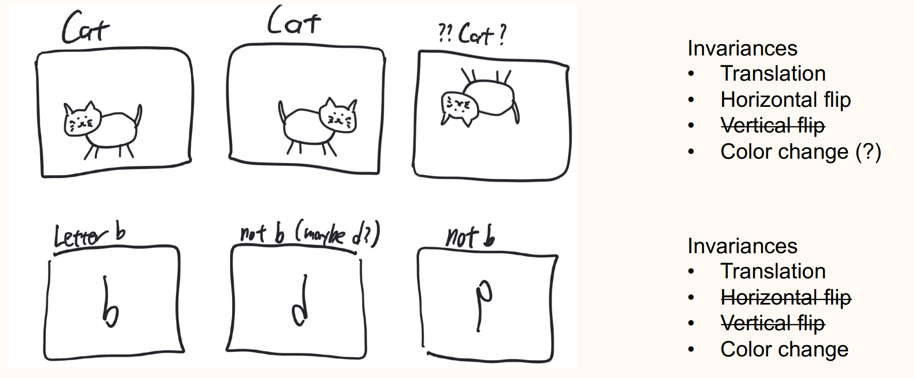
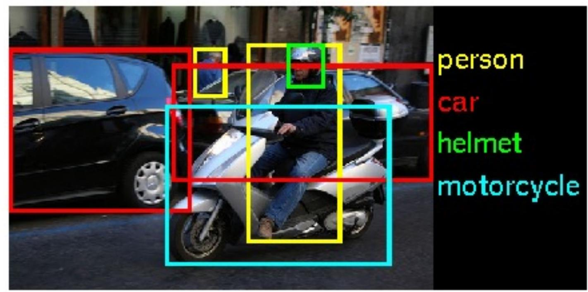

# § 5. Convolutional Neural Networks

## Convolutional Layers

!!! concept "Concept 5.1 : Pros and Cons of Fully Connected Layers"
    Advantages of fully connected layers:

    - Simple.
    - Very general, in theory. (Sufficiently large MLPs can learn any function, in theory.)

    Disadvantage of fully connected layers:

    - Too many trainable parameters.
    - Does not encode shift equivariance/invariance and therefore has poor inductive bias. (More on this later.)

!!! concept "Concept 5.2 : Shift Equivarience/Invariance in Vision"
    Many tasks in vision are equivariant/invariant with respect shifts/translations.

    

    {: width="75%"}
    

    Roughly speaking, equivariance/invariance means shifting the object does not change the meaning (it only changes the position).

    Logistic regression (with a single fully connected layer) does not encode shift invariance.

    Since convolution is equivariant with respect to translations, constructing neural network layers with them is a natural choice.

!!! definition "Definition 5.3 : 2D Convolutional Layer"
    - $B$ : batch size
    - $C_{\text{in}}$ : # of input channels
    - $C_{\text{out}}$ : # of output channels
    - $m, n$ : # of vertical and horizontal indices of input
    - $f_1, f_2$ : # of vertical and horizontal indices of filter
    
    ---

    - Input tensor : $X \in \mathbb{R}^{B \times C_{\text {in }} \times m \times n}$
    - Output tensor : $Y \in \mathbb{R}^{B \times C_{\text {out }} \times\left(m-f_{1}+1\right) \times\left(n-f_{2}+1\right)}$
    - Filter : $w \in \mathbb{R}^{C_{\text {out }} \times C_{\text {in }} \times f_{1} \times f_{2}}$
    - Bias : $b \in \mathbb{R}^{C_{\text{out}}}$

    ---

    For $k = 1, \dots, B, \quad \ell = 1, \dots, C_{\text{out}}, \quad i = 1, \dots, m-f_1+1, \quad j = 1, \dots, n-f_2+1$:

    $$
    Y_{k, \ell, i, j}=\sum_{\gamma=1}^{c_{\text {in }}} \sum_{\alpha=1}^{f_{1}} \sum_{\beta=1}^{f_{2}} w_{\ell, \gamma, \alpha, \beta} X_{k, \gamma, i+\alpha-1, j+\beta-1}+b_{\ell}
    $$

    Operation is independent across elements of the batch.
    The vertical and horizontal indices are referred to as spatial dimensions.
    If `bias=False`, then $b=0$.

    ---

    Convolve a filter with an image : slide the filter spatially over the image and compute dot products.

    Take a $C_{\text {in }} \times f_{1} \times f_{2}$ chunk of the image and take the inner product with $w$ and add bias $b$.

!!! example "Example 5.4 : Example of 2D Convolutional Layer"
    

    {: width="100%"}
    

    - $B = 1, C_{\text{in}} = 3, C_{\text{out}} = 4, m=n=32, f_1=f_2=5$
    - Input tensor : $X \in \mathbb{R}^{1 \times 3 \times 32 \times 32}$
    - Output tensor : $Y \in \mathbb{R}^{1 \times 4 \times 28 \times 28}$
    - Filter : $w \in \mathbb{R}^{4 \times 3 \times 5 \times 5}$
    - Bias : $b \in \mathbb{R}^{4}$

!!! concept "Concept 5.5 : Zero Padding"
    - **Problem**
    
    Spatial dimension is reduced when passed through convolutional layers.

    

    {: width="100%"}
    

    $(C \times 7 \times 7$ image$) \circledast(C \times 5 \times 5$ filter$)=(1 \times 3 \times 3$ feature map$)$.
    Spatial dimension 7 reduced to 3.

    ---

    - **Solution**
    
    **Zero padding** on boundaries can preserve spatial dimension through convolutional layers.

    

    {: width="100%"}
    

    
    $(C \times 7 \times 7$ image with zero padding $=2) \circledast(C \times 5 \times 5$ filter$)=(1 \times 7 \times 7$ feature map$)$.
    Spatial dimension is preserved.

!!! concept "Concept 5.6 : Stride"
    The horizontal/vertical distance of two adjacent inner product calculations with the filter when sliding it across the image is called **stride**.
    It is originally set to 1, but can be adjusted.

    - $(7 \times 7$ image$) \circledast(3 \times 3$ filter$)$ with stride $1=($output $5 \times 5)$
    - $(7 \times 7$ image$) \circledast(3 \times 3$ filter$)$ with stride $2=($output $3 \times 3)$
        

        {: width="100%"}
        

    - $(7 \times 7$ image with zero padding $=1) \circledast(3 \times 3$ filter$)$ with stride $3=($output $3 \times 3)$

!!! concept "Concept 5.7 : Convolution Summary"
    - Input tensor : $C_{\text {in}} \times W_{\text {in}} \times H_{\text {in}}$
    - Convolution Layer parameters
        - $C_{\text {out}}$ filters, each of $C_{\text {in}} \times F \times F$
        - Stride : $S$
        - Padding : $P$
    - Output tensor : $C_{\text {out}} \times W_{\text {out}} \times H_{\text {out}}$
        
        $$
        \begin{aligned}
        & W_{\text{out}}=\left\lfloor\frac{W_{\text{in}}-F+2 P}{S}+1\right\rfloor \\
        & H_{\text{out}}=\left\lfloor\frac{H_{\text{in}}-F+2 P}{S}+1\right\rfloor
        \end{aligned}
        $$

        To avoid the complication of this floor operation, it is best to ensure the formula inside evaluates to an integer.
    - Number of trainable parameters : $F^2 C_{\text{in}} C_{\text{out}}$ (filters) $+ C_{\text{out}}$ (biases)

!!! concept "Concept 5.8 : Pooling"
    **Pooling** is primarily used to reduce spatial dimension.
    Similar to convolution.
    Pooling operates over each channel independently.

    

    {: width="50%"}
    {: width="100%"}
    

## Researches / Optimizations in Convolutional Neural Networks

!!! concept "Concept 5.9 : Geometric Deep Learning"
    More generally, given a group $\mathcal{G}$ encoding a symmetry or invariance, one can define operations "equivariant" with respect $\mathcal{G}$ and construct equivariant neural networks.

    This is the subject of geometric deep learning, and its formulation utilizes graph theory and group theory.

    Geometric deep learning is particularly useful for non-Euclidean data. Examples include as protein molecule data and social network service connections.

!!! concept "Concept 5.10 : LeNet5"
    
    

    {: width="100%"}
    

    One of the earliest demonstration of using a deep CNN to learn a nontrivial task. Laid the foundation of the modern CNN architecture.

!!! concept "Concept 5.11 : Weight Sharing"
    In neural networks, weight sharing is a way to reduce the number of parameters by reusing the same parameter in multiple operations. Convolutional layers are the primary example.
    
    $$
    A_{w}=\left[\begin{array}{cccccccc}
    w_{1} & \cdots & w_{r} & 0 & \cdots & & & 0 \\
    0 & w_{1} & \cdots & w_{r} & 0 & \cdots & & 0 \\
    0 & 0 & w_{1} & \cdots & w_{r} & 0 & \cdots & 0 \\
    \vdots & & & \ddots & & \ddots & & \vdots \\
    0 & & \cdots & 0 & w_{1} & \cdots & w_{r} & 0 \\
    0 & & \cdots & 0 & 0 & w_{1} & \cdots & w_{r}
    \end{array}\right]
    $$

    If we consider convolution with filter $w$ as a linear operator, the components of $w$ appear may times in the matrix representation.
    This is because the same $w$ is reused for every patch in the convolution.
    Weight sharing in convolution may now seem obvious, but it was a key contribution back when the LeNet architecture was presented.

    Some models (not studied in this course) use weight sharing more explicitly in other ways.

!!! concept "Concept 5.12 : Spurious Correlation"
    Hypothetical: A photographer prefers to take pictures with cats looking to the left and dogs looking to the right. Neural network learns to distinguish cats from dogs by which direction it is facing. This learned correlation will not be useful for pictures taken by another photographer.

    This is a **spurious correlation**, a correlation between the data and labels that does not capture the "true" meaning. Spurious correlations are not robust in the sense that the spurious correlation will not be a useful predictor when the data changes slightly.

!!! concept "Concept 5.13 : Data Augmentation (DA)"
    
    

    {: width="100%"}
    

    Translation invariance are encoded in convolution, but other invariances are harder to encode (unless one uses geometric deep learning).
    Therefore encode invariances in data and have neural networks learn the invariance.

    ---

    **Data augmentation (DA)** applies transforms to the data while preserving meaning and label.

    - Option 1: Enlarge dataset itself.  
        Usually cumbersome and unnecessary.

    - Option 2: Use randomly transformed data in training loop.  
        In PyTorch, we use `Torchvision.transforms`.

    ---

    We use DA to :

    - Inject our prior knowledge of the structure of the data and force the neural network to learn it.
    - Remove spurious correlations.
    - Increase the effective data size. In particular, we ensure neural network never encounters the exact same data again and thereby prevent the neural network from performing exact memorization. (Neural network can memorize quite well.)

    Effects of DA :

    - DA usually worsens the training error (but we don't care about training error).
    - DA often, but not always, improves the test error.  
        If DA removes a spurious correlation, then the test error can be worsened.
    - DA usually improves robustness.

!!! concept "Concept 5.14 : ImageNet Dataset"
    **ImageNet** contains more 14 million hand-annotated images in more than 20,000 categories.
    Many classes, higher resolution, non-uniform image size, multiple objects per image.

    

    {: width="60%"}
    

    ---

    **History**

    - Fei-Fei Li started the ImageNet project in 2006 with the goal of expanding and improving the data available for training Al algorithms.
    - Images were annotated with Amazon Mechanical Turk.
    - The ImageNet team first presented their dataset in the 2009 Conference on Computer Vision and Pattern Recognition (CVPR).
    - From 2010 to 2017, the ImageNet project ran the ImageNet Large Scale Visual Recognition Challenge (ILSVRC).
    - In the 2012 ILSVRC challenge, 150,000 images of 1000 classes were used.
    - In 2017, 29 teams achieved above 95\% accuracy. The organizers deemed task complete and ended the ILSVRC competition.
    
    ---

    **ImageNet-1k**

    Commonly referred to as "the ImageNet dataset". Also called ImageNet2012.
    However, ImageNet-1k is really a subset of full ImageNet dataset.
    ImageNet-1k has 150,000 images of 1000 roughly balanced classes.

    ---

    **Top-1 vs Top-5 Accuracy**

    Classifiers on ImageNet-1k are often assessed by their top-5 accuracy, which requires the 5 categories with the highest confidence to contain the label.
    In contrast, the top-1 accuracy simply measures whether the network's single prediction is the label.
    
    For example, AlexNet had a top-5 accuracy of 84.6% and a top-1 accuracy of 63.3%.
    Nowadays, accuracies of classifiers has improved, so the top 1 accuracy is becoming the more common metric.