# § 7. ImageNet Challenge

!!! definition "Definition 7.1 : ImageNet Dataset"
    **ImageNet** contains more 14 million hand-annotated images in more than 20,000 categories.
    Many classes, higher resolution, non-uniform image size, multiple objects per image.

    

    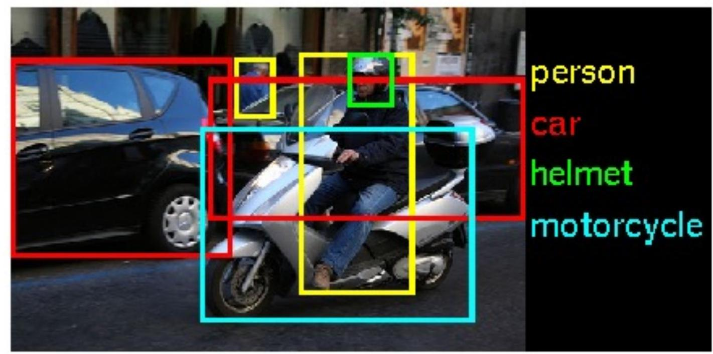{: width="60%"}
    

    ---

    **History**

    - Fei-Fei Li started the ImageNet project in 2006 with the goal of expanding and improving the data available for training Al algorithms.
    - Images were annotated with Amazon Mechanical Turk.
    - The ImageNet team first presented their dataset in the 2009 Conference on Computer Vision and Pattern Recognition (CVPR).
    - From 2010 to 2017, the ImageNet project ran the ImageNet Large Scale Visual Recognition Challenge (ILSVRC).
    - In the 2012 ILSVRC challenge, 150,000 images of 1000 classes were used.
    - In 2017, 29 teams achieved above 95\% accuracy. The organizers deemed task complete and ended the ILSVRC competition.
    
    ---

    **ImageNet-1k**

    Commonly referred to as "the ImageNet dataset". Also called ImageNet2012.
    However, ImageNet-1k is really a subset of full ImageNet dataset.
    ImageNet-1k has 150,000 images of 1000 roughly balanced classes.

    

    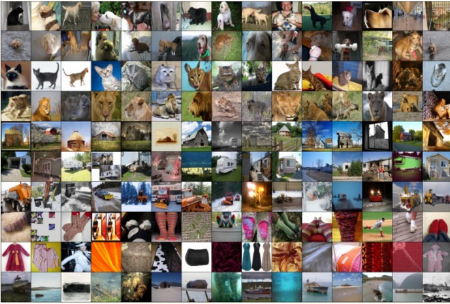{: width="80%"}
    

    ---

    **Top-1 vs Top-5 Accuracy**

    Classifiers on ImageNet-1k are often assessed by their top-5 accuracy, which requires the 5 categories with the highest confidence to contain the label.
    In contrast, the top-1 accuracy simply measures whether the network's single prediction is the label.
    
    For example, AlexNet had a top-5 accuracy of 84.6% and a top-1 accuracy of 63.3%.
    Nowadays, accuracies of classifiers has improved, so the top 1 accuracy is becoming the more common metric.

## LeNet

!!! definition "Definition 7.2 : LeNet5"
    
    

    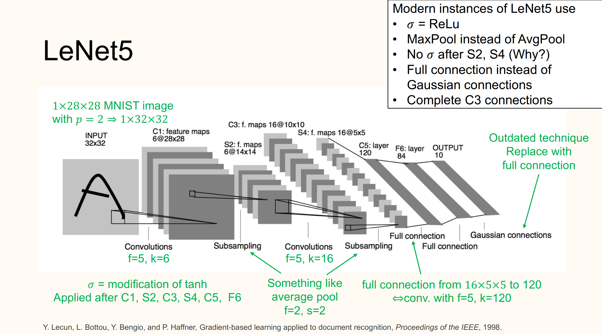{: width="100%"}
    

    (Y. Lecun, L. Bottou, Y. Bengio, and P. Haffner, Gradient-based learning applied to document recognition, Proceedings of the IEEE, 1998.)

!!! concept "Concept 7.3 : Architectural Contribution : LeNet"
    One of the earliest demonstration of using a deep CNN to learn a nontrivial task.
    
    Laid the foundation of the modern CNN architecture.

## AlexNet

!!! definition "Definition 7.4 : AlexNet"
    Won the 2012 ImageNet challenge by a large margin: top-5 error rate $15.3 \%$ vs. $26.2 \%$ second place.

    Started the era of deep neural networks and their training via GPU computing.

    AlexNet was split into 2 as GPU memory was limited. (A single modern GPU can easily hold AlexNet.)

    

    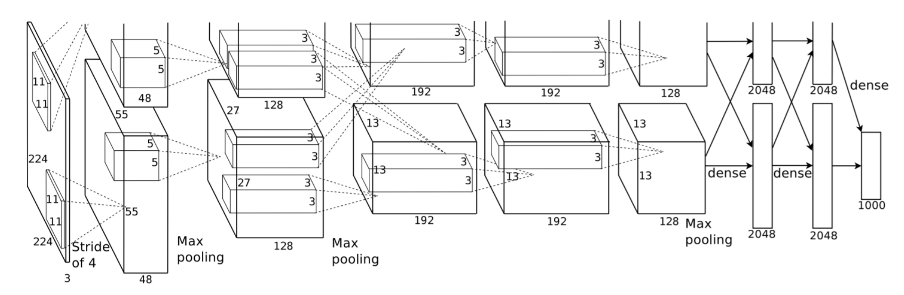{: width="100%"}
    

    (A. Krizhevsky, I. Sutskever, and G. E. Hinton, ImageNet classification with deep convolutional neural networks, NeurIPS, 2012.)

!!! definition "Definition 7.5 : AlexNet for ImageNet"
    

    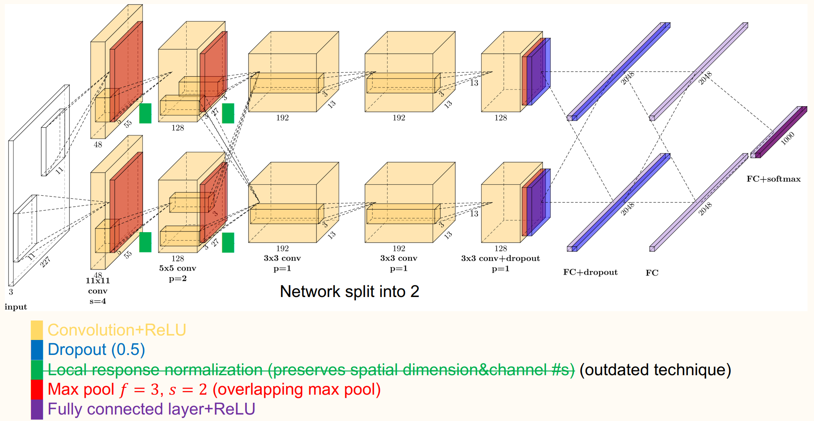{: width="100%"}
    

!!! definition "Definition 7.6 : AlexNet for Cifar10"
    

    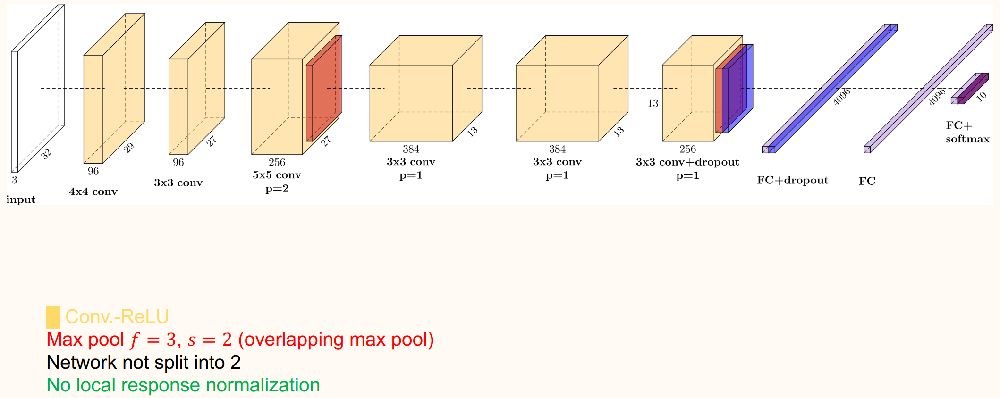{: width="100%"}
    

!!! concept "Concept 7.7 : Architectural Contribution : AlexNet"
    A scaled-up version of LeNet.

    Demonstrated that deep CNNs can learn significantly complex tasks. (Some thought CNNs could only learn simple, toy tasks like MNIST.)

    Demonstrated GPU computing to be an essential component of deep learning.

    Demonstrated effectiveness of ReLU over sigmoid or tanh in deep CNNs for classification.

## VGGNet

!!! definition "Definition 7.8 : VGGNet"
    

    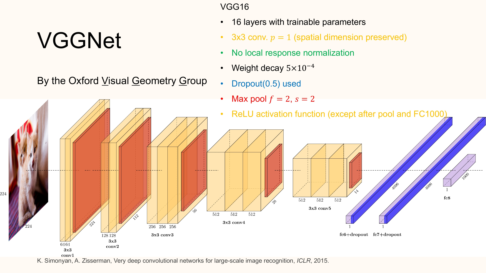{: width="100%"}
    

    

    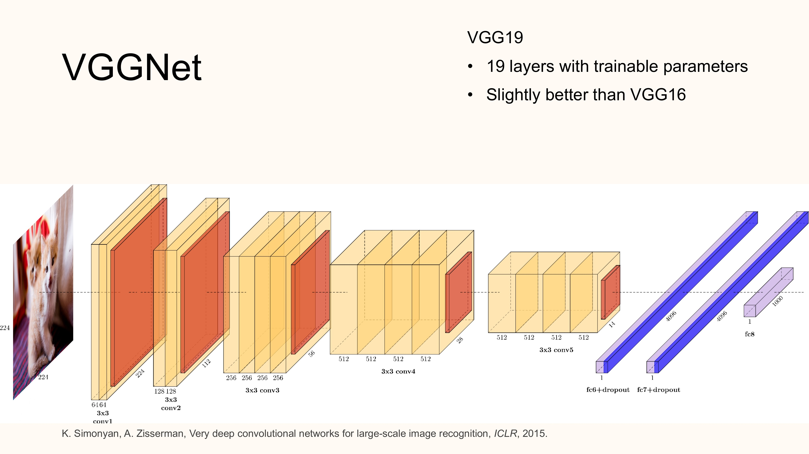{: width="100%"}
    

    (K. Simonyan, A. Zisserman, Very deep convolutional networks for large-scale image recognition, ICLR, 2015.)

!!! definition "Definition 7.9 : VGGNet for Cifar10"
    

    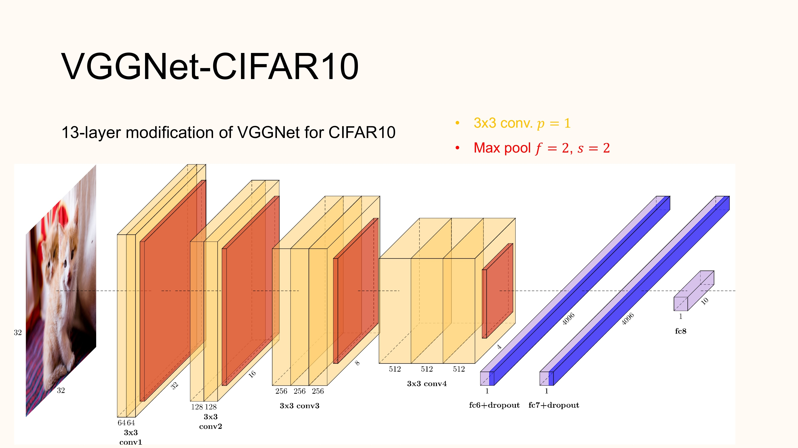{: width="100%"}
    

!!! concept "Concept 7.10 : Architectural Contribution : VGGNet"
    Demonstrated simple deep CNNs can significantly improve upon AlexNet.

    In a sense, VGGNet represents the upper limit of the simple CNN architecture. (It is the best simple model.) Future architectures make gains through more complex constructions.

    Demonstrated effectiveness of stacked $3 \times 3$ convolutions over larger $5 \times 5$ or $11 \times 11$ convolutions. Large convolutions (larger than $5 \times 5$ ) are now uncommon.

    Due to its simplicity, VGGNet is one of the most common test subjects for testing something on deep CNNs.

## NiN Network

!!! concept "Concept 7.11 : Linear layers have too many parameters."
    Linear layers have too many parameters.

    - AlexNet:

        Conv layer params: 2,469,696 (4%)  
        Linear layer params: 58,631,144 (96%)  
        Total params: 61,100,840

    - VGG19:
    
        Conv layer params: 20,024,384 (14%)  
        Linear layer params: 123,642,856 (86%)  
        Total params: 143,667,240

!!! definition "Definition 7.12 : Network in Network (NiN)"
    

    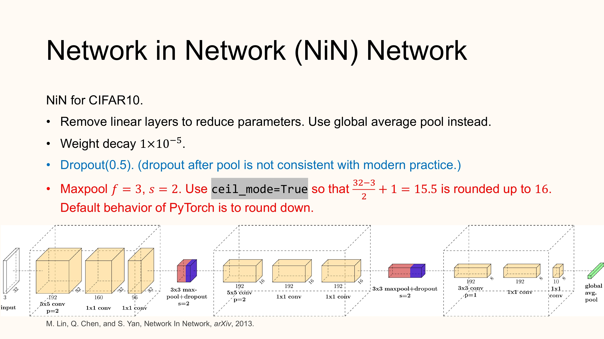{: width="100%"}
    

    (M. Lin, Q. Chen, and S. Yan, Network In Network, arXiv, 2013.)

!!! concept "Concept 7.13 : $1 \times 1$ Convolution"
    A $1 \times 1$ convolution is like a fully connected layer acting independently and identically on each spatial location.
    
    

    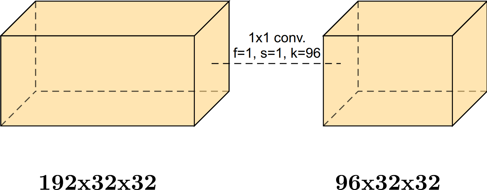{: width="70%"}
    

    - 96 filters act on 192 channels separately for each pixel
    - $96 \times 192+96$ parameters for weights and biases

!!! concept "Concept 7.14 : Regular Convolution Layer vs Network in Network"
    **Regular Convolution Layer**

    Input: $X \in \mathbb{R}^{C_{0} \times m \times n}$
    
    - Select an $f \times f$ patch $\tilde{X}=X[:, i: i+f, j: j+f]$.
    - Inner product $\tilde{X}$ and $w_{1}, \ldots, w_{C_{1}} \in \mathbb{R}^{C_{0} \times f \times f}$ and add bias $b_{1} \in \mathbb{R}^{C_{1}}$.
    - Apply $\sigma$. (Output in $\mathbb{R}^{C_{1}}$.)

    Repeat this for all patches. Output in $X \in \mathbb{R}^{C_{1} \times(m-f+1) \times(n-f+1)}$.
    Repeat this for all batch elements.

    ---

    **Network in Network**

    Input: $X \in \mathbb{R}^{c_{0} \times m \times n}$

    - Select an $f \times f$ patch $\tilde{X}=X[:, i: i+f, j: j+f]$.
    - Inner product $\tilde{X}$ and $w_{1}, \ldots, w_{C_{1}} \in \mathbb{R}^{C_{0} \times f \times f}$ and add bias $b_{1} \in \mathbb{R}^{C_{1}}$.
    - Apply $\sigma$. (Output in $\mathbb{R}^{C_{1}}$.)
    - Apply Linear $A_{A_{2}, b_{2}}(x)$ where $A_{2} \in \mathbb{R}^{C_{2} \times C_{1}}$ and $b_{2} \in \mathbb{R}^{C_{2}}$.
    - Apply $\sigma$. (Output in $\mathbb{R}^{C_{2}}$.)
    - Apply Linear $A_{A_{3}, b_{3}}(x)$ where $A_{3} \in \mathbb{R}^{C_{3} \times C_{2}}$ and $b_{3} \in \mathbb{R}^{C_{3}}$.
    - Apply $\sigma$. (Output in $\mathbb{R}^{C_{3}}$.)

    Repeat this for all patches. Output in $X \in \mathbb{R}^{C_{3} \times(m-f+1) \times(n-f+1)}$. Repeat this for all batch elements.
    Why is this equivalent to ($3 \times 3$ conv)-($1 \times 1$ conv)-($1 \times 1$ conv)?

!!! concept "Concept 7.15 : Global Average Pool"
    When using CNNs for classification, position of object is not important.

    The global average pool has no trainable parameters (linear layers have many) and it is translation invariant. Global average pool removes the spatial dependency.

!!! concept "Concept 7.16 : Architectural Contribution : NiN Network"
    Used $1 \times 1$ convolutions to increase the representation power of the convolutional modules.

    Replaced linear layer with average pool to reduce number of trainable parameters.

    First step in the trend of architectures becoming more abstract. Modern CNNs are built with smaller building blocks.

## GoogLeNet

!!! definition "Definition 7.17 : GoogLeNet (Inception v1)"
    Utilizes the inception module. Structure inspired by NiN and name inspired by 2010 Inception movie meme.

    Used $1 \times 1$ convolutions.

    - Increased depth adds representation power (improves ability to represent nonlinear functions).
    - Reduce the number of channels before the expensive $3 \times 3$ and $5 \times 5$ convolutions, and thereby reduce number of trainable weights and computation time.

    The name GoogLeNet is a reference to the authors' Google affiliation and is an homage to LeNet.

    

    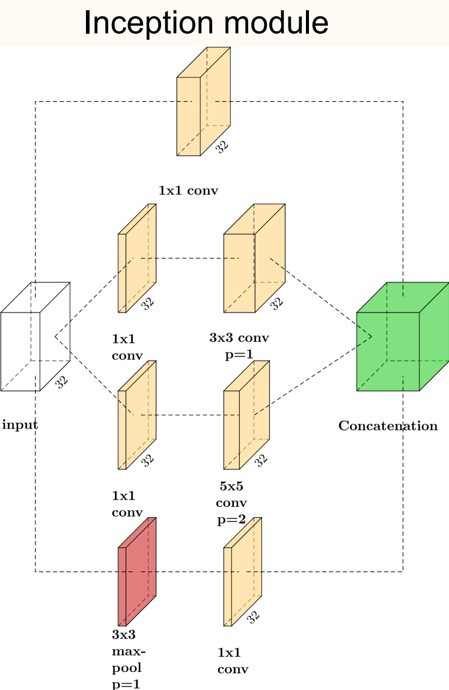{: width="60%"}
    

    (C. Szegedy, W. Liu, Y. Jia, P. Sermanet, S. Reed, D. Anguelov, D. Erhan, V. Vanhoucke, and A. Rabinovich, Going deeper with convolutions, CVPR, 2015)

    ---

    

    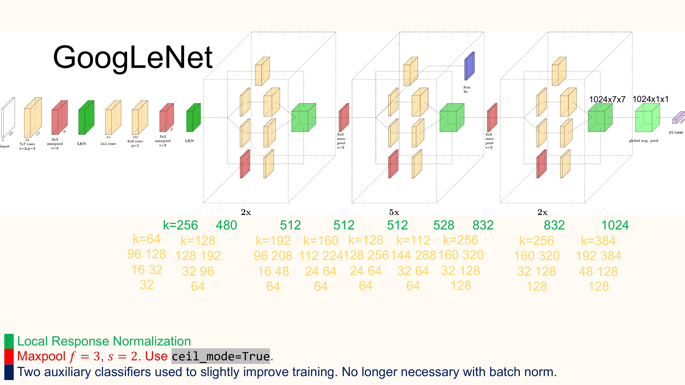{: width="100%"}
    

!!! definition "Definition 7.18 : GoogLeNet for Cifar10"
    

    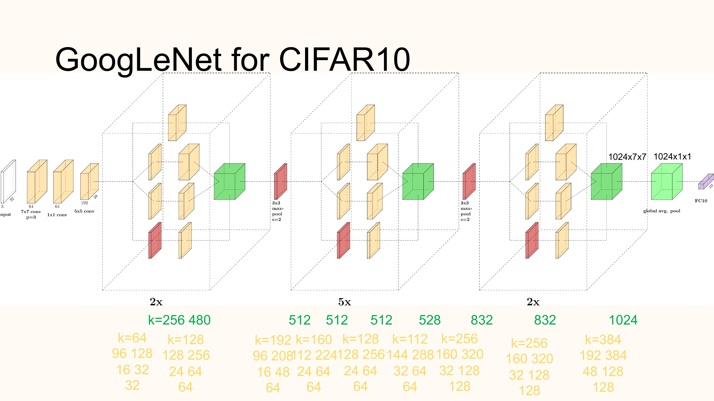{: width="100%"}
    

!!! concept "Concept 7.19 : Architectural Contribution : GoogLeNet"
    Demonstrated that more complex modular neural network designs can outperform VGGNet's straightforward design.

    Together with VGGNet, demonstrated the importance of depth.

    Kickstarted the research into deep neural network architecture design.

## ResNet
