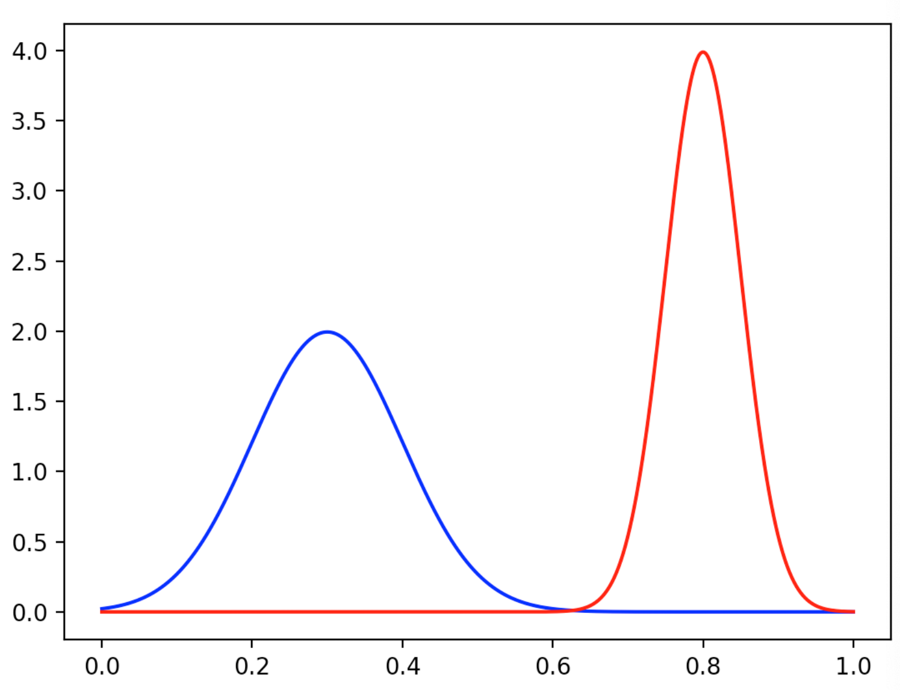
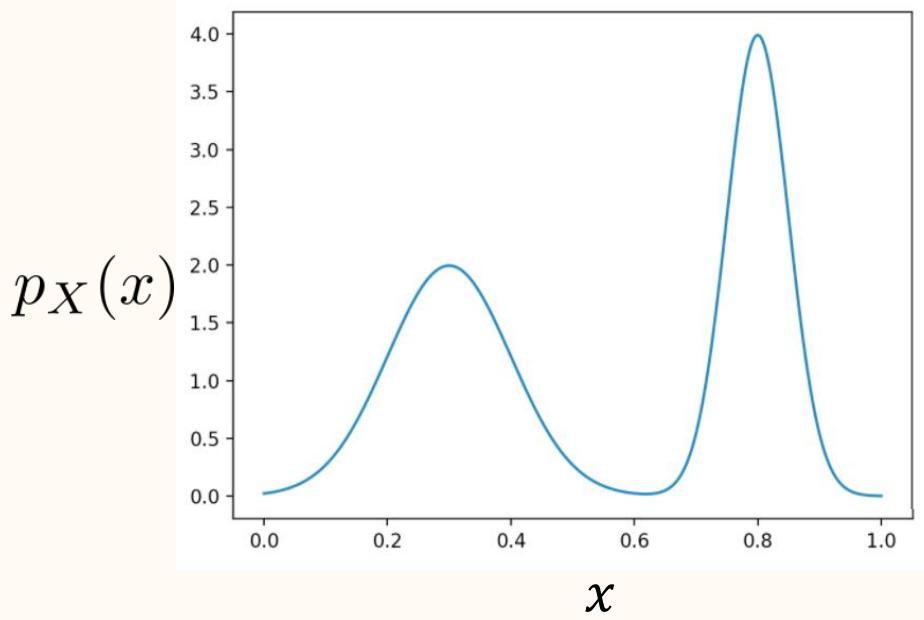
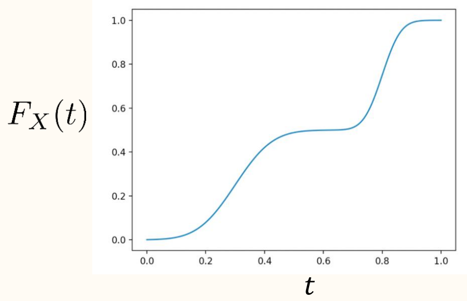
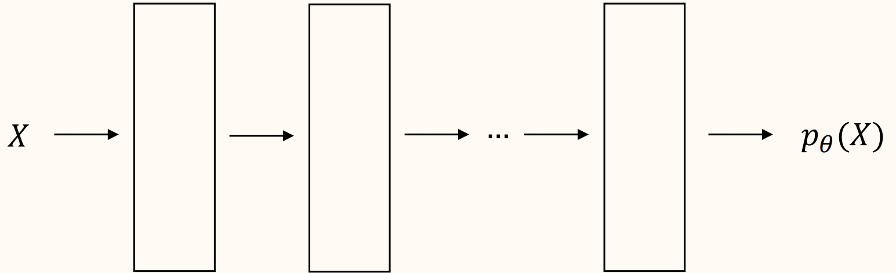
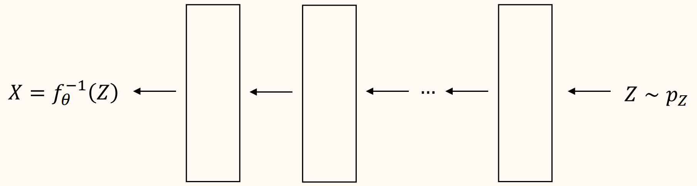
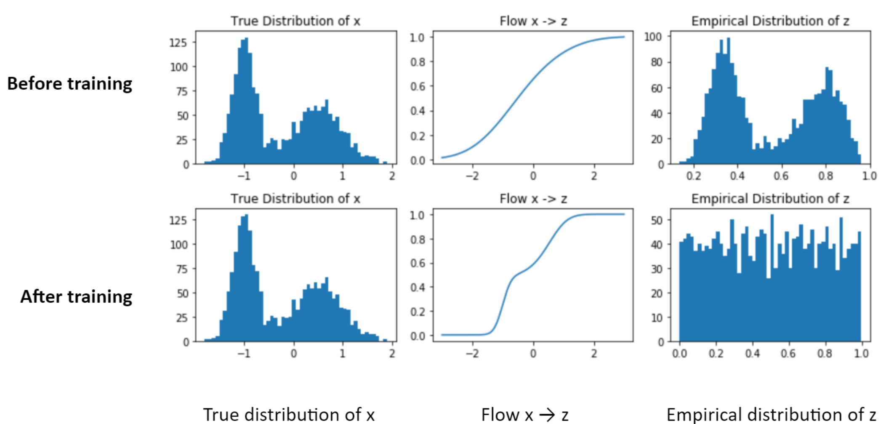
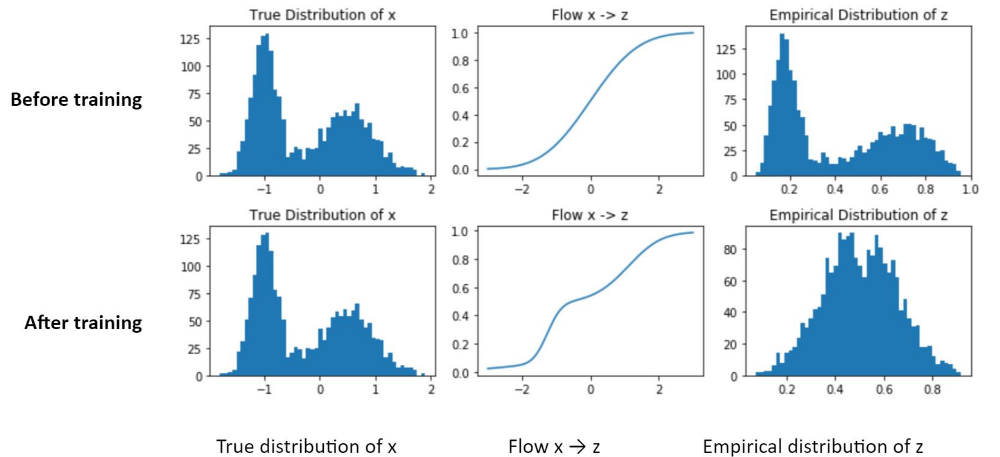
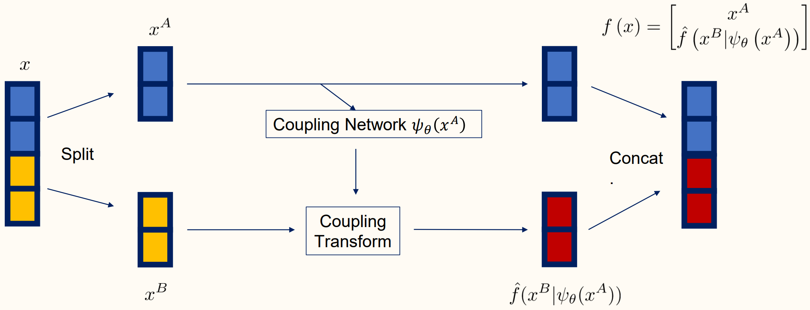
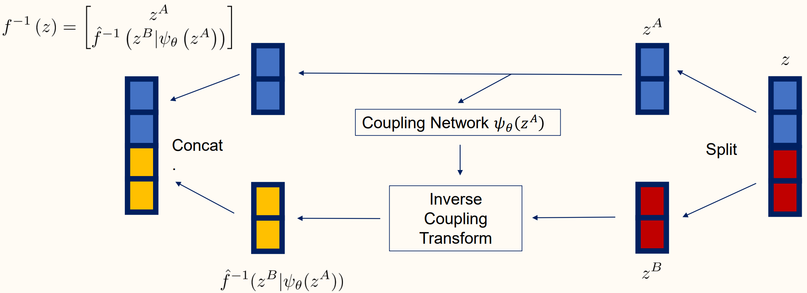
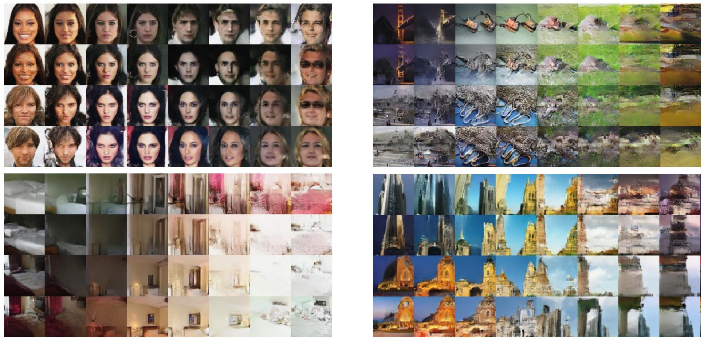

# § 10. Flow Models

## Probabilistic Generative Models

!!! definition "Definition 10.1 : Probabilistic generative models"
    A **probabilistic generative model** learns a distribution $p_{\theta}$ from $X_{1}, \ldots, X_{N} \sim p_{\text {true }}$ such that $p_{\theta} \approx p_{\text {true }}$ and such that we can generate new samples $X \sim p_{\theta}$.

    The ability to generate new synthetic data is interesting, but by itself not very useful.
    (Generating fake images to use in fake social media accounts is the only direct application that I can think of.)

    The structure of the data learned through the unsupervised learning is of higher value. However, we won't talk about the downstream applications in this course.

    In this class, we will talk about **flow models**, **VAEs**, and **GANs**.

---

Fit a probability density function $p_{\theta}(x)$ with continuous data $X_{1}, \ldots, X_{N} \sim p_{\text {true }}(x)$.

- We want to fit the data $X_{1}, \ldots, X_{N}$ (or really the underlying distribution $p_{\text {true}}$) well.
- We want to be able to sample from $p_{\theta}$.
- (We want to get a good latent representation.)

We first develop the mathematical discussion with 1D flows, and then generalize the discussion to high dimensions.

!!! concept "Concept 10.2 : Example Density Model"
    $$
    p_{\theta}(x)=\sum_{i=1}^{k} \pi_{i} \mathcal{N}\left(x ; \mu_{i}, \sigma_{i}^{2}\right)
    $$

    Parameters: means and variances of components, mixture weights

    $$
    \theta=\left(\pi_{1}, \ldots, \pi_{k}, \mu_{1}, \ldots, \mu_{k}, \sigma_{1}, \ldots, \sigma_{k}\right)
    $$

    Problems with GMM:

    - Highly non-convex optimization problem. Can easily get stuck in local minima.
    - It is does not have the representation power to express high-dimensional data.

    

    {: width="70%"}
    

    ---

    GMM doesn't work with high-dimensional data. The sampling process is:

    1. Pick a cluster center
    2. Add Gaussian noise

    If this is done with natural images, a realistic image can be generated only if it is a cluster center, i.e., the clusters must already be realistic images.

    

    {: width="100%"}
    

    So then how do we fit a general (complex) density model?

## 1D Flow Models

!!! concept "Concept 10.3 : Math Review"
    A random variable $X$ is continuous if there exists a **probability density function (PDF)** $p_{X}(x) \geq 0$ such that

    $$
    \mathbb{P}(a \leq X \leq b)=\int_{a}^{b} p_{X}(x) d x
    $$

    In this case, we write $X \sim p_{X}$.

    

    {: width="70%"}
    

    ---

    The **cumulative distribution function (CDF)** of $X$ is defined as

    $$
    F_{X}(t)=\mathbb{P}(X \leq t)=\int_{-\infty}^{t} p_{X}(x) d x
    $$

    - $F_{X}(t)$ is a nondecreasing function.  
    - $F_{X}(t)$ is a continuous function if $X$ is a continuous random variable.

    

    {: width="70%"}
    

!!! concept "Concept 10.4 : Naïve Approach"
    Naïve approach for fitting a density model. Represent $p_{\theta}(x)$ with DNN.

    

    {: width="100%"}
    

    There are some challenges:

    1. How to ensure proper distribution?

        $$
        \int_{-\infty}^{+\infty} p_{\theta}(x) d x=1, \quad p_{\theta}(x) \geq 0, \quad x \in \mathbb{R}
        $$

    2. How to sample?

    ---

    **Normalization of $p_{\theta}$**

    For discrete random variables, one can use the soft-max function $\mu: \mathbb{R}^{k} \rightarrow \mathbb{R}^{k}$ defined as

    $$
    \mu_{i}(z)_{i}=\frac{e^{z_{i}}}{\sum_{j=1}^{k} e^{z_{j}}}
    $$

    to normalize probabilities.

    For continuous random variables, we can ensure $p_{\theta} \geq 0$ with $p_{\theta}(x)=e^{f_{\theta}(x)}$, where $f_{\theta}$ is the output of the neural network. However, ensuring the normalization

    $$
    \int_{-\infty}^{+\infty} p_{\theta}(x) d x=1
    $$

    is not a simple matter. (Any Bayesian statistician can tell you how difficult this is.)

    ---

    **What happens if we ignore normalization?**

    Do we really need this normalization thing? Yes, we do.

    Without normalization, one can just assign arbitrarily large probabilities everywhere when we perform maximum likelihood estimation:

    $$
    \underset{\theta \in \mathbb{R}^{p}}{\operatorname{maximize}} \sum_{i=1}^{N} \log p_{\theta}\left(X_{i}\right)
    $$

    The solution is to set $p_{\theta}(x)=M$ with $M \rightarrow \infty$.

    We want model to place large probability on data $X_{1}, \ldots, X_{N}$ while placing small probability elsewhere. Normalization forces model to place small probability where data doesn't reside.

---

!!! definition "Definition 10.5 : Flow Model"
    Key insight of normalizing flow: DNN outputs random variable $Z$, rather than $p_{\theta}(X)$.
    We choose \( Z \) from a known distribution that is easy to sample from, such as \( \mathcal{N}(0,1) \) or \( \operatorname{Uniform}([0,1]) \).

    

    {: width="100%"}
    

    In normalizing flow, find $\theta$ such that the flow $f_{\theta}$ normalizes the random variable $X \sim p_{X}$ into $Z \sim \mathcal{N}(0,1)$.
    Generally, we can consider $Z \sim pZ$. The choice of $pZ$, however, does not seem to make a significant difference.

    Important questions to resolve:

    1. How to train? (How to evaluate $p_{\theta}(x)$ ? DNN outputs $f_{\theta}$, not $p_{\theta}$.) (Concept 10.7)
    2. How to sample $X$ ? (Concept 10.8)

!!! concept "Concept 10.6 : Math Review"
    Assume $f$ is invertible, $f$ is differentiable, and $f^{-1}$ is differentiable.

    If $X \sim p_{X}$, then $Z=f(X)$ has pdf

    $$
    p_{Z}(z)=p_{X}\left(f^{-1}(z)\right)\left|\frac{d x}{d z}\right|
    $$

    If $Z \sim p_{Z}$, then $X=f^{-1}(Z)$ has pdf

    $$
    p_{X}(x)=p_{Z}(f(x))\left|\frac{d f(x)}{d x}\right|
    $$

    Since $Z=f(X)$, one might think $p_{X}(x)=p_{Z}(z)=p_{Z}(f(x))$. $\leftarrow$ This is wrong.

    Invertibility of $f$ is essential; it is not a minor technical issue.

!!! definition "Definition 10.7 : Traning Flow Models"
    Train model with MLE

    $$
    \underset{\theta \in \mathbb{R}^{p}}{\operatorname{maximize}} \sum_{i=1}^{N} \log p_{\theta}\left(X_{i}\right)=\underset{\theta \in \mathbb{R}^{p}}{\operatorname{maximize}} \sum_{i=1}^{N} \log p_{Z}\left(f_{\theta}\left(X_{i}\right)\right)+\log \left|\frac{\partial f_{\theta}}{\partial x}\left(X_{i}\right)\right|
    $$

    where $f_{\theta}$ is invertible and differentiable, and $X=f_{\theta}^{-1}(Z)$ with $Z \sim p_{Z}$ so

    $$
    p_{X}(x)=p_{Z}\left(f_{\theta}(x)\right)\left|\frac{\partial f_{\theta}}{\partial x}(x)\right|
    $$

    Can optimize with SGD, if we know how to perform backprop on $\left|\frac{\partial f_{\theta}}{\partial x}\left(X_{i}\right)\right|$. More on this later.

!!! definition "Definition 10.8 : Sampling from Flow Models"
    

    {: width="100%"}
    

    1. Sample $Z \sim p_{Z}$
    2. Compute $X=f_{\theta}^{-1}(Z)$

!!! concept "Concept 10.9 : Requirements of Flow $f_{\theta}$"
    Theoretical requirement:

    - $f_{\theta}(x)$ invertible and differentiable.

    Computational requirements:

    - $f_{\theta}(x)$ and $\nabla_{\theta} f_{\theta}(x)$ efficient to evaluate (for training)
    - $\left|\frac{\partial f_{\theta}}{\partial x}(x)\right|$ and $\nabla_{\theta}\left|\frac{\partial f_{\theta}}{\partial x}(x)\right|$ efficient to evaluate (for training)
    - $f_{\theta}^{-1}$ efficient to evaluate (for sampling)

!!! example "Example 10.10 : Example of Trained Flow Models"
    - Flow to $Z$ ~ $\operatorname{Uniform}([0,1])$

    

    {: width="100%"}
    

    - Flow to $Z \sim \operatorname{Beta}(5,5)$

    

    {: width="100%"}
    

    - Flow to $Z \sim \mathcal{N}(0,1)$

    

    {: width="100%"}
    

---

!!! concept "Concept 10.11 : Universality of Flows"
    Are flows universal, i.e., can $f_{\theta}^{-1}(Z) \sim p_{X}$ for any $X$ provided that $f_{\theta}$ can represent any invertible function?

    Yes, 1D flows are universal due to the inverse CDF sampling technique. (Some basic conditions are being omitted.)

    Higher dimensional flows are also universal as shown by Huang et al.$^{\star}$ or earlier by the general theory of optimal transport. ([link](https://en.wikipedia.org/wiki/Transportation_theory_(mathematics)))

    $^{\star}$ C.-W. Huang, D. Krueger, A. Lacoste, and A. Courville, Neural Autoregressive Flows, ICML, 2018.

!!! concept "Concept 10.12 : Math Review"
    **Inverse CDF sampling** is a technique for sampling $X \sim p_{X}$.
    If $F_{X}(t)$ is furthermore a strictly increasing function, then $F_{X}$ is invertible, i.e., $F_{X}^{-1}$ exists.

    Generate a random number $U \sim \operatorname{Uniform}([0,1])$ and compute $F_{X}^{-1}(U)$. Then

    $$
    F_{X}^{-1}(U) \sim p_{X}
    $$

    since

    $$
    \mathbb{P}\left(F_{X}^{-1}(U) \leq t\right)=\mathbb{P}\left(U \leq F_{X}(t)\right)=F_{X}(t)
    $$

    Technique can be generalized to when $F_{X}$ is not invertible.

    ---

    Inverse CDF can be seen as flow model from $X \sim p_X$ to $U \sim \operatorname{Uniform}([0,1])$.
    As seen above, the flow is $F_X$, so when we do not know the true distribution $p_X$, we can train the flow model to learn $F_{X}^{-1}(U) \sim p_{X}$.

!!! concept "Concept 10.13 : Universality of 1D Flows"
    Composition of flows is a flow, and inverse of a flow is a flow.

    Universality of 1D flows:

    - Use inverse CDF as flow to transform $X \sim p_{X}$ into $U \sim \operatorname{Uniform}([0,1])$ and $Z \sim \mathcal{N}(0,1)$ into $U \sim \operatorname{Uniform}([0,1])$.
    - Compose flow $X \rightarrow U$ and inverse flow $U \rightarrow Z$.

    

    {: width="70%"}
    

## High Dimensional Flow Models

!!! concept "Concept 10.14 : Math Review"
    Let $f: \mathbb{R}^{n} \rightarrow \mathbb{R}^{n}$, such that

    $$
    f(x)=\left[\begin{array}{c}
    f_{1}(x) \\
    f_{2}(x) \\
    \vdots \\
    f_{n}(x)
    \end{array}\right]
    $$

    The Jacobian matrix is

    $$
    \frac{\partial f}{\partial x}(x)=\left[\begin{array}{cccc}
    \frac{\partial f_{1}}{\partial x_{1}}(x) & \frac{\partial f_{1}}{\partial x_{2}}(x) & \cdots & \frac{\partial f_{1}}{\partial x_{n}}(x) \\
    \frac{\partial f_{2}}{\partial x_{1}}(x) & \frac{\partial f_{2}}{\partial x_{2}}(x) & \cdots & \frac{\partial f_{2}}{\partial x_{n}}(x) \\
    \vdots & & \ddots & \vdots \\
    \frac{\partial f_{n}}{\partial x_{1}}(x) & \frac{\partial f_{n}}{\partial x_{2}}(x) & \cdots & \frac{\partial f_{n}}{\partial x_{n}}(x)
    \end{array}\right]=\left[\begin{array}{c}
    \left(\nabla f_{1}(x)\right)^{\top} \\
    \left(\nabla f_{2}(x)\right)^{\top} \\
    \vdots \\
    \left(\nabla f_{n}(x)\right)^{\top}
    \end{array}\right]
    $$

    The Jacobian determinant is $\operatorname{det}\left(\frac{\partial f}{\partial x}\right)$. We use the notation

    $$
    \left|\frac{\partial f}{\partial x}(x)\right|=\left|\operatorname{det}\left(\frac{\partial f}{\partial x}(x)\right)\right|
    $$

    where the second $|\cdot|$ is the absolute value of the determinant. (This notation is not completely standard.)

!!! concept "Concept 10.15 : Math Review"
    Let $f: \mathbb{R}^{n} \rightarrow \mathbb{R}^{n}$ be an invertible function such that both $f$ and $f^{-1}$ are differentiable. Let $U \subseteq \mathbb{R}^{n}$. Then

    $$
    \int_{f(U)} h(v) d v=\int_{U} h(f(u))\left|\frac{\partial f}{\partial u}(u)\right| d u
    $$

    for any $h: \mathbb{R}^{n} \rightarrow \mathbb{R}$. (Change of variable from $v=f(u)$ to $u=f^{-1}(v)$.)

    (The conditions for this change of variable formula can be further generalized.)

!!! concept "Concept 10.16 : Math Review"
    A multivariate random variable $X \in \mathbb{R}^{n}$ is continuous if there exists a probability density function $p_{X}(x)$ such that

    $$
    \mathbb{P}(X \in A)=\int_{A} p_{X}(x) d x
    $$

    where the integral is over the volume $A \subseteq \mathbb{R}^{n}$. In this case, we write $X \sim p_{X}$.

    The joint cumulative distribution function (the copula) does not seem to be useful in the context of high-dimensional flow models.

!!! concept "Concept 10.17 : Math Review"
    Let $f: \mathbb{R}^{n} \rightarrow \mathbb{R}^{n}$ be an invertible function such that both $f$ and $f^{-1}$ are differentiable. Let $X$ be a continuous random variable with probability density function $p_{X}$ and let $Y=f(X)$ have density $p_{Y}$. Then

    $$
    p_{X}(x)=p_{Y}(f(x))\left|\frac{\partial f}{\partial x}(x)\right|
    $$

    !!! proof
        $$
        \mathbb{P}\left(f^{-1}(Y) \in A\right)=\mathbb{P}(Y \in f(A))=\int_{f(A)} p_{Y}(y) d y=\int_{A} p_{Y}(f(x))\left|\frac{\partial f}{\partial x}(x)\right| d x=\mathbb{P}(X \in A)
        $$

    Invertibility of $f$ is essential; it is not a minor technical issue.

!!! concept "Concept 10.18 : Math Review"
    Fact: Determinant definitions in undergraduate linear algebra textbooks require exponentially many operations to compute:

    $$
    \operatorname{det}(A)=\sum_{\sigma \in S_{n}}\left(\operatorname{sgn}(\sigma) \prod_{i=1}^{n} a_{i, \sigma_{i}}\right)
    $$

    Efficient computation of determinant for general matrices and performing backprop through the computation is difficult. Therefore, high-dimensional flow model are designed to compute determinants only on simple matrices.

    - Product formula: if $A$ and $B$ are square, then

    $$
    \operatorname{det}(A B)=\operatorname{det}(A) \operatorname{det}(B)
    $$

    - Block lower triangular formula: if $A \in \mathbb{R}^{n \times n}$ and $C \in \mathbb{R}^{m \times m}$, then

    $$
    \operatorname{det}\left(\begin{array}{ll}
    A & 0 \\
    B & C
    \end{array}\right)=\operatorname{det}(A) \operatorname{det}(C)
    $$

    - Lower triangular formula: if $a_{1}, \ldots, a_{n} \in \mathbb{R}$ and $*$ represents arbitrary values, then

    $$
    \operatorname{det}\left(\begin{array}{cccc}
    a_{1} & 0 & \cdots & 0 \\
    * & a_{2} & & \vdots \\
    * & * & \ddots & 0 \\
    * & * & * & a_{n}
    \end{array}\right)=\prod_{i=1}^{n} a_{i}
    $$

    - Upper triangular formula: same as for lower triangular matrices.

!!! definition "Definition 10.19 : Training High Dimensional Flow Models"
    Train model with MLE

    $$
    \underset{\theta \in \mathbb{R}^{p}}{\operatorname{maximize}} \sum_{i=1}^{N} \log p_{\theta}\left(X_{i}\right)=\underset{\theta \in \mathbb{R}^{p}}{\operatorname{maximize}} \sum_{i=1}^{N} \log p_{Z}\left(f_{\theta}\left(X_{i}\right)\right)+\log \left|\frac{\partial f_{\theta}}{\partial x}\left(X_{i}\right)\right|
    $$

    where $f_{\theta}(z)$ is invertible and differentiable, and $X=f^{-1}(Z)$ with $Z \sim p_{Z}$ so

    $$
    p_{X}(x)=p_{Z}\left(f_{\theta}(x)\right)\left|\frac{\partial f_{\theta}}{\partial x}(x)\right|
    $$

    (Exactly the same formula as with 1D flow.)

    Can optimize with SGD, if we know how to perform backprop on $\left|\frac{\partial f_{\theta}}{\partial x}\left(X_{i}\right)\right|$.

## Coupling Flows

!!! concept "Concept 10.20 : Composing Flows"
    Flows can be composed to increase expressiveness. (Deep NN more expressive.)
    Consider composition of $k$ flows

    $$
    \begin{aligned}
    & x \rightarrow f_{1} \rightarrow f_{2} \rightarrow \cdots \rightarrow f_{k} \rightarrow z \\
    & z=f_{k} \circ \cdots \circ f_{1}(x) \\
    & x=f_{1}^{-1} \circ \cdots \circ f_{k}^{-1}(z)
    \end{aligned}
    $$

    Determinant computation splits nicely due to chain rule and product formula

    $$
    \begin{aligned}
    & \operatorname{det}\left(\frac{\partial z}{\partial x}\right)=\operatorname{det}\left(\frac{\partial f_{k}}{\partial f_{k-1}} \cdots \frac{\partial f_{1}}{\partial f_{0}}\right)=\operatorname{det}\left(\frac{\partial f_{k}}{\partial f_{k-1}}\right) \cdots \operatorname{det}\left(\frac{\partial f_{1}}{\partial f_{0}}\right) \\
    & \log p_{\theta}(x)=\log p_{\theta}(z)+\sum_{i=1}^{k} \log \left|\frac{\partial f_{i}}{\partial f_{i-1}}\right|
    \end{aligned}
    $$

!!! definition "Definition 10.21 : Affine Flows"
    An affine (linear) transformation

    $$
    f_{A, b}(x)=A^{-1}(x-b)
    $$

    is a flow if matrix $A$ is invertible. Then

    $$
    \frac{\partial f_{A, b}}{\partial x}=A^{-1}
    $$

    and

    $$
    \left|\frac{\partial f_{A, b}}{\partial x}\right|=\left|\operatorname{det}\left(A^{-1}\right)\right|=\frac{1}{|\operatorname{det}(A)|}
    $$

    Sampling: $X=A Z+b$, where $Z \sim \mathcal{N}(0, I)$.

    Problem with **affine flows**:

    - Computing $|\operatorname{det}(A)|$ is expensive and performing backprop over it is difficult. We want $\frac{\partial f_{A, b}}{\partial x}$ to be further structured so that determinant is easy to compute.
    - One affine flow is insufficient to generate complex data. However, composing multiple affine flows yields an affine flow and therefore is pointless. We need to introduce nonlinearities.

---

!!! definition "Definition 10.22 : Coupling Flows"
    A coupling flow is a general and practical approach for constructing non-linear flows.

    Partition input into two disjoint subsets $x=\left(x^{A}, x^{B}\right)$. Then

    $$
    f(x)=\left(x^{A}, \hat{f}\left(x^{B} \mid \psi_{\theta}\left(x^{A}\right)\right)\right)
    $$

    where $\psi_{\theta}$ is a neural network and $\hat{f}\left(x^{B} \mid \psi_{\theta}\left(x^{A}\right)\right)$ is another flow whose parameters depend on $x^{A}$.

!!! definition "Definition 10.23 : Evaluation of Coupling Flows"
    - Forward Evaluation

    

    {: width="100%"}
    

    - Inverse Evaluation

    

    {: width="100%"}
    

!!! concept "Concept 10.24 : Jacobian of Coupling Flows"
    The Jacobian of a coupling flow has a nice block structure

    $$
    \frac{\partial f_{\theta}}{\partial x}(x)=\left[\begin{array}{cc}
    I & 0 \\
    \frac{\partial \hat{f}}{\partial x^{A}}\left(x^{B} \mid \psi_{\theta}\left(x^{A}\right)\right) & \frac{\partial \hat{f}}{\partial x^{B}}\left(x^{B} \mid \psi_{\theta}\left(x^{A}\right)\right)
    \end{array}\right]
    $$

    which leads to the simplified determinant formula

    $$
    \operatorname{det}\left(\frac{\partial f_{\theta}}{\partial x}(x)\right)=\operatorname{det}\left(\frac{\partial \hat{f}}{\partial x^{B}}\left(x^{B} \mid \psi_{\theta}\left(x^{A}\right)\right)\right)
    $$

    Note $\frac{\partial \hat{f}}{\partial x^{A}}\left(x^{B} \mid \psi_{\theta}\left(x^{A}\right)\right)$, which will be very complicated, does not appear in the determinant.

!!! definition "Definition 10.25 : Coupling transformation $\hat{f}(x \mid \psi)$"
    - **Additive transformations (NICE)**

        $$
        \hat{f}(x \mid \psi)=x+t
        $$

        where $\psi=t$.

    - **Affine transformations (Real NVP)**

        $$
        \hat{f}(x \mid \psi)=e^{s} \odot x+t
        $$

        where $\psi=(s, t)$.

    Other transformations studied throughout the literature.

--- 

!!! definition "Definition 10.26 : NICE (Non-linear Independent Components Estimation)"
    NICE uses additive coupling layers:
    Split variables in half: $x_{1: n / 2}, x_{n / 2: n}$

    $$
    \begin{aligned}
    & z_{1: n / 2}=x_{1: n / 2} \\
    & z_{n / 2: n}=x_{n / 2: n}+t_{\theta}\left(x_{1: n / 2}\right)
    \end{aligned}
    $$

    Easily invertible:

    $$
    \begin{aligned}
    & x_{1: n / 2}=z_{1: n / 2} \\
    & x_{n / 2: n}=z_{n / 2: n}-t_{\theta}\left(x_{1: n / 2}\right)
    \end{aligned}
    $$

    Jacobian determinant is easy to compute:

    $$
    \operatorname{det} \frac{\partial f_{\theta}}{\partial x}(x)=\operatorname{det}\left[\begin{array}{cc}I & 0 \\ \frac{\partial \hat{f}}{\partial x^{A}}\left(x^{B} \mid \psi_{\theta}\left(x^{A}\right)\right) & \frac{\partial \hat{f}}{\partial x^{B}}\left(x^{B} \mid \psi_{\theta}\left(x^{A}\right)\right)\end{array}\right]=\operatorname{det}\left[\begin{array}{cc}I & 0 \\ \frac{\partial \hat{f}}{\partial x^{A}}\left(x^{B} \mid \psi_{\theta}\left(x^{A}\right)\right) & I\end{array}\right]=1
    $$

    (L. Dinh, D. Krueger, and Y. Bengio, NICE: Non-linear independent components estimation, ICLR Workshop, 2015.)

!!! definition "Definition 10.27 : Real NVP (Real-valued Non-Volume Preserving)"
    Real NVP uses affine coupling layers:

    $$
    \begin{aligned}
    & z_{1: n / 2}=x_{1: n / 2} \\
    & z_{n / 2: n}=e^{s_{\theta}\left(x_{1: n / 2}\right)} \odot x_{n / 2: n}+t_{\theta}\left(x_{1: n / 2}\right)
    \end{aligned}
    $$

    Easily invertible:

    $$
    \begin{aligned}
    & x_{1: n / 2}=z_{1: n / 2} \\
    & x_{n / 2: n}=\left(z_{n / 2: n}-t_{\theta}\left(x_{1: n / 2}\right)\right) \odot e^{-s_{\theta}\left(x_{1: n / 2}\right)}
    \end{aligned}
    $$

    Jacobian determinant is easy to compute:

    $$
    \begin{aligned}
    \operatorname{det} \frac{\partial f_{\theta}}{\partial x}(x) & =\operatorname{det}\left[\begin{array}{cc}
    I & 0 \\
    \frac{\partial \hat{f}}{\partial x^{A}}\left(x^{B} \mid \psi_{\theta}\left(x^{A}\right)\right) & \frac{\partial \hat{f}}{\partial x^{B}}\left(x^{B} \mid \psi_{\theta}\left(x^{A}\right)\right)
    \end{array}\right] \\
    & =\operatorname{det}\left[\begin{array}{cc}
    I & 0 \\
    \frac{\partial \hat{f}}{\partial x^{A}}\left(x^{B} \mid \psi_{\theta}\left(x^{A}\right)\right) & \operatorname{diag}\left(e^{s_{\theta}\left(x_{1: n / 2}\right)}\right)
    \end{array}\right]=\exp \left(\mathbf{1}_{n / 2}^{\top} s_{\theta}\left(x_{1: n / 2}\right)\right)
    \end{aligned}
    $$

    (L. Dinh, J. Sohl-Dickstein, and S. Bengio, Density estimation using Real NVP, ICLR, 2017.)

- Results of Real NVP

{: width="100%"}

---

!!! concept "Concept 10.28 : How to partition variables?"
    Note that the additive and affine coupling layers of NICE and Real NVP are nonlinear mappings from $x_{1: n}$ to $z_{1: n}$, since $s_{\theta}\left(x_{1: n / 2}\right)$ and $t_{\theta}\left(x_{1: n / 2}\right)$ are nonlinear.

    Flow models compose multiple nonlinear flows. But if $x_{1: n / 2}$ is always unchanged, then the full composition will leave it unchanged. Therefore, we change the partitioning for every coupling layer.

!!! concept "Concept 10.29 : Real NVP Variable Partitioning"
    Two partition strategies:

    1. Partition with checkerboard pattern.
    2. Reshape tensor and then partition channelwise.

    

    {: width="70%"}
    

    (L. Dinh, J. Sohl-Dickstein, and S. Bengio, Density estimation using Real NVP, ICLR, 2017.)

!!! definition "Definition 10.30 : Real NVP Architecture"
    

    {: width="100%"}
    

    Input $X$ : $c \times 32 \times 32$ image with $c=3$

    Layer 1: Input $X: c \times 32 \times 32$

    - Checkerboard $\times 3$, channel reshape into $4 c \times 16 \times 16$, channel $\times 3$
    - Output: Split result to get $X_{1}: 2 c \times 16 \times 16$ and $Z_{1}: 2 c \times 16 \times 16$ (fine-grained latents)

    Layer 2: Input $X_{1}: 2 c \times 16 \times 16$ from layer 1

    - Checkerboard $\times 3$, channel reshape into $8 c \times 8 \times 8$, channel $\times 3$
    - Split result to get $X_{2}: 4 c \times 8 \times 8$ and $Z_{2}: 4 c \times 8 \times 8$ (coarser latents)

    Layer 3: Input $X_{2}: 4 c \times 8 \times 8$ from layer 2

    - Checkerboard $\times 3$, channel reshape into $16 c \times 4 \times 4$, channel $\times 3$
    - Get $Z_{3}: 16 c \times 4 \times 4$ (latents for highest-level details)

    Output $Z = (Z_1, Z_2, Z_3) \in \mathbb{R}^{c \dot 32^2}$

!!! concept "Concept 10.31 : Batch Normalization in Deep Flows"
    To train deep flows, BN is helpful. However, the large model size forces the use of small batch sizes, and BN is not robust with small batch sizes. RealNVP uses a modified form of BN

    $$
    x \mapsto \frac{x-\tilde{\mu}}{\sqrt{\tilde{\sigma}^{2}+\varepsilon}}
    $$

    (No $\beta$ and $\gamma$ parameters.) This layer has the log Jacobian determinant

    $$
    -\frac{1}{2} \sum_{i} \log \left(\tilde{\sigma}_{i}^{2}+\varepsilon\right)
    $$

    The mean and variance parameters are updated with

    $$
    \begin{aligned}
    \tilde{\mu}_{k+1} & =\rho \tilde{\mu}_{k}+(1-\rho) \hat{\mu}_{k} \\
    \tilde{\sigma}_{k+1}^{2} & =\rho \tilde{\sigma}_{k}^{2}+(1-\rho) \hat{\sigma}_{k}^{2}
    \end{aligned}
    $$

    where $\rho$ is the momentum. During gradient computation, only backprop through the current batch statistics $\hat{\mu}_{k}$ and $\hat{\sigma}_{k}^{2}$.

!!! concept "Concept 10.32 : $s_{\theta}$ and $t_{\theta}$ networks"
    The $s_{\theta}$ and $t_{\theta}$ do not need to be invertible. The original RealNVP paper does not describe its construction.

    We let $\left(s_{\theta}, t_{\theta}\right)$ be a deep (20-layer) convolutional neural network using residual connections and standard batch normalization.

## Researches

!!! definition "Definition 10.33 : Glow Paper"
    The authors of the Glow paper also released a blog post.
    [link](https://openai.com/blog/glow/)

    (D. P. Kingma and P. Dhariwal, Glow: Generative flow with invertible 1x1 convolutions, NeurIPS, 2018.)

!!! definition "Definition 10.34 : FFJORD"
    Instead of a discrete composition of flows, what if we have a continuous-time flow?

    $$
    \begin{aligned}
    z_{0} & =x \\
    z_{t} & =z_{0}+\int_{0}^{t} h\left(t, z_{t}\right) d t \\
    f(x) & =z_{1}
    \end{aligned}
    $$

    Inverse:

    $$
    \begin{aligned}
    z_{1} & =z \\
    z_{t} & =z_{1}-\int_{t}^{1} h\left(t, z_{t}\right) d t \\
    f^{-1}(z) & =z_{0}
    \end{aligned}
    $$

    (R. T. Q. Chen, Y. Rubanova, J. Bettencourt, and D. Duvenaud, Neural ordinary differential equations, NeurIPS, 2018.  
    W. Grathwohl, R. T. Q. Chen, J. Bettencourt, I. Sutskever, and D. Duvenaud, FFJORD: Free-form continuous dynamics for scalable reversible generative models, ICLR, 2019.)
