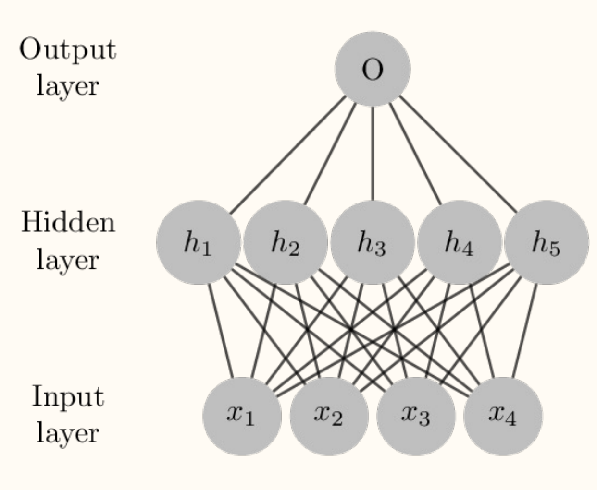

# § 4. Deep Neural Networks

## Deep Neural Networks

!!! concept "Concept 4.1 : LR can be seen as 1-layer (shallow) neural network."
    In LR, we solve

    $$
    \underset{a \in \mathbb{R}^{p}, b \in \mathbb{R}}{\operatorname{minimize}} \frac{1}{N} \sum_{i=1}^{N} \ell\left(f_{\theta}\left(X_{i}\right), Y_{i}\right)
    $$

    where $\ell\left(y_{1}, y_{2}\right)=\log \left(1+e^{-y_{1} y_{2}}\right)$ and $f_{\theta}$ is linear.

    We can view $f_{\theta}(x)=O=a^{\top} x+b$ as a 1-layer (shallow) neural network.

    

    {: width="50%"}
    

!!! concept "Concept 4.2 : Deep Neural Networks with Nonlinearities"
    What happens if we stack multiple linear layers?

    **Problem**: This is pointless because composition of linear functions is linear.  
    ( $O = W_2 h = W_2(W_1 x) = (W_2 W_1) x \leftarrow$ linear in $x$ )

    **Solution**: use a nonlinear activation function $\sigma$ to inject nonlinearities.

    

    {: width="50%"}
    

    Hidden layer $h=\sigma(W_1 x)$ ($\sigma$ : Nonlinear function)  
    Output layer $O=W_2 h = W_2 \sigma(W_1 x) \leftarrow$ nonlinear in $x$

!!! definition "Definition 4.3 : Common Activation Functions"
    - **Rectified Linear Unit (ReLU)**

        $$
        \operatorname{ReLU}(z)=\max (z, 0)
        $$

        

        {: width="50%"}
        

    - **Sigmoid**

        $$
        \operatorname{Sigmoid}(z)=\frac{1}{1+e^{-z}}
        $$

        

        {: width="50%"}
        

    - **Hyperbolic Tangent**

        $$
        \tanh (z)=\frac{1-e^{-2 z}}{1+e^{-2 z}}
        $$

        

        {: width="50%"}
        

!!! definition "Definition 4.4 : Multilayer Perceptron (MLP)"
    The **multilayer perceptron**, also called **fully connected neural network**, has the form

    $$
    \begin{aligned}
    y_{L}= & W_{L} y_{L-1}+b_{L} \\
    y_{L-1}= & \sigma\left(W_{L-1} y_{L-2}+b_{L-1}\right) \\
    & \vdots \\
    y_{2}= & \sigma\left(W_{2} y_{1}+b_{2}\right) \\
    y_{1}= & \sigma\left(W_{1} x+b_{1}\right),
    \end{aligned}
    $$

    where $x \in \mathbb{R}^{n_{0}}, W_{\ell} \in \mathbb{R}^{n_{\ell} \times n_{\ell-1}}, b_{\ell} \in \mathbb{R}^{n_{\ell}}$, and $n_{L}=1$. To clarify, $\sigma$ is applied element-wise.

!!! definition "Definition 4.5 : Linear Layer (with Batches)"
    - Input tensor: $X \in \mathbb{R}^{B \times n}, B$ batch size, $n$ number of indices.
    - Output tensor: $Y \in \mathbb{R}^{B \times m}, B$ batch size, $m$ number of indices.

    With weight $A \in \mathbb{R}^{m \times n}$, bias $b \in \mathbb{R}^{m}, k=1, \ldots B$, and $i=1, \ldots, m$ :

    $$
    Y_{k, i}=\sum_{j=1}^{n} A_{i, j} X_{k, j}+b_{i}
    $$

    Operation is independent across elements of the batch.

    If `bias=False`, then $b=0$.

## Multi-Class Classification

!!! definition "Definition 4.6 : Multi-Class Classification Problem"
    Consider supervised learning with data $X_{1}, \ldots, X_{N} \in \mathbb{R}^{n}$ and labels $Y_{1}, \ldots, Y_{N} \in\{1, \ldots, k\}$. (A $k$ class classification problem.) Assume there exists a function $f_{\star}: \mathbb{R}^{n} \rightarrow \Delta^{k}$ mapping from data to label probabilities. Here, $\Delta^{k} \subset \mathbb{R}^{k}$ denotes the set of probability mass functions on $\{1, \ldots, k\}$.

    Define the empirical distribution $\mathcal{P}(y) \in \mathbb{R}^{k}$ as the one-hot vector:

    $$
    (\mathcal{P}(y))_{i}=\left\{\begin{array}{cc}
    1 & \text { if } y=i \\
    0 & \text { otherwise }
    \end{array}\right.
    $$

    for $i=1, \ldots, k$.

!!! definition "Definition 4.7 : Softmax Function"
    **Softmax** function $\mu: \mathbb{R}^{k} \rightarrow \Delta^{k}$ is defined by

    $$
    \mu_{i}(z)=(\mu(z))_{i}=\frac{e^{z_{i}}}{\sum_{j=1}^{k} e^{z_{j}}}
    $$

    for $i=1, \ldots, k$, where $z=\left(z_{1}, \ldots, z_{k}\right) \in \mathbb{R}^{k}$. Since

    $$
    \sum_{i=1}^{k} \mu_{i}(z)=1, \quad \mu>0
    $$

    Name "softmax" is a misnomer. "Softargmax" would be more accurate

    - $\mu(z) \not \approx \max (z)$
    - $\mu(z) \approx \operatorname{argmax}(z)$

    Examples:

    $$
    \mu\left(\left[\begin{array}{l}
    1 \\
    2 \\
    3
    \end{array}\right]\right)=\left[\begin{array}{l}
    0.09 \\
    0.24 \\
    0.6
    \end{array}\right],
    \mu\left(\left[\begin{array}{c}
    999 \\
    0 \\
    -2
    \end{array}\right]\right) \approx\left[\begin{array}{l}
    1 \\
    0 \\
    0
    \end{array}\right],
    \mu\left(\left[\begin{array}{c}
    -2 \\
    -2 \\
    -99
    \end{array}\right]\right) \approx\left[\begin{array}{c}
    0.5 \\
    0.5 \\
    0
    \end{array}\right]
    $$

!!! definition "Definition 4.8 : Softmax Regression (SR)"
    In **softmax regression (SR)**:

    Choose the model

    $$
    \mu\left(f_{A, b}(x)\right)=\frac{1}{\sum_{i=1}^{k} e^{a_{i}^{\top} x+b_{i}}}\left[\begin{array}{c}
    e^{a_{1}^{\top} x+b_{1}} \\
    e^{a_{2}^{\top} x+b_{2}} \\
    \vdots \\
    e^{a_{k}^{\top} x+b_{k}}
    \end{array}\right], \quad f_{A, b}(x)=A x+b, A=\left[\begin{array}{c}
    a_{1}^{\top} \\
    a_{2}^{\top} \\
    \vdots \\
    a_{k}^{\top}
    \end{array}\right] \in \mathbb{R}^{k \times n}, \quad b=\left[\begin{array}{c}
    b_{1} \\
    b_{2} \\
    \vdots \\
    b_{k}
    \end{array}\right] \in \mathbb{R}^{k} .
    $$

    Minimize KL-Divergence (or cross entropy) from the model $\mu\left(f_{A, b}\left(X_{i}\right)\right)$ output probabilities to the empirical distribution $\mathcal{P}\left(Y_{i}\right)$.

    $$
    \underset{A \in \mathbb{R}^{k \times n}, b \in \mathbb{R}^{k}}{\operatorname{minimize}} \sum_{i=1}^{N} D_{\mathrm{KL}}\left(\mathcal{P}\left(Y_{i}\right) \| \mu\left(f_{A, b}\left(X_{i}\right)\right)\right) \Longleftrightarrow \underset{A \in \mathbb{R}^{k \times n}, b \in \mathbb{R}^{k}}{\operatorname{minimize}} \sum_{i=1}^{N} H\left(\mathcal{P}\left(Y_{i}\right), \mu\left(f_{A, b}\left(X_{i}\right)\right)\right)
    $$

!!! concept "Concept 4.9 : Other Expression of Softmax Regression"
    $$
    \begin{gathered}
    \underset{A \in \mathbb{R}^{k \times n}, b \in \mathbb{R}^{k}}{\operatorname{minimize}} \sum_{i=1}^{N} H\left(\mathcal{P}\left(Y_{i}\right), \mu\left(f_{A, b}\left(X_{i}\right)\right)\right) \\
    \mathbb{\Updownarrow} \\
    \underset{A \in \mathbb{R}^{k \times n}, b \in \mathbb{R}^{k}}{\operatorname{minimize}} \frac{1}{N} \sum_{i=1}^{N}-\log \left(\mu_{Y_{i}}\left(f_{A, b}\left(X_{i}\right)\right)\right) \\
    \mathbb{\Updownarrow} \\
    \underset{A \in \mathbb{R}^{k \times n}, b \in \mathbb{R}^{k}}{\operatorname{minimize}} \frac{1}{N} \sum_{i=1}^{N}-\log \left(\frac{\exp \left(a_{Y_{i}}^{\top} X_{i}+b_{Y_{i}}\right)}{\sum_{j=1}^{k} \exp \left(a_{j}^{\top} X_{i}+b_{j}\right)}\right) \\
    \mathbb{\Updownarrow} \\
    \underset{A \in \mathbb{R}^{k \times n}, b \in \mathbb{R}^{k}}{\operatorname{minimize}} \frac{1}{N} \sum_{i=1}^{N}\left(-\left(a_{Y_{i}}^{\top} X_{i}+b_{Y_{i}}\right)+\log \left(\sum_{j=1}^{k} \exp \left(a_{j}^{\top} X_{i}+b_{j}\right)\right)\right)
    \end{gathered}
    $$

!!! definition "Definition 4.10 : Cross Entropy Loss"
    Where $f \in \mathbb{R}^{k}, y \in \{1, 2, \cdots, k\}$, the **cross entropy loss** is

    $$
    \ell^{\mathrm{CE}}(f, y)=-\log \left(\frac{\exp \left(f_{y}\right)}{\sum_{j=1}^{k} \exp \left(f_{j}\right)}\right)
    $$

!!! concept "Concept 4.11 : SR uses cross entropy loss as loss function."
    $$
    \begin{gathered}
    \underset{A \in \mathbb{R}^{k \times n}, b \in \mathbb{R}^{k}}{\operatorname{minimize}} \sum_{i=1}^{N} H\left(\mathcal{P}\left(Y_{i}\right), \mu\left(f_{A, b}\left(X_{i}\right)\right)\right) \\
    \mathbb{\Updownarrow} \\
    \underset{A \in \mathbb{R}^{k \times n}, b \in \mathbb{R}^{k}}{\operatorname{minimize}} \frac{1}{N} \sum_{i=1}^{N}-\log \left(\frac{\exp \left(a_{Y_{i}}^{\top} X_{i}+b_{Y_{i}}\right)}{\sum_{j=1}^{k} \exp \left(a_{j}^{\top} X_{i}+b_{j}\right)}\right) \\
    \mathbb{\Updownarrow} \\
    \underset{A \in \mathbb{R}^{k \times n}, b \in \mathbb{R}^{k}}{\operatorname{minimize}} \frac{1}{N} \sum_{i=1}^{N} \ell^{\mathrm{CE}}\left(f_{A, b}\left(X_{i}\right), Y_{i}\right)
    \end{gathered}
    $$

    - SR = linear model $f_{A, b}$ with cross entropy loss:

    $$
    \underset{A \in \mathbb{R}^{k \times n}, b \in \mathbb{R}^{k}}{\operatorname{minimize}} \frac{1}{N} \sum_{i=1}^{N} \ell^{\mathrm{CE}}\left(f_{A, b}\left(X_{i}\right), Y_{i}\right) \Longleftrightarrow \underset{A \in \mathbb{R}^{k \times n}, b \in \mathbb{R}^{k}}{\operatorname{minimize}} \sum_{i=1}^{N} D_{\mathrm{KL}}\left(\mathcal{P}\left(Y_{i}\right) \| \mu\left(f_{A, b}\left(X_{i}\right)\right)\right)
    $$

    - The natural extension of SR is to consider

        $$
        \underset{\theta \in \mathbb{R}^{p}}{\operatorname{minimize}} \frac{1}{N} \sum_{i=1}^{N} \ell^{\mathrm{CE}}\left(f_{\theta}\left(X_{i}\right), Y_{i}\right) \Leftrightarrow \underset{\theta \in \mathbb{R}^{p}}{\operatorname{minimize}} \quad \sum_{i=1}^{N} D_{\mathrm{KL}}\left(\mathcal{P}\left(Y_{i}\right) \| \mu\left(f_{\theta}\left(X_{i}\right)\right)\right)
        $$

        where $f_{\theta}$ is a deep neural network.

## GPUs in Deep Learning

!!! concept "Concept 4.12 : History of GPU Computing"
    Rendering graphics involves computing many small tasks in parallel. Graphics cards provide many small processors to render graphics.

    In 1999, Nvidia released GeForce 256 and introduced programmability in the form of vertex and pixel shaders. Marketed as the first **'Graphical Processing Unit (GPU)'**.

    Researchers quickly learned how to implement linear algebra by mapping matrix data into textures and applying shaders.

    In 2007, Nvidia released **'Compute Unified Device Architecture (CUDA)'**, which enabled general purpose computing on a CUDA-enabled GPUs.

    Unlike CPUs which provide fast serial processing, GPUs provide massive parallel computing with its numerous slower processors.

    The 2008 financial crisis hit Nvidia very hard as GPUs were luxury items used for games. This encouraged Nvidia to invest further in **'General Purpose GPUs (GPGPU)'** and create a more stable consumer base.

!!! concept "Concept 4.13 : CPU Computing Model"
    

    {: width="75%"}
    

!!! concept "Concept 4.14 : GPU Computing Model"
    

    {: width="100%"}
    

!!! concept "Concept 4.15 : GPUs for Machine Learning"
    Raina et al.'s 2009* paper demonstrated that GPUs can be used to train large neural networks. (This was not the first to use of GPUs in machine learning, but it was one of the most influential.)

    Modern deep learning is driven by big data and big compute, respectively provided by the internet and GPUs.

    Krizhevsky et al.'s 2012 landmark paper introduced AlexNet trained on GPUs and kickstarted the modern deep learning boom.

    (R. Raina, A. Madhavan, and A. Y. Ng , Large-scale Deep Unsupervised Learning using Graphics Processors, ICML, 2009. / 
    A. Krizhevsky, I. Sutskever, G. E. Hinton, ImageNet Classification with Deep Convolutional Neural Networks, NeurIPS, 2012.)

!!! concept "Concept 4.16 : Deep Learning on GPUs"
    Steps for training neural network on GPU:

    1. Create the neural network on CPU and send it to GPU. Neural network parameters stay on GPU.

        - Sometimes you load parameters from CPU to GPU.

    2. Select data batch (image, label) and send it to GPU every iteration

        - Data for real-world setups is large, so keeping all data on GPU is infeasible.

    3. On GPU, compute network output (forward pass)
    4. On GPU, compute gradients (backward pass)
    5. On GPU, perform gradient update
    6. Once trained, perform prediction on GPU.

        - Send test data to GPU.
        - Compute network output.
        - Retrieve output on CPU.
        - Alternatively, neural network can be loaded on CPU and prediction can be done on CPU.
