# § 8. CNNs for Other Supervised Learning Tasks

## Inverse Problem

!!! definition "Definition 8.1 <a id="definition-8-1"></a>: Inverse Problem Model"
    In **inverse problems**, we wish to recover a signal $X_{\text {true }}$ given measurements $Y$. The unknown and the measurements are related through

    $$
    \mathcal{A}\left[X_{\text {true }}\right]+\varepsilon=Y,
    $$

    where $\mathcal{A}$ is often, but not always, linear, and $\varepsilon$ represents small error.

    The **forward model** $\mathcal{A}$ may or may not be known. In other words, the goal of an inverse problem is to find an **approximation of $\mathcal{A}^{-1}$**.

    In many cases, $\mathcal{A}$ is not even be invertible. In such cases, we can still hope to find an mapping that serves as an approximate inverse in practice.

!!! concept "Concept 8.2 <a id="concept-8-2"></a>: Inverse Problems via Deep Learning"
    In deep learning, we use a neural network to approximate the inverse mapping

    $$
    f_{\theta} \approx \mathcal{A}^{-1}
    $$

    i.e., we want $f_{\theta}(Y) \approx X_{\text {true }}$ for the measurements $X$ that we care about.

    If we have $X_{1}, \ldots, X_{N}$ and $Y_{1}, \ldots, Y_{N}$ (but no direct knowledge of $\mathcal{A}$ ), we can solve

    $$
    \underset{\theta \in \mathbb{R}^{p}}{\operatorname{minimize}} \sum_{i=1}^{N}\left\|f_{\theta}\left(Y_{i}\right)-X_{i}\right\|
    $$

    If we have $X_{1}, \ldots, X_{N}$ and knowledge of $\mathcal{A}$, we can solve

    $$
    \underset{\theta \in \mathbb{R}^{p}}{\operatorname{minimize}} \sum_{i=1}^{N}\left\|f_{\theta}\left[\mathcal{A}\left(X_{i}\right)\right]-X_{i}\right\|
    $$

    If we have $Y_{1}, \ldots, Y_{N}$ and knowledge of $\mathcal{A}$, we can solve

    $$
    \underset{\theta \in \mathbb{R}^{p}}{\operatorname{minimize}} \sum_{i=1}^{N}\left\|\mathcal{A}\left[f_{\theta}\left(Y_{i}\right)\right]-Y_{i}\right\|
    $$

### Gaussian Denoising

!!! definition "Definition 8.3 <a id="definition-8-3"></a>: Gaussian Denoising"
    Given $X_{\text {true }} \in \mathbb{R}^{w \times h}$, we measure

    $$
    Y=X_{\text {true }}+\varepsilon
    $$

    where $\varepsilon_{i j} \sim \mathcal{N}\left(0, \sigma^{2}\right)$ is IID Gaussian noise. For the sake of simplicity, assume we know $\sigma$. Goal is to recover $X_{\text {true }}$ from $Y$.

    **Gaussian denoising** is the simplest setup in which the goal is to remove noise from the image. In more realistic setups, the noise model will be more complicated and the noise level $\sigma$ will be unknown.

!!! definition "Definition 8.4 <a id="definition-8-4"></a>: DnCNN"
    In 2017, Zhang et al. presented the **denoising convolutional neural networks (DnCNNs)**. They trained a 17-layer CNN $f_{\theta}$ to learn the noise with the loss

    $$
    \mathcal{L}(\theta)=\sum_{i=1}^{N}\left\|f_{\theta}\left(Y_{i}\right)-\left(Y_{i}-X_{i}\right)\right\|^{2}
    $$

    so that the clean recovery can be obtained with $Y_{i}-f_{\theta}\left(Y_{i}\right)$. (This is equivalent to using a residual connection from beginning to end.)

    <center>
    {: width="70%"}
    </center>

    ---

    Image denoising is was an area with a large body of prior work. DnCNN dominated all prior approaches that were not based on deep learning.

    Nowadays, all state-of-the-art denoising algorithms are based on deep learning.

    <center>
    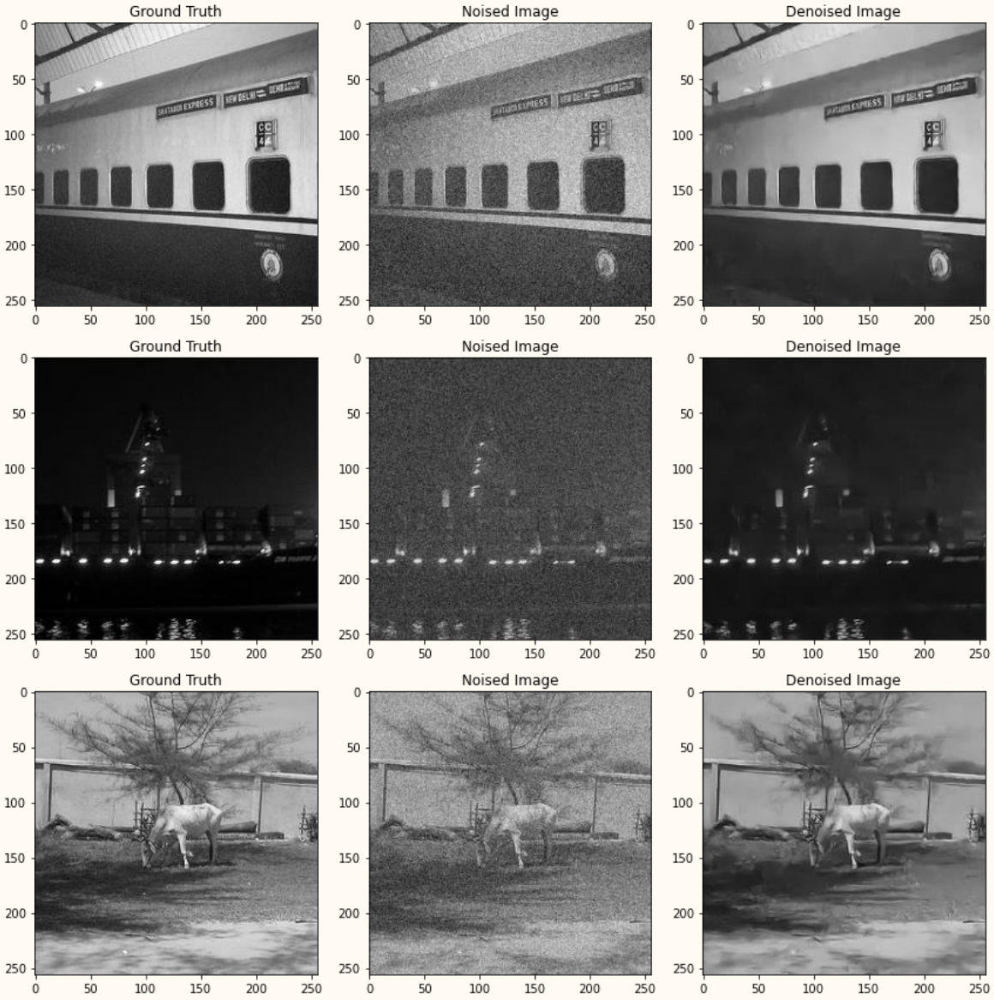{: width="100%"}
    </center>

    (K. Zhang, W. Zuo, Y. Chen, D. Meng, and L. Zhang, Beyond a Gaussian denoiser: Residual learning of deep CNN for image denoising, IEEE TIP, 2017.)

### Image Super-Resolution

!!! definition "Definition 8.5 <a id="definition-8-5"></a>: Image Super-Resolution"
    Given $X_{\text {true }} \in \mathbb{R}^{w \times h}$, we measure

    $$
    Y=\mathcal{A}\left(X_{\text {true }}\right)
    $$

    where $\mathcal{A}$ is a "downsampling" operator. So $Y \in \mathbb{R}^{w_{2} \times h_{2}}$ with $w_{2}<w$ and $h_{2}<h$. Goal is to recover $X_{\text {true }}$ from $Y$.

    In the simplest setup, $\mathcal{A}$ is an average pool operator with $r \times r$ kernel and a stride $r$.

!!! definition "Definition 8.6 <a id="definition-8-6"></a>: SRCNN"
    In 2015, Dong et al. presented super-resolution convolutional neural network (SRCNN). They trained a 3-layer $\operatorname{CNN} f_{\theta}$ to learn the high-resolution reconstruction with the loss

    $$
    \mathcal{L}(\theta)=\sum_{i=1}^{N}\left\|f_{\theta}\left(\tilde{Y}_{i}\right)-X_{i}\right\|^{2}
    $$

    where $\tilde{Y}_{i} \in \mathbb{R}^{w \times h}$ is an upsampled version of $Y_{i} \in \mathbb{R}^{(w / r) \times(h / r)}$, i.e., $\tilde{Y}_{i}$ has the same number of pixels as $X_{i}$, but the image is pixelated or blurry. The goal is to have $f_{\theta}\left(\tilde{Y}_{i}\right)$ be a sharp reconstruction.

    <center>
    {: width="70%"}
    </center>

    ---

    SRCNN showed that simple learning based approaches can match the state-of the art performances of superresolution task.

    <center>
    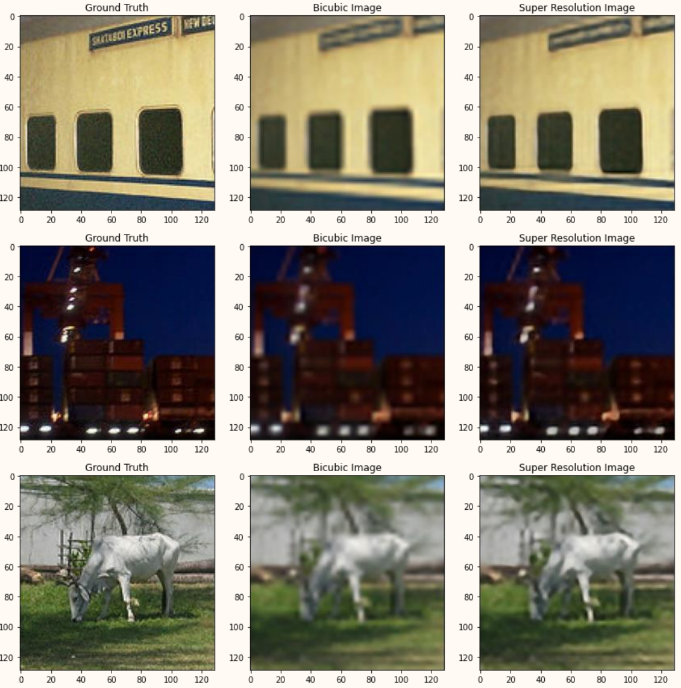{: width="100%"}
    </center>

    (C. Dong, C. C. Loy, K. He, and X. Tang, Image super-resolution using deep convolutional networks, IEEE TPAMI, 2015.)

!!! definition "Definition 8.7 <a id="definition-8-7"></a>: VDSR"
    In 2016, Kim et al. presented VDSR. They trained a 20-layer CNN with a residual connection $f_{\theta}$ to learn the high-resolution reconstruction with the loss

    $$
    \mathcal{L}(\theta)=\sum_{i=1}^{N}\left\|f_{\theta}\left(\tilde{Y}_{i}\right)-X_{i}\right\|^{2}
    $$

    The residual connection was the key insight that enabled the training of much deeper CNNs.

    <center>
    {: width="70%"}
    </center>

    ---

    VDSR dominated all prior approaches not based on deep learning.
    Showed that simple learning based approaches can batch the state-of theart performances of super-resolution task.

    <center>
    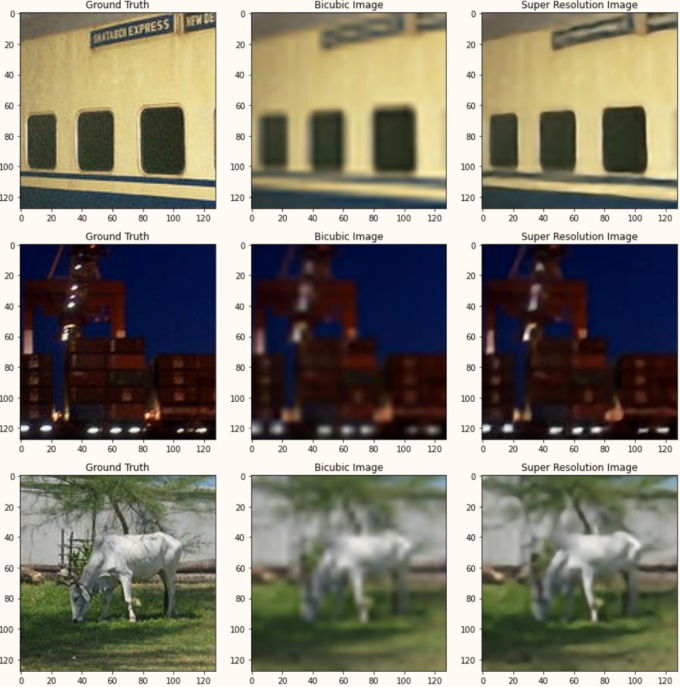{: width="100%"}
    </center>

    (J. Kim, J. K. Lee, and K. M. Lee, Accurate image super-resolution using very deep convolutional networks, CVPR, 2016.)

### Other Examples

!!! example "Example 8.8 <a id="example-8-8"></a>: SRGAN"
    <center>
    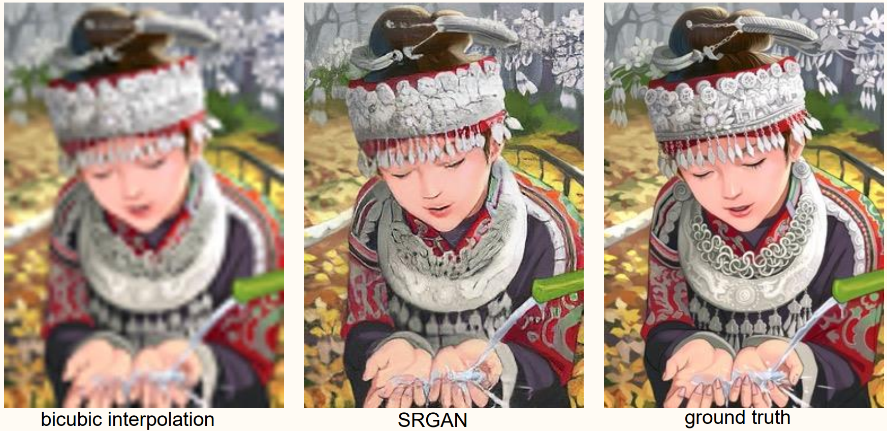{: width="100%"}
    </center>

    <center>
    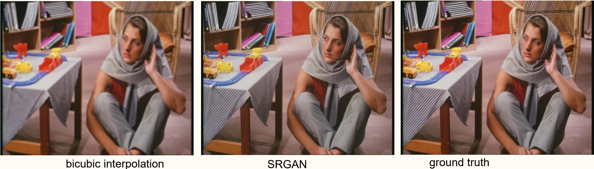{: width="100%"}
    </center>

    <center>
    {: width="100%"}
    </center>

    (C. Ledig, L. Theis, F. Huszar, J. Caballero, A. Cunningham, A. Acosta, A. Aitken, A. Tejani, J. Totz, Z. Wang, and W. Shi, Photo-realistic single image super-resolution using a generative adversarial network, CVPR, 2017.)

!!! example "Example 8.9 <a id="example-8-9"></a>: Image Colorization"
    <center>
    {: width="100%"}
    </center>

    (R. Zhang, P. Isola, and A. A. Efros, Colorful image colorization, ECCV, 2016.)

!!! example "Example 8.10 <a id="example-8-10"></a>: Image Inpainting"
    <center>
    {: width="100%"}
    </center>

    <center>
    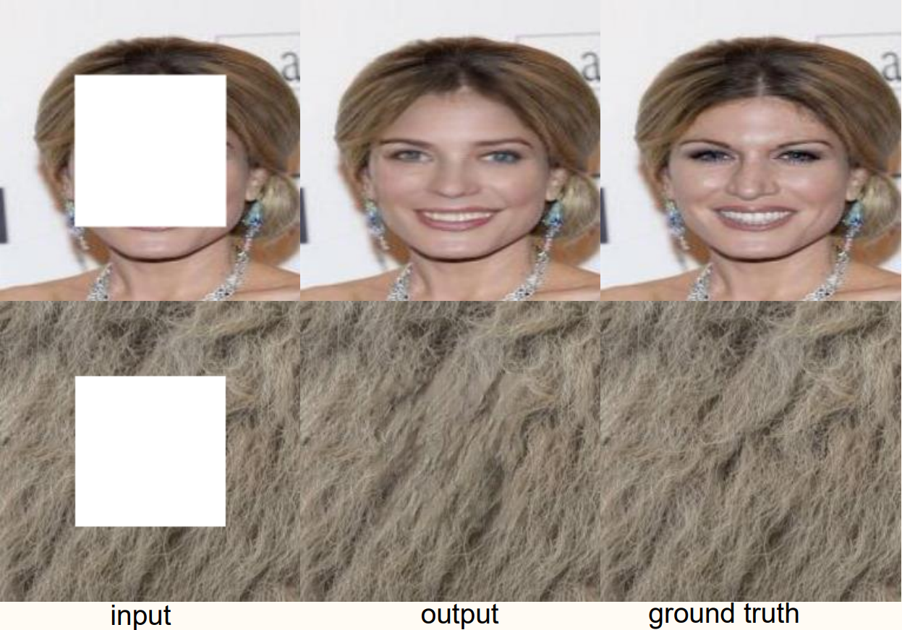{: width="100%"}
    </center>

    (J. Yu, Z. Lin, J. Yang, X. Shen, X. Lu, and T. S. Huang, Generative image inpainting with contextual attention, CVPR, 2018.)

## Operations Increasing Spatial Dimensions

!!! concept "Concept 8.11 <a id="concept-8-11"></a>: Operations Increasing Spatial Dimensions"
    In image classification tasks, the spatial dimensions of neural networks often decrease as the depth progresses.

    This is because we are trying to forget location information. (In classification, we care about what is in the image, but we do not where it is in the image.)

    However, there are many networks for which we want to increase the spatial dimension:

    - Linear layers
    - Upsampling
    - Transposed convolution

### Transposed convolution

!!! concept "Concept 8.12 <a id="concept-8-12"></a>: Linear Operator $\cong$ Matrix"
    Core tenet of linear algebra: matrices are linear operators and linear operators are matrices.

    Let $f: \mathbb{R}^{n} \rightarrow \mathbb{R}^{m}$ be linear, i.e.,

    $$
    f(x+y)=f(x)+f(y) \text { and } f(\alpha x)=\alpha f(x)
    $$

    for all $x, y \in \mathbb{R}^{n}$ and $\alpha \in \mathbb{R}$.

    There exists a matrix $A \in \mathbb{R}^{m \times n}$ that represents $f: \mathbb{R}^{n} \rightarrow \mathbb{R}^{m}$, i.e.,

    $$
    f(x)=A x
    $$

    for all $x \in \mathbb{R}^{n}$.

    Let $e_{i}$ be the $i$-th unit vector, i.e., $e_{i}$ has all zeros elements except entry 1 in the $i$-th coordinate.

    Given a linear $f: \mathbb{R}^{n} \rightarrow \mathbb{R}^{m}$, we can find the matrix

    $$
    A=\left[\begin{array}{llll}
    A_{;, 1} & A_{;, 2} & \cdots & A_{;, n}
    \end{array}\right] \in \mathbb{R}^{m \times n}
    $$

    representing $f$ with

    $$
    f\left(e_{j}\right)=A e_{j}=A_{;, j}
    $$

    for all $j=1, \ldots, n$, or with

    $$
    e_{i}^{\top} f\left(e_{j}\right)=e_{i}^{\top} A e_{j}=A_{i, j}
    $$

    for all $i=1, \ldots, m$ and $j=1, \ldots, n$.

!!! concept "Concept 8.13 <a id="concept-8-13"></a>: Linear Operator $\ncong$ Matrix"
    In applied mathematics and machine learning, there are many setups where explicitly forming the matrix representation $A \in \mathbb{R}^{m \times n}$ is costly, even though the matrix-vector products $A x$ and $A^{\top} y$ are efficient to evaluate.

    In machine learning, convolutions are the primary example. Other areas, linear operators based on FFTs are the primary example.

    In such setups, the matrix representation is still a useful conceptual tool, even if we never intend to form the matrix.

Given a matrix $A$, the transpose $A^{\top}$ is obtained by flipping the row and column dimensions, i.e., $\left(A^{\top}\right)_{i j}=(A)_{j i}$.
However, using this definition is not always the most effective when understanding the action of $A^{\top}$.

Another approach is to use the adjoint view. Since

$$
y^{\top}(A x)=\left(A^{\top} y\right)^{\top} x
$$

for any $x \in \mathbb{R}^{n}$ and $y \in \mathbb{R}^{m}$, understand the action of $A^{\top}$ by finding an expression of the form

$$
y^{\top} A x=\sum_{j=1}^{n}(\text { something })_{j} x_{j}=\left(A^{\top} y\right)^{\top} x
$$

!!! example "Example 8.14 <a id="example-8-14"></a>: 1D Transpose Convolution"
    Consider the 1D convolution represented by $A \in \mathbb{R}^{(n-f+1) \times n}$ defined with a given $w \in \mathbb{R}^{f}$ and

    $$
    A=\left[\begin{array}{cccccccc}
    w_{1} & \cdots & w_{f} & 0 & \cdots & & & 0 \\
    0 & w_{1} & \cdots & w_{f} & 0 & \cdots & & 0 \\
    0 & 0 & w_{1} & \cdots & w_{f} & 0 & \cdots & 0 \\
    \vdots & & & \ddots & & \ddots & & \vdots \\
    0 & & \cdots & 0 & w_{1} & \cdots & w_{f} & 0 \\
    0 & & \cdots & 0 & 0 & w_{1} & \cdots & w_{f}
    \end{array}\right]
    $$

    Then we have

    $$
    (A x)_{j}=\sum_{i=1}^{f} w_{i} x_{j+i-1}
    $$

    ---

    and we have the following formula which coincides with transposing the matrix $A$.

    $$
    \begin{aligned}
    y^{\top} A x & =\sum_{j=1}^{n-f+1} y_{j} \sum_{i=1}^{f} w_{i} x_{j+i-1} \\
    & =\sum_{j=1}^{n-f+1} \sum_{i=1}^{f} y_{j} w_{i} x_{j+i-1} \sum_{k=1}^{n} \mathbf{1}_{\{k=j+i-1\}} \\
    & =\sum_{k=1}^{n} \sum_{j=1}^{n-f+1} \sum_{i=1}^{f} y_{j} w_{i} x_{k} \mathbf{1}_{\{k-j+1=i\}} \\
    & =\sum_{k=1}^{n} x_{k} \sum_{j=1}^{n-f+1} \sum_{i=1}^{f} w_{k-j+1} y_{j} \mathbf{1}_{\{k-j+1=i\}} \\
    & =\sum_{k=1}^{n} x_{k} \sum_{j=1}^{n-f+1} w_{k-j+1} y_{j} \sum_{i=1}^{f} \mathbf{1}_{\{k-j+1=i\}} \\
    & =\sum_{k=1}^{n} x_{k} \sum_{j=1}^{n-f+1} w_{k-j+1} y_{j} \mathbf{1}_{\{1 \leq k-j+1 \leq f\}} \\
    & =\sum_{k=1}^{n} x_{k} \sum_{j=1}^{n-f+1} w_{k-j+1} y_{j} \mathbf{1}_{\{j \leq k\}} \mathbf{1}_{\{k-f+1 \leq j\}} \\
    & =\sum_{k=1}^{n} x_{k} \sum_{j=\max (k-f+1,1)}^{\min (n-f+1, k)} w_{k-j+1} y_{j}=\left(A^{\top} y\right)^{\top} x \\
    \end{aligned}
    $$

!!! definition "Definition 8.15 <a id="definition-8-15"></a>: Transposed Convolution"
    In transposed convolution, input neurons additively distribute values to the output via the kernel.
    Before people noticed that this is the transpose of convolution, the names backwards convolution and deconvolution were used.

    For each input neuron, multiply the kernel and add (accumulate) the value in the output.
    Can accommodate strides, padding, and multiple channels.

    <center>
    {: width="100%"}
    </center>

    <center>
    {: width="100%"}
    </center>

- Convolution Visualized

<center>
{: width="50%"}
</center>

- Transpose Convolution Visualized

<center>
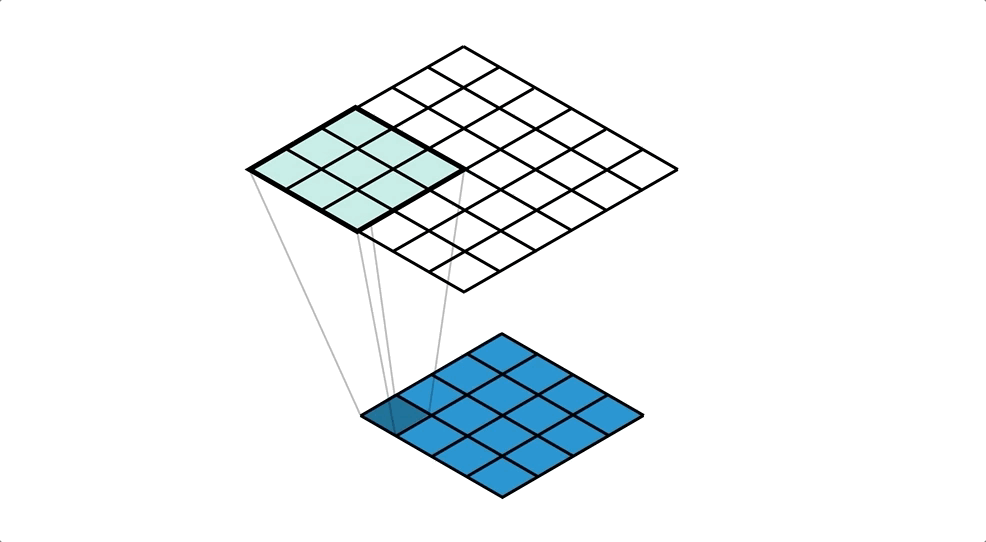{: width="100%"}
</center>

!!! definition "Definition 8.16 <a id="definition-8-16"></a>: 2D Transpose Convolution Layer (Formal Definition)"
    - $B$ : batch size
    - $C_{\text{in}}$ : # of input channels
    - $C_{\text{out}}$ : # of output channels
    - $m, n$ : # of vertical and horizontal indices of input
    - $f_1, f_2$ : # of vertical and horizontal indices of filter

    ---

    - Input tensor: $Y \in \mathbb{R}^{B \times C_{\mathrm{in}} \times m \times n}$
    - Output tensor: $X \in \mathbb{R}^{B \times C_{\text {out }} \times\left(m+f_{1}-1\right) \times\left(n+f_{2}-1\right)}$
    - Filter $w \in \mathbb{R}^{C_{\text {in }} \times C_{\text {out }} \times f_{1} \times f_{2}}$
    - Bias $b \in \mathbb{R}^{C_{\text {out }}}$ (If `bias=False`, then $b=0$.) 

    ---

    ```
    def trans_conv(Y, w, b):
        c_in, c_out, f1, f2 = w.shape
        batch, c_in, m, n = Y.shape
        X = torch.zeros(batch, c_out, m + f1 - 1, n + f2 - 1)
        for k in range(c_in):
            for i in range(Y.shape[2]):
                for j in range(Y.shape[3]):
                    X[:, :, i:i+f1, j:j+f2] += Y[:, k, i, j].view(-1,1,1,1)*w[k, :, :, :].unsqueeze(0)
        return X + b.view(1,-1,1,1)
    ```

In a matrix representation $A$ of convolution, the dependencies of the inputs and outputs are represented by the non-zeros of $A$, i.e., the sparsity pattern of $A$.
If $A_{i j}=0$, then input neuron $j$ does not affect the output neuron $i$. If $A_{i j} \neq 0$, then $\left(A^{\top}\right)_{j i} \neq 0$. So if input neuron $j$ affects output neuron $i$ in convolution, then input neuron $i$ affects output neuron $j$ in transposed convolution.

<center>
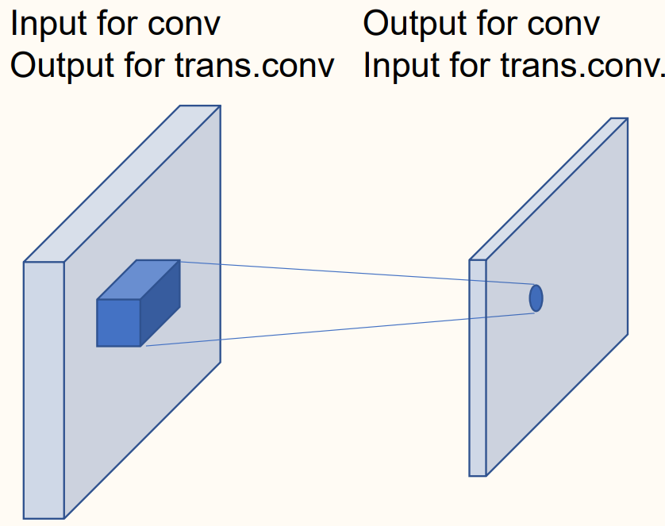{: width="50%"}
</center>

We can combine this reasoning with our visual understanding of convolution. The diagram simultaneously illustrates the dependencies for both convolution and transposed convolution.

### Upsampling

!!! concept "Concept 8.17 <a id="concept-8-17"></a>: Upsampling"
    `torch.nn.Upsample` with `mode='nearest'`

    <center>
    {: width="75%"}
    </center>

!!! concept "Concept 8.18 <a id="concept-8-18"></a>: Upsampling"
    `Torch.nn.Upsample` with `mode='bilinear'`  
    `linear` interpolation is available for 1D data  
    `trilinear` interpolation is available for 3D data  
    (We won't pay attention to the interpolation formula.)

    <center>
    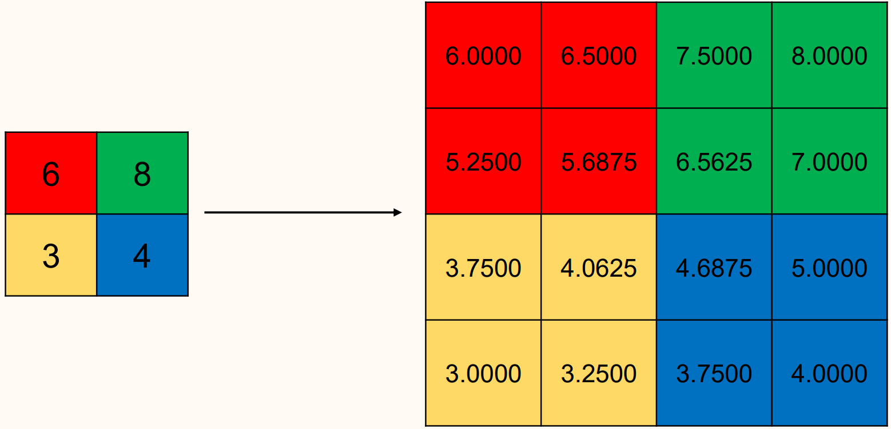{: width="75%"}
    </center>

## Semantic Segmentation

!!! definition "Definition 8.19 <a id="definition-8-19"></a>: Semantic Segmentation"
    In **semantic segmentation**, the goal is to segment the image into semantically meaningful regions by classifying each pixel.

    <center>
    {: width="100%"}
    </center>

!!! definition "Definition 8.20 <a id="definition-8-20"></a>: Object Localization"
    **Object localization** localizes a single object usually via a bounding box.

    <center>
    {: width="60%"}
    </center>

!!! definition "Definition 8.21 <a id="definition-8-21"></a>: Object Detection"
    **Object detection** detects many objects, with the same class often repeated, usually via bounding boxes.

    <center>
    {: width="100%"}
    </center>

!!! definition "Definition 8.22 <a id="definition-8-22"></a>: Image Segmentation"
    **Instance segmentation** distinguishes multiple instances of the same object type.

    <center>
    {: width="100%"}
    </center>

We will focus on semantic segmentation.

!!! definition "Definition 8.23 <a id="definition-8-23"></a>: Pascal VOC"
    We will use **PASCAL Visual Object Classes (VOC) dataset** for semantic segmentation.
    (Dataset also contains labels for object detection.)

    There are 21 classes: 20 main classes and 1 "unlabeled" class.

    Data $X_{1}, \ldots, X_{N} \in \mathbb{R}^{3 \times m \times n}$ and labels $Y_{1}, \ldots, Y_{N} \in\{0,1, \ldots, 20\}^{m \times n}$, i.e., $Y_{i}$ provides a class label for every pixel of $X_{i}$.

    <center>
    {: width="40%"}
    </center>

!!! concept "Concept 8.24 <a id="concept-8-24"></a>: Loss for Semantic Segmentation"
    Consider the neural network

    $$
    f_{\theta}: \mathbb{R}^{3 \times m \times n} \rightarrow \mathbb{R}^{k \times m \times n}
    $$

    such that $\mu\left(f_{\theta}(X)\right)_{i j} \in \Delta^{k}$ is the probabilities for the $k$ classes for pixel $(i, j)$.

    We minimize the sum of pixel-wise cross-entropy losses

    $$
    \mathcal{L}(\theta)=\sum_{l=1}^{N} \sum_{i=1}^{m} \sum_{j=1}^{n} \ell^{\mathrm{CE}}\left(f_{\theta}\left(X_{l}\right)_{i j},\left(Y_{l}\right)_{i j}\right)
    $$

    where $\ell^{C E}$ is the cross entropy loss.

!!! definition "Definition 8.25 <a id="definition-8-25"></a>: U-Net"
    The U-Net architecture:

    - Reduce the spatial dimension to obtain high-level (coarse scale) features
    - Upsample or transpose convolution to restore spatial dimension.
    - Use residual connections across each dimension reduction stage.

    <center>
    {: width="100%"}
    </center>

!!! definition "Definition 8.26 <a id="definition-8-26"></a>: Magnetic Resonance Imaging (MRI)"
    **Magnetic resonance imaging (MRI)** is an inverse problem in which we partially measure the Fourier transform of the patient and the goal is to reconstruct the patient's image.

    So $X_{\text {true }} \in \mathbb{R}^{n}$ is the true original image (reshaped into a vector) with $n$ pixels or voxels and $\mathcal{A}\left[X_{\text {true }}\right] \in \mathbb{C}^{k}$ with $k \ll n$. (If $k=n$, MRI scan can take hours.)

    Classical reconstruction algorithms rely on Fourier analysis, total variation regularization, compressed sensing, and optimization.

    Recent state-of-the-art use deep neural networks.

!!! definition "Definition 8.27 <a id="definition-8-27"></a>: FastMRI Dataset"
    A team of researchers from Facebook AI Research and NYU released a large MRI dataset to stimulate datadriven deep learning research for MRI reconstruction.

    <center>
    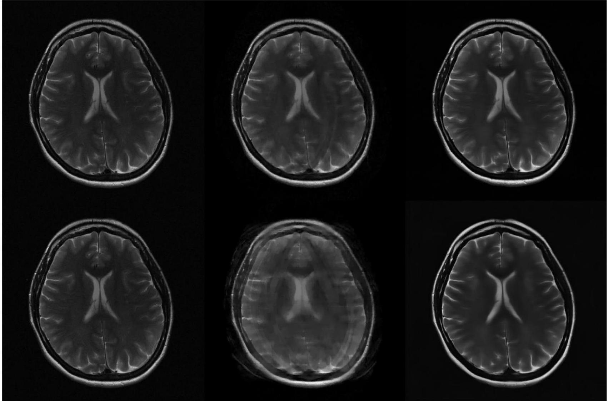{: width="70%"}
    </center>

    (J. Zbontar, F. Knoll, A. Sriram, T. Murrell, Z. Huang, M. J. Muckley, A. Defazio, R. Stern, P. Johnson, M. Bruno, M. Parente, K. J. Geras, J. Katsnelson, H. Chandarana, Z. Zhang, M. Drozdzal, A. Romero, M. Rabbat, P. Vincent, N. Yakubova, J. Pinkerton, D. Wang, E. Owens, C. L. Zitnick, M. P. Recht, D. K. Sodickson, and Y. W. Lui, fastMRI: An open dataset and benchmarks for accelerated MRI, arXiv, 2019.)

!!! definition "Definition 8.28 <a id="definition-8-28"></a>: Computational Tomography (CT)"
    **Computational tomography (CT)** is an inverse problem in which we partially measure the Radon transform of the patient and the goal is to reconstruct the patient's image.

    So $X_{\text {true }} \in \mathbb{R}^{n}$ is the true original image (reshaped into a vector) with $n$ pixels or voxels and $\mathcal{A}\left[X_{\text {true }}\right] \in \mathbb{R}^{k}$ with $k \ll n$. (If $k=n$, the X -ray exposure to perform the CT scan can be harmful.)

    Recent state-of-the-art use deep neural networks.

!!! concept "Concept 8.29 <a id="concept-8-29"></a>: U-Net is used for inverse problems."
    Although U-Net was originally proposed as an architecture for semantic segmentation, it is also being used widely as one of the default architectures in inverse problems, including MRI reconstruction.

    <center>
    {: width="100%"}
    </center>

    (J. Zbontar, F. Knoll, A. Sriram, T. Murrell, Z. Huang, M. J. Muckley, A. Defazio, R. Stern, P. Johnson, M. Bruno, M. Parente, K. J. Geras, J. Katsnelson, H. Chandarana, Z. Zhang, M. Drozdzal, A. Romero, M. Rabbat, P. Vincent, N. Yakubova, J. Pinkerton, D. Wang, E. Owens, C. L. Zitnick, M. P. Recht, D. K. Sodickson, and Y. W. Lui, fastMRI: An open dataset and benchmarks for accelerated MRI, arXiv, 2019.)

    ---

    U-Net is also used as one of the default architectures in CT reconstruction.

    <center>
    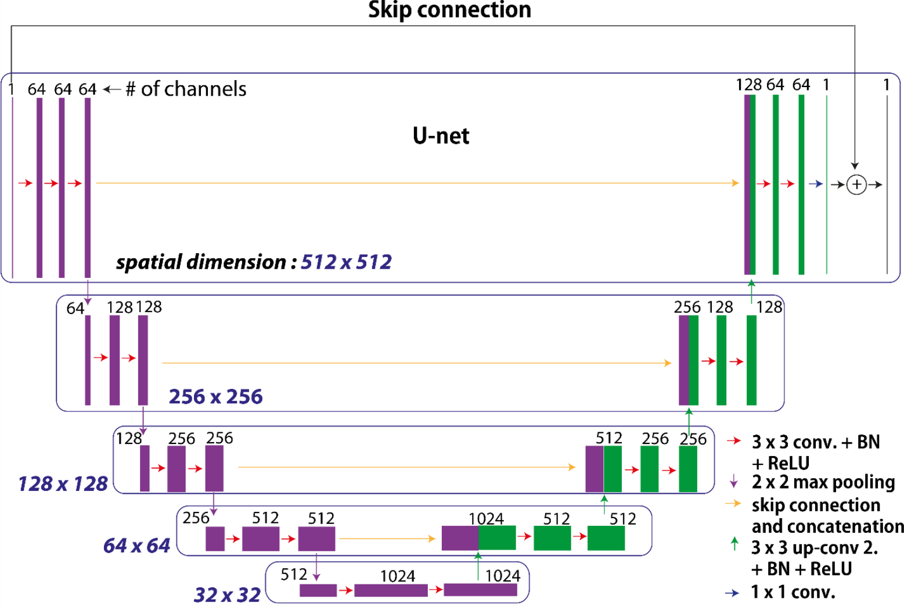{: width="100%"}
    </center>

    <center>
    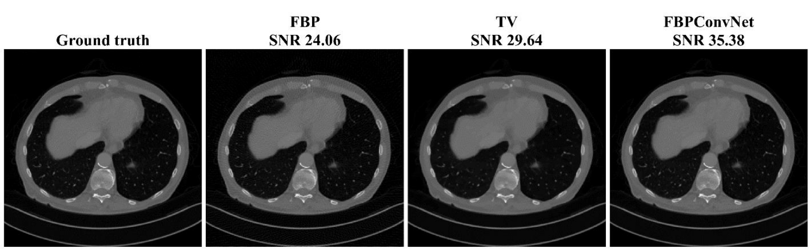{: width="70%"}
    </center>

    (K. H. Jin, M. T. McCann, E. Froustey, and M. Unser, Deep convolutional neural network for inverse problems in imaging, IEEE TIP, 2017.)
