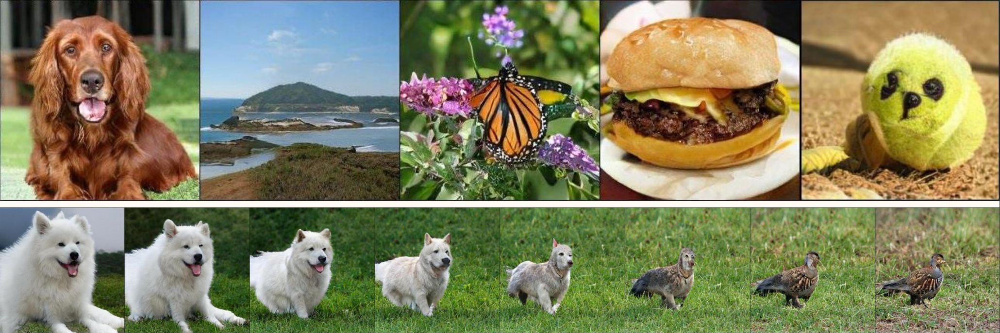
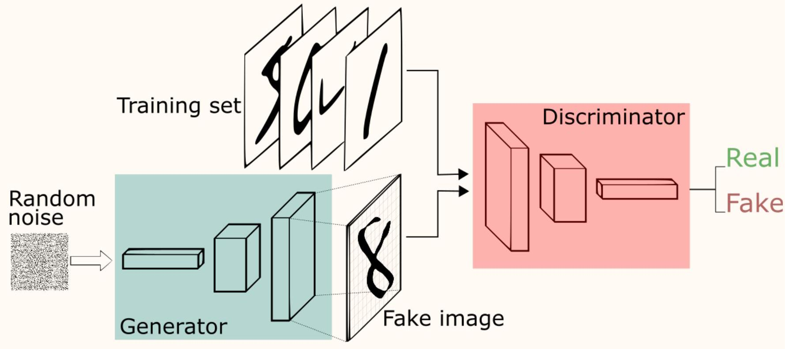
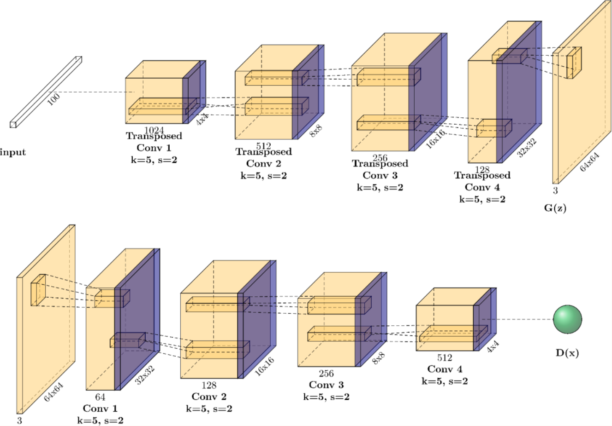

# § 12. Generative Adversarial Networks

## Minimax Optimization

!!! definition "Definition 12.1 <a id="definition-12-1"></a>: Minimax Optimization Problem"
    In a **minimax optimization problem** we minimize with respect to one variable and maximize with respect to another:

    $$
    \underset{\theta \in \Theta}{\operatorname{minimize}} \underset{\phi \in \Phi}{\operatorname{maximize}} \mathcal{L}(\theta, \phi)
    $$

    We say $\left(\theta^{\star}, \phi^{\star}\right)$ is a **solution** to the minimax problem if $\theta^{\star} \in \Theta, \phi^{\star} \in \Phi$, and

    $$
    \mathcal{L}\left(\theta^{\star}, \phi\right) \leq \mathcal{L}\left(\theta^{\star}, \phi^{\star}\right) \leq \mathcal{L}\left(\theta, \phi^{\star}\right), \quad \forall \theta \in \Theta, \phi \in \Phi .
    $$

    In other words, unilaterally deviating from $\theta^{\star} \in \Theta$ increases the value of $\mathcal{L}(\theta, \phi)$ while unilaterally deviating from $\phi^{\star} \in \Phi$ decreases the value of $\mathcal{L}(\theta, \phi)$. In yet other words, the solution is defined as a Nash equilibrium in a 2-player zero-sum game.

    (There are other broader definitions of a “solution” in minimax optimization problems. Our definition is, in a sense, the strictest definition.)

!!! concept "Concept 12.2 <a id="concept-12-2"></a>: Minimax vs. Maximin"
    When a solution (as we defined in [Definition 12.1](./12.md#definition-12-1)) does not exist, then min-max is not the same as max-min:

    $$
    \underset{\theta \in \Theta}{\operatorname{minimize}} \underset{\phi \in \Phi}{\operatorname{maximize}} \mathcal{L}(\theta, \phi) \neq \underset{\phi \in \Phi}{\operatorname{maximize}} \underset{\theta \in \Theta}{\operatorname{minimize}} \mathcal{L}(\theta, \phi)
    $$

    This is a technical distinction that we will not explore in this class.

!!! concept "Concept 12.3 <a id="concept-12-3"></a>: Minimax Optimization"
    So far, we trained NN by solving minimization problems.

    However, GANs are trained by solving minimax problems. Since the advent of GANs, minimax training has become more widely used in all areas of deep learning.

    Examples:

    - Adversarial training to make NN robust against adversarial attacks.
    - Domain adversarial networks to train NN to make fair decisions (e.g. not base its decision on a persons race or gender).

!!! definition "Definition 12.4 <a id="definition-12-4"></a>: Minimax Optimization Algorithm"
    First, consider deterministic gradient setup. Let $\alpha$ and $\beta$ be the stepsizes (learning rates) for the descent and ascent steps respectively.

    - **Simultaneous gradient ascent-descent**

        $$
        \begin{aligned}
        \phi^{k+1} & =\phi^{k}+\beta \nabla_{\phi} \mathcal{L}\left(\theta^{k}, \phi^{k}\right) \\
        \theta^{k+1} & =\theta^{k}-\alpha \nabla_{\theta} \mathcal{L}\left(\theta^{k}, \phi^{k}\right)
        \end{aligned}
        $$

    - **Alternating gradient ascent-descent**

        $$
        \begin{aligned}
        \phi^{k+1} & =\phi^{k}+\beta \nabla_{\phi} \mathcal{L}\left(\theta^{k}, \phi^{k}\right) \\
        \theta^{k+1} & =\theta^{k}-\alpha \nabla_{\theta} \mathcal{L}\left(\theta^{k}, \phi^{k+1}\right)
        \end{aligned}
        $$

    - **Gradient multi-ascent-single-descent**

        $$
        \begin{aligned}
        \phi_{0}^{k+1} & =\phi_{n_{\mathrm{dis}}}^{k} \\
        \phi_{i+1}^{k+1} & =\phi_{i}^{k+1}+\beta \nabla_{\phi} \mathcal{L}\left(\theta^{k}, \phi_{i}^{k+1}\right), \quad \text { for } i=0, \ldots, n_{\mathrm{dis}}-1 \\
        \theta^{k+1} & =\theta^{k}-\alpha \nabla_{\theta} \mathcal{L}\left(\theta^{k}, \phi_{n_{\mathrm{dis}}}^{k+1}\right)
        \end{aligned}
        $$

        ($n_{\text {dis }}$ stands for number of discriminator updates.)
        When $n_{\text {dis }}=1$, this algorithm reduces to alternating ascent-descent.

!!! definition "Definition 12.5 <a id="definition-12-5"></a>: Stochastic Minimax Optimization"
    In deep learning, however, we have access to stochastic gradients.

    - **Stochastic gradient simultaneous ascent-descent**

    $$
    \begin{aligned}
    \phi^{k+1} & =\phi^{k}+\beta g_{\phi}^{k}, & \mathbb{E}\left[g_{\phi}^{k}\right]=\nabla_{\phi} \mathcal{L}\left(\theta^{k}, \phi^{k}\right) \\
    \theta^{k+1} & =\theta^{k}-\alpha g_{\theta}^{k}, & \mathbb{E}\left[g_{\theta}^{k}\right]=\nabla_{\theta} \mathcal{L}\left(\theta^{k}, \phi^{k}\right)
    \end{aligned}
    $$

    - **Stochastic gradient alternating ascent-descent**

    $$
    \begin{aligned}
    \phi^{k+1} & =\phi^{k}+\beta g_{\phi}^{k}, & \mathbb{E}\left[g_{\phi}^{k}\right]=\nabla_{\phi} \mathcal{L}\left(\theta^{k}, \phi^{k}\right) \\
    \theta^{k+1} & =\theta^{k}-\alpha g_{\theta}^{k}, & \mathbb{E}\left[g_{\theta}^{k}\right]=\nabla_{\theta} \mathcal{L}\left(\theta^{k}, \phi^{k+1}\right)
    \end{aligned}
    $$

    - **Stochastic gradient multi-ascent-single-descent**

    $$
    \begin{aligned}
    \phi_{0}^{k+1} & =\phi_{n_{\text {dis }}}^{k} \\
    \phi_{i+1}^{k+1} & =\phi_{i}^{k+1}+\beta \nabla_{\phi} g_{\phi}^{k, i}, \quad \mathbb{E}\left[g_{\phi}^{k, i}\right]=\nabla_{\phi} \mathcal{L}\left(\theta^{k}, \phi_{i}^{k+1}\right), \quad \text { for } i=0, \ldots, n_{\text {dis }}-1 \\
    \theta^{k+1} & =\theta^{k}-\alpha g_{\theta}^{k}, \quad \mathbb{E}\left[g_{\theta}^{k}\right]=\nabla_{\theta} \mathcal{L}\left(\theta^{k}, \phi_{n_{\text {dis }}^{k}}^{k+1}\right)
    \end{aligned}
    $$

!!! concept "Concept 12.6 <a id="concept-12-6"></a>: Minimax Optimization in Pytorch"
    To perform minimax optimization in PyTorch, we maintain two separate optimizers, one for the ascent, one for the descent.
    The `OPTIMIZER` can be anything like `SGD` or `Adam`.

    ```
    G = Generator(...).to(device)
    D = Discriminator(...).to(device)
    D_optimizer = optim.OPTIMIZER(D.parameters(), lr = beta)
    G_optimizer = optim.OPTIMIZER(G.parameters(), lr = alpha)
    ```

    - Simultaneous ascent-descent:

        ```
        Evaluate D_loss
        D_loss.backward()
        Evaluate G_loss
        G_loss.backward()
        D_optimizer.step()
        G_optimizer.step()
        ```

    - Alternating ascent-descent

        ```
        Evaluate D_loss
        D_loss.backward()
        D_optimizer.step()
        Evaluate G_loss
        G_loss.backward()
        G_optimizer.step()
        ```

    - Multi-ascent-single-descent

        ```
        for _ in range(ndis) :
            Evaluate D loss
            D_loss.backward()
            D_optimizer.step()
        Evaluate G_loss
        G_loss.backward()
        G_optimizer.step()
        ```

## Definition of GAN

<center>
{: width="100%"}
</center>

These are synthetic (fake) images made with GAN.

(A. Brock, J. Donahue, and K. Simonyan, Large scale GAN training for high fidelity natural image synthesis, ICLR, 2019.)

!!! definition "Definition 12.7 <a id="definition-12-7"></a>: Generative Adversarial Networks (GAN)"
    In **generative adversarial networks (GAN)** a generator network and a discriminator network compete adversarially.

    <center>
    {: width="100%"}
    </center>

    Given data $X_{1}, \ldots, X_{N} \sim p_{\text {true }}$, GAN aims to learn $p_{\theta} \approx p_{\text {true }}$.

    Generator aims to generate fake data similar to training data.

    Discriminator aims to distinguish the training data from fake data.

    Analogy: Criminal creating fake money vs. police distinguishing fake money from real.

    (I. J. Goodfellow, J. Pouget-Abadie, M. Mirza, B. Xu, D. Warde-Farley, S. Ozair, A. Courville, and Y. Bengio, Generative adversarial networks, NeurIPS, 2014.)

!!! definition "Definition 12.8 <a id="definition-12-8"></a>: Generator Network"
    The generator $G_{\theta}: \mathbb{R}^{k} \rightarrow \mathbb{R}^{n}$ is a neural network parameterized by $\theta \in \Theta$. The generator takes a random latent vector $Z \sim p_{Z}$ as input and outputs generated (fake) data $\tilde{X}=G_{\theta}(Z)$. The latent distribution is usually $p_{Z}=\mathcal{N}(0, I)$.

    Write $p_{\theta}$ for the probability distribution of $\tilde{X}=G_{\theta}(Z)$. Although we can't evaluate the density $p_{\theta}(x)$, neither exactly nor approximately, we can sample from $\tilde{X} \sim p_{\theta}$.

!!! definition "Definition 12.9 <a id="definition-12-9"></a>: Discriminator Network"
    The discriminator $D_{\phi}: \mathbb{R}^{n} \rightarrow(0,1)$ is a neural network parameterized by $\phi \in \Phi$. The discriminator takes an image $X$ as input and outputs whether $X$ is a real or fake.
    (Real : $X$ comes from a data set, i.e., $X \sim p_{\text{true}}$. Fake : generated by $G_{\theta}$, i.e., $X \sim p_{\theta}$.)

    - $D_{\phi}(X) \approx 1$ : discriminator confidently predicts $X$ is real.
    - $D_{\phi}(X) \approx 0$ : discriminator confidently predicts $X$ is fake.
    - $D_{\phi}(X) \approx 0.5$ : discriminator is unsure whether $X$ is real or fake.

!!! concept "Concept 12.10 <a id="concept-12-10"></a>: Discriminator Loss"
    Cost of incorrectly classifying real as fake (type I error):

    $$
    \mathbb{E}_{X \sim p_{\text {true }}}\left[-\log D_{\phi}(X)\right]
    $$

    Cost of incorrectly classifying fake as real (type II error):

    $$
    \mathbb{E}_{\tilde{X} \sim p_{\theta}}\left[-\log \left(1-D_{\phi}(\tilde{X})\right)\right]=\mathbb{E}_{Z \sim \mathcal{N}(0, I)}\left[-\log \left(1-D_{\phi}\left(G_{\theta}(Z)\right)\right)\right]
    $$

    ---

    Discriminator solves

    $$
    \underset{\phi \in \Phi}{\operatorname{maximize}} \quad \mathbb{E}_{X \sim p_{\text {true }}}\left[\log D_{\phi}(X)\right]+\mathbb{E}_{\tilde{X} \sim p_{\theta}}\left[\log \left(1-D_{\phi}(\tilde{X})\right)\right]
    $$

    which is equivalent to

    $$
    \underset{\phi \in \Phi}{\operatorname{maximize}} \quad \mathbb{E}_{X \sim p_{\text {true }}}\left[\log D_{\phi}(X)\right]+\mathbb{E}_{Z \sim \mathcal{N}(0, I)}\left[\log \left(1-D_{\phi}\left(G_{\theta}(Z)\right)\right)\right]
    $$

    We can view

    $$
    \mathbb{E}_{\tilde{X} \sim p_{\theta}}\left[\log \left(1-D_{\phi}(\tilde{X})\right)\right]=\mathbb{E}_{Z \sim \mathcal{N}(0, I)}\left[\log \left(1-D_{\phi}\left(G_{\theta}(Z)\right)\right)\right]
    $$

    as an instance of the reparameterization technique.

    ---

    The loss

    $$
    \mathbb{E}_{X \sim p_{\text {true }}}\left[\log D_{\phi}(X)\right]+\mathbb{E}_{\tilde{X} \sim p_{\theta}}\left[\log \left(1-D_{\phi}(\tilde{X})\right)\right]
    $$

    puts equal weight on type I and type II errors. Alternatively, one can use the loss

    $$
    \mathbb{E}_{X \sim p_{\text {true }}}\left[\log D_{\phi}(X)\right]+\lambda \mathbb{E}_{\tilde{X} \sim p_{\theta}}\left[\log \left(1-D_{\phi}(\tilde{X})\right)\right]
    $$

    where $\lambda>0$ represents the relative significance of a type II error over a type I error.

!!! concept "Concept 12.11 <a id="concept-12-11"></a>: Generator Loss"
    Since the goal of the generator is to deceive the discriminator, the generator minimizes the same loss as [Concept 12.10](./12.md#concept-12-10).

    $$
    \underset{\theta \in \Theta}{\operatorname{minimize}} \quad \mathbb{E}_{X \sim p_{\text {true }}}\left[\log D_{\phi}(X)\right]+\mathbb{E}_{Z \sim \mathcal{N}(0, I)}\left[\log \left(1-D_{\phi}\left(G_{\theta}(Z)\right)\right)\right]
    $$

    (The generator and discriminator operate under a zero-sum game.)

    Note, only the second term depend on $\theta$, while the both terms depend on $\phi$.

!!! concept "Concept 12.12 <a id="concept-12-12"></a>: Empirical Risk Minimization for Discriminator / Generator"
    In practice, we have finite samples $X_{1}, \ldots, X_{N}$, so we instead use the loss

    $$
    \frac{1}{N} \sum_{i=1}^{N} \log D_{\phi}\left(X_{i}\right)+\mathbb{E}_{Z \sim \mathcal{N}(0, I)}\left[\log \left(1-D_{\phi}\left(G_{\theta}(Z)\right)\right)\right]
    $$

    Since $\tilde{X}=G_{\theta}(Z)$ is generated with $Z \sim p_{Z}$, we have unlimited $\tilde{X}$ samples. So we replace $\mathbb{E}_{X} \approx \frac{1}{N} \sum$ while leaving $\mathbb{E}_{Z}$ as is.

!!! definition "Definition 12.13 <a id="definition-12-13"></a>: Minimax Training (Zero-Sum Game) for GAN"
    Train generator and discriminator simultaneously by solving

    $$
    \underset{\theta \in \Theta}{\operatorname{minimize}} \underset{\phi \in \Phi}{\operatorname{maximize}} \mathcal{L}(\theta, \phi)
    $$

    where

    $$
    \mathcal{L}(\theta, \phi)=\frac{1}{N} \sum_{i=1}^{N} \log D_{\phi}\left(X_{i}\right)+\mathbb{E}_{Z \sim \mathcal{N}(0, I)}\left[\log \left(1-D_{\phi}\left(G_{\theta}(Z)\right)\right)\right]
    $$

    It remains to specify the architectures for $G_{\theta}$ and $D_{\phi}$.

!!! definition "Definition 12.14 <a id="definition-12-14"></a>: DCGAN"
    The original GAN was also deep and convolutional.
    However, Radford et al.'s Deep Convolutional Generative Adversarial Networks (DCGAN) paper proposed the following architectures, which crucially utilize batchnorm.

    Use batchnorm in both the generator and the discriminator after transposed conv and conv layers.

    <center>
    {: width="100%"}
    </center>

    (A. Radford, L. Metz, and S. Chintala, Unsupervised representation learning with deep convolutional generative adversarial networks, ICLR, 2016.)

## f-GAN

!!! definition "Definition 12.15 <a id="definition-12-15"></a>: f-Divergence"
    The **f-divergence** of $p$ from $q$, where $f$ is a convex function such that $f(1)=0$, is

    $$
    D_{f}(p \| q)=\int f\left(\frac{p(x)}{q(x)}\right) q(x) d x,
    $$

    This includes the KL divergence:

    - If $f(u)=u \log u$, then $D_{f}(p \| q)=D_{\mathrm{KL}}(p \| q)$.
    - If $f(u)=-\log u$, then $D_{f}(p \| q)=D_{\text {KL }}(q \| p)$.

!!! definition "Definition 12.16 <a id="definition-12-16"></a>: JS-Divergence"
    **Jensen-Shannon-divergence (JS-divergence)** is

    $$
    D_{\mathrm{JS}}(p, q)=\frac{1}{2} D_{\mathrm{KL}}\left(p \| \frac{1}{2}(p+q)\right)+\frac{1}{2} D_{\mathrm{KL}}\left(q \| \frac{1}{2}(p+q)\right)
    $$

    With, $f(u)=\left\{\begin{array}{ll}\frac{1}{2}\left(u \log u-(u+1) \log \frac{u+1}{2}\right) & \text { for } u \geq 0 \\ \infty & \text { otherwise }\end{array}\right.$ we have $D_{f}=D_{\mathrm{JS}}$.

    With, $f(u)=\left\{\begin{array}{ll}u \log u-(u+1) \log (u+1)+\log 4 & \text { for } u \geq 0 \\ \infty & \text { otherwise }\end{array}\right.$ we have $D_{f}=2 D_{\mathrm{JS}}$.

!!! concept "Concept 12.17 <a id="concept-12-17"></a>: GAN $\approx$ JSD minimization"
    Let us understand the minimax problem

    $$
    \underset{\theta \in \Theta}{\operatorname{minimize}} \underset{\phi \in \Phi}{\operatorname{maximize}} \mathcal{L}(\theta, \phi)
    $$

    via the minimization problem

    $$
    \underset{\theta \in \Theta}{\operatorname{minimize}} \mathcal{J}(\theta)
    $$

    where

    $$
    \mathcal{J}(\theta)=\sup _{\phi \in \Phi} \mathcal{L}(\theta, \phi)
    $$

    For simplicity, assume the discriminator is infinitely powerful, i.e., $D_{\phi}(x)$ can represent any arbitrary function.

    ---

    Note

    $$
    \begin{aligned}
    \mathcal{L}(\theta, \phi) & =\mathbb{E}_{X \sim p_{\text {true }}}\left[\log D_{\phi}(X)\right]+\mathbb{E}_{Z \sim \mathcal{N}(0, I)}\left[\log \left(1-D_{\phi}\left(G_{\theta}(Z)\right)\right)\right] \\
    & =\mathbb{E}_{X \sim p_{\text {true }}}\left[\log D_{\phi}(X)\right]+\mathbb{E}_{\tilde{X} \sim p_{\theta}}\left[\log \left(1-D_{\phi}(\tilde{X})\right)\right] \\
    & =\int p_{\text {true }}(x) \log D_{\phi}(x)+p_{\theta}(x) \log \left(1-D_{\phi}(x)\right) d x
    \end{aligned}
    $$

    Since

    $$
    \frac{d}{d y}(a \log y+b \log (1-y))=0 \quad \Rightarrow \quad y^{\star}=\frac{a}{a+b}
    $$

    The integral is maximized by

    $$
    D_{\phi^{\star}}(x)=\frac{p_{\text {true }}(x)}{p_{\text {true }}(x)+p_{\theta}(x)}
    $$

    ---

    If we plug in the optimal discriminator,

    $$
    D_{\phi^{\star}}(x)=\frac{p_{\text {true }}(x)}{p_{\text {true }}(x)+p_{\theta}(x)}
    $$

    we get

    $$
    \begin{aligned}
    \mathcal{L}\left(\theta, \phi^{\star}\right) & =\mathbb{E}_{X \sim p_{\text {true }}}\left[\log \frac{p_{\text {true }}(X)}{p_{\text {true }}(X)+p_{\theta}(X)}\right]+\mathbb{E}_{\tilde{X} \sim p_{\theta}}\left[\log \frac{p_{\theta}(\tilde{X})}{p_{\text {true }}(\tilde{X})+p_{\theta}(\tilde{X})}\right] \\
    & =2 D_{\mathrm{JS}}\left(p_{\text {true }}, p_{\theta}\right)-\log (4)
    \end{aligned}
    $$

    Therefore,

    $$
    \underset{\theta \in \Theta}{\operatorname{minimize}} \underset{\phi \in \Phi}{\operatorname{maximize}} \mathcal{L}(\theta, \phi) \approx \underset{\theta \in \Theta}{\operatorname{minimize}} D_{\mathrm{JS}}\left(p_{\text {true }}, p_{\theta}\right)
    $$

---

!!! concept "Concept 12.18 <a id="concept-12-18"></a>: Motivation for f-GAN"
    With GANs, we started from a minimax formulation and later reinterpreted it as minimizing the JS-divergence. ([Concept 12.17](./12.md#concept-12-17))

    Let us instead the start from an f-divergence minimization

    $$
    \underset{\theta \in \Theta}{\operatorname{minimize}} \quad D_{f}\left(p_{\text {true }} \| p_{\theta}\right)
    $$

    and then variationally approximate $D_{f}$ to obtain a minimax formulation.

    Variational approach: Evaluating $D_{f}$ directly is difficult, so we pose it as a maximization problem and parameterize the maximizing function as a "discriminator" neural network.

    ---

    For simplicity, however, we only consider the order

    $$
    \underset{\theta \in \Theta}{\operatorname{minimize}} \quad D_{f}\left(p_{\text {true }} \| p_{\theta}\right)
    $$

    However, one can also consider

    $$
    \underset{\theta \in \Theta}{\operatorname{minimize}} \quad D_{f}\left(p_{\theta} \| p_{\text {true }}\right)
    $$

    to obtain similar results.

!!! definition "Definition 12.19 <a id="definition-12-19"></a>: Convex Conjugate"
    Let $f: \mathbb{R} \rightarrow \mathbb{R} \cup\{\infty\}$. Define the **convex conjugate** of $f$ as

    $$
    f^{*}(t)=\sup _{u \in \mathbb{R}}\{t u-f(u)\}
    $$

    where $f^{*}: \mathbb{R} \rightarrow \mathbb{R} \cup\{\infty\}$. This is also referred to as the Legendre transform.

    If $f$ is a nice (closed and proper) convex function, then $f^{*}$ is convex and $f^{* *}=f$, i.e., the conjugate of the conjugate is the original function. (So conjugacy is an involution in the space of convex functions.) So

    $$
    f(u)=\sup _{t \in \mathbb{R}}\left\{t u-f^{*}(t)\right\}
    $$

!!! example "Example 12.20 <a id="example-12-20"></a>: Examples of Convex Conjugate"
    - KL

        $$
        f_{\mathrm{KL}}(u)=
        \begin{cases}
        u \log u & \text { for } u \geq 0 \\
        \infty & \text { otherwise } \\
        \end{cases}
        $$

        $$
        f_{\mathrm{KL}}^{*}(t)=\exp(t-1)
        $$

    - LK (Reversed KL)

        $$
        f_{\mathrm{LK}}(u)=
        \begin{cases}
        - 
            \log u & \text { for } u > 0 \\
        \infty & \text { otherwise } \\
        \end{cases}
        $$

        $$
        f_{\mathrm{LK}}^{*}(u)=
        \begin{cases}
        -1-\log(-t) & \text { for } t < 0 \\
        \infty & \text { otherwise } \\
        \end{cases}
        $$

    - SH (Squared Hellinger Distance)

        $$
        f_{\mathrm{SH}}(u)=(\sqrt{u}-1)^2
        $$

        $$
        f_{\mathrm{SH}}^{*}(t)=
        \begin{cases}
        \frac{1}{1/t-1} & \text { for } t < 1 \\
        \infty & \text { otherwise } \\
        \end{cases}
        $$

    - JS

        $$
        f_{\mathrm{JS}}(u)=
        \begin{cases}
        u\log u-(u+1) \log (u+1)+\log 4 & \text { for } u \geq 0 \\
        \infty & \text { otherwise } \\
        \end{cases}
        $$

        $$
        f_{\mathrm{JS}}^{*}(u)=
        \begin{cases}
        -\log (1-\exp (t))-\log 4 & \text { for } t < 0 \\
        \infty & \text { otherwise } \\
        \end{cases}
        $$

    We get the following f-divergences:

    $$
    \begin{aligned}
    & D_{f_{\mathrm{KL}}}(p \| q)=D_{\mathrm{KL}}(p \| q) \\
    & D_{f_{\mathrm{LK}}}(p \| q)=D_{\mathrm{KL}}(q \| p) \\
    & D_{f_{\mathrm{SH}}}(p \| q)=D_{\mathrm{SH}}(q, p) \\
    & D_{f_{\mathrm{JS}}}(p \| q)=2 D_{\mathrm{JS}}(q, p)
    \end{aligned}
    $$

    We don't use the following property, but it's interesting so we mention it. If $f$ and $f^{*}$ are differentiable, then

    $$
    \left(f^{\prime}\right)^{-1}=\left(f^{*}\right)^{\prime}
    $$

    $$
    \begin{array}{ll}
    \frac{d}{d u} f_{\mathrm{KL}}(u)=1+\log u & \frac{d}{d t} f_{\mathrm{KL}}^{*}(t)=\exp (t-1) \\
    \frac{d}{d u} f_{\mathrm{LK}}(u)=-\frac{1}{u} & \frac{d}{d t} f_{\mathrm{LK}}^{*}(t)=-\frac{1}{t} \\
    \frac{d}{d u} f_{\mathrm{SH}}(u)=1-\frac{1}{\sqrt{u}} & \frac{d}{d t} f_{\mathrm{SH}}^{*}(t)=\frac{1}{(1-t)^{2}} \\
    \frac{d}{d u} f_{\mathrm{JS}}(u)=\log \frac{u}{1+u} & \frac{d}{d t} f_{\mathrm{JS}}^{*}(t)=\frac{1}{e^{-t}-1}
    \end{array}
    $$

!!! concept "Concept 12.21 <a id="concept-12-21"></a>: Variational Formulation of f-Divergence"
    Variational formulation of f-divergence:

    $$
    \begin{aligned}
    D_{f}(p \| q) & =\int q(x) f\left(\frac{p(x)}{q(x)}\right) d x \\
    & =\int q(x) \sup _{t}\left\{t \frac{p(x)}{q(x)}-f^{*}(t)\right\} d x=\int q(x) T^{\star}(x) \frac{p(x)}{q(x)}-q(x) f^{*}\left(T^{\star}(x)\right) d x \\
    & =\sup _{T \in \mathcal{T}}\left(\int p(x) T(x) d x-\int q(x) f^{*}(T(x)) d x\right)=\sup _{T \in \mathcal{T}}\left(\mathbb{E}_{X \sim p}[T(X)]-\mathbb{E}_{\tilde{X} \sim q}\left[f^{*}(T(\tilde{X}))\right]\right) \\
    & \geq \sup _{\phi \in \Phi}\left(\mathbb{E}_{X \sim p}\left[D_{\phi}(X)\right]-\mathbb{E}_{\tilde{X} \sim q}\left[f^{*}\left(D_{\phi}(\tilde{X})\right)\right]\right)
    \end{aligned}
    $$

    where $\mathcal{T}$ is the set of all measurable functions. In particular, $\mathcal{T}$ contains $T^{\star}(x)=\underset{t}{\operatorname{argmax}}\left\{t \frac{p(x)}{q(x)}-f^*(t)\right\}$ $D_{\phi}$ is a neural network parameterized by $\phi$.

!!! definition "Definition 12.22 <a id="definition-12-22"></a>: f-GAN Minimax Formulation"
    Minimax formulation of f-GANs.

    $$
    \begin{gathered}
    \underset{\theta \in \Theta}{\operatorname{minimize}} D_{f}\left(p_{\text {true }} \| p_{\theta}\right) \\
    \approx \underset{\theta \in \Theta}{\operatorname{minimize}} \underset{\phi \in \Phi}{\operatorname{maximize}} \mathbb{E}_{X \sim p_{\text {true }}}\left[D_{\phi}(X)\right]-\mathbb{E}_{Z \sim \mathcal{N}(0, I)}\left[f^{*}\left(D_{\phi}\left(G_{\theta}(Z)\right)\right)\right]
    \end{gathered}
    $$

!!! concept "Concept 21.23 <a id="concept-21-23"></a>: f-GAN with KL Divergence"
    Instantiate f-GAN with KL-divergence: 

    $$
    f^{*}(t)=e^{t-1}
    $$

    $$
    \begin{aligned}
    & \underset{\theta \in \Theta}{\operatorname{minimize}} \quad D_{\mathrm{KL}}\left(p_{\text {true }} \| p_{\theta}\right) \\
    & \approx \underset{\theta \in \Theta}{\operatorname{minimize}} \underset{\phi \in \Phi}{\operatorname{maximize}} \mathbb{E}_{X \sim p_{\text {true }}}\left[D_{\phi}(X)\right]-\mathbb{E}_{Z \sim \mathcal{N}(0, I)}\left[e^{D_{\phi}\left(G_{\theta}(Z)\right)-1}\right] \\
    & \stackrel{(*)}{=} \underset{\theta \in \Theta}{\operatorname{minimize}} \underset{\phi \in \Phi}{\operatorname{maximize}} 1+\mathbb{E}_{X \sim p_{\text {true }}}\left[D_{\phi}(X)\right]-\mathbb{E}_{Z \sim \mathcal{N}(0, I)}\left[e^{D_{\phi}\left(G_{\theta}(Z)\right)}\right] \\
    & =\underset{\theta \in \Theta}{\operatorname{minimize}} \underset{\phi \in \Phi}{\operatorname{maximize}} \mathbb{E}_{X \sim p_{\text {true }}}\left[D_{\phi}(X)\right]-\mathbb{E}_{Z \sim \mathcal{N}(0, I)}\left[e^{D_{\phi}\left(G_{\theta}(Z)\right)}\right]
    \end{aligned}
    $$

    Step (*) uses the substitution $D_{\phi} \mapsto D_{\phi}+1$, which is valid if the final layer of $D_{\phi}$ has a trainable bias term. ( $D_{\phi}: \mathbb{R}^{n} \rightarrow \mathbb{R}$.)

Note that most of the time, the convex conjugate $f^{*}(t)$ has a constraint on it.
When the constraint is violated, the $f^{*}(t)=\infty$ case makes the maximization objective $-\infty$.
However, directly enforcing the neural networks to satisfy $f^{*}(D_{\phi}\left(G_{\theta}(z)\right))<\infty$ is awkward.

!!! concept "Concept 21.24 <a id="concept-21-24"></a>: Resolving Infinity with Output Activation"
    When $D_{\phi}: \mathbb{R}^{n} \rightarrow \mathbb{R}$ and $\left\{t \mid f^{*}(t)<\infty\right\} \neq \mathbb{R}$, then $f^{*}\left(D_{\phi}(\tilde{X})\right)=\infty$ is possible. To prevent this, substitute $T(x) \mapsto \rho(\tilde{T}(x))$, where $\rho: \mathbb{R} \rightarrow\left\{t \mid f^{*}(t)<\infty\right\}$ is a one-to-one function:

    $$
    \begin{aligned}
    D_{f}(p \| q) & =\sup _{T \in \mathcal{T}}\left\{\mathbb{E}_{X \sim p}[T(X)]-\mathbb{E}_{\tilde{X} \sim q}\left[f^{*}(T(\tilde{X}))\right]\right\} \\
    & \stackrel{(*)}{=} \sup _{\substack{T \in \mathcal{T}}}\left\{\mathbb{E}_{X \sim p}[T(X)]-\mathbb{E}_{\tilde{X} \sim q}\left[f^{*}(T(\tilde{X}))\right]\right\} \\
    & \stackrel{(* *)}{=} \sup _{\tilde{T} \in \mathcal{T}}\left\{\mathbb{E}_{X \sim p}[\rho(\tilde{T}(X))]-\mathbb{E}_{\tilde{X} \sim q}\left[f^{*}(\rho(\tilde{T}(\tilde{X})))\right]\right\} \\
    & \geq \sup _{\phi \in \Phi}\left\{\mathbb{E}_{X \sim p}\left[\rho\left(D_{\phi}(X)\right)\right]-\mathbb{E}_{\tilde{X} \sim q}\left[f^{*}\left(\rho\left(D_{\phi}(\tilde{X})\right)\right)\right]\right\}
    \end{aligned}
    $$

    ($*$) We can restrict the search over $T$ since if $f^{*}(T(x))=\infty$, then the objective becomes $-\infty$.

    ($**$) With $T=\rho \circ \tilde{T}$, have $\left[T \in \mathcal{T}\right.$ and $\left.f^{*}(T(x))<\infty\right] \Leftrightarrow[\tilde{T} \in \mathcal{T}]$ since $\rho$ is one-to-one.

!!! definition "Definition 21.25 <a id="definition-21-25"></a>: f-GAN with Output Activation"
    Formulate f-GAN with output activation function $\rho$ ($\rho: \mathbb{R} \rightarrow\left\{t \mid f^{*}(t)<\infty\right\}$ is a one-to-one function) :

    $$
    \begin{gathered}
    \underset{\theta \in \Theta}{\operatorname{minimize}} \quad D_{f}\left(p_{\text {true }} \| p_{\theta}\right) \\
    \approx \underset{\theta \in \Theta}{\operatorname{minimize}} \underset{\phi \in \Phi}{\operatorname{maximize}} \quad \mathbb{E}_{X \sim p_{\text {true }}}\left[\rho\left(D_{\phi}(X)\right)\right]-\mathbb{E}_{Z \sim \mathcal{N}(0, I)}\left[f^{*}\left(\rho\left(D_{\phi}\left(G_{\theta}(Z)\right)\right)\right)\right]
    \end{gathered}
    $$

!!! concept "Concept 21.26 <a id="concept-21-26"></a>: f-GAN with Squared Hellinger"
    Instantiate f-GAN with squared Hellinger distance using $\rho(r)=1-e^{-r}$ and

    $$
    f^{*}(t)= \begin{cases}\frac{1}{1 / t-1} & \text { if } t<1 \\ \infty & \text { otherwise }\end{cases}
    $$

    Note that $f^{*}(\rho(r))=-1+e^{r}$.

    $$
    \begin{gathered}
    \underset{\theta \in \Theta}{\operatorname{minimize}} \quad D_{\mathrm{SH}}\left(p_{\text {true }}, p_{\theta}\right) \\
    \approx \underset{\theta \in \Theta}{\operatorname{minimize}} \underset{\phi \in \Phi}{\operatorname{maximize}} 2-\mathbb{E}_{X \sim p_{\text {true }}}\left[e^{-D_{\phi}(X)}\right]-\mathbb{E}_{Z \sim \mathcal{N}(0, I)}\left[e^{D_{\phi}\left(G_{\theta}(Z)\right)}\right] \\
    = \underset{\theta \in \Theta}{\operatorname{minimize}} \underset{\phi \in \Phi}{\operatorname{maximize}} -\mathbb{E}_{X \sim p_{\text {true }}}\left[e^{-D_{\phi}(X)}\right]-\mathbb{E}_{Z \sim \mathcal{N}(0, I)}\left[e^{D_{\phi}\left(G_{\theta}(Z)\right)}\right]
    \end{gathered}
    $$

!!! concept "Concept 21.27 <a id="concept-21-27"></a>: f-GAN with Reversed KL"
    Instantiate f-GAN with reverse KL using $\rho(r)=-e^{r}$ and

    $$
    f^{*}(t)= \begin{cases}-1-\log (-t) & \text { if } t<0 \\ \infty & \text { otherwise }\end{cases}
    $$

    Note that $f^{*}(\rho(r))=-1-r$.

    $$
    \begin{gathered}
    \underset{\theta \in \Theta}{\operatorname{minimize}} \quad D_{\mathrm{KL}}\left(p_{\theta} \| p_{\text {true }}\right) \\
    \approx \underset{\theta \in \Theta}{\operatorname{minimize}} \underset{\phi \in \Phi}{\operatorname{maximize}} 1-\mathbb{E}_{X \sim p_{\text {true }}}\left[e^{D_{\phi}(X)}\right]+\mathbb{E}_{Z \sim \mathcal{N}(0, I)}\left[D_{\phi}\left(G_{\theta}(Z)\right)\right] \\
    =\underset{\theta \in \Theta}{\operatorname{minimize}} \underset{\phi \in \Phi}{\operatorname{maximize}}-\mathbb{E}_{X \sim p_{\text {true }}}\left[e^{D_{\phi}(X)}\right]+\mathbb{E}_{Z \sim \mathcal{N}(0, I)}\left[D_{\phi}\left(G_{\theta}(Z)\right)\right]
    \end{gathered}
    $$

!!! concept "Concept 21.28 <a id="concept-21-28"></a>: f-GAN with JS (Recovering Standard GAN)"
    We recover standard GAN with

    $$
    \rho(r)=\log (\sigma(r)), \quad \sigma(r)=\frac{1}{1+e^{-r}}, \quad f^{*}(t)= \begin{cases}-\log (1-\exp (t))-\log 4 & \text { for } t<0 \\ \infty & \text { otherwise }\end{cases}
    $$

    Note that $\sigma$ is the familiar sigmoid and

    $$
    f^{*}(\rho(r))=-\log (1-\sigma(r))-\log 4
    $$

    $$
    \begin{gathered}
    \underset{\theta \in \Theta}{\operatorname{minimize}} D_{\mathrm{JS}}\left(p_{\text {true }}, p_{\theta}\right) \\
    \approx \underset{\theta \in \Theta}{\operatorname{minimize}} \underset{\phi \in \Phi}{\operatorname{maximize}} \mathbb{E}_{X \sim p_{\text {true }}}\left[\log \sigma\left(D_{\phi}(X)\right)\right]+\mathbb{E}_{Z \sim \mathcal{N}(0, I)}\left[\log \left(1-\sigma\left(D_{\phi}\left(G_{\theta}(X)\right)\right)\right)\right]
    \end{gathered}
    $$

    where $D_{\phi}: \mathbb{R}^{n} \rightarrow \mathbb{R}$.

    (Standard GAN has $D_{\phi}: \mathbb{R}^{n} \rightarrow(0,1)$. Here, $\left(\sigma \circ D_{\phi}\right): \mathbb{R}^{n} \rightarrow(0,1)$ serves the same purpose.)

!!! definition "Definition 21.29 <a id="definition-21-29"></a>: WGAN"
    The **Wasserstein GAN (WGAN)** minimizes the Wasserstein distance:

    $$
    \underset{\theta \in \Theta}{\operatorname{minimize}} \quad W\left(p_{\text {true }}, p_{\theta}\right)
    $$

    The $W(p, q)$ is a distance (metric) on probability distributions defined as

    $$
    W(p, q)=\inf _{f} \mathbb{E}_{(X, Y) \sim f(x, y)}\|X-Y\|
    $$

    where the infimum is taken over joint probability distributions $f$ with marginals $p$ and $q$, i.e.,

    $$
    p(x)=\int f(x, y) d y, \quad q(y)=\int f(x, y) d x
    $$

    (M. Arjovsky, S. Chintala, and L. Bottou, Wasserstein GAN, ICML, 2017.)

    ---

    Another equivalent formulation of the Wasserstein distance is by the theory of optimal transport. Given distributions $p$ and $q$ (initial and target)

    $$
    W(p, q)=\inf _{T} \int\|x-T(x)\| p(x) d x
    $$

    where $T$ is a transport plan that transports $p$ to $q$.
    Figuratively speaking, we are transporting grains of sand from one pile to another, and we wan to minimize the aggregate transport distance.

    (Image from W. Li, E. K. Ryu, S. Osher, W. Yin, and W. Gangbo, A parallel method for earth mover’s distance, J. Sci. Comput., 2018.)

    ---

    Kantorovich-Rubinstein duality $^{\#}$ establishes:

    $$
    W\left(p_{\text {true }}, p_{\theta}\right)=\sup _{\|T\|_{L \leq 1}} \mathbb{E}_{X \sim p_{\text {true }}}[T(X)]-\mathbb{E}_{\tilde{X} \sim p_{\theta}}[T(\tilde{X})]
    $$

    Minimax formulation of WGAN:

    $$
    \begin{gathered}
    \underset{\theta \in \Theta}{\operatorname{minimize}} W\left(p_{\text {true }}, p_{\theta}\right) \\
    \approx \quad \begin{aligned}
    & \underset{\theta \in \Theta}{\operatorname{minimize}} \underset{\phi \in \Phi}{\operatorname{maximize}} \mathbb{E}_{X \sim p_{\text {true }}}[D_{\phi}(X)]-\mathbb{E}_{\tilde{X} \sim p_{\theta}}[D_{\phi}(\tilde{X})] \\
    & \text { subject to } D_{\phi} \text{ is } 1 \text{-Lipschitz}
    \end{aligned}
    \end{gathered}
    $$

    ($^{\#}$ L.V. Kantorovich and G. Rubinstein, On a space of completely additive functions, Vestnik Leningradskogo Universiteta, 1958.  
    The Kantorovich–Rubinstein dual as the convex (Lagrange) dual of a “flux” formulation of the optimal transport.)

!!! concept "Concept 21.30 <a id="concept-21-30"></a>: Spectral Normalization"
    How do we enforce the constraint that $D_{\phi}$ is 1-Lipschitz? Consider an MLP:

    $$
    \begin{aligned}
    y_{L}= & A_{L} y_{L-1}+b_{L} \\
    y_{L-1}= & \sigma\left(A_{L-1} y_{L-2}+b_{L-1}\right) \\
    & \vdots \\
    y_{2}= & \sigma\left(A_{2} y_{1}+b_{2}\right) \\
    y_{1}= & \sigma\left(A_{1} x+b_{1}\right),
    \end{aligned}
    $$

    where $\sigma$ is a 1-Lipschitz continuous activation function, such as ReLU and tanh. If

    $$
    \left\|A_{i}\right\|_{\mathrm{op}}=\sigma_{\max }\left(A_{i}\right) \leq 1
    $$

    for $i=1, \ldots, L$, where $\sigma_{\text {max }}$ denotes the largest singular value, then each layer is 1-Lipschitz continuous and the entire mapping $x \mapsto y_{L}$ is 1 -Lipschitz. (A sufficient, but not a necessary, condition.)

    Replace Lipschitz constraint with a singular-value constraint

    $$
    \begin{array}{rll}
    \underset{\theta \in \Theta}{\operatorname{minimize}} & \underset{\phi \in \Phi}{\operatorname{maximize}} & \frac{1}{N} \sum_{i=1}^{N} D_{\phi}\left(X_{i}\right)-\mathbb{E}_{Z \sim \mathcal{N}(0, I)}\left[D_{\phi}\left(G_{\theta}(Z)\right)\right] \\
    & \text { subject to } & \sigma_{\max }\left(A_{i}\right) \leq 1, \quad i=1, \ldots, L
    \end{array}
    $$

    Constraint is handled with a projected gradient method. (Note that $A_{1}, \ldots, A_{L}$ are part of the discriminator parameters $\phi$.)

    (Specifically, one performs an (approximate) projection after the ascent step in the stochastic gradient ascent-descent methods. The approximate projection involves computing the largest singular with the power iteration.)

    (T. Miyato, T. Kataoka, M. Koyama, and Y. Yoshida, Spectral normalization for generative adversarial networks, ICLR, 2018.)
