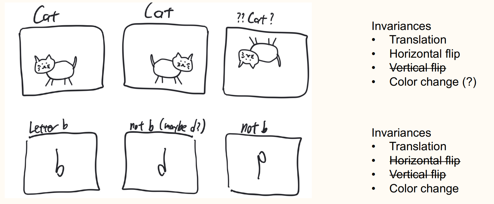
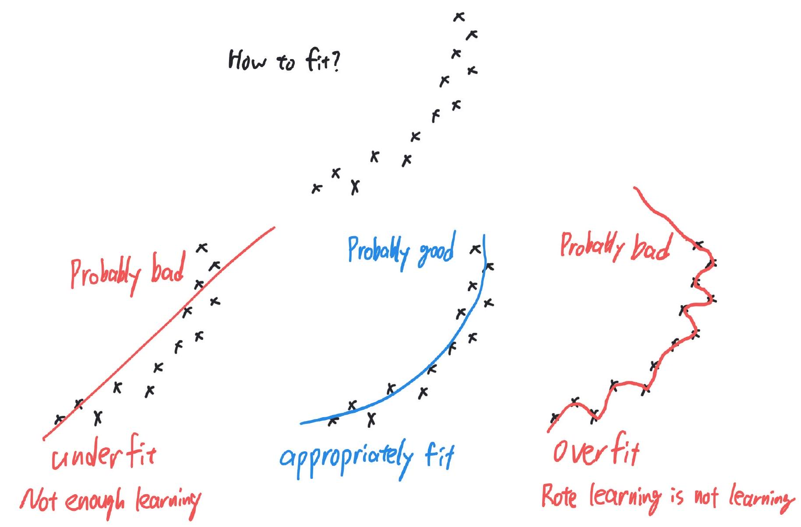
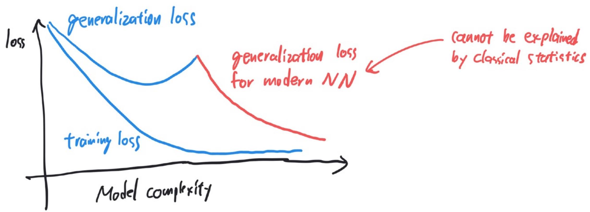
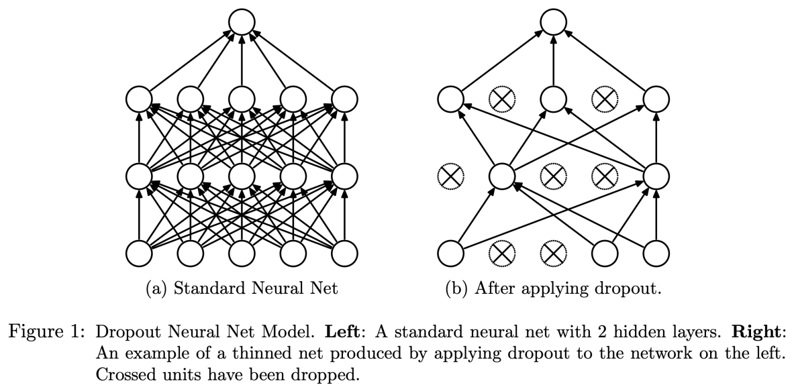
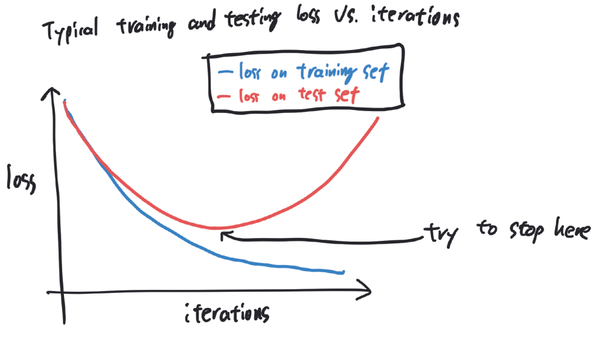
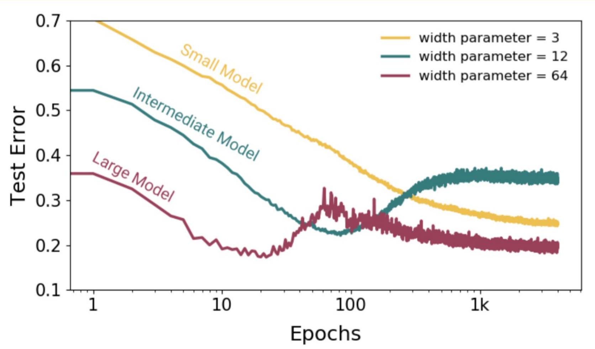
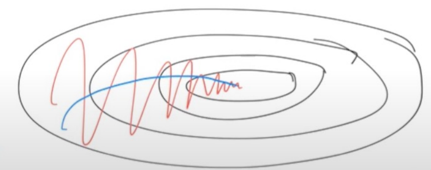
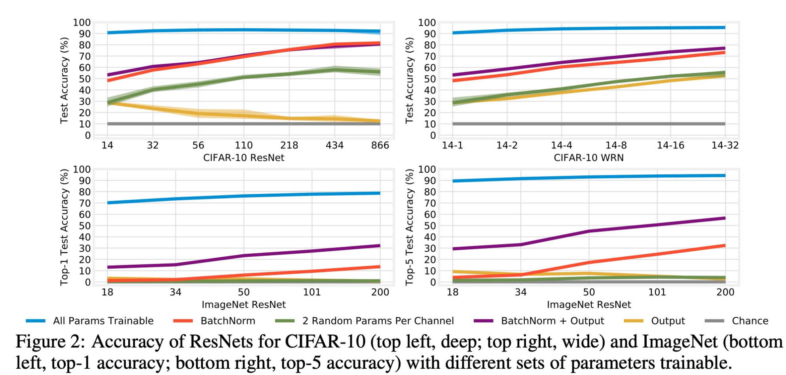

# § 6. Foundations of Design and Training of Deep Neural Networks

## Data Augmentation

!!! definition "Definition 6.1 <a id="definition-6-1"></a>: Spurious Correlation"
    Hypothetical: A photographer prefers to take pictures with cats looking to the left and dogs looking to the right. Neural network learns to distinguish cats from dogs by which direction it is facing. This learned correlation will not be useful for pictures taken by another photographer.

    This is a **spurious correlation**, a correlation between the data and labels that does not capture the "true" meaning. Spurious correlations are not robust in the sense that the spurious correlation will not be a useful predictor when the data changes slightly.

!!! definition "Definition 6.2 <a id="definition-6-2"></a>: Data Augmentation (DA)"
    <center>
    {: width="100%"}
    </center>

    Translation invariance are encoded in convolution, but other invariances are harder to encode (unless one uses geometric deep learning).
    Therefore encode invariances in data and have neural networks learn the invariance.

    ---

    **Data augmentation (DA)** applies transforms to the data while preserving meaning and label.

    - Option 1: Enlarge dataset itself.  

        Usually cumbersome and unnecessary.

    - Option 2: Use randomly transformed data in training loop.  

        In PyTorch, we use `Torchvision.transforms`.

    ---

    We use DA to :

    - Inject our prior knowledge of the structure of the data and force the neural network to learn it.
    - Remove spurious correlations.
    - Increase the effective data size. In particular, we ensure neural network never encounters the exact same data again and thereby prevent the neural network from performing exact memorization. (Neural network can memorize quite well.)

    Effects of DA :

    - DA usually worsens the training error (but we don't care about training error).
    - DA often, but not always, improves the test error.  

        If DA removes a spurious correlation, then the test error can be worsened.

    - DA usually improves robustness.

## Overfitting & Underfitting

!!! definition "Definition 6.3 <a id="definition-6-3"></a>: Classical Statistics - Overfitting vs Underfitting"
    <center>
    {: width="80%"}
    </center>

    <center>
    {: width="60%"}
    </center>

    Given separate train and test data

    - When (training loss) << (testing loss) you are **overfitting**. What you have learned from the training data does not carry over to test data.
    - When (training loss) $\approx$ (testing loss) you are **underfitting**. You have the potential to learn more from the training data.

    ---

    The goal of ML is to learn patterns that generalize to data you have not seen. From each datapoint, you want to learn enough (don't underfit) but if you learn too much you overcompensate for an observation specific to the single experience.

    In classical statistics, underfitting vs. overfitting (bias vs. variance tradeoff) is characterized rigorously.

!!! definition "Definition 6.4 <a id="definition-6-4"></a>: Modern Deep Learning - Double Descent"
    In modern deep learning, you can overfit, but the state-of-the art neural networks do not overfit (or "benignly overfit") despite having more model parameters than training data.

    We do not yet have clarity with this new phenomenon called **double descent**. When overfitting happens and when it does not is unclear.

    <center>
    {: width="100%"}
    </center>

!!! example "Example 6.5 <a id="example-6-5"></a>: Double Descent on 2-Layer Neural Network on MNIST"
    Belkin et al. experimentally demonstrates the double descent phenomenon with an MLP trained on the MNIST dataset.

    <center>
    {: width="60%"}
    </center>

    (M. Belkin, D. Hsu, S. Ma, and S. Mandal, Reconciling modern machine-learning practice and the classical bias-variance trade-off, PNAS, 2019.)

!!! concept "Concept 6.6 <a id="concept-6-6"></a>: How to Avoid Overfitting"
    **Regularization** is loosely defined as mechanisms to prevent overfitting.

    When you are overfitting, regularize with:

    - Smaller NN (fewer parameters) or larger NN (more parameters).
    - Improve data by:

        - using data augmentation
        - acquiring better, more diverse, data
        - acquiring more of the same data

    - Weight decay
    - Dropout
    - Early stopping on SGD or late stopping on SGD

!!! concept "Concept 6.7 <a id="concept-6-7"></a>: How to Avoid Underfitting"
    When you are underfitting, use:

    - Larger NN (if computationally feasible)
    - Less weight decay
    - Less dropout
    - Run SGD longer (if computationally feasible)

!!! concept "Concept 6.8 <a id="concept-6-8"></a>: Summary of Overfitting vs Underfitting"
    In modern deep learning, the double descent phenomenon has brought a conceptual and theoretical crisis regarding over and underfitting. Much of the machine learning practice is informed by classical statistics and learning theory, which do not take the double descent phenomenon into account.

    Double descent will bring fundamental changes to statistics, and researchers need more time to figure things out. Most researchers, practitioners and theoreticians, agree that not all classical wisdom is invalid, but what part do we keep, and what part do we replace?

    In the meantime, we will have to keep in mind the two contradictory viewpoints and move forward in the absence of clarity.

### Weight Decay

!!! definition "Definition 6.9 <a id="definition-6-9"></a>: $\ell^{2}$ - Regularization"
    **$\ell^{2}$-regularization** augments the loss function with

    $$
    \underset{\theta \in \mathbb{R}^{p}}{\operatorname{minimize}} \frac{1}{N} \sum_{i=1}^{N} \ell\left(f_{\theta}\left(x_{i}\right), y_{i}\right)+\frac{\lambda}{2}\|\theta\|^{2}
    $$

    SGD on the augmented loss is usually implemented by changing SGD update rather than explicitly changing the loss since

    $$
    \begin{gathered}
    \theta^{k+1}=\theta^{k}-\alpha\left(g^{k}+\lambda \theta^{k}\right) \\
    =(1-\alpha \lambda) \theta^{k}-\alpha g^{k}
    \end{gathered}
    $$

    Where $g^{k}$ is stochastic gradient of original (unaugmented) loss.

    In classical statistics, this is called ridge regression or maximum a posteriori (MAP) estimation with Gaussian prior.

!!! concept "Concept 6.10 <a id="concept-6-10"></a>: Weight Decay $\cong \ell^{2}$ - Regularization"
    In Pytorch, you can use SGD + weight decay by:

    augmenting the loss function

    ```
    for param in model.parameters():
        loss += (lamda/2)*param.pow(2.0).sum()
    torch.optim.SGD(model.parameters(), lr=... , weight_decay=0)
    ```

    or by using `weight_decay` in the optimizer

    ```
    torch.optim.SGD(model.parameters(), lr=... , weight_decay=lamda)
    ```

    ---

    For plain SGD, weight decay and $\ell^{2}$-regularization are equivalent. For other optimizers, the two are similar but not the same. More on this later.

### Dropout

!!! definition "Definition 6.11 <a id="definition-6-11"></a>: Dropout"
    Dropout is a regularization technique that randomly disables neurons.

    Standard layer,

    $$
    h_{2}=\sigma\left(W_{1} h_{1}+b_{1}\right)
    $$

    Dropout with drop probability $p$ defines

    $$
    h_{2}=\sigma\left(W_{1} h_{1}^{\prime}+b_{1}\right)
    $$

    with $h_{1}^{\prime}$ defined as

    $$
    \left(h_{1}^{\prime}\right)_{j}= \begin{cases}0 & \text { with probability } p \\ \frac{\left(h_{1}\right)_{j}}{1-p} & \text { otherwise }\end{cases}
    $$

    Note that $h_{1}^{\prime}$ is defined so that $\mathbb{E}[h_{1}^{\prime}]=h_1$.

    <center>
    {: width="80%"}
    </center>

    During training, dropout masks are different in every forward pass due to their random nature.

    (N. Srivastava, G. Hinton, A. Krizhevsky, I. Sutskever, R. Salakhutdinov, Dropout: A Simple Way to Prevent Neural Networks from Overfitting, JMLR, 2014.)

!!! concept "Concept 6.12 <a id="concept-6-12"></a>: Why is dropout helpful?"
    "A motivation for dropout comes from a theory of the role of sex in evolution (Livnat et al., 2010)."

    Sexual reproduction, compared to asexual reproduction, creates the criterion for natural selection mix-ability of genes rather than individual fitness, since genes are mixed in a more haphazard manner.

    "Since a gene cannot rely on a large set of partners to be present at all times, it must learn to do something useful on its own or in collaboration with a small number of other genes. ... Similarly, each hidden unit in a neural network trained with dropout must learn to work with a randomly chosen sample of other units. This should make each hidden unit more robust and drive it towards creating useful features on its own without relying on other hidden units to correct its mistakes.

    The analogy to evolution is very interesting, but it is ultimately a heuristic argument. It also shifts the burden to the question: "why is sexual evolution more powerful than asexual evolution?"

    However, dropout can be shown to be loosely equivalent to $\ell^{2}$-regularization. However, we do not yet have a complete understanding of the mathematical reason behind dropout's performance.

!!! concept "Concept 6.13 <a id="concept-6-13"></a>: Dropout in Pytorch"
    Dropout simply multiplies the neurons with a random $0-\frac{1}{1-p_{\text {drop }}}$ mask.

    A direct implementation in PyTorch:

    ```
    def dropout_layer(X, p_drop):
        mask = (torch.rand(X.shape) > p_drop).float()
        return mask * X / (1.0 - p_drop)
    ```

    PyTorch provides an implementation of dropout through `torch.nn.Dropout`.

!!! concept "Concept 6.14 <a id="concept-6-14"></a>: Dropout in Training vs Test"
    Typically, dropout is used during training and turned off during prediction/testing.
    (Dropout should be viewed as an additional onus imposed during training to make training more difficult and thereby effective, but it is something that should be turned off later.)

    In PyTorch, activate the training mode with

    ```
    model.train()
    ```

    and activate evaluation mode with

    ```
    model.eval()
    ```

    dropout (and batchnorm) will behave differently in these two modes.

!!! concept "Concept 6.15 <a id="concept-6-15"></a>: When to Use Dropout"
    Dropout is usually used on linear layers but not on convolutional layers.

    - Linear layers have many weights and each weight is used only once per forward pass. (If $y=\operatorname{Linear}_{A, b}(x)$, then $A_{i j}$ only affect $y_{i}$.) So regularization seems more necessary.
    - A convolutional filter has fewer weights and each weight is used multiple times in each forward pass. (If $y=\operatorname{Conv} 2 \mathrm{D}_{w, b}(x)$, then $w_{i j k t}$ affects $\left.y_{i, .,:}.\right)$ So regularization seems less necessary.

    Dropout seems to be going out of fashion:

    - Dropout's effect is somehow subsumed by batchnorm. (This is poorly understood.)
    - Linear layers are less common due to their large number of trainable parameters.

    There is no consensus on whether dropout should be applied before or after the activation function. However, Dropout- $\sigma$ and $\sigma$-Dropout are equivalent when $\sigma$ is $\operatorname{ReLU}$ or leaky $\operatorname{ReLU}$, or, more generally, when $\sigma$ is nonnegative homogeneous.

### SGD Early / Late Stopping

!!! definition "Definition 6.16 <a id="definition-6-16"></a>: SGD Early Stopping"
    **Early stopping of SGD** refers to stopping the training early even if you have time for more iterations.

    The rationale is that SGD fits data, so too many iterations lead to overfitting.

    A similar phenomenon (too many iterations hurt) is observed in classical algorithms for inverse problems.

    <center>
    {: width="75%"}
    </center>

!!! definition "Definition 6.17 <a id="definition-6-17"></a>: Epochwise Double Descent"
    Recently, however, an **epochwise double descent** has been observed.

    So perhaps one should stop SGD early or very late.

    We do not yet have clarity with this new phenomenon.

    <center>
    {: width="75%"}
    </center>

    (P. Nakkiran, G. Kaplun, Y. Bansal, T. Yang, B. Barak, and I. Sutskever, Deep double descent: Where bigger models and more data hurt, ICLR, 2020.)

### More Data

!!! concept "Concept 6.18 <a id="concept-6-18"></a>: More Data (by Data Augmentation)"
    With all else fixed, using more data usually leads to less overfitting.

    However, collecting more data is often expensive.

    Think of data augmentation (DA) as a mechanism to create more data for free. You can view DA as a form of regularization.

## SGD Optimizer

!!! definition "Definition 6.19 <a id="definition-6-19"></a>: SGD with Momentum"
    SGD:

    $$
    \theta^{k+1}=\theta^{k}-\alpha g^{k}
    $$

    **SGD with momentum**:

    $$
    \begin{gathered}
    v^{k+1}=g^{k}+\beta v^{k} \\
    \theta^{k+1}=\theta^{k}-\alpha v^{k+1}
    \end{gathered}
    $$

    $\beta=0.9$ is a common choice.

    <center>
    {: width="50%"}
    </center>

    When different coordinates (parameters) have very different scalings (i.e., when the problem is ill-conditioned, momentum can help find a good direction of progress.

    (I. Sutskever, J. Martens, G. Dahl, and G. Hinton, On the importance of initialization and momentum in deep learning, ICML, 2013.)

!!! definition "Definition 6.20 <a id="definition-6-20"></a>: RMSProp"
    **RMSProp**:

    $$
    \begin{gathered}
    m_{2}^{k+1}=\beta_{2} m_{2}^{k}+\left(1-\beta_{2}\right)\left(g^{k} \circledast g^{k}\right) \\
    \theta^{k+1}=\theta^{k}-\alpha g^{k} \oslash \sqrt{m_{2}^{k+1}+\epsilon}
    \end{gathered}
    $$

    $\beta_{2}=0.99$ and $\epsilon=10^{-8}$ are common values. $\circledast$ and $\oslash$ are elementwise mult. and div.

    $m_{2}^{k}$ is a running estimate of the $2^{\text {nd }}$ moment of the stochastic gradients, i.e., $\left(m_{2}^{k}\right)_{i} \approx \mathbb{E}\left(g^{k}\right)_{i}^{2}$.

    $\alpha \oslash \sqrt{m_{2}^{k+1}+\epsilon}$ is the learning rate scaled elementwise. Progress along steep and noisy directions are dampened while progress along flat and non-noisy directions are accelerated.

    (T. Tieleman, and G. Hinton, Lecture 6.5 - RMSProp, COURSERA: Neural Networks for Machine Learning, 2012.)

!!! definition "Definition 6.21 <a id="definition-6-21"></a>: Adam (Adaptive Moment Estimation)"
    **Adam**:

    $$
    \begin{gathered}
    m_{1}^{k+1}=\beta_{1} m_{1}^{k}+\left(1-\beta_{1}\right) g^{k}, m_{2}^{k+1}=\beta_{2} m_{2}^{k}+\left(1-\beta_{2}\right)\left(g^{k} \circledast g^{k}\right) \\
    \tilde{m}_{1}^{k+1}=\frac{m_{1}^{k+1}}{1-\beta_{1}^{k+1}}, \quad \widetilde{m}_{2}^{k+1}=\frac{m_{2}^{k+1}}{1-\beta_{2}^{k+1}} \\
    \theta^{k+1}=\theta^{k}-\alpha \widetilde{m}_{1}^{k+1} \oslash \sqrt{\widetilde{m}_{2}^{k+1}+\epsilon}
    \end{gathered}
    $$

    - $\beta_{1}^{k+1}$ means $\beta_{1}$ to the $(k+1)$ th power.
    - $\beta_{1}=0.9, \beta_{2}=0.999$, and $\epsilon=10^{-8}$ are common values. Initialize with $m_{1}^{0}=m_{2}^{0}=0$.
    - $m_{1}^{k}$ and $m_{2}^{k}$ are running estimates of the $1^{\text {st }}$ and $2^{\text {nd }}$ moments of $g^{k}$.
    - $\tilde{m}_{1}^{k}$ and $\tilde{m}_{2}^{k}$ are bias-corrected estimates of $m_{1}^{k}$ and $m_{2}^{k}$.
    - Using $\widetilde{m}_{1}^{k}$ instead of $g^{k}$ adds the effect of momentum.

    (D. P. Kingma and J. Ba, Adam: A method for stochastic optimization, ICLR, 2015.)

!!! concept "Concept 6.22 <a id="concept-6-22"></a>: Bias correction of Adam"
    To understand the bias correction, consider the hypothetical $g^{k}=g$ for $k=0,1, \ldots$. Then

    $$
    \begin{gathered}
    m_{1}^{k}=\left(1-\beta_{1}^{k}\right) g \\
    m_{2}^{k}=\left(1-\beta_{2}^{k}\right)(g \circledast g)
    \end{gathered}
    $$

    Even though $m_{1}^{k} \rightarrow g$ and $m_{2}^{k} \rightarrow(g \circledast g)$ as $k \rightarrow \infty$, the estimators are not exact despite there being no variation in $g^{k}$.

    On the other hand, the bias-corrected estimators are exact:

    $$
    \begin{gathered}
    \widetilde{m}_{1}^{k}=g \\
    \widetilde{m}_{2}^{k}=(g \circledast g)
    \end{gathered}
    $$

!!! concept "Concept 6.23 <a id="concept-6-23"></a>: The Cautionary Tale of Adam"
    Adam's original 2015 paper justified the effectiveness of the algorithm through experiments training deep neural networks with Adam. After all, this non-convex optimization is what Adam was proposed to do.

    However, the paper also provided a convergence proof under the assumption of convexity. This was perhaps unnecessary in an applied paper focusing on non-convex optimization.

    The proof was later shown to be incorrect! Adam does not always converge in the convex setup, i.e., the algorithm, rather than the proof, is wrong.

    Reddi and Kale presented the AMSGrad optimizer, which does come with a correct convergence proof, but AMSGrad tends to perform worse than Adam, empirically.

    (S. J. Reddi, S. Kale, and S. Kumar, On the convergence of Adam and beyond, ICLR, 2018.)

!!! concept "Concept 6.24 <a id="concept-6-24"></a>: How to Choose Optimizer"
    Extensive research has gone into finding the "best" optimizer. Schmidt et al.${ }^{\star}$ reports that, roughly speaking, that Adam works well most of the time.

    **So, Adam is a good default choice. Currently, it seems to be the best default choice.**

    However, Adam does not always work. For example, it seems to be that the widely used EfficientNet model can only be trained ${ }^{\dagger}$ with RMSProp.

    However, there are some setups where the LR of SGD is harder to tune, but SGD outperforms Adam when properly tuned.${ }^{\#}$

    (${ }^{\star}$ R. M. Schmidt, F. Schneider, and P. Hennig, Descending through a crowded valley — benchmarking deep learning optimizers, ICML, 2021.  
    ${ }^{\dagger}$ M. Tan and Q. V. Le, EfficientNet: Rethinking model scaling for convolutional neural networks, ICML, 2019.  
    ${ }^{\#}$ A. C. Wilson, R. Roelofs, M. Stern, N. Srebro, and B. Recht, The marginal value of adaptive gradient methods in machine learning, NeurlPS, 2017.)

!!! concept "Concept 6.25 <a id="concept-6-25"></a>: How to Tune Parameters"
    Everything should be chosen by trial and error. The weight parameters and $\beta, \beta_{1}, \beta_{2}$ and the weight decay parameter $\lambda$, and the optimizers should be chosen based on trial and error.

    The LR (the stepsize $\alpha$ ) of different optimizers are not really comparable between the different optimizers. When you change the optimizer, the LR should be tuned again.

    Roughly, large stepsize, large momentum, small weight decay is faster but less stable, while small stepsize, small momentum, and large weight decay is slower but more stable.

!!! concept "Concept 6.26 <a id="concept-6-26"></a>: Using Different Optimizers in Pytorch"
    In PyTorch, the `torch.optim` module implements the commonly used optimizers.

    - Using SGD:

    ```
    torch.optim.SGD(model.parameters(), lr=X)
    ```

    - Using SGD with momentum:

    ```
    torch.optim.SGD(model.parameters(), momentum=0.9, lr=X)
    ```

    - Using RMSprop:

    ```
    torch.optim.RMSprop(model.parameters(), lr=X)
    ```

    - Using Adam:

    ```
    torch.optim.Adam(model.parameters(), lr=X)
    ```

!!! concept "Concept 6.27 <a id="concept-6-27"></a>: Learning Rate Scheduling"
    Sometimes, it is helpful to change (usually reduce) the learning rate as the training progresses. PyTorch provides learning rate schedulers to do this.

    ```
    optimizer = SGD(model.parameters(), lr=0.1)
    scheduler = ExponentialLR(optimizer, gamma=0.9) # lr = 0.9*lr
    for _ in range(...):
        for input, target in dataset:
            optimizer.zero_grad()
            output = model(input)
            loss = loss_fn(output, target)
            loss.backward()
            optimizer.step()
        scheduler.step() # .step() call updates (changes) the learning rate
    ```

    ---

    One common choice is to specify a diminishing learning rate via a function (a lambda expression). Choices like `C/epoch` or `C / sqrt(iteration)`, where `C` is an appropriately chosen constant, are common.

    ```
    # lr_lambda allows us to set lr with a function
    scheduler = LambdaLR(optimizer, lr_lambda = lambda ep: 1e-2/ep)
    for epoch in range(...):
        for input, target in dataset:
            optimizer.zero_grad()
            output = model(input)
            loss = loss_fn(output, target)
            loss.backward()
            optimizer.step()
        scheduler.step() # lr=0.01/epoch
    ```

!!! concept "Concept 6.28 <a id="concept-6-28"></a>: Cosine Learning Rate"
    The cosine learning rate scheduler, which sets the learning rate with the cosine function, is also commonly used.

    The $2^{\text {nd }}$ case in the specification means $k$ and its purpose is to prevent the learning rate from becoming 0 .

    It is also common to use only a half-period of the cosine rather than having the learning rate oscillate.

    <center>
    {: width="80%"}
    </center>

    (I. Loshchilov and F. Hutter, SGDR: Stochastic gradient descent with warm restarts, ICLR, 2017)

!!! concept "Concept 6.29 <a id="concept-6-29"></a>: Wide vs Sharp Minima"
    - Large step makes large and rough progress towards regions with small loss.
    - Small steps refines the model by finding sharper minima.

    Also small steps better suppress the effect of noise. Mathematically, one can show that SGD with small steps becomes very similar to GD with small steps.${ }^{\#}$

    However, using small steps to converge to sharp minima may not always be optimal. There is some empirical evidence that wide minima have better test error than sharp minima.${ }^{\star}$

    (${ }^{\#}$ D. Davis, D. Drusvyatskiy, S. Kakade and J. D. Lee, Stochastic subgradient method converges on tame functions, Found. Comput. Math., 2020.  
    ${ }^{\star}$ Y. Jiang, B. Neyshabur, H. Mobahi, D. Krishnan, and S. Bengio, Fantastic generalization measures and where to find them, ICLR, 2020.)

## Weight Initialization

!!! concept "Concept 6.30 <a id="concept-6-30"></a>: Importance of Weight Initialization"
    Remember, SGD is

    $$
    \theta^{k+1}=\theta^{k}-\alpha g^{k}
    $$

    where $\theta^{0} \in \mathbb{R}^{p}$ is an initial point. Using a good initial point is important in NN training.

    Prescription by LeCun et al.: "Weights should be chosen randomly but in such a way that the [tanh] is primarily activated in its linear region. If weights are all very large then the [tanh] will saturate resulting in small gradients that make learning slow. If weights are very small then gradients will also be very small." (Cf. Vanishing gradient)

    "Intermediate weights that range over the [tanh's] linear region have the advantage that (1) the gradients are large enough that learning can proceed and (2) the network will learn the linear part of the mapping before the more difficult nonlinear part."

    (Y. A. LeCun, L. Bottou, G. B. Orr, and K.-R. Müller. Efficient BackProp, In: G. Montavon, G. B. Orr, and K.-R. Müller. (eds), Neural Networks: Tricks of the Trade, 1998.)

!!! concept "Concept 6.31 <a id="concept-6-31"></a>: Mathematics Review"
    - Using the $1^{\text {st }}$ order Taylor approximation,

        $$
        \tanh (z) \approx z
        $$

    - Write $X \sim \mathcal{N}\left(\mu, \sigma^{2}\right)$ to denote that $X$ is a Gaussian (normal) random variable with mean $\mu$ and standard deviation $\sigma$.
    - If $X$ and $Y$ are random variables, with expected values $\mu_X, \mu_Y$ and standard deviations $\sigma_X, \sigma_Y$, the following properties hold.

        $$
        \text{Cov}(X, Y) = \mathbb{E}[XY] - \mathbb{E}[X]\mathbb{E}[Y] = \mathbb{E}[(X-\mu_X)(Y-\mu_Y)]
        $$

        $$
        \text{Corr}(X, Y) = \frac{\text{Cov}(X, Y)}{\sigma_X \sigma_Y}
        $$

        $$
        \mathbb{E}[X+Y] = \mathbb{E}[X] + \mathbb{E}[Y]
        $$

        $$
        \text{Var}(X+Y) = \text{Var}(X) + \text{Var}(Y) + 2\text{Cov}(X, Y)
        $$

        $$
        \mathbb{E}[aX+b] = a\mathbb{E}[X] + b
        $$

        $$
        \text{Var}[aX+b] = a^2 \text{Var}[X]
        $$

    - If $X$ and $Y$ are random variables, such that

        $$
        \text{Cov}(X, Y)=\text{Corr}(X, Y)=0
        $$

        $X$ and $Y$ are **uncorrelated** random variables, and following properties hold.

        $$
        \mathbb{E}[XY] = \mathbb{E}[X] \mathbb{E}[Y]
        $$

        $$
        \text{Var}(X+Y) = \text{Var}(X) + \text{Var}(Y)
        $$

    - If $X$ and $Y$ are random variables, with probability density function $f_X(x), f_Y(y)$ and joint probability density funciton $f_{X, Y}(x, y)$, such that

        $$
        f_{X, Y}(x, y) = f_X(x)f_Y(y)
        $$

        $X$ and $Y$ are **independent** random variables, and following properties hold.

        $$
        \mathbb{E}[X^n Y^m] = \mathbb{E}[X^n] \mathbb{E}[Y^m]
        $$

        $$
        \text{Cov}(X, Y) = \text{Corr}(X, Y) = 0
        $$

        $$
        \text{Var}(X+Y) = \text{Var}(X) + \text{Var}(Y)
        $$

        $$
        \text{Var}(XY) = \text{Var}(X)\text{Var}(Y) + \text{Var}(X)\mathbb{E}[Y]^2 + \text{Var}(Y)\mathbb{E}[X]^2
        $$

        $$
        \text{Var}(XY) = \text{Var}(X)\text{Var}(Y) \quad (\text{if} \ \mathbb{E}[X]=\mathbb{E}[Y]=0)
        $$

    - If $X$ and $Y$ are independent, then $X$ and $Y$ are uncorrelated. The converse does not hold.
    - **IID** means, "independent and identically distributed" random variables.

!!! definition "Definition 6.32 <a id="definition-6-32"></a>: LeCun Initialization"
    Consider the layer

    $$
    \begin{gathered}
    \tilde{y}=A x+b \\
    y=\tanh (\tilde{y})
    \end{gathered}
    $$

    where $x \in \mathbb{R}^{n_{\text {in }}}$ and $y, \tilde{y} \in \mathbb{R}^{n_{\text {out }}}$. Assume $x_{j}$ have mean $=0$, variance $=1$ and are uncorrelated. If we initialize $A_{i j} \sim \mathcal{N}\left(0, \sigma_{A}^{2}\right)$ and $b_{i} \sim \mathcal{N}\left(0, \sigma_{b}^{2}\right)$, IID, then

    $$
    \begin{aligned}
    & \tilde{y}_{i}=\sum_{j=1}^{n_{\mathrm{in}}} A_{i j} x_{j}+b_{i} \quad \text { has mean }=0 \text {, variance }=n_{\mathrm{in}} \sigma_{A}^{2}+\sigma_{b}^{2} \\
    & y_{i}=\tanh \left(\tilde{y}_{i}\right) \approx \tilde{y}_{i} \quad \text { has mean } \approx 0 \text {, variance } \approx n_{\mathrm{in}} \sigma_{A}^{2}+\sigma_{b}^{2}
    \end{aligned}
    $$

    If we choose

    $$
    \sigma_{A}^{2}=\frac{1}{n_{\text {in }}}, \quad \sigma_{b}^{2}=0,
    $$

    (so $b=0$ ) then we have $y_{i}$ mean $\approx 0$ variance $\approx 1$ and are uncorrelated.

    ---

    By induction, with an $L$-layer MLP,

    - if the input to has mean $=0$ variance $=1$ and uncorrelated elements,
    - the weights and biases are initialized with $A_{i j} \sim \mathcal{N}\left(0, \frac{1}{n_{\text {in }}}\right)$ and $b_{i}=0$, and
    - the linear approximations $\tanh (z) \approx z$ are valid,

    then we can expect the output layer to have mean $\approx 0$, variance $\approx 1$.

    (Y. A. LeCun, L. Bottou, G. B. Orr, and K.-R. Müller. Efficient BackProp, In: G. Montavon, G. B. Orr, and K.-R. Müller. (eds), Neural Networks: Tricks of the Trade, 1998.)

!!! definition "Definition 6.33 <a id="definition-6-33"></a>: Xavier Initialization"
    Consider the layer

    $$
    \begin{gathered}
    \tilde{y}=A x+b \\
    y=\tanh (\tilde{y})
    \end{gathered}
    $$

    where $x \in \mathbb{R}^{n_{\text {in }}}$ and $y, \tilde{y} \in \mathbb{R}^{n_{\text {out }}}$. Consider the gradient with respect to some loss $\ell(y)$. Assume $\left(\frac{\partial \ell}{\partial y}\right)_{i}$ have mean $=0$, variance $=1$ and are uncorrelated. Then

    $$
    \frac{\partial y}{\partial x}=\operatorname{diag}\left(\tanh ^{\prime}(A x+b)\right) A \approx A
    $$

    if $\tanh (\tilde{y}) \approx \tilde{y}$ and

    $$
    \frac{\partial \ell}{\partial x}=\frac{\partial \ell}{\partial y} A
    $$

    If we initialize $A_{i j} \sim \mathcal{N}\left(0, \sigma_{A}^{2}\right)$ and $b_{i} \sim \mathcal{N}\left(0, \sigma_{b}^{2}\right)$, IID, and assume that $\frac{\partial \ell}{\partial y}$ and $A$ are independent, then

    $$
    \left(\frac{\partial \ell}{\partial x}\right)_{j}=\sum_{i=1}^{n_{\text {out }}}\left(\frac{\partial \ell}{\partial y}\right)_{i} A_{i j} \text { has mean } \approx 0 \text { and variance } \approx n_{\text {out }} \sigma_{A}^{2}
    $$

    If we choose

    $$
    \sigma_{A}^{2}=\frac{1}{n_{\mathrm{out}}}
    $$

    then $\left(\frac{\partial \ell}{\partial x}\right)_{j}$ have mean $\approx 0$, variance $\approx 1$ and are uncorrelated.

    ---

    $\frac{\partial \ell}{\partial y}$ and $A$ are not independent; $\frac{\partial \ell}{\partial y}$ depends on the forward evaluation, which in turn depends on $A$. Nevertheless, the calculation is an informative exercise and its result seems to be representative of common behavior.

    If $y=\tanh (A x+b)$ is an early layer (close to input) in a deep neural network, then the randomness of $A$ is diluted through the forward and backward propagation and $\frac{\partial \ell}{\partial y}$ and $A$ will be nearly independent.

    If $y=\tanh (A x+b)$ is an later layer (close to output) in a deep neural network, then $\frac{\partial \ell}{\partial y}$ and $A$ will have strong dependency.

    ---

    Consideration of forward and backward passes result in different prescriptions.

    The Xavier initialization uses the harmonic mean of the two:

    $$
    \sigma_{A}^{2}=\frac{2}{n_{\mathrm{in}}+n_{\mathrm{out}}}, \quad \sigma_{b}^{2}=0
    $$

    In the literature, the alternate notation $\text{fan}_{\text {in }}$ and $\text{fan}_{\text {out }}$ are often used instead of $n_{\text {in }}$ and $n_{\text {out }}$. The fan-in and fan-out terminology originally refers to the number of electric connections entering and exiting a circuit or an electronic device.

    (Xavier Glorot and Y. Bengio, Understanding the difficulty of training deep feedforward neural networks, AISTATS, 2010.)

!!! definition "Definition 6.34 <a id="definition-6-34"></a>: (Kaiming) He Initialization"
    Consider the layer

    $$
    y=\operatorname{ReLU}(A x+b)
    $$

    We cannot use the Taylor expansion with ReLU.

    However, a similar line of reasoning with the forward pass gives rise to

    $$
    \sigma_{A}^{2}=\frac{2}{n_{\mathrm{in}}}
    $$

    And a similar consideration with backprop gives rise to

    $$
    \sigma_{A}^{2}=\frac{2}{n_{\text {out }}}
    $$

    In PyTorch, use `mode='fan_in'` and `mode='fan_out'` to toggle between the two modes.

    (Kaiming He, X. Zhang, S. Ren, and J. Sun, Delving deep into rectifiers: Surpassing human-level performance on ImageNet classification, ICCV, 2015.)

!!! concept "Concept 6.35 <a id="concept-6-35"></a>: Discussions on Initializations"
    In the original description of the Xavier and He initializations, the biases are all initialized to 0 . However, the default initialization of Linear${ }^{\star}$ and Conv2d ${ }^{\#}$ layers in PyTorch uses initialize the biases randomly. A documented reasoning behind this choice (in the form of papers or GitHub discussions) do not seem to exist.

    Initializing weights with the proper scaling is sometimes necessary to get the network to train, as you will see with the VGG network. However, so long as the network gets trained, the choice of initialization does not seem to affect the final performance.

    Since initializations rely on the assumption that the input to each layer has roughly unit variance, it is important that the data is scaled properly. This is why PyTorch dataloader scales pixel intensity values to be in $[0,1]$, rather than $[0,255]$.

    (${ }^{\star}$ https://pytorch.org/docs/stable/_modules/torch/nn/modules/linear.html  
    ${ }^{\#}$ https://pytorch.org/docs/stable/_modules/torch/nn/modules/conv.html)

!!! definition "Definition 6.36 <a id="definition-6-36"></a>: Initialization for Convolutional Layer"
    Consider the layer

    $$
    \begin{aligned}
    & \tilde{y}=\operatorname{Conv} 2 \mathrm{D}_{w, b}(x) \\
    & y=\tanh (\tilde{y}) \\
    \end{aligned}
    $$

    where $w \in \mathbb{R}^{C_{\text {out }} \times C_{\text {in }} \times f_{1} \times f_{2}}$ and $b \in \mathbb{R}^{C_{\text {out }}}$. Assume $x_{j}$ have mean $=0$ variance $=1$ and are uncorrelated. If we initialize $w_{i j k \ell} \sim \mathcal{N}\left(0, \sigma_{w}^{2}\right)$ and $b_{i} \sim \mathcal{N}\left(0, \sigma_{b}^{2}\right)$, IID, then

    $$
    \begin{aligned}
    & \tilde{y}_{i} \quad \text { has mean }=0 \text { variance }=\left(C_{\text {in }} f_{1} f_{2}\right) \sigma_{w}^{2}+\sigma_{b}^{2} \\
    & y_{i} \approx \tilde{y}_{i} \text { has mean } \approx 0 \text { variance } \approx\left(C_{\text {in }} f_{1} f_{2}\right) \sigma_{w}^{2}+\sigma_{b}^{2}
    \end{aligned}
    $$

    If we choose

    $$
    \sigma_{w}^{2}=\frac{1}{c_{\text {in }} f_{1} f_{2}}, \quad \sigma_{b}^{2}=0
    $$

    (so $b=0$ ) then we have $y_{i}$ mean $\approx 0$ variance $\approx 1$ and are correlated.

    ---

    Outputs from a convolutional layer are correlated. The uncorrelated assumption is false. Nevertheless, the calculation is an informative exercise and its result seems to be representative of common behavior.

    Xavier and He initialization is usually used with

    $$
    n_{\mathrm{in}}=C_{\mathrm{in}} f_{1} f_{2}
    $$

    and

    $$
    n_{\text {out }}=C_{\text {out }} f_{1} f_{2}
    $$

    Justification of $n_{\text {out }}=C_{\text {out }} f_{1} f_{2}$ requires working through the complex indexing or considering the "transpose convolution". We will return to it later.

## Automatic Differentation

!!! definition "Definition 6.37 <a id="definition-6-37"></a>: Automatic Differentation"
    **Autodiff (automatic differentiation)** is an algorithm that automates gradient computation. In deep learning libraries, you only need to specify how to evaluate the function.

    **Backprop (back propagation)** is an instance of autodiff. (backprop $\subseteq$ autodiff)

    Gradient computation costs roughly $5 \times$ the computation cost of forward evaluation.

    To clarify, backprop and autodiff are not

    - finite difference (numerical differentation) or
    - symbolic differentiation.

    Autodiff $\approx$ chain rule of vector calculus

    ---

    Autodiff is an essential yet often an underappreciated feature of the deep learning libraries. It allows deep learning researchers to use complicated neural networks, while avoiding the burden of performing derivative calculations by hand.

    Most deep learning libraries support $2^{\text {nd }}$ and higher order derivative computation, but we will only use $1^{\text {st }}$ order derivatives (gradients) in this class.

    Autodiff includes forward-mode, reverse-mode (backprop), and other orders. In deep learning, reverse-mode is most commonly used.

!!! concept "Concept 6.38 <a id="concept-6-38"></a>: Autodiff by Jacobial Multiplication"
    Consider $g=f_{L} \circ f_{L-1} \circ \cdots \circ f_{2} \circ f_{1}$, where $f_{\ell}: \mathbb{R}^{n_{\ell-1}} \rightarrow \mathbb{R}^{n_{\ell}}$ for $\ell=1, \cdots, L$.

    Chain rule: $D g=D f_{L} \quad D f_{L-1} \quad \cdots \quad D f_{2} \quad D f_{1}$

    Forward-mode: $D f_{L}\left(D f_{L-1}\left(\cdots\left(D f_{2} D f_{1}\right) \cdots\right)\right)$

    Reverse-mode (back propagation): $\left(\left(\left(D f_{L} D f_{L-1}\right) D f_{L-2}\right) \cdots\right) D f_{1}$

    Reverse mode is optimal (can be proved using DP) when $n_{L} \leq n_{L-1} \leq \cdots \leq n_{1} \leq n_{0}$. The number of neurons in each layer tends to decrease in deep neural networks for classification. So reverse-mode is often close to the most efficient mode of autodiff in deep learning.

!!! definition "Definition 6.39 <a id="definition-6-39"></a>: General Backprop"
    Backprop in PyTorch:

    1. When the loss function is evaluated, a computation graph is constructed.
    2. The computation graph is a directed acyclic graph (DAG) that encodes dependencies of the individual computational components.
    3. A topological sort is performed on the DAG and the backprop is performed on the reversed order of this topological sort. (The topological sort ensures that nodes ahead in the DAG are processed first.)

    The general form combines a graph theoretic formulation with the principles of backprop.

!!! definition "Definition 6.40 <a id="definition-6-40"></a>: Computation Graph"
    Let $y_{1}, \ldots, y_{L}$ be the output values (neurons) of the computational nodes. Assume $y_{1}, \ldots, y_{L}$ follow a linear topological ordering, i.e., the computation of $y_{\ell}$ depends on $y_{1}, \ldots, y_{\ell-1}$ and does not depend on $y_{\ell+1}, \ldots, y_{L}$.

    Define the graph $G=(V, E)$, where $V=\{1, \ldots, L\}$ and $(i, \ell) \in E$, i.e., $i \rightarrow \ell$, if the computation of $y_{\ell}$ directly depends on $y_{i}$. Write the computation of $y_{1}, \ldots, y_{L}$ as

    $$
    y_{\ell}=f_{\ell}\left(\left[y_{i}: \text { for } i \rightarrow \ell\right]\right)
    $$

!!! definition "Definition 6.41 <a id="definition-6-41"></a>: Forward Pass on Computation Graph"
    In the forward pass, sequentially compute $y_{1}, \ldots, y_{L}$ via

    $$
    y_{\ell}=f_{\ell}\left(\left[y_{i}: \text { for } i \rightarrow \ell\right]\right)
    $$

    ```
    # Use 1-based indexing
    # y[1] given
    for l = 2,...,L
        inputs = [y[i] for j such that (i->l)]
        y[l] = f[l].eval(inputs)
    end
    ```

!!! example "Example 6.42 <a id="example-6-42"></a>: Forward Pass & Forward-mode Autodiff"
    Consider $f(x, y)=y \log x+\sqrt{y \log x}$. Evaluate $f$ with the computation graph:

    <center>
    {: width="100%"}
    </center>

    - Step 0 :

        $$
        \begin{gathered}
        x=3, y=2 \\
        \frac{\partial x}{\partial x}=1, \frac{\partial x}{\partial y}=0, \frac{\partial y}{\partial x}=0, \frac{\partial y}{\partial y}=1
        \end{gathered}
        $$

    - Step 1 :

        $$
        \begin{gathered}
        a=\log x=\log 3 \\
        \frac{\partial a}{\partial x}=\frac{1}{x} \cdot \frac{\partial x}{\partial x}=\frac{1}{3}, \frac{\partial a}{\partial y}=0
        \end{gathered}
        $$

    - Step 2 :

        $$
        \begin{gathered}
        b=y a=2 \log 3 \\
        \frac{\partial b}{\partial x}=\frac{\partial y}{\partial x} a+y \frac{\partial a}{\partial x}=\frac{2}{3}, \frac{\partial b}{\partial y}=\frac{\partial y}{\partial y} a+y \frac{\partial a}{\partial y}=a=\log 3
        \end{gathered}
        $$

    - Step 3 :

        $$
        \begin{gathered}
        c=\sqrt{b}=\sqrt{2 \log 3} \\
        \frac{\partial c}{\partial x}=\frac{1}{2 \sqrt{b}} \frac{\partial b}{\partial x}=\frac{1}{3 \sqrt{2 \log 3}}, \frac{\partial c}{\partial y}=\frac{1}{\sqrt{b}} \frac{\partial b}{\partial y}=\frac{1}{2} \sqrt{\frac{\log 3}{2}}
        \end{gathered}
        $$

    - Step 4 :

        $$
        \begin{gathered}
        f=c+b=\sqrt{2 \log 3}+2 \log 3 \\
        \frac{\partial f}{\partial x}=\frac{\partial c}{\partial x}+\frac{\partial b}{\partial x}=\frac{1}{3}\left(2+\frac{1}{3 \sqrt{2 \log 3}}\right), \frac{\partial f}{\partial y}=\frac{\partial c}{\partial y}+\frac{\partial b}{\partial y}=\frac{1}{2} \sqrt{\frac{\log 3}{2}}+\log 3
        \end{gathered}
        $$

!!! definition "Definition 6.42 <a id="definition-6-42"></a>: Backprop on Computation Graph"
    To perform backprop, use

    $$
    \frac{\partial y_{L}}{\partial y_{i}}=\sum_{\ell: i \rightarrow \ell} \frac{\partial y_{L}}{\partial y_{\ell}} \frac{\partial f_{\ell}}{\partial y_{i}}
    $$

    to sequentially compute $\frac{\partial y_{L}}{\partial y_{L}}, \frac{\partial y_{L}}{\partial y_{L-1}}, \ldots, \frac{\partial y_{L}}{\partial y_{1}}$.     

    ```
    # Use 1-based indexing
    # y[1],...,y[L] already computed
    g[:] = 0 // .zero_grad()
    g[L] = 1 // dy[L]/dy[L]=1
    for l = L,...,2
        for i such that (i->l)
            g[i] += g[l]*f[l].grad(i)
        end
    end
    ```

!!! example "Example 6.43 <a id="example-6-43"></a>: Reverse-mode Autodiff (Backprop)"
    Consider $f(x, y)=y \log x+\sqrt{y \log x}$. Evaluate $f$ with the computation graph:

    <center>
    {: width="100%"}
    </center>

    - Step 0 :

        $$
        x=3, y=2
        $$

    - Step 1 :

        $$
        a=\log 3
        $$

    - Step 2 :

        $$
        b=2 \log 3
        $$

    - Step 3 :

        $$
        c=\sqrt{2 \log 3}
        $$

    - Step 4 :

        $$
        f=\sqrt{2 \log 3}+2 \log 3
        $$

    ---

    - Step 0' :

        $$
        \frac{\partial f}{\partial f}=1
        $$

    - Step 1' :

        $$
        \frac{\partial f}{\partial c}=\frac{\partial f}{\partial f} \frac{\partial f}{\partial c}=\frac{\partial f}{\partial f} 1=1
        $$

    - Step 2' :

        $$
        \frac{\partial f}{\partial b}=\frac{\partial f}{\partial c} \frac{\partial c}{\partial b}+\frac{\partial f}{\partial f} \frac{\partial f}{\partial c}=\frac{1}{2 \sqrt{b}} 1+1=\frac{1}{2 \sqrt{2 \log 3}}+1
        $$

    - Step 3' :

        $$
        \frac{\partial f}{\partial a}=\frac{\partial f}{\partial b} \frac{\partial b}{\partial a}=\frac{\partial f}{\partial b} y=2+\frac{1}{\sqrt{2 \log 3}}
        $$

    - Step 4' :

        $$
        \begin{gathered}
        \frac{\partial f}{\partial x}=\frac{\partial f}{\partial a} \frac{\partial a}{\partial x}=\frac{\partial f}{\partial a} \frac{1}{x}=\frac{1}{3}\left(2+\frac{1}{\sqrt{2 \log 3}}\right) \\
        \frac{\partial f}{\partial y}=\frac{\partial f}{\partial b} \frac{\partial b}{\partial y}=\frac{\partial f}{\partial b} a=\frac{1}{2} \sqrt{\frac{\log 3}{2}}+\log 3
        \end{gathered}
        $$

!!! concept "Concept 6.44 <a id="concept-6-44"></a>: Backprop in Pytorch"
    <center>
    {: width="100%"}
    </center>

    In NN training, parameters (shown blue in the image) and fixed inputs are distinguished.
    In PyTorch, you (1) clear the existing gradient with `.zero_grad()`
    (2) forward-evaluate the loss function by providing the input and label and
    (3) perform backprop with `.backward()`.

    The forward pass stores the intermediate neuron values so that they can later be used in backprop. In the test loop, however, we don't compute gradients so the intermediate neuron values are unnecessary.
    The `torch.no_grad()` context manager allows intermediate node values to discarded or not be stored.
    This saves memory and can accelerate the test loop.

## Batch Normalization

!!! concept "Concept 6.45 <a id="concept-6-45"></a>: Idea of Batch Normalization"
    The first step of many data processing algorithms is often to normalize data to have zero mean and unit variance.

    - Step 1. Compute $\hat{\mu}=\frac{1}{N} \sum_{i=1}^{N} X_{i}, \widehat{\sigma^{2}}=\frac{1}{N} \sum_{i=1}^{N}\left(X_{i}-\hat{\mu}\right)^{2}$

    $$
    \hat{X}_{i}=\frac{X_{i}-\widehat{\mu}}{\sqrt{\sigma^{2}}+\varepsilon}
    $$

    - Step 2. Run method with data $\hat{X}_{1}, \ldots, \hat{X}_{N}$

    **Batch normalization (BN)** (sort of) enforces this normalization layer-by-layer. BN is an indispensable tool for training very deep neural networks. Theoretical justification is weak.

    (S. Ioffe and C. Szegedy, Batch normalization: Accelerating deep network training by reducing internal covariate shift, ICML, 2015.)

!!! definition "Definition 6.46 <a id="definition-6-46"></a>: BN for Linear Layers"
    Underlying assumption: Each element of the batch is an IID sample.

    Input: $X$, $\text{shape}(X) = \text{(batch size)} \times \text{(# entries)}$

    Output: $\mathrm{BN}_{\beta, \gamma}(X)$, $\text{shape} \left(\mathrm{BN}_{\beta, \gamma}(X)\right)=\operatorname{shape}(X)$

    $\mathrm{BN}_{\beta, \gamma}$ for linear layers acts independently over neurons.

    $$
    \begin{gathered}
    \hat{\mu}[:]=\frac{1}{B} \sum_{b=1}^{B} X[b,:]\\
    \hat{\sigma}^{2}[:]=\frac{1}{B} \sum_{b=1}^{B}(X[b,:]-\hat{\mu}[:])^{2} \\
    \mathrm{BN}_{\gamma, \beta}(X)[b,:]=\gamma[:] \frac{X[b,:]-\hat{\mu}[:]}{\sqrt{\hat{\sigma}^{2}[:]+\varepsilon}}+\beta[:] \quad b=1, \ldots, B
    \end{gathered}
    $$

    where operations are elementwise. BN normalizes each output neuron. The mean and variance are explicitly controlled through learned parameters $\beta$ and $\gamma$. In Pytorch, `nn.BatchNorm1d`.

!!! definition "Definition 6.47 <a id="definition-6-47"></a>: BN for Convolutional Layers"
    Underlying assumption: Each element of the batch, horizontal pixel, and vertical pixel is an IID sample.

    Input: $X$, $\text{shape}(X) =  \text{(batch size)} \times \text{(channels)} \times \text{(vertical dim)} \times \text{(horizontal dim)}$

    Output: $\mathrm{BN}_{\beta, \gamma}(X)$, $\text{shape} \left(\mathrm{BN}_{\beta, \gamma}(X)\right)=\operatorname{shape}(X)$

    $\mathrm{BN}_{\beta, \gamma}$ for conv. layers acts independently over channels.

    $$
    \begin{gathered}
    \hat{\mu}[:]=\frac{1}{B P Q} \sum_{b=1}^{B} \sum_{i=1}^{P} \sum_{j=1}^{Q} X[b,:, i, j] \\
    \hat{\sigma}^{2}[:]=\frac{1}{B P Q} \sum_{b=1}^{B} \sum_{i=1}^{P} \sum_{j=1}^{Q}(X[b,:, i, j]-\hat{\mu}[:])^{2} \\
    \operatorname{BN}_{\gamma, \beta}(X)[b,:, i, j]=\gamma[:] \frac{X[b,:, i, j]-\hat{\mu}[:]}{\sqrt{\hat{\sigma}^{2}[:]+\varepsilon}}+\beta[:] \quad \begin{array}{l}
    b=1, \ldots, B \\
    i=1, \ldots, P \\
    j=1, \ldots, Q
    \end{array}
    \end{gathered}
    $$

    BN normalizes over each convolutional filter. The mean and variance are explicitly controlled through learned parameters $\beta$ and $\gamma$. In Pytorch, `nn.BatchNorm2d`.

!!! definition "Definition 6.48 <a id="definition-6-48"></a>: BN during Testing"
    $\hat{\mu}$ and $\hat{\sigma}$ are estimated from batches during training. During testing, we don't update the NN, and we may only have a single input (so no batch).

    There are 2 strategies for computing final values of $\hat{\mu}$ and $\hat{\sigma}$ :

    1. After training, fix all parameters and evaluate NN on full training set to compute $\hat{\mu}$ and $\hat{\sigma}$ layer-by-layer. Store this computed value. (Computation of $\hat{\mu}$ and $\hat{\sigma}$ must be done sequentially layer-by-layer. Why?)
    2. During training, compute running average of $\hat{\mu}$ and $\hat{\sigma}$. This is the default behavior of PyTorch.

    In PyTorch, use `model.train()` and `model.eval()` to switch BN behavior between training and testing.

!!! concept "Concept 6.49 <a id="concept-6-49"></a>: Efficiency of BN"
    BN does not change the representation power of NN ; since $\beta$ and $\gamma$ are trained, the output of each layer can have any mean and variance. However, controlling the mean and variance as explicit trainable parameters makes training easier.

    With BN, the choice of batch size becomes a more important hyperparameter to tune.

    BN is indispensable in practice. Training of VGGNet and GoogLeNet becomes much easier with BN. Training of ResNet requires BN.

!!! concept "Concept 6.51 <a id="concept-6-51"></a>: BN and Internal Covariate Shift"
    BN has insufficient theoretical justification.
    The original paper by loffe and Szegedy hypothesized that BN mitigates internal covariate shift (ICS), the shift in the mean and variance of the intermediate layer neurons throughout the training, and that this mitigation leads to improved training.

    $$
    \mathrm{BN} \Rightarrow(\text { reduced ICS }) \Rightarrow \text { (improved training })
    $$

    However, Santukar et al. demonstrated that when experimentally measured, BN does not mitigate ICS, but nevertheless improves the training.

    $$
    \mathrm{BN} \nRightarrow \text { (reduced ICS) }
    $$

    Nevertheless

    $$
    \mathrm{BN} \Rightarrow \text { (improved training performance) }
    $$

    Santukar et al. argues that

    $$
    \mathrm{BN} \Rightarrow \text { (smoother loss landscape) } \Rightarrow \text { (improved training performance) }
    $$

    While this claim is more evidence-based than that of loffe and Szegedy, it is still not conclusive. It is also unclear why BN makes the loss landscape smoother, and it is not clear whether the smoother loss landscape fully explains the improved training performance.

    This story is a cautionary tale: we should carefully distinguish between speculative hypotheses and evidence-based claims, even in a primarily empirical subject.

    (S. Ioffe and C. Szegedy, Batch normalization: Accelerating deep network training by reducing internal covariate shift, ICML, 2015.  
    S. Santurkar, D. Tsipras, A. Ilyas, and A. Mądry, How does batch normalization help optimization?, NeurIPS, 2018.)

!!! concept "Concept 6.50 <a id="concept-6-50"></a>: BN has trainable parameters."
    BN is usually not considered a trainable layer, much like pooling or dropout, and they are usually excluded when counting the "depth" of a NN. However, BN does have trainable parameters. Interestingly, if one randomly initializes a CNN, freezes all other parameters, and only train BN parameters, the performance is surprisingly good.

    <center>
    {: width="75%"}
    </center>

    (J. Frankle, D. J. Schwab, and A. S. Morcos, Training BatchNorm and only BatchNorm: On the expressive power of random features in CNNs, NeurIPS SEDL Workshop, 2019.)

!!! concept "Concept 6.51 <a id="concept-6-51"></a>: Discussion of BN"
    BN seems to also act as a regularizer, and for some reason subsumes effect Dropout. (Using dropout together with BN seems to worsen performance.) Since BN has been popularized, Dropout is used less often.

    After training, functionality of BN can be absorbed into the previous layer when the previous layer is a linear layer or a conv layer.

    The use of batch norm makes the scaling of weight initialization less important irrelevant.

    Use `bias=false` on layers preceding BN , since $\beta$ subsumes the bias.

    (X. Li, S. Chen, X. Hu and J. Yang, Understanding the disharmony between dropout and batch normalization by variance shift, CVPR, 2019.)
