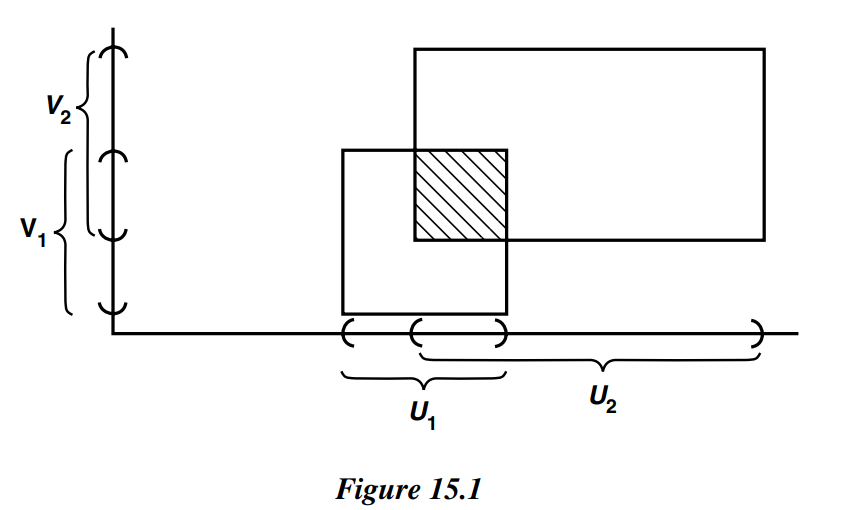
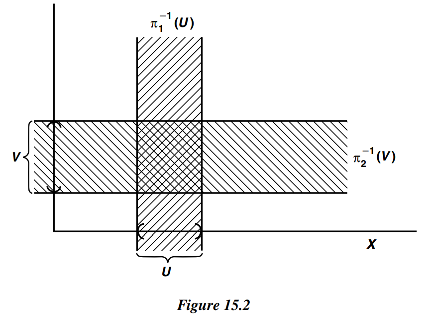

# § 15. The Product Topology on $X$ $\times$ $Y$

!!! definition "Definition 15.1 : Product Topology"
    Let $X$ and $Y$ be topological spaces.  
    The **product topology** on $X \times Y$ is the topology having as basis the collection $\mathcal{B}$ of all sets of the form $U \times V$, where $U$ is an open subset of $X$ and $V$ is an open subset of $Y$.

!!! theorem "Theorem 15.0"
    Let $X$ and $Y$ be topological spaces.

    The collection $\mathcal{B}$ of all sets of the form $U \times V$, where $U$ is an open subset of $X$ and $V$ is an open subset of $Y$, is indeed a basis.

    The collection $\mathcal{B}$ is not a topology on $X \times Y$.

    !!! proof
        Let us check that $\mathcal{B}$ is a basis.
        The first condition is trivial, since $X \times Y$ is itself a basis element.
        The second condition is almost as easy, since the intersection of any two basis elements $U_{1} \times V_{1}$ and $U_{2} \times V_{2}$ is another basis element.
        For

        $$
        \left(U_{1} \times V_{1}\right) \cap\left(U_{2} \times V_{2}\right)=\left(U_{1} \cap U_{2}\right) \times\left(V_{1} \cap V_{2}\right)
        $$

        and the latter set is a basis element because $U_{1} \cap U_{2}$ and $V_{1} \cap V_{2}$ are open in $X$ and $Y$, respectively.
        See Figure 15.1.

        Note that the collection $\mathcal{B}$ is not a topology on $X \times Y$. The union of the two rectangles pictured in Figure 15.1, for instance, is not a product of two sets, so it cannot belong to $\mathcal{B}$; however, it is open in $X \times Y$.

        

        {width=50%}
        

!!! theorem "Theorem 15.1"
    If $\mathcal{B}$ is a basis for the topology of $X$ and $\mathcal{C}$ is a basis for the topology of $Y$, then the collection

    $$
    \mathcal{D}=\{B \times C \mid B \in \mathcal{B} \text { and } C \in \mathcal{C}\}
    $$

    is a basis for the topology of $X \times Y$.

    !!! proof
        We apply **Lemma 13.2**.
        Given an open set $W$ of $X \times Y$ and a point $x \times y$ of $W$, by definition of the product topology there is a basis element $U \times V$ such that $x \times y \in U \times V \subset W$.
        Because $\mathcal{B}$ and $\mathcal{C}$ are bases for $X$ and $Y$, respectively, we can choose an element $B$ of $\mathcal{B}$ such that $x \in B \subset U$, and an element $C$ of $\mathcal{C}$ such that $y \in C \subset V$.
        Then $x \times y \in B \times C \subset W$.
        Thus the collection $D$ meets the criterion of **Lemma 13.2**, so $\mathcal{D}$ is a basis for $X \times Y$.

!!! definition "Definition 15.2 : Standard Topology on $\mathbb{R}^2$"
    We have a standard topology on $\mathbb{R}$ : the order topology.
    The product of this topology with itself is called the **standard topology** on $\mathbb{R} \times \mathbb{R}=\mathbb{R}^{2}$.

    It has as basis the collection of all products of open sets of $\mathbb{R}$, but **Theorem 15.1** tells us that the much smaller collection of all products $(a, b) \times(c, d)$ of open intervals in $\mathbb{R}$ will also serve as a basis for the topology of $\mathbb{R}^{2}$.
    Each such set can be pictured as the interior of a rectangle in $\mathbb{R}^{2}$.

!!! definition "Definition 15.3 : Projection"
    Let $\pi_{1}: X \times Y \rightarrow X$ be defined by the equation

    $$
    \pi_{1}(x, y)=x ,
    $$

    let $\pi_{2}: X \times Y \rightarrow Y$ be defined by the equation

    $$
    \pi_{2}(x, y)=y .
    $$

    The maps $\pi_{1}$ and $\pi_{2}$ are called the **projections** of $X \times Y$ onto its first and second factors, respectively.

!!! theorem "Theorem 15.2"
    The collection

    $$
    S=\left\{\pi_{1}^{-1}(U) \mid U \text { open in } X\right\} \cup\left\{\pi_{2}^{-1}(V) \mid V \text { open in } Y\right\}
    $$

    is a subbasis for the product topology on $X \times Y$.
    
    $$
    (\pi_{1}^{-1}(U)=U \times Y, \pi_{2}^{-1}(V)=X \times V)
    $$

    

    {width=50%}
    

    !!! proof
        Let $\mathcal{T}$ denote the product topology on $X \times Y$; let $\mathcal{T}^{\prime}$ be the topology generated by $\mathcal{S}$.  
        Because every element of $\mathcal{S}$ belongs to $\mathcal{T}$, so do arbitrary unions of finite intersections of elements of $\mathcal{S}$.
        Thus $\mathcal{T}^{\prime} \subset \mathcal{T}$.  
        On the other hand, every basis element $U \times V$ for the topology $\mathcal{T}$ is a finite intersection of elements of $\mathcal{S}$, since

        $$
        U \times V=\pi_{1}^{-1}(U) \cap \pi_{2}^{-1}(V) .
        $$

        Therefore, $U \times V$ belongs to $\mathcal{T}^{\prime}$, so that $\mathcal{T} \subset \mathcal{T}^{\prime}$ as well.