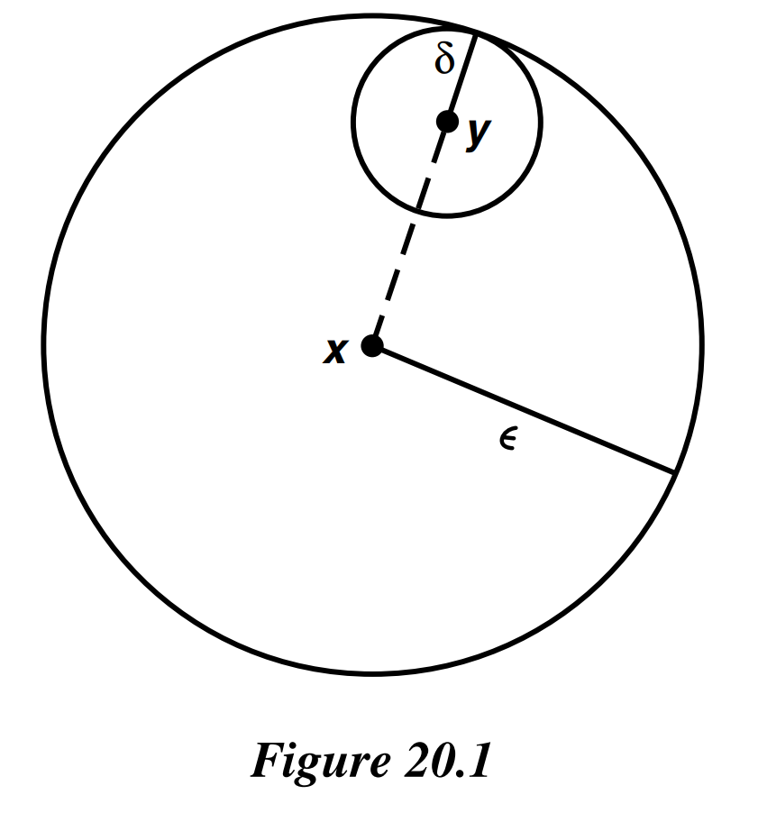

# § 20. The Metric Topology

!!! definition "Definition 20.1 : Metric / Distance"
    A **metric** on a set $X$ is a function

    $$
    d: X \times X \longrightarrow R
    $$

    having the following properties:

    1. $d(x, y) \geq 0$ for all $x, y \in X$; equality holds if and only if $x=y$.

    2. $d(x, y)=d(y, x)$ for all $x, y \in X$.

    3. (Triangle inequality) $d(x, y)+d(y, z) \geq d(x, z)$, for all $x, y, z \in X$.

    Given a metric $d$ on $X$, the number $d(x, y)$ is often called the **distance** between $x$ and $y$ in the metric $d$.

!!! definition "Definition 20.2 : $\epsilon$-ball centered at $x$"
    Given $\epsilon>0$, consider the set

    $$
    B_{d}(x, \epsilon)=\{y \mid d(x, y)<\epsilon\}
    $$

    of all points $y$ whose distance from $x$ is less than $\epsilon$.
    It is called the **$\epsilon$-ball centered at $x$**.
    Sometimes we omit the metric $d$ from the notation and write this ball simply as $B(x, \epsilon)$, when no confusion will arise.

!!! definition "Definition 20.3 : Metric Topology"
    If $d$ is a metric on the set $X$, then the collection of all $\epsilon$-balls $B_{d}(x, \epsilon)$, for $x \in X$ and $\epsilon>0$, is a basis for a topology on $X$, called the metric topology induced by $d$.

!!! theorem "Theorem 20.0"
    If $d$ is a metric on the set $X$, then the collection of all $\epsilon$-balls $B_{d}(x, \epsilon)$, for $x \in X$ and $\epsilon>0$, is indeed a basis for a topology on $X$.

    A set $U$ is open in the metric topology induced by $d$ if and only if for each $y \in U$, there is a $\delta>0$ such that $B_{d}(y, \delta) \subset U$.

    !!! proof
        The first condition for a basis is trivial, since $x \in B(x, \epsilon)$ for any $\epsilon>0$.

        Before checking the second condition for a basis, we show that if $y$ is a point of the basis element $B(x, \epsilon)$, then there is a basis element $B(y, \delta)$ centered at $y$ that is contained in $B(x, \epsilon)$.
        Define $\delta$ to be the positive number $\epsilon-d(x, y)$.
        Then $B(y, \delta) \subset B(x, \epsilon)$, for if $z \in B(y, \delta)$, then $d(y, z)<\epsilon-d(x, y)$, from which we conclude that

        $$
        d(x, z) \leq d(x, y)+d(y, z)<\epsilon .
        $$

        

        {width=25%}
        

        Now to check the second condition for a basis, let $B_{1}$ and $B_{2}$ be two basis elements and let $y \in B_{1} \cap B_{2}$.
        We have just shown that we can choose positive numbers $\delta_{1}$ and $\delta_{2}$ so that $B\left(y, \delta_{1}\right) \subset B_{1}$ and $B\left(y, \delta_{2}\right) \subset B_{2}$.
        Letting $\delta$ be the smaller of $\delta_{1}$ and $\delta_{2}$, we conclude that $B(y, \delta) \subset B_{1} \cap B_{2}$.

!!! definition "Definition 20.4 : Metrizable / Metric Space"
    If $X$ is a topological space, $X$ is said to be **metrizable** if there exists a metric $d$ on the set $X$ that induces the topology of $X$.
    A **metric space** is a metrizable space $X$ together with a specific metric $d$ that gives the topology of $X$.

!!! definition "Definition 20.5 : Bounded"
    Let $X$ be a metric space with metric $d$.
    A subset $A$ of $X$ is said to be **bounded** if there is some number $M$ such that

    $$
    d\left(a_{1}, a_{2}\right) \leq M
    $$

    for every pair $a_{1}, a_{2}$ of points of $A$.

!!! definition "Definition 20.6 : Diameter"
    If $A$ is bounded and nonempty, the **diameter** of $A$ is defined to be the number

    $$
    \operatorname{diam} A=\sup \left\{d\left(a_{1}, a_{2}\right) \mid a_{1}, a_{2} \in A\right\}
    $$

!!! definition "Definition 20.7 : Standard Bounded Metric"
    Let $X$ be a metric space with metric $d$.
    Define $\bar{d}: X \times X \rightarrow \mathbb{R}$ by the equation

    $$
    \bar{d}(x, y)=\min \{d(x, y), 1\} .
    $$
    
    The metric $\bar{d}$ is called the **standard bounded metric** corresponding to $d$.

!!! theorem "Theorem 20.1"
    Let $X$ be a metric space with metric $d$.
    
    Then the standard bounded metric $\bar{d}$ is a metric that induces the same topology as $d$.

    !!! proof
        Checking the first two conditions for a metric is trivial.
        Let us check the triangle inequality:

        $$
        \bar{d}(x, z) \leq \bar{d}(x, y)+\bar{d}(y, z) .
        $$

        Now if either $d(x, y) \geq 1$ or $d(y, z) \geq 1$, then the right side of this inequality is at least 1 ; since the left side is (by definition) at most 1 , the inequality holds.
        It remains to consider the case in which $d(x, y)<1$ and $d(y, z)<1$. In this case, we have

        $$
        d(x, z) \leq d(x, y)+d(y, z)=\bar{d}(x, y)+\bar{d}(y, z) .
        $$

        Since $\bar{d}(x, z) \leq d(x, z)$ by definition, the triangle inequality holds for $\bar{d}$.

        Now we note that in any metric space, the collection of $\epsilon$-balls with $\epsilon<1$ forms a basis for the metric topology, for every basis element containing $x$ contains such an $\epsilon$-ball centered at $x$.
        It follows that $d$ and $\bar{d}$ induce the same topology on $X$, because the collections of $\epsilon$-balls with $\epsilon<1$ under these two metrics are the same collection.

!!! definition "Definition 20.8 : Norm / Euclidean Metric / Square Metric"
    Given $\mathbf{x}=\left(x_{1}, \ldots, x_{n}\right)$ in $\mathbb{R}^{n}$, we define the **norm** of $\mathbf{x}$ by the equation

    $$
    \|x\|=\left(x_{1}^{2}+\cdots+x_{n}^{2}\right)^{1 / 2}
    $$

    and we define the **euclidean metric** $d$ on $\mathbb{R}^{n}$ by the equation

    $$
    d(\mathbf{x}, \mathbf{y})=\|\mathbf{x}-\mathbf{y}\|=\left[\left(x_{1}-y_{1}\right)^{2}+\cdots+\left(x_{n}-y_{n}\right)^{2}\right]^{1 / 2} .
    $$

    We define the **square metric** $\rho$ by the equation

    $$
    \rho(\mathbf{x}, \mathbf{y})=\max \left\{\left|x_{1}-y_{1}\right|, \ldots,\left|x_{n}-y_{n}\right|\right\} .
    $$

!!! theorem "Lemma 20.2"
    Let $d$ and $d^{\prime}$ be two metrics on the set $X$; let $\mathcal{T}$ and $\mathcal{T}^{\prime}$ be the topologies they induce, respectively.
    Then $\mathcal{T}^{\prime}$ is finer than $\mathcal{T}$ if and only if for each $x$ in $X$ and each $\epsilon>0$, there exists a $\delta>0$ such that

    $$
    B_{d^{\prime}}(x, \delta) \subset B_{d}(x, \epsilon) .
    $$

    !!! proof
        Suppose that $\mathcal{T}^{\prime}$ is finer than $\mathcal{T}$.
        Given the basis element $B_{d}(x, \epsilon)$ for $\mathcal{T}$, there is by **Lemma 13.3** a basis element $B^{\prime}$ for the topology $\mathcal{T}^{\prime}$ such that $x \in B^{\prime} \subset B_{d}(x, \epsilon)$.
        Within $B^{\prime}$ we can find a ball $B_{d^{\prime}}(x, \delta)$ centered at $x$.

        Conversely, suppose the $\delta-\epsilon$ condition holds.
        Given a basis element $B$ for $\mathcal{T}$ containing $x$, we can find within $B$ a ball $B_{d}(x, \epsilon)$ centered at $x$.
        By the given condition, there is a $\delta$ such that $B_{d^{\prime}}(x, \delta) \subset B_{d}(x, \epsilon)$.
        Then **Lemma 13.3** applies to show $\mathcal{T}^{\prime}$ is finer than $\mathcal{T}$.

!!! theorem "Theorem 20.3"
    The topologies on $\mathbb{R}^{n}$ induced by the euclidean metric $d$ and the square metric $\rho$ are the same as the product topology on $\mathbb{R}^{n}$.

    !!! proof
        Let $\mathbf{x}=\left(x_{1}, \ldots, x_{n}\right)$ and $\mathbf{y}=\left(y_{1}, \ldots, y_{n}\right)$ be two points of $\mathbb{R}^{n}$. It is simple algebra to check that

        $$
        \rho(\mathbf{x}, \mathbf{y}) \leq d(\mathbf{x}, \mathbf{y}) \leq \sqrt{n} \rho(\mathbf{x}, \mathbf{y})
        $$

        The first inequality shows that

        $$
        B_{d}(\mathbf{x}, \epsilon) \subset B_{\rho}(\mathbf{x}, \epsilon)
        $$

        for all $\mathbf{x}$ and $\epsilon$, since if $d(\mathbf{x}, \mathbf{y})<\epsilon$, then $\rho(\mathbf{x}, \mathbf{y})<\epsilon$ also.
        Similarly, the second inequality shows that

        $$
        B_{\rho}(\mathbf{x}, \epsilon / \sqrt{n}) \subset B_{d}(\mathbf{x}, \epsilon)
        $$

        for all $\mathbf{x}$ and $\epsilon$.
        It follows from the preceding lemma that the two metric topologies are the same.

        Now we show that the product topology is the same as that given by the metric $\rho$.
        First, let

        $$
        B=\left(a_{1}, b_{1}\right) \times \cdots \times\left(a_{n}, b_{n}\right)
        $$

        be a basis element for the product topology, and let $\mathbf{x}=\left(x_{1}, \ldots, x_{n}\right)$ be an element of $B$. For each $i$, there is an $\epsilon_{i}$ such that

        $$
        \left(x_{i}-\epsilon_{i}, x_{i}+\epsilon_{i}\right) \subset\left(a_{i}, b_{i}\right)
        $$

        choose $\epsilon=\min \left\{\epsilon_{1}, \ldots, \epsilon_{n}\right\}$.
        Then $B_{\rho}(\mathbf{x}, \epsilon) \subset B$, as you can readily check.
        As a result, the $\rho$-topology is finer than the product topology.

        Conversely, let $B_{\rho}(\mathbf{x}, \epsilon)$ be a basis element for the $\rho$-topology.
        Given the element $\mathbf{y} \in B_{\rho}(\mathbf{x}, \epsilon)$, we need to find a basis element $B$ for the product topology such that

        $$
        \mathbf{y} \in B \subset B_{\rho}(\mathbf{x}, \epsilon)
        $$

        But this is trivial, for

        $$
        B_{\rho}(\mathbf{x}, \epsilon)=\left(x_{1}-\epsilon, x_{1}+\epsilon\right) \times \cdots \times\left(x_{n}-\epsilon, x_{n}+\epsilon\right)
        $$

        is itself a basis element for the product topology.

!!! definition "Definition 20.9 : Uniform Metric / Uniform Topology"
    Given an index set $J$, and given points $\mathbf{x}=\left(x_{\alpha}\right)_{\alpha \in J}$ and $\mathbf{y}=\left(y_{\alpha}\right)_{\alpha \in J}$ of $\mathbb{R}^{J}$, let us define a metric $\bar{\rho}$ on $\mathbb{R}^{J}$ by the equation

    $$
    \bar{\rho}(\mathbf{x}, \mathbf{y})=\sup \left\{\bar{d}\left(x_{\alpha}, y_{\alpha}\right) \mid \alpha \in J\right\}
    $$

    where $\bar{d}$ is the standard bounded metric on $\mathbb{R}$.
    It is easy to check that $\bar{\rho}$ is indeed a metric; it is called the **uniform metric** on $\mathbb{R}^{J}$, and the topology it induces is called the **uniform topology**.

!!! theorem "Theorem 20.4"
    The uniform topology on $\mathbb{R}^{J}$ is finer than the product topology and coarser than the box topology; these three topologies are all different if $J$ is infinite.

    !!! proof
        Suppose that we are given a point $\mathbf{x}=\left(x_{\alpha}\right)_{\alpha \in J}$ and a product topology basis element $\prod U_{\alpha}$ about $\mathbf{x}$.
        Let $\alpha_{1}, \ldots, \alpha_{n}$ be the indices for which $U_{\alpha} \neq \mathbb{R}$.
        Then for each $i$, choose $\epsilon_{i}>0$ so that the $\epsilon_{i}$-ball centered at $x_{\alpha_{i}}$ in the $\bar{d}$ metric is contained in $U_{\alpha_{i}}$; this we can do because $U_{\alpha_{i}}$ is open in $\mathbb{R}$.
        Let $\epsilon=\min \left\{\epsilon_{1}, \ldots, \epsilon_{n}\right\}$; then the $\epsilon$-ball centered at $\mathbf{x}$ in the $\bar{\rho}$ metric is contained in $\prod U_{\alpha}$.
        For if $\mathbf{z}$ is a point of $\mathbb{R}^{J}$ such that $\bar{\rho}(\mathbf{x}, \mathbf{z})<\epsilon$, then $\bar{d}\left(x_{\alpha}, z_{\alpha}\right)<\epsilon$ for all $\alpha$, so that $\mathbf{z} \in \prod U_{\alpha}$.
        It follows that the uniform topology is finer than the product topology.

        On the other hand, let $B$ be the $\epsilon$-ball centered at $\mathbf{x}$ in the $\bar{\rho}$ metric.
        Then the box neighborhood

        $$
        U=\prod\left(x_{\alpha}-\frac{1}{2} \epsilon, x_{\alpha}+\frac{1}{2} \epsilon\right)
        $$

        of $\mathbf{x}$ is contained in $B$.
        For if $\mathbf{y} \in U$, then $\bar{d}\left(x_{\alpha}, y_{\alpha}\right)<\frac{1}{2} \epsilon$ for all $\alpha$, so that $\bar{\rho}(\mathbf{x}, \mathbf{y}) \leq$ $\frac{1}{2} \epsilon$.

!!! theorem "Theorem 20.5"
    Let $\bar{d}(a, b)=\min \{|a-b|, 1\}$ be the standard bounded metric on $\mathbb{R}$. If $\mathbf{x}$ and $\mathbf{y}$ are two points of $\mathbb{R}^{\omega}$, define

    $$
    D(\mathbf{x}, \mathbf{y})=\sup \left\{\frac{\bar{d}\left(x_{i}, y_{i}\right)}{i}\right\}
    $$

    Then $D$ is a metric that induces the product topology on $\mathbb{R}^{\omega}$.

    !!! proof
        The properties of a metric are satisfied trivially except for the triangle inequality, which is proved by noting that for all $i$,

        $$
        \frac{\bar{d}\left(x_{i}, z_{i}\right)}{i} \leq \frac{\bar{d}\left(x_{i}, y_{i}\right)}{i}+\frac{\bar{d}\left(y_{i}, z_{i}\right)}{i} \leq D(\mathbf{x}, \mathbf{y})+D(\mathbf{y}, \mathbf{z})
        $$

        so that

        $$
        \sup \left\{\frac{\bar{d}\left(x_{i}, z_{i}\right)}{i}\right\} \leq D(\mathbf{x}, \mathbf{y})+D(\mathbf{y}, \mathbf{z})
        $$

        The fact that $D$ gives the product topology requires a little more work.
        First, let $U$ be open in the metric topology and let $\mathbf{x} \in U$; we find an open set $V$ in the product topology such that $\mathbf{x} \in V \subset U$.
        Choose an $\epsilon$-ball $B_{D}(\mathbf{x}, \epsilon)$ lying in $U$.
        Then choose $N$ large enough that $1 / N<\epsilon$.
        Finally, let $V$ be the basis element for the product topology

        $$
        V=\left(x_{1}-\epsilon, x_{1}+\epsilon\right) \times \cdots \times\left(x_{N}-\epsilon, x_{N}+\epsilon\right) \times \mathbb{R} \times \mathbb{R} \times \cdots
        $$

        We assert that $V \subset B_{D}(\mathbf{x}, \epsilon)$ : Given any $\mathbf{y}$ in $\mathbb{R}^{\omega}$,

        $$
        \frac{\bar{d}\left(x_{i}, y_{i}\right)}{i} \leq \frac{1}{N} \quad \text { for } i \geq N
        $$

        Therefore,

        $$
        D(\mathbf{x}, \mathbf{y}) \leq \max \left\{\frac{\bar{d}\left(x_{1}, y_{1}\right)}{1}, \cdots, \frac{\bar{d}\left(x_{N}, y_{N}\right)}{N}, \frac{1}{N}\right\}
        $$

        If $\mathbf{y}$ is in $V$, this expression is less than $\epsilon$, so that $V \subset B_{D}(\mathbf{x}, \epsilon)$, as desired.

        Conversely, consider a basis element

        $$
        U=\prod_{i \in \mathbb{Z}_{+}} U_{i}
        $$

        for the product topology, where $U_{i}$ is open in $\mathbb{R}$ for $i=\alpha_{1}, \ldots, \alpha_{n}$ and $U_{i}=\mathbb{R}$ for all other indices $i$.
        Given $\mathbf{x} \in U$, we find an open set $V$ of the metric topology such that $\mathbf{x} \in V \subset U$.
        Choose an interval $\left(x_{i}-\epsilon_{i}, x_{i}+\epsilon_{i}\right)$ in $\mathbb{R}$ centered about $x_{i}$ and lying in $U_{i}$ for $i=\alpha_{1}, \ldots, \alpha_{n}$; choose each $\epsilon_{i} \leq 1$.
        Then define

        $$
        \epsilon=\min \left\{\epsilon_{i} / i \mid i=\alpha_{1}, \ldots, \alpha_{n}\right\} .
        $$

        We assert that

        $$
        \mathbf{x} \in B_{D}(\mathbf{x}, \epsilon) \subset U
        $$

        Let $\mathbf{y}$ be a point of $B_{D}(\mathbf{x}, \epsilon)$.
        Then for all $i$,

        $$
        \frac{\bar{d}\left(x_{i}, y_{i}\right)}{i} \leq D(\mathbf{x}, \mathbf{y})<\epsilon
        $$

        Now if $i=\alpha_{1}, \ldots, \alpha_{n}$, then $\epsilon \leq \epsilon_{i} / i$, so that $\bar{d}\left(x_{i}, y_{i}\right)<\epsilon_{i} \leq 1$; it follows that $\left|x_{i}-y_{i}\right|<\epsilon_{i}$.
        Therefore, $\mathbf{y} \in \prod U_{i}$, as desired.