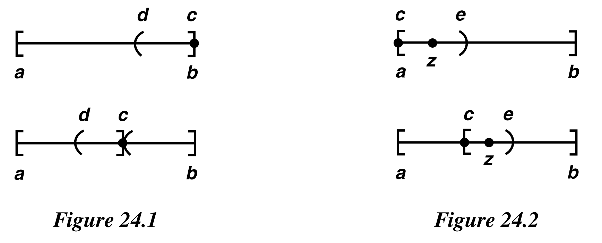
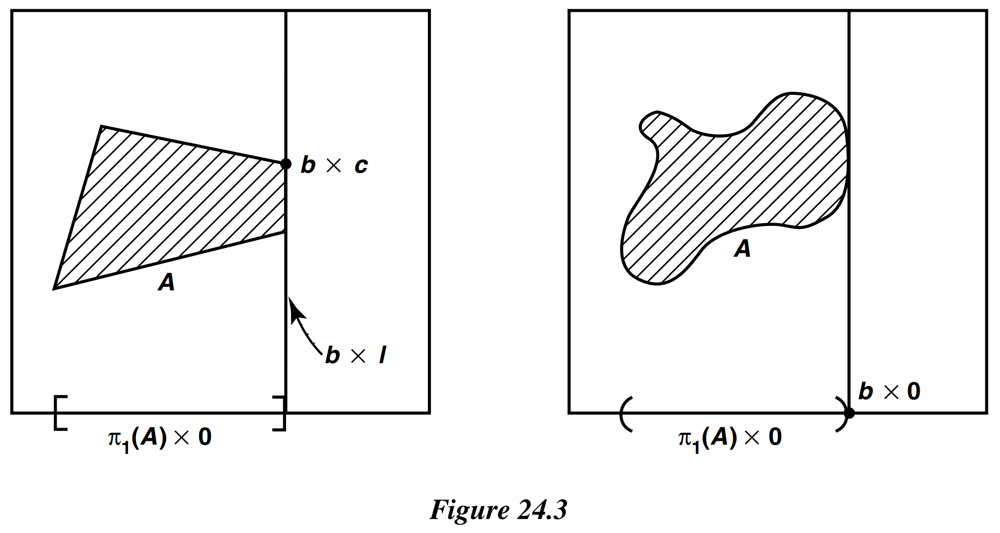
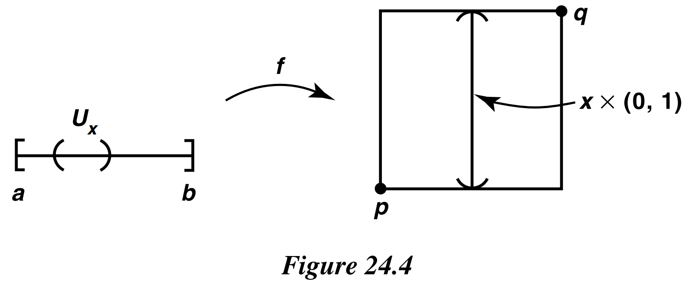
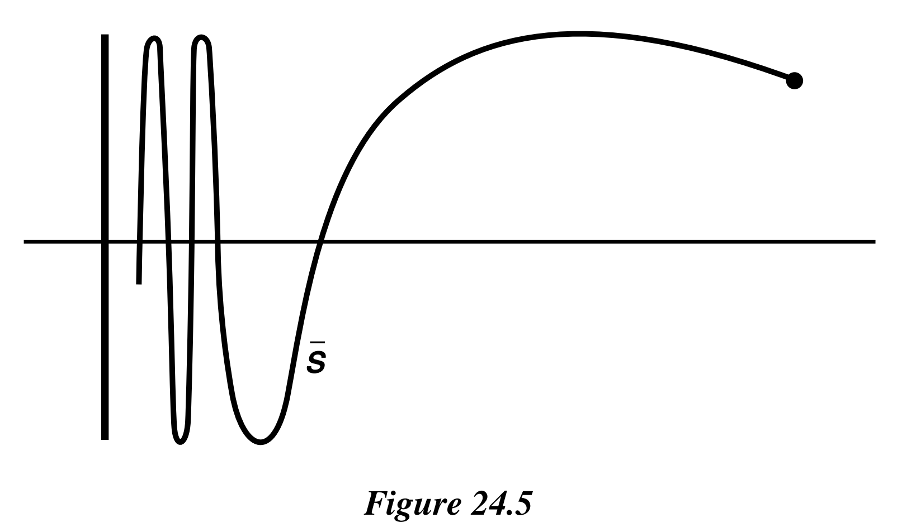

# § 24. Connected Subspaces of the Real Line

!!! definition "Definition 24.1 : Linear Continuum"
    A simply ordered set $L$ having more than one element is called a linear continuum if the following hold:

    1. $L$ has the least upper bound property.

    2. If $x<y$, there exists $z$ such that $x<z<y$.

!!! theorem "Theorem 24.1"
    If $L$ is a linear continuum in the order topology, then $L$ is connected, and so are intervals and rays in $L$.

    !!! proof
        Recall that a subspace $Y$ of $L$ is said to be convex if for every pair of points $a, b$ of $Y$ with $a<b$, the entire interval $[a, b]$ of points of $L$ lies in $Y$.
        We prove that if $Y$ is a convex subspace of $L$, then $Y$ is connected.

        So suppose that $Y$ is the union of the disjoint nonempty sets $A$ and $B$, each of which is open in $Y$.
        Choose $a \in A$ and $b \in B$; suppose for convenience that $a<b$.
        The interval $[a, b]$ of points of $L$ is contained in $Y$.
        Hence $[a, b]$ is the union of the disjoint sets

        $$
        A_{0}=A \cap[a, b] \quad \text { and } \quad B_{0}=B \cap[a, b]
        $$

        each of which is open in $[a, b]$ in the subspace topology, which is the same as the order topology.
        The sets $A_{0}$ and $B_{0}$ are nonempty because $a \in A_{0}$ and $b \in B_{0}$.
        Thus, $A_{0}$ and $B_{0}$ constitute a separation of $[a, b]$.

        Let $c=\sup A_{0}$.
        We show that $c$ belongs neither to $A_{0}$ nor to $B_{0}$, which contradicts the fact that $[a, b]$ is the union of $A_{0}$ and $B_{0}$.

        Case 1.  
        Suppose that $c \in B_{0}$. Then $c \neq a$, so either $c=b$ or $a<c<b$.
        In either case, it follows from the fact that $B_{0}$ is open in $[a, b]$ that there is some interval of the form $(d, c]$ contained in $B_{0}$.
        If $c=b$, we have a contradiction at once, for $d$ is a smaller upper bound on $A_{0}$ than $c$.
        If $c<b$, we note that $(c, b]$ does not intersect $A_{0}$
        (because $c$ is an upper bound on $A_{0}$ ). Then

        $$
        (d, b]=(d, c] \cup(c, b]
        $$

        does not intersect $A_{0}$.
        Again, $d$ is a smaller upper bound on $A_{0}$ than $c$, contrary to construction.
        See Figure 24.1.

        Case 2.  
        Suppose that $c \in A_{0}$.
        Then $c \neq b$, so either $c=a$ or $a<c<b$.
        Because $A_{0}$ is open in $[a, b]$, there must be some interval of the form $[c, e)$ contained in $A_{0}$.
        See Figure 24.2.
        Because of order property (2) of the linear continuum $L$, we can choose a point $z$ of $L$ such that $c<z<e$.
        Then $z \in A_{0}$, contrary to the fact that $c$ is an upper bound for $A_{0}$.

        

        {width=70%}
        

!!! theorem "Corollary 24.2"
    The real line $\mathbb{R}$ is connected and so are intervals and rays in $\mathbb{R}$.

!!! theorem "Theorem 24.3 : Intermediate Value Theorem"
    Let $f: X \rightarrow Y$ be a continuous map, where $X$ is a connected space and $Y$ is an ordered set in the order topology.
    If $a$ and $b$ are two points of $X$ and if $r$ is a point of $Y$ lying between $f(a)$ and $f(b)$, then there exists a point $c$ of $X$ such that $f(c)=r$.

    The intermediate value theorem of calculus is the special case of this theorem that occurs when we take $X$ to be a closed interval in $\mathbb{R}$ and $Y$ to be $\mathbb{R}$.

    !!! proof
        Assume the hypotheses of the theorem. The sets

        $$
        A=f(X) \cap(-\infty, r) \quad \text { and } \quad B=f(X) \cap(r,+\infty)
        $$

        are disjoint, and they are nonempty because one contains $f(a)$ and the other contains $f(b)$.
        Each is open in $f(X)$, being the intersection of an open ray in $Y$ with $f(X)$.
        If there were no point $c$ of $X$ such that $f(c)=r$, then $f(X)$ would be the union of the sets $A$ and $B$.
        Then $A$ and $B$ would constitute a separation of $f(X)$, contradicting the fact that the image of a connected space under a continuous map is connected.

!!! example
    One example of a linear continuum different from $\mathbb{R}$ is the ordered square.
    We check the least upper bound property.
    (The second property of a linear continuum is trivial to check.)
    Let $A$ be a subset of $I \times I$; let $\pi_{1}: I \times I \rightarrow I$ be projection on the first coordinate; let $b=\sup \pi_{1}(A)$. If $b \in \pi_{1}(A)$, then $A$ intersects the subset $b \times I$ of $I \times I$.
    Because $b \times I$ has the order type of $I$, the set $A \cap(b \times I)$ will have a least upper bound $b \times c$, which will be the least upper bound of $A$.
    See Figure 24.3.
    If $b \notin \pi_{1}(A)$, then $b \times 0$ is the least upper bound of $A$; no element of the form $b^{\prime} \times c$ with $b^{\prime}<b$ can be an upper bound for $A$, for then $b^{\prime}$ would be an upper bound for $\pi_{1}(A)$.

    

    {width=70%}
    

!!! definition "Definition 24.2 : Path / Path Connected"
    Given points $x$ and $y$ of the space $X$, a **path** in $X$ from $x$ to $y$ is a continuous map $f:[a, b] \rightarrow X$ of some closed interval in the real line into $X$, such that $f(a)=x$ and $f(b)=y$.
    A space $X$ is said to be **path connected** if every pair of points of $X$ can be joined by a path in $X$.

!!! theorem "Theorem 24.4"
    A path-connected space $X$ is connected.

    The converse does not hold; a connected space need not be path connected.

    !!! proof
        Suppose $X=A \cup B$ is a separation of $X$.
        Let $f:[a, b] \rightarrow X$ be any path in $X$.
        Being the continuous image of a connected set, the set $f([a, b])$ is connected, so that it lies entirely in either $A$ or $B$.
        Therefore, there is no path in $X$ joining a point of $A$ to a point of $B$, contrary to the assumption that $X$ is path connected.

!!! example
    Define the **unit ball** $B^{n}$ in $\mathbb{R}^{n}$ by the equation

    $$
    B^{n}=\{\mathbf{x} \mid\|\mathbf{x}\| \leq 1\}
    $$

    where

    $$
    \|\mathbf{x}\|=\left\|\left(x_{1}, \ldots, x_{n}\right)\right\|=\left(x_{1}^{2}+\cdots+x_{n}^{2}\right)^{1 / 2} .
    $$

    The unit ball is path connected.

    A similar argument shows that every open ball $B_{d}(\mathbf{x}, \epsilon)$ and every closed ball $\bar{B}_{d}(\mathbf{x}, \epsilon)$ in $\mathbb{R}^{n}$ is path connected.
    
    !!! proof
        given any two points $\mathbf{x}$ and $\mathbf{y}$ of $B^{n}$, the straight-line path $f:[0,1] \rightarrow \mathbb{R}^{n}$ defined by

        $$
        f(t)=(1-t) \mathbf{x}+t \mathbf{y}
        $$

        lies in $B^{n}$.
        For if $\mathbf{x}$ and $\mathbf{y}$ are in $B^{n}$ and $t$ is in $[0,1]$,

        $$
        \|f(t)\| \leq(1-t)\|\mathbf{x}\|+t\|\mathbf{y}\| \leq 1 \text {. }
        $$

!!! example
    Define **punctured euclidean space** to be the space $\mathbb{R}^{n}-\{\mathbf{0}\}$, where $\mathbf{0}$ is the origin in $\mathbb{R}^{n}$.
    If $n>1$, this space is path connected.
    
    !!! proof
        Given $\mathbf{x}$ and $\mathbf{y}$ different from $\mathbf{0}$, we can join $\mathbf{x}$ and $\mathbf{y}$ by the straight-line path between them if that path does not go through the origin.
        Otherwise, we can choose a point $\mathbf{z}$ not on the line joining $\mathbf{x}$ and $\mathbf{y}$, and take the broken-line path from $\mathbf{x}$ to $\mathbf{z}$, and then from $\mathbf{z}$ to $\mathbf{y}$.

!!! example
    Define the **unit sphere** $S^{n-1}$ in $\mathbb{R}^{n}$ by the equation

    $$
    S^{n-1}=\{\mathbf{x} \mid\|\mathbf{x}\|=1\}
    $$

    If $n>1$, it is path connected.

    !!! proof
        For the map $g: \mathbb{R}^{n}-\{\mathbf{0}\} \rightarrow S^{n-1}$ defined by $g(\mathbf{x})=\mathbf{x} /\|\mathbf{x}\|$ is continuous and surjective; and it is easy to show that the continuous image of a path connected space is path connected.

!!! example
    The **ordered square** $I_{o}^{2}$ is connected but not path connected.
    
    !!! proof
        Being a linear continuum, the ordered square is connected.
        Let $p=0 \times 0$ and $q=$ $1 \times 1$.
        We suppose there is a path $f:[a, b] \rightarrow I_{o}^{2}$ joining $p$ and $q$ and derive a contradiction.
        The image set $f([a, b])$ must contain every point $x \times y$ of $I_{o}^{2}$, by the **intermediate value theorem**.
        Therefore, for each $x \in I$, the set

        $$
        U_{x}=f^{-1}(x \times(0,1))
        $$

        is a nonempty subset of $[a, b]$; by continuity, it is open in $[a, b]$.
        See Figure 24.4.
        Choose, for each $x \in I$, a rational number $q_{x}$ belonging to $U_{x}$.
        Since the sets $U_{x}$ are disjoint, the map $x \rightarrow q_{x}$ is an injective mapping of $I$ into $\mathbb{Q}$.
        This contradicts the fact that the interval $I$ is uncountable.

        

        {width=60%}
        

!!! example
    Let $S$ denote the following subset of the plane.

    $$
    S=\{x \times \sin (1 / x) \mid 0<x \leq 1\} .
    $$

    Because $S$ is the image of the connected set $(0,1]$ under a continuous map, $S$ is connected.
    Therefore, its closure $\bar{S}$ in $\mathbb{R}^{2}$ is also connected.
    The set $\bar{S}$ is a classical example in topology called the **topologist's sine curve**.
    It is illustrated in Figure 24.5; it equals the union of $S$ and the vertical interval $0 \times[-1,1]$.
    We show that $\bar{S}$ is not path connected.

    

    {width=60%}
    

    !!! proof
        Suppose there is a path $f:[a, c] \rightarrow \bar{S}$ beginning at the origin and ending at a point of $S$.
        The set of those $t$ for which $f(t) \in 0 \times[-1,1]$ is closed, so it has a largest element $b$.
        Then $f:[b, c] \rightarrow \bar{S}$ is a path that maps $b$ into the vertical interval $0 \times[-1,1]$ and maps the other points of $[b, c]$ to points of $S$.

        Replace $[b, c]$ by $[0,1]$ for convenience; let $f(t)=(x(t), y(t))$.
        Then $x(0)=0$, while $x(t)>0$ and $y(t)=\sin (1 / x(t))$ for $t>0$.
        We show there is a sequence of points $t_{n} \rightarrow 0$ such that $y\left(t_{n}\right)=(-1)^{n}$.
        Then the sequence $y\left(t_{n}\right)$ does not converge, contradicting continuity of $f$.

        To find $t_{n}$, we proceed as follows: Given $n$, choose $u$ with $0<u<x(1 / n)$ such that $\sin (1 / u)=(-1)^{n}$.
        Then use the intermediate value theorem to find $t_{n}$ with $0<t_{n}<1 / n$ such that $x\left(t_{n}\right)=u$.