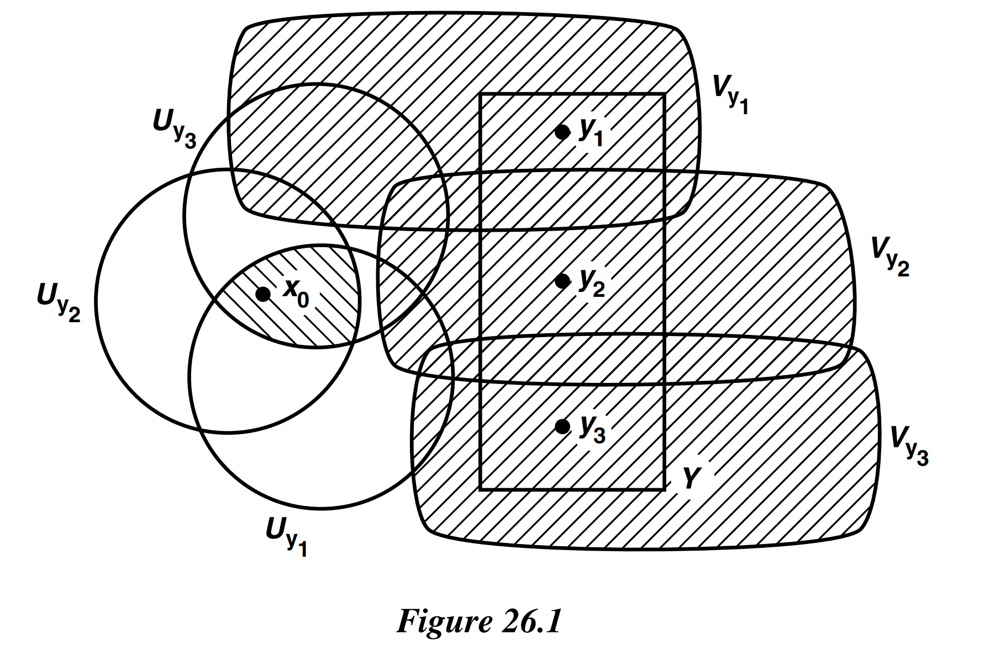
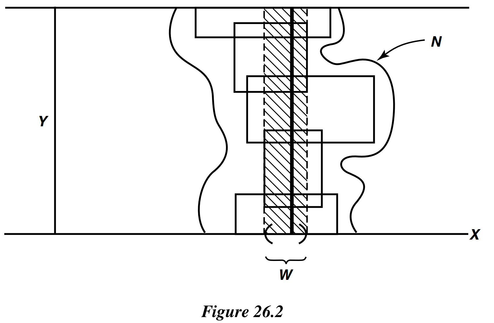

# § 26. Compact Spaces

!!! definition "Definition 26.1 : Covering / Open Covering"
    A collection $\mathcal{A}$ of subsets of a space $X$ is said to **cover** $X$, or to be a **covering** of $X$, if the union of the elements of $\mathcal{A}$ is equal to $X$.
    It is called an **open covering** of $X$ if its elements are open subsets of $X$.

!!! definition "Definition 26.2 : Compact"
    A space $X$ is said to be **compact** if every open covering $\mathcal{A}$ of $X$ contains a finite subcollection that also covers $X$.

!!! example
    The following subspace of $\mathbb{R}$ is compact:

    $$
    X=\{0\} \cup\left\{1 / n \mid n \in \mathbb{Z}_{+}\right\}
    $$

    Given an open covering $\mathcal{A}$ of $X$, there is an element $U$ of $\mathcal{A}$ containing 0.
    The set $U$ contains all but finitely many of the points $1 / n$; choose, for each point of $X$ not in $U$, an element of $\mathcal{A}$ containing it.
    The collection consisting of these elements of $\mathcal{A}$, along with the element $U$, is a finite subcollection of $\mathcal{A}$ that covers $X$.

!!! definition "Definition 26.3 : Cover in Subspace"
    If $Y$ is a subspace of $X$, a collection $\mathcal{A}$ of subsets of $X$ is said to **cover** $Y$ if the union of its elements contains $Y$.

!!! theorem "Lemma 26.1"
    Let $Y$ be a subspace of $X$.
    Then $Y$ is compact if and only if every covering of $Y$ by sets open in $X$ contains a finite subcollection covering $Y$.

    !!! proof
        Suppose that $Y$ is compact and $\mathcal{A}=\left\{A_{\alpha}\right\}_{\alpha \in J}$ is a covering of $Y$ by sets open in $X$.
        Then the collection

        $$
        \left\{A_{\alpha} \cap Y \mid \alpha \in J\right\}
        $$

        is a covering of $Y$ by sets open in $Y$; hence a finite subcollection

        $$
        \left\{A_{\alpha_{1}} \cap Y, \ldots, A_{\alpha_{n}} \cap Y\right\}
        $$

        covers $Y$.
        Then $\left\{A_{\alpha_{1}}, \ldots, A_{\alpha_{n}}\right\}$ is a subcollection of $\mathcal{A}$ that covers $Y$.

        Conversely, suppose the given condition holds; we wish to prove $Y$ compact.
        Let $\mathcal{A}^{\prime}=\left\{A_{\alpha}^{\prime}\right\}$ be a covering of $Y$ by sets open in $Y$.
        For each $\alpha$, choose a set $A_{\alpha}$ open in $X$ such that

        $$
        A_{\alpha}^{\prime}=A_{\alpha} \cap Y
        $$

        The collection $\mathcal{A}=\left\{A_{\alpha}\right\}$ is a covering of $Y$ by sets open in $X$.
        By hypothesis, some finite subcollection $\left\{A_{\alpha_{1}}, \ldots, A_{\alpha_{n}}\right\}$ covers $Y$.
        Then $\left\{A_{\alpha_{1}}^{\prime}, \ldots, A_{\alpha_{n}}^{\prime}\right\}$ is a subcollection of $\mathcal{A}^{\prime}$ that covers $Y$.

!!! theorem "Theorem 26.2"
    Every closed subspace of a compact space is compact.

    !!! proof
        Let $Y$ be a closed subspace of the compact space $X$.
        Given a covering $\mathcal{A}$ of $Y$ by sets open in $X$, let us form an open covering $\mathcal{B}$ of $X$ by adjoining to $\mathcal{A}$ the single open set $X-Y$, that is,

        $$
        \mathcal{B}=\mathcal{A} \cup\{X-Y\} .
        $$

        Some finite subcollection of $\mathcal{B}$ covers $X$.
        If this subcollection contains the set $X-Y$, discard $X-Y$; otherwise, leave the subcollection alone.
        The resulting collection is a finite subcollection of $\mathcal{A}$ that covers $Y$.

!!! theorem "Theorem 26.3"
    Every compact subspace of a Hausdorff space is closed.

    !!! proof
        Let $Y$ be a compact subspace of the Hausdorff space $X$. We shall prove that $X-Y$ is open, so that $Y$ is closed.

        Let $x_{0}$ be a point of $X-Y$.
        We show there is a neighborhood of $x_{0}$ that is disjoint from $Y$.
        For each point $y$ of $Y$, let us choose disjoint neighborhoods $U_{y}$ and $V_{y}$ of the points $x_{0}$ and $y$, respectively (using the Hausdorff condition).
        The collection $\left\{V_{y} \mid y \in\right.$ $Y\}$ is a covering of $Y$ by sets open in $X$; therefore, finitely many of them $V_{y_{1}}, \ldots, V_{y_{n}}$ cover $Y$.
        The open set

        $$
        V=V_{y_{1}} \cup \cdots \cup V_{y_{n}}
        $$

        contains $Y$, and it is disjoint from the open set

        $$
        U=U_{y_{1}} \cap \cdots \cap U_{y_{n}}
        $$

        formed by taking the intersection of the corresponding neighborhoods of $x_{0}$.
        For if $z$ is a point of $V$, then $z \in V_{y_{i}}$ for some $i$, hence $z \notin U_{y_{i}}$ and so $z \notin U$.
        See Figure 26.1.

        Then $U$ is a neighborhood of $x_{0}$ disjoint from $Y$, as desired.

        

        {width=60%}
        

!!! theorem "Lemma 26.4"
    If $Y$ is a compact subspace of the Hausdorff space $X$ and $x_{0}$ is not in $Y$, then there exist disjoint open sets $U$ and $V$ of $X$ containing $x_{0}$ and $Y$, respectively.

!!! theorem "Theorem 26.5"
    The image of a compact space under a continuous map is compact.

    !!! proof
        Let $f: X \rightarrow Y$ be continuous; let $X$ be compact.
        Let $\mathcal{A}$ be a covering of the set $f(X)$ by sets open in $Y$.
        The collection

        $$
        \left\{f^{-1}(A) \mid A \in \mathcal{A}\right\}
        $$

        is a collection of sets covering $X$; these sets are open in $X$ because $f$ is continuous.
        Hence finitely many of them, say

        $$
        f^{-1}\left(A_{1}\right), \ldots, f^{-1}\left(A_{n}\right)
        $$

        cover $X$.
        Then the sets $A_{1}, \ldots, A_{n}$ cover $f(X)$.

!!! theorem "Theorem 26.6"
    Let $f: X \rightarrow Y$ be a bijective continuous function.
    If $X$ is compact and $Y$ is Hausdorff, then $f$ is a homeomorphism.

    !!! proof
        We shall prove that images of closed sets of $X$ under $f$ are closed in $Y$; this will prove continuity of the map $f^{-1}$.
        If $A$ is closed in $X$, then $A$ is compact, by **Theorem 26.2**.
        Therefore, by **Theorem 26.5**, $f(A)$ is compact.
        Since $Y$ is Hausdorff, $f(A)$ is closed in $Y$, by **Theorem 26.3**.
    
!!! theorem "Theorem 26.7"
    The product of finitely many compact spaces is compact.

    !!! proof
        We shall prove that the product of two compact spaces is compact; the theorem follows by induction for any finite product.

        Step 1.  
        Suppose that we are given spaces $X$ and $Y$, with $Y$ compact.
        Suppose that $x_{0}$ is a point of $X$, and $N$ is an open set of $X \times Y$ containing the "slice" $x_{0} \times Y$ of $X \times Y$.
        We prove the following:

        There is a neighborhood $W$ of $x_{0}$ in $X$ such that $N$ contains the entire set $W \times Y$.

        The set $W \times Y$ is often called a **tube** about $x_{0} \times Y$.

        First let us cover $x_{0} \times Y$ by basis elements $U \times V$ (for the topology of $X \times Y$ ) lying in $N$.
        The space $x_{0} \times Y$ is compact, being homeomorphic to $Y$.
        Therefore, we can cover $x_{0} \times Y$ by finitely many such basis elements

        $$
        U_{1} \times V_{1}, \ldots, U_{n} \times V_{n}
        $$

        (We assume that each of the basis elements $U_{i} \times V_{i}$ actually intersects $x_{0} \times Y$, since otherwise that basis element would be superfluous; we could discard it from the finite collection and still have a covering of $x_{0} \times Y$.)
        Define

        $$
        W=U_{1} \cap \cdots \cap U_{n} .
        $$

        The set $W$ is open, and it contains $x_{0}$ because each set $U_{i} \times V_{i}$ intersects $x_{0} \times Y$.

        We assert that the sets $U_{i} \times V_{i}$, which were chosen to cover the slice $x_{0} \times Y$, actually cover the tube $W \times Y$. Let $x \times y$ be a point of $W \times Y$.
        Consider the point $x_{0} \times y$ of the slice $x_{0} \times Y$ having the same $y$-coordinate as this point.
        Now $x_{0} \times y$ belongs to $U_{i} \times V_{i}$ for some $i$, so that $y \in V_{i}$.
        But $x \in U_{j}$ for every $j$ (because $x \in W$ ).
        Therefore, we have $x \times y \in U_{i} \times V_{i}$, as desired.

        Since all the sets $U_{i} \times V_{i}$ lie in $N$, and since they cover $W \times Y$, the tube $W \times Y$ lies in $N$ also.
        See Figure 26.2.

        

        {width=60%}
        

        Step 2.  
        Now we prove the theorem.
        Let $X$ and $Y$ be compact spaces.
        Let $\mathcal{A}$ be an open covering of $X \times Y$.
        Given $x_{0} \in X$, the slice $x_{0} \times Y$ is compact and may therefore be covered by finitely many elements $A_{1}, \ldots, A_{m}$ of $\mathcal{A}$.
        Their union $N=A_{1} \cup \cdots \cup A_{m}$ is an open set containing $x_{0} \times Y$; by Step 1, the open set $N$ contains a tube $W \times Y$ about $x_{0} \times Y$, where $W$ is open in $X$.
        Then $W \times Y$ is covered by finitely many elements $A_{1}, \ldots, A_{m}$ of $\mathcal{A}$.

        Thus, for each $x$ in $X$, we can choose a neighborhood $W_{x}$ of $x$ such that the tube $W_{x} \times Y$ can be covered by finitely many elements of $\mathcal{A}$.
        The collection of all the neighborhoods $W_{x}$ is an open covering of $X$; therefore by compactness of $X$, there exists a finite subcollection

        $$
        \left\{W_{1}, \ldots, W_{k}\right\}
        $$

        covering $X$.
        The union of the tubes

        $$
        W_{1} \times Y, \ldots, W_{k} \times Y
        $$

        is all of $X \times Y$; since each may be covered by finitely many elements of $\mathcal{A}$, so may $X \times Y$ be covered.

!!! theorem "Lemma 26.8 : The Tube Lemma"
    Consider the product space $X \times Y$, where $Y$ is compact.
    If $N$ is an open set $X \times Y$ containing the slice $x_{0} \times Y$ of $X \times Y$, then $N$ contains some tube $W \times Y$ about $x_{0} \times Y$, where $W$ is a neighborhood of $x_{0}$ in $X$.

!!! definition "Definition 26.4 : Finite Intersection Property"
    A collection $C$ of subsets of $X$ is said to have the **finite intersection property** if for every finite subcollection

    $$
    \left\{C_{1}, \ldots, C_{n}\right\}
    $$

    of $\mathcal{C}$, the intersection $C_{1} \cap \cdots \cap C_{n}$ is nonempty.

!!! theorem "Theorem 26.9"
    Let $X$ be a topological space.
    Then $X$ is compact if and only if for every collection $C$ of closed sets in $X$ having the finite intersection property, the intersection $\bigcap_{C \in \mathcal{C}} C$ of all the elements of $\mathcal{C}$ is nonempty.

    !!! proof
        Given a collection $\mathcal{A}$ of subsets of $X$, let

        $$
        \mathcal{C}=\{X-A \mid A \in \mathcal{A}\}
        $$

        be the collection of their complements. Then the following statements hold:

        1. $\mathcal{A}$ is a collection of open sets if and only if $\mathcal{C}$ is a collection of closed sets.

        2. The collection $\mathcal{A}$ covers $X$ if and only if the intersection $\bigcap_{C \in \mathcal{C}} C$ of all the elements of $\mathcal{C}$ is empty.

        3. The finite subcollection $\left\{A_{1}, \ldots, A_{n}\right\}$ of $\mathcal{A}$ covers $X$ if and only if the intersection of the corresponding elements $C_{i}=X-A_{i}$ of $\mathcal{C}$ is empty.

        The first statement is trivial, while the second and third follow from DeMorgan's law:

        $$
        X-\left(\bigcup_{\alpha \in J} A_{\alpha}\right)=\bigcap_{\alpha \in J}\left(X-A_{\alpha}\right)
        $$

        The proof of the theorem now proceeds in two easy steps: taking the contrapositive (of the theorem), and then the complement (of the sets)!

        The statement that $X$ is compact is equivalent to saying: "Given any collection $\mathcal{A}$ of open subsets of $X$, if $\mathcal{A}$ covers $X$, then some finite subcollection of $\mathcal{A}$ covers $X$."
        This statement is equivalent to its contrapositive, which is the following: "Given any collection $\mathcal{A}$ of open sets, if no finite subcollection of $\mathcal{A}$ covers $X$, then $\mathcal{A}$ does not cover $X$."
        Letting $C$ be, as earlier, the collection $\{X-A \mid A \in \mathcal{A}\}$ and applying (1)-(3), we see that this statement is in turn equivalent to the following: "Given any collection $\mathcal{C}$ of closed sets, if every finite intersection of elements of $\mathcal{C}$ is nonempty, then the intersection of all the elements of $\mathcal{C}$ is nonempty."
        This is just the condition of our theorem.

!!! theorem "Lemma 26.10"
    A special case of **Theorem 26.9** occurs when we have a nested sequence $C_{1} \supset C_{2} \supset$ ... $\supset C_{n} \supset C_{n+1} \supset \ldots$ of closed sets in a compact space $X$.
    If each of the sets $C_{n}$ is nonempty, then the collection $C=\left\{C_{n}\right\}_{n \in \mathbb{Z}_{+}}$automatically has the finite intersection property.
    Then the intersection

    $$
    \bigcap_{n \in \mathbb{Z}_{+}} C_{n}
    $$

    is nonempty.