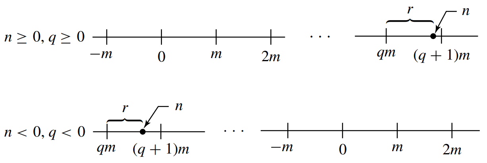

# § 6. Cyclic Groups

!!! definition "Definition 6.0.1 : Order of an Element"
    Let $a$ be an element of a group $G$.
    If the cyclic subgroup $\langle a\rangle$ of $G$ is finite, then the **order of $a$** is the order $|\langle a\rangle|$ of this cyclic subgroup.
    Otherwise, we say that $a$ is of **infinite order**.
    
    We will see in this section that if $a \in G$ is of finite order $m$, then $m$ is the smallest positive integer such that $a^{m}=e$.

## Elementary Properties of Cyclic Groups

!!! theorem "Theorem 6.1 : Every cyclic group is abelian."
    Every cyclic group is abelian.

    !!! proof
        Let $G$ be a cyclic group and let $a$ be a generator of $G$ so that

        $$
        G=\langle a\rangle=\left\{a^{n} \mid n \in \mathbb{Z}\right\}
        $$

        If $g_{1}$ and $g_{2}$ are any two elements of $G$, there exist integers $r$ and $s$ such that $g_{1}=a^{r}$ and $g_{2}=a^{s}$.
        Then

        $$
        g_{1} g_{2}=a^{r} a^{s}=a^{r+s}=a^{s+r}=a^{s} a^{r}=g_{2} g_{1},
        $$

        so $G$ is abelian.

!!! theorem "Theorem 6.3 : Division Algorithm for $\mathbb{Z}$"
    If $m$ is a positive integer and $n$ is any integer, then there exist unique integers $q$ and $r$ such that

    $$
    n=m q+r \quad \text { and } \quad 0 \leq r<m \text {. }
    $$

    !!! proof
        {: .center style="width:70%;"} 
        /// caption
        Figure 6.1
        ///
        
        We give an intuitive diagrammatic explanation, using Fig. 6.1. On the real $x$-axis of analytic geometry, mark off the multiples of $m$ and the position of $n$.
        Now $n$ falls either on a multiple $q m$ of $m$ and $r$ can be taken as 0 , or $n$ falls between two multiples of $m$.
        If the latter is the case, let $q m$ be the first multiple of $m$ to the left of $n$.
        Then $r$ is as shown in Fig. 6.1. Note that $0 \leq r<m$.
        Uniqueness of $q$ and $r$ follows since if $n$ is not a multiple of $m$ so that we can take $r=0$, then there is a unique multiple $q m$ of $m$ to the left of $n$ and at distance less than $m$ from $n$, as illustrated in Fig. 6.1.

    In the notation of the division algorithm, we regard $q$ as the **quotient** and $r$ as the nonnegative **remainder** when $n$ is divided by $m$.

!!! theorem "Theorem 6.6 : A subgroup of a cyclic group is cyclic."
    A subgroup of a cyclic group is cyclic.

    !!! proof
        Let $G$ be a cyclic group generated by $a$ and let $H$ be a subgroup of $G$.
        If $H=\{e\}$, then $H=\langle e\rangle$ is cyclic.
        If $H \neq\{e\}$, then $a^{n} \in H$ for some $n \in \mathbb{Z}^{+}$.
        Let $m$ be the smallest integer in $\mathbb{Z}^{+}$such that $a^{m} \in H$.

        We claim that $c=a^{m}$ generates $H$; that is,

        $$
        H=\left\langle a^{m}\right\rangle=\langle c\rangle
        $$

        We must show that every $b \in H$ is a power of $c$.
        Since $b \in H$ and $H \leq G$, we have $b=a^{n}$ for some $n$.
        Find $q$ and $r$ such that

        $$
        n=m q+r \quad \text { for } \quad 0 \leq r<m
        $$

        in accord with the division algorithm.
        Then

        $$
        a^{n}=a^{m q+r}=\left(a^{m}\right)^{q} a^{r},
        $$

        so

        $$
        a^{r}=\left(a^{m}\right)^{-q} a^{n} .
        $$

        Now since $a^{n} \in H, a^{m} \in H$, and $H$ is a group, both $\left(a^{m}\right)^{-q}$ and $a^{n}$ are in $H$.
        Thus

        $$
        \left(a^{m}\right)^{-q} a^{n} \in H ; \quad \text { that is, } \quad a^{r} \in H \text {. }
        $$

        Since $m$ was the smallest positive integer such that $a^{m} \in H$ and $0 \leq r<m$, we must have $r=0$.
        Thus $n=q m$ and

        $$
        b=a^{n}=\left(a^{m}\right)^{q}=c^{q},
        $$

        so $b$ is a power of $c$.

!!! corollary "Corollary 6.7 : Subgroups of $\mathbb{Z}$"
    The subgroups of $\mathbb{Z}$ under addition are precisely the groups $n \mathbb{Z}$ under addition for $n \in \mathbb{Z}$.

    !!! proof
        $\mathbb{Z}$ under addition is cyclic and for a positive integer $n$, the set $n \mathbb{Z}$ of all multiples of $n$ is a subgroup of $\mathbb{Z}$ under addition, the cyclic subgroup generated by $n$.
        **Theorem 6.6** shows that these cyclic subgroups are the only subgroups of $\mathbb{Z}$ under addition.

!!! definition "Definition 6.8 : Greatest Common Divisor"
    Let $r$ and $s$ be two positive integers.
    The positive generator $d$ of the cyclic group

    $$
    H=\{n r+m s \mid n, m \in \mathbb{Z}\}
    $$

    under addition is the **greatest common divisor** (abbreviated gcd) of $r$ and $s$.
    We write $d=\operatorname{gcd}(r, s)$.

Note from the definition that $d$ is a divisor of both $r$ and $s$ since both $r=1 r+0 s$ and $s=0 r+1 s$ are in $H$.
Since $d \in H$, we can write

$$
d=n r+m s
$$

for some integers $n$ and $m$.
We see that every integer dividing both $r$ and $s$ divides the right-hand side of the equation, and hence must be a divisor of $d$ also.
Thus $d$ must be the largest number dividing both $r$ and $s$; this accounts for the name given to $d$ in **Definition 6.8**.

!!! definition "Definition 6.9.1 : Relatively Prime"
    Two positive integers are **relatively prime** if their gcd is $1$.

!!! theorem "Theorem 6.9.2"
    If $r$ and $s$ are relatively prime and if $r$ divides $s m$, then $r$ must divide $m$.

    !!! proof
        If $r$ and $s$ are relatively prime, then we may write

        $$
        1=a r+b s \quad \text { for some } \quad a, b \in \mathbb{Z}
        $$

        Multiplying by $m$, we obtain

        $$
        m=a r m+b s m .
        $$

        Now $r$ divides both arm and $b s m$ since $r$ divides $s m$.
        Thus $r$ is a divisor of the right-hand side of this equation, so $r$ must divide $m$.

## The Structure of Cyclic Groups

!!! theorem "Theorem 6.10 : All cyclic groups are isomorphic to $\langle\mathbb{Z},+\rangle$ or $\left\langle\mathbb{Z}_{n},+{ }_{n}\right\rangle$."
    Let $G$ be a cyclic group with generator $a$.
    If the order of $G$ is infinite, then $G$ is isomorphic to $\langle\mathbb{Z},+\rangle$.
    If $G$ has finite order $n$, then $G$ is isomorphic to $\left\langle\mathbb{Z}_{n},+{ }_{n}\right\rangle$.

    !!! proof
        1. **Case I** : For all positive integers $m, a^{m} \neq e$.

            In this case we claim that no two distinct exponents $h$ and $k$ can give equal elements $a^{h}$ and $a^{k}$ of $G$.
            Suppose that $a^{h}=a^{k}$ and say $h>k$.
            Then

            $$
            a^{h} a^{-k}=a^{h-k}=e,
            $$

            contrary to our Case I assumption.
            Hence every element of $G$ can be expressed as $a^{m}$ for a unique $m \in \mathbb{Z}$.
            The map $\phi: G \rightarrow \mathbb{Z}$ given by $\phi\left(a^{i}\right)=i$ is thus well defined, one to one, and onto $\mathbb{Z}$.
            Also,

            $$
            \phi\left(a^{i} a^{j}\right)=\phi\left(a^{i+j}\right)=i+j=\phi\left(a^{i}\right)+\phi\left(a^{j}\right)
            $$

            so the homomorphism property is satisfied and $\phi$ is an isomorphism.

        2. **Case II** : $a^{m}=e$ for some positive integer $m$.
            
            Let $n$ be the smallest positive integer such that $a^{n}=e$.
            If $s \in \mathbb{Z}$ and $s=n q+r$ for $0 \leq r<n$, then $a^{s}=a^{n q+r}=\left(a^{n}\right)^{q} a^{r}=e^{q} a^{r}=a^{r}$.
            As in Case 1, if $0<k<h<n$ and $a^{h}=a^{k}$, then $a^{h-k}=e$ and $0<h-k<n$, contradicting our choice of $n$.
            Thus the elements

            $$
            a^{0}=e, a, a^{2}, a^{3}, \cdots, a^{n-1}
            $$

            are all distinct and comprise all elements of $G$.
            The map $\psi: G \rightarrow \mathbb{Z}_{n}$ given by $\psi\left(a^{i}\right)=i$ for $i=0,1,2, \cdots, n-1$ is thus well defined, one to one, and onto $\mathbb{Z}_{n}$.
            Because $a^{n}=e$, we see that $a^{i} a^{j}=a^{k}$ where $k=i+{ }_{n} j$.
            Thus

            $$
            \psi\left(a^{i} a^{j}\right)=i+_{n} j=\psi\left(a^{i}\right)+{ }_{n} \psi\left(a^{j}\right),
            $$

            so the homomorphism property is satisfied and $\psi$ is an isomorphism.

## Subgroups of Finite Cyclic Groups

!!! theorem "Theorem 6.14 : Subgroups of Finite Cyclic Groups"    
    Let $G$ be a cyclic group with $n$ elements and generated by $a$.
    Let $b \in G$ and let $b=a$.
    Then $b$ generates a cyclic subgroup $H$ of $G$ containing $n / d$ elements, where $d$ is the greatest common divisor of $n$ and $s$.
    Also, $\left\langle a^{s}\right\rangle=\left\langle a^{t}\right\rangle$ if and only if $\operatorname{gcd}(s, n)=\operatorname{gcd}(t, n)$.

    !!! proof
        
        That $b$ generates a cyclic subgroup $H$ of $G$ is known from **Theorem 5.17**.
        We need show only that $H$ has $n / d$ elements.
        Following the argument of Case II of Theorem 6.10, we see that $H$ has as many elements as the smallest positive power $m$ of $b$ that gives the identity.
        Now $b=a^{s}$, and $b^{m}=e$ if and only if $\left(a^{s}\right)^{m}=e$, or if and only if $n$ divides $m s$.
        What is the smallest positive integer $m$ such that $n$ divides $m s$ ? Let $d$ be the ged of $n$ and $s$.
        Then there exists integers $u$ and $v$ such that

        $$
        d=u n+v s
        $$

        Since $d$ divides both $n$ and $s$, we may write

        $$
        1=u(n / d)+v(s / d)
        $$

        where both $n / d$ and $s / d$ are integers.
        This last equation shows that $n / d$ and $s / d$ are relatively prime, for any integer dividing both of them must also divide $1$.
        We wish to find the smallest positive $m$ such that

        $$
        \frac{m s}{n}=\frac{m(s / d)}{(n / d)} \text { is an integer.}
        $$

        From **Theorem 6.9.2**, we conclude that $n / d$ must divide $m$, so the smallest such $m$ is $n / d$.
        Thus the order of $H$ is $n / d$.

        Taking for the moment $\mathbb{Z}_{n}$ as a model for a cyclic group of order $n$, we see that if $d$ is a divisor of $n$, then the cyclic subgroup $\langle d\rangle$ of $\mathbb{Z}_{n}$ had $n / d$ elements, and contains all the positive integers $m$ less than $n$ such that $\operatorname{gcd}(m, n)=d$.
        Thus there is only one subgroup of $\mathbb{Z}_{n}$ of order $n / d$.
        Taken with the preceding paragraph, this shows at once that if $a$ is a generator of the cyclic group $G$, then $\left\langle a^{s}\right\rangle=\left\langle a^{t}\right\rangle$ if and only if $\operatorname{gcd}(s, n)=$ $\operatorname{gcd}(t, n)$.

!!! corollary "Corollary 6.17 : Other Generators of Finite Cyclic Groups"
    If $a$ is a generator of a finite cyclic group $G$ of order $n$, then the other generators of $G$ are the elements of the form $a^{r}$, where $r$ is relatively prime to $n$.

    !!! proof
        This corollary follows immediately from **Theorem 6.14**.