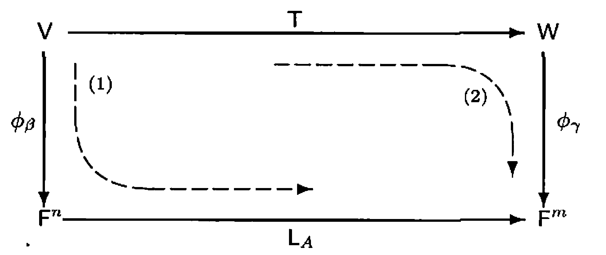
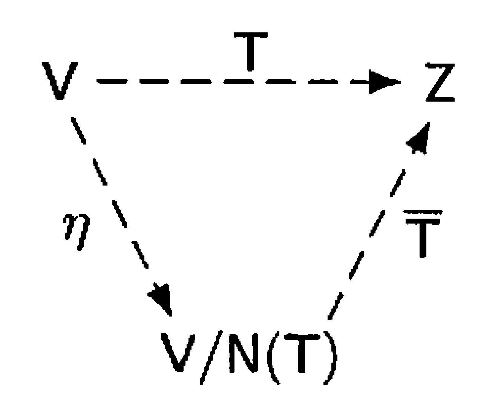

# § 11. Invertibility and Isomorphisms

## Inverse of Linear Transformation

!!! definition "Definition 11.1 : Inverse of a Linear Transformation"
    Let $V$ and $W$ be vector spaces, and let $T: V \rightarrow W$ be linear.
    A function $U: W \rightarrow V$ is said to be an **inverse** of $T$ if $TU=I_{W}$ and $UT=I_{V}$.
    If $T$ has an inverse, then $T$ is said to be **invertible**.
    
    If $T$ is invertible, then the inverse of $T$ is unique and is denoted by $T^{-1}$.

!!! concept "Concept 11.2 : Properties of invertible transformations"
    The following facts hold for invertible functions $T$ and $U$.

    - $(TU)^{-1}=U^{-1} T^{-1}$.
    - $\left(T^{-1}\right)^{-1}=T$; in particular, $T^{-1}$ is invertible.

    We often use the fact that a function is invertible if and only if it is both one-to-one and onto.
    We can therefore restate **Theorem 8.15** as follows.

    - Let $T: V \rightarrow W$ be a linear transformation, where $V$ and $W$ are finite-dimensional spaces of equal dimension.
        Then $T$ is invertible if and only if $\operatorname{rank}(T)=\operatorname{dim}(V)$.

!!! theorem "Theorem 11.3 : Inverse of an invertible linear transformation is linear."
    Let $V$ and $W$ be vector spaces, and let $T: V \rightarrow W$ be linear and invertible.
    Then $T^{-1}: W \rightarrow V$ is linear.

    !!! proof
        Let $y_{1}, y_{2} \in W$ and $c \in F$.
        Since $T$ is onto and one-to-one, there exist unique vectors $x_{1}$ and $x_{2}$ such that $T\left(x_{1}\right)=y_{1}$ and $T\left(x_{2}\right)=y_{2}$.
        Thus $x_{1}=T^{-1}\left(y_{1}\right)$ and $x_{2}=T^{-1}\left(y_{2}\right)$; so

        $$
        \begin{aligned}
        T^{-1}\left(c y_{1}+y_{2}\right) & =T^{-1}\left[c T\left(x_{1}\right)+T\left(x_{2}\right)\right]=T^{-1}\left[T\left(c x_{1}+x_{2}\right)\right] \\
        & =c x_{1}+x_{2}=c T^{-1}\left(y_{1}\right)+T^{-1}\left(y_{2}\right) .
        \end{aligned}
        $$

## Inverse of a Matrix and its Analogy with the Inverse of Linear Transformation

!!! definition "Definition 11.4 : Invertible Matrix, Inverse of a Matrix"
    Let $A$ be an $n \times n$ matrix.
    Then $A$ is **invertible** if there exists an $n \times n$ matrix $B$ such that $AB=BA=I$.

    If $A$ is invertible, then the matrix $B$ such that $A B=B A=I$ is unique.
    (If $C$ were another such matrix, then $C=C I=C(A B)=(C A) B=I B=B$.)
    The matrix $B$ is called the **inverse** of $A$ and is denoted by $A^{-1}$.

!!! theorem "Theorem 11.5 : Invertible linear transformations preserve dimension."
    Let $T$ be an invertible linear transformation from $V$ to $W$.
    Then $V$ is finite-dimensional if and only if $W$ is finite-dimensional.
    In this case, $\operatorname{dim}(V)=\operatorname{dim}(W)$.

    !!! proof
        Suppose that $V$ is finite-dimensional.
        Let $\beta=\left\{x_{1}, x_{2}, \ldots, x_{n}\right\}$ be a basis for $V$.
        By **Theorem 8.11**, $T(\beta)$ spans $R(T)=W$; hence $W$ is finite-dimensional by **Theorem 6.3**.
        Conversely, if $W$ is finite-dimensional, then so is $V$ by a similar argument, using $T^{-1}$.

        Now suppose that $V$ and $W$ are finite-dimensional.
        Because $T$ is one-to-one and onto, we have

        $$
        \operatorname{nullity}(T)=0 \quad \text { and } \quad \operatorname{rank}(T)=\operatorname{dim}(R(T))=\operatorname{dim}(W).
        $$

        So by **Theorem 8.13**, it follows that $\operatorname{dim}(V)=\operatorname{dim}(W)$.

!!! theorem "Theorem 11.6 : Invertibility corresponds to invertibility of the matrix representation."
    Let $V$ and $W$ be finite-dimensional vector spaces with ordered bases $\beta$ and $\gamma$, respectively.
    Let $T: V \rightarrow W$ be linear.
    Then $T$ is invertible if and only if $[T]_{\beta}^{\gamma}$ is invertible.
    Furthermore,

    $$
    \left[T^{-1}\right]_{\gamma}^{\beta}=\left([T]_{\beta}^{\gamma}\right)^{-1}.
    $$

    !!! proof
        Suppose that $T$ is invertible.
        By **Theorem 11.5**, we have $\operatorname{dim}(V)=\operatorname{dim}(W)$.
        Let $n=\operatorname{dim}(V)$.
        So $[T]_{\beta}^{\gamma}$ is an $n \times n$ matrix.
        Now $T^{-1}: W \rightarrow V$ satisfies $TT^{-1}=I_{W}$ and $T^{-1}T=I_{V}$.
        Thus

        $$
        I_{n}=[I_{V}]_{\beta}=\left[T^{-1} T\right]_{\beta}=\left[T^{-1}\right]_{\gamma}^{\beta}[T]_{\beta}^{\gamma} .
        $$

        Similarly, $[T]_{\beta}^{\gamma}\left[T^{-1}\right]_{\gamma}^{\beta}=I_{n}$.
        So $[T]_{\beta}^{\gamma}$ is invertible and $\left([T]_{\beta}^{\gamma}\right)^{-1}=\left[T^{-1}\right]_{\gamma}^{\beta}$.

        Now suppose that $A=[T]_{\beta}^{\gamma}$ is invertible.
        Then there exists an $n \times n$ matrix $B$ such that $AB=BA=I_{n}$.
        By **Theorem 8.17**, there exists $U \in \mathcal{L}(W, V)$ such that

        $$
        U\left(w_{j}\right)=\sum_{i=1}^{n} B_{i j} v_{i} \quad \text { for } j=1,2, \ldots, n
        $$

        where $\gamma=\left\{w_{1}, w_{2}, \ldots, w_{n}\right\}$ and $\beta=\left\{v_{1}, v_{2}, \ldots, v_{n}\right\}$.
        It follows that $[U]_{\gamma}^{\beta}=B$.
        To show that $U=T^{-1}$, observe that

        $$
        [UT]_{\beta}=[U]_{\gamma}^{\beta}[T]_{\beta}^{\gamma}=B A=I_{n}=[I_{V}]_{\beta}
        $$

        by **Theorem 10.6**.
        So $UT=I_{V}$, and similarly, $TU=I_{W}$.

!!! corollary "Corollary 11.7 : Invertibility in $\mathcal{L}(V)$ corresponds to invertibility of the representing matrix."
    Let $V$ be a finite-dimensional vector space with an ordered basis $\beta$, and let $T: V \rightarrow V$ be linear.
    Then $T$ is invertible if and only if $[T]_{\beta}$ is invertible.
    Furthermore,

    $$
    \left[T^{-1}\right]_{\beta}=\left([T]_{\beta}\right)^{-1}.
    $$

    !!! proof
        Apply **Theorem 11.6** with $W=V$ and $\gamma=\beta$.

!!! corollary "Corollary 11.8 : Invertibility of a matrix corresponds to invertibility of $L_A$."
    Let $A$ be an $n \times n$ matrix.
    Then $A$ is invertible if and only if $L_{A}$ is invertible.
    Furthermore, 
    
    $$
    \left(L_{A}\right)^{-1}=L_{A^{-1}}.
    $$

    !!! proof
        Let $\beta$ be the standard ordered basis for $F^{n}$.
        By **Theorem 10.16**(a), $[L_{A}]_{\beta}=A$.
        Applying **Corollary 11.7** to the linear transformation $L_{A}: F^{n} \rightarrow F^{n}$, we see that $L_{A}$ is invertible if and only if $A$ is invertible.

        If $A$ is invertible, then by **Corollary 11.7**,

        $$
        \left[\left(L_{A}\right)^{-1}\right]_{\beta}=\left([L_{A}]_{\beta}\right)^{-1}=A^{-1} .
        $$

        By **Theorem 10.16**(d), $\left(L_{A}\right)^{-1}=L_{C}$, where $C=\left[\left(L_{A}\right)^{-1}\right]_{\beta}$.
        Hence $\left(L_{A}\right)^{-1}=L_{A^{-1}}$.

## Isomorphism

!!! definition "Definition 11.9 : Isomorphism"
    Let $V$ and $W$ be vector spaces.
    We say that $V$ is **isomorphic to** $W$ if there exists a linear transformation $T: V \rightarrow W$ that is invertible.
    Such a linear transformation is called an **isomorphism** from $V$ onto $W$.

!!! theorem "Theorem 11.10 : Isomorphism is an equivalence relation."
    The relation "is isomorphic to" is an equivalence relation on the class of vector spaces over a fixed field.

    !!! proof
        Let $F$ be a field, and consider vector spaces over $F$.

        - Reflexive.  
            For any vector space $V$ over $F$, the identity transformation $I_{V}: V \rightarrow V$ is linear and invertible (with inverse $I_{V}$).
            Hence $V$ is isomorphic to $V$.

        - Symmetric.  
            Suppose that $V$ is isomorphic to $W$.
            Then there exists a linear invertible transformation $T: V \rightarrow W$.
            By **Theorem 11.3**, $T^{-1}: W \rightarrow V$ is linear, and clearly $T^{-1}$ is invertible.
            Hence $W$ is isomorphic to $V$.

        - Transitive.  
            Suppose that $V$ is isomorphic to $W$ and that $W$ is isomorphic to $Z$.
            Let $T: V \rightarrow W$ and $U: W \rightarrow Z$ be isomorphisms.
            By **Theorem 10.1**, $UT: V \rightarrow Z$ is linear.
            Also, $UT$ is invertible with inverse $T^{-1}U^{-1}$ by **Concept 11.2**.
            Hence $V$ is isomorphic to $Z$.

    So we need only say that $V$ and $W$ are isomorphic.

!!! theorem "Theorem 11.11 : Finite-dimensional vector spaces are isomorphic if and only if they have the same dimension."
    Let $V$ and $W$ be finite-dimensional vector spaces (over the same field).
    Then $V$ is isomorphic to $W$ if and only if $\operatorname{dim}(V)=\operatorname{dim}(W)$.

    !!! proof
        Suppose that $V$ is isomorphic to $W$ and that $T: V \rightarrow W$ is an isomorphism from $V$ to $W$.
        By **Theorem 11.5**, we have that $\operatorname{dim}(V)=\operatorname{dim}(W)$.

        Now suppose that $\operatorname{dim}(V)=\operatorname{dim}(W)$, and let $\beta=\left\{v_{1}, v_{2}, \ldots, v_{n}\right\}$ and $\gamma=\left\{w_{1}, w_{2}, \ldots, w_{n}\right\}$ be bases for $V$ and $W$, respectively.
        By **Theorem 8.17**, there exists $T: V \rightarrow W$ such that $T$ is linear and $T\left(v_{i}\right)=w_{i}$ for $i=1,2, \ldots, n$.
        Using **Theorem 8.11**, we have

        $$
        R(T)=\operatorname{span}(T(\beta))=\operatorname{span}(\gamma)=W .
        $$

        So $T$ is onto.
        From **Theorem 8.15**, we have that $T$ is also one-to-one.
        Hence $T$ is an isomorphism.

!!! corollary "Corollary 11.12 : An $n$-dimensional vector space is isomorphic to $F^n$."
    Let $V$ be a vector space over $F$.
    Then $V$ is isomorphic to $F^{n}$ if and only if $\operatorname{dim}(V)=n$.

!!! theorem "Theorem 11.13 : Matrix representation is an isomorphism from $\mathcal{L}(V, W)$ to $\mathrm{M}_{m \times n}(F)$."
    Let $V$ and $W$ be finite-dimensional vector spaces over $F$ of dimensions $n$ and $m$, respectively, and let $\beta$ and $\gamma$ be ordered bases for $V$ and $W$, respectively.
    Then the function $\Phi: \mathcal{L}(V, W) \rightarrow \mathrm{M}_{m \times n}(F)$, defined by $\Phi(T)=[T]_{\beta}^{\gamma}$ for $T \in \mathcal{L}(V, W)$, is an isomorphism.

    !!! proof
        By **Theorem 9.10**, $\Phi$ is linear.
        Hence we must show that $\Phi$ is one-to-one and onto.
        This is accomplished if we show that for every $m \times n$ matrix $A$, there exists a unique linear transformation $T: V \rightarrow W$ such that $\Phi(T)=A$.
        Let $\beta=\left\{v_{1}, v_{2}, \ldots, v_{n}\right\}$, $\gamma=\left\{w_{1}, w_{2}, \ldots, w_{m}\right\}$, and let $A$ be a given $m \times n$ matrix.
        By **Theorem 8.17**, there exists a unique linear transformation $T: V \rightarrow W$ such that

        $$
        T\left(v_{j}\right)=\sum_{i=1}^{m} A_{i j} w_{i} \quad \text { for } 1 \leq j \leq n
        $$

        But this means that $[T]_{\beta}^{\gamma}=A$, or $\Phi(T)=A$.
        Thus $\Phi$ is an isomorphism.

!!! corollary "Corollary 11.14 : Dimension of $\mathcal{L}(V, W)$"
    Let $V$ and $W$ be finite-dimensional vector spaces of dimensions $n$ and $m$, respectively.
    Then $\mathcal{L}(V, W)$ is finite-dimensional of dimension $mn$.

    !!! proof
        The proof follows from **Theorem 11.13** and **Theorem 11.11** and the fact that $\operatorname{dim}\left(\mathrm{M}_{m \times n}(F)\right)=mn$.

!!! definition "Definition 11.15 : Standard Representation"
    Let $\beta$ be an ordered basis for an $n$-dimensional vector space $V$ over the field $F$.
    The **standard representation of $V$ with respect to $\beta$** is the function $\phi_{\beta}: V \rightarrow F^{n}$ defined by $\phi_{\beta}(x)=[x]_{\beta}$ for each $x \in V$.

!!! theorem "Theorem 11.16 : Standard representation is an isomorphism."
    For any finite-dimensional vector space $V$ with ordered basis $\beta$, $\phi_{\beta}$ is an isomorphism.

    !!! proof
        Let $\beta=\left\{v_{1}, v_{2}, \ldots, v_{n}\right\}$.
        For any $x, y \in V$ and $a \in F$, we have

        $$
        [x+y]_{\beta}=[x]_{\beta}+[y]_{\beta} \quad \text { and } \quad [a x]_{\beta}=a[x]_{\beta},
        $$

        hence $\phi_{\beta}$ is linear.

        Let $\left(\begin{array}{c} a_{1} \\ a_{2} \\ \vdots \\ a_{n} \end{array}\right) \in F^{n}$.
        Set $x=\sum_{i=1}^{n} a_{i} v_{i}$.
        Then $[x]_{\beta}=\left(\begin{array}{c} a_{1} \\ a_{2} \\ \vdots \\ a_{n} \end{array}\right)$, so $\phi_{\beta}$ is onto.

        If $\phi_{\beta}(x)=\phi_{\beta}(y)$, then $[x]_{\beta}=[y]_{\beta}$, so $x=y$ by uniqueness of coordinates with respect to the basis $\beta$.
        Therefore $\phi_{\beta}$ is one-to-one, and hence an isomorphism.

!!! corollary "Corollary 11.17 : An $n$-dimensional vector space is isomorphic to $F^n$. (revisited)"
    Let $V$ be an $n$-dimensional vector space over $F$.
    Then $V$ is isomorphic to $F^{n}$.

    !!! proof
        Let $\beta$ be an ordered basis for $V$.
        By **Theorem 11.16**, $\phi_{\beta}: V \rightarrow F^{n}$ is an isomorphism.

    This provides us with an alternate proof of **Corollary 11.12**.

!!! concept "Concept 11.18 : Relationship between $T$ and $L_{[T]_{\beta}^{\gamma}}$"
    Let $V$ and $W$ be vector spaces of dimension $n$ and $m$, respectively, and let $T: V \rightarrow W$ be a linear transformation.
    Define $A=[T]_{\beta}^{\gamma}$, where $\beta$ and $\gamma$ are arbitrary ordered bases of $V$ and $W$, respectively.
    We are now able to use $\phi_{\beta}$ and $\phi_{\gamma}$ to study the relationship between the linear transformations $T$ and $L_{A}: F^{n} \rightarrow F^{m}$.

    {: .center style="width:80%;"}
    /// caption
    Figure 11.1.
    ///

    Let us first consider Figure 11.1.
    Notice that there are two composites of linear transformations that map $V$ into $F^{m}$:

    1. Map $V$ into $F^{n}$ with $\phi_{\beta}$ and follow this transformation with $L_{A}$; this yields the composite $L_{A} \phi_{\beta}$.
    2. Map $V$ into $W$ with $T$ and follow it by $\phi_{\gamma}$ to obtain the composite $\phi_{\gamma} T$.

    These two composites are depicted by the dashed arrows in Figure 11.1.
    By a simple reformulation of **Theorem 10.14**, we may conclude that

    $$
    L_{A} \phi_{\beta}=\phi_{\gamma} T
    $$

    that is, the diagram "commutes."
    Heuristically, this relationship indicates that after $V$ and $W$ are identified with $F^{n}$ and $F^{m}$ via $\phi_{\beta}$ and $\phi_{\gamma}$, respectively, we may "identify" $T$ with $L_{A}$.
    This diagram allows us to transfer operations on abstract vector spaces to ones on $F^{n}$ and $F^{m}$.

## Exercise

!!! exercise "Exercise 11.4"
    Let $A$ and $B$ be $n \times n$ invertible matrices.
    Prove that $AB$ is invertible and $(AB)^{-1}=B^{-1} A^{-1}$.

!!! exercise "Exercise 11.5"
    Let $A$ be invertible.
    Prove that $A^{t}$ is invertible and $\left(A^{t}\right)^{-1}=\left(A^{-1}\right)^{t}$.

!!! exercise "Exercise 11.9"
    Let $A$ and $B$ be $n \times n$ matrices such that $AB$ is invertible.
    Prove that $A$ and $B$ are invertible.
    Give an example to show that arbitrary matrices $A$ and $B$ need not be invertible if $AB$ is invertible.

!!! exercise "Exercise 11.10"
    Let $A$ and $B$ be $n \times n$ matrices such that $AB=I_{n}$.

    - (a) Use **Exercise 11.9** to conclude that $A$ and $B$ are invertible.
    - (b) Prove $A=B^{-1}$ (and hence $B=A^{-1}$). (We are, in effect, saying that for square matrices, a "one-sided" inverse is a "two-sided" inverse.)
    - (c) State and prove analogous results for linear transformations defined on finite-dimensional vector spaces.

!!! exercise "Exercise 11.15"
    Let $V$ and $W$ be $n$-dimensional vector spaces, and let $T: V \rightarrow W$ be a linear transformation.
    Suppose that $\beta$ is a basis for $V$.
    Prove that $T$ is an isomorphism if and only if $T(\beta)$ is a basis for $W$.

!!! exercise "Exercise 11.17"
    Let $V$ and $W$ be finite-dimensional vector spaces and $T: V \rightarrow W$ be an isomorphism.
    Let $V_{0}$ be a subspace of $V$.

    - (a) Prove that $T\left(V_{0}\right)$ is a subspace of $W$.
    - (b) Prove that $\operatorname{dim}\left(V_{0}\right)=\operatorname{dim}\left(T\left(V_{0}\right)\right)$.

!!! exercise "Exercise 11.20"
    Let $T: V \rightarrow W$ be a linear transformation from an $n$-dimensional vector space $V$ to an $m$-dimensional vector space $W$.
    Let $\beta$ and $\gamma$ be ordered bases for $V$ and $W$, respectively.
    Prove that $\operatorname{rank}(T)=\operatorname{rank}\left(L_{A}\right)$ and that $\operatorname{nullity}(T)=\operatorname{nullity}\left(L_{A}\right)$, where $A=[T]_{\beta}^{\gamma}$.

    Hint: Apply **Exercise 11.17** to **Concept 11.18**.

!!! exercise "Exercise 11.22"
    Let $c_{0}, c_{1}, \ldots, c_{n}$ be distinct scalars from an infinite field $F$.
    Define $T: \mathrm{P}_{n}(F) \rightarrow F^{n+1}$ by $T(f)=\left(f\left(c_{0}\right), f\left(c_{1}\right), \ldots, f\left(c_{n}\right)\right)$.
    Prove that $T$ is an isomorphism.

    Hint: Use the Lagrange polynomials associated with $c_{0}, c_{1}, \ldots, c_{n}$.

!!! exercise "Exercise 11.24"
    Let $T: V \rightarrow Z$ be a linear transformation of a vector space $V$ onto a vector space $Z$.
    Define the mapping

    $$
    \overline{T}: V / N(T) \rightarrow Z \quad \text { by } \quad \overline{T}(v+N(T))=T(v)
    $$

    for any coset $v+N(T)$ in $V / N(T)$.

    - (a) Prove that $\overline{T}$ is well-defined; that is, prove that if $v+N(T)=v^{\prime}+N(T)$, then $T(v)=T\left(v^{\prime}\right)$.
    - (b) Prove that $\overline{T}$ is linear.
    - (c) Prove that $\overline{T}$ is an isomorphism.
    - (d) Prove that the diagram shown below commutes; that is, prove that $T=\overline{T} \eta$.

    {: .center style="width:30%;"}
    /// caption
    Figure 11.2.
    ///

!!! exercise "Exercise 11.25"
    Let $V$ be a nonzero vector space over a field $F$, and suppose that $S$ is a basis for $V$.
    (By **Corollary 7.10**, every vector space has a basis.)
    Let $\mathcal{C}(S, F)$ denote the vector space of all functions $f \in \mathcal{F}(S, F)$ such that $f(s)=0$ for all but a finite number of vectors in $S$. 
    (See **Exercise 3.14**)
    Let $\Psi: \mathcal{C}(S, F) \rightarrow V$ be defined by $\Psi(f)=0$ if $f$ is the zero function, and

    $$
    \Psi(f)=\sum_{s \in S, f(s) \neq 0} f(s) s
    $$

    otherwise.
    Prove that $\Psi$ is an isomorphism.
    Thus every nonzero vector space can be viewed as a space of functions.
