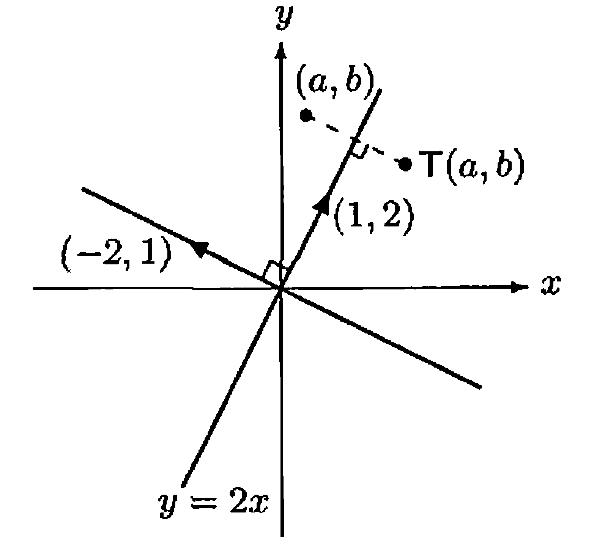

# § 12. The Change of Coordinate Matrix

## The Change of Coordinate Matrix

!!! theorem "Theorem 12.1 : Change of coordinate matrix is invertible."
    Let $\beta$ and $\beta^{\prime}$ be two ordered bases for a finite-dimensional vector space $V$, and let $Q=[I_{V}]_{\beta^{\prime}}^{\beta}$.
    Then

    - (a) $Q$ is invertible.
    - (b) For any $v \in V$, $[v]_{\beta}=Q[v]_{\beta^{\prime}}$.

    !!! proof
        - (a) Since $I_{V}$ is invertible, $Q$ is invertible by **Theorem 11.6**.
        - (b) For any $v \in V$,

            $$
            [v]_{\beta}=\left[I_{V}(v)\right]_{\beta}=[I_{V}]_{\beta^{\prime}}^{\beta}[v]_{\beta^{\prime}}=Q[v]_{\beta^{\prime}}
            $$

            by **Theorem 10.14**.

!!! definition "Definition 12.2 : Change of Coordinate Matrix"
    The matrix $Q=[I_{V}]_{\beta^{\prime}}^{\beta}$ defined in **Theorem 12.1** is called a **change of coordinate matrix**.
    Because of part (b) of the theorem, we say that $Q$ changes $\beta^{\prime}$-coordinates into $\beta$-coordinates.
    Observe that if $\beta=\left\{x_{1}, x_{2}, \ldots, x_{n}\right\}$ and $\beta^{\prime}=\left\{x_{1}^{\prime}, x_{2}^{\prime}, \ldots, x_{n}^{\prime}\right\}$, then

    $$
    x_{j}^{\prime}=\sum_{i=1}^{n} Q_{i j} x_{i}
    $$

    for $j=1,2, \ldots, n$; that is, the $j$th column of $Q$ is $\left[x_{j}^{\prime}\right]_{\beta}$.

!!! example "Example 12.3 : Computing a change of coordinate matrix"
    In $\mathbb{R}^{2}$, let $\beta=\{(1,1),(1,-1)\}$ and $\beta^{\prime}=\{(2,4),(3,1)\}$.
    Since

    $$
    (2,4)=3(1,1)-1(1,-1) \quad \text { and } \quad(3,1)=2(1,1)+1(1,-1),
    $$

    the matrix that changes $\beta^{\prime}$-coordinates into $\beta$-coordinates is

    $$
    Q=\left(\begin{array}{rr}
    3 & 2 \\
    -1 & 1
    \end{array}\right) .
    $$

    Thus, for instance,

    $$
    [(2,4)]_{\beta}=Q[(2,4)]_{\beta^{\prime}}=Q\binom{1}{0}=\binom{3}{-1} .
    $$

!!! theorem "Theorem 12.4 : Inverse of change of coordinate matrix changes coordinates back."
    Let $\beta$ and $\beta^{\prime}$ be ordered bases for a finite-dimensional vector space $V$.
    Let $Q$ be the change of coordinate matrix that changes $\beta^{\prime}$-coordinates into $\beta$-coordinates, that is, $[v]_{\beta}=Q[v]_{\beta^{\prime}}$ for all $v \in V$.
    Then $Q^{-1}$ changes $\beta$-coordinates into $\beta^{\prime}$-coordinates; that is, $[v]_{\beta^{\prime}}=Q^{-1}[v]_{\beta}$ for all $v \in V$.
    (See **Exercise 12.11**.)

    !!! proof
        Since $Q$ is invertible by **Theorem 12.1**, the matrix $Q^{-1}$ exists.
        Let $v \in V$.
        From $[v]_{\beta}=Q[v]_{\beta^{\prime}}$, multiplying both sides by $Q^{-1}$ yields $Q^{-1}[v]_{\beta}=[v]_{\beta^{\prime}}$.

## The Change of Basis Formula for a Linear Operator

!!! definition "Definition 12.5 : Linear Operator"
    Linear transformations that map a vector space $V$ into itself is called a **linear operator** on $V$.

!!! theorem "Theorem 12.6 : Change of basis formula for a linear operator"
    Let $T$ be a linear operator on a finite-dimensional vector space $V$, and let $\beta$ and $\beta^{\prime}$ be ordered bases for $V$.
    Suppose that $Q$ is the change of coordinate matrix that changes $\beta^{\prime}$-coordinates into $\beta$-coordinates.
    Then

    $$
    [T]_{\beta^{\prime}}=Q^{-1}[T]_{\beta} Q .
    $$

    !!! proof
        Let $I$ be the identity transformation on $V$.
        Then $T=IT=TI$; hence, by **Theorem 10.6**,

        $$
        Q[T]_{\beta^{\prime}}=[I]_{\beta^{\prime}}^{\beta}[T]_{\beta^{\prime}}=[IT]_{\beta^{\prime}}^{\beta}=[TI]_{\beta^{\prime}}^{\beta}=[T]_{\beta}[I]_{\beta^{\prime}}^{\beta}=[T]_{\beta} Q .
        $$

        Therefore $[T]_{\beta^{\prime}}=Q^{-1}[T]_{\beta} Q$.

**Theorem 12.6** can be generalized to allow $T: V \rightarrow W$, where $V$ is distinct from $W$.
In this case, we can change bases in $V$ as well as in $W$ (see **Exercise 12.8**).

!!! example "Example 12.7 : Computing the change of basis formula for a linear operator"
    Let $T$ be the linear operator on $\mathbb{R}^{2}$ defined by

    $$
    T\binom{a}{b}=\binom{3 a-b}{a+3 b}
    $$

    and let $\beta$ and $\beta^{\prime}$ be the ordered bases in **Example 12.3**.
    The reader should verify that

    $$
    [T]_{\beta}=\left(\begin{array}{rr}
    3 & 1 \\
    -1 & 3
    \end{array}\right) .
    $$

    In **Example 12.3**, we saw that the change of coordinate matrix that changes $\beta^{\prime}$-coordinates into $\beta$-coordinates is

    $$
    Q=\left(\begin{array}{rr}
    3 & 2 \\
    -1 & 1
    \end{array}\right),
    $$

    and it is easily verified that

    $$
    Q^{-1}=\frac{1}{5}\left(\begin{array}{rr}
    1 & -2 \\
    1 & 3
    \end{array}\right) .
    $$

    Hence, by **Theorem 12.6**,

    $$
    [T]_{\beta^{\prime}}=Q^{-1}[T]_{\beta} Q=\left(\begin{array}{rr}
    4 & 1 \\
    -2 & 2
    \end{array}\right) .
    $$

    To show that this is the correct matrix, we can verify that the image under $T$ of each vector of $\beta^{\prime}$ is the linear combination of the vectors of $\beta^{\prime}$ with the entries of the corresponding column as its coefficients.
    For example, the image of the second vector in $\beta^{\prime}$ is

    $$
    T\binom{3}{1}=\binom{8}{6}=1\binom{2}{4}+2\binom{3}{1} .
    $$

    Notice that the coefficients of the linear combination are the entries of the second column of $[T]_{\beta^{\prime}}$.

!!! example "Example 12.8 : Using a change of basis to compute $T(a,b)$"
    {: .center style="width:50%;"}
    /// caption
    Figure 12.1.
    ///

    Recall the reflection about the $x$-axis in **Example 8.4**.
    The rule $(x, y) \rightarrow(x,-y)$ is easy to obtain.
    We now derive the less obvious rule for the reflection $T$ about the line $y=2 x$.
    We wish to find an expression for $T(a, b)$ for any $(a, b)$ in $\mathbb{R}^{2}$.
    Since $T$ is linear, it is completely determined by its values on a basis for $\mathbb{R}^{2}$.
    Clearly, $T(1,2)=(1,2)$ and $T(-2,1)=-(-2,1)=(2,-1)$.
    Therefore if we let

    $$
    \beta^{\prime}=\left\{\binom{1}{2},\binom{-2}{1}\right\},
    $$

    then $\beta^{\prime}$ is an ordered basis for $\mathbb{R}^{2}$ and

    $$
    [T]_{\beta^{\prime}}=\left(\begin{array}{rr}
    1 & 0 \\
    0 & -1
    \end{array}\right) .
    $$

    Let $\beta$ be the standard ordered basis for $\mathbb{R}^{2}$, and let $Q$ be the matrix that changes $\beta^{\prime}$-coordinates into $\beta$-coordinates.
    Then

    $$
    Q=\left(\begin{array}{rr}
    1 & -2 \\
    2 & 1
    \end{array}\right)
    $$

    and $[T]_{\beta^{\prime}}=Q^{-1}[T]_{\beta} Q$.
    We can solve this equation for $[T]_{\beta}$ to obtain that $[T]_{\beta}=Q[T]_{\beta^{\prime}} Q^{-1}$.
    Because

    $$
    Q^{-1}=\frac{1}{5}\left(\begin{array}{rr}
    1 & 2 \\
    -2 & 1
    \end{array}\right),
    $$

    the reader can verify that

    $$
    [T]_{\beta}=\frac{1}{5}\left(\begin{array}{rr}
    -3 & 4 \\
    4 & 3
    \end{array}\right) .
    $$

    Since $\beta$ is the standard ordered basis, it follows that $T$ is left-multiplication by $[T]_{\beta}$.
    Thus for any $(a, b)$ in $\mathbb{R}^{2}$, we have

    $$
    T\binom{a}{b}=\frac{1}{5}\left(\begin{array}{rr}
    -3 & 4 \\
    4 & 3
    \end{array}\right)\binom{a}{b}=\frac{1}{5}\binom{-3 a+4 b}{4 a+3 b} .
    $$

!!! corollary "Corollary 12.9 : Matrix representation of $L_A$ in an arbitrary basis"
    Let $A \in \mathrm{M}_{n \times n}(F)$, and let $\gamma$ be an ordered basis for $F^{n}$.
    Then $[L_{A}]_{\gamma}=Q^{-1} A Q$, where $Q$ is the $n \times n$ matrix whose $j$th column is the $j$th vector of $\gamma$.

!!! example "Example 12.10 : Computing $[L_A]_{\gamma}$"
    Let

    $$
    A=\left(\begin{array}{rrr}
    2 & 1 & 0 \\
    1 & 1 & 3 \\
    0 & -1 & 0
    \end{array}\right)
    $$

    and let

    $$
    \gamma=\left\{\left(\begin{array}{r}
    -1 \\
    0 \\
    0
    \end{array}\right),\left(\begin{array}{l}
    2 \\
    1 \\
    0
    \end{array}\right),\left(\begin{array}{l}
    1 \\
    1 \\
    1
    \end{array}\right)\right\}
    $$

    which is an ordered basis for $\mathbb{R}^{3}$.
    Let $Q$ be the $3 \times 3$ matrix whose $j$th column is the $j$th vector of $\gamma$.
    Then

    $$
    Q=\left(\begin{array}{rrr}
    -1 & 2 & 1 \\
    0 & 1 & 1 \\
    0 & 0 & 1
    \end{array}\right) \quad \text { and } \quad Q^{-1}=\left(\begin{array}{rrr}
    -1 & 2 & -1 \\
    0 & 1 & -1 \\
    0 & 0 & 1
    \end{array}\right)
    $$

    So by the preceding corollary,

    $$
    [L_{A}]_{\gamma}=Q^{-1} A Q=\left(\begin{array}{rrr}
    0 & 2 & 8 \\
    -1 & 4 & 6 \\
    0 & -1 & -1
    \end{array}\right) .
    $$

## Similarity

!!! definition "Definition 12.11 : Similarity"
    Let $A$ and $B$ be matrices in $\mathrm{M}_{n \times n}(F)$.
    We say that $B$ is similar to $A$ if there exists an invertible matrix $Q$ such that $B=Q^{-1} A Q$.

!!! theorem "Theorem 12.12 : Similarity is an equivalence relation."
    The relation of similarity is an equivalence relation on $\mathrm{M}_{n \times n}(F)$.

    !!! proof
        - Reflexive.  
            For any $A \in \mathrm{M}_{n \times n}(F)$, we have $A=I_{n}^{-1} A I_{n}$, so $A$ is similar to $A$.

        - Symmetric.  
            Suppose that $B$ is similar to $A$.
            Then $B=Q^{-1} A Q$ for some invertible $Q$.
            Multiplying on the left by $Q$ and on the right by $Q^{-1}$ gives $A=Q B Q^{-1}$, hence $A$ is similar to $B$.

        - Transitive.  
            Suppose that $B$ is similar to $A$ and that $C$ is similar to $B$.
            Then $B=Q^{-1} A Q$ and $C=P^{-1} B P$ for some invertible matrices $P$ and $Q$.
            Thus

            $$
            C=P^{-1} Q^{-1} A(Q P).
            $$

            Since $(QP)(P^{-1}Q^{-1})=I_{n}$ and $(P^{-1}Q^{-1})(QP)=I_{n}$, the matrix $QP$ is invertible with inverse $P^{-1}Q^{-1}$.
            Hence $C=(Q P)^{-1} A(Q P)$, so $C$ is similar to $A$.

    So we need only say that $A$ and $B$ are similar.

!!! corollary "Corollary 12.13 : Matrix representations of a linear operator are similar."
    Let $T$ be a linear operator on a finite-dimensional vector space $V$, and let $\beta$ and $\beta^{\prime}$ be any ordered bases for $V$.
    Then $[T]_{\beta^{\prime}}$ is similar to $[T]_{\beta}$.

    !!! proof
        By **Theorem 12.6**, $[T]_{\beta^{\prime}}=Q^{-1}[T]_{\beta} Q$ for the change of coordinate matrix $Q$.
        By **Definition 12.11**, this means $[T]_{\beta^{\prime}}$ is similar to $[T]_{\beta}$.

## Exercise

!!! exercise "Exercise 12.8"
    Prove the following generalization of **Theorem 12.6**.
    Let $T: V \rightarrow W$ be a linear transformation from a finite-dimensional vector space $V$ to a finite-dimensional vector space $W$.
    Let $\beta$ and $\beta^{\prime}$ be ordered bases for $V$, and let $\gamma$ and $\gamma^{\prime}$ be ordered bases for $W$.
    Then $[T]_{\beta^{\prime}}^{\gamma^{\prime}}=P^{-1}[T]_{\beta}^{\gamma} Q$, where $Q$ is the matrix that changes $\beta^{\prime}$-coordinates into $\beta$-coordinates and $P$ is the matrix that changes $\gamma^{\prime}$-coordinates into $\gamma$-coordinates.

!!! exercise "Exercise 12.10"
    Prove that if $A$ and $B$ are similar $n \times n$ matrices, then $\operatorname{tr}(A)=\operatorname{tr}(B)$.
    
    Hint: Use **Exercise 10.13**.

!!! exercise "Exercise 12.11"
    Let $V$ be a finite-dimensional vector space with ordered bases $\alpha, \beta$, and $\gamma$.

    - (a) Prove that if $Q$ and $R$ are the change of coordinate matrices that change $\alpha$-coordinates into $\beta$-coordinates and $\beta$-coordinates into $\gamma$-coordinates, respectively, then $RQ$ is the change of coordinate matrix that changes $\alpha$-coordinates into $\gamma$-coordinates.
    - (b) Prove that if $Q$ changes $\alpha$-coordinates into $\beta$-coordinates, then $Q^{-1}$ changes $\beta$-coordinates into $\alpha$-coordinates.

!!! exercise "Exercise 12.13"
    Let $V$ be a finite-dimensional vector space over a field $F$, and let $\beta=\left\{x_{1}, x_{2}, \ldots, x_{n}\right\}$ be an ordered basis for $V$.
    Let $Q$ be an $n \times n$ invertible matrix with entries from $F$.
    Define

    $$
    x_{j}^{\prime}=\sum_{i=1}^{n} Q_{i j} x_{i} \quad \text { for } 1 \leq j \leq n
    $$

    and set $\beta^{\prime}=\left\{x_{1}^{\prime}, x_{2}^{\prime}, \ldots, x_{n}^{\prime}\right\}$.
    Prove that $\beta^{\prime}$ is a basis for $V$ and hence that $Q$ is the change of coordinate matrix changing $\beta^{\prime}$-coordinates into $\beta$-coordinates.

!!! exercise "Exercise 12.14"
    Prove the converse of **Exercise 12.8**:
    If $A$ and $B$ are each $m \times n$ matrices with entries from a field $F$, and if there exist invertible $m \times m$ and $n \times n$ matrices $P$ and $Q$, respectively, such that $B=P^{-1} A Q$, then there exist an $n$-dimensional vector space $V$ and an $m$-dimensional vector space $W$ (both over $F$), ordered bases $\beta$ and $\beta^{\prime}$ for $V$ and $\gamma$ and $\gamma^{\prime}$ for $W$, and a linear transformation $T: V \rightarrow W$ such that

    $$
    A=[T]_{\beta}^{\gamma} \quad \text { and } \quad B=[T]_{\beta^{\prime}}^{\gamma^{\prime}} .
    $$

    Hints:
    Let $V=F^{n}$, $W=F^{m}$, $T=L_{A}$, and $\beta$ and $\gamma$ be the standard ordered bases for $F^{n}$ and $F^{m}$, respectively.
    Now apply the results of **Exercise 12.13** to obtain ordered bases $\beta^{\prime}$ and $\gamma^{\prime}$ from $\beta$ and $\gamma$ via $Q$ and $P$, respectively.
