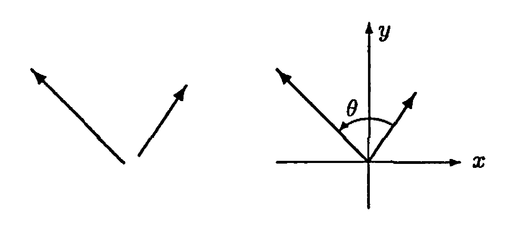
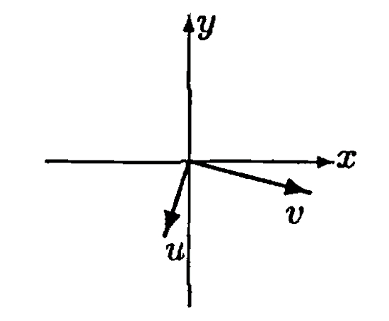
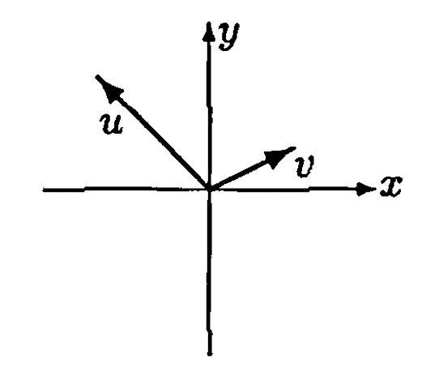
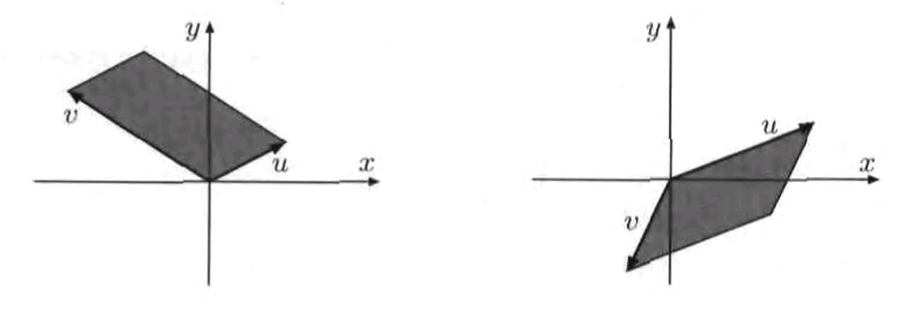
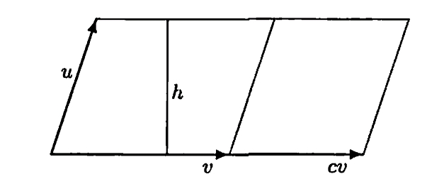
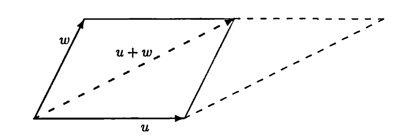

# § 19. Determinants of Order 2

## Definition and Properties of Determinants of Order 2 

!!! definition "Definition 19.1 : Determinant of a $2 \times 2$ Matrix"
    If

    $$
    A=\left(\begin{array}{ll}
    a & b \\
    c & d
    \end{array}\right)
    $$

    is a $2 \times 2$ matrix with entries from a field $F$, then we define the **determinant** of $A$, denoted $\operatorname{det}(A)$ or $|A|$, to be the scalar $a d-b c$.

!!! theorem "Theorem 19.2 : Linearity of determinant in each row"
    The function $\operatorname{det}: \mathrm{M}_{2 \times 2}(F) \rightarrow F$ is a linear function of each row of a $2 \times 2$ matrix when the other row is held fixed.
    That is, if $u$, $v$, and $w$ are in $F^{2}$ and $k$ is a scalar, then

    $$
    \operatorname{det}\binom{u+k v}{w}=\operatorname{det}\binom{u}{w}+k \operatorname{det}\binom{v}{w}
    $$

    and

    $$
    \operatorname{det}\binom{w}{u+k v}=\operatorname{det}\binom{w}{u}+k \operatorname{det}\binom{w}{v} .
    $$

    !!! proof
        Let $u=\left(a_{1}, a_{2}\right), v=\left(b_{1}, b_{2}\right)$, and $w=\left(c_{1}, c_{2}\right)$ be in $F^{2}$ and $k$ be a scalar.
        Then

        $$
        \operatorname{det}\binom{u}{w}+k \operatorname{det}\binom{v}{w}=\operatorname{det}\left(\begin{array}{ll}
        a_{1} & a_{2} \\
        c_{1} & c_{2}
        \end{array}\right)+k \operatorname{det}\left(\begin{array}{ll}
        b_{1} & b_{2} \\
        c_{1} & c_{2}
        \end{array}\right)
        $$

        $$
        \begin{aligned}
        & =\left(a_{1} c_{2}-a_{2} c_{1}\right)+k\left(b_{1} c_{2}-b_{2} c_{1}\right) \\
        & =\left(a_{1}+k b_{1}\right) c_{2}-\left(a_{2}+k b_{2}\right) c_{1} \\
        & =\operatorname{det}\left(\begin{array}{cc}
        a_{1}+k b_{1} & a_{2}+k b_{2} \\
        c_{1} & c_{2}
        \end{array}\right) \\
        & =\operatorname{det}\binom{u+k v}{w} .
        \end{aligned}
        $$

        A similar calculation shows that

        $$
        \operatorname{det}\binom{w}{u}+k \operatorname{det}\binom{w}{v}=\operatorname{det}\binom{w}{u+k v} .
        $$

!!! theorem "Theorem 19.3 : Invertibility and the determinant"
    Let $A \in \mathrm{M}_{2 \times 2}(F)$.
    Then the determinant of $A$ is nonzero if and only if $A$ is invertible.
    Moreover, if $A$ is invertible, then

    $$
    A^{-1}=\frac{1}{\operatorname{det}(A)}\left(\begin{array}{rr}
    A_{22} & -A_{12} \\
    -A_{21} & A_{11}
    \end{array}\right) .
    $$

    !!! proof
        If $\operatorname{det}(A) \neq 0$, then we can define a matrix

        $$
        M=\frac{1}{\operatorname{det}(A)}\left(\begin{array}{rr}
        A_{22} & -A_{12} \\
        -A_{21} & A_{11}
        \end{array}\right) .
        $$

        A straightforward calculation shows that $A M=M A=I$, and so $A$ is invertible and $M=A^{-1}$.

        Conversely, suppose that $A$ is invertible.
        **Theorem 16.2** shows that the rank of

        $$
        A=\left(\begin{array}{ll}
        A_{11} & A_{12} \\
        A_{21} & A_{22}
        \end{array}\right)
        $$

        must be 2.
        Hence $A_{11} \neq 0$ or $A_{21} \neq 0$.
        If $A_{11} \neq 0$, add $-A_{21} / A_{11}$ times row 1 of $A$ to row 2 to obtain the matrix

        $$
        \left(\begin{array}{cc}
        A_{11} & A_{12} \\
        0 & A_{22}-\frac{A_{12} A_{21}}{A_{11}}
        \end{array}\right)
        $$

        Because elementary row operations are rank-preserving by **Corollary 16.5**, it follows that

        $$
        A_{22}-\frac{A_{12} A_{21}}{A_{11}} \neq 0
        $$

        Therefore $\operatorname{det}(A)=A_{11} A_{22}-A_{12} A_{21} \neq 0$.
        On the other hand, if $A_{21} \neq 0$, we see that $\operatorname{det}(A) \neq 0$ by adding $-A_{11} / A_{21}$ times row 2 of $A$ to row 1 and applying a similar argument.
        Thus, in either case, $\operatorname{det}(A) \neq 0$.

!!! theorem "Theorem 19.4 : Characterization of the $2 \times 2$ determinant"
    Let $\delta: \mathrm{M}_{2 \times 2}(F) \rightarrow F$ be a function with the following three properties.

    - (a) $\delta$ is a linear function of each row of the matrix when the other row is held fixed.
    - (b) If the two rows of $A \in \mathrm{M}_{2 \times 2}(F)$ are identical, then $\delta(A)=0$.
    - (c) If $I$ is the $2 \times 2$ identity matrix, then $\delta(I)=1$.

    Prove that $\delta(A)=\operatorname{det}(A)$ for all $A \in \mathrm{M}_{2 \times 2}(F)$.

    !!! proof
        Let

        $$
        A=\left(\begin{array}{cc}
        a & b \\
        c & d
        \end{array}\right) .
        $$

        Write the first row as $a(1,0)+b(0,1)$ and the second row as $c(1,0)+d(0,1)$.
        Using (a) twice, $\delta$ is linear in each row, so

        $$
        \delta(A)=ac\,\delta\!\left(\begin{array}{cc}
        1 & 0 \\
        1 & 0
        \end{array}\right)
        +ad\,\delta\!\left(\begin{array}{cc}
        1 & 0 \\
        0 & 1
        \end{array}\right)
        +bc\,\delta\!\left(\begin{array}{cc}
        0 & 1 \\
        1 & 0
        \end{array}\right)
        +bd\,\delta\!\left(\begin{array}{cc}
        0 & 1 \\
        0 & 1
        \end{array}\right) .
        $$

        By (b), the first and last terms are zero (the two rows are identical), so

        $$
        \delta(A)=ad\,\delta\!\left(\begin{array}{cc}
        1 & 0 \\
        0 & 1
        \end{array}\right)
        +bc\,\delta\!\left(\begin{array}{cc}
        0 & 1 \\
        1 & 0
        \end{array}\right) .
        $$

        By (c),

        $$
        \delta\!\left(\begin{array}{cc}
        1 & 0 \\
        0 & 1
        \end{array}\right)=\delta(I)=1 .
        $$

        To compute $\delta\!\left(\begin{array}{cc}
        0 & 1 \\
        1 & 0
        \end{array}\right)$, apply (b) to the matrix whose two rows are both $(1,1)$:

        $$
        0=\delta\!\left(\begin{array}{cc}
        1 & 1 \\
        1 & 1
        \end{array}\right) .
        $$

        Using (a) to expand in the first row and then the second row gives

        $$
        \delta\!\left(\begin{array}{cc}
        1 & 1 \\
        1 & 1
        \end{array}\right)
        =\delta\!\left(\begin{array}{cc}
        1 & 0 \\
        0 & 1
        \end{array}\right)
        +\delta\!\left(\begin{array}{cc}
        0 & 1 \\
        1 & 0
        \end{array}\right)
        $$

        because the two remaining terms have identical rows and vanish by (b).
        Hence

        $$
        0=1+\delta\!\left(\begin{array}{cc}
        0 & 1 \\
        1 & 0
        \end{array}\right),
        $$

        so

        $$
        \delta\!\left(\begin{array}{cc}
        0 & 1 \\
        1 & 0
        \end{array}\right)=-1 .
        $$

        Substituting back, we obtain

        $$
        \delta(A)=ad(1)+bc(-1)=ad-bc=\operatorname{det}(A) .
        $$

**Theorem 19.2**, **Theorem 19.3**, and **Theorem 19.4** will be generalized to determinants of order $n$ in section 22.

## The Area of a Parallelogram

!!! definition "Definition 19.5 : Angle Between Two Vectors"
    By the **angle** between two vectors in $\mathbb{R}^{2}$, we mean the angle with measure $\theta(0 \leq \theta<\pi)$ that is formed by the vectors having the same magnitude and direction as the given vectors but emanating from the origin.
    (See Figure 19.1.)

    {: .center style="width:70%;"}
    ///caption
    Figure 19.1: Angle between two vectors in $\mathbb{R}^{2}$.
    ///

!!! definition "Definition 19.6 : Orientation of an Ordered Basis"
    If $\beta=\{u, v\}$ is an ordered basis for $\mathbb{R}^{2}$, we define the **orientation** of $\beta$ to be the real number

    $$
    \mathrm{O}\binom{u}{v}=\frac{\operatorname{det}\binom{u}{v}}{\left|\operatorname{det}\binom{u}{v}\right|}
    $$

    (The denominator of this fraction is nonzero by **Theorem 19.3**.)
    Clearly

    $$
    \mathrm{O}\binom{u}{v}= \pm 1
    $$

    For convenience, we also define

    $$
    \mathrm{O}\binom{u}{v}=1
    $$

    if $\{u, v\}$ is linearly dependent.

!!! definition "Definition 19.7 : Right-Handed and Left-Handed Coordinate Systems"
    Recall that a coordinate system $\{u, v\}$ is called **right-handed** if $u$ can be rotated in a counterclockwise direction through an angle $\theta(0<\theta<\pi)$ to coincide with $v$.
    Otherwise $\{u, v\}$ is called a **left-handed** system.

    {: .center style="width:40%;"}
    ///caption
    Figure 19.2: A right-handed coordinate system.
    ///

    {: .center style="width:40%;"}
    ///caption
    Figure 19.3: A left-handed coordinate system.
    ///

!!! theorem "Theorem 19.8 : Orientation and right-handed coordinate systems"
    In general,

    $$
    \mathrm{O}\binom{u}{v}=1
    $$

    if and only if the ordered basis $\{u, v\}$ forms a right-handed coordinate system.

!!! definition "Definition 19.9 : Parallelogram Determined by Two Vectors"
    Any ordered set $\{u, v\}$ in $\mathbb{R}^{2}$ determines a parallelogram in the following manner.
    Regarding $u$ and $v$ as arrows emanating from the origin of $\mathbb{R}^{2}$, we call the parallelogram having $u$ and $v$ as adjacent sides the parallelogram determined by $u$ and $v$.

    {: .center style="width:90%;"}
    ///caption
    Figure 19.4.
    ///

    Observe that if the set $\{u, v\}$ is linearly dependent (i.e., if $u$ and $v$ are parallel), then the "parallelogram" determined by $u$ and $v$ is actually a line segment, which we consider to be a degenerate parallelogram having area zero.

    We denote

    $$
    \mathrm{A}\binom{u}{v},
    $$

    the area of the parallelogram determined by $u$ and $v$.

!!! theorem "Theorem 19.10 : Area of a parallelogram"
    $$
    \mathrm{A}\binom{u}{v}=\mathrm{O}\binom{u}{v} \cdot \operatorname{det}\binom{u}{v},
    $$

    from which it follows that

    $$
    \mathrm{A}\binom{u}{v}=\left|\operatorname{det}\binom{u}{v}\right| .
    $$

    !!! proof
        Our argument that

        $$
        \mathrm{A}\binom{u}{v}=\mathrm{O}\binom{u}{v} \cdot \operatorname{det}\binom{u}{v}
        $$

        employs a technique that, although somewhat indirect, can be generalized to $\mathbb{R}^{n}$.
        First, since

        $$
        \mathrm{O}\binom{u}{v}= \pm 1
        $$

        we may multiply both sides of the desired equation by

        $$
        \mathrm{O}\binom{u}{v}
        $$

        to obtain the equivalent form

        $$
        \mathrm{O}\binom{u}{v} \cdot \mathrm{~A}\binom{u}{v}=\operatorname{det}\binom{u}{v} .
        $$

        We establish this equation by verifying that the three conditions of **Theorem 19.4** are satisfied by the function

        $$
        \delta\binom{u}{v}=\mathrm{O}\binom{u}{v} \cdot \mathrm{~A}\binom{u}{v}
        $$

        - (a) We begin by showing that for any real number $c$

            $$
            \delta\binom{u}{c v}=c \cdot \delta\binom{u}{v} .
            $$

            Observe that this equation is valid if $c=0$ because

            $$
            \delta\binom{u}{c v}=\mathrm{O}\binom{u}{0} \cdot \mathrm{~A}\binom{u}{0}=1 \cdot 0=0
            $$

            So assume that $c \neq 0$.
            Regarding $c v$ as the base of the parallelogram determined by $u$ and $c v$, we see that

            $$
            \mathrm{A}\binom{u}{c v}=\text { base } \times \text { altitude }=|c|(\text { length of } v)(\text { altitude })=|c| \cdot \mathrm{A}\binom{u}{v}
            $$

            since the altitude $h$ of the parallelogram determined by $u$ and $c v$ is the same as that in the parallelogram determined by $u$ and $v$.
            (see Figure 19.5)

            {: .center style="width:80%;"}
            ///caption
            Figure 19.5.
            ///

            Hence

            $$
            \begin{aligned}
            \delta\binom{u}{c v} & =\mathrm{O}\binom{u}{c v} \cdot \mathrm{~A}\binom{u}{c v}=\left[\frac{c}{|c|} \cdot \mathrm{O}\binom{u}{v}\right]\left[|c| \cdot \mathrm{A}\binom{u}{v}\right] \\
            & =c \cdot \mathrm{O}\binom{u}{v} \cdot \mathrm{~A}\binom{u}{v}=c \cdot \delta\binom{u}{v}
            \end{aligned}
            $$

            A similar argument shows that

            $$
            \delta\binom{c u}{v}=c \cdot \delta\binom{u}{v} .
            $$

        - (b) We next prove that

            $$
            \delta\binom{u}{a u+b w}=b \cdot \delta\binom{u}{w}
            $$

            for any $u, w \in \mathbb{R}^{2}$ and any real numbers $a$ and $b$.
            Because the parallelograms determined by $u$ and $w$ and by $u$ and $u+w$ have a common base $u$ and the same altitude (see Figure 19.6),

            {: .center style="width:80%;"}
            ///caption
            Figure 19.6.
            ///

            it follows that

            $$
            \mathrm{A}\binom{u}{w}=\mathrm{A}\binom{u}{u+w} .
            $$

            If $a=0$, then

            $$
            \delta\binom{u}{a u+b w}=\delta\binom{u}{b w}=b \cdot \delta\binom{u}{w}
            $$

            by the first paragraph of (a).
            Otherwise, if $a \neq 0$, then

            $$
            \delta\binom{u}{a u+b w}=a \cdot \delta\binom{u}{u+\frac{b}{a} w}=a \cdot \delta\binom{u}{\frac{b}{a} w}=b \cdot \delta\binom{u}{w} .
            $$

            So the desired conclusion is obtained in either case.
            We are now able to show that

            $$
            \delta\binom{u}{v_{1}+v_{2}}=\delta\binom{u}{v_{1}}+\delta\binom{u}{v_{2}}
            $$

            for all $u, v_{1}, v_{2} \in \mathbb{R}^{2}$.
            Since the result is immediate if $u=0$, we assume that $u \neq 0$.
            Choose any vector $w \in \mathbb{R}^{2}$ such that $\{u, w\}$ is linearly independent.
            Then for any vectors $v_{1}, v_{2} \in \mathbb{R}^{2}$ there exist scalars $a_{i}$ and $b_{i}$ such that $v_{i}=a_{i} u+b_{i} w(i=1,2)$.
            Thus

            $$
            \delta\binom{u}{v_{1}+v_{2}}=\delta\binom{u}{\left(a_{1}+a_{2}\right) u+\left(b_{1}+b_{2}\right) w}=\left(b_{1}+b_{2}\right) \delta\binom{u}{w}
            $$

            $$
            =\delta\binom{u}{a_{1} u+b_{1} w}+\delta\binom{u}{a_{2} u+b_{2} w}=\delta\binom{u}{v_{1}}+\delta\binom{u}{v_{2}} .
            $$

            A similar argument shows that

            $$
            \delta\binom{u_{1}+u_{2}}{v}=\delta\binom{u_{1}}{v}+\delta\binom{u_{2}}{v}
            $$

            for all $u_{1}, u_{2}, v \in \mathbb{R}^{2}$.

        - (c) Since

            $$
            \mathrm{A}\binom{u}{u}=0, \quad \text { it follows that } \quad \delta\binom{u}{u}=\mathrm{O}\binom{u}{u} \cdot \mathrm{~A}\binom{u}{u}=0
            $$

            for any $u \in \mathbb{R}^{2}$.
            Because the parallelogram determined by $e_{1}$ and $e_{2}$ is the unit square,

            $$
            \delta\binom{e_{1}}{e_{2}}=\mathrm{O}\binom{e_{1}}{e_{2}} \cdot \mathrm{~A}\binom{e_{1}}{e_{2}}=1 \cdot 1=1
            $$

        Therefore $\delta$ satisfies the three conditions of **Theorem 19.4**, and hence $\delta=$ det.
        So the area of the parallelogram determined by $u$ and $v$ equals

        $$
        \mathrm{O}\binom{u}{v} \cdot \operatorname{det}\binom{u}{v}
        $$

!!! example "Example 19.11 : Area of a parallelogram"
    The area of the parallelogram determined by $u=(-1,5)$ and $v=(4,-2)$ is

    $$
    \left|\operatorname{det}\binom{u}{v}\right|=\left|\operatorname{det}\left(\begin{array}{rr}
    -1 & 5 \\
    4 & -2
    \end{array}\right)\right|=18
    $$

## Exercise

!!! exercise "Exercise 19.10"
    The **classical adjoint** of a $2 \times 2$ matrix $A \in \mathrm{M}_{2 \times 2}(F)$ is the matrix

    $$
    C=\left(\begin{array}{rr}
    A_{22} & -A_{12} \\
    -A_{21} & A_{11}
    \end{array}\right)
    $$

    Prove that

    - (a) $C A=A C=[\operatorname{det}(A)] I$.
    - (b) $\operatorname{det}(C)=\operatorname{det}(A)$.
    - (c) The classical adjoint of $A^{t}$ is $C^{t}$.
    - (d) If $A$ is invertible, then $A^{-1}=[\operatorname{det}(A)]^{-1} C$.
