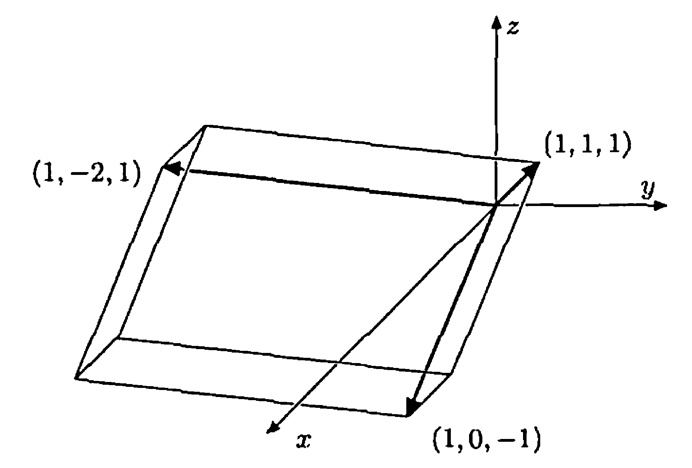

# § 21. Properties of Determinants

## Properties of Determinants

!!! theorem "Theorem 21.1 : Determinants of elementary matrices"
    Because the determinant of the $n \times n$ identity matrix is $1$ (see **Example 20.3**), we can interpret **Concept 20.12** as the following facts about the determinants of elementary matrices.

    - (a) If $E$ is an elementary matrix obtained by interchanging any two rows of $I$, then $\operatorname{det}(E)=-1$.
    - (b) If $E$ is an elementary matrix obtained by multiplying some row of $I$ by the nonzero scalar $k$, then $\operatorname{det}(E)=k$.
    - (c) If $E$ is an elementary matrix obtained by adding a multiple of some row of $I$ to another row, then $\operatorname{det}(E)=1$.

!!! theorem "Theorem 21.2 : Multiplicativity of the determinant"
    For any $A, B \in \mathrm{M}_{n \times n}(F)$, $\operatorname{det}(A B)=\operatorname{det}(A) \cdot \operatorname{det}(B)$.

    !!! proof
        We begin by establishing the result when $A$ is an elementary matrix.
        If $A$ is an elementary matrix obtained by interchanging two rows of $I$, then $\operatorname{det}(A)=-1$.
        But by **Theorem 15.3**, $A B$ is a matrix obtained by interchanging two rows of $B$.
        Hence by **Theorem 20.12**, $\operatorname{det}(A B)=-\operatorname{det}(B)=\operatorname{det}(A) \cdot \operatorname{det}(B)$.
        Similarly, if $A$ is an elementary matrix obtained by multiplying a row of $I$ by a nonzero scalar $k$, then $\operatorname{det}(A)=k$, so $\operatorname{det}(A B)=k \operatorname{det}(B)=\operatorname{det}(A) \cdot \operatorname{det}(B)$.
        Similarly, if $A$ is an elementary matrix obtained by adding a multiple of one row of $A$ to another row of $A$, then $\operatorname{det}(A)=1$, so $\operatorname{det}(A B)=\operatorname{det}(B)=\operatorname{det}(A) \cdot \operatorname{det}(B)$.

        If $A$ is an $n \times n$ matrix with rank less than $n$, then $\operatorname{det}(A)=0$ by **Corollary 20.11**
        Since $\operatorname{rank}(A B) \leq \operatorname{rank}(A)<n$ by **Theorem 16.12**, we have $\operatorname{det}(A B)=0$.
        Thus $\operatorname{det}(A B)=\operatorname{det}(A) \cdot \operatorname{det}(B)$ in this case.

        On the other hand, if $A$ has rank $n$, then $A$ is invertible and hence is the product of elementary matrices (**Corollary 16.11**), say, $A=E_{m} \cdots E_{2} E_{1}$.
        The first paragraph of this proof shows that

        $$
        \begin{aligned}
        \operatorname{det}(A B) & =\operatorname{det}\left(E_{m} \cdots E_{2} E_{1} B\right) \\
        & =\operatorname{det}\left(E_{m}\right) \cdot \operatorname{det}\left(E_{m-1} \cdots E_{2} E_{1} B\right) \\
        & \quad \quad \vdots \\
        & =\operatorname{det}\left(E_{m}\right) \cdot \cdots \operatorname{det}\left(E_{2}\right) \cdot \operatorname{det}\left(E_{1}\right) \cdot \operatorname{det}(B) \\
        & =\operatorname{det}\left(E_{m} \cdots E_{2} E_{1}\right) \cdot \operatorname{det}(B) \\
        & =\operatorname{det}(A) \cdot \operatorname{det}(B)
        \end{aligned}
        $$

!!! corollary "Corollary 21.3 : Invertibility and the determinant"
    A matrix $A \in \mathrm{M}_{n \times n}(F)$ is invertible if and only if $\operatorname{det}(A) \neq 0$.
    Furthermore, if $A$ is invertible, then $\operatorname{det}\left(A^{-1}\right)=\frac{1}{\operatorname{det}(A)}$.

    !!! proof
        If $A \in \mathrm{M}_{n \times n}(F)$ is not invertible, then the rank of $A$ is less than $n$.
        So $\operatorname{det}(A)=0$ by **Corollary 20.11**.
        On the other hand, if $A \in \mathrm{M}_{n \times n}(F)$ is invertible, then

        $$
        \operatorname{det}(A) \cdot \operatorname{det}\left(A^{-1}\right)=\operatorname{det}\left(A A^{-1}\right)=\operatorname{det}(I)=1
        $$

        by **Theorem 21.2**.
        Hence $\operatorname{det}(A) \neq 0$ and $\operatorname{det}\left(A^{-1}\right)=\frac{1}{\operatorname{det}(A)}$.

!!! theorem "Theorem 21.4 : Determinant of a transpose"
    For any $A \in \mathrm{M}_{n \times n}(F)$, $\operatorname{det}\left(A^{t}\right)=\operatorname{det}(A)$.

    !!! proof
        If $A$ is not invertible, then $\operatorname{rank}(A)<n$.
        But $\operatorname{rank}\left(A^{t}\right)=\operatorname{rank}(A)$ by **Corollary 16.10**, and so $A^{t}$ is not invertible.
        Thus $\operatorname{det}\left(A^{t}\right)=0=\operatorname{det}(A)$ in this case.

        On the other hand, if $A$ is invertible, then $A$ is a product of elementary matrices, say $A=E_{m} \cdots E_{2} E_{1}$.
        Since $\operatorname{det}\left(E_{i}\right)=\operatorname{det}\left(E_{i}^{t}\right)$ for every $i$ by **Exercise 20.29**, by **Theorem 21.2** we have

        $$
        \begin{aligned}
        \operatorname{det}\left(A^{t}\right) & =\operatorname{det}\left(E_{1}^{t} E_{2}^{t} \cdots E_{m}^{t}\right) \\
        & =\operatorname{det}\left(E_{1}^{t}\right) \cdot \operatorname{det}\left(E_{2}^{t}\right) \cdots \operatorname{det}\left(E_{m}^{t}\right) \\
        & =\operatorname{det}\left(E_{1}\right) \cdot \operatorname{det}\left(E_{2}\right) \cdots \cdot \operatorname{det}\left(E_{m}\right) \\
        & =\operatorname{det}\left(E_{m}\right) \cdots \operatorname{det}\left(E_{2}\right) \cdot \operatorname{det}\left(E_{1}\right) \\
        & =\operatorname{det}\left(E_{m} \cdots E_{2} E_{1}\right) \\
        & =\operatorname{det}(A) .
        \end{aligned}
        $$

        Thus, in either case, $\operatorname{det}\left(A^{t}\right)=\operatorname{det}(A)$.

Among the many consequences of **Theorem 21.4** are that determinants can be evaluated by cofactor expansion along a column, and that elementary column operations can be used as well as elementary row operations in evaluating a determinant.
(The effect on the determinant of performing an elementary column operation is the same as the effect of performing the corresponding elementary row operation.)

## Cramer's Rule

!!! theorem "Theorem 21.5 : Cramer's rule"
    Let $A x=b$ be the matrix form of a system of $n$ linear equations in $n$ unknowns, where $x=\left(x_{1}, x_{2}, \ldots, x_{n}\right)^{t}$.
    If $\operatorname{det}(A) \neq 0$, then this system has a unique solution, and for each $k$ ($k=1,2, \ldots, n$),

    $$
    x_{k}=\frac{\operatorname{det}\left(M_{k}\right)}{\operatorname{det}(A)}
    $$

    where $M_{k}$ is the $n \times n$ matrix obtained from $A$ by replacing column $k$ of $A$ by $b$.

    !!! proof
        If $\operatorname{det}(A) \neq 0$, then the system $A x=b$ has a unique solution by **Corollary 21.3** and **Theorem 17.6**.
        For each integer $k$ ($1 \leq k \leq n$), let $a_{k}$ denote the $k$th column of $A$ and $X_{k}$ denote the matrix obtained from the $n \times n$ identity matrix by replacing column $k$ by $x$.
        Then by **Theorem 2.13** (p. 90), $A X_{k}$ is the $n \times n$ matrix whose $i$th column is

        $$
        A e_{i}=a_{i} \text { if } i \neq k \quad \text { and } \quad A x=b \text { if } i=k .
        $$

        Thus $A X_{k}=M_{k}$.
        Evaluating $X_{k}$ by cofactor expansion along row $k$ produces

        $$
        \operatorname{det}\left(X_{k}\right)=x_{k} \cdot \operatorname{det}\left(I_{n-1}\right)=x_{k} .
        $$

        Hence by **Theorem 21.2**,

        $$
        \operatorname{det}\left(M_{k}\right)=\operatorname{det}\left(A X_{k}\right)=\operatorname{det}(A) \cdot \operatorname{det}\left(X_{k}\right)=\operatorname{det}(A) \cdot x_{k}
        $$

        Therefore

        $$
        x_{k}=[\operatorname{det}(A)]^{-1} \cdot \operatorname{det}\left(M_{k}\right)
        $$

!!! example "Example 21.6 : Solving a system by Cramer's rule"
    We illustrate **Theorem 21.5** by using Cramer's rule to solve the following system of linear equations:

    $$
    \begin{aligned}
    & x_{1}+2 x_{2}+3 x_{3}=2 \\
    & x_{1}+x_{3}=3 \\
    & x_{1}+x_{2}-x_{3}=1 .
    \end{aligned}
    $$

    The matrix form of this system of linear equations is $A x=b$, where

    $$
    A=\left(\begin{array}{rrr}
    1 & 2 & 3 \\
    1 & 0 & 1 \\
    1 & 1 & -1
    \end{array}\right) \quad \text { and } \quad b=\left(\begin{array}{l}
    2 \\
    3 \\
    1
    \end{array}\right)
    $$

    Because $\operatorname{det}(A)=6 \neq 0$, Cramer's rule applies.
    Using the notation of **Theorem 21.5**, we have

    $$
    \begin{gathered}
    x_{1}=\frac{\operatorname{det}\left(M_{1}\right)}{\operatorname{det}(A)}=\frac{\operatorname{det}\left(\begin{array}{rrr}
    2 & 2 & 3 \\
    3 & 0 & 1 \\
    1 & 1 & -1
    \end{array}\right)}{\operatorname{det}(A)}=\frac{15}{6}=\frac{5}{2} \\
    x_{2}=\frac{\operatorname{det}\left(M_{2}\right)}{\operatorname{det}(A)}=\frac{\operatorname{det}\left(\begin{array}{rrr}
    1 & 2 & 3 \\
    1 & 3 & 1 \\
    1 & 1 & -1
    \end{array}\right)}{\operatorname{det}(A)}=\frac{-6}{6}=-1
    \end{gathered}
    $$

    and

    $$
    x_{3}=\frac{\operatorname{det}\left(M_{3}\right)}{\operatorname{det}(A)}=\frac{\operatorname{det}\left(\begin{array}{lll}
    1 & 2 & 2 \\
    1 & 0 & 3 \\
    1 & 1 & 1
    \end{array}\right)}{\operatorname{det}(A)}=\frac{3}{6}=\frac{1}{2}
    $$

    Thus the unique solution to the given system of linear equations is

    $$
    \left(x_{1}, x_{2}, x_{3}\right)=\left(\frac{5}{2},-1, \frac{1}{2}\right) .
    $$

In applications involving systems of linear equations, we sometimes need to know that there is a solution in which the unknowns are integers.
In this situation, Cramer's rule can be useful because it implies that a system of linear equations with integral coefficients has an integral solution if the determinant of its coefficient matrix is $\pm 1$.
On the other hand, Cramer's rule is not useful for computation because it requires evaluating $n+1$ determinants of $n \times n$ matrices to solve a system of $n$ linear equations in $n$ unknowns.
Thus Cramer's rule is primarily of theoretical and aesthetic interest, rather than of computational value.

## Geometric Interpretation of the Determinant

!!! definition "Definition 21.7 : Geometric Interpretation of the Determinant"
    As in Section 19, it is possible to interpret the determinant of a matrix $A \in \mathrm{M}_{n \times n}(R)$ geometrically.
    If the rows of $A$ are $a_{1}, a_{2}, \ldots, a_{n}$, respectively, then $|\operatorname{det}(A)|$ is the **$n$-dimensional volume** (the generalization of area in $\mathbb{R}^{2}$ and volume in $\mathbb{R}^{3}$) of the parallelepiped having the vectors $a_{1}, a_{2}, \ldots, a_{n}$ as adjacent sides.

!!! example "Example 21.8 : Volume of a parallelepiped"
    The volume of the parallelepiped having the vectors $a_{1}=(1,-2,1)$, $a_{2}=(1,0,-1)$, and $a_{3}=(1,1,1)$ as adjacent sides is

    $$
    \left|\operatorname{det}\left(\begin{array}{rrr}
    1 & -2 & 1 \\
    1 & 0 & -1 \\
    1 & 1 & 1
    \end{array}\right)\right|=6 .
    $$

    Note that the object in question is a rectangular parallelepiped (see Figure 21.1) with sides of lengths $\sqrt{6}$, $\sqrt{2}$, and $\sqrt{3}$.
    Hence by the familiar formula for volume, its volume should be $\sqrt{6} \cdot \sqrt{2} \cdot \sqrt{3}=6$, as the determinant calculation shows.

    {: .center style="width:70%;"}
    ///caption
    Figure 21.1.
    ///

!!! definition "Definition 21.9 : Right-Handed Coordinate Systems"
    If $\gamma$ is any ordered basis for $\mathbb{R}^{n}$ and $\beta$ is the standard ordered basis for $\mathbb{R}^{n}$, then $\gamma$ induces a **right-handed coordinate system** if and only if $\operatorname{det}(Q)>0$, where $Q$ is the change of coordinate matrix changing $\gamma$-coordinates into $\beta$-coordinates.

!!! definition "Definition 21.10 : Orientation of Coordinate Systems"
    More generally, if $\beta$ and $\gamma$ are two ordered bases for $\mathbb{R}^{n}$, then the coordinate systems induced by $\beta$ and $\gamma$ have the same **orientation** (either both are right-handed or both are left-handed) if and only if $\operatorname{det}(Q)>0$, where $Q$ is the change of coordinate matrix changing $\gamma$-coordinates into $\beta$-coordinates.

!!! example "Example 21.11 : Orientation examples in $\mathbb{R}^{3}$"
    Thus, for instance,

    $$
    \gamma=\left\{\left(\begin{array}{l}
    1 \\
    1 \\
    0
    \end{array}\right),\left(\begin{array}{r}
    1 \\
    -1 \\
    0
    \end{array}\right),\left(\begin{array}{l}
    0 \\
    0 \\
    1
    \end{array}\right)\right\}
    $$

    induces a left-handed coordinate system in $\mathbb{R}^{3}$ because

    $$
    \operatorname{det}\left(\begin{array}{rrr}
    1 & 1 & 0 \\
    1 & -1 & 0 \\
    0 & 0 & 1
    \end{array}\right)=-2<0
    $$

    whereas

    $$
    \gamma^{\prime}=\left\{\left(\begin{array}{l}
    1 \\
    2 \\
    0
    \end{array}\right),\left(\begin{array}{r}
    -2 \\
    1 \\
    0
    \end{array}\right),\left(\begin{array}{l}
    0 \\
    0 \\
    1
    \end{array}\right)\right\}
    $$

    induces a right-handed coordinate system in $\mathbb{R}^{3}$ because

    $$
    \operatorname{det}\left(\begin{array}{rrr}
    1 & -2 & 0 \\
    2 & 1 & 0 \\
    0 & 0 & 1
    \end{array}\right)=5>0
    $$

## Exercise

!!! exercise "Exercise 21.10"
    A matrix $M \in \mathrm{M}_{n \times n}(C)$ is called **nilpotent** if, for some positive integer $k$, $M^{k}=O$, where $O$ is the $n \times n$ zero matrix.
    Prove that if $M$ is nilpotent, then $\operatorname{det}(M)=0$.

!!! exercise "Exercise 21.11"
    A matrix $M \in \mathrm{M}_{n \times n}(C)$ is called **skew-symmetric** if $M^{t}=-M$.
    Prove that if $M$ is skew-symmetric and $n$ is odd, then $M$ is not invertible.
    What happens if $n$ is even?

!!! exercise "Exercise 21.12"
    A matrix $Q \in \mathrm{M}_{n \times n}(R)$ is called **orthogonal** if $Q Q^{t}=I$.
    Prove that if $Q$ is orthogonal, then $\operatorname{det}(Q)= \pm 1$.

!!! exercise "Exercise 21.13"
    For $M \in \mathrm{M}_{n \times n}(C)$, let $\overline{M}$ be the matrix such that $(\overline{M})_{i j}=\overline{M_{i j}}$ for all $i, j$, where $\overline{M_{i j}}$ is the complex conjugate of $M_{i j}$.

    - (a) Prove that $\operatorname{det}(\overline{M})=\overline{\operatorname{det}(M)}$.
    - (b) A matrix $Q \in \mathrm{M}_{n \times n}(C)$ is called **unitary** if $Q Q^{*}=I$, where $Q^{*}=\overline{Q^{t}}$.
        Prove that if $Q$ is a unitary matrix, then $|\operatorname{det}(Q)|=1$.

!!! exercise "Exercise 21.15"
    Prove that if $A, B \in \mathrm{M}_{n \times n}(F)$ are similar, then $\operatorname{det}(A)=\operatorname{det}(B)$.

!!! exercise "Exercise 21.17"
    Let $A, B \in \mathrm{M}_{n \times n}(F)$ be such that $A B=-B A$.
    Prove that if $n$ is odd and $F$ is not a field of characteristic two, then $A$ or $B$ is not invertible.

!!! exercise "Exercise 21.20"
    Suppose that $M \in \mathrm{M}_{n \times n}(F)$ can be written in the form

    $$
    M=\left(\begin{array}{cc}
    A & B \\
    O & I
    \end{array}\right)
    $$

    where $A$ is a square matrix.
    Prove that $\operatorname{det}(M)=\operatorname{det}(A)$.

!!! exercise "Exercise 21.21"
    Prove that if $M \in \mathrm{M}_{n \times n}(F)$ can be written in the form

    $$
    M=\left(\begin{array}{ll}
    A & B \\
    O & C
    \end{array}\right)
    $$

    where $A$ and $C$ are square matrices, then $\operatorname{det}(M)=\operatorname{det}(A) \cdot \operatorname{det}(C)$.

!!! exercise "Exercise 21.22"
    Let $T: \mathrm{P}_{n}(F) \rightarrow F^{n+1}$ be the linear transformation defined in **Exercise 22** of Section 2.4 by $\mathrm{T}(f)=\left(f\left(c_{0}\right), f\left(c_{1}\right), \ldots, f\left(c_{n}\right)\right)$, where $c_{0}, c_{1}, \ldots, c_{n}$ are distinct scalars in an infinite field $F$.
    Let $\beta$ be the standard ordered basis for $\mathrm{P}_{n}(F)$.
    Let $\gamma$ be the standard ordered basis for $F^{n+1}$.

    - (a) Show that $M=[T]_{\beta}^{\gamma}$ has the form

        $$
        \left(\begin{array}{ccccc}
        1 & c_{0} & c_{0}^{2} & \cdots & c_{0}^{n} \\
        1 & c_{1} & c_{1}^{2} & \cdots & c_{1}^{n} \\
        \vdots & \vdots & \vdots & & \vdots \\
        1 & c_{n} & c_{n}^{2} & \cdots & c_{n}^{n}
        \end{array}\right) .
        $$

        A matrix with this form is called a Vandermonde matrix.
    - (b) Use **Exercise 22** of Section 2.4 to prove that $\operatorname{det}(M) \neq 0$.
    - (c) Prove that

        $$
        \operatorname{det}(M)=\prod_{0 \leq i<j \leq n}\left(c_{j}-c_{i}\right)
        $$

        the product of all terms of the form $c_{j}-c_{i}$ for $0 \leq i<j \leq n$.

!!! exercise "Exercise 21.23"
    Let $A \in \mathrm{M}_{n \times n}(F)$ be nonzero.
    For any $m$ ($1 \leq m \leq n$), an $m \times m$ **submatrix** is obtained by deleting any $n-m$ rows and any $n-m$ columns of $A$.

    - (a) Let $k$ ($1 \leq k \leq n$) denote the largest integer such that some $k \times k$ submatrix has a nonzero determinant.
        Prove that $\operatorname{rank}(A)=k$.
    - (b) Conversely, suppose that $\operatorname{rank}(A)=k$.
        Prove that there exists a $k \times k$ submatrix with a nonzero determinant.

!!! exercise "Exercise 21.24"
    Let $A \in \mathrm{M}_{n \times n}(F)$ have the form

    $$
    A=\left(\begin{array}{rrclcc}
    0 & 0 & 0 & \cdots & 0 & a_{0} \\
    -1 & 0 & 0 & \cdots & 0 & a_{1} \\
    0 & -1 & 0 & \cdots & 0 & a_{2} \\
    \vdots & \vdots & \vdots & & \vdots & \vdots \\
    0 & 0 & 0 & \cdots & -1 & a_{n-1}
    \end{array}\right)
    $$

    Compute $\operatorname{det}(A+t I)$, where $I$ is the $n \times n$ identity matrix.

!!! exercise "Exercise 21.25"
    Let $c_{j k}$ denote the cofactor of the row $j$, column $k$ entry of the matrix $A \in \mathrm{M}_{n \times n}(F)$.

    - (a) Prove that if $B$ is the matrix obtained from $A$ by replacing column $k$ by $e_{j}$, then $\operatorname{det}(B)=c_{j k}$.
    - (b) Show that for $1 \leq j \leq n$, we have

        $$
        A\left(\begin{array}{c}
        c_{j 1} \\
        c_{j 2} \\
        \vdots \\
        c_{j n}
        \end{array}\right)=\operatorname{det}(A) \cdot e_{j}
        $$

        Hint: Apply Cramer's rule to $A x=e_{j}$.
    - (c) Deduce that if $C$ is the $n \times n$ matrix such that $C_{i j}=c_{j i}$, then $A C=[\operatorname{det}(A)] I$.
    - (d) Show that if $\operatorname{det}(A) \neq 0$, then $A^{-1}=[\operatorname{det}(A)]^{-1} C$.

!!! definition "Definition 21.12 : Classical Adjoint of a Matrix"
    The **classical adjoint** of a square matrix $A$ is the transpose of the matrix whose $i j$-entry is the $i j$-cofactor of $A$.

!!! exercise "Exercise 21.27"
    Let $C$ be the classical adjoint of $A \in \mathrm{M}_{n \times n}(F)$.
    Prove the following statements.

    - (a) $\operatorname{det}(C)=[\operatorname{det}(A)]^{n-1}$.
    - (b) $C^{t}$ is the classical adjoint of $A^{t}$.
    - (c) If $A$ is an invertible upper triangular matrix, then $C$ and $A^{-1}$ are both upper triangular matrices.

!!! exercise "Exercise 21.28"
    Let $y_{1}, y_{2}, \ldots, y_{n}$ be linearly independent functions in $\mathrm{C}^{\infty}$.
    For each $y \in \mathrm{C}^{\infty}$, define $\mathrm{T}(y) \in \mathrm{C}^{\infty}$ by

    $$
    [T(y)](t)=\operatorname{det}\left(\begin{array}{ccccc}
    y(t) & y_{1}(t) & y_{2}(t) & \cdots & y_{n}(t) \\
    y^{\prime}(t) & y_{1}^{\prime}(t) & y_{2}^{\prime}(t) & \cdots & y_{n}^{\prime}(t) \\
    \vdots & \vdots & \vdots & & \vdots \\
    y^{(n)}(t) & y_{1}^{(n)}(t) & y_{2}^{(n)}(t) & \cdots & y_{n}^{(n)}(t)
    \end{array}\right)
    $$

    The preceding determinant is called the Wronskian of $y, y_{1}, \ldots, y_{n}$.

    - (a) Prove that $\mathrm{T}: \mathrm{C}^{\infty} \rightarrow \mathrm{C}^{\infty}$ is a linear transformation.
    - (b) Prove that $N(T)$ contains $\operatorname{span}\left(\left\{y_{1}, y_{2}, \ldots, y_{n}\right\}\right)$.
