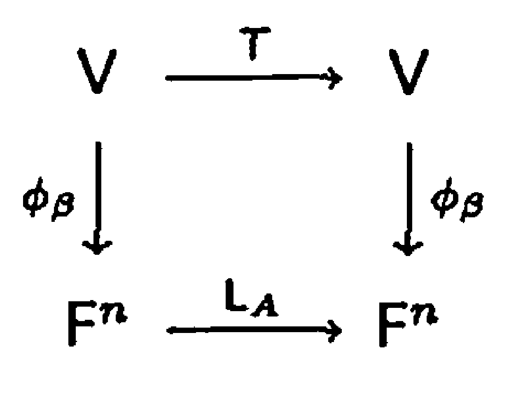
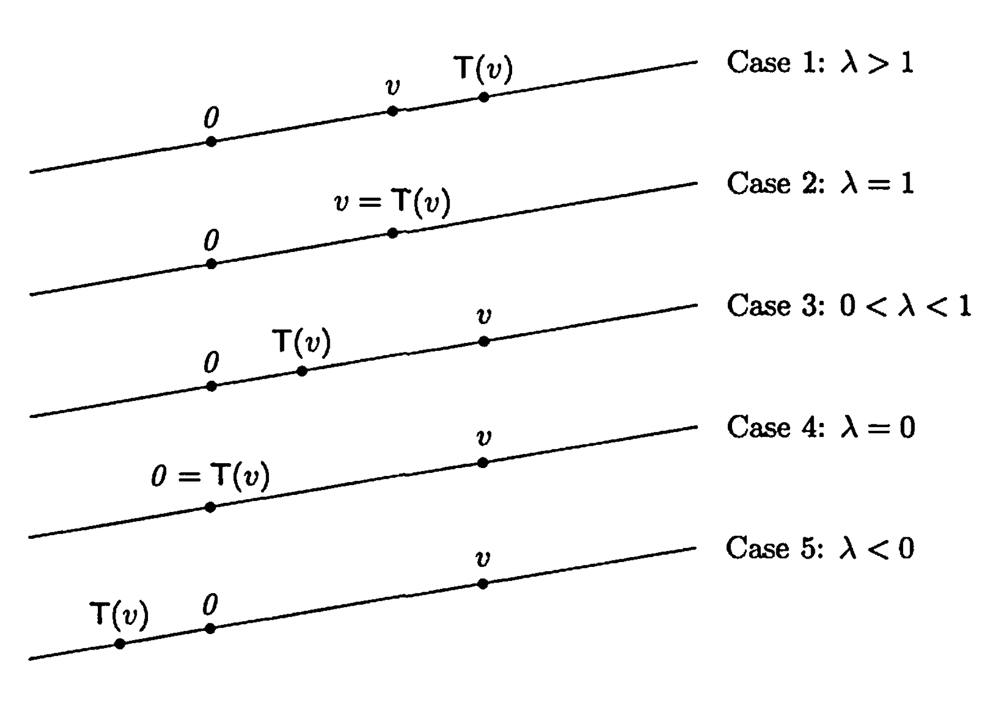

# § 23. Diagonalization

## Definition of Diagonalization and Eigenvalues, Eigenvectors

!!! definition "Definition 23.1 : Diagonalization"
    A linear operator $T$ on a finite-dimensional vector space $V$ is called **diagonalizable** if there is an ordered basis $\beta$ for $V$ such that $[T]_{\beta}$
    is a diagonal matrix.
    A square matrix $A$ is called **diagonalizable** if $L_{A}$ is diagonalizable.

!!! definition "Definition 23.2 : Eigenvalues and Eigenvectors"
    Let $T$ be a linear operator on a vector space $V$.
    A nonzero vector $v \in V$ is called an **eigenvector** of $T$ if there exists a scalar $\lambda$ such that $T(v)=\lambda v$.
    The scalar $\lambda$ is called the **eigenvalue** corresponding to the eigenvector $v$.

    Let $A$ be in $\mathrm{M}_{n \times n}(F)$.
    A nonzero vector $v \in F^{n}$ is called an **eigenvector** of $A$ if $v$ is an eigenvector of $L_{A}$; that is, if $A v=\lambda v$ for some scalar $\lambda$.
    The scalar $\lambda$ is called the **eigenvalue** of $A$ corresponding to the eigenvector $v$.

    The words **characteristic vector** and **proper vector** are also used in place of eigenvector.
    The corresponding terms for eigenvalue are **characteristic value** and **proper value**.

!!! theorem "Theorem 23.3 : Diagonalization is find eigenvectors and eigenvalues."
    A linear operator $T$ on a finite-dimensional vector space $V$ is diagonalizable if and only if there exists an ordered basis $\beta$ for $V$ consisting of eigenvectors of $T$.
    Furthermore, if $T$ is diagonalizable, $\beta=\left\{v_{1}, v_{2}, \ldots, v_{n}\right\}$ is an ordered basis of eigenvectors of $T$, and $D=[T]_{\beta}$, then $D$ is a diagonal matrix and $D_{j j}$ is the eigenvalue corresponding to $v_{j}$ for $1 \leq j \leq n$.
    To diagonalize a matrix or a linear operator is to find a basis of eigenvectors and the corresponding eigenvalues.
    
    !!! proof
        First suppose that $T$ is diagonalizable.
        Then there exists an ordered basis $\beta=\left\{v_{1}, v_{2}, \ldots, v_{n}\right\}$ for $V$ such that $D=[T]_{\beta}$ is a diagonal matrix.
        Fix $j$ with $1 \leq j \leq n$.
        By the definition of the matrix representation, the $j$th column of $D$ is the coordinate vector of $T\left(v_{j}\right)$ relative to $\beta$.
        Since $D$ is diagonal, the $j$th column of $D$ has $D_{j j}$ in the $j$th entry and zeros elsewhere.
        Hence

        $$
        T\left(v_{j}\right)=\sum_{i=1}^{n} D_{i j} v_{i}=D_{j j} v_{j}.
        $$

        Let $\lambda_{j}=D_{j j}$.
        Because $v_{j} \neq 0$, this shows that $v_{j}$ is an eigenvector of $T$ with eigenvalue $\lambda_{j}$.
        Since $j$ was arbitrary, every vector in $\beta$ is an eigenvector of $T$, and $D_{j j}$ is the eigenvalue corresponding to $v_{j}$.

        Conversely, suppose there exists an ordered basis $\beta=\left\{v_{1}, v_{2}, \ldots, v_{n}\right\}$ for $V$ consisting of eigenvectors of $T$.
        For each $j$, let $\lambda_{j}$ be the eigenvalue corresponding to $v_{j}$, so $T\left(v_{j}\right)=\lambda_{j} v_{j}$.
        Writing $T\left(v_{j}\right)$ as a linear combination of the basis vectors $\beta$, we have

        $$
        T\left(v_{j}\right)=0 \cdot v_{1}+\cdots+0 \cdot v_{j-1}+\lambda_{j} v_{j}+0 \cdot v_{j+1}+\cdots+0 \cdot v_{n}.
        $$

        Therefore the $j$th column of $[T]_{\beta}$ has $\lambda_{j}$ in the $j$th entry and zeros elsewhere.
        Since this holds for each $j$, the matrix $[T]_{\beta}$ is diagonal, with diagonal entries $[T]_{\beta, j j}=\lambda_{j}$.
        Hence $T$ is diagonalizable.

        Finally, the preceding equivalence shows that to diagonalize $T$ is precisely to find an ordered basis of eigenvectors $\beta$ and the corresponding eigenvalues, which then appear as the diagonal entries of $[T]_{\beta}$.

!!! example "Example 23.4 : Rotation by $\pi / 2$ has no eigenvalues."
    Let $T$ be the linear operator on $\mathbb{R}^{2}$ that rotates each vector in the plane through an angle of $\pi / 2$.
    It is clear geometrically that for any nonzero vector $v$, the vectors $v$ and $T(v)$ are not collinear; hence $T(v)$ is not a multiple of $v$.
    Therefore $T$ has no eigenvectors and, consequently, no eigenvalues.
    Thus there exist operators (and matrices) with no eigenvalues or eigenvectors.
    Of course, such operators and matrices are not diagonalizable.

!!! example "Example 23.5 : Derivative operator on $\mathcal{C}^{\infty}(\mathbb{R})$ has infinitely many eigenvalues."
    Let $\mathcal{C}^{\infty}(\mathbb{R})$ denote the set of all functions $f: \mathbb{R} \rightarrow \mathbb{R}$ having derivatives of all orders.
    (Thus $\mathcal{C}^{\infty}(\mathbb{R})$ includes the polynomial functions, the sine and cosine functions, the exponential functions, etc.)
    Clearly, $\mathcal{C}^{\infty}(\mathbb{R})$ is a subspace of the vector space $\mathcal{F}(\mathbb{R}, \mathbb{R})$ of all functions from $\mathbb{R}$ to $\mathbb{R}$ as defined in **Section 2**.
    Let $T: \mathcal{C}^{\infty}(\mathbb{R}) \rightarrow \mathcal{C}^{\infty}(\mathbb{R})$ be the function defined by $T(f)=f^{\prime}$, the derivative of $f$.
    It is easily verified that $T$ is a linear operator on $\mathcal{C}^{\infty}(\mathbb{R})$.
    We determine the eigenvalues and eigenvectors of $T$.

    Suppose that $f$ is an eigenvector of $T$ with corresponding eigenvalue $\lambda$.
    Then $f^{\prime}=T(f)=\lambda f$.
    This is a first-order differential equation whose solutions are of the form $f(t)=c e^{\lambda t}$ for some constant $c$.
    Consequently, every real number $\lambda$ is an eigenvalue of $T$, and $\lambda$ corresponds to eigenvectors of the form $c e^{\lambda t}$ for $c \neq 0$.
    Note that for $\lambda=0$, the eigenvectors are the nonzero constant functions.

## Diagonalizing a Matrix

!!! theorem "Theorem 23.6 : Determinant condition for finding eigenvalues"
    Let $A \in \mathrm{M}_{n \times n}(F)$.
    Then a scalar $\lambda$ is an eigenvalue of $A$ if and only if $\operatorname{det}\left(A-\lambda I_{n}\right)=0$.

    !!! proof
        A scalar $\lambda$ is an eigenvalue of $A$ if and only if there exists a nonzero vector $v \in F^{n}$ such that $A v=\lambda v$, that is, $\left(A-\lambda I_{n}\right)(v)=0$.
        By **Theorem 2.5**, this is true if and only if $A-\lambda I_{n}$ is not invertible.
        However, this result is equivalent to the statement that $\operatorname{det}\left(A-\lambda I_{n}\right)=0$.

!!! definition "Definition 23.7 : Characteristic Polynomial of a Matrix"
    Let $A \in \mathrm{M}_{n \times n}(F)$.
    The polynomial $f(t)=\operatorname{det}\left(A-t I_{n}\right)$ is called the characteristic polynomial of $A$.

!!! theorem "Theorem 23.8 : Characteristic polynomial properties"
    Let $A \in \mathrm{M}_{n \times n}(F)$.

    - (a) The characteristic polynomial of $A$ is a polynomial of degree $n$ with leading coefficient $(-1)^{n}$.
    - (b) $A$ has at most $n$ distinct eigenvalues.
    
    !!! proof
        - (a)  
            We prove by mathematical induction on $n$ that
            
            $$
            f(t)=\operatorname{det}(A-tI_n)
            $$

            is a polynomial of degree $n$ with leading coefficient $(-1)^n$.

            If $n=1$, then $A=[a_{11}]$ and
            
            $$
            f(t)=\operatorname{det}\bigl([a_{11}-t]\bigr)=a_{11}-t,
            $$

            which has degree $1$ and leading coefficient $-1=(-1)^1$.

            Assume the statement holds for all $(n-1)\times(n-1)$ matrices.
            Let $A\in M_{n\times n}(F)$ and set $M(t)=A-tI_n$.
            Expand $\operatorname{det}(M(t))$ by cofactors along the first row:

            $$
            \operatorname{det}(M(t))=\sum_{j=1}^{n}(-1)^{1+j}M(t)_{1j}\,\operatorname{det}\!\bigl(\widetilde{M(t)}_{1j}\bigr).
            $$

            For $j\neq 1$, the entry $M(t)_{1j}=a_{1j}$ is independent of $t$.
            The minor $\widetilde{M(t)}_{1j}$ is an $(n-1)\times(n-1)$ matrix whose entries are of the form $a_{ij}$ except that for indices with $i=j$ (in the shifted indexing), diagonal entries contain terms $(a_{ii}-t)$.
            In any case, $\operatorname{det}(\widetilde{M(t)}_{1j})$ is a polynomial in $t$ of degree at most $n-1$, so the entire term with $j\neq 1$ has degree at most $n-1$.

            For $j=1$, we have $M(t)_{11}=a_{11}-t$ and
            
            $$
            \widetilde{M(t)}_{11}=A_{11}-tI_{n-1},
            $$

            where $A_{11}$ is the $(n-1)\times(n-1)$ submatrix obtained by deleting row $1$ and column $1$ from $A$.
            By the induction hypothesis,
            
            $$
            \operatorname{det}(A_{11}-tI_{n-1})
            $$

            is a polynomial of degree $n-1$ with leading coefficient $(-1)^{n-1}$.
            Therefore the product
            
            $$
            (a_{11}-t)\operatorname{det}(A_{11}-tI_{n-1})
            $$

            has degree $n$ and leading coefficient
            
            $$
            (-1)\cdot(-1)^{n-1}=(-1)^n.
            $$

            Since every other cofactor-expansion term has degree at most $n-1$, none of them can cancel the degree-$n$ term.
            Hence $\operatorname{det}(A-tI_n)$ is a polynomial of degree $n$ with leading coefficient $(-1)^n$.

        - (b)  
            By **Theorem 23.6**, every eigenvalue $\lambda$ is a root of the characteristic polynomial $f(t)=\operatorname{det}(A-tI_n)$.

            By part (a), $f(t)$ has degree $n$.
            A nonzero polynomial of degree $n$ has at most $n$ distinct roots.
            Therefore $A$ has at most $n$ distinct eigenvalues.
            
!!! theorem "Theorem 23.9 : Finding eigenvectors in the null space"
    Let $T$ be a linear operator on a vector space $V$, and let $\lambda$ be an eigenvalue of $T$.
    A vector $v \in V$ is an eigenvector of $T$ corresponding to $\lambda$ if and only if $v \neq 0$ and $v \in N(T-\lambda I)$.

    !!! proof
        By definition, $v$ is an eigenvector of $T$ corresponding to $\lambda$ if and only if $v \neq 0$ and

        $$
        T(v)=\lambda v.
        $$

        This equation is equivalent to

        $$
        T(v)-\lambda v=0,
        $$

        which is equivalent to

        $$
        (T-\lambda I)(v)=0.
        $$

        Therefore $v$ is an eigenvector of $T$ corresponding to $\lambda$ if and only if $v \neq 0$ and $v \in N(T-\lambda I)$.        

!!! example "Example 23.10 : Computing the eigenvalues and eigenvectors of a matrix"
    To find the eigenvalues of
    
    $$
    A=\left(\begin{array}{ll}
    1 & 1 \\
    4 & 1
    \end{array}\right) \in M_{2 \times 2}(R)
    $$
    
    we compute its characteristic polynomial:
    
    $$
    \operatorname{det}\left(A-t I_{2}\right)=\operatorname{det}\left(\begin{array}{cc}
    1-t & 1 \\
    4 & 1-t
    \end{array}\right)=t^{2}-2 t-3=(t-3)(t+1)
    $$

    It follows from **Theorem 23.6** that the only eigenvalues of $A$ are $3$ and $-1$.

    Now, let's find all the eigenvectors of $A$.

    We begin by finding all the eigenvectors corresponding to $\lambda_{1}=3$.
    Let

    $$
    B_{1}=A-\lambda_{1} I=\left(\begin{array}{ll}
    1 & 1 \\
    4 & 1
    \end{array}\right)-\left(\begin{array}{ll}
    3 & 0 \\
    0 & 3
    \end{array}\right)=\left(\begin{array}{rr}
    -2 & 1 \\
    4 & -2
    \end{array}\right) .
    $$

    Then

    $$
    x=\binom{x_{1}}{x_{2}} \in \mathbb{R}^{2}
    $$

    is an eigenvector corresponding to $\lambda_{1}=3$ if and only if $x \neq 0$ and $x \in N\left(L_{B_{1}}\right)$; that is, $x \neq 0$ and

    $$
    \left(\begin{array}{rr}
    -2 & 1 \\
    4 & -2
    \end{array}\right)\binom{x_{1}}{x_{2}}=\binom{-2 x_{1}+x_{2}}{4 x_{1}-2 x_{2}}=\binom{0}{0} .
    $$

    Clearly the set of all solutions to this equation is

    $$
    \left\{t\binom{1}{2}: t \in \mathbb{R}\right\}
    $$

    Hence $x$ is an eigenvector corresponding to $\lambda_{1}=3$ if and only if

    $$
    x=t\binom{1}{2} \quad \text { for some } t \neq 0
    $$

    Now suppose that $x$ is an eigenvector of $A$ corresponding to $\lambda_{2}=-1$.
    Let

    $$
    B_{2}=A-\lambda_{2} I=\left(\begin{array}{ll}
    1 & 1 \\
    4 & 1
    \end{array}\right)-\left(\begin{array}{rr}
    -1 & 0 \\
    0 & -1
    \end{array}\right)=\left(\begin{array}{ll}
    2 & 1 \\
    4 & 2
    \end{array}\right) .
    $$

    Then

    $$
    x=\binom{x_{1}}{x_{2}} \in N\left(L_{B_{2}}\right)
    $$

    if and only if $x$ is a solution to the system

    $$
    \begin{aligned}
    & 2 x_{1}+x_{2}=0 \\
    & 4 x_{1}+2 x_{2}=0 .
    \end{aligned}
    $$

    Hence

    $$
    N\left(L_{B_{2}}\right)=\left\{t\binom{1}{-2}: t \in \mathbb{R}\right\} .
    $$

    Thus $x$ is an eigenvector corresponding to $\lambda_{2}=-1$ if and only if

    $$
    x=t\binom{1}{-2} \quad \text { for some } t \neq 0
    $$

    Observe that

    $$
    \left\{\binom{1}{2},\binom{1}{-2}\right\}
    $$

    is a basis for $\mathbb{R}^{2}$ consisting of eigenvectors of $A$.
    Thus $L_{A}$, and hence $A$, is diagonalizable.

!!! concept "Concept 23.11 : The change of coordinate matrix for diagonalization"
    Suppose that $\beta$ is a basis for $F^{n}$ consisting of eigenvectors of $A$.
    **Corollary 12.9** assures us that if $Q$ is the $n \times n$ matrix whose columns are the vectors in $\beta$, then $Q^{-1} A Q$ is a diagonal matrix.
    Of course, the diagonal entries of this matrix are the eigenvalues of $A$ that correspond to the respective columns of $Q$.

## Diagonalizing a Linear Operator

!!! theorem "Theorem 23.12 : Similar matrices have the same characteristic polynomial."
    Similar matrices have the same characteristic polynomial.

    !!! proof
        Let $A, B \in \mathrm{M}_{n \times n}(F)$ be similar.
        Then there exists an invertible matrix $P \in \mathrm{M}_{n \times n}(F)$ such that

        $$
        B=P^{-1} A P .
        $$

        For any scalar $t$, we have

        $$
        \begin{aligned}
        B-t I_{n}
        & =P^{-1} A P-t I_{n} \\
        & =P^{-1} A P-t\left(P^{-1} I_{n} P\right) \\
        & =P^{-1}(A-t I_{n})P .
        \end{aligned}
        $$

        Taking determinants and using $\operatorname{det}(X Y)=\operatorname{det}(X)\operatorname{det}(Y)$, we obtain

        $$
        \begin{aligned}
        \operatorname{det}(B-t I_{n})
        & =\operatorname{det}\left(P^{-1}(A-t I_{n})P\right) \\
        & =\operatorname{det}\left(P^{-1}\right)\operatorname{det}(A-t I_{n})\operatorname{det}(P) \\
        & =\operatorname{det}(A-t I_{n}),
        \end{aligned}
        $$

        because $\operatorname{det}\left(P^{-1}\right)\operatorname{det}(P)=1$.
        Hence $A$ and $B$ have the same characteristic polynomial.        

    This fact enables us to define the characteristic polynomial of a linear operator as **Definition 23.13**.

!!! definition "Definition 23.13 : Characteristic Polynomial of a Linear Operator"
    Let $T$ be a linear operator on an $n$-dimensional vector space $V$ with ordered basis $\beta$.
    We define the characteristic polynomial $f(t)$ of $T$ to be the characteristic polynomial of $A=[T]_{\beta}$.
    That is,

    $$
    f(t)=\operatorname{det}\left(A-t I_{n}\right)
    $$

!!! concept "Concept 23.14 : Finding the eigenvalues and eigenvectors of a linear operator"
    {: .center style="width:30%;"}
    ///caption
    Figure 23.1.
    ///

    To find the eigenvectors of a linear operator $T$ on an $n$-dimensional vector space, select an ordered basis $\beta$ for $V$ and let $A=[T]_{\beta}$.
    **Figure 23.1** is the special case of **Figure 11.1** in **Section 11** in which $V=W$ and $\beta=\gamma$.
    Recall that for $v \in V$, $\phi_{\beta}(v)=[v]_{\beta}$, the coordinate vector of $v$ relative to $\beta$.
    We show that $v \in V$ is an eigenvector of $T$ corresponding to $\lambda$ if and only if $\phi_{\beta}(v)$ is an eigenvector of $A$ corresponding to $\lambda$.
    Suppose that $v$ is an eigenvector of $T$ corresponding to $\lambda$.
    Then $T(v)=\lambda v$.
    Hence

    $$
    A \phi_{\beta}(v)=L_{A} \phi_{\beta}(v)=\phi_{\beta} T(v)=\phi_{\beta}(\lambda v)=\lambda \phi_{\beta}(v) .
    $$

    Now $\phi_{\beta}(v) \neq 0$, since $\phi_{\beta}$ is an isomorphism; hence $\phi_{\beta}(v)$ is an eigenvector of $A$.
    This argument is reversible, and so we can establish that if $\phi_{\beta}(v)$ is an eigenvector of $A$ corresponding to $\lambda$, then $v$ is an eigenvector of $T$ corresponding to $\lambda$.

    An equivalent formulation of the result discussed in the preceding paragraph is that for an eigenvalue $\lambda$ of $A$ (and hence of $T$), a vector $y \in F^{n}$ is an eigenvector of $A$ corresponding to $\lambda$ if and only if $\phi_{\beta}^{-1}(y)$ is an eigenvector of $T$ corresponding to $\lambda$.

    Thus we have reduced the problem of finding the eigenvectors of a linear operator on a finite-dimensional vector space to the problem of finding the eigenvectors of a matrix.

!!! example "Example 23.15 : Computing the eigenvalues and eigenvectors of a linear operator"
    Let $T$ be the linear operator on $\mathrm{P}_{2}(\mathbb{R})$ defined by $T(f(x))=f(x)+(x+1) f^{\prime}(x)$, let $\beta$ be the standard ordered basis for $\mathrm{P}_{2}(\mathbb{R})$, and let $A=[T]_{\beta}$.
    Then

    $$
    A=\left(\begin{array}{lll}
    1 & 1 & 0 \\
    0 & 2 & 2 \\
    0 & 0 & 3
    \end{array}\right)
    $$

    The characteristic polynomial of $T$ is

    $$
    \begin{aligned}
    \operatorname{det}\left(A-t I_{3}\right) & =\operatorname{det}\left(\begin{array}{ccc}
    1-t & 1 & 0 \\
    0 & 2-t & 2 \\
    0 & 0 & 3-t
    \end{array}\right) \\
    & =(1-t)(2-t)(3-t) \\
    & =-(t-1)(t-2)(t-3) .
    \end{aligned}
    $$

    Hence $\lambda$ is an eigenvalue of $T$ (or $A$) if and only if $\lambda=1,2$, or 3.

    We consider each eigenvalue separately.
    Let $\lambda_{1}=1$, and define

    $$
    B_{1}=A-\lambda_{1} I=\left(\begin{array}{lll}
    0 & 1 & 0 \\
    0 & 1 & 2 \\
    0 & 0 & 2
    \end{array}\right)
    $$

    Then

    $$
    x=\left(\begin{array}{l}
    x_{1} \\
    x_{2} \\
    x_{3}
    \end{array}\right) \in \mathbb{R}^{3}
    $$

    is an eigenvector corresponding to $\lambda_{1}=1$ if and only if $x \neq 0$ and $x \in N\left(L_{B_{1}}\right)$; that is, $x$ is a nonzero solution to the system

    $$
    \begin{aligned}
    x_{2} & =0 \\
    x_{2}+2 x_{3} & =0 \\
    2 x_{3} & =0 .
    \end{aligned}
    $$

    Notice that this system has three unknowns, $x_{1}$, $x_{2}$, and $x_{3}$, but one of these, $x_{1}$, does not actually appear in the system.
    Since the values of $x_{1}$ do not affect the system, we assign $x_{1}$ a parametric value, say $x_{1}=a$, and solve the system for $x_{2}$ and $x_{3}$.
    Clearly, $x_{2}=x_{3}=0$, and so the eigenvectors of $A$ corresponding to $\lambda_{1}=1$ are of the form

    $$
    a\left(\begin{array}{l}
    1 \\
    0 \\
    0
    \end{array}\right)=a e_{1}
    $$

    for $a \neq 0$.
    Consequently, the eigenvectors of $T$ corresponding to $\lambda_{1}=1$ are of the form

    $$
    \phi_{\beta}^{-1}\left(a e_{1}\right)=a \phi_{\beta}^{-1}\left(e_{1}\right)=a \cdot 1=a
    $$

    for any $a \neq 0$.
    Hence the nonzero constant polynomials are the eigenvectors of $T$ corresponding to $\lambda_{1}=1$.

    Next let $\lambda_{2}=2$, and define

    $$
    B_{2}=A-\lambda_{2} I=\left(\begin{array}{rrr}
    -1 & 1 & 0 \\
    0 & 0 & 2 \\
    0 & 0 & 1
    \end{array}\right) .
    $$

    It is easily verified that

    $$
    N\left(L_{B_{2}}\right)=\left\{a\left(\begin{array}{l}
    1 \\
    1 \\
    0
    \end{array}\right): a \in \mathbb{R}\right\}
    $$

    and hence the eigenvectors of $T$ corresponding to $\lambda_{2}=2$ are of the form

    $$
    \phi_{\beta}^{-1}\left(a\left(\begin{array}{l}
    1 \\
    1 \\
    0
    \end{array}\right)\right)=a \phi_{\beta}^{-1}\left(e_{1}+e_{2}\right)=a(1+x)
    $$

    for $a \neq 0$.
    Finally, consider $\lambda_{3}=3$ and

    $$
    B_{3}=A-\lambda_{3} I=\left(\begin{array}{rrr}
    -2 & 1 & 0 \\
    0 & -1 & 2 \\
    0 & 0 & 0
    \end{array}\right)
    $$

    Since

    $$
    N\left(L_{B_{3}}\right)=\left\{a\left(\begin{array}{l}
    1 \\
    2 \\
    1
    \end{array}\right): a \in \mathbb{R}\right\}
    $$

    the eigenvectors of $T$ corresponding to $\lambda_{3}=3$ are of the form

    $$
    \phi_{\beta}^{-1}\left(a\left(\begin{array}{l}
    1 \\
    2 \\
    1
    \end{array}\right)\right)=a \phi_{\beta}^{-1}\left(e_{1}+2 e_{2}+e_{3}\right)=a\left(1+2 x+x^{2}\right)
    $$

    for $a \neq 0$.
    For each eigenvalue, select the corresponding eigenvector with $a=1$ in the preceding descriptions to obtain $\gamma=\left\{1,1+x, 1+2 x+x^{2}\right\}$, which is an ordered basis for $\mathrm{P}_{2}(\mathbb{R})$ consisting of eigenvectors of $T$.
    Thus $T$ is diagonalizable, and

    $$
    [T]_{\gamma}=\left(\begin{array}{lll}
    1 & 0 & 0 \\
    0 & 2 & 0 \\
    0 & 0 & 3
    \end{array}\right)
    $$

## Geometric Description of a Linear Operator on Eigenvectors

!!! concept "Concept 23.16 : Geometric action on eigenvectors"
    We close this section with a geometric description of how a linear operator $T$ acts on an eigenvector in the context of a vector space $V$ over $\mathbb{R}$.
    Let $v$ be an eigenvector of $T$ and $\lambda$ be the corresponding eigenvalue.
    We can think of $W=\operatorname{span}\left(\left\{v\right\}\right)$, the one-dimensional subspace of $V$ spanned by $v$, as a line in $V$ that passes through $0$ and $v$.
    For any $w \in W$, $w=c v$ for some scalar $c$, and hence

    $$
    T(w)=T(c v)=c T(v)=c \lambda v=\lambda w
    $$

    so $T$ acts on the vectors in $W$ by multiplying each such vector by $\lambda$.
    There are several possible ways for $T$ to act on the vectors in $W$, depending on the value of $\lambda$.
    We consider several cases.
    
    {: .center style="width:70%;"}
    ///caption
    Figure 23.2.
    ///

    - Case 1.  
        If $\lambda>1$, then $T$ moves vectors in $W$ farther from $0$ by a factor of $\lambda$.

    - Case 2.  
        If $\lambda=1$, then $T$ acts as the identity operator on $W$.

    - Case 3.  
        If $0<\lambda<1$, then $T$ moves vectors in $W$ closer to $0$ by a factor of $\lambda$.

    - Case 4.  
        If $\lambda=0$, then $T$ acts as the zero transformation on $W$.

    - Case 5.  
        If $\lambda<0$, then $T$ reverses the orientation of $W$; that is, $T$ moves vectors in $W$ from one side of $0$ to the other.

## Exercise

!!! exercise "Exercise 23.7"
    Let $T$ be a linear operator on a finite-dimensional vector space $V$.
    We define the **determinant** of $T$, denoted $\operatorname{det}(T)$, as follows: Choose any ordered basis $\beta$ for $V$, and $\operatorname{define~} \operatorname{det}(T)=\operatorname{det}\left([T]_{\beta}\right)$.

    - (a) Prove that the preceding definition is independent of the choice of an ordered basis for $V$.
        That is, prove that if $\beta$ and $\gamma$ are two ordered bases for $V$, then $\operatorname{det}\left([T]_{\beta}\right)=\operatorname{det}\left([T]_{\gamma}\right)$.
    - (b) Prove that $T$ is invertible if and only if $\operatorname{det}(T) \neq 0$.
    - (c) Prove that if $T$ is invertible, then $\operatorname{det}\left(T^{-1}\right)=[\operatorname{det}(T)]^{-1}$.
    - (d) Prove that if $U$ is also a linear operator on $V$, then $\operatorname{det}(T U)=$ $\operatorname{det}(T) \cdot \operatorname{det}(U)$.
    - (e) Prove that $\operatorname{det}\left(T-\lambda l_{V}\right)=\operatorname{det}\left([T]_{\beta}-\lambda I\right)$ for any scalar $\lambda$ and any ordered basis $\beta$ for $V$.

!!! exercise "Exercise 23.8"
    - (a) Prove that a linear operator $T$ on a finite-dimensional vector space is invertible if and only if zero is not an eigenvalue of $T$.
    - (b) Let $T$ be an invertible linear operator.
        Prove that a scalar $\lambda$ is an eigenvalue of $T$ if and only if $\lambda^{-1}$ is an eigenvalue of $T^{-1}$.
    - (c) State and prove results analogous to (a) and (b) for matrices.

!!! exercise "Exercise 23.9"
    Prove that the eigenvalues of an upper triangular matrix $M$ are the diagonal entries of $M$.

!!! exercise "Exercise 23.10"
    Let $V$ be a finite-dimensional vector space, and let $\lambda$ be any scalar.

    - (a) For any ordered basis $\beta$ for $V$, prove that $\left[\lambda I_{V}\right]_{\beta}=\lambda I$.
    - (b) Compute the characteristic polynomial of $\lambda l_{V}$.
    - (c) Show that $\lambda I_{V}$ is diagonalizable and has only one eigenvalue.

!!! exercise "Exercise 23.11"
    A **scalar matrix** is a square matrix of the form $\lambda I$ for some scalar $\lambda$; that is, a scalar matrix is a diagonal matrix in which all the diagonal entries are equal.

    - (a) Prove that if a square matrix $A$ is similar to a scalar matrix $\lambda I$, then $A=\lambda I$.
    - (b) Show that a diagonalizable matrix having only one eigenvalue is a scalar matrix.

!!! exercise "Exercise 23.14"
    For any square matrix $A$, prove that $A$ and $A^{t}$ have the same characteristic polynomial (and hence the same eigenvalues).

!!! exercise "Exercise 23.15"
    - (a) Let $T$ be a linear operator on a vector space $V$, and let $x$ be an eigenvector of $T$ corresponding to the cigenvalue $\lambda$.
        For any positive integer $m$, prove that $x$ is an eigenvector of $T^{m}$ corresponding to the eigenvalue $\lambda^{m}$.
    - (b) State and prove the analogous result for matrices.

!!! exercise "Exercise 23.16"
    - (a) Prove that similar matrices have the same trace.
        Hint: Use **Exercise 10.13**.
    - (b) How would you define the trace of a linear operator on a finitedimensional vector space?
        Justify that your definition is welldefined.

!!! exercise "Exercise 23.19"
    Let $A$ and $B$ be similar $n \times n$ matrices.
    Prove that there exists an $n$ dimensional vector space $V$, a linear operator $T$ on $V$, and ordered bases $\beta$ and $\gamma$ for $V$ such that $A=[T]_{\beta}$ and $B=[T]_{\gamma}$.
    Hint: Use **Exercise 12.14**.

!!! exercise "Exercise 23.20"
    Let $A$ be an $n \times n$ matrix with characteristic polynomial

    $$
    f(t)=(-1)^{n} t^{n}+a_{n-1} t^{n-1}+\cdots+a_{1} t+a_{0}
    $$

    Prove that $f(0)=a_{0}=\operatorname{det}(A)$.
    Deduce that $A$ is invertible if and only if $a_{0} \neq 0$.

!!! exercise "Exercise 23.21"
    Let $A$ and $f(t)$ be as in **Exercise 23.20**.

    - (a) Prove that $f(t)=\left(A_{11}-t\right)\left(A_{22}-t\right) \cdots\left(A_{n n}-t\right)+q(t)$, where $q(t)$ is a polynomial of degree at most $n-2$.
        Hint: Apply mathematical induction to $n$.
    - (b) Show that $\operatorname{tr}(A)=(-1)^{n-1} a_{n-1}$.

!!! exercise "Exercise 23.22"
    - (a) Let $T$ be a linear operator on a vector space $V$ over the field $F$, and let $g(t)$ be a polynomial with coefficients from $F$.
        Prove that if $x$ is an eigenvector of $T$ with corresponding eigenvalue $\lambda$, then $g(T)(x)=g(\lambda) x$.
        That is, $x$ is an eigenvector of $g(T)$ with corresponding eigenvalue $g(\lambda)$.
    - (b) State and prove a comparable result for matrices.

!!! exercise "Exercise 23.23"
    Use **Exercise 23.22** to prove that if $f(t)$ is the characteristic polynomial of a diagonalizable linear operator $T$, then $f(T)=T_{0}$, the zero operator.
    (In Section 5.4 we prove that this result does not depend on the diagonalizability of $T$.)
