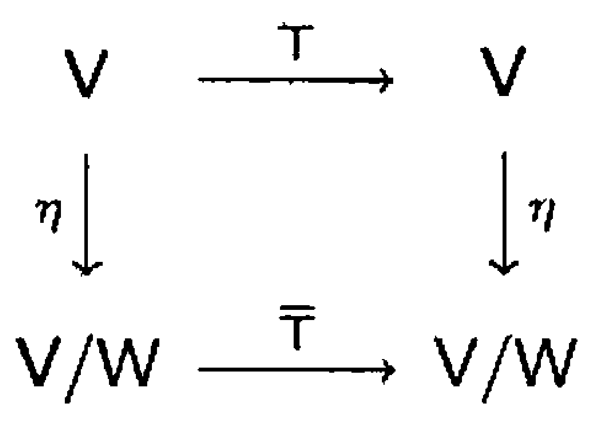

# § 26. Invariant Subspaces and the Cayley-Hamilton Theorem

## Invariant Subspaces

!!! definition "Definition 26.1 : $T$-Invariant Subspace"
    Let $T$ be a linear operator on a vector space $V$.
    A subspace $W$ of $V$ is called a **$T$-invariant subspace** of $V$ if $T(W) \subseteq W$, that is, if $T(v) \in W$ for all $v \in W$.

!!! example "Example 26.2 : Examples of $T$-invariant subspaces"
    Suppose that $T$ is a linear operator on a vector space $V$.
    Then the following subspaces of $V$ are $T$-invariant:

    1. $\{0\}$
    2. $V$
    3. $R(T)$
    4. $N(T)$
    5. $E_{\lambda}$, for any eigenvalue $\lambda$ of $T$.
    
    !!! proof
        1. Since $T(0)=0$, we have $T(\{0\})=\{0\}\subseteq \{0\}$, so $\{0\}$ is $T$-invariant.

        2. For every $x\in V$, $T(x)\in V$, so $T(V)\subseteq V$, and hence $V$ is $T$-invariant.

        3. Let $y\in R(T)$.
            Then $y=T(x)$ for some $x\in V$, so

            $$
            T(y)=T(T(x))=T^{2}(x)\in R(T),
            $$

            which shows $T(R(T))\subseteq R(T)$.

        4. Let $x\in N(T)$.
            Then $T(x)=0$, so

            $$
            T(x)\in N(T)
            $$

            because $0\in N(T)$.
            Hence $T(N(T))\subseteq N(T)$.

        5. Let $x\in E_{\lambda}$, where $\lambda$ is an eigenvalue of $T$.
            Then $T(x)=\lambda x$.
            Applying $T$ again yields

            $$
            T(T(x))=T(\lambda x)=\lambda T(x)=\lambda(\lambda x)=\lambda(\lambda x),
            $$

            so $T(x)=\lambda x\in E_{\lambda}$.
            Therefore $T(E_{\lambda})\subseteq E_{\lambda}$, and $E_{\lambda}$ is $T$-invariant.

!!! definition "Definition 26.3 : $T$-Cyclic Subspace"
    Let $T$ be a linear operator on a vector space $V$, and let $x$ be a nonzero vector in $V$.
    The subspace

    $$
    W=\operatorname{span}\left(\left\{x, T(x), T^{2}(x), \ldots\right\}\right)
    $$

    is called the **$T$-cyclic subspace of $V$ generated by $x$**.

!!! theorem "Theorem 26.4 : $T$-Cyclic subspace generated by $x$ is the minimal $T$-invariant subspace containing $x$."
    Let $T$ be a linear operator on a vector space $V$, $x$ be a nonzero vector in $V$, and $W$ be the $T$-cyclic subspace of $V$ generated by $x$.

    - (a) $W$ is $T$-invariant.  
    - (b) $W$ is the "smallest" $T$-invariant subspace of $V$ containing $x$.
        That is, any $T$-invariant subspace of $V$ containing $x$ must also contain $W$.
    
    !!! proof
        - (a)  
            Let $w \in W$.
            Then there exists an integer $m \ge 0$ and scalars $a_{0}, a_{1}, \ldots, a_{m}$ such that

            $$
            w=\sum_{i=0}^{m} a_{i} T^{i}(x).
            $$

            Using linearity of $T$,

            $$
            T(w)=T\left(\sum_{i=0}^{m} a_{i} T^{i}(x)\right)=\sum_{i=0}^{m} a_{i} T^{i+1}(x).
            $$

            But $T^{i+1}(x)$ is one of the spanning vectors of $W$, so the right-hand side is a linear combination of vectors in $\{x, T(x), T^{2}(x), \ldots\}$.
            Hence $T(w)\in W$, and therefore $T(W)\subseteq W$.
            Thus $W$ is $T$-invariant.
        
        - (b)  
            Let $U$ be any $T$-invariant subspace of $V$ such that $x \in U$.
            Because $U$ is $T$-invariant, $T(x)\in U$.
            Applying $T$ repeatedly, we obtain

            $$
            T^{i}(x)\in U \quad \text{for all integers } i\ge 0.
            $$

            Since $U$ is a subspace, it contains the span of any subset of its vectors.
            Therefore,

            $$
            \operatorname{span}\left(\left\{x, T(x), T^{2}(x), \ldots\right\}\right)\subseteq U,
            $$

            that is, $W\subseteq U$.
            Hence every $T$-invariant subspace of $V$ containing $x$ must contain $W$, so $W$ is the smallest $T$-invariant subspace of $V$ containing $x$.

!!! definition "Definition 26.5 : Restriction to a $T$-Invariant Subspace"
    If $T$ is a linear operator on $V$ and $W$ is a $T$-invariant subspace of $V$, then the **restriction** $T_{W}$ of $T$ to $W$ is a mapping from $W$ to $W$, and it follows that $T_{W}$ is a linear operator on $W$.

!!! theorem "Theorem 26.6 : Characteristic polynomial of a restriction divides the original characteristic polynomial."
    Let $T$ be a linear operator on a finite-dimensional vector space $V$, and let $W$ be a $T$-invariant subspace of $V$.
    Then the characteristic polynomial of $T_{W}$ divides the characteristic polynomial of $T$.

    !!! proof
        Choose an ordered basis $\gamma=\left\{v_{1}, v_{2}, \ldots, v_{k}\right\}$ for $W$, and extend it to an ordered basis $\beta=\left\{v_{1}, v_{2}, \ldots, v_{k}, v_{k+1}, \ldots, v_{n}\right\}$ for $V$.
        Let $A=[T]_{\beta}$ and $B_{1}=\left[T_{W}\right]_{\gamma}$.
        Then, by **Exercise 26.12**, $A$ can be written in the form

        $$
        A=\left(\begin{array}{cc}
        B_{1} & B_{2} \\
        O & B_{3}
        \end{array}\right)
        $$

        Let $f(t)$ be the characteristic polynomial of $T$ and $g(t)$ the characteristic polynomial of $T_{W}$.
        Then

        $$
        f(t)=\operatorname{det}\left(A-t I_{n}\right)=\operatorname{det}\left(\begin{array}{cc}
        B_{1}-t I_{k} & B_{2} \\
        O & B_{3}-t I_{n-k}
        \end{array}\right)=g(t) \cdot \operatorname{det}\left(B_{3}-t I_{n-k}\right)
        $$

        by **Exercise 21.21**.
        Thus $g(t)$ divides $f(t)$.

!!! theorem "Theorem 26.7 : Basis and characteristic polynomial of a cyclic subspace"
    Let $T$ be a linear operator on a finite-dimensional vector space $V$, and let $W$ denote the $T$-cyclic subspace of $V$ generated by a nonzero vector $v \in V$.
    Let $k=\operatorname{dim}(W)$.
    Then

    - (a) $\left\{v, T(v), T^{2}(v), \ldots, T^{k-1}(v)\right\}$ is a basis for $W$.
    - (b) If $a_{0} v+a_{1} T(v)+\cdots+a_{k-1} T^{k-1}(v)+T^{k}(v)=0$, then the characteristic polynomial of $T_{W}$ is $f(t)=(-1)^{k}\left(a_{0}+a_{1} t+\cdots+a_{k-1} t^{k-1}+t^{k}\right)$.

    !!! proof
        - (a)  
            Since $v \neq 0$, the set $\left\{v\right\}$ is linearly independent.
            Let $j$ be the largest positive integer for which

            $$
            \beta=\left\{v, T(v), \ldots, T^{j-1}(v)\right\}
            $$

            is linearly independent.
            Such a $j$ must exist because $V$ is finite-dimensional.
            Let $Z=\operatorname{span}(\beta)$.
            Then $\beta$ is a basis for $Z$.
            Furthermore, $T^{j}(v) \in Z$ by **Theorem 5.9**.
            We use this information to show that $Z$ is a $T$-invariant subspace of $V$.
            Let $w \in Z$.
            Since $w$ is a linear combination of the vectors of $\beta$, there exist scalars $b_{0}, b_{1}, \ldots, b_{j-1}$ such that

            $$
            w=b_{0} v+b_{1} T(v)+\cdots+b_{j-1} T^{j-1}(v)
            $$

            and hence

            $$
            T(w)=b_{0} T(v)+b_{1} T^{2}(v)+\cdots+b_{j-1} T^{j}(v) .
            $$

            Thus $T(w)$ is a linear combination of vectors in $Z$, and hence belongs to $Z$.
            So $Z$ is $T$-invariant.

            Furthermore, $v \in Z$.
            By **Theorem 26.4**, $W$ is the smallest $T$-invariant subspace of $V$ that contains $v$, so that $W \subseteq Z$.
            Clearly, $Z \subseteq W$, and so we conclude that $Z=W$.
            It follows that $\beta$ is a basis for $W$, and therefore $\operatorname{dim}(W)=j$.
            Thus $j=k$.
            This proves (a).

        - (b)  
            Now view $\beta$ (from (a)) as an ordered basis for $W$.
            Let $a_{0}, a_{1}, \ldots, a_{k-1}$ be the scalars such that

            $$
            a_{0} v+a_{1} T(v)+\cdots+a_{k-1} T^{k-1}(v)+T^{k}(v)=0 .
            $$

            Observe that

            $$
            \left[T_{W}\right]_{\beta}=\left(\begin{array}{ccccc}
            0 & 0 & \cdots & 0 & -a_{0} \\
            1 & 0 & \cdots & 0 & -a_{1} \\
            \vdots & \vdots & & \vdots & \vdots \\
            0 & 0 & \cdots & 1 & -a_{k-1}
            \end{array}\right).
            $$

            We claim that the characteristic polynomial of this matrix is

            $$
            f(t)=(-1)^{k}\left(a_{0}+a_{1} t+\cdots+a_{k-1} t^{k-1}+t^{k}\right).
            $$

            To prove this, compute $f(t)=\det\!\left(\left[T_W\right]_{\beta}-tI_k\right)$.
            The matrix $\left[T_W\right]_{\beta}-tI_k$ has the form

            $$
            \left(\begin{array}{ccccc}
            -t & 0 & \cdots & 0 & -a_{0} \\
            1 & -t & \cdots & 0 & -a_{1} \\
            0 & 1 & \ddots & 0 & -a_{2} \\
            \vdots & \vdots & \ddots & -t & \vdots \\
            0 & 0 & \cdots & 1 & -t-a_{k-1}
            \end{array}\right).
            $$

            Expanding the determinant along the first row yields the recursion

            $$
            f_k(t)=-t\,f_{k-1}(t)+(-1)^{k}a_{0},
            $$

            and continuing this expansion down the same pattern (equivalently, applying the same cofactor expansion repeatedly to the resulting minors) produces

            $$
            f_k(t)=(-1)^{k}\left(t^{k}+a_{k-1}t^{k-1}+\cdots+a_{1}t+a_{0}\right)
            = (-1)^{k}\left(a_{0}+a_{1} t+\cdots+a_{k-1} t^{k-1}+t^{k}\right).
            $$

            Thus $f(t)$ is the characteristic polynomial of $T_{W}$, proving (b).

!!! example "Example 26.8 : Example of a cyclic subspace in $\mathbb{R}^{3}$"
    Let $T$ be the linear operator on $\mathbb{R}^{3}$ defined by

    $$
    T(a, b, c)=(-b+c, a+c, 3 c)
    $$

    We determine the $T$-cyclic subspace generated by $e_{1}=(1,0,0)$.
    Since

    $$
    T\left(e_{1}\right)=T(1,0,0)=(0,1,0)=e_{2}
    $$

    and

    $$
    T^{2}\left(e_{1}\right)=T\left(T\left(e_{1}\right)\right)=T\left(e_{2}\right)=(-1,0,0)=-e_{1}
    $$

    it follows that

    $$
    \operatorname{span}\left(\left\{e_{1}, T\left(e_{1}\right), T^{2}\left(e_{1}\right), \ldots\right\}\right)=\operatorname{span}\left(\left\{e_{1}, e_{2}\right\}\right)=\left\{(s, t, 0): s, t \in \mathbb{R}\right\}
    $$

    Let $W=\operatorname{span}\left(\left\{e_{1}, e_{2}\right\}\right)$, the $T$-cyclic subspace generated by $e_{1}$.
    We compute the characteristic polynomial $f(t)$ of $T_{W}$ in two ways: by means of **Theorem 26.7** and by means of determinants.

    - (a) By means of **Theorem 26.7**.

        $$
        1 e_{1}+0 T\left(e_{1}\right)+T^{2}\left(e_{1}\right)=0
        $$

        Therefore, by **Theorem 26.7**(b),

        $$
        f(t)=(-1)^{2}\left(1+0 t+t^{2}\right)=t^{2}+1
        $$

    - (b) By means of determinants.

        Let $\beta=\left\{e_{1}, e_{2}\right\}$, which is an ordered basis for $W$.
        Since $T\left(e_{1}\right)=e_{2}$ and $T\left(e_{2}\right)=-e_{1}$, we have

        $$
        \left[T_{W}\right]_{\beta}=\left(\begin{array}{rr}
        0 & -1 \\
        1 & 0
        \end{array}\right)
        $$

        and therefore,

        $$
        f(t)=\operatorname{det}\left(\begin{array}{rr}
        -t & -1 \\
        1 & -t
        \end{array}\right)=t^{2}+1
        $$

## The Cayley-Hamilton Theorem

!!! theorem "Theorem 26.9 : Cayley-Hamilton Theorem"
    Let $T$ be a linear operator on a finite-dimensional vector space $V$, and let $f(t)$ be the characteristic polynomial of $T$.
    Then $f(T)=T_{0}$, the zero transformation.
    That is, $T$ "satisfies" its characteristic equation.

    !!! proof
        We show that $f(T)(v)=0$ for all $v \in V$.
        This is obvious if $v=0$ because $f(T)$ is linear; so suppose that $v \neq 0$.
        Let $W$ be the $T$-cyclic subspace generated by $v$, and suppose that $\operatorname{dim}(W)=k$.
        By **Theorem 26.7**(a), there exist scalars $a_{0}, a_{1}, \ldots, a_{k-1}$ such that

        $$
        a_{0} v+a_{1} T(v)+\cdots+a_{k-1} T^{k-1}(v)+T^{k}(v)=0 .
        $$

        Hence **Theorem 26.7**(b) implies that

        $$
        g(t)=(-1)^{k}\left(a_{0}+a_{1} t+\cdots+a_{k-1} t^{k-1}+t^{k}\right)
        $$

        is the characteristic polynomial of $T_{W}$.
        Combining these two equations yields

        $$
        g(T)(v)=(-1)^{k}\left(a_{0} I+a_{1} T+\cdots+a_{k-1} T^{k-1}+T^{k}\right)(v)=0
        $$

        By **Theorem 26.6**, $g(t)$ divides $f(t)$; hence there exists a polynomial $q(t)$ such that $f(t)=q(t) g(t)$.
        So

        $$
        f(T)(v)=q(T) g(T)(v)=q(T)(g(T)(v))=q(T)(0)=0
        $$

!!! example "Example 26.10 : Cayley-Hamilton computation in $\mathbb{R}^{2}$"
    Let $T$ be the linear operator on $\mathbb{R}^{2}$ defined by $T(a, b)=(a+2 b,-2 a+b)$, and let $\beta=\left\{e_{1}, e_{2}\right\}$.
    Then

    $$
    A=\left(\begin{array}{rr}
    1 & 2 \\
    -2 & 1
    \end{array}\right)
    $$

    where $A=[T]_{\beta}$.
    The characteristic polynomial of $T$ is, therefore,

    $$
    f(t)=\operatorname{det}(A-t I)=\operatorname{det}\left(\begin{array}{cc}
    1-t & 2 \\
    -2 & 1-t
    \end{array}\right)=t^{2}-2 t+5
    $$

    It is easily verified that $T_{0}=f(T)=T^{2}-2 T+5 I$.
    Similarly.

    $$
    \begin{aligned}
    f(A) & =A^{2}-2 A+5 I=\left(\begin{array}{rr}
    -3 & 4 \\
    -4 & -3
    \end{array}\right)+\left(\begin{array}{rr}
    -2 & -4 \\
    4 & -2
    \end{array}\right)+\left(\begin{array}{ll}
    5 & 0 \\
    0 & 5
    \end{array}\right) \\
    & =\left(\begin{array}{ll}
    0 & 0 \\
    0 & 0
    \end{array}\right) .
    \end{aligned}
    $$

!!! corollary "Corollary 26.11 : Cayley-Hamilton theorem for matrices"
    Let $A$ be an $n \times n$ matrix, and let $f(t)$ be the characteristic polynomial of $A$.
    Then $f(A)=O$, the $n \times n$ zero matrix.

    !!! proof
        Let $T=L_{A}:F^{n}\rightarrow F^{n}$ be the linear operator defined by $T(x)=Ax$.
        Then, by **Theorem 26.9**, the characteristic polynomial of $T$ satisfies

        $$
        f(T)=T_{0}.
        $$

        We claim that for any polynomial $p(t)=c_{0}+c_{1}t+\cdots+c_{m}t^{m}$,

        $$
        p(T)=L_{p(A)}.
        $$

        Indeed, using linearity and the fact that $T^{k}=L_{A}^{k}=L_{A^{k}}$, we have

        $$
        p(T)
        =c_{0}I+c_{1}T+\cdots+c_{m}T^{m}
        =L_{c_{0}I_{n}}+L_{c_{1}A}+\cdots+L_{c_{m}A^{m}}
        =L_{c_{0}I_{n}+c_{1}A+\cdots+c_{m}A^{m}}
        =L_{p(A)}.
        $$

        Applying this to $p=f$ gives $f(T)=L_{f(A)}$.
        Since $f(T)=T_{0}$, it follows that $L_{f(A)}$ is the zero transformation on $F^{n}$, that is,

        $$
        f(A)x=0 \quad \text{for all } x\in F^{n}.
        $$

        Therefore $f(A)=O$.

## Invariant Subspaces and Direct Sums

!!! theorem "Theorem 26.12 : Characteristic polynomial of a direct sum of invariant subspaces"
    Let $T$ be a linear operator on a finite-dimensional vector space $V$, and suppose that $V=W_{1} \oplus W_{2} \oplus \cdots \oplus W_{k}$, where $W_{i}$ is a $T$-invariant subspace of $V$ for each $i$ $(1 \leq i \leq k)$.
    Suppose that $f_{i}(t)$ is the characteristic polynomial of $T_{W_{i}}$ $(1 \leq i \leq k)$.
    Then $f_{1}(t) \cdot f_{2}(t) \cdots f_{k}(t)$ is the characteristic polynomial of $T$.

    !!! proof
        The proof is by mathematical induction on $k$.
        In what follows, $f(t)$ denotes the characteristic polynomial of $T$.
        Suppose first that $k=2$.
        Let $\beta_{1}$ be an ordered basis for $W_{1}$, $\beta_{2}$ an ordered basis for $W_{2}$, and $\beta=\beta_{1} \cup \beta_{2}$.
        Then $\beta$ is an ordered basis for $V$ by **Theorem 24.17 (d)**.
        Let $A=[T]_{\beta}$, $B_{1}=\left[T_{W_{1}}\right]_{\beta_{1}}$, and $B_{2}=\left[T_{W_{2}}\right]_{\beta_{2}}$.
        It follows that

        $$
        A=\left(\begin{array}{cc}
        B_{1} & O \\
        O^{\prime} & B_{2}
        \end{array}\right)
        $$

        where $O$ and $O^{\prime}$ are zero matrices of the appropriate sizes.
        Then

        $$
        f(t)=\operatorname{det}(A-t I)=\operatorname{det}\left(B_{1}-t I\right) \cdot \operatorname{det}\left(B_{2}-t I\right)=f_{1}(t) \cdot f_{2}(t)
        $$

        as in the proof of **Theorem 26.6**, proving the result for $k=2$.
        Now assume that the theorem is valid for $k-1$ summands, where $k-1 \geq 2$, and suppose that $V$ is a direct sum of $k$ subspaces, say,

        $$
        V=W_{1} \oplus W_{2} \oplus \cdots \oplus W_{k}
        $$

        Let $W=W_{1}+W_{2}+\cdots+W_{k-1}$.
        It is easily verified that $W$ is $T$-invariant and that $V=W \oplus W_{k}$.
        So by the case for $k=2$, $f(t)=g(t) \cdot f_{k}(t)$, where $g(t)$ is the characteristic polynomial of $T_{W}$.
        Clearly $W=W_{1} \oplus W_{2} \oplus \cdots \oplus W_{k-1}$, and therefore $g(t)=f_{1}(t) \cdot f_{2}(t) \cdots f_{k-1}(t)$ by the induction hypothesis.
        We conclude that $f(t)=g(t) \cdot f_{k}(t)=f_{1}(t) \cdot f_{2}(t) \cdots f_{k}(t)$.

!!! concept "Concept 26.13 : Characteristic polynomial of diagonalizable linear operator as a direct sum of eigenspaces"
    As an illustration of this result, suppose that $T$ is a diagonalizable linear operator on a finite-dimensional vector space $V$ with distinct eigenvalues $\lambda_{1}, \lambda_{2}, \ldots, \lambda_{k}$.
    By **Theorem 24.18**, $V$ is a direct sum of the eigenspaces of $T$.
    Since each eigenspace is $T$-invariant, we may view this situation in the context of **Theorem 26.12**.
    For each eigenvalue $\lambda_{i}$, the restriction of $T$ to $E_{\lambda_{i}}$ has characteristic polynomial $\left(\lambda_{i}-t\right)^{m_{i}}$, where $m_{i}$ is the dimension of $E_{\lambda_{i}}$.
    By **Theorem 26.12**, the characteristic polynomial $f(t)$ of $T$ is the product

    $$
    f(t)=\left(\lambda_{1}-t\right)^{m_{1}}\left(\lambda_{2}-t\right)^{m_{2}} \cdots\left(\lambda_{k}-t\right)^{m_{k}} .
    $$

    It follows that the multiplicity of each eigenvalue is equal to the dimension of the corresponding eigenspace, as expected.

!!! definition "Definition 26.14 : Direct Sum of Matrices"
    Let $B_{1} \in \mathrm{M}_{m \times m}(F)$, and let $B_{2} \in \mathrm{M}_{n \times n}(F)$.
    We define the **direct sum** of $B_{1}$ and $B_{2}$, denoted $B_{1} \oplus B_{2}$, as the $(m+n) \times(m+n)$ matrix $A$ such that

    $$
    A_{i j}= \begin{cases}\left(B_{1}\right)_{i j} & \text { for } 1 \leq i, j \leq m \\
    \left(B_{2}\right)_{(i-m),(j-m)} & \text { for } m+1 \leq i, j \leq m+n \\
    0 & \text { otherwise }\end{cases}
    $$

    If $B_{1}, B_{2}, \ldots, B_{k}$ are square matrices with entries from $F$, then we define the **direct sum** of $B_{1}, B_{2}, \ldots, B_{k}$ recursively by

    $$
    B_{1} \oplus B_{2} \oplus \cdots \oplus B_{k}=\left(B_{1} \oplus B_{2} \oplus \cdots \oplus B_{k-1}\right) \oplus B_{k}
    $$

    If $A=B_{1} \oplus B_{2} \oplus \cdots \oplus B_{k}$, then we often write

    $$
    A=\left(\begin{array}{cccc}
    B_{1} & O & \cdots & O \\
    O & B_{2} & \cdots & O \\
    \vdots & \vdots & & \vdots \\
    O & O & \cdots & B_{k}
    \end{array}\right).
    $$

!!! theorem "Theorem 26.15 : Matrix of an operator relative to a direct-sum basis"
    Let $T$ be a linear operator on a finite-dimensional vector space $V$, and let $W_{1}, W_{2}, \ldots, W_{k}$ be $T$-invariant subspaces of $V$ such that $V=W_{1} \oplus W_{2} \oplus \cdots \oplus W_{k}$.
    For each $i$, let $\beta_{i}$ be an ordered basis for $W_{i}$, and let $\beta=\beta_{1} \cup \beta_{2} \cup \cdots \cup \beta_{k}$.
    Let $A=[T]_{\beta}$ and $B_{i}=\left[T_{W_{i}}\right]_{\beta_{i}}$ for $i=1,2, \ldots, k$.
    Then $A=B_{1} \oplus B_{2} \oplus \cdots \oplus B_{k}$.

    !!! proof
        The proof is by mathematical induction on $k$.

        If $k=1$, then $V=W_{1}$ and $\beta=\beta_{1}$.
        Hence $A=[T]_{\beta_{1}}=\left[T_{W_{1}}\right]_{\beta_{1}}=B_{1}$, and therefore

        $$
        A=B_{1}=B_{1}\oplus\cdots\oplus B_{1}.
        $$
        
        Thus the result holds for $k=1$.

        Assume that the result holds for $k-1$ summands, where $k-1\ge 1$.
        Suppose now that
        
        $$
        V=W_{1}\oplus W_{2}\oplus\cdots\oplus W_{k}.
        $$
        
        Let
        
        $$
        W=W_{1}\oplus W_{2}\oplus\cdots\oplus W_{k-1}.
        $$
        
        Because each $W_i$ is $T$-invariant, $T(W_i)\subseteq W_i$, and hence
        
        $$
        T(W)=T(W_{1}+W_{2}+\cdots+W_{k-1})
        \subseteq T(W_{1})+T(W_{2})+\cdots+T(W_{k-1})
        \subseteq W.
        $$
        
        Thus $W$ is $T$-invariant, and we also have $V=W\oplus W_k$.

        Let $\beta'=\beta_{1}\cup\beta_{2}\cup\cdots\cup\beta_{k-1}$.
        Then $\beta'$ is an ordered basis for $W$, and $\beta=\beta'\cup\beta_k$.

        Let $C=\left[T_{W}\right]_{\beta'}$.
        Applying the induction hypothesis to the direct sum decomposition
        
        $$
        W=W_{1}\oplus W_{2}\oplus\cdots\oplus W_{k-1},
        $$
        
        we obtain
        
        $$
        C=B_{1}\oplus B_{2}\oplus\cdots\oplus B_{k-1}.
        $$

        Now consider the decomposition $V=W\oplus W_k$ with ordered bases $\beta'$ for $W$ and $\beta_k$ for $W_k$.
        Because both $W$ and $W_k$ are $T$-invariant, we have $T(W)\subseteq W$ and $T(W_k)\subseteq W_k$.
        Hence for any basis vector $u\in\beta'$ the vector $T(u)$ lies in $W$, so its coordinates relative to $\beta=\beta'\cup\beta_k$ have zero components on the $\beta_k$ part.
        Similarly, for any basis vector $v\in\beta_k$, the vector $T(v)$ lies in $W_k$, so its coordinates relative to $\beta$ have zero components on the $\beta'$ part.
        Therefore the matrix $A=[T]_{\beta}$ has the block form
        
        $$
        A=\begin{pmatrix}
        C & O \\
        O' & B_k
        \end{pmatrix}
        = C\oplus B_k,
        $$
        
        where $O$ and $O'$ are zero matrices of the appropriate sizes.

        Substituting $C=B_{1}\oplus\cdots\oplus B_{k-1}$ gives
        
        $$
        A=(B_{1}\oplus B_{2}\oplus\cdots\oplus B_{k-1})\oplus B_k
        =B_{1}\oplus B_{2}\oplus\cdots\oplus B_k.
        $$
        
        This completes the induction and proves the theorem for all $k$.

## Exercise

!!! exercise "Exercise 26.8"
    Let $T$ be a linear operator on a vector space with a $T$-invariant subspace $W$.
    Prove that if $v$ is an eigenvector of $T_{W}$ with corresponding eigenvalue $\lambda$, then the same is true for $T$.

!!! exercise "Exercise 26.13"
    Let $T$ be a linear operator on a vector space $V$, let $v$ be a nonzero vector in $V$, and let $W$ be the $T$-cyclic subspace of $V$ generated by $v$.
    For any $w \in V$, prove that $w \in W$ if and only if there exists a polynomial $g(t)$ such that $w=g(T)(v)$.

!!! exercise "Exercise 26.16"
    Let $T$ be a linear operator on a finite-dimensional vector space $V$.

    - (a) Prove that if the characteristic polynomial of $T$ splits, then so does the characteristic polynomial of the restriction of $T$ to any $T$-invariant subspace of $V$.
    - (b) Deduce that if the characteristic polynomial of $T$ splits, then any nontrivial $T$-invariant subspace of $V$ contains an eigenvector of $T$.

!!! exercise "Exercise 26.17"
    Let $A$ be an $n \times n$ matrix.
    Prove that

    $$
    \operatorname{dim}\left(\operatorname{span}\left(\left\{I_{n}, A, A^{2}, \ldots\right\}\right)\right) \leq n
    $$

!!! exercise "Exercise 26.18"
    Let $A$ be an $n \times n$ matrix with characteristic polynomial

    $$
    f(t)=(-1)^{n} t^{n}+a_{n-1} t^{n-1}+\cdots+a_{1} t+a_{0}
    $$

    - (a) Prove that $A$ is invertible if and only if $a_{0} \neq 0$.
    - (b) Prove that if $A$ is invertible, then

        $$
        A^{-1}=\left(-1 / a_{0}\right)\left[(-1)^{n} A^{n-1}+a_{n-1} A^{n-2}+\cdots+a_{1} I_{n}\right] .
        $$

    - (c) Use (b) to compute $A^{-1}$ for

        $$
        A=\left(\begin{array}{rrr}
        1 & 2 & 1 \\
        0 & 2 & 3 \\
        0 & 0 & -1
        \end{array}\right)
        $$

!!! exercise "Exercise 26.20"
    Let $T$ be a linear operator on a vector space $V$, and suppose that $V$ is a $T$-cyclic subspace of itself.
    Prove that if $U$ is a linear operator on $V$, then $UT=TU$ if and only if $U=g(T)$ for some polynomial $g(t)$.
    Hint: Suppose that $V$ is generated by $v$.
    Choose $g(t)$ according to **Exercise 26.13** so that $g(T)(v)=U(v)$.

!!! exercise "Exercise 26.21"
    Let $T$ be a linear operator on a two-dimensional vector space $V$.
    Prove that either $V$ is a $T$-cyclic subspace of itself or $T=c I$ for some scalar $c$.

!!! exercise "Exercise 26.22"
    Let $T$ be a linear operator on a two-dimensional vector space $V$ and suppose that $T \neq c I$ for any scalar $c$.
    Show that if $U$ is any linear operator on $V$ such that $UT=TU$, then $U=g(T)$ for some polynomial $g(t)$.

!!! exercise "Exercise 26.23"
    Let $T$ be a linear operator on a finite-dimensional vector space $V$, and let $W$ be a $T$-invariant subspace of $V$.
    Suppose that $v_{1}, v_{2}, \ldots, v_{k}$ are eigenvectors of $T$ corresponding to distinct eigenvalues.
    Prove that if $v_{1}+v_{2}+\cdots+v_{k}$ is in $W$, then $v_{i} \in W$ for all $i$.
    Hint: Use mathematical induction on $k$.

!!! exercise "Exercise 26.24"
    Prove that the restriction of a diagonalizable linear operator $T$ to any nontrivial $T$-invariant subspace is also diagonalizable.
    Hint: Use the result of **Exercise 26.23**.

!!! exercise "Exercise 26.25"
    - (a) Prove the converse to **Exercise 24.18**(a): If $T$ and $U$ are diagonalizable linear operators on a finite-dimensional vector space $V$ such that $UT=TU$, then $T$ and $U$ are simultaneously diagonalizable.
        Hint: For any eigenvalue $\lambda$ of $T$, show that $E_{\lambda}$ is $U$-invariant, and apply **Exercise 26.24** to obtain a basis for $E_{\lambda}$ of eigenvectors of $U$.
    - (b) State and prove a matrix version of (a).

!!! exercise "Exercise 26.26"
    Let $T$ be a linear operator on an $n$-dimensional vector space $V$ such that $T$ has $n$ distinct eigenvalues.
    Prove that $V$ is a $T$-cyclic subspace of itself.
    Hint: Use **Exercise 26.23** to find a vector $v$ such that $\left\{v, T(v), \ldots, T^{n-1}(v)\right\}$ is linearly independent.

!!! definition "Definition 26.16 : Induced Operator on a Quotient Space"
    Let $T$ be a linear operator on a vector space $V$, and let $W$ be a $T$-invariant subspace of $V$.
    Define $\overline{T}: V / W \rightarrow V / W$ by

    $$
    \overline{T}(v+W)=T(v)+W \quad \text { for any } v+W \in V / W .
    $$

!!! exercise "Exercise 26.27"
    - (a) Prove that $\overline{T}$ is well defined.
        That is, show that $\overline{T}(v+W)=\overline{T}\left(v^{\prime}+W\right)$ whenever $v+W=v^{\prime}+W$.
    - (b) Prove that $\overline{T}$ is a linear operator on $V / W$.
    - (c) Let $\eta: V \rightarrow V / W$ be the linear transformation defined in **Exercise 40** of Section 2.1 by $\eta(v)=v+W$.
        Show that the diagram of Figure 26.1 commutes; that is, prove that $\eta T=\overline{T} \eta$.
        This exercise does not require the assumption that $V$ is finite-dimensional.

    {: .center style="width:30%;"}
    ///caption
    Figure 26.1.
    ///

!!! exercise "Exercise 26.28"
    Let $f(t), g(t)$, and $h(t)$ be the characteristic polynomials of $T$, $T_{W}$, and $\overline{T}$, respectively.
    Prove that $f(t)=g(t) h(t)$.
    Hint: Extend an ordered basis $\gamma=\left\{v_{1}, v_{2}, \ldots, v_{k}\right\}$ for $W$ to an ordered basis $\beta=\left\{v_{1}, v_{2}, \ldots, v_{k}, v_{k+1}, \ldots, v_{n}\right\}$ for $V$.
    Then show that the collection of cosets $\alpha=\left\{v_{k+1}+W, v_{k+2}+W, \ldots, v_{n}+W\right\}$ is an ordered basis for $V / W$, and prove that

    $$
    [T]_{\beta}=\left(\begin{array}{cc}
    B_{1} & B_{2} \\
    O & B_{3}
    \end{array}\right)
    $$

    where $B_{1}=[T]_{\gamma}$ and $B_{3}=[\overline{T}]_{\alpha}$.

!!! exercise "Exercise 26.29"
    Use the hint in **Exercise 26.28** to prove that if $T$ is diagonalizable, then so is $\overline{T}$.

!!! exercise "Exercise 26.30"
    Prove that if both $T_{W}$ and $\overline{T}$ are diagonalizable and have no common eigenvalues, then $T$ is diagonalizable.

!!! exercise "Exercise 26.31"
    Let

    $$
    A=\left(\begin{array}{rrr}
    1 & 1 & -3 \\
    2 & 3 & 4 \\
    1 & 2 & 1
    \end{array}\right),
    $$

    let $T=L_{A}$, and let $W$ be the cyclic subspace of $\mathbb{R}^{3}$ generated by $e_{1}$.

    - (a) Use **Theorem 26.7** to compute the characteristic polynomial of $T_{W}$.
    - (b) Show that $\left\{e_{2}+W\right\}$ is a basis for $\mathbb{R}^{3} / W$, and use this fact to compute the characteristic polynomial of $\overline{T}$.
    - (c) Use the results of (a) and (b) to find the characteristic polynomial of $A$.

!!! exercise "Exercise 26.32"
    Prove the converse to **Exercise 24.9**(a) of Section 5.2: If the characteristic polynomial of $T$ splits, then there is an ordered basis $\beta$ for $V$ such that $[T]_{\beta}$ is an upper triangular matrix.
    Hints: Apply mathematical induction to $\operatorname{dim}(V)$.
    First prove that $T$ has an eigenvector $v$, let $W=\operatorname{span}\left(\left\{v\right\}\right)$, and apply the induction hypothesis to $\overline{T}: V / W \rightarrow V / W$.
    **Exercise 6.35**(b) is helpful here.

!!! exercise "Exercise 26.39"
    Let $\mathcal{C}$ be a collection of diagonalizable linear operators on a finite-dimensional vector space $V$.
    Prove that there is an ordered basis $\beta$ such that $[T]_{\beta}$ is a diagonal matrix for all $T \in \mathcal{C}$ if and only if the operators of $\mathcal{C}$ commute under composition.
    (This is an extension of **Exercise 26.25**.)
    Hints for the case that the operators commute: The result is trivial if each operator has only one eigenvalue.
    Otherwise, establish the general result by mathematical induction on $\operatorname{dim}(V)$, using the fact that $V$ is the direct sum of the eigenspaces of some operator in $\mathcal{C}$ that has more than one eigenvalue.

!!! exercise "Exercise 26.40"
    Let $B_{1}, B_{2}, \ldots, B_{k}$ be square matrices with entries in the same field, and let $A=B_{1} \oplus B_{2} \oplus \cdots \oplus B_{k}$.
    Prove that the characteristic polynomial of $A$ is the product of the characteristic polynomials of the $B_{i}$'s.

!!! exercise "Exercise 26.41"
    Let

    $$
    A=\left(\begin{array}{cccc}
    1 & 2 & \cdots & n \\
    n+1 & n+2 & \cdots & 2 n \\
    \vdots & \vdots & & \vdots \\
    n^{2}-n+1 & n^{2}-n+2 & \cdots & n^{2}
    \end{array}\right) .
    $$

    Find the characteristic polynomial of $A$.
    Hint: First prove that $A$ has rank $2$ and that $\operatorname{span}\left(\left\{(1,1, \ldots, 1),(1,2, \ldots, n)\right\}\right)$ is $L_{A}$-invariant.

!!! exercise "Exercise 26.42"
    Let $A \in \mathrm{M}_{n \times n}(\mathbb{R})$ be the matrix defined by $A_{i j}=1$ for all $i$ and $j$.
    Find the characteristic polynomial of $A$.
