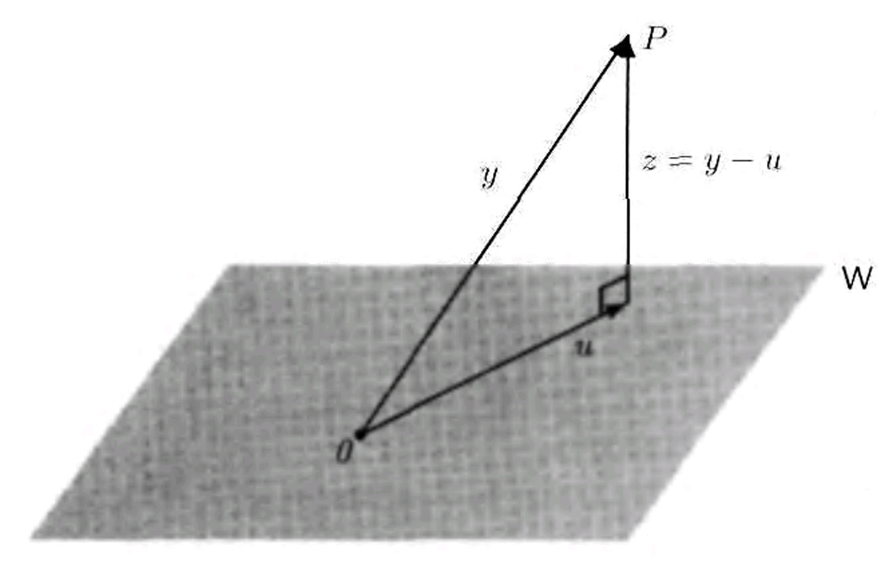

# § 28. The Gram-Schmidt Orthogonalization Process and Orthogonal Complements

We assume that all vector spaces are over the field $F$, where $F$ denotes either $\mathbb{R}$ or $\mathbb{C}$.

## The Gram-Schmidt Orthogonalization Process

!!! definition "Definition 28.1 : Orthonormal Basis"
    Let $V$ be an inner product space.
    A subset of $V$ is an **orthonormal basis** for $V$ if it is an ordered basis that is orthonormal.

!!! theorem "Theorem 28.2 : Orthogonal expansion"
    Let $V$ be an inner product space and $S=\left\{v_{1}, v_{2}, \ldots, v_{k}\right\}$ be an orthogonal subset of $V$ consisting of nonzero vectors.
    If $y \in \operatorname{span}(S)$, then

    $$
    y=\sum_{i=1}^{k} \frac{\left\langle y, v_{i}\right\rangle}{\left\|v_{i}\right\|^{2}} v_{i} .
    $$

    !!! proof
        Write $y=\sum_{i=1}^{k} a_{i} v_{i}$, where $a_{1}, a_{2}, \ldots, a_{k} \in F$.
        Then, for $1 \leq j \leq k$, we have

        $$
        \left\langle y, v_{j}\right\rangle=\left\langle\sum_{i=1}^{k} a_{i} v_{i}, v_{j}\right\rangle=\sum_{i=1}^{k} a_{i}\left\langle v_{i}, v_{j}\right\rangle=a_{j}\left\langle v_{j}, v_{j}\right\rangle=a_{j}\left\|v_{j}\right\|^{2} .
        $$

        So $a_{j}=\frac{\left\langle y, v_{j}\right\rangle}{\left\|v_{j}\right\|^{2}}$, and the result follows.

!!! corollary "Corollary 28.3 : Orthonormal expansion"
    If, in addition to the hypotheses of **Theorem 28.2**, $S$ is orthonormal and $y \in \operatorname{span}(S)$, then

    $$
    y=\sum_{i=1}^{k}\left\langle y, v_{i}\right\rangle v_{i} .
    $$

    If $V$ possesses a finite orthonormal basis, then **Corollary 28.3** allows us to compute the coefficients in a linear combination very easily.

!!! corollary "Corollary 28.4 : Orthogonal sets are linearly independent."
    Let $V$ be an inner product space, and let $S$ be an orthogonal subset of $V$ consisting of nonzero vectors.
    Then $S$ is linearly independent.

    !!! proof
        Suppose that $v_{1}, v_{2}, \ldots, v_{k} \in S$ and

        $$
        \sum_{i=1}^{k} a_{i} v_{i}=0 .
        $$

        As in the proof of **Theorem 28.2** with $y=0$, we have $a_{j}=\left\langle 0, v_{j}\right\rangle /\left\|v_{j}\right\|^{2}=0$ for all $j$.
        So $S$ is linearly independent.

!!! theorem "Theorem 28.5 : Gram-Schmidt orthogonalization"
    Let $V$ be an inner product space and $S=\left\{w_{1}, w_{2}, \ldots, w_{n}\right\}$ be a linearly independent subset of $V$.
    Define $S^{\prime}=\left\{v_{1}, v_{2}, \ldots, v_{n}\right\}$, where $v_{1}=w_{1}$ and

    $$
    v_{k}=w_{k}-\sum_{j=1}^{k-1} \frac{\left\langle w_{k}, v_{j}\right\rangle}{\left\|v_{j}\right\|^{2}} v_{j} \quad \text { for } 2 \leq k \leq n . \tag{1}
    $$

    Then $S^{\prime}$ is an orthogonal set of nonzero vectors such that $\operatorname{span}\left(S^{\prime}\right)=\operatorname{span}(S)$.

    The construction of $\left\{v_{1}, v_{2}, \ldots, v_{n}\right\}$ is called the **Gram-Schmidt process**.

    !!! proof
        The proof is by mathematical induction on $n$, the number of vectors in $S$.
        For $k=1,2, \ldots, n$, let $S_{k}=\left\{w_{1}, w_{2}, \ldots, w_{k}\right\}$.
        If $n=1$, then the theorem is proved by taking $S_{1}^{\prime}=S_{1}$; that is, $v_{1}=w_{1} \neq 0$.
        Assume then that the set $S_{k-1}^{\prime}=\left\{v_{1}, v_{2}, \ldots, v_{k-1}\right\}$ with the desired properties has been constructed by the repeated use of (1).
        We show that the set $S_{k}^{\prime}=\left\{v_{1}, v_{2}, \ldots, v_{k-1}, v_{k}\right\}$ also has the desired properties, where $v_{k}$ is obtained from $S_{k-1}^{\prime}$ by (1).
        If $v_{k}=0$, then (1) implies that $w_{k} \in \operatorname{span}\left(S_{k-1}^{\prime}\right)=\operatorname{span}\left(S_{k-1}\right)$, which contradicts the assumption that $S_{k}$ is linearly independent.
        For $1 \leq i \leq k-1$, it follows from (1) that

        $$
        \left\langle v_{k}, v_{i}\right\rangle=\left\langle w_{k}, v_{i}\right\rangle-\sum_{j=1}^{k-1} \frac{\left\langle w_{k}, v_{j}\right\rangle}{\left\|v_{j}\right\|^{2}}\left\langle v_{j}, v_{i}\right\rangle=\left\langle w_{k}, v_{i}\right\rangle-\frac{\left\langle w_{k}, v_{i}\right\rangle}{\left\|v_{i}\right\|^{2}}\left\|v_{i}\right\|^{2}=0
        $$

        since $\left\langle v_{j}, v_{i}\right\rangle=0$ if $i \neq j$ by the induction assumption that $S_{k-1}^{\prime}$ is orthogonal.
        Hence $S_{k}^{\prime}$ is an orthogonal set of nonzero vectors.
        Now, by (1), we have that $\operatorname{span}\left(S_{k}^{\prime}\right) \subseteq \operatorname{span}\left(S_{k}\right)$.
        But by **Corollary 28.4**, $S_{k}^{\prime}$ is linearly independent; so $\operatorname{dim}\left(\operatorname{span}\left(S_{k}^{\prime}\right)\right)=\operatorname{dim}\left(\operatorname{span}\left(S_{k}\right)\right)=k$.
        Therefore $\operatorname{span}\left(S_{k}^{\prime}\right)=\operatorname{span}\left(S_{k}\right)$.

!!! example "Example 28.6 : Computation of Gram-Schmidt process in $\mathbb{R}^{4}$"
    In $\mathbb{R}^{4}$, let $w_{1}=(1,0,1,0)$, $w_{2}=(1,1,1,1)$, and $w_{3}=(0,1,2,1)$.
    Then $\left\{w_{1}, w_{2}, w_{3}\right\}$ is linearly independent.
    We use the Gram-Schmidt process to compute the orthogonal vectors $v_{1}, v_{2}$, and $v_{3}$, and then we normalize these vectors to obtain an orthonormal set.

    Take $v_{1}=w_{1}=(1,0,1,0)$.
    Then

    $$
    \begin{aligned}
    v_{2} & =w_{2}-\frac{\left\langle w_{2}, v_{1}\right\rangle}{\left\|v_{1}\right\|^{2}} v_{1} \\
    & =(1,1,1,1)-\frac{2}{2}(1,0,1,0) \\
    & =(0,1,0,1) .
    \end{aligned}
    $$

    Finally,

    $$
    \begin{aligned}
    v_{3} & =w_{3}-\frac{\left\langle w_{3}, v_{1}\right\rangle}{\left\|v_{1}\right\|^{2}} v_{1}-\frac{\left\langle w_{3}, v_{2}\right\rangle}{\left\|v_{2}\right\|^{2}} v_{2} \\
    & =(0,1,2,1)-\frac{2}{2}(1,0,1,0)-\frac{2}{2}(0,1,0,1) \\
    & =(-1,0,1,0) .
    \end{aligned}
    $$

    These vectors can be normalized to obtain the orthonormal basis $\left\{u_{1}, u_{2}, u_{3}\right\}$, where

    $$
    \begin{aligned}
    & u_{1}=\frac{1}{\left\|v_{1}\right\|} v_{1}=\frac{1}{\sqrt{2}}(1,0,1,0), \\
    & u_{2}=\frac{1}{\left\|v_{2}\right\|} v_{2}=\frac{1}{\sqrt{2}}(0,1,0,1) .
    \end{aligned}
    $$

    and

    $$
    u_{3}=\frac{v_{3}}{\left\|v_{3}\right\|}=\frac{1}{\sqrt{2}}(-1,0,1,0) .
    $$

!!! example "Example 28.7 : Computation of Gram-Schmidt in $\mathrm{P}_{2}(\mathbb{R})$"
    Let $V=\mathrm{P}(\mathbb{R})$ with the inner product $\langle f(x), g(x)\rangle=\int_{-1}^{1} f(t) g(t) d t$, and consider the subspace $\mathrm{P}_{2}(\mathbb{R})$ with the standard ordered basis $\beta$.
    We use the Gram-Schmidt process to replace $\beta$ by an orthogonal basis $\left\{v_{1}, v_{2}, v_{3}\right\}$ for $\mathrm{P}_{2}(\mathbb{R})$, and then use this orthogonal basis to obtain an orthonormal basis for $\mathrm{P}_{2}(\mathbb{R})$.

    Take $v_{1}=1$.
    Then $\left\|v_{1}\right\|^{2}=\int_{-1}^{1} 1^{2} d t=2$, and $\left\langle x, v_{1}\right\rangle=\int_{-1}^{1} t \cdot 1 d t=0$.
    Thus

    $$
    v_{2}=x-\frac{\left\langle x, v_{1}\right\rangle}{\left\|v_{1}\right\|^{2}}=x-\frac{0}{2}=x .
    $$

    Furthermore,

    $$
    \left\langle x^{2}, v_{1}\right\rangle=\int_{-1}^{1} t^{2} \cdot 1 d t=\frac{2}{3} \quad \text { and } \quad\left\langle x^{2}, v_{2}\right\rangle=\int_{-1}^{1} t^{2} \cdot t d t=0 .
    $$

    Therefore

    $$
    \begin{aligned}
    v_{3} & =x^{2}-\frac{\left\langle x^{2}, v_{1}\right\rangle}{\left\|v_{1}\right\|^{2}} v_{1}-\frac{\left\langle x^{2}, v_{2}\right\rangle}{\left\|v_{2}\right\|^{2}} v_{2} \\
    & =x^{2}-\frac{1}{3} \cdot 1-0 \cdot x \\
    & =x^{2}-\frac{1}{3} .
    \end{aligned}
    $$

    We conclude that $\left\{1, x, x^{2}-\frac{1}{3}\right\}$ is an orthogonal basis for $\mathrm{P}_{2}(\mathbb{R})$.
    To obtain an orthonormal basis, we normalize $v_{1}, v_{2}$, and $v_{3}$ to obtain

    $$
    \begin{aligned}
    & u_{1}=\frac{1}{\sqrt{\int_{-1}^{1} 1^{2} d t}}=\frac{1}{\sqrt{2}} \\
    & u_{2}=\frac{x}{\sqrt{\int_{-1}^{1} t^{2} d t}}=\sqrt{\frac{3}{2}} x
    \end{aligned}
    $$

    and similarly,

    $$
    u_{3}=\frac{v_{3}}{\left\|v_{3}\right\|}=\sqrt{\frac{5}{8}}\left(3 x^{2}-1\right) .
    $$

    Thus $\left\{u_{1}, u_{2}, u_{3}\right\}$ is the desired orthonormal basis for $\mathrm{P}_{2}(\mathbb{R})$.

## Coordinate and Matrix Representation Relative to an Orthonormal Basis

!!! theorem "Theorem 28.8 : Coordinate vector representation relative to an orthonormal basis"
    Let $V$ be a nonzero finite-dimensional inner product space.
    Then $V$ has an orthonormal basis $\beta$.
    Furthermore, if $\beta=\left\{v_{1}, v_{2}, \ldots, v_{n}\right\}$ and $x \in V$, then

    $$
    x=\sum_{i=1}^{n}\left\langle x, v_{i}\right\rangle v_{i} .
    $$

    !!! proof
        Let $\beta_{0}$ be an ordered basis for $V$.
        Apply **Theorem 28.5** to obtain an orthogonal set $\beta^{\prime}$ of nonzero vectors with $\operatorname{span}\left(\beta^{\prime}\right)=\operatorname{span}\left(\beta_{0}\right)=V$.
        By normalizing each vector in $\beta^{\prime}$, we obtain an orthonormal set $\beta$ that generates $V$.
        By **Corollary 28.4**, $\beta$ is linearly independent; therefore $\beta$ is an orthonormal basis for $V$.
        The remainder of the theorem follows from **Corollary 28.3**.

!!! example "Example 28.9 : Computation of coordinates relative to an orthonormal basis in $\mathrm{P}_{2}(\mathbb{R})$"
    We use **Theorem 28.8** to represent the polynomial $f(x)=1+2 x+3 x^{2}$ as a linear combination of the vectors in the orthonormal basis $\left\{u_{1}, u_{2}, u_{3}\right\}$ for $\mathrm{P}_{2}(\mathbb{R})$ obtained in **Example 28.7**.
    Observe that

    $$
    \begin{aligned}
    & \left\langle f(x), u_{1}\right\rangle=\int_{-1}^{1} \frac{1}{\sqrt{2}}\left(1+2 t+3 t^{2}\right) d t=2 \sqrt{2} \\
    & \left\langle f(x), u_{2}\right\rangle=\int_{-1}^{1} \sqrt{\frac{3}{2}} t\left(1+2 t+3 t^{2}\right) d t=\frac{2 \sqrt{6}}{3}
    \end{aligned}
    $$

    and

    $$
    \left\langle f(x), u_{3}\right\rangle=\int_{-1}^{1} \sqrt{\frac{5}{8}}\left(3 t^{2}-1\right)\left(1+2 t+3 t^{2}\right) d t=\frac{2 \sqrt{10}}{5} .
    $$

    Therefore $f(x)=2 \sqrt{2} u_{1}+\frac{2 \sqrt{6}}{3} u_{2}+\frac{2 \sqrt{10}}{5} u_{3}$.

!!! corollary "Corollary 28.10 : Matrix representation of $T$ in an orthonormal basis"
    Let $V$ be a finite-dimensional inner product space with an orthonormal basis $\beta=\left\{v_{1}, v_{2}, \ldots, v_{n}\right\}$.
    Let $T$ be a linear operator on $V$, and let $A=[T]_{\beta}$.
    Then for any $i$ and $j$, $A_{i j}=\left\langle T\left(v_{j}\right), v_{i}\right\rangle$.

    !!! proof
        From **Theorem 28.8**, we have

        $$
        T\left(v_{j}\right)=\sum_{i=1}^{n}\left\langle T\left(v_{j}\right), v_{i}\right\rangle v_{i} .
        $$

        Hence $A_{i j}=\left\langle T\left(v_{j}\right), v_{i}\right\rangle$.

## Fourier Coefficients

!!! definition "Definition 28.11 : Fourier Coefficients"
    Let $\beta$ be an orthonormal subset (possibly infinite) of an inner product space $V$, and let $x \in V$.
    We define the **Fourier coefficients** of $x$ relative to $\beta$ to be the scalars $\langle x, y\rangle$, where $y \in \beta$.

!!! concept "Concept 28.12 : Fourier coefficients in context"
    In the first half of the nineteenth century, the French mathematician Jean Baptiste Fourier was associated with the study of the scalars

    $$
    \int_{0}^{2 \pi} f(t) \sin n t d t \text { and } \int_{0}^{2 \pi} f(t) \cos n t d t
    $$

    or more generally,

    $$
    c_{n}=\frac{1}{2 \pi} \int_{0}^{2 \pi} f(t) e^{-i n t} d t
    $$

    for a function $f$.
    In the context of **Example 27.18**, we see that $c_{n}=\left\langle f, f_{n}\right\rangle$, where $f_{n}(t)=e^{i n t}$.
    That is, $c_{n}$ is the $n$th Fourier coefficient for a continuous function $f \in V$ relative to $S$.
    These coefficients are the "classical" Fourier coefficients of a function, and the literature concerning the behavior of these coefficients is extensive.

!!! example "Example 28.13 : Comptation of fourier coefficient in $H$"
    Let $S=\left\{e^{i n t}: n \text { is an integer }\right\}$.
    In **Example 27.18**, $S$ was shown to be an orthonormal set in $H$.
    We compute the Fourier coefficients of $f(t)=t$ relative to $S$.
    Using integration by parts, we have, for $n \neq 0$,

    $$
    \left\langle f, f_{n}\right\rangle=\frac{1}{2 \pi} \int_{0}^{2 \pi} \overline{t e^{i n t}} d t=\frac{1}{2 \pi} \int_{0}^{2 \pi} t e^{-i n t} d t=\frac{-1}{i n}
    $$

    and, for $n=0$,

    $$
    \langle f, 1\rangle=\frac{1}{2 \pi} \int_{0}^{2 \pi} t(1) d t=\pi .
    $$

    As a result of these computations, and using **Exercise 28.16**, we obtain an upper bound for the sum of a special infinite series as follows:

    $$
    \begin{aligned}
    \|f\|^{2} & \geq \sum_{n=-k}^{-1}\left|\left\langle f, f_{n}\right\rangle\right|^{2}+|\langle f, 1\rangle|^{2}+\sum_{n=1}^{k}\left|\left\langle f, f_{n}\right\rangle\right|^{2} \\
    & =\sum_{n=-k}^{-1} \frac{1}{n^{2}}+\pi^{2}+\sum_{n=1}^{k} \frac{1}{n^{2}} \\
    & =2 \sum_{n=1}^{k} \frac{1}{n^{2}}+\pi^{2}
    \end{aligned}
    $$

    for every $k$.
    Now, using the fact that $\|f\|^{2}=\frac{4}{3} \pi^{2}$, we obtain

    $$
    \frac{4}{3} \pi^{2} \geq 2 \sum_{n=1}^{k} \frac{1}{n^{2}}+\pi^{2}
    $$

    or

    $$
    \frac{\pi^{2}}{6} \geq \sum_{n=1}^{k} \frac{1}{n^{2}} .
    $$

    Because this inequality holds for all $k$, we may let $k \rightarrow \infty$ to obtain

    $$
    \frac{\pi^{2}}{6} \geq \sum_{n=1}^{\infty} \frac{1}{n^{2}} .
    $$

    Additional results may be produced by replacing $f$ by other functions.

## Orthogonal Complements

!!! definition "Definition 28.14 : Orthogonal Complement"
    Let $S$ be a nonempty subset of an inner product space $V$.
    We define $S^{\perp}$ (read "$S$ perp") to be the set of all vectors in $V$ that are orthogonal to every vector in $S$; that is,

    $$
    S^{\perp}=\left\{x \in V: \langle x, y\rangle=0 \text { for all } y \in S\right\} .
    $$

    The set $S^{\perp}$ is called the **orthogonal complement** of $S$.

!!! theorem "Theorem 28.15 : Orthogonal complements are subspaces"
    $S^{\perp}$ is a subspace of $V$ for any subset $S$ of $V$.

    !!! proof
        Since $S$ is nonempty, choose some $y \in S$.
        Then $\langle 0, y\rangle=0$, so $0 \in S^{\perp}$.

        Let $x_{1}, x_{2} \in S^{\perp}$ and let $c \in F$.
        For any $y \in S$, we have $\langle x_{1}, y\rangle=0$ and $\langle x_{2}, y\rangle=0$.
        Using linearity of the inner product in the first variable,
        
        $$
        \langle x_{1}+x_{2}, y\rangle=\langle x_{1}, y\rangle+\langle x_{2}, y\rangle=0+0=0
        $$

        and
        
        $$
        \langle c x_{1}, y\rangle=c\langle x_{1}, y\rangle=c\cdot 0=0.
        $$

        Thus $x_{1}+x_{2} \in S^{\perp}$ and $c x_{1} \in S^{\perp}$.
        Therefore $S^{\perp}$ is a subspace of $V$.

!!! concept "Concept 28.16 : Distance to a plane"
    {: .center style="width:70%;"}
    ///caption
    Figure 28.1.
    ///

    Consider the problem in $\mathbb{R}^{3}$ of finding the distance from a point $P$ to a plane $W$. (See **Figure 28.1**)
    Problems of this type arise in many settings.

    If we let $y$ be the vector determined by $0$ and $P$, we may restate the problem as follows:
    Determine the vector $u$ in $W$ that is "closest" to $y$.
    The desired distance is clearly given by $\|y-u\|$.
    Notice from the figure that the vector $z=y-u$ is orthogonal to every vector in $W$, and so $z \in W^{\perp}$.

    The details and proofs are given in **Theorem 28.17** and **Corollary 28.18**.

!!! theorem "Theorem 28.17 : Orthogonal decomposition"
    Let $W$ be a finite-dimensional subspace of an inner product space $V$, and let $y \in V$.
    Then there exist unique vectors $u \in W$ and $z \in W^{\perp}$ such that $y=u+z$.
    Furthermore, if $\left\{v_{1}, v_{2}, \ldots, v_{k}\right\}$ is an orthonormal basis for $W$, then

    $$
    u=\sum_{i=1}^{k}\left\langle y, v_{i}\right\rangle v_{i} .
    $$

    !!! proof
        Let $\left\{v_{1}, v_{2}, \ldots, v_{k}\right\}$ be an orthonormal basis for $W$, let

        $$
        u=\sum_{i=1}^{k}\left\langle y, v_{i}\right\rangle v_{i},
        $$

        and let $z=y-u$.
        Clearly $u \in W$ and $y=u+z$.

        To show that $z \in W^{\perp}$, we show that $\langle z, w\rangle=0$ for every $w \in W$.
        Let $w \in W$.
        Since $\left\{v_{1}, v_{2}, \ldots, v_{k}\right\}$ is a basis for $W$, there exist scalars $c_{1}, c_{2}, \ldots, c_{k}$ such that

        $$
        w=\sum_{j=1}^{k} c_{j} v_{j} .
        $$

        Using linearity in the first variable and conjugate-linearity in the second variable, we obtain

        $$
        \langle z, w\rangle
        =\left\langle z,\sum_{j=1}^{k} c_{j} v_{j}\right\rangle
        =\sum_{j=1}^{k} \overline{c_{j}}\langle z, v_{j}\rangle.
        $$

        Thus it suffices to show that $\langle z, v_{j}\rangle=0$ for each $j$.
        For any $j$, we have

        $$
        \begin{aligned}
        \left\langle z, v_{j}\right\rangle
        & =\left\langle y-u, v_{j}\right\rangle
        =\left\langle y, v_{j}\right\rangle-\left\langle u, v_{j}\right\rangle \\
        & =\left\langle y, v_{j}\right\rangle-\left\langle \sum_{i=1}^{k}\left\langle y, v_{i}\right\rangle v_{i}, v_{j}\right\rangle \\
        & =\left\langle y, v_{j}\right\rangle-\sum_{i=1}^{k}\left\langle y, v_{i}\right\rangle\left\langle v_{i}, v_{j}\right\rangle \\
        & =\left\langle y, v_{j}\right\rangle-\left\langle y, v_{j}\right\rangle=0,
        \end{aligned}
        $$

        because $\left\{v_{1}, \ldots, v_{k}\right\}$ is orthonormal, so $\langle v_{i}, v_{j}\rangle=0$ when $i \neq j$ and $\langle v_{j}, v_{j}\rangle=1$.
        Hence $\langle z, v_{j}\rangle=0$ for all $j$, and therefore $\langle z, w\rangle=0$ for all $w \in W$.
        This shows that $z \in W^{\perp}$.

        To show uniqueness of $u$ and $z$, suppose that $y=u+z=u^{\prime}+z^{\prime}$, where $u, u^{\prime} \in W$ and $z, z^{\prime} \in W^{\perp}$.
        Then

        $$
        u-u^{\prime}=z^{\prime}-z.
        $$

        The left side belongs to $W$ and the right side belongs to $W^{\perp}$, so $u-u^{\prime} \in W \cap W^{\perp}$.
        We claim that $W \cap W^{\perp}=\{0\}$.
        Indeed, if $x \in W \cap W^{\perp}$, then $x \in W^{\perp}$ implies $\langle x, x\rangle=0$, and by positive definiteness of the inner product, this forces $x=0$.
        Hence $W \cap W^{\perp}=\{0\}$.

        Therefore $u-u^{\prime}=0$, so $u=u^{\prime}$, and then $z=y-u=y-u^{\prime}=z^{\prime}$.
        Thus the decomposition $y=u+z$ with $u \in W$ and $z \in W^{\perp}$ is unique.

!!! corollary "Corollary 28.18 : Closest vector in a subspace"
    In the notation of **Theorem 28.17**, the vector $u$ is the unique vector in $W$ that is "closest" to $y$; that is, for any $x \in W$, $\|y-x\| \geq\|y-u\|$, and this inequality is an equality if and only if $x=u$.

    The vector $u$ in is called the **orthogonal projection** of $y$ on $W$.

    !!! proof
        As in **Theorem 28.17**, we have that $y=u+z$, where $z \in W^{\perp}$.
        Let $x \in W$.
        Then $u-x$ is orthogonal to $z$, so, by **Exercise 27.10**, we have

        $$
        \begin{aligned}
        \|y-x\|^{2} & =\|u+z-x\|^{2}=\|(u-x)+z\|^{2}=\|u-x\|^{2}+\|z\|^{2} \\
        & \geq\|z\|^{2}=\|y-u\|^{2} .
        \end{aligned}
        $$

        Now suppose that $\|y-x\|=\|y-u\|$.
        Then the inequality above becomes an equality, and therefore $\|u-x\|^{2}+\|z\|^{2}=\|z\|^{2}$.
        It follows that $\|u-x\|=0$, and hence $x=u$.
        The proof of the converse is obvious.

!!! example "Example 28.19 : Computation of orthogonal projection in $\mathrm{P}_{3}(\mathbb{R})$"
    Let $V=\mathrm{P}_{3}(\mathbb{R})$ with the inner product

    $$
    \langle f(x), g(x)\rangle=\int_{-1}^{1} f(t) g(t) d t \quad \text { for all } f(x), g(x) \in V .
    $$

    We compute the orthogonal projection $f_{1}(x)$ of $f(x)=x^{3}$ on $\mathrm{P}_{2}(\mathbb{R})$.
    By **Example 28.7**,

    $$
    \left\{u_{1}, u_{2}, u_{3}\right\}=\left\{\frac{1}{\sqrt{2}}, \sqrt{\frac{3}{2}} x, \sqrt{\frac{5}{8}}\left(3 x^{2}-1\right)\right\}
    $$

    is an orthonormal basis for $\mathrm{P}_{2}(\mathbb{R})$.
    For these vectors, we have

    $$
    \left\langle f(x), u_{1}\right\rangle=\int_{-1}^{1} t^{3} \frac{1}{\sqrt{2}} d t=0, \quad\left\langle f(x), u_{2}\right\rangle=\int_{-1}^{1} t^{3} \sqrt{\frac{3}{2}} t d t=\frac{\sqrt{6}}{5}
    $$

    and

    $$
    \left\langle f(x), u_{3}\right\rangle=\int_{-1}^{1} t^{3} \sqrt{\frac{5}{8}}\left(3 t^{2}-1\right) d t=0 .
    $$

    Hence

    $$
    f_{1}(x)=\left\langle f(x), u_{1}\right\rangle u_{1}+\left\langle f(x), u_{2}\right\rangle u_{2}+\left\langle f(x), u_{3}\right\rangle u_{3}=\frac{3}{5} x .
    $$

!!! theorem "Theorem 28.20 : Extensions and orthogonal complements"
    Suppose that $S=\left\{v_{1}, v_{2}, \ldots, v_{k}\right\}$ is an orthonormal set in an $n$-dimensional inner product space $V$.
    Then

    - (a) $S$ can be extended to an orthonormal basis $\left\{v_{1}, v_{2}, \ldots, v_{k}, v_{k+1}, \ldots, v_{n}\right\}$ for $V$.
    - (b) If $W=\operatorname{span}(S)$, then $S_{1}=\left\{v_{k+1}, v_{k+2}, \ldots, v_{n}\right\}$ is an orthonormal basis for $W^{\perp}$ (using the preceding notation).
    - (c) If $W$ is any subspace of $V$, then $\operatorname{dim}(V)=\operatorname{dim}(W)+\operatorname{dim}\left(W^{\perp}\right)$.

    !!! proof
        - (a)  
            By **Corollary 6.13**, $S$ can be extended to an ordered basis $S^{\prime}=\left\{v_{1}, v_{2}, \ldots, v_{k}, w_{k+1}, \ldots, w_{n}\right\}$ for $V$.
            Now apply the Gram-Schmidt process to $S^{\prime}$.
            The first $k$ vectors resulting from this process are the vectors in $S$, and this new set spans $V$.
            Normalizing the last $n-k$ vectors of this set produces an orthonormal set that spans $V$.
            The result now follows.
        
        - (b)  
            Because $S_{1}$ is a subset of a basis, it is linearly independent.
            Since $S_{1}$ is clearly a subset of $W^{\perp}$, we need only show that it spans $W^{\perp}$.
            Note that, for any $x \in V$, we have

            $$
            x=\sum_{i=1}^{n}\left\langle x, v_{i}\right\rangle v_{i} .
            $$

            If $x \in W^{\perp}$, then $\left\langle x, v_{i}\right\rangle=0$ for $1 \leq i \leq k$.
            Therefore,

            $$
            x=\sum_{i=k+1}^{n}\left\langle x, v_{i}\right\rangle v_{i} \in \operatorname{span}\left(S_{1}\right) .
            $$

        - (c)  
            Let $W$ be a subspace of $V$.
            It is a finite-dimensional inner product space because $V$ is, and so it has an orthonormal basis $\left\{v_{1}, v_{2}, \ldots, v_{k}\right\}$.
            By (a) and (b), we have

            $$
            \operatorname{dim}(V)=n=k+(n-k)=\operatorname{dim}(W)+\operatorname{dim}\left(W^{\perp}\right) .
            $$

## Exercise

!!! exercise "Exercise 28.6"
    Let $V$ be an inner product space, and let $W$ be a finite-dimensional subspace of $V$.
    If $x \notin W$, prove that there exists $y \in V$ such that $y \in W^{\perp}$, but $\langle x, y\rangle \neq 0$.

    Hint: Use **Theorem 28.17**.

!!! exercise "Exercise 28.10"
    Let $W$ be a finite-dimensional subspace of an inner product space $V$.
    Prove that there exists a projection $T$ on $W$ along $W^{\perp}$ that satisfies $N(T)=W^{\perp}$.
    In addition, prove that $\|T(x)\| \leq\|x\|$ for all $x \in V$.

    Hint: Use **Theorem 28.17** and **Exercise 27.10**.
    (Projections are defined in the exercises of **Section 8**.)

!!! exercise "Exercise 28.11"
    Let $A$ be an $n \times n$ matrix with complex entries.
    Prove that $A A^{*}=I$ if and only if the rows of $A$ form an orthonormal basis for $\mathbb{C}^{n}$.

!!! exercise "Exercise 28.12"
    Prove that for any matrix $A \in \mathrm{M}_{m \times n}(F)$, $\left(R\left(L_{A^{*}}\right)\right)^{\perp}=N\left(L_{A}\right)$.

!!! exercise "Exercise 28.13"
    Let $V$ be an inner product space, let $S$ and $S_{0}$ be subsets of $V$, and let $W$ be a finite-dimensional subspace of $V$.
    Prove the following results.

    - (a) $S_{0} \subseteq S$ implies that $S^{\perp} \subseteq S_{0}^{\perp}$.
    - (b) $S \subseteq\left(S^{\perp}\right)^{\perp}$, so $\operatorname{span}(S) \subseteq\left(S^{\perp}\right)^{\perp}$.
    - (c) $W=\left(W^{\perp}\right)^{\perp}$.
        
        Hint: Use **Exercise 28.6**.
    - (d) $V=W \ominus W^{\perp}$.
    (See the exercises of **Section 3**.)

!!! exercise "Exercise 28.14"
    Let $W_{1}$ and $W_{2}$ be subspaces of a finite-dimensional inner product space.
    Prove that $\left(W_{1}+W_{2}\right)^{\perp}=W_{1}^{\perp} \cap W_{2}^{\perp}$ and $\left(W_{1} \cap W_{2}\right)^{\perp}=W_{1}^{\perp}+W_{2}^{\perp}$.

    Hint for the second equation: Apply **Exercise 28.13**(c) to the first equation.

!!! exercise "Exercise 28.15"
    Let $V$ be a finite-dimensional inner product space over $F$.

    - (a) Parseval's identity.
        Let $\left\{v_{1}, v_{2}, \ldots, v_{n}\right\}$ be an orthonormal basis for $V$.
        For any $x, y \in V$ prove that

        $$
        \langle x, y\rangle=\sum_{i=1}^{n}\left\langle x, v_{i}\right\rangle \overline{\left\langle y, v_{i}\right\rangle} .
        $$

    - (b) Use (a) to prove that if $\beta$ is an orthonormal basis for $V$ with inner product $\langle\cdot, \cdot\rangle$, then for any $x, y \in V$

        $$
        \left\langle\phi_{\beta}(x), \phi_{\beta}(y)\right\rangle^{\prime}=\left\langle[x]_{\beta},[y]_{\beta}\right\rangle^{\prime}=\langle x, y\rangle,
        $$

        where $\langle\cdot, \cdot\rangle^{\prime}$ is the standard inner product on $F^{n}$.

!!! exercise "Exercise 28.16"
    - (a) Bessel's inequality.
        Let $V$ be an inner product space, and let $S=\left\{v_{1}, v_{2}, \ldots v_{n}\right\}$ be an orthonormal subset of $V$.
        Prove that for any $x \in V$ we have

        $$
        \|x\|^{2} \geq \sum_{i=1}^{n}\left|\left\langle x, v_{i}\right\rangle\right|^{2} .
        $$

        Hint: Apply **Theorem 28.17** to $x \in V$ and $W=\operatorname{span}(S)$.
        Then use **Exercise 27.10**.
    - (b) In the context of (a), prove that Bessel's inequality is an equality if and only if $x \in \operatorname{span}(S)$.

!!! exercise "Exercise 28.17"
    Let $T$ be a linear operator on an inner product space $V$.
    If $\langle T(x), y\rangle=0$ for all $x, y \in V$, prove that $T=T_{0}$.
    In fact, prove this result if the equality holds for all $x$ and $y$ in some basis for $V$.

!!! exercise "Exercise 28.18"
    Let $V=C([-1,1])$.
    Suppose that $W_{e}$ and $W_{o}$ denote the subspaces of $V$ consisting of the even and odd functions, respectively.
    (See **Exercise 3.22**.)
    Prove that $W_{e}^{\perp}=W_{o}$, where the inner product on $V$ is defined by

    $$
    \langle f, g\rangle=\int_{-1}^{1} f(t) g(t) d t .
    $$

!!! exercise "Exercise 28.23"
    Let $V$ be the vector space defined in Example 5 of Section 1.2, the space of all sequences $\sigma$ in $F$ (where $F=\mathbb{R}$ or $F=\mathbb{C}$) such that $\sigma(n) \neq 0$ for only finitely many positive integers $n$.
    For $\sigma, \mu \in V$, we define $\langle\sigma, \mu\rangle=\sum_{n=1}^{\infty} \sigma(n) \overline{\mu(n)}$.
    Since all but a finite number of terms of the series are zero, the series converges.

    - (a) Prove that $\langle\cdot, \cdot\rangle$ is an inner product on $V$, and hence $V$ is an inner product space.
    - (b) For each positive integer $n$, let $e_{n}$ be the sequence defined by $e_{n}(k)=\delta_{n, k}$, where $\delta_{n, k}$ is the Kronecker delta.
        Prove that $\left\{e_{1}, e_{2}, \ldots\right\}$ is an orthonormal basis for $V$.
    - (c) Let $\sigma_{n}=e_{1}+e_{n}$ and $W=\operatorname{span}\left(\left\{\sigma_{n}: n \geq 2\right\}\right)$.
        - (i) Prove that $e_{1} \notin W$, so $W \neq V$.
        - (ii) Prove that $W^{\perp}=\{0\}$, and conclude that $W \neq\left(W^{\perp}\right)^{\perp}$.

    Thus the assumption in **Exercise 28.13**(c) that $W$ is finite-dimensional is essential.
