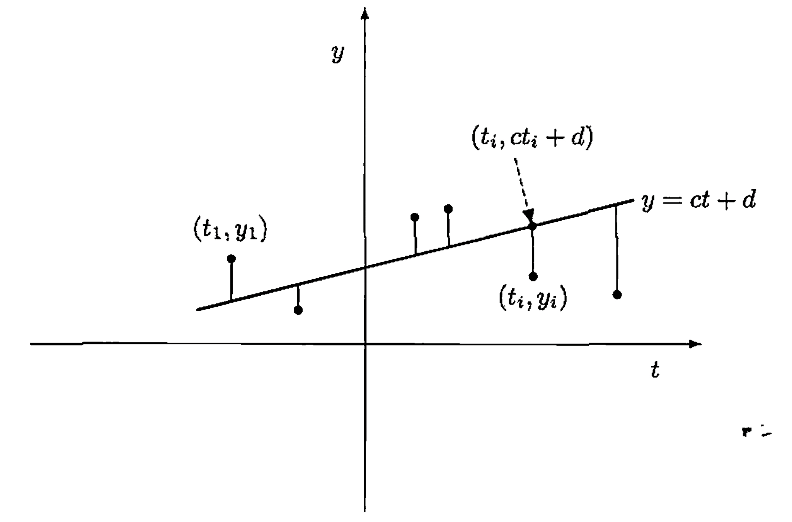

# § 29. The Adjoint of a Linear Operator

We assume that all vector spaces are over the field $F$, where $F$ denotes either $\mathbb{R}$ or $\mathbb{C}$.

For a linear operator $T$ on an inner product space $V$, we now define a related linear operator on $V$ called the adjoint of $T$, whose matrix representation with respect to any orthonormal basis $\beta$ for $V$ is $[T]_{\beta}^{*}$.
The analogy between conjugation of complex numbers and adjoints of linear operators will become apparent.

## The Adjoint of a Linear Operator

!!! theorem "Theorem 29.1 : Representation of linear functionals by inner products"
    Let $V$ be a finite-dimensional inner product space over $F$, and let $g: V \rightarrow F$ be a linear transformation.
    Then there exists a unique vector $y \in V$ such that $g(x)=\langle x, y\rangle$ for all $x \in V$.

    !!! proof
        Let $\beta=\left\{v_{1}, v_{2}, \ldots, v_{n}\right\}$ be an orthonormal basis for $V$, and let

        $$
        y=\sum_{i=1}^{n} \overline{g\left(v_{i}\right)} v_{i} .
        $$

        Define $h: V \rightarrow F$ by $h(x)=\langle x, y\rangle$, which is clearly linear.
        Furthermore, for $1 \leq j \leq n$ we have

        $$
        \begin{aligned}
        h\left(v_{j}\right)
        =\left\langle v_{j}, y\right\rangle
        =\left\langle v_{j}, \sum_{i=1}^{n} \overline{g\left(v_{i}\right)} v_{i}\right\rangle
        & =\sum_{i=1}^{n} g\left(v_{i}\right)\left\langle v_{j}, v_{i}\right\rangle \\
        & =\sum_{i=1}^{n} g\left(v_{i}\right) \delta_{j i}=g\left(v_{j}\right) .
        \end{aligned}
        $$

        Since $g$ and $h$ both agree on $\beta$, we have $g=h$ by the corollary to **Theorem 2.6**.

        To show that $y$ is unique, suppose that $g(x)=\left\langle x, y^{\prime}\right\rangle$ for all $x$.
        Then $\langle x, y\rangle=\left\langle x, y^{\prime}\right\rangle$ for all $x$.
        So by **Theorem 27.10**(e), we have $y=y^{\prime}$.

!!! theorem "Theorem 29.2 : Existence and uniqueness of adjoint"
    Let $V$ be a finite-dimensional inner product space, and let $T$ be a linear operator on $V$.
    Then there exists a unique function $T^{*}: V \rightarrow V$ such that $\langle T(x), y\rangle=\left\langle x, T^{*}(y)\right\rangle$ for all $x, y \in V$.
    Furthermore, $T^{*}$ is linear.

    !!! proof
        Let $y \in V$.
        Define $g: V \rightarrow F$ by $g(x)=\langle T(x), y\rangle$ for all $x \in V$.
        We first show that $g$ is linear.
        Let $x_{1}, x_{2} \in V$ and $c \in F$.
        Then

        $$
        \begin{aligned}
        g\left(c x_{1}+x_{2}\right)
        & =\left\langle T\left(c x_{1}+x_{2}\right), y\right\rangle
        =\left\langle c T\left(x_{1}\right)+T\left(x_{2}\right), y\right\rangle \\
        & =c\left\langle T\left(x_{1}\right), y\right\rangle+\left\langle T\left(x_{2}\right), y\right\rangle
        =c g\left(x_{1}\right)+g\left(x_{2}\right) .
        \end{aligned}
        $$

        Hence $g$ is linear.
        We now apply **Theorem 29.1** to obtain a unique vector $y^{\prime} \in V$ such that $g(x)=\left\langle x, y^{\prime}\right\rangle$.
        That is, $\langle T(x), y\rangle=\left\langle x, y^{\prime}\right\rangle$ for all $x \in V$.
        Define $T^{*}: V \rightarrow V$ by $T^{*}(y)=y^{\prime}$.
        Then $\langle T(x), y\rangle=\left\langle x, T^{*}(y)\right\rangle$.

        To show that $T^{*}$ is linear, let $y_{1}, y_{2} \in V$ and $c \in F$.
        For any $x \in V$, we have

        $$
        \begin{aligned}
        \left\langle x, T^{*}\left(c y_{1}+y_{2}\right)\right\rangle
        & =\left\langle T(x), c y_{1}+y_{2}\right\rangle \\
        & =\overline{c}\left\langle T(x), y_{1}\right\rangle+\left\langle T(x), y_{2}\right\rangle \\
        & =\overline{c}\left\langle x, T^{*}\left(y_{1}\right)\right\rangle+\left\langle x, T^{*}\left(y_{2}\right)\right\rangle \\
        & =\left\langle x, c T^{*}\left(y_{1}\right)+T^{*}\left(y_{2}\right)\right\rangle .
        \end{aligned}
        $$

        Since $x$ is arbitrary, $T^{*}\left(c y_{1}+y_{2}\right)=c T^{*}\left(y_{1}\right)+T^{*}\left(y_{2}\right)$ by **Theorem 27.10**(e).

        Finally, we show uniqueness.
        Suppose that $U: V \rightarrow V$ is linear and satisfies $\langle T(x), y\rangle=\langle x, U(y)\rangle$ for all $x, y \in V$.
        Then $\left\langle x, T^{*}(y)\right\rangle=\langle x, U(y)\rangle$ for all $x, y \in V$.
        So $T^{*}=U$ by **Theorem 27.10**(e).

!!! definition "Definition 29.3 : Adjoint"
    The linear operator $T^{*}$ described in **Theorem 29.2** is called the **adjoint** of the operator $T$.
    The symbol $T^{*}$ is read "$T$ star."

!!! concept "Concept 29.4 : Symbolic meaning of adjoint"
    $T^{*}$ is the unique operator on $V$ satisfying $\langle T(x), y\rangle=\left\langle x, T^{*}(y)\right\rangle$ for all $x, y \in V$.
    Note that we also have

    $$
    \left\langle x, T(y)\right\rangle=\overline{\langle T(y), x\rangle}=\overline{\left\langle y, T^{*}(x)\right\rangle}=\left\langle T^{*}(x), y\right\rangle .
    $$

    So $\langle x, T(y)\rangle=\left\langle T^{*}(x), y\right\rangle$ for all $x, y \in V$.

    We may view these equations symbolically as adding a $*$ to $T$ when shifting its position inside the inner product.

!!! concept "Concept 29.5 : Adjoint in infinite-dimensional spaces"
    For an infinite-dimensional inner product space, the adjoint of a linear operator $T$ may be defined to be the function $T^{*}$ such that $\langle T(x), y\rangle=\left\langle x, T^{*}(y)\right\rangle$ for all $x, y \in V$, provided it exists.
    Although the uniqueness and linearity of $T^{*}$ follow as before, the existence of the adjoint is not guaranteed.
    The reader should observe the necessity of the finite-dimensional hypothesis in the proof of **Theorem 29.1**.

Many theorems about adjoints do not depend on $V$ being finite-dimensional.
Thus, unless stated otherwise, for the remainder of this chapter we adopt the convention that a reference to the adjoint of a linear operator on an infinite-dimensional inner product space assumes its existence.

!!! theorem "Theorem 29.6 : Matrix of the adjoint in an orthonormal basis"
    Let $V$ be a finite-dimensional inner product space, and let $\beta$ be an orthonormal basis for $V$.
    If $T$ is a linear operator on $V$, then

    $$
    \left[T^{*}\right]_{\beta}=[T]_{\beta}^{*} .
    $$

    !!! proof
        Let $A=[T]_{\beta}$, $B=\left[T^{*}\right]_{\beta}$, and $\beta=\left\{v_{1}, v_{2}, \ldots, v_{n}\right\}$.
        Then from **Corollary 28.10**, we have

        $$
        B_{i j}=\left\langle T^{*}\left(v_{j}\right), v_{i}\right\rangle=\overline{\left\langle v_{i}, T^{*}\left(v_{j}\right)\right\rangle}=\overline{\left\langle T\left(v_{i}\right), v_{j}\right\rangle}=\overline{A_{j i}}=\left(A^{*}\right)_{i j} .
        $$

        Hence $B=A^{*}$.

!!! corollary "Corollary 29.7 : Adjoint of $L_A$"
    Let $A$ be an $n \times n$ matrix.
    Then $L_{A^{*}}=\left(L_{A}\right)^{*}$.

    !!! proof
        If $\beta$ is the standard ordered basis for $F^{n}$, then by **Theorem 10.16**(a), we have $\left[L_{A}\right]_{\beta}=A$.
        Hence

        $$
        \left[\left(L_{A}\right)^{*}\right]_{\beta}=\left[L_{A}\right]_{\beta}^{*}=A^{*}=\left[L_{A^{*}}\right]_{\beta} .
        $$

        So $\left(L_{A}\right)^{*}=L_{A^{*}}$.

!!! example "Example 29.8 : Computing an adjoint on $\mathbb{C}^{2}$"
    Let $T$ be the linear operator on $\mathbb{C}^{2}$ defined by $T\left(a_{1}, a_{2}\right)=\left(2 i a_{1}+3 a_{2}, a_{1}-a_{2}\right)$.
    If $\beta$ is the standard ordered basis for $\mathbb{C}^{2}$, then

    $$
    [T]_{\beta}=\left(\begin{array}{rr}
    2 i & 3 \\
    1 & -1
    \end{array}\right) .
    $$

    So

    $$
    \left[T^{*}\right]_{\beta}=[T]_{\beta}^{*}=\left(\begin{array}{rr}
    -2 i & 1 \\
    3 & -1
    \end{array}\right) .
    $$

    Hence

    $$
    T^{*}\left(a_{1}, a_{2}\right)=\left(-2 i a_{1}+a_{2}, 3 a_{1}-a_{2}\right) .
    $$

!!! theorem "Theorem 29.9 : Algebraic properties of adjoints"
    Let $V$ be an inner product space, and let $T$ and $U$ be linear operators on $V$.
    Then

    - (a) $(T+U)^{*}=T^{*}+U^{*}$.
    - (b) $(c T)^{*}=\overline{c}\, T^{*}$ for any $c \in F$.
    - (c) $(T U)^{*}=U^{*} T^{*}$.
    - (d) $T^{* *}=T$.
    - (e) $I^{*}=I$.

    !!! proof
        Let $x, y \in V$.

        - (a)  
            We show that $T^{*}+U^{*}$ satisfies the defining property of $(T+U)^{*}$.
            Using linearity of $T+U$ and linearity of the inner product in the first variable,

            $$
            \begin{aligned}
            \left\langle (T+U)(x), y\right\rangle
            & =\langle T(x)+U(x), y\rangle \\
            & =\langle T(x), y\rangle+\langle U(x), y\rangle \\
            & =\left\langle x, T^{*}(y)\right\rangle+\left\langle x, U^{*}(y)\right\rangle \\
            & =\left\langle x,\, T^{*}(y)+U^{*}(y)\right\rangle \\
            & =\left\langle x,\,(T^{*}+U^{*})(y)\right\rangle .
            \end{aligned}
            $$

            Hence $T^{*}+U^{*}$ has the defining property of the adjoint of $T+U$.
            By uniqueness of adjoints, $(T+U)^{*}=T^{*}+U^{*}$.

        - (b)  
            We show that $\overline{c}\,T^{*}$ satisfies the defining property of $(cT)^{*}$.
            Using linearity of $T$ and conjugate-linearity in the second variable,

            $$
            \begin{aligned}
            \langle (cT)(x), y\rangle
            & =\langle c\,T(x), y\rangle
            =c\,\langle T(x), y\rangle \\
            & =c\,\langle x, T^{*}(y)\rangle
            =\langle x, \overline{c}\,T^{*}(y)\rangle
            =\left\langle x, (\overline{c}\,T^{*})(y)\right\rangle .
            \end{aligned}
            $$

            Therefore, by uniqueness of adjoints, $(cT)^{*}=\overline{c}\,T^{*}$.

        - (c)  
            We show that $U^{*}T^{*}$ satisfies the defining property of $(TU)^{*}$.
            Using the defining property of adjoints twice,

            $$
            \begin{aligned}
            \langle (TU)(x), y\rangle
            & =\langle T(U(x)), y\rangle
            =\langle U(x), T^{*}(y)\rangle \\
            & =\left\langle x, U^{*}(T^{*}(y))\right\rangle
            =\left\langle x, (U^{*}T^{*})(y)\right\rangle .
            \end{aligned}
            $$

            Hence, by uniqueness of adjoints, $(TU)^{*}=U^{*}T^{*}$.

        - (d)  
            We show that $T$ satisfies the defining property of $(T^{*})^{*}$.
            Using the defining property of $T^{*}$,

            $$
            \langle T(x), y\rangle=\langle x, T^{*}(y)\rangle .
            $$

            Now apply the defining property of $(T^{*})^{*}$ to the operator $T^{*}$ (with $x$ and $y$ swapped):

            $$
            \langle x, T^{*}(y)\rangle=\left\langle (T^{*})^{*}(x), y\right\rangle .
            $$

            Combining these equalities gives

            $$
            \langle T(x), y\rangle=\left\langle (T^{*})^{*}(x), y\right\rangle
            $$

            for all $x, y \in V$.
            Hence $T(x)=(T^{*})^{*}(x)$ for all $x$, so $T^{**}=T$.

        - (e)  
            We show that $I$ satisfies the defining property of $I^{*}$.
            For all $x, y \in V$,

            $$
            \langle I(x), y\rangle=\langle x, y\rangle=\langle x, I(y)\rangle .
            $$

            Thus $I$ has the defining property of the adjoint of $I$.
            By uniqueness of adjoints, $I^{*}=I$.

!!! corollary "Corollary 29.10 : Conjugate-transpose identities"
    Let $A$ and $B$ be $n \times n$ matrices.
    Then

    - (a) $(A+B)^{*}=A^{*}+B^{*}$.
    - (b) $(c A)^{*}=\overline{c} A^{*}$ for all $c \in F$.
    - (c) $(A B)^{*}=B^{*} A^{*}$.
    - (d) $A^{* *}=A$.
    - (e) $I^{*}=I$.

    !!! proof
        View matrices as linear operators on $F^{n}$ via left multiplication.
        For any $n \times n$ matrix $M$, the adjoint of $L_{M}$ is $L_{M^{*}}$, because for all $x, y \in F^{n}$,

        $$
        \langle L_{M}(x), y\rangle=\langle Mx, y\rangle=\langle x, M^{*}y\rangle=\langle x, L_{M^{*}}(y)\rangle .
        $$

        Therefore $(L_{M})^{*}=L_{M^{*}}$.

        Now apply **Theorem 29.9** to the operators $L_{A}$ and $L_{B}$:

        - (a)  

            $$
            L_{(A+B)^{*}}=(L_{A+B})^{*}=(L_{A}+L_{B})^{*}=(L_{A})^{*}+(L_{B})^{*}=L_{A^{*}}+L_{B^{*}}=L_{A^{*}+B^{*}} .
            $$

            Hence $(A+B)^{*}=A^{*}+B^{*}$.

        - (b)  

            $$
            L_{(cA)^{*}}=(L_{cA})^{*}=(cL_{A})^{*}=\overline{c}\,(L_{A})^{*}=\overline{c}\,L_{A^{*}}=L_{\overline{c}\,A^{*}} .
            $$

            Hence $(cA)^{*}=\overline{c}\,A^{*}$.

        - (c)  

            $$
            L_{(AB)^{*}}=(L_{AB})^{*}=(L_{A}L_{B})^{*}=(L_{B})^{*}(L_{A})^{*}=L_{B^{*}}L_{A^{*}}=L_{B^{*}A^{*}} .
            $$

            Hence $(AB)^{*}=B^{*}A^{*}$.

        - (d)  

            $$
            L_{A^{**}}=(L_{A^{*}})^{*}=\big((L_{A})^{*}\big)^{*}=L_{A}
            $$

            by **Theorem 29.9**(d).
            Hence $A^{**}=A$.

        - (e)  
            Since $L_{I}=I$ on $F^{n}$, **Theorem 29.9**(e) gives $(L_{I})^{*}=L_{I}$.
            Thus $L_{I^{*}}=L_{I}$, and hence $I^{*}=I$.

## Least Squares Approximation

!!! definition "Definition 29.11 : Least squares approximation problem"
    Consider the following problem.
    An experimenter collects data by taking measurements $y_{1}, y_{2}, \ldots, y_{m}$ at times $t_{1}, t_{2}, \ldots, t_{m}$, respectively.
    For example, he or she may be measuring unemployment at various times during some period.
    Suppose that the data $\left(t_{1}, y_{1}\right),\left(t_{2}, y_{2}\right), \ldots,\left(t_{m}, y_{m}\right)$ are plotted as points in the plane.
    From this plot, the experimenter feels that there exists an essentially linear relationship between $y$ and $t$, say $y=c t+d$, and would like to find the constants $c$ and $d$ so that the line $y=c t+d$ represents the best possible fit to the data collected.
    One such estimate of fit is to calculate the error $E$ that represents the sum of the squares of the vertical distances from the points to the line, that is,

    $$
    E=\sum_{i=1}^{m}\left(y_i-c t_i-d\right)^{2} .
    $$

    {: .center style="width:70%;"}
    ///caption
    Figure 29.1.
    ///

    Thus the problem is reduced to finding the constants $c$ and $d$ that minimize $E$. (This problem is called **least squares approximation**, and the line $y=c t+d$ is called the **least-squares line**.)

    If we let

    $$
    A=\left(\begin{array}{cc}
    t_{1} & 1 \\
    t_{2} & 1 \\
    \vdots & \vdots \\
    t_{m} & 1
    \end{array}\right), \quad x=\binom{c}{d}, \quad \text { and } \quad y=\left(\begin{array}{c}
    y_{1} \\
    y_{2} \\
    \vdots \\
    y_{m}
    \end{array}\right),
    $$

    then it follows that $E=\|y-A x\|^{2}$.

    We develop a general method for finding an explicit vector $x_{0} \in F^{n}$ that minimizes $E$ in **Theorem 29.15**.
    That is, given an $m \times n$ matrix $A$, we find $x_{0} \in F^{n}$ such that $\left\|y-A x_{0}\right\| \leq\|y-A x\|$ for all vectors $x \in F^{n}$.
    This method not only allows us to find the linear function that best fits the data, but also, for any positive integer $k$, the best fit using a polynomial of degree at most $k$.

For $x, y \in F^{n}$, let $\langle x, y\rangle_{n}$ denote the standard inner product of $x$ and $y$ in $F^{n}$.
Recall that if $x$ and $y$ are regarded as column vectors, then $\langle x, y\rangle_{n}=y^{*} x$.

!!! theorem "Lemma 29.12"
    Let $A \in \mathrm{M}_{m \times n}(F)$, $x \in F^{n}$, and $y \in F^{m}$.
    Then

    $$
    \langle A x, y\rangle_{m}=\left\langle x, A^{*} y\right\rangle_{n} .
    $$

    !!! proof
        By a generalization of the corollary to **Theorem 29.9**, we have

        $$
        \langle A x, y\rangle_{m}=y^{*}(A x)=\left(y^{*} A\right) x=\left(A^{*} y\right)^{*} x=\left\langle x, A^{*} y\right\rangle_{n} .
        $$

!!! theorem "Lemma 29.13"
    Let $A \in \mathrm{M}_{m \times n}(F)$.
    Then $\operatorname{rank}\left(A^{*} A\right)=\operatorname{rank}(A)$.

    !!! proof
        By the dimension theorem, we need only show that, for $x \in F^{n}$, we have $A^{*} A x=0$ if and only if $A x=0$.
        Clearly, $A x=0$ implies that $A^{*} A x=0$.
        So assume that $A^{*} A x=0$.
        Then

        $$
        0=\left\langle A^{*} A x, x\right\rangle_{n}=\left\langle A x, A^{* *} x\right\rangle_{m}=\langle A x, A x\rangle_{m},
        $$

        so $A x=0$.

!!! corollary "Corollary 29.14"
    If $A$ is an $m \times n$ matrix such that $\operatorname{rank}(A)=n$, then $A^{*} A$ is invertible.

!!! theorem "Theorem 29.15 : Least squares approximation"
    Let $A \in \mathrm{M}_{m \times n}(F)$ and $y \in F^{m}$.
    Then there exists $x_{0} \in F^{n}$ such that $\left(A^{*} A\right) x_{0}=A^{*} y$ and $\left\|A x_{0}-y\right\| \leq\|A x-y\|$ for all $x \in F^{n}$.
    Furthermore, if $\operatorname{rank}(A)=n$, then $x_{0}=\left(A^{*} A\right)^{-1} A^{*} y$.

    !!! proof
        Let $A$ be an $m \times n$ matrix and $y \in F^{m}$.
        Define $W=\left\{A x: x \in F^{n}\right\}$.
        That is, $W=R\left(L_{A}\right)$.
        By **Corollary 28.18**, there exists a unique vector in $W$ that is closest to $y$.
        Call this vector $A x_{0}$, where $x_{0} \in F^{n}$.
        Then $\left\|A x_{0}-y\right\| \leq\|A x-y\|$ for all $x \in F^{n}$.

        To develop a practical method for finding such an $x_{0}$, we note from **Theorem 28.17** and **Corollary 28.18** that $A x_{0}-y \in W^{\perp}$, so $\langle A x, A x_{0}-y\rangle_{m}=0$ for all $x \in F^{n}$.
        Thus, by **Lemma 29.12**, we have

        $$
        \left\langle x, A^{*}\left(A x_{0}-y\right)\right\rangle_{n}=0
        $$

        for all $x \in F^{n}$.
        That is, $A^{*}\left(A x_{0}-y\right)=0$.
        So we need only find a solution $x_{0}$ to $A^{*} A x=A^{*} y$.
        If, in addition, we assume that $\operatorname{rank}(A)=n$, then by **Lemma 29.13** we have $x_{0}=\left(A^{*} A\right)^{-1} A^{*} y$.

!!! example "Example 29.16 : Computation of least squares approximation"
    To return to our experimenter, let us suppose that the data collected are $(1,2)$, $(2,3)$, $(3,5)$, and $(4,7)$.
    Then

    $$
    A=\left(\begin{array}{ll}
    1 & 1 \\
    2 & 1 \\
    3 & 1 \\
    4 & 1
    \end{array}\right) \quad \text { and } \quad y=\left(\begin{array}{l}
    2 \\
    3 \\
    5 \\
    7
    \end{array}\right),
    $$

    hence

    $$
    A^{*} A=\left(\begin{array}{llll}
    1 & 2 & 3 & 4 \\
    1 & 1 & 1 & 1
    \end{array}\right)\left(\begin{array}{ll}
    1 & 1 \\
    2 & 1 \\
    3 & 1 \\
    4 & 1
    \end{array}\right)=\left(\begin{array}{rr}
    30 & 10 \\
    10 & 4
    \end{array}\right) .
    $$

    Thus

    $$
    \left(A^{*} A\right)^{-1}=\frac{1}{20}\left(\begin{array}{rr}
    4 & -10 \\
    -10 & 30
    \end{array}\right) .
    $$

    Therefore

    $$
    \binom{c}{d}=x_{0}=\frac{1}{20}\left(\begin{array}{rr}
    4 & -10 \\
    -10 & 30
    \end{array}\right)\left(\begin{array}{llll}
    1 & 2 & 3 & 4 \\
    1 & 1 & 1 & 1
    \end{array}\right)\left(\begin{array}{l}
    2 \\
    3 \\
    5 \\
    7
    \end{array}\right)=\binom{1.7}{0} .
    $$

    It follows that the line $y=1.7 t$ is the least-squares line.
    The error $E$ may be computed directly as $\left\|A x_{0}-y\right\|^{2}=0.3$.

    Suppose that the experimenter chose the times $t_{i}$ ($1 \leq i \leq m$) to satisfy

    $$
    \sum_{i=1}^{m} t_{i}=0 .
    $$

    Then the two columns of $A$ would be orthogonal, so $A^{*} A$ would be a diagonal matrix (see **Exercise 19**).
    In this case, the computations are greatly simplified.

    In practice, the $m \times 2$ matrix $A$ in this least-squares application has rank equal to two, and hence $A^{*} A$ is invertible by **Corollary 29.14**.
    For otherwise, the first column of $A$ is a multiple of the second column, which consists only of ones.
    But this would occur only if the experimenter collects all the data at exactly one time.

!!! concept "Concept 29.17 : Polynomial least squares approximation"
    Finally, the method above may also be applied if, for some $k$, the experimenter wants to fit a polynomial of degree at most $k$ to the data.
    For instance, if a polynomial $y=c t^{2}+d t+e$ of degree at most $2$ is desired, the appropriate model is

    $$
    x=\left(\begin{array}{c}
    c \\
    d \\
    e
    \end{array}\right), \quad y=\left(\begin{array}{c}
    y_{1} \\
    y_{2} \\
    \vdots \\
    y_{m}
    \end{array}\right), \quad \text { and } \quad A=\left(\begin{array}{ccc}
    t_{1}^{2} & t_{1} & 1 \\
    \vdots & \vdots & \vdots \\
    t_{m}^{2} & t_{m} & 1
    \end{array}\right) .
    $$

## Minimal Solutions to Systems of Linear Equations

!!! definition "Definition 29.18 : Minimal solutions to systems of linear equations"
    Even when a system of linear equations $A x=b$ is consistent, there may be no unique solution.
    In such cases, it may be desirable to find a solution of minimal norm.
    A solution $s$ to $A x=b$ is called a **minimal solution** if $\|s\| \leq\|u\|$ for all other solutions $u$.

!!! theorem "Theorem 29.19 : Unique minimal solution for a consistent system"
    Let $A \in \mathrm{M}_{m \times n}(F)$ and $b \in F^{m}$.
    Suppose that $A x=b$ is consistent.
    Then the following statements are true.

    - (a) There exists exactly one minimal solution $s$ of $A x=b$, and $s \in R\left(L_{A^{*}}\right)$.
    - (b) The vector $s$ is the only solution to $A x=b$ that lies in $R\left(L_{A^{*}}\right)$.
    That is, if $u$ satisfies $\left(A A^{*}\right) u=b$, then $s=A^{*} u$.

    !!! proof
        For simplicity of notation, let $W=R\left(L_{A^{*}}\right)$ and $W^{\prime}=N\left(L_{A}\right)$.

        We claim that $W^{\perp}=W^{\prime}$.
        To prove this, let $x \in F^{n}$.

        First suppose that $x \in W^{\perp}$.
        Then $\langle x, z\rangle=0$ for all $z \in W$.
        In particular, for every $y \in F^{m}$ we have $A^{*}y \in W$, so

        $$
        0=\langle x, A^{*}y\rangle=\langle Ax, y\rangle .
        $$

        Since this holds for all $y \in F^{m}$, it follows that $Ax=0$, so $x \in N(L_{A})=W^{\prime}$.

        Conversely, suppose that $x \in W^{\prime}=N(L_{A})$.
        Then $Ax=0$.
        For any $z \in W$ there exists $y \in F^{m}$ such that $z=A^{*}y$, and hence

        $$
        \langle x, z\rangle=\langle x, A^{*}y\rangle=\langle Ax, y\rangle=\langle 0, y\rangle=0 .
        $$

        Thus $x$ is orthogonal to every vector in $W$, so $x \in W^{\perp}$.

        This proves $W^{\perp}=W^{\prime}$.

        Now, let $x$ be any solution to $A x=b$.
        By **Theorem 28.17**, $x=s+y$ for some $s \in W$ and $y \in W^{\perp}$.
        But $W^{\perp}=W^{\prime}$, and therefore $b=A x=A s+A y=A s$.
        So $s$ is a solution to $A x=b$ that lies in $W$.

        - To prove (a), we need only show that $s$ is the unique minimal solution.
            Let $v$ be any solution to $A x=b$.
            By **Theorem 3.9**, we have $v=s+u$, where $u \in W^{\prime}$.
            Since $s \in W$, which equals $W^{\prime\perp}$, we have

            $$
            \|v\|^{2}=\|s+u\|^{2}=\|s\|^{2}+\|u\|^{2} \geq\|s\|^{2}
            $$

            by **Exercise 27.10**.
            Thus $s$ is a minimal solution.
            We can also see from the preceding calculation that if $\|v\|=\|s\|$, then $u=0$.
            Hence $v=s$.
            Therefore $s$ is the unique minimal solution to $A x=b$, proving (a).

        - For (b), assume that $v$ is also a solution to $A x=b$ that lies in $W$.
            Then

            $$
            v-s \in W \cap W^{\prime}=W \cap W^{\perp}=\{0\},
            $$

            so $v=s$.
            Finally, suppose that $\left(A A^{*}\right) u=b$, and let $v=A^{*} u$.
            Then $v \in W$ and $A v=b$.
            Therefore $s=v=A^{*} u$ by the discussion above.

!!! example "Example 29.20 : Minimal solution of a system"
    Consider the system

    $$
    \begin{aligned}
    x+2 y+z & =4 \\
    x-y+2 z & =-11 \\
    x+5 y & =19 .
    \end{aligned}
    $$

    Let

    $$
    A=\left(\begin{array}{rrr}
    1 & 2 & 1 \\
    1 & -1 & 2 \\
    1 & 5 & 0
    \end{array}\right) \quad \text { and } \quad b=\left(\begin{array}{r}
    4 \\
    -11 \\
    19
    \end{array}\right) .
    $$

    To find the minimal solution to this system, we must first find some solution $u$ to $A A^{*} x=b$.
    Now

    $$
    A A^{*}=\left(\begin{array}{rrr}
    6 & 1 & 11 \\
    1 & 6 & -4 \\
    11 & -4 & 26
    \end{array}\right),
    $$

    so we consider the system

    $$
    \begin{aligned}
    6 x+y+11 z & =4 \\
    x+6 y-4 z & =-11 \\
    11 x-4 y+26 z & =19 .
    \end{aligned}
    $$

    One solution is

    $$
    u=\left(\begin{array}{r}
    1 \\
    -2 \\
    0
    \end{array}\right) .
    $$

    (Any solution will suffice.)
    Hence

    $$
    s=A^{*} u=\left(\begin{array}{r}
    -1 \\
    4 \\
    -3
    \end{array}\right)
    $$

    is the minimal solution to the given system.

## Exercise

!!! exercise "Exercise 29.8"
    Let $V$ be a finite-dimensional inner product space, and let $T$ be a linear operator on $V$.
    Prove that if $T$ is invertible, then $T^{*}$ is invertible and $\left(T^{*}\right)^{-1}=\left(T^{-1}\right)^{*}$.

!!! exercise "Exercise 29.9"
    Prove that if $V=W \oplus W^{\perp}$ and $T$ is the projection on $W$ along $W^{\perp}$, then $T=T^{*}$.

    Hint: Recall that $N(T)=W^{\perp}$.
    (For definitions, see the exercises of **Section 3** and **Section 8**.)

!!! exercise "Exercise 29.10"
    Let $T$ be a linear operator on an inner product space $V$.
    Prove that $\|T(x)\|=\|x\|$ for all $x \in V$ if and only if $\langle T(x), T(y)\rangle=\langle x, y\rangle$ for all $x, y \in V$.

    Hint: Use **Exercise 27.20**.

!!! exercise "Exercise 29.11"
    For a linear operator $T$ on an inner product space $V$, prove that $T^{*} T=T_{0}$ implies $T=T_{0}$.
    Is the same result true if we assume that $T^{*}=T_{0}$?

!!! exercise "Exercise 29.12"
    Let $V$ be an inner product space, and let $T$ be a linear operator on $V$.
    Prove the following results.

    - (a) $R\left(T^{*}\right)^{\perp}=N(T)$.
    - (b) If $V$ is finite-dimensional, then $R\left(T^{*}\right)=N(T)^{\perp}$.
        
        Hint: Use **Exercise 28.13**(c).

!!! exercise "Exercise 29.13"
    Let $T$ be a linear operator on a finite-dimensional inner product space $V$.
    Prove the following results.

    - (a) $N\left(T^{*} T\right)=N(T)$.
        Deduce that $\operatorname{rank}\left(T^{*} T\right)=\operatorname{rank}(T)$.
    - (b) $\operatorname{rank}(T)=\operatorname{rank}\left(T^{*}\right)$.
        Deduce from (a) that $\operatorname{rank}\left(T T^{*}\right)=\operatorname{rank}(T)$.
    - (c) For any $n \times n$ matrix $A$, $\operatorname{rank}\left(A^{*} A\right)=\operatorname{rank}\left(A A^{*}\right)=\operatorname{rank}(A)$.

!!! exercise "Exercise 29.14"
    Let $V$ be an inner product space, and let $y, z \in V$.
    Define $T: V \rightarrow V$ by $T(x)=\langle x, y\rangle z$ for all $x \in V$.
    First prove that $T$ is linear.
    Then show that $T^{*}$ exists, and find an explicit expression for it.

!!! definition "Definition 29.21 : Extended Definition for Adjoint of a Linear Transformation"
    Let $T: V \rightarrow W$ be a linear transformation, where $V$ and $W$ are finite-dimensional inner product spaces with inner products $\langle\cdot, \cdot\rangle_{1}$ and $\langle\cdot, \cdot\rangle_{2}$, respectively.
    A function $T^{*}: W \rightarrow V$ is called an adjoint of $T$ if $\langle T(x), y\rangle_{2}=\left\langle x, T^{*}(y)\right\rangle_{1}$ for all $x \in V$ and $y \in W$.

!!! exercise "Exercise 29.15"
    Let $T: V \rightarrow W$ be a linear transformation, where $V$ and $W$ are finite-dimensional inner product spaces with inner products $\langle\cdot, \cdot\rangle_{1}$ and $\langle\cdot, \cdot\rangle_{2}$, respectively.
    Prove the following results.

    - (a) There is a unique adjoint $T^{*}$ of $T$, and $T^{*}$ is linear.
    - (b) If $\beta$ and $\gamma$ are orthonormal bases for $V$ and $W$, respectively, then $\left[T^{*}\right]_{\gamma}^{\beta}=\left([T]_{\beta}^{\gamma}\right)^{*}$.
    - (c) $\operatorname{rank}\left(T^{*}\right)=\operatorname{rank}(T)$.
    - (d) $\left\langle T^{*}(x), y\right\rangle_{1}=\langle x, T(y)\rangle_{2}$ for all $x \in W$ and $y \in V$.
    - (e) For all $x \in V$, $T^{*} T(x)=0$ if and only if $T(x)=0$.

!!! exercise "Exercise 29.16"
    State and prove a result that extends the first four parts of **Theorem 29.9** using **Definition 29.21**.

!!! exercise "Exercise 29.17"
    Let $T: V \rightarrow W$ be a linear transformation, where $V$ and $W$ are finite-dimensional inner product spaces.
    Prove that $\left(R\left(T^{*}\right)\right)^{\perp}=N(T)$, using **Definition 29.21**.

!!! exercise "Exercise 29.18"
    ${ }^{\dagger}$ Let $A$ be an $n \times n$ matrix.
    Prove that $\operatorname{det}\left(A^{*}\right)=\overline{\operatorname{det}(A)}$.

!!! exercise "Exercise 29.19"
    Suppose that $A$ is an $m \times n$ matrix in which no two columns are identical.
    Prove that $A^{*} A$ is a diagonal matrix if and only if every pair of columns of $A$ is orthogonal.

!!! exercise "Exercise 29.23"
    Consider the problem of finding the least squares line $y=c t+d$ corresponding to the $m$ observations $\left(t_{1}, y_{1}\right),\left(t_{2}, y_{2}\right), \ldots,\left(t_{m}, y_{m}\right)$.

    - (a) Show that the equation $\left(A^{*} A\right) x_{0}=A^{*} y$ of **Theorem 29.15** takes the form of the normal equations:

        $$
        \left(\sum_{i=1}^{m} t_{i}^{2}\right) c+\left(\sum_{i=1}^{m} t_{i}\right) d=\sum_{i=1}^{m} t_{i} y_{i}
        $$

        and

        $$
        \left(\sum_{i=1}^{m} t_{i}\right) c+m d=\sum_{i=1}^{m} y_{i} .
        $$

        These equations may also be obtained from the error $E$ by setting the partial derivatives of $E$ with respect to both $c$ and $d$ equal to zero.
    - (b) Use the second normal equation of (a) to show that the least squares line must pass through the center of mass, $(\bar{t}, \bar{y})$, where

        $$
        \bar{t}=\frac{1}{m} \sum_{i=1}^{m} t_{i} \quad \text { and } \quad \bar{y}=\frac{1}{m} \sum_{i=1}^{m} y_{i} .
        $$

!!! exercise "Exercise 29.24"
    Let $V$ and $\left\{e_{1}, e_{2}, \ldots\right\}$ be defined as in **Exercise 28.23**.
    Define $T: V \rightarrow V$ by

    $$
    T(\sigma)(k)=\sum_{i=k}^{\infty} \sigma(i) \quad \text { for every positive integer } k .
    $$

    Notice that the infinite series in the definition of $T$ converges because $\sigma(i) \neq 0$ for only finitely many $i$.

    - (a) Prove that $T$ is a linear operator on $V$.
    - (b) Prove that for any positive integer $n$, $T\left(e_{n}\right)=\sum_{i=1}^{n} e_{i}$.
    - (c) Prove that $T$ has no adjoint.
        Hint: By way of contradiction, suppose that $T^{*}$ exists.
        Prove that for any positive integer $n$, $T^{*}\left(e_{n}\right)(k) \neq 0$ for infinitely many $k$.
