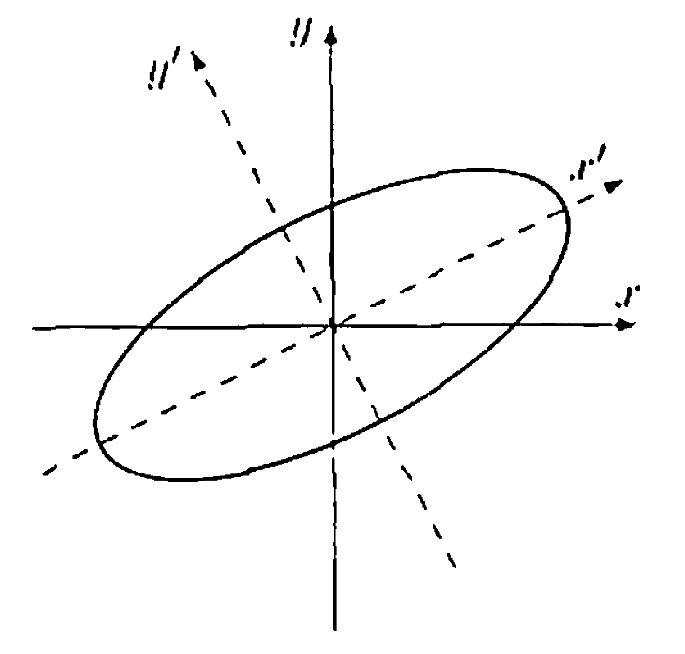

# § 31. Unitary and Orthogonal Operators and Their Matrices

We assume that all vector spaces are over the field $F$, where $F$ denotes either $\mathbb{R}$ or $\mathbb{C}$.

## Unitary and Orthogonal Operators

!!! definition "Definition 31.1 : Unitary and Orthogonal Operator"
    Let $T$ be a linear operator on a finite-dimensional inner product space $V$ (over $F$).
    If $\|T(x)\|=\|x\|$ for all $x \in V$, we call $T$ a **unitary operator** if $F=\mathbb{C}$ and an **orthogonal operator** if $F=\mathbb{R}$.

    It should be noted that, in the infinite-dimensional case, an operator satisfying the preceding norm requirement is generally called an **isometry**.
    If, in addition, the operator is onto (the condition guarantees one-to-one), then the operator is called a **unitary** or **orthogonal operator**.

!!! theorem "Lemma 31.2"
    Let $U$ be a self-adjoint operator on a finite-dimensional inner product space $V$.
    If $\langle x, U(x)\rangle=0$ for all $x \in V$, then $U=T_{0}$.

    !!! proof
        By either **Theorem 30.6** or **Theorem 30.12**, we may choose an orthonormal basis $\beta$ for $V$ consisting of eigenvectors of $U$.
        If $x \in \beta$, then $U(x)=\lambda x$ for some $\lambda$.
        Thus

        $$
        0=\langle x, U(x)\rangle=\langle x, \lambda x\rangle=\overline{\lambda}\langle x, x\rangle
        $$

        so $\overline{\lambda}=0$.
        Hence $U(x)=0$ for all $x \in \beta$, and thus $U=T_{0}$.

!!! theorem "Theorem 31.3 : Equivalent characterizations of unitary and orthogonal operators."
    Let $T$ be a linear operator on a finite-dimensional inner product space $V$.
    Then the following statements are equivalent.

    - (a) $T T^{*}=T^{*} T=I$.
    - (b) $\langle T(x), T(y)\rangle=\langle x, y\rangle$ for all $x, y \in V$.
    - (c) If $\beta$ is an orthonormal basis for $V$, then $T(\beta)$ is an orthonormal basis for $V$.
    - (d) There exists an orthonormal basis $\beta$ for $V$ such that $T(\beta)$ is an orthonormal basis for $V$.
    - (e) $\|T(x)\|=\|x\|$ for all $x \in V$.

    Thus all the conditions above are equivalent to the definition of a unitary or orthogonal operator. From (a), it follows that unitary or orthogonal operators are normal.

    !!! proof

        - (a) $\Rightarrow$ (b)  
            Let $x, y \in V$.
            Then $\langle x, y\rangle=\left\langle T^{*} T(x), y\right\rangle=\langle T(x), T(y)\rangle$.
        
        - (b) $\Rightarrow$ (c)  
            Let $\beta=\left\{v_{1}, v_{2}, \ldots, v_{n}\right\}$ be an orthonormal basis for $V$; so $T(\beta)=\left\{T\left(v_{1}\right), T\left(v_{2}\right), \ldots, T\left(v_{n}\right)\right\}$.
            It follows that $\left\langle T\left(v_{i}\right), T\left(v_{j}\right)\right\rangle=\left\langle v_{i}, v_{j}\right\rangle=\delta_{i j}$.
            Therefore $T(\beta)$ is an orthonormal basis for $V$.

        - (c) $\Rightarrow$ (d)  
            Obvious.

        - (d) $\Rightarrow$ (e)  
            Let $x \in V$, and let $\beta=\left\{v_{1}, v_{2}, \ldots, v_{n}\right\}$.
            Now

            $$
            x=\sum_{i=1}^{n} a_{i} v_{i}
            $$

            for some scalars $a_{i}$, and so

            $$
            \begin{aligned}
            \|x\|^{2} & =\left\langle\sum_{i=1}^{n} a_{i} v_{i}, \sum_{j=1}^{n} a_{j} v_{j}\right\rangle=\sum_{i=1}^{n} \sum_{j=1}^{n} a_{i} \overline{a_{j}}\left\langle v_{i}, v_{j}\right\rangle \\
            & =\sum_{i=1}^{n} \sum_{j=1}^{n} a_{i} \overline{a_{j}} \delta_{i j}=\sum_{i=1}^{n}\left|a_{i}\right|^{2}
            \end{aligned}
            $$

            since $\beta$ is orthonormal.
            Applying the same manipulations to

            $$
            T(x)=\sum_{i=1}^{n} a_{i} T\left(v_{i}\right)
            $$

            and using the fact that $T(\beta)$ is also orthonormal, we obtain

            $$
            \|T(x)\|^{2}=\sum_{i=1}^{n}\left|a_{i}\right|^{2} .
            $$

            Hence $\|T(x)\|=\|x\|$.

        - (e) $\Rightarrow$ (a)  
            For any $x \in V$, we have

            $$
            \langle x, x\rangle=\|x\|^{2}=\|T(x)\|^{2}=\langle T(x), T(x)\rangle=\left\langle x, T^{*} T(x)\right\rangle
            $$

            So $\left\langle x,\left(I-T^{*} T\right)(x)\right\rangle=0$ for all $x \in V$.
            Let $U=I-T^{*} T$; then $U$ is self-adjoint, and $\langle x, U(x)\rangle=0$ for all $x \in V$.
            Hence, by **Lemma 31.2**, we have $T_{0}=U=I-T^{*} T$, and therefore $T^{*} T=I$.
            Since $V$ is finite-dimensional, we may use **Exercise 11.10** to conclude that $T T^{*}=I$.

!!! corollary "Corollary 31.4 : Self-adjoint orthogonal operators have an orthonormal eigenbasis with eigenvalues of absolute value $1$ in finite-dimensional real inner product space."
    Let $T$ be a linear operator on a finite-dimensional real inner product space $V$.
    Then $V$ has an orthonormal basis of eigenvectors of $T$ with corresponding eigenvalues of absolute value $1$ if and only if $T$ is both self-adjoint and orthogonal.

    !!! proof
        - ($\Rightarrow$)  
            Suppose that $V$ has an orthonormal basis $\left\{v_{1}, v_{2}, \ldots, v_{n}\right\}$ such that $T\left(v_{i}\right)=\lambda_{i} v_{i}$ and $\left|\lambda_{i}\right|=1$ for all $i$.
            By **Theorem 30.12**, $T$ is self-adjoint.
            Thus $\left(T T^{*}\right)\left(v_{i}\right)=T\left(\lambda_{i} v_{i}\right)=\lambda_{i} \lambda_{i} v_{i}=\left|\lambda_{i}\right|^{2} v_{i}=v_{i}$ for each $i$.
            So $T T^{*}=I$, and again by **Exercise 11.10**, $T$ is orthogonal by **Theorem 31.3**(a).

        - ($\Leftarrow$)  
            If $T$ is self-adjoint, then, by **Theorem 30.12**, we have that $V$ possesses an orthonormal basis $\left\{v_{1}, v_{2}, \ldots, v_{n}\right\}$ such that $T\left(v_{i}\right)=\lambda_{i} v_{i}$ for all $i$.
            If $T$ is also orthogonal, we have

            $$
            \left|\lambda_{i}\right| \cdot\left\|v_{i}\right\|=\left\|\lambda_{i} v_{i}\right\|=\left\|T\left(v_{i}\right)\right\|=\left\|v_{i}\right\| ;
            $$

            so $\left|\lambda_{i}\right|=1$ for every $i$.

!!! corollary "Corollary 31.5 : Unitary operators have an orthonormal eigenbasis with eigenvalues of absolute value $1$ in finite-dimensional complex inner product space."
    Let $T$ be a linear operator on a finite-dimensional complex inner product space $V$.
    Then $V$ has an orthonormal basis of eigenvectors of $T$ with corresponding eigenvalues of absolute value $1$ if and only if $T$ is unitary.

    !!! proof
        - ($\Rightarrow$)  
            Suppose that $V$ has an orthonormal basis $\left\{v_{1}, v_{2}, \ldots, v_{n}\right\}$ such that $T\left(v_{i}\right)=\lambda_{i} v_{i}$ and $\left|\lambda_{i}\right|=1$ for all $i$.
            Thus $\left(T T^{*}\right)\left(v_{i}\right)=T\left(\overline{\lambda_{i}} v_{i}\right)=\overline{\lambda_{i}} \lambda_{i} v_{i}=\left|\lambda_{i}\right|^{2} v_{i}=v_{i}$ for each $i$.
            So $T T^{*}=I$, and again by **Exercise 11.10**, $T$ is unitary by **Theorem 31.3**(a).

        - ($\Leftarrow$)  
            If $T$ is unitary, then $T$ is normal by **Theorem 31.3**(a), and by **Theorem 30.12**, we have that $V$ possesses an orthonormal basis $\left\{v_{1}, v_{2}, \ldots, v_{n}\right\}$ such that $T\left(v_{i}\right)=\lambda_{i} v_{i}$ for all $i$.
            Also, since $T$ is unitary, we have

            $$
            \left|\lambda_{i}\right| \cdot\left\|v_{i}\right\|=\left\|\lambda_{i} v_{i}\right\|=\left\|T\left(v_{i}\right)\right\|=\left\|v_{i}\right\| ;
            $$

            so $\left|\lambda_{i}\right|=1$ for every $i$.

!!! example "Example 31.6 : Rotation is orthogonal, but not self-adjoint."

    Let $T: \mathbb{R}^{2} \rightarrow \mathbb{R}^{2}$ be a rotation by $\theta$, where $0<\theta<\pi$.
    It is clear geometrically that $T$ "preserves length," that is, that $\|T(x)\|=\|x\|$ for all $x \in \mathbb{R}^{2}$.
    The fact that rotations by a fixed angle preserve perpendicularity not only can be seen geometrically but now follows from (b) of **Theorem 31.3**.
    Perhaps the fact that such a transformation preserves the inner product is not so obvious; however, we obtain this fact from (b) also.
    Finally, an inspection of the matrix representation of $T$ with respect to the standard ordered basis, which is

    $$
    \left(\begin{array}{rr}
    \cos \theta & -\sin \theta \\
    \sin \theta & \cos \theta
    \end{array}\right)
    $$

    reveals that $T$ is not self-adjoint for the given restriction on $\theta$.
    As we mentioned earlier, this fact also follows from the geometric observation that $T$ has no eigenvectors and from **Theorem 30.5**.
    It is seen easily from the preceding matrix that $T^{*}$ is the rotation by $-\theta$.

!!! definition "Definition 31.7 : Reflection of $\mathbb{R}^{2}$ About a Line"
    Let $L$ be a one-dimensional subspace of $\mathbb{R}^{2}$.
    We may view $L$ as a line in the plane through the origin.
    A linear operator $T$ on $\mathbb{R}^{2}$ is called a **reflection** of $\mathbb{R}^{2}$ about $L$ if $T(x)=x$ for all $x \in L$ and $T(x)=-x$ for all $x \in L^{\perp}$.

!!! example "Example 31.8 : Reflection is orthogonal, and self-adjoint."

    Let $T$ be a reflection of $\mathbb{R}^{2}$ about a line $L$ through the origin.
    We show that $T$ is an orthogonal operator.
    Select vectors $v_{1} \in L$ and $v_{2} \in L^{\perp}$ such that $\left\|v_{1}\right\|=\left\|v_{2}\right\|=1$.
    Then $T\left(v_{1}\right)=v_{1}$ and $T\left(v_{2}\right)=-v_{2}$.
    Thus $v_{1}$ and $v_{2}$ are eigenvectors of $T$ with corresponding eigenvalues $1$ and $-1$, respectively.
    Furthermore, $\left\{v_{1}, v_{2}\right\}$ is an orthonormal basis for $\mathbb{R}^{2}$.
    It follows that $T$ is an orthogonal operator by **Corollary 31.4**.

## Unitary and Orthogonal Matrices

!!! definition "Definition 31.9 : Orthogonal Matrix / Unitary Matrix"
    A square matrix $A$ is called an **orthogonal matrix** if $A^{t} A=A A^{t}=I$ and **unitary** if $A^{*} A=A A^{*}=I$.

!!! theorem "Theorem 31.10 : Rows and columns of orthogonal / unitary matrix forms an orthonormal basis for $F^{n}$."
    The condition $A A^{*}=I$ is equivalent to the statement that the rows of $A$ form an orthonormal basis for $F^{n}$.

    Also, the condition $A^{*} A=I$ is equivalent to the statement that the rows of $A$ form an orthonormal basis for $F^{n}$.

    !!! proof
        Let $A A^{*}=I$.
            
        $$
        \delta_{i j}=I_{i j}=\left(A A^{*}\right)_{i j}=\sum_{k=1}^{n} A_{i k}\left(A^{*}\right)_{k j}=\sum_{k=1}^{n} A_{i k} \overline{A_{j k}}
        $$

        The last term represents the inner product of the $i$ th and $j$ th rows of $A$.

        The proof on the remark about the columns of $A$ and the condition $A^{*} A=I$ is same.

!!! theorem "Theorem 31.11 : Unitary [Orthogonal] operators and unitary [orthogonal] matrix representations"
    Let $V$ be a finite-dimensional inner product space over $F$ (where $F=\mathbb{C}$ or $F=\mathbb{R}$), and let $T$ be a linear operator on $V$.
    If $\beta$ is an orthonormal basis for $V$ and $A=[T]_{\beta}$, then $T$ is unitary [orthogonal] if and only if $A$ is unitary [orthogonal].

    !!! proof
        Fix an orthonormal basis $\beta$ for $V$ and let $A=[T]_{\beta}$.
        Because $\beta$ is orthonormal, **Theorem 29.6** gives

        $$
        [T^{*}]_{\beta}=[T]_{\beta}^{*}=A^{*}.
        $$

        Also, 

        $$
        [T^{*}T]_{\beta}=[T^{*}]_{\beta}[T]_{\beta}=A^{*}A
        \quad\text{and}\quad
        [TT^{*}]_{\beta}=[T]_{\beta}[T^{*}]_{\beta}=AA^{*}.
        $$

        Assume first that $T$ is unitary [orthogonal].
        By definition, $T^{*}T=I$ (and hence also $TT^{*}=I$).
        Taking $\beta$-matrices,

        $$
        A^{*}A=[T^{*}T]_{\beta}=[I]_{\beta}=I
        \quad\text{(and similarly }AA^{*}=I\text{)}.
        $$

        Thus $A$ is unitary [orthogonal].

        Conversely, assume that $A$ is unitary [orthogonal], so $A^{*}A=I$ (and hence $AA^{*}=I$).
        Then

        $$
        [T^{*}T]_{\beta}=A^{*}A=I=[I]_{\beta}.
        $$

        Since two linear operators are equal if and only if their matrices relative to the same basis are equal, it follows that $T^{*}T=I$ (and similarly $TT^{*}=I$).
        Therefore $T$ is unitary [orthogonal].

!!! example "Example 31.12 : Matrix representation of a reflection in $\mathbb{R}^{2}$."
    Let $T$ be a reflection of $\mathbb{R}^{2}$ about a line $L$ through the origin, let $\beta$ be the standard ordered basis for $\mathbb{R}^{2}$, and let $A=[T]_{\beta}$.
    Then $T=L_{A}$.
    Since $T$ is an orthogonal operator and $\beta$ is an orthonormal basis, $A$ is an orthogonal matrix.
    We describe $A$.

    Suppose that $\alpha$ is the angle from the positive $x$-axis to $L$.
    Let $v_{1}=(\cos \alpha, \sin \alpha)$ and $v_{2}=(-\sin \alpha, \cos \alpha)$.
    Then $\left\|v_{1}\right\|=\left\|v_{2}\right\|=1$, $v_{1} \in L$, and $v_{2} \in L^{\perp}$.
    Hence $\gamma=\left\{v_{1}, v_{2}\right\}$ is an orthonormal basis for $\mathbb{R}^{2}$.
    Because $T\left(v_{1}\right)=v_{1}$ and $T\left(v_{2}\right)=-v_{2}$, we have

    $$
    [T]_{\gamma}=\left[L_{A}\right]_{\gamma}=\left(\begin{array}{rr}
    1 & 0 \\
    0 & -1
    \end{array}\right)
    $$

    Let

    $$
    Q=\left(\begin{array}{rr}
    \cos \alpha & -\sin \alpha \\
    \sin \alpha & \cos \alpha
    \end{array}\right) .
    $$

    By **Corollary 12.9**,

    $$
    A=Q\left[L_{A}\right]_{\gamma} Q^{-1}
    $$

    $$
    \begin{aligned}
    & =\left(\begin{array}{rr}
    \cos \alpha & -\sin \alpha \\
    \sin \alpha & \cos \alpha
    \end{array}\right)\left(\begin{array}{rr}
    1 & 0 \\
    0 & -1
    \end{array}\right)\left(\begin{array}{rr}
    \cos \alpha & \sin \alpha \\
    -\sin \alpha & \cos \alpha
    \end{array}\right) \\
    & =\left(\begin{array}{cc}
    \cos ^{2} \alpha-\sin ^{2} \alpha & 2 \sin \alpha \cos \alpha \\
    2 \sin \alpha \cos \alpha & -\left(\cos ^{2} \alpha-\sin ^{2} \alpha\right)
    \end{array}\right) \\
    & =\left(\begin{array}{cc}
    \cos 2 \alpha & \sin 2 \alpha \\
    \sin 2 \alpha & -\cos 2 \alpha
    \end{array}\right) .
    \end{aligned}
    $$

## Unitary and Orthogonal Diagonalization

!!! definition "Definition 31.13 : Unitary Equivalence / Orthogonal Equivalence"
    $A$ and $B$ are **unitarily equivalent** [**orthogonally equivalent**] if and only if there exists a unitary [orthogonal] matrix $P$ such that $A=P^{*} B P$.

!!! theorem "Theorem 31.14 : Unitary and orthogonal equivalence are equivalence relations."
    Define a relation on $\mathrm{M}_{n \times n}(\mathbb{C})$ by declaring $A \sim B$ if and only if there exists a unitary matrix $P$ such that
    
    $$
    A=P^{*}BP.
    $$
    
    Then $\sim$ is an equivalence relation.
    
    !!! proof
        We prove the unitary case; the orthogonal case is identical with $P^{*}$ replaced by $P^{t}$.

        - **Reflexive.**  
            Let $A \in \mathrm{M}_{n \times n}(\mathbb{C})$.
            Take $P=I$, which is unitary and satisfies $I^{*}AI=A$.
            Hence $A \sim A$.

        - **Symmetric.**  
            Assume $A \sim B$.
            Then there exists a unitary matrix $P$ such that $A=P^{*}BP$.
            Since $P$ is unitary, $P^{-1}=P^{*}$ and therefore $(P^{*})^{*}=P$.
            Multiply the equality $A=P^{*}BP$ on the left by $P$ and on the right by $P^{*}$ to obtain

            $$
            PAP^{*}=B.
            $$
            
            Let $Q=P^{*}$, which is unitary.
            Then $B=Q^{*}AQ$, so $B \sim A$.

        - **Transitive.**  
            Assume $A \sim B$ and $B \sim C$.
            Then there exist unitary matrices $P$ and $Q$ such that

            $$
            A=P^{*}BP
            \quad\text{and}\quad
            B=Q^{*}CQ.
            $$

            Substituting the second equation into the first gives
            
            $$
            A=P^{*}(Q^{*}CQ)P=(QP)^{*}C(QP),
            $$

            using $(QP)^{*}=P^{*}Q^{*}$.
            Since the product of unitary matrices is unitary, $QP$ is unitary.
            Hence $A \sim C$.

        Therefore $\sim$ is reflexive, symmetric, and transitive, so it is an equivalence relation.

!!! theorem "Theorem 31.15 : Unitary diagonalization of complex normal matrices."
    Let $A$ be a complex $n \times n$ matrix.
    Then $A$ is normal if and only if $A$ is unitarily equivalent to a diagonal matrix.

    !!! proof
        - ($\Rightarrow$)  
            Suppose that $A$ is normal.
            From **Theorem 30.6**, we know that for a complex normal matrix $A$ there exists an orthonormal basis $\beta$ of $\mathbb{C}^{n}$ consisting of eigenvectors of $A$.
            
            By **Corollary 12.9**, we have
            
            $$
            [L_A]_{\beta}=D=Q^{-1} A Q.
            $$

            Because the columns of $Q$ form an orthonormal basis of $\mathbb{C}^{n}$, we also have
            
            $$
            Q^{-1}=Q^{*},
            $$

            so the similarity relation becomes
            
            $$
            D=Q^{*} A Q
            \quad\text{or equivalently}\quad
            A=Q D Q^{*}.
            $$

            Thus $A$ is unitarily equivalent to the diagonal matrix $D$.
        - ($\Leftarrow$)  
            Suppose that $A=P^{*} D P$, where $P$ is a unitary matrix and $D$ is a diagonal matrix.
            Then

            $$
            A A^{*}=\left(P^{*} D P\right)\left(P^{*} D P\right)^{*}
            =\left(P^{*} D P\right)\left(P^{*} D^{*} P\right)
            =P^{*} D D^{*} P .
            $$

            Similarly, $A^{*} A=P^{*} D^{*} D P$.
            Since $D$ is a diagonal matrix, however, we have $D D^{*}=D^{*} D$.
            Thus $A A^{*}=A^{*} A$.

!!! theorem "Theorem 31.16 : Orthogonal diagonalization of real symmetric matrices."
    Let $A$ be a real $n \times n$ matrix.
    Then $A$ is symmetric if and only if $A$ is orthogonally equivalent to a real diagonal matrix.

    !!! proof
        - ($\Rightarrow$)  
            Suppose that $A$ is symmetric.
            From **Theorem 30.12**, we know that for a real symmetric matrix $A$ there exists an orthonormal basis $\beta$ of $\mathbb{R}^{n}$ consisting of eigenvectors of $A$.
            
            By **Corollary 12.9**, we have
            
            $$
            [L_A]_{\beta}=D=Q^{-1} A Q.
            $$

            Because the columns of $Q$ form an orthonormal basis of $\mathbb{R}^{n}$, $Q$ is orthogonal, so

            $$
            Q^{-1}=Q^{t}.
            $$

            Hence

            $$
            D=Q^{t} A Q
            \quad\text{or equivalently}\quad
            A=Q D Q^{t}.
            $$

            Therefore $A$ is orthogonally equivalent to the (real) diagonal matrix $D$.

        - ($\Leftarrow$)  
            Suppose that $A=Q^{t} D Q$, where $Q$ is orthogonal and $D$ is a real diagonal matrix.
            Then

            $$
            A^{t}=\left(Q^{t} D Q\right)^{t}=Q^{t} D^{t} Q.
            $$

            Because $D$ is diagonal with real entries, $D^{t}=D$.
            Hence

            $$
            A^{t}=Q^{t} D Q=A,
            $$

            so $A$ is symmetric.

!!! example "Example 31.17 : Orthogonal diagonalization computation of a real symmetric matrix."

    Let

    $$
    A=\left(\begin{array}{ccc}
    4 & 2 & 2 \\
    2 & 1 & 2 \\
    2 & 2 & 4
    \end{array}\right)
    $$

    Since $A$ is symmetric, **Theorem 31.16** tells us that $A$ is orthogonally equivalent to a diagonal matrix.
    We find an orthogonal matrix $P$ and a diagonal matrix $D$ such that $P^{t} A P=D$.

    To find $P$, we obtain an orthonormal basis of eigenvectors.
    It is easy to show that the eigenvalues of $A$ are $2$ and $8$.
    The set $\{(-1,1,0),(-1,0,1)\}$ is a basis for the eigenspace corresponding to $2$.
    Because this set is not orthogonal, we apply the Gram-Schmidt process to obtain the orthogonal set $\left\{(-1,1,0),-\frac{1}{2}(1,1,-2)\right\}$.
    The set $\{(1,1,1)\}$ is a basis for the eigenspace corresponding to $8$.
    Notice that $(1,1,1)$ is orthogonal to the preceding two vectors, as predicted by **Theorem 30.5**(d).
    Taking the union of these two bases and normalizing the vectors, we obtain the following orthonormal basis for $\mathbb{R}^{3}$ consisting of eigenvectors of $A$:

    $$
    \left\{\frac{1}{\sqrt{2}}(-1,1,0) ; \frac{1}{\sqrt{6}}(1,1,-2) ; \frac{1}{\sqrt{3}}(1,1,1)\right\} .
    $$

    Thus one possible choice for $P$ is

    $$
    P=\left(\begin{array}{ccc}
    \frac{-1}{\sqrt{2}} & \frac{1}{\sqrt{6}} & \frac{1}{\sqrt{3}} \\
    \frac{1}{\sqrt{2}} & \frac{1}{\sqrt{6}} & \frac{1}{\sqrt{3}} \\
    0 & \frac{-2}{\sqrt{6}} & \frac{1}{\sqrt{3}}
    \end{array}\right), \quad \text { and } \quad D=\left(\begin{array}{ccc}
    2 & 0 & 0 \\
    0 & 2 & 0 \\
    0 & 0 & 8
    \end{array}\right) .
    $$

!!! theorem "Theorem 31.18 : Matrix form of Schur's theorem"
    Let $A \in \mathrm{M}_{n \times n}(F)$ be a matrix whose characteristic polynomial splits over $F$.

    - (a) If $F=\mathbb{C}$, then $A$ is unitarily equivalent to a complex upper triangular matrix.
    - (b) If $F=\mathbb{R}$, then $A$ is orthogonally equivalent to a real upper triangular matrix.

## Rigid Motions

!!! definition "Definition 31.19 : Rigid Motion"
    Let $V$ be a real inner product space.
    A function $f: V \rightarrow V$ is called a **rigid motion** if

    $$
    \|f(x)-f(y)\|=\|x-y\|
    $$

    for all $x, y \in V$.

!!! theorem "Theorem 31.20 : Examples and closure properties of rigid motions"
    Let $V$ be a real inner product space.

    - (a) Any orthogonal operator on a finite-dimensional real inner product space is a rigid motion.
    - (b) Any translation on $V$ is a rigid motion. That is, if $v_{0}\in V$ and $g(x)=x+v_{0}$, then $g$ is a rigid motion.
    - (c) If $f,g:V\to V$ are rigid motions, then $g\circ f$ is a rigid motion.
    - (d) In particular, if $T:V\to V$ is orthogonal (with $V$ finite-dimensional) and $v_{0}\in V$, then the map $h(x)=T(x)+v_{0}$ is a rigid motion.

    !!! proof
        - (a)
            Let $T:V\to V$ be orthogonal. Then for all $x,y\in V$,
            
            $$
            \|T(x)-T(y)\|=\|T(x-y)\|=\|x-y\|.
            $$

        - (b)
            Let $g(x)=x+v_{0}$. Then for all $x,y\in V$,
            
            $$
            \|g(x)-g(y)\|=\|(x+v_{0})-(y+v_{0})\|=\|x-y\|.
            $$

        - (c)
            Let $f$ and $g$ be rigid motions. Then for all $x,y\in V$,
            
            $$
            \|(g\circ f)(x)-(g\circ f)(y)\|
            =\|g(f(x))-g(f(y))\|
            =\|f(x)-f(y)\|
            =\|x-y\|,
            $$
            
            using first that $g$ is a rigid motion and then that $f$ is a rigid motion.

        - (d)
            Define $h(x)=T(x)+v_{0}$. Then $h=g\circ T$ where $g$ is the translation by $v_{0}$.
            By parts (a) and (b), both $T$ and $g$ are rigid motions, and by part (c) their composite $h$ is a rigid motion.

!!! theorem "Theorem 31.21 : Decomposition of rigid motions."
    Let $f: V \rightarrow V$ be a rigid motion on a finite-dimensional real inner product space $V$.
    Then there exists a unique orthogonal operator $T$ on $V$ and a unique translation $g$ on $V$ such that $f=g \circ T$.

    Any orthogonal operator is a special case of this composite, in which the translation is by $0$.
    Any translation is also a special case, in which the orthogonal operator is the identity operator.

    !!! proof
        Let $T: V \rightarrow V$ be defined by
        $T(x)=f(x)-f(0)$
        for all $x \in V$.
        We show that $T$ is an orthogonal operator, from which it follows that $f=g \circ T$, where $g$ is the translation by $f(0)$.
        Observe that $T$ is the composite of $f$ and the translation by $-f(0)$; hence $T$ is a rigid motion.
        Furthermore, for any $x \in V$

        $$
        \|T(x)\|^{2}=\|f(x)-f(0)\|^{2}=\|x-0\|^{2}=\|x\|^{2}
        $$

        and consequently $\|T(x)\|=\|x\|$ for any $x \in V$.
        Thus for any $x, y \in V$,

        $$
        \begin{aligned}
        \|T(x)-T(y)\|^{2} & =\|T(x)\|^{2}-2\langle T(x), T(y)\rangle+\|T(y)\|^{2} \\
        & =\|x\|^{2}-2\langle T(x), T(y)\rangle+\|y\|^{2}
        \end{aligned}
        $$

        and

        $$
        \|x-y\|^{2}=\|x\|^{2}-2\langle x, y\rangle+\|y\|^{2} .
        $$

        But $\|T(x)-T(y)\|^{2}=\|x-y\|^{2}$; so $\langle T(x), T(y)\rangle=\langle x, y\rangle$ for all $x, y \in V$.
        We are now in a position to show that $T$ is a linear transformation.
        Let $x, y \in V$, and let $a \in \mathbb{R}$.
        Then

        $$
        \|T(x+a y)-T(x)-a T(y)\|^{2}=\|[T(x+a y)-T(x)]-a T(y)\|^{2}
        $$

        $$
        \begin{aligned}
        & =\|T(x+a y)-T(x)\|^{2}+a^{2}\|T(y)\|^{2}-2 a\langle T(x+a y)-T(x), T(y)\rangle \\
        & =\|(x+a y)-x\|^{2}+a^{2}\|y\|^{2}-2 a[\langle T(x+a y), T(y)\rangle-\langle T(x), T(y)\rangle] \\
        & =a^{2}\|y\|^{2}+a^{2}\|y\|^{2}-2 a[\langle x+a y, y\rangle-\langle x, y\rangle] \\
        & =2 a^{2}\|y\|^{2}-2 a\left[\langle x, y\rangle+a\|y\|^{2}-\langle x, y\rangle\right] \\
        & =0 .
        \end{aligned}
        $$

        Thus $T(x+a y)=T(x)+a T(y)$, and hence $T$ is linear.
        Since $T$ also preserves inner products, $T$ is an orthogonal operator.

        To prove uniqueness, suppose that $u_{0}$ and $v_{0}$ are in $V$ and $T$ and $U$ are orthogonal operators on $V$ such that

        $$
        f(x)=T(x)+u_{0}=U(x)+v_{0}
        $$

        for all $x \in V$.
        Substituting $x=0$ in the preceding equation yields $u_{0}=v_{0}$, and hence the translation is unique.
        This equation, therefore, reduces to $T(x)=U(x)$ for all $x \in V$, and hence $T=U$.

## Orthogonal Operators on $\mathbb{R}^2$

!!! theorem "Theorem 31.22 : Classification of orthogonal operators on $\mathbb{R}^{2}$."
    Let $T$ be an orthogonal operator on $\mathbb{R}^{2}$, and let $A=[T]_{\beta}$, where $\beta$ is the standard ordered basis for $\mathbb{R}^{2}$.
    Then exactly one of the following conditions is satisfied:

    - (a) $T$ is a rotation, and $\operatorname{det}(A)=1$.
    - (b) $T$ is a reflection about a line through the origin, and $\operatorname{det}(A)=-1$.

    !!! proof
        Because $T$ is an orthogonal operator, $T(\beta)=\left\{T\left(e_{1}\right), T\left(e_{2}\right)\right\}$ is an orthonormal basis for $\mathbb{R}^{2}$ by **Theorem 31.3**(c).
        Since $T\left(e_{1}\right)$ is a unit vector, there is a unique angle $\theta$, $0 \leq \theta<2 \pi$, such that $T\left(e_{1}\right)=(\cos \theta, \sin \theta)$.
        Since $T\left(e_{2}\right)$ is a unit vector and is orthogonal to $T\left(e_{1}\right)$, there are only two possible choices for $T\left(e_{2}\right)$.
        Either

        $$
        T\left(e_{2}\right)=(-\sin \theta, \cos \theta) \quad \text { or } \quad T\left(e_{2}\right)=(\sin \theta,-\cos \theta) .
        $$

        First, suppose that $T\left(e_{2}\right)=(-\sin \theta, \cos \theta)$.
        Then $A=\left(\begin{array}{rr}\cos \theta & -\sin \theta \\ \sin \theta & \cos \theta\end{array}\right)$.
        It follows from **Example 30.8** that $T$ is a rotation by the angle $\theta$.
        Also

        $$
        \operatorname{det}(A)=\cos ^{2} \theta+\sin ^{2} \theta=1 .
        $$

        Now suppose that $T\left(e_{2}\right)=(\sin \theta,-\cos \theta)$.
        Then $A=\left(\begin{array}{rr}\cos \theta & \sin \theta \\ \sin \theta & -\cos \theta\end{array}\right)$.
        Comparing this matrix to the matrix $A$ of **Example 31.12**, we see that $T$ is the reflection of $\mathbb{R}^{2}$ about a line $L$, so that $\alpha=\theta / 2$ is the angle from the positive $x$-axis to $L$.
        Furthermore,

        $$
        \operatorname{det}(A)=-\cos ^{2} \theta-\sin ^{2} \theta=-1 .
        $$

!!! corollary "Corollary 31.23 : Classification of rigid motions on $\mathbb{R}^{2}$."
    Any rigid motion on $\mathbb{R}^{2}$ is either a rotation followed by a translation or a reflection about a line through the origin followed by a translation.

## Conic Sections

!!! concept "Concept 31.24 : Conic sections and quadratic equations."
    As an application of **Theorem 31.16**, we consider the **quadratic equation**

    $$
    \begin{equation*}
    a x^{2}+2 b x y+c y^{2}+d x+e y+f=0 .
    \end{equation*}
    $$

    For special choices of the coefficients, we obtain the various conic sections.
    For example, if $a=c=1, b=d=e=0$, and $f=-1$, we obtain the circle $x^{2}+y^{2}=1$ with center at the origin.
    The remaining conic sections, namely, the ellipse, parabola, and hyperbola, are obtained by other choices of the coefficients.

    If $b=0$, then it is easy to graph the equation by the method of completing the square because the $x y$-term is absent.
    For example, the equation $x^{2}+2 x+y^{2}+4 y+2=0$ may be rewritten as $(x+1)^{2}+(y+2)^{2}=3$, which describes a circle with radius $\sqrt{3}$ and center at $(-1,-2)$ in the $x y$-coordinate system.
    If we consider the transformation of coordinates $(x, y) \rightarrow\left(x^{\prime}, y^{\prime}\right)$, where $x^{\prime}=x+1$ and $y^{\prime}=y+2$, then our equation simplifies to $\left(x^{\prime}\right)^{2}+\left(y^{\prime}\right)^{2}=3$.
    This change of variable allows us to eliminate the $x$- and $y$-terms.

!!! concept "Concept 31.25 : Eliminating the $xy$ term of quadratic forms by rotation."
    We now concentrate solely on the elimination of the $x y$-term. To accomplish this, we consider the expression

    $$
    \begin{equation*}
    a x^{2}+2 b x y+c y^{2} \tag{1}
    \end{equation*}
    $$

    which is called the **associated quadratic form** of
    
    $$
    \begin{equation*}
    a x^{2}+2 b x y+c y^{2}+d x+e y+f=0 \tag{2}
    \end{equation*}
    $$

    Quadratic forms are studied in more generality in **Section 34**.

    If we let

    $$
    A=\left(\begin{array}{ll}
    a & b \\
    b & c
    \end{array}\right) \quad \text { and } \quad X=\left(\begin{array}{c}
    x \\
    y
    \end{array}\right)
    $$

    then (1) may be written as $X^{t} A X=\langle A X, X\rangle$. For example, the quadratic form $3 x^{2}+4 x y+6 y^{2}$ may be written as

    $$
    X^{t}\left(\begin{array}{ll}
    3 & 2 \\
    2 & 6
    \end{array}\right) X
    $$

    The fact that $A$ is symmetric is crucial in our discussion.
    For, by **Theorem 31.16**, we may choose an orthogonal matrix $P$ and a diagonal matrix $D$ with real diagonal entries $\lambda_{1}$ and $\lambda_{2}$ such that $P^{t} A P=D$.
    Now define

    $$
    X^{\prime}=\left(\begin{array}{c}
    x^{\prime} \\
    y^{\prime}
    \end{array}\right)
    $$

    by $X^{\prime}=P^{t} X$ or, equivalently, by $P X^{\prime}=P P^{t} X=X$. Then

    $$
    X^{t} A X=\left(P X^{\prime}\right)^{t} A\left(P X^{\prime}\right)=X^{\prime t}\left(P^{t} A P\right) X^{\prime}=X^{\prime t} D X^{\prime}=\lambda_{1}\left(x^{\prime}\right)^{2}+\lambda_{2}\left(y^{\prime}\right)^{2}
    $$

    Thus the transformation $(x, y) \rightarrow\left(x^{\prime}, y^{\prime}\right)$ allows us to eliminate the $x y$-term in (1), and hence in (2).

    Furthermore, since $P$ is orthogonal, we have by **Theorem 31.22** (with $T=L_{P}$) that $\operatorname{det}(P)=\pm 1$.
    If $\operatorname{det}(P)=-1$, we may interchange the columns of $P$ to obtain a matrix $Q$.
    Because the columns of $P$ form an orthonormal basis of eigenvectors of $A$, the same is true of the columns of $Q$.
    Therefore,

    $$
    Q^{t} A Q=\left(\begin{array}{cc}
    \lambda_{2} & 0 \\
    0 & \lambda_{1}
    \end{array}\right) .
    $$

    Notice that $\operatorname{det}(Q)=-\operatorname{det}(P)=1$.
    So, if $\operatorname{det}(P)=-1$, we can take $Q$ for our new $P$; consequently, we may always choose $P$ so that $\operatorname{det}(P)=1$.
    By **Theorem 31.21** (with $T=L_{P}$), it follows that matrix $P$ represents a rotation.

    ---

    In summary, the $x y$-term in (2) may be eliminated by a rotation of the $x$-axis and $y$-axis to new axes $x^{\prime}$ and $y^{\prime}$ given by $X=P X^{\prime}$, where $P$ is an orthogonal matrix and $\operatorname{det}(P)=1$.
    Furthermore, the coefficients of $\left(x^{\prime}\right)^{2}$ and $\left(y^{\prime}\right)^{2}$ are the eigenvalues of

    $$
    A=\left(\begin{array}{ll}
    a & b \\
    b & c
    \end{array}\right) .
    $$

    This result is a restatement of a result known as the principal axis theorem for $\mathbb{R}^{2}$.
    The arguments above, of course, are easily extended to quadratic equations in $n$ variables.
    For example, in the case $n=3$, by special choices of the coefficients, we obtain the quadratic surfaces: the elliptic cone, the ellipsoid, the hyperbolic paraboloid, etc.

!!! example "Example 31.26 : Example of eliminating the $xy$ term of quadratic forms by rotation."
    As an illustration of the preceding transformation, consider the quadratic equation

    $$
    2 x^{2}-4 x y+5 y^{2}-36=0
    $$

    for which the associated quadratic form is $2 x^{2}-4 x y+5 y^{2}$.
    In the notation we have been using,

    $$
    A=\left(\begin{array}{rr}
    2 & -2 \\
    -2 & 5
    \end{array}\right)
    $$

    so that the eigenvalues of $A$ are $1$ and $6$ with associated eigenvectors

    $$
    \left(\begin{array}{c}
    2 \\
    1
    \end{array}\right) \text { and } \left(\begin{array}{c}
    -1 \\
    2
    \end{array}\right) .
    $$

    As expected (from **Theorem 30.5**(d)), these vectors are orthogonal.
    The corresponding orthonormal basis of eigenvectors

    $$
    \gamma=\left\{\left(\begin{array}{c}
    \frac{2}{\sqrt{5}} \\
    \frac{1}{\sqrt{5}}
    \end{array}\right), \left(\begin{array}{c}
    \frac{-1}{\sqrt{5}} \\
    \frac{2}{\sqrt{5}}
    \end{array}\right)\right\}
    $$

    determines new axes, $x^{\prime}$ and $y^{\prime}$, as in Figure 31.1.
    Hence if

    $$
    P=\left(\begin{array}{ll}
    \frac{2}{\sqrt{5}} & \frac{-1}{\sqrt{5}} \\
    \frac{1}{\sqrt{5}} & \frac{2}{\sqrt{5}}
    \end{array}\right)=\frac{1}{\sqrt{5}}\left(\begin{array}{rr}
    2 & -1 \\
    1 & 2
    \end{array}\right)
    $$

    then

    $$
    P^{t} A P=\left(\begin{array}{ll}
    1 & 0 \\
    0 & 6
    \end{array}\right)
    $$

    Under the transformation $X=P X^{\prime}$ or

    $$
    \begin{aligned}
    & x=\frac{2}{\sqrt{5}} x^{\prime}-\frac{1}{\sqrt{5}} y^{\prime} \\
    & y=\frac{1}{\sqrt{5}} x^{\prime}+\frac{2}{\sqrt{5}} y^{\prime}
    \end{aligned}
    $$

    we have the new quadratic form $\left(x^{\prime}\right)^{2}+6\left(y^{\prime}\right)^{2}$.
    Thus the original equation $2 x^{2}-4 x y+5 y^{2}=36$ may be written in the form $\left(x^{\prime}\right)^{2}+6\left(y^{\prime}\right)^{2}=36$ relative to a new coordinate system with the $x^{\prime}$- and $y^{\prime}$-axes in the directions of the first and second vectors of $\gamma$, respectively.
    It is clear that this equation represents an ellipse.
    (See Figure 31.1.)

    {: .center style="width:60%;"}
    ///caption
    Figure 31.1.
    ///

    Note that the preceding matrix $P$ has the form

    $$
    \left(\begin{array}{cc}
    \cos \theta & -\sin \theta \\
    \sin \theta & \cos \theta
    \end{array}\right)
    $$

    where $\theta=\cos ^{-1} \frac{2}{\sqrt{5}} \approx 26.6^{\circ}$.
    So $P$ is the matrix representation of a rotation of $\mathbb{R}^{2}$ through the angle $\theta$.
    Thus the change of variable $X=P X^{\prime}$ can be accomplished by this rotation of the $x$- and $y$-axes.
    There is another possibility for $P$, however.
    If the eigenvector of $A$ corresponding to the eigenvalue $6$ is taken to be $(1,-2)$ instead of $(-1,2)$, and the eigenvalues are interchanged, then we obtain the matrix

    $$
    \left(\begin{array}{ll}
    \frac{1}{\sqrt{5}} & \frac{2}{\sqrt{5}} \\
    \frac{-2}{\sqrt{5}} & \frac{1}{\sqrt{5}}
    \end{array}\right)
    $$

    which is the matrix representation of a rotation through the angle $\theta=\sin ^{-1}\left(-\frac{2}{\sqrt{5}}\right) \approx-63.4^{\circ}$.
    This possibility produces the same ellipse as the one in Figure 31.1, but interchanges the names of the $x^{\prime}$- and $y^{\prime}$-axes.

## Exercise

