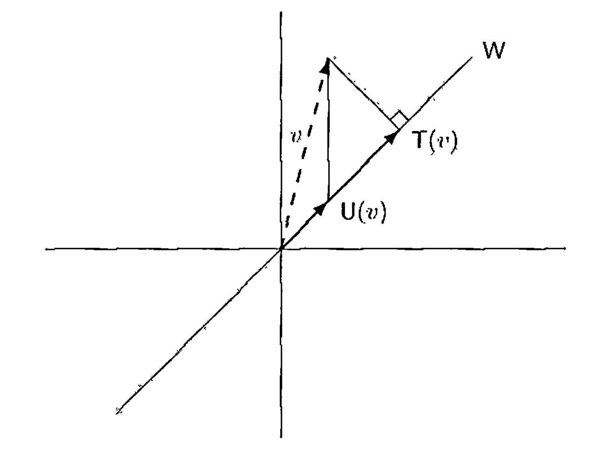

# § 32. Orthogonal Projections and the Spectral Theorem

## Orthogonal Projections

!!! concept "Concept 32.1 : Projection"
    Recall from **Definition 8.19** that if $V=W_{1} \oplus W_{2}$, then a linear operator $T$ on $V$ is the **projection on $W_{1}$ along $W_{2}$** if, whenever $x=x_{1}+x_{2}$ with $x_{1} \in W_{1}$ and $x_{2} \in W_{2}$, we have $T(x)=x_{1}$.
    By **Exercise 8.26**, we have

    $$
    R(T)=W_{1}=\left\{x \in V: T(x)=x\right\} \quad \text { and } \quad N(T)=W_{2} .
    $$

    So $V=R(T) \oplus N(T)$.
    Thus there is no ambiguity if we refer to $T$ as a "projection on $W_{1}$" or simply as a "projection."
    In fact, by **Exercise 10.17**, it can be seen that $T$ is a projection if and only if $T=T^{2}$.
    
    Because $V=W_{1} \oplus W_{2}=W_{1} \oplus W_{3}$ does not imply that $W_{2}=W_{3}$, we see that $W_{1}$ does not uniquely determine $T$.
    For an orthogonal projection $T$, however, $T$ is uniquely determined by its range.

!!! definition "Definition 32.2 : Orthogonal Projection"
    Let $V$ be an inner product space, and let $T: V \rightarrow V$ be a projection.
    We say that $T$ is an **orthogonal projection** if $R(T)^{\perp}=N(T)$ and $N(T)^{\perp}=R(T)$.

    Note that by **Exercise 28.13**(c), if $V$ is finite-dimensional, we need only assume that one of the preceding conditions holds.
    For example, if $R(T)^{\perp}=N(T)$, then $R(T)=R(T)^{\perp \perp}=N(T)^{\perp}$.

!!! theorem "Theorem 32.3 : Uniqueness of orthogonal projection on a subspace"
    Assume that $W$ is a finite-dimensional subspace of an inner product space $V$.
    In the notation of **Theorem 28.17**, define a function $T: V \rightarrow V$ by $T(y)=u$.
    
    $T$ is an orthogonal projection on $W$, and there exists exactly one orthogonal projection on $W$.
    We call $T$ the **orthogonal projection** of $V$ on $W$.
    
    !!! proof
        It is easy to show that $T$ is an orthogonal projection on $W$.
        
        Suppose that $T$ and $U$ are orthogonal projections on $W$.
        Then $R(T)=W=R(U)$.
        Hence $N(T)=R(T)^{\perp}=R(U)^{\perp}=N(U)$.
        Since every projection is uniquely determined by its range and null space, we have $T=U$.

!!! example "Example 32.4 : Geometric difference between projection and orthogonal projection."
    To understand the geometric difference between an arbitrary projection on $W$ and the orthogonal projection on $W$, let $V=\mathbb{R}^{2}$ and $W=\operatorname{span}\{(1,1)\}$.
    Define $U$ and $T$ as in Figure 32.1, where $T(v)$ is the foot of a perpendicular from $v$ on the line $y=x$ and $U\left(a_{1}, a_{2}\right)=\left(a_{1}, a_{1}\right)$.
    Then $T$ is the orthogonal projection of $V$ on $W$, and $U$ is a different projection on $W$.
    Note that $v-T(v) \in W^{\perp}$, whereas $v-U(v) \notin W^{\perp}$.

    {: .center style="width:80%;"}
    ///caption
    Figure 32.1.
    ///

    From Figure 32.1, we see that $T(v)$ is the "best approximation in $W$ to $v$"; that is, if $w \in W$, then $\|w-v\| \geq\|T(v)-v\|$.
    In fact, this approximation property characterizes $T$.
    These results follow immediately from the corollary to **Theorem 28.17**.

!!! example "Example 32.5 : Fourier approximation via orthogonal projection"
    As an application to Fourier analysis, recall the inner product space $H$ and the orthonormal set $S$ in **Example 27.18**.
    Define a **trigonometric polynomial of degree $n$** to be a function $g \in H$ of the form

    $$
    g(t)=\sum_{j=-n}^{n} a_{j} f_{j}(t)=\sum_{j=-n}^{n} a_{j} e^{i j t} .
    $$

    where $a_{n}$ or $a_{-n}$ is nonzero.
    
    Let $f \in H$.
    We show that the best approximation to $f$ by a trigonometric polynomial of degree less than or equal to $n$ is the trigonometric polynomial whose coefficients are the Fourier coefficients of $f$ relative to the orthonormal set $S$.
    For this result, let $W=\operatorname{span}\left(\left\{f_{j}:|j| \leq n\right\}\right)$, and let $T$ be the orthogonal projection of $H$ on $W$.
    The corollary to **Theorem 28.17** tells us that the best approximation to $f$ by a function in $W$ is

    $$
    T(f)=\sum_{j=-n}^{n}\left\langle f, f_{j}\right\rangle f_{j} .
    $$

!!! theorem "Theorem 32.6 : Algebraic characterization of orthogonal projections"
    Let $V$ be an inner product space, and let $T$ be a linear operator on $V$.
    Then $T$ is an orthogonal projection if and only if $T$ has an adjoint $T^{*}$ and $T^{2}=T=T^{*}$.

    !!! proof
        Suppose that $T$ is an orthogonal projection.
        Since $T^{2}=T$ because $T$ is a projection, we need only show that $T^{*}$ exists and $T=T^{*}$.
        Now $V=R(T) \oplus N(T)$ and $R(T)^{\perp}=N(T)$.
        Let $x, y \in V$.
        Then we can write $x=x_{1}+x_{2}$ and $y=y_{1}+y_{2}$, where $x_{1}, y_{1} \in R(T)$ and $x_{2}, y_{2} \in N(T)$.
        Hence

        $$
        \langle x, T(y)\rangle=\left\langle x_{1}+x_{2}, y_{1}\right\rangle=\left\langle x_{1}, y_{1}\right\rangle+\left\langle x_{2}, y_{1}\right\rangle=\left\langle x_{1}, y_{1}\right\rangle
        $$

        and

        $$
        \langle T(x), y\rangle=\left\langle x_{1}, y_{1}+y_{2}\right\rangle=\left\langle x_{1}, y_{1}\right\rangle+\left\langle x_{1}, y_{2}\right\rangle=\left\langle x_{1}, y_{1}\right\rangle .
        $$

        So $\langle x, T(y)\rangle=\langle T(x), y\rangle$ for all $x, y \in V$; thus $T^{*}$ exists and $T=T^{*}$.

        Now suppose that $T^{2}=T=T^{*}$.
        Then $T$ is a projection by **Exercise 10.17**, and hence we must show that $R(T)=N(T)^{\perp}$ and $R(T)^{\perp}=N(T)$.
        Let $x \in R(T)$ and $y \in N(T)$.
        Then $x=T(x)=T^{*}(x)$, and so

        $$
        \langle x, y\rangle=\left\langle T^{*}(x), y\right\rangle=\langle x, T(y)\rangle=\langle x, 0\rangle=0 .
        $$

        Therefore $x \in N(T)^{\perp}$, from which it follows that $R(T) \subseteq N(T)^{\perp}$.
        Let $y \in N(T)^{\perp}$.
        We must show that $y \in R(T)$, that is, $T(y)=y$.
        Now

        $$
        \begin{aligned}
        \|y-T(y)\|^{2} & =\langle y-T(y), y-T(y)\rangle \\
        & =\langle y, y-T(y)\rangle-\langle T(y), y-T(y)\rangle .
        \end{aligned}
        $$

        Since $y-T(y) \in N(T)$, the first term must equal zero.
        But also

        $$
        \langle T(y), y-T(y)\rangle=\left\langle y, T^{*}(y-T(y))\right\rangle=\langle y, T(y-T(y))\rangle=\langle y, 0\rangle=0 .
        $$

        Thus $y-T(y)=0$; that is, $y=T(y) \in R(T)$.
        Hence $R(T)=N(T)^{\perp}$.
        Using the preceding results, we have $R(T)^{\perp}=N(T)^{\perp \perp} \supseteq N(T)$ by **Exercise 28.13**(b).
        Now suppose that $x \in R(T)^{\perp}$.
        For any $y \in V$, we have $\langle T(x), y\rangle=\left\langle x, T^{*}(y)\right\rangle=\langle x, T(y)\rangle=0$.
        So $T(x)=0$, and thus $x \in N(T)$.
        Hence $R(T)^{\perp}=N(T)$.

!!! concept "Concept 32.7 : Matrix form of an orthogonal projection"
    Let $V$ be a finite-dimensional inner product space, $W$ be a subspace of $V$, and $T$ be the orthogonal projection of $V$ on $W$.
    We may choose an orthonormal basis $\beta=\left\{v_{1}, v_{2}, \ldots, v_{n}\right\}$ for $V$ such that $\left\{v_{1}, v_{2}, \ldots, v_{k}\right\}$ is a basis for $W$.
    Then $[T]_{\beta}$ is a diagonal matrix with ones as the first $k$ diagonal entries and zeros elsewhere.
    In fact, $[T]_{\beta}$ has the form

    $$
    \left(\begin{array}{ll}
    I_{k} & O_{1} \\
    O_{2} & O_{3}
    \end{array}\right) .
    $$

    If $U$ is any projection on $W$, we may choose a basis $\gamma$ for $V$ such that $[U]_{\gamma}$ has the form above; however, $\gamma$ is not necessarily orthonormal.

## The Spectral Theorem

!!! theorem "Theorem 32.8 : The spectral theorem"
    Suppose that $T$ is a linear operator on a finite-dimensional inner product space $V$ over $F$ with the distinct eigenvalues $\lambda_{1}, \lambda_{2}, \ldots, \lambda_{k}$.
    Assume that $T$ is normal if $F=\mathbb{C}$ and that $T$ is self-adjoint if $F=\mathbb{R}$.
    For each $i$ $(1 \leq i \leq k)$, let $W_{i}$ be the eigenspace of $T$ corresponding to the eigenvalue $\lambda_{i}$, and let $T_{i}$ be the orthogonal projection of $V$ on $W_{i}$.
    Then the following statements are true.

    - (a) $V=W_{1} \oplus W_{2} \oplus \cdots \oplus W_{k}$.
    - (b) If $W_{i}^{\prime}$ denotes the direct sum of the subspaces $W_{j}$ for $j \neq i$, then $W_{i}^{\perp}=W_{i}^{\prime}$.
    - (c) $T_{i} T_{j}=\delta_{i j} T_{i}$ for $1 \leq i, j \leq k$.
    - (d) $I=T_{1}+T_{2}+\cdots+T_{k}$.
    - (e) $T=\lambda_{1} T_{1}+\lambda_{2} T_{2}+\cdots+\lambda_{k} T_{k}$.

    The set $\left\{\lambda_{1}, \lambda_{2}, \ldots, \lambda_{k}\right\}$ of eigenvalues of $T$ is called the **spectrum** of $T$, the sum $I=T_{1}+T_{2}+\cdots+T_{k}$ in (d) is called the **resolution of the identity operator** induced by $T$, and the sum $T=\lambda_{1} T_{1}+\lambda_{2} T_{2}+\cdots+\lambda_{k} T_{k}$ in (e) is called the **spectral decomposition** of $T$.
    The spectral decomposition of $T$ is unique up to the order of its eigenvalues.

    !!! proof
        - (a) By **Theorem 30.6** and **Theorem 30.12**, $T$ is diagonalizable; so

            $$
            V=W_{1} \oplus W_{2} \oplus \cdots \oplus W_{k}
            $$

            by **Theorem 24.18**.

        - (b) If $x \in W_{i}$ and $y \in W_{j}$ for some $i \neq j$, then $\langle x, y\rangle=0$ by **Theorem 30.5**(d).
            It follows easily from this result that $W_{i}^{\prime} \subseteq W_{i}^{\perp}$.
            From (a), we have

            $$
            \operatorname{dim}\left(W_{i}^{\prime}\right)=\sum_{j \neq i} \operatorname{dim}\left(W_{j}\right)=\operatorname{dim}(V)-\operatorname{dim}\left(W_{i}\right) .
            $$

            On the other hand, we have $\operatorname{dim}\left(W_{i}^{\perp}\right)=\operatorname{dim}(V)-\operatorname{dim}\left(W_{i}\right)$ by **Theorem 28.20**(c).
            Hence $W_{i}^{\prime}=W_{i}^{\perp}$, proving (b).

        - (c) For $x \in V$, write $x=x_{1}+x_{2}+\cdots+x_{k}$ with $x_{r} \in W_{r}$ as in (a).
            Then $T_{j}(x)=x_{j}$ by definition of orthogonal projection.
            Hence

            $$
            T_{i} T_{j}(x)=T_{i}\left(x_{j}\right).
            $$

            If $i \neq j$, then $x_{j} \in W_{j} \subseteq W_{i}^{\prime}=W_{i}^{\perp}=N\left(T_{i}\right)$ by (b), so $T_{i}\left(x_{j}\right)=0$.
            If $i=j$, then $x_{j} \in W_{i}=R\left(T_{i}\right)$ and $T_{i}$ acts as the identity on its range, so $T_{i}\left(x_{j}\right)=x_{j}$.
            Therefore

            $$
            T_{i} T_{j}(x)=\delta_{i j} x_{i}=\delta_{i j} T_{i}(x).
            $$

            Since this holds for all $x \in V$, $T_{i} T_{j}=\delta_{i j} T_{i}$.

        - (d) Since $T_{i}$ is the orthogonal projection of $V$ on $W_{i}$, it follows from (b) that $N\left(T_{i}\right)=R\left(T_{i}\right)^{\perp}=W_{i}^{\perp}=W_{i}^{\prime}$.
            Hence, for $x \in V$, we have $x=x_{1}+x_{2}+\cdots+x_{k}$, where $T_{i}(x)=x_{i} \in W_{i}$, proving (d).

        - (e) For $x \in V$, write $x=x_{1}+x_{2}+\cdots+x_{k}$, where $x_{i} \in W_{i}$.
            Then

            $$
            \begin{aligned}
            T(x) & =T\left(x_{1}\right)+T\left(x_{2}\right)+\cdots+T\left(x_{k}\right) \\
            & =\lambda_{1} x_{1}+\lambda_{2} x_{2}+\cdots+\lambda_{k} x_{k} \\
            & =\lambda_{1} T_{1}(x)+\lambda_{2} T_{2}(x)+\cdots+\lambda_{k} T_{k}(x) \\
            & =\left(\lambda_{1} T_{1}+\lambda_{2} T_{2}+\cdots+\lambda_{k} T_{k}\right)(x).
            \end{aligned}
            $$

!!! concept "Concept 32.9 : Block-diagonal matrix form and polynomial calculus."
    With the notation in **Theorem 32.8**, let $\beta$ be the union of orthonormal bases of the $W_{i}$'s and let $m_{i}=\operatorname{dim}\left(W_{i}\right)$.
    (Thus $m_{i}$ is the multiplicity of $\lambda_{i}$.)
    Then $[T]_{\beta}$ has the form

    $$
    \left(\begin{array}{cccc}
    \lambda_{1} I_{m_{1}} & O & \cdots & O \\
    O & \lambda_{2} I_{m_{2}} & \cdots & O \\
    \vdots & \vdots & & \vdots \\
    O & O & \cdots & \lambda_{k} I_{m_{k}}
    \end{array}\right)
    $$

    that is, $[T]_{\beta}$ is a diagonal matrix in which the diagonal entries are the eigenvalues $\lambda_{i}$ of $T$, and each $\lambda_{i}$ is repeated $m_{i}$ times.

!!! corollary "Corollary 32.10 : Polynomial functional calculus for spectral decomposition"
    If $\lambda_{1} T_{1}+\lambda_{2} T_{2}+\cdots+\lambda_{k} T_{k}$ is the spectral decomposition of $T$, then it follows (from **Exercise 32.7**) that $g(T)=g\left(\lambda_{1}\right) T_{1}+g\left(\lambda_{2}\right) T_{2}+\cdots+g\left(\lambda_{k}\right) T_{k}$ for any polynomial $g$.
    This fact is used below.

!!! corollary "Corollary 32.11 : Normality and polynomial representation of adjoint"
    If $F=\mathbb{C}$, then $T$ is normal if and only if $T^{*}=g(T)$ for some polynomial $g$.

    !!! proof
        Suppose first that $T$ is normal.
        Let $T=\lambda_{1} T_{1}+\lambda_{2} T_{2}+\cdots+\lambda_{k} T_{k}$ be the spectral decomposition of $T$.
        Taking the adjoint of both sides of the preceding equation, we have $T^{*}=\overline{\lambda}_{1} T_{1}+\overline{\lambda}_{2} T_{2}+\cdots+\overline{\lambda}_{k} T_{k}$ since each $T_{i}$ is self-adjoint.
        Using the Lagrange interpolation formula (**Concept 6.17**), we may choose a polynomial $g$ such that $g\left(\lambda_{i}\right)=\overline{\lambda}_{i}$ for $1 \leq i \leq k$.
        Then

        $$
        g(T)=g\left(\lambda_{1}\right) T_{1}+g\left(\lambda_{2}\right) T_{2}+\cdots+g\left(\lambda_{k}\right) T_{k}=\overline{\lambda}_{1} T_{1}+\overline{\lambda}_{2} T_{2}+\cdots+\overline{\lambda}_{k} T_{k}=T^{*}.
        $$

        Conversely, if $T^{*}=g(T)$ for some polynomial $g$, then $T$ commutes with $T^{*}$ since $T$ commutes with every polynomial in $T$.
        So $T$ is normal.

!!! corollary "Corollary 32.12 : Characterization of unitary operators by eigenvalues"
    If $F=\mathbb{C}$, then $T$ is unitary if and only if $T$ is normal and $|\lambda|=1$ for every eigenvalue $\lambda$ of $T$.

    !!! proof
        If $T$ is unitary, then $T$ is normal and every eigenvalue of $T$ has absolute value $1$ by **Corollary 31.5**.

        Let $T=\lambda_{1} T_{1}+\lambda_{2} T_{2}+\cdots+\lambda_{k} T_{k}$ be the spectral decomposition of $T$.
        If $|\lambda|=1$ for every eigenvalue $\lambda$ of $T$, then by (c) of **Theorem 32.8**,

        $$
        \begin{aligned}
        T T^{*} & =\left(\lambda_{1} T_{1}+\lambda_{2} T_{2}+\cdots+\lambda_{k} T_{k}\right)\left(\overline{\lambda}_{1} T_{1}+\overline{\lambda}_{2} T_{2}+\cdots+\overline{\lambda}_{k} T_{k}\right) \\
        & =\left|\lambda_{1}\right|^{2} T_{1}+\left|\lambda_{2}\right|^{2} T_{2}+\cdots+\left|\lambda_{k}\right|^{2} T_{k} \\
        & =T_{1}+T_{2}+\cdots+T_{k} \\
        & =I .
        \end{aligned}
        $$

        Hence $T$ is unitary.

!!! corollary "Corollary 32.13 : Real eigenvalues characterize self-adjointness"
    If $F=\mathbb{C}$ and $T$ is normal, then $T$ is self-adjoint if and only if every eigenvalue of $T$ is real.

    !!! proof
        Let $T=\lambda_{1} T_{1}+\lambda_{2} T_{2}+\cdots+\lambda_{k} T_{k}$ be the spectral decomposition of $T$.
        Suppose that every eigenvalue of $T$ is real.
        Then

        $$
        T^{*}=\overline{\lambda}_{1} T_{1}+\overline{\lambda}_{2} T_{2}+\cdots+\overline{\lambda}_{k} T_{k}=\lambda_{1} T_{1}+\lambda_{2} T_{2}+\cdots+\lambda_{k} T_{k}=T .
        $$

        The converse has been proved in **Lemma 30.11**.

!!! corollary "Corollary 32.14 : Spectral projections are polynomials in $T$"
    Let $T$ be as in the spectral theorem with spectral decomposition $T=\lambda_{1} T_{1}+\lambda_{2} T_{2}+\cdots+\lambda_{k} T_{k}$.
    Then each $T_{j}$ is a polynomial in $T$.

    !!! proof
        Choose a polynomial $g_{j}$ $(1 \leq j \leq k)$ such that $g_{j}\left(\lambda_{i}\right)=\delta_{i j}$.
        Then

        $$
        \begin{aligned}
        g_{j}(T) & =g_{j}\left(\lambda_{1}\right) T_{1}+g_{j}\left(\lambda_{2}\right) T_{2}+\cdots+g_{j}\left(\lambda_{k}\right) T_{k} \\
        & =\delta_{1 j} T_{1}+\delta_{2 j} T_{2}+\cdots+\delta_{k j} T_{k}=T_{j} .
        \end{aligned}
        $$

## Exercise

!!! exercise "Exercise 32.4"
    Let $W$ be a finite-dimensional subspace of an inner product space $V$.
    Show that if $T$ is the orthogonal projection of $V$ on $W$, then $I-T$ is the orthogonal projection of $V$ on $W^{\perp}$.

!!! exercise "Exercise 32.5"
    Let $T$ be a linear operator on a finite-dimensional inner product space $V$.

    - (a) If $T$ is an orthogonal projection, prove that $\|T(x)\| \leq\|x\|$ for all $x \in V$.
      Give an example of a projection for which this inequality does not hold.
      What can be concluded about a projection for which the inequality is actually an equality for all $x \in V$?
    - (b) Suppose that $T$ is a projection such that $\|T(x)\| \leq\|x\|$ for $x \in V$.
      Prove that $T$ is an orthogonal projection.

!!! exercise "Exercise 32.6"
    Let $T$ be a normal operator on a finite-dimensional inner product space.
    Prove that if $T$ is a projection, then $T$ is also an orthogonal projection.

!!! exercise "Exercise 32.7"
    Let $T$ be a normal operator on a finite-dimensional complex inner product space $V$.
    Use the spectral decomposition $\lambda_{1} T_{1}+\lambda_{2} T_{2}+\cdots+\lambda_{k} T_{k}$ of $T$ to prove the following results.

    - (a) If $g$ is a polynomial, then

        $$
        g(T)=\sum_{i=1}^{k} g\left(\lambda_{i}\right) T_{i} .
        $$

    - (b) If $T^{n}=T_{0}$ for some $n$, then $T=T_{0}$.
    - (c) Let $U$ be a linear operator on $V$.
      Then $U$ commutes with $T$ if and only if $U$ commutes with each $T_{i}$.
    - (d) There exists a normal operator $U$ on $V$ such that $U^{2}=T$.
    - (e) $T$ is invertible if and only if $\lambda_{i} \neq 0$ for $1 \leq i \leq k$.
    - (f) $T$ is a projection if and only if every eigenvalue of $T$ is $1$ or $0$.
    - (g) $T=-T^{*}$ if and only if every $\lambda_{i}$ is an imaginary number.

!!! exercise "Exercise 32.8"
    Use **Corollary 32.11** to show that if $T$ is a normal operator on a complex finite-dimensional inner product space and $U$ is a linear operator that commutes with $T$, then $U$ commutes with $T^{*}$.

!!! exercise "Exercise 32.9"
    Referring to **Exercise 31.20**, prove the following facts about a partial isometry $U$.

    - (a) $U^{*} U$ is an orthogonal projection on $W$.
    - (b) $U U^{*} U=U$.

!!! exercise "Exercise 32.10"
    Simultaneous diagonalization.
    
    Let $U$ and $T$ be normal operators on a finite-dimensional complex inner product space $V$ such that $T U=U T$.
    Prove that there exists an orthonormal basis for $V$ consisting of vectors that are eigenvectors of both $T$ and $U$.

    Hint: Use the hint of **Exercise 30.14** along with **Exercise 32.8**.
