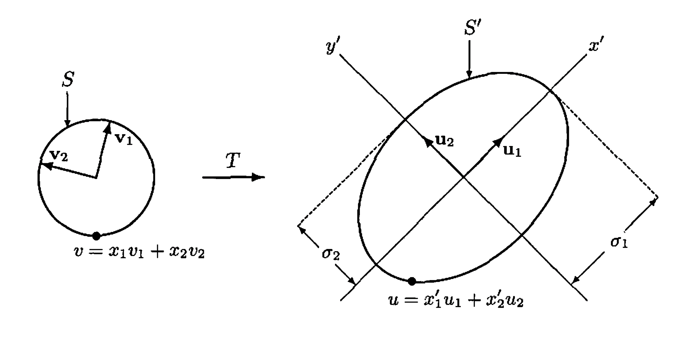

# § 33. The Singular Value Decomposition and the Pseudoinverse

For brevity, in this section we use the terms unitary operator and unitary matrix to include orthogonal operators and orthogonal matrices in the context of real spaces. Thus any operator $T$ for which $\langle T(x), T(y)\rangle=\langle x, y\rangle$, or any matrix $A$ for which $\langle A x, A y\rangle=\langle x, y\rangle$, for all $x$ and $y$ is called unitary for the purposes of this section.

## The Singular Value Decomposition

!!! theorem "Theorem 33.1 : Singular value theorem for linear transformations"

    Let $V$ and $W$ be finite-dimensional inner product spaces, and let $T: V \rightarrow W$ be a linear transformation of rank $r$. Then there exist orthonormal bases $\left\{v_{1}, v_{2}, \ldots, v_{n}\right\}$ for $V$ and $\left\{u_{1}, u_{2}, \ldots, u_{m}\right\}$ for $W$ and positive scalars $\sigma_{1} \geq \sigma_{2} \geq \cdots \geq \sigma_{r}$ such that

    $$
    T\left(v_{i}\right)= \begin{cases}\sigma_{i} u_{i} & \text { if } 1 \leq i \leq r  \\ 0 & \text { if } i>r\end{cases}
    $$

    Conversely, suppose that the preceding conditions are satisfied. Then for $1 \leq i \leq n, v_{i}$ is an eigenvector of $T^{*} T$ with corresponding eigenvalue $\sigma_{i}^{2}$ if $1 \leq i \leq r$ and 0 if $i>r$. Therefore the scalars $\sigma_{1}, \sigma_{2}, \ldots, \sigma_{r}$ are uniquely determined by $T$.

    !!! proof
        We first establish the existence of the bases and scalars. By **Exercise 30.18** and **Exercise 29.15**(d), $T^{*}T$ is a positive semidefinite linear operator of rank $r$ on $V$; hence there is an orthonormal basis $\left\{v_{1}, v_{2}, \ldots, v_{n}\right\}$ for $V$ consisting of eigenvectors of $T^{*} T$ with corresponding eigenvalues $\lambda_{i}$, where $\lambda_{1} \geq \lambda_{2} \geq \cdots \geq \lambda_{r}>0$, and $\lambda_{i}=0$ for $i>r$. For $1 \leq i \leq r$, define $\sigma_{i}=\sqrt{\lambda_{i}}$ and $u_{i}=\frac{1}{\sigma_{i}} T\left(v_{i}\right)$. We show that $\left\{u_{1}, u_{2}, \ldots, u_{r}\right\}$ is an orthonormal subset of $W$. Suppose $1 \leq i, j \leq r$. Then

        $$
        \begin{aligned}
        \left\langle u_{i}, u_{j}\right\rangle & =\left\langle\frac{1}{\sigma_{i}} T\left(v_{i}\right), \frac{1}{\sigma_{j}} T\left(v_{j}\right)\right\rangle \\
        & =\frac{1}{\sigma_{i} \sigma_{j}}\left\langle T^{*} T\left(v_{i}\right), v_{j}\right\rangle \\
        & =\frac{1}{\sigma_{i} \sigma_{j}}\left\langle\lambda_{i} v_{i}, v_{j}\right\rangle \\
        & =\frac{\sigma_{i}^{2}}{\sigma_{i} \sigma_{j}}\left\langle v_{i}, v_{j}\right\rangle \\
        & =\delta_{i j}
        \end{aligned}
        $$

        and hence $\left\{u_{1}, u_{2}, \ldots, u_{r}\right\}$ is orthonormal. By **Theorem 28.20**(a), this set extends to an orthonormal basis $\left\{u_{1}, u_{2}, \ldots, u_{r}, \ldots, u_{m}\right\}$ for $W$. Clearly $T\left(v_{i}\right)=\sigma_{i} u_{i}$ if $1 \leq i \leq r$. If $i>r$, then $T^{*} T\left(v_{i}\right)=0$, and so $T\left(v_{i}\right)=0$ by **Exercise 29.15**(d).

        To establish uniqueness, suppose that $\left\{v_{1}, v_{2}, \ldots, v_{n}\right\},\left\{u_{1}, u_{2}, \ldots, u_{m}\right\}$, and $\sigma_{1} \geq \sigma_{2} \geq \cdots \geq \sigma_{r}>0$ satisfy the properties stated in the first part of the theorem. Then for $1 \leq i \leq m$ and $1 \leq j \leq n$,

        $$
        \begin{aligned}
        \left\langle T^{*}\left(u_{i}\right), v_{j}\right\rangle & =\left\langle u_{i}, T\left(v_{j}\right)\right\rangle \\
        & = \begin{cases}\sigma_{i} & \text { if } i=j \leq r \\
        0 & \text { otherwise }\end{cases}
        \end{aligned}
        $$

        and hence for any $1 \leq i \leq m$,

        $$
        T^{*}\left(u_{i}\right)=\sum_{j=1}^{n}\left\langle T^{*}\left(u_{i}\right), v_{j}\right\rangle v_{j}= \begin{cases}\sigma_{i} v_{i} & \text { if } i \leq r  \\ 0 & \text { otherwise }\end{cases}
        $$

        So for $i \leq r$,

        $$
        T^{*} T\left(v_{i}\right)=T^{*}\left(\sigma_{i} u_{i}\right)=\sigma_{i} T^{*}\left(u_{i}\right)=\sigma_{i}^{2} v_{i}
        $$

        and $T^{*} T\left(v_{i}\right)=T^{*}(0)=0$ for $i>r$. Therefore each $v_{i}$ is an eigenvector of $T^{*} T$ with corresponding eigenvalue $\sigma_{i}^{2}$ if $i \leq r$ and 0 if $i>r$.

!!! definition "Definition 33.2 : Singular Values of a Linear Transformation"
    The unique scalars $\sigma_{1}, \sigma_{2}, \ldots, \sigma_{r}$ in **Theorem 33.1** are called the singular values of $T$. If $r$ is less than both $m$ and $n$, then the term singular value is extended to include $\sigma_{r+1}=\cdots=\sigma_{k}=0$, where $k$ is the minimum of $m$ and $n$.

!!! example "Example 33.3 : Singular values for the derivative map on polynomials"
    Let $\mathrm{P}_{2}(\mathbb{R})$ and $\mathrm{P}_{1}(\mathbb{R})$ be the polynomial spaces with inner products defined by

    $$
    \langle f(x), g(x)\rangle=\int_{-1}^{1} f(t) g(t) d t .
    $$

    Let $T: \mathrm{P}_{2}(\mathbb{R}) \rightarrow \mathrm{P}_{1}(\mathbb{R})$ be the linear transformation defined by $T(f(x))=f^{\prime}(x)$. Find orthonormal bases $\beta=\left\{v_{1}, v_{2}, v_{3}\right\}$ for $\mathrm{P}_{2}(\mathbb{R})$ and $\gamma=\left\{u_{1}, u_{2}\right\}$ for $\mathrm{P}_{1}(\mathbb{R})$ such that $T\left(v_{i}\right)=\sigma_{i} u_{i}$ for $i=1,2$ and $T\left(v_{3}\right)=0$, where $\sigma_{1} \geq \sigma_{2}>0$ are the nonzero singular values of $T$.

    To facilitate the computations, we translate this problem into the corresponding problem for a matrix representation of $T$. Caution is advised here because not any matrix representation will do. Since the adjoint is defined in terms of inner products, we must use a matrix representation constructed from orthonormal bases for $\mathrm{P}_{2}(\mathbb{R})$ and $\mathrm{P}_{1}(\mathbb{R})$ to guarantee that the adjoint of the matrix representation of $T$ is the same as the matrix representation of the adjoint of $T$. (See **Exercise 29.15**.) For this purpose, we use the results of source Exercise 21(a) from source subsection 6.2 to obtain orthonormal bases

    $$
    \alpha=\left\{\frac{1}{\sqrt{2}}, \sqrt{\frac{3}{2}} x, \sqrt{\frac{5}{8}}\left(3 x^{2}-1\right)\right\} \quad \text { and } \quad \alpha^{\prime}=\left\{\frac{1}{\sqrt{2}}, \sqrt{\frac{3}{2}} x\right\}
    $$

    for $\mathrm{P}_{2}(\mathbb{R})$ and $\mathrm{P}_{1}(\mathbb{R})$, respectively.
    Let

    $$
    A=[T]_{\alpha}^{\alpha^{\prime}}=\left(\begin{array}{ccc}
    0 & \sqrt{3} & 0 \\
    0 & 0 & \sqrt{15}
    \end{array}\right)
    $$

    Then

    $$
    A^{*} A=\left(\begin{array}{cc}
    0 & 0 \\
    \sqrt{3} & 0 \\
    0 & \sqrt{15}
    \end{array}\right)\left(\begin{array}{ccc}
    0 & \sqrt{3} & 0 \\
    0 & 0 & \sqrt{15}
    \end{array}\right)=\left(\begin{array}{ccc}
    0 & 0 & 0 \\
    0 & 3 & 0 \\
    0 & 0 & 15
    \end{array}\right)
    $$

    which has eigenvalues (listed in descending order of size) $\lambda_{1}=15, \lambda_{2}=3$, and $\lambda_{3}=0$. These eigenvalues correspond, respectively, to the orthonormal eigenvectors $e_{3}=(0,0,1), e_{2}=(0,1,0)$, and $e_{1}=(1,0,0)$ in $\mathbb{R}^{3}$. Translating everything into the context of $T: \mathrm{P}_{2}(\mathbb{R})$ and $\mathrm{P}_{1}(\mathbb{R})$, let

    $$
    v_{1}=\sqrt{\frac{5}{8}}\left(3 x^{2}-1\right), \quad v_{2}=\sqrt{\frac{3}{2}} x, \quad \text { and } \quad v_{3}=\frac{1}{\sqrt{2}} .
    $$

    Then $\beta=\left\{v_{1}, v_{2}, v_{3}\right\}$ is an orthonormal basis for $\mathrm{P}_{2}(\mathbb{R})$ consisting of eigenvectors of $T^{*}T$ with corresponding eigenvalues $\lambda_{1}, \lambda_{2}$, and $\lambda_{3}$. Now set $\sigma_{1}=\sqrt{\lambda_{1}}=\sqrt{15}$ and $\sigma_{2}=\sqrt{\lambda_{2}}=\sqrt{3}$, the nonzero singular values of $T$, and take

    $$
    u_{1}=\frac{1}{\sigma_{1}} T\left(v_{1}\right)=\sqrt{\frac{3}{2}} x \quad \text { and } \quad u_{2}=\frac{1}{\sigma_{2}} T\left(v_{2}\right)=\frac{1}{\sqrt{2}}
    $$

    to obtain the required basis $\gamma=\left\{u_{1}, u_{2}\right\}$ for $\mathrm{P}_{1}(\mathbb{R})$.

!!! example "Example 33.4 : Image of the unit circle under an invertible operator"
    Let $T$ be an invertible linear operator on $\mathbb{R}^{2}$ and $S=\left\{x \in \mathbb{R}^{2}:\|x\|=1\right\}$, the unit circle in $\mathbb{R}^{2}$. We apply **Theorem 33.1** to describe $S^{\prime}=T(S)$.

    Since $T$ is invertible, it has rank equal to 2 and hence has singular values $\sigma_{1} \geq \sigma_{2}>0$. Let $\left\{v_{1}, v_{2}\right\}$ and $\beta=\left\{u_{1}, u_{2}\right\}$ be orthonormal bases for $\mathbb{R}^{2}$ so that $T\left(v_{1}\right)=\sigma_{1} u_{1}$ and $T\left(v_{2}\right)=\sigma_{2} u_{2}$, as in **Theorem 33.1**. Then $\beta$ determines a coordinate system, which we shall call the $x^{\prime} y^{\prime}$-coordinate system for $\mathbb{R}^{2}$, where the $x^{\prime}$-axis contains $u_{1}$ and the $y^{\prime}$-axis contains $u_{2}$. For any vector $u \in \mathbb{R}^{2}$, if $u=x_{1}^{\prime} u_{1}+x_{2}^{\prime} u_{2}$, then $[u]_{\beta}=\binom{x_{1}^{\prime}}{x_{2}^{\prime}}$ is the coordinate vector of $u$ relative to $\beta$. We characterize $S^{\prime}$ in terms of an equation relating $x_{1}^{\prime}$ and $x_{2}^{\prime}$.

    For any vector $v=x_{1} v_{1}+x_{2} v_{2} \in \mathbb{R}^{2}$, the equation $u=T(v)$ means that

    $$
    u=T\left(x_{1} v_{1}+x_{2} v_{2}\right)=x_{1} T\left(v_{1}\right)+x_{2} T\left(v_{2}\right)=x_{1} \sigma_{1} u_{1}+x_{2} \sigma_{2} u_{2} .
    $$

    Thus for $u=x_{1}^{\prime} u_{1}+x_{2}^{\prime} u_{2}$, we have $x_{1}^{\prime}=x_{1} \sigma_{1}$ and $x_{2}^{\prime}=x_{2} \sigma_{2}$. Furthermore, $u \in S^{\prime}$ if and only if $v \in S$ if and only if

    $$
    \frac{\left(x_{1}^{\prime}\right)^{2}}{\sigma_{1}^{2}}+\frac{\left(x_{2}^{\prime}\right)^{2}}{\sigma_{2}^{2}}=x_{1}^{2}+x_{2}^{2}=1 .
    $$

    If $\sigma_{1}=\sigma_{2}$, this is the equation of a circle of radius $\sigma_{1}$, and if $\sigma_{1}>\sigma_{2}$, this is the equation of an ellipse with major axis and minor axis oriented along the $x^{\prime}$-axis and the $y^{\prime}$-axis, respectively. (See Figure 33.1.)

    {: .center style="width:100%;"}
    ///caption
    Figure 33.1.
    ///

!!! definition "Definition 33.5 : Singular Values of a Matrix"
    Let $A$ be an $m \times n$ matrix. We define the singular values of $A$ to be the singular values of the linear transformation $L_{A}$.

!!! theorem "Theorem 33.6 : Singular value decomposition theorem for matrices"
    Let $A$ be an $m \times n$ matrix of rank $r$ with the positive singular values $\sigma_{1} \geq \sigma_{2} \geq \cdots \geq \sigma_{r}$, and let $\Sigma$ be the $m \times n$ matrix defined by

    $$
    \Sigma_{i j}= \begin{cases}\sigma_{i} & \text { if } i=j \leq r \\ 0 & \text { otherwise }\end{cases}
    $$

    Then there exists an $m \times m$ unitary matrix $U$ and an $n \times n$ unitary matrix $V$ such that

    $$
    A=U \Sigma V^{*}
    $$

    !!! proof
        Let $T=L_{A}: F^{n} \rightarrow F^{m}$. By **Theorem 33.1**, there exist orthonormal bases $\beta=\left\{v_{1}, v_{2}, \ldots, v_{n}\right\}$ for $F^{n}$ and $\gamma=\left\{u_{1}, u_{2}, \ldots, u_{m}\right\}$ for $F^{m}$ such that $T\left(v_{i}\right)=\sigma_{i} u_{i}$ for $1 \leq i \leq r$ and $T\left(v_{i}\right)=0$ for $i>r$. Let $U$ be the $m \times m$ matrix whose $j$ th column is $u_{j}$ for all $j$, and let $V$ be the $n \times n$ matrix whose $j$ th column is $v_{j}$ for all $j$. Note that both $U$ and $V$ are unitary matrices.

        By **Theorem 10.12**(a), the $j$ th column of $A V$ is $A v_{j}=\sigma_{j} u_{j}$. Observe that the $j$ th column of $\Sigma$ is $\sigma_{j} e_{j}$, where $e_{j}$ is the $j$ th standard vector of $F^{m}$. So by **Theorem 10.12**(a) and (b), the $j$ th column of $U \Sigma$ is given by

        $$
        U\left(\sigma_{j} e_{j}\right)=\sigma_{j} U\left(e_{j}\right)=\sigma_{j} u_{j} .
        $$

        It follows that $A V$ and $U \Sigma$ are $m \times n$ matrices whose corresponding columns are equal, and hence $A V=U \Sigma$. Therefore $A=A V V^{*}=U \Sigma V^{*}$.

!!! definition "Definition 33.7 : Singular Value Decomposition"
    Let $A$ be an $m \times n$ matrix of rank $r$ with positive singular values $\sigma_{1} \geq \sigma_{2} \geq \cdots \geq \sigma_{r}$. A factorization $A=U \Sigma V^{*}$ where $U$ and $V$ are unitary matrices and $\Sigma$ is the $m \times n$ matrix defined as in **Theorem 33.6** is called a singular value decomposition of $A$.

!!! example "Example 33.8 : A singular value decomposition of a rank-one matrix"
    We find a singular value decomposition for $A=\left(\begin{array}{lll}1 & 1 & -1 \\ 1 & 1 & -1\end{array}\right)$.
    First observe that for

    $$
    v_{1}=\frac{1}{\sqrt{3}}\left(\begin{array}{r}
    1 \\
    1 \\
    -1
    \end{array}\right), \quad v_{2}=\frac{1}{\sqrt{2}}\left(\begin{array}{r}
    1 \\
    -1 \\
    0
    \end{array}\right), \quad \text { and } \quad v_{3}=\frac{1}{\sqrt{6}}\left(\begin{array}{l}
    1 \\
    1 \\
    2
    \end{array}\right)
    $$

    the set $\beta=\left\{v_{1}, v_{2}, v_{3}\right\}$ is an orthonormal basis for $\mathbb{R}^{3}$ consisting of eigenvectors of $A^{*} A$ with corresponding eigenvalues $\lambda_{1}=6$, and $\lambda_{2}=\lambda_{3}=0$. Consequently, $\sigma_{1}=\sqrt{6}$ is the only nonzero singular value of $A$. Hence, as in the proof of **Theorem 33.6**, we let $V$ be the matrix whose columns are the vectors in $\beta$. Then

    $$
    \Sigma=\left(\begin{array}{ccc}
    \sqrt{6} & 0 & 0 \\
    0 & 0 & 0
    \end{array}\right) \quad \text { and } \quad V=\left(\begin{array}{ccc}
    \frac{1}{\sqrt{3}} & \frac{1}{\sqrt{2}} & \frac{1}{\sqrt{6}} \\
    \frac{1}{\sqrt{3}} & \frac{-1}{\sqrt{2}} & \frac{1}{\sqrt{6}} \\
    \frac{-1}{\sqrt{3}} & 0 & \frac{2}{\sqrt{6}}
    \end{array}\right)
    $$

    Also, as in **Theorem 33.6**, we take

    $$
    u_{1}=\frac{1}{\sigma_{1}} L_{A}\left(v_{1}\right)=\frac{1}{\sigma_{1}} A v_{1}=\frac{1}{\sqrt{2}}\binom{1}{1} .
    $$

    Next choose $u_{2}=\frac{1}{\sqrt{2}}\binom{1}{-1}$, a unit vector orthogonal to $u_{1}$, to obtain the orthonormal basis $\gamma=\left\{u_{1}, u_{2}\right\}$ for $\mathbb{R}^{2}$, and set

    $$
    U=\left(\begin{array}{ll}
    \frac{1}{\sqrt{2}} & \frac{1}{\sqrt{2}} \\
    \frac{1}{\sqrt{2}} & \frac{-1}{\sqrt{2}}
    \end{array}\right) .
    $$

    Then $A=U \Sigma V^{*}$ is the desired singular value decomposition.

## The Polar Decomposition

!!! theorem "Theorem 33.9 : Polar decomposition"
    For any square matrix $A$, there exists a unitary matrix $W$ and a positive semidefinite matrix $P$ such that

    $$
    A=W P
    $$

    Furthermore, if $A$ is invertible, then the representation is unique.

    !!! proof
        By **Theorem 33.6**, there exist unitary matrices $U$ and $V$ and a diagonal matrix $\Sigma$ with nonnegative diagonal entries such that $A=U \Sigma V^{*}$. So

        $$
        A=U \Sigma V^{*}=U V^{*} V \Sigma V^{*}=W P
        $$

        where $W=U V^{*}$ and $P=V \Sigma V^{*}$. Since $W$ is the product of unitary matrices, $W$ is unitary, and since $\Sigma$ is positive semidefinite and $P$ is unitarily equivalent to $\Sigma, P$ is positive semidefinite by **Exercise 31.14**.

        Now suppose that $A$ is invertible and factors as the products

        $$
        A=W P=Z Q
        $$

        where $W$ and $Z$ are unitary and $P$ and $Q$ are positive semidefinite. Since $A$ is invertible, it follows that $P$ and $Q$ are positive definite and invertible, and therefore $Z^{*} W=Q P^{-1}$. Thus $Q P^{-1}$ is unitary, and so

        $$
        I=\left(Q P^{-1}\right)^{*}\left(Q P^{-1}\right)=P^{-1} Q^{2} P^{-1}
        $$

        Hence $P^{2}=Q^{2}$. Since both $P$ and $Q$ are positive definite, it follows that $P=Q$ by **Exercise 30.17**. Therefore $W=Z$, and consequently the factorization is unique.

        The factorization of a square matrix $A$ as $W P$ where $W$ is unitary and $P$ is positive semidefinite, is called a polar decomposition of $A$.

!!! example "Example 33.10 : Polar decomposition of a $2 \times 2$ matrix"
    To find the polar decomposition of $A=\left(\begin{array}{rr}11 & -5 \\ -2 & 10\end{array}\right)$, we begin by finding a singular value decomposition $U \Sigma V^{*}$ of $A$. The object is to find an orthonormal basis $\beta$ for $\mathbb{R}^{2}$ consisting of eigenvectors of $A^{*} A$. It can be shown that

    $$
    v_{1}=\frac{1}{\sqrt{2}}\binom{1}{-1} \quad \text { and } \quad v_{2}=\frac{1}{\sqrt{2}}\binom{1}{1}
    $$

    are orthonormal eigenvectors of $A^{*} A$ with corresponding eigenvalues $\lambda_{1}=200$ and $\lambda_{2}=50$. So $\beta=\left\{v_{1}, v_{2}\right\}$ is an appropriate basis. Thus $\sigma_{1}=\sqrt{200}=$ $10 \sqrt{2}$ and $\sigma_{2}=\sqrt{50}=5 \sqrt{2}$ are the singular values of $A$. So we have

    $$
    V=\left(\begin{array}{cc}
    \frac{1}{\sqrt{2}} & \frac{1}{\sqrt{2}} \\
    \frac{-1}{\sqrt{2}} & \frac{1}{\sqrt{2}}
    \end{array}\right) \quad \text { and } \quad \Sigma=\left(\begin{array}{cc}
    10 \sqrt{2} & 0 \\
    0 & 5 \sqrt{2}
    \end{array}\right)
    $$

    Next, we find the columns $u_{1}$ and $u_{2}$ of $U$ :

    $$
    u_{1}=\frac{1}{\sigma_{1}} A v_{1}=\frac{1}{5}\binom{4}{-3} \quad \text { and } \quad u_{2}=\frac{1}{\sigma_{2}} A v_{2}=\frac{1}{5}\binom{3}{4} .
    $$

    Thus

    $$
    U=\left(\begin{array}{rr}
    \frac{4}{5} & \frac{3}{5} \\
    -\frac{3}{5} & \frac{4}{5}
    \end{array}\right)
    $$

    Therefore, in the notation of **Theorem 33.9**, we have

    $$
    W=U V^{*}=\left(\begin{array}{rr}
    \frac{4}{5} & \frac{3}{5} \\
    -\frac{3}{5} & \frac{4}{5}
    \end{array}\right)\left(\begin{array}{cc}
    \frac{1}{\sqrt{2}} & \frac{-1}{\sqrt{2}} \\
    \frac{1}{\sqrt{2}} & \frac{1}{\sqrt{2}}
    \end{array}\right)=\frac{1}{5 \sqrt{2}}\left(\begin{array}{rr}
    7 & -1 \\
    1 & 7
    \end{array}\right)
    $$

    and

    $$
    P=V \Sigma V^{*}=\left(\begin{array}{cc}
    \frac{1}{\sqrt{2}} & \frac{1}{\sqrt{2}} \\
    \frac{-1}{\sqrt{2}} & \frac{1}{\sqrt{2}}
    \end{array}\right)\left(\begin{array}{cc}
    10 \sqrt{2} & 0 \\
    0 & 5 \sqrt{2}
    \end{array}\right)\left(\begin{array}{cc}
    \frac{1}{\sqrt{2}} & \frac{-1}{\sqrt{2}} \\
    \frac{1}{\sqrt{2}} & \frac{1}{\sqrt{2}}
    \end{array}\right)=\frac{5}{\sqrt{2}}\left(\begin{array}{rr}
    3 & -1 \\
    -1 & 3
    \end{array}\right)
    $$

## The Pseudoinverse

!!! definition "Definition 33.11 : Pseudoinverse of a Linear Transformation"
    Let $V$ and $W$ be finite-dimensional inner product spaces over the same field, and let $T: V \rightarrow W$ be a linear transformation. Let $L: N(T)^{\perp} \rightarrow R(T)$ be the linear transformation defined by $L(x)=T(x)$ for all $x \in N(T)^{\perp}$. The pseudoinverse (or Moore-Penrose generalized inverse) of $T$, denoted by $T^{\dagger}$, is defined as the unique linear transformation from $W$ to $V$ such that

    $$
    T^{\dagger}(y)= \begin{cases}L^{-1}(y) & \text { for } y \in R(T) \\ 0 & \text { for } y \in R(T)^{\perp}\end{cases}
    $$

    The pseudoinverse of a linear transformation $T$ on a finite-dimensional inner product space exists even if $T$ is not invertible. Furthermore, if $T$ is invertible, then $T^{\dagger}=T^{-1}$ because $N(T)^{\perp}=V$, and $L$ (as just defined) coincides with $T$.

!!! concept "Concept 33.12 : Pseudoinverse from singular values"
    We can use the singular value theorem to describe the pseudoinverse of a linear transformation. Suppose that $V$ and $W$ are finite-dimensional vector spaces and $T: V \rightarrow W$ is a linear transformation of rank $r$. Let $\left\{v_{1}, v_{2}, \ldots, v_{n}\right\}$ and $\left\{u_{1}, u_{2}, \ldots, u_{m}\right\}$ be orthonormal bases for $V$ and $W$, respectively, and let $\sigma_{1} \geq \sigma_{2} \geq \cdots \geq \sigma_{r}$ be the nonzero singular values of $T$ satisfying (4) in **Theorem 33.1**. Then $\left\{v_{1}, v_{2}, \ldots, v_{r}\right\}$ is a basis for $N(T)^{\perp},\left\{v_{r+1}, v_{r+2}, \ldots, v_{n}\right\}$ is a basis for $N(T),\left\{u_{1}, u_{2}, \ldots, u_{r}\right\}$ is a basis for $R(T)$, and $\left\{u_{r+1}, u_{r+2}, \ldots, u_{m}\right\}$ is a basis for $R(T)^{\perp}$. Let $L$ be the restriction of $T$ to $N(T)^{\perp}$, as in the definition of pseudoinverse. Then $L^{-1}\left(u_{i}\right)=\frac{1}{\sigma_{i}} v_{i}$ for $1 \leq i \leq r$. Therefore

    $$
    T^{\dagger}\left(u_{i}\right)= \begin{cases}\frac{1}{\sigma_{i}} v_{i} & \text { if } 1 \leq i \leq r \\ 0 & \text { if } r<i \leq m\end{cases}
    $$

!!! example "Example 33.13 : Pseudoinverse of the derivative map on polynomials"
    Let $T: \mathrm{P}_{2}(\mathbb{R}) \rightarrow \mathrm{P}_{1}(\mathbb{R})$ be the linear transformation defined by $T(f(x))=f^{\prime}(x)$, as in **Example 33.3**. Let $\beta=\left\{v_{1}, v_{2}, v_{3}\right\}$ and $\gamma=\left\{u_{1}, u_{2}\right\}$ be the orthonormal bases for $\mathrm{P}_{2}(\mathbb{R})$ and $\mathrm{P}_{1}(\mathbb{R})$ in **Example 33.3**. Then $\sigma_{1}=\sqrt{15}$ and $\sigma_{2}=\sqrt{3}$ are the nonzero singular values of $T$. It follows that

    $$
    T^{\dagger}\left(\sqrt{\frac{3}{2}} x\right)=T^{\dagger}\left(u_{1}\right)=\frac{1}{\sigma_{1}} v_{1}=\frac{1}{\sqrt{15}} \sqrt{\frac{5}{8}}\left(3 x^{2}-1\right)
    $$

    and hence

    $$
    T^{\dagger}(x)=\frac{1}{6}\left(3 x^{2}-1\right)
    $$

    Similarly, $T^{\dagger}(1)=x$. Thus, for any polynomial $a+b x \in \mathrm{P}_{1}(\mathbb{R})$,

    $$
    T^{\dagger}(a+b x)=a T^{\dagger}(1)+b T^{\dagger}(x)=a x+\frac{b}{6}\left(3 x^{2}-1\right)
    $$

!!! definition "Definition 33.14 : Pseudoinverse of a Matrix"
    Let $A$ be an $m \times n$ matrix. Then there exists a unique $n \times m$ matrix $B$ such that $\left(L_{A}\right)^{\dagger}: F^{m} \rightarrow F^{n}$ is equal to the left-multiplication transformation $L_{B}$. We call $B$ the pseudoinverse of $A$ and denote it by $B=A^{\dagger}$. Thus

    $$
    \left(L_{A}\right)^{\dagger}=L_{A^{\dagger}} .
    $$

!!! theorem "Theorem 33.15 : SVD formula for the pseudoinverse"
    Let $A$ be an $m \times n$ matrix of rank $r$ with a singular value decomposition $A=U \Sigma V^{*}$ and nonzero singular values $\sigma_{1} \geq \sigma_{2} \geq \cdots \geq \sigma_{r}$. Let $\Sigma^{\dagger}$ be the $n \times m$ matrix defined by

    $$
    \Sigma_{i j}^{\dagger}= \begin{cases}\frac{1}{\sigma_{i}} & \text { if } i=j \leq r \\ 0 & \text { otherwise }\end{cases}
    $$

    Then $A^{\dagger}=V \Sigma^{\dagger} U^{*}$, and this is a singular value decomposition of $A^{\dagger}$.
    Notice that $\Sigma^{\dagger}$ as defined in **Theorem 33.15** is actually the pseudoinverse of $\Sigma$.

!!! example "Example 33.16 : Pseudoinverse of a rank-one matrix"
    We find $A^{\dagger}$ for the matrix $A=\left(\begin{array}{lll}1 & 1 & -1 \\ 1 & 1 & -1\end{array}\right)$.
    Since $A$ is the matrix of **Example 33.8**, we can use the singular value decomposition obtained in that example:

    $$
    A=U \Sigma V^{*}=\left(\begin{array}{cc}
    \frac{1}{\sqrt{2}} & \frac{1}{\sqrt{2}} \\
    \frac{1}{\sqrt{2}} & \frac{-1}{\sqrt{2}}
    \end{array}\right)\left(\begin{array}{ccc}
    \sqrt{6} & 0 & 0 \\
    0 & 0 & 0
    \end{array}\right)\left(\begin{array}{ccc}
    \frac{1}{\sqrt{3}} & \frac{1}{\sqrt{2}} & \frac{1}{\sqrt{6}} \\
    \frac{1}{\sqrt{3}} & \frac{-1}{\sqrt{2}} & \frac{1}{\sqrt{6}} \\
    \frac{-1}{\sqrt{3}} & 0 & \frac{2}{\sqrt{6}}
    \end{array}\right)^{*} .
    $$

    By **Theorem 33.15**, we have

    $$
    A^{\dagger}=V \Sigma^{\dagger} U^{*}=\left(\begin{array}{ccc}
    \frac{1}{\sqrt{3}} & \frac{1}{\sqrt{2}} & \frac{1}{\sqrt{6}} \\
    \frac{1}{\sqrt{3}} & \frac{-1}{\sqrt{2}} & \frac{1}{\sqrt{6}} \\
    \frac{-1}{\sqrt{3}} & 0 & \frac{2}{\sqrt{6}}
    \end{array}\right)\left(\begin{array}{cc}
    \frac{1}{\sqrt{6}} & 0 \\
    0 & 0 \\
    0 & 0
    \end{array}\right)\left(\begin{array}{ll}
    \frac{1}{\sqrt{2}} & \frac{1}{\sqrt{2}} \\
    \frac{1}{\sqrt{2}} & \frac{-1}{\sqrt{2}}
    \end{array}\right)=\frac{1}{6}\left(\begin{array}{rr}
    1 & 1 \\
    1 & 1 \\
    -1 & -1
    \end{array}\right) .
    $$

!!! theorem "Lemma 33.17 : Projection identities for the pseudoinverse"
    Let $V$ and $W$ be finite-dimensional inner product spaces, and let $T: V \rightarrow W$ be linear. Then
    
    - (a) $T^{\dagger} T$ is the orthogonal projection of $V$ on $N(T)^{\perp}$.
    - (b) $TT^{\dagger}$ is the orthogonal projection of $W$ on $R(T)$.

    !!! proof
        As in the earlier discussion, we define $L: N(T)^{\perp} \rightarrow W$ by $L(x)=$ $T(x)$ for all $x \in N(T)^{\perp}$. If $x \in N(T)^{\perp}$, then $T^{\dagger} T(x)=L^{-1} L(x)=x$, and if $x \in N(T)$, then $T^{\dagger} T(x)=T^{\dagger}(0)=0$. Consequently $T^{\dagger} T$ is the orthogonal projection of $V$ on $N(T)^{\perp}$. This proves (a).

        The proof of (b) is similar and is left as an exercise.

!!! theorem "Theorem 33.18 : Least-squares and minimum-norm solutions from the pseudoinverse"

    Consider the system of linear equations $A x=b$, where $A$ is an $m \times n$ matrix and $b \in F^{m}$. If $z=A^{\dagger} b$, then $z$ has the following properties.
    
    - (a) If $A x=b$ is consistent, then $z$ is the unique solution to the system having minimum norm. That is, $z$ is a solution to the system, and if $y$ is any solution to the system, then $\|z\| \leq\|y\|$ with equality if and only if $z=y$.
    - (b) If $A x=b$ is inconsistent, then $z$ is the unique best approximation to a solution having minimum norm. That is, $\|A z-b\| \leq\|A y-b\|$ for any $y \in F^{n}$, with equality if and only if $A z=A y$. Furthermore, if $A z=A y$, then $\|z\| \leq\|y\|$ with equality if and only if $z=y$.

    !!! proof
        For convenience, let $T=L_{A}$.

        - (a) Suppose that $A x=b$ is consistent, and let $z=A^{\dagger} b$. Observe that $b \in R(T)$, and therefore $A z=A A^{\dagger} b=TT^{\dagger}(b)=b$ by part (b) of the lemma. Thus $z$ is a solution to the system. Now suppose that $y$ is any solution to the system. Then

            $$
            T^{\dagger} T(y)=A^{\dagger} A y=A^{\dagger} b=z
            $$

            and hence $z$ is the orthogonal projection of $y$ on $N(T)^{\perp}$ by part (a) of the lemma. Therefore, by the corollary to **Theorem 28.17**, we have that $\|z\| \leq\|y\|$ with equality if and only if $z=y$.

        - (b) Suppose that $A x=b$ is inconsistent. By the lemma, $A z=A A^{\dagger} b=TT^{\dagger}(b)$ is the orthogonal projection of $b$ on $R(T)$; therefore, by the corollary to **Theorem 28.17**, $A z$ is the vector in $R(T)$ nearest $b$. That is, if

            $A y$ is any other vector in $R(T)$, then $\|A z-b\| \leq\|A y-b\|$ with equality if and only if $A z=A y$.

            Finally, suppose that $y$ is any vector in $F^{n}$ such that $A z=A y=c$. Then

            $$
            A^{\dagger} c=A^{\dagger} A z=A^{\dagger} A A^{\dagger} b=A^{\dagger} b=z
            $$

            by source Exercise 23; hence we may apply part (a) of this theorem to the system $A x=c$ to conclude that $\|z\| \leq\|y\|$ with equality if and only if $z=y$.

!!! example "Example 33.19 : Minimum-norm and best-approximation solutions"
    Consider the linear systems

    $$
    \begin{aligned}
    & x_{1}+x_{2}-x_{3}=1 \\
    & x_{1}+x_{2}-x_{3}=1
    \end{aligned} \quad \text { and } \quad \begin{aligned}
    & x_{1}+x_{2}-x_{3}=1 \\
    & x_{1}+x_{2}-x_{3}=2 .
    \end{aligned}
    $$

    The first system has infinitely many solutions. Let $A=\left(\begin{array}{lll}1 & 1 & -1 \\ 1 & 1 & -1\end{array}\right)$, the coefficient matrix of the system, and let $b=\binom{1}{1}$. By **Example 33.16**,

    $$
    A^{\dagger}=\frac{1}{6}\left(\begin{array}{rr}
    1 & 1 \\
    1 & 1 \\
    -1 & -1
    \end{array}\right)
    $$

    and therefore

    $$
    z=A^{\dagger} b=\frac{1}{6}\left(\begin{array}{rr}
    1 & 1 \\
    1 & 1 \\
    -1 & -1
    \end{array}\right)\binom{1}{1}=\frac{1}{3}\left(\begin{array}{r}
    1 \\
    1 \\
    -1
    \end{array}\right)
    $$

    is the solution of minimal norm by **Theorem 33.18**(a).
    The second system is obviously inconsistent. Let $b=\binom{1}{2}$. Thus, although

    $$
    z=A^{\dagger} b=\frac{1}{6}\left(\begin{array}{rr}
    1 & 1 \\
    1 & 1 \\
    -1 & -1
    \end{array}\right)\binom{1}{2}=\frac{1}{2}\left(\begin{array}{r}
    1 \\
    1 \\
    -1
    \end{array}\right)
    $$

    is not a solution to the second system, it is the "best approximation" to a solution having minimum norm, as described in **Theorem 33.18**(b).

## Exercise

!!! exercise "Exercise 33.8"
    Let $V$ and $W$ be finite-dimensional inner product spaces over $F$, and suppose that $\left\{v_{1}, v_{2}, \ldots, v_{n}\right\}$ and $\left\{u_{1}, u_{2}, \ldots, u_{m}\right\}$ are orthonormal bases for $V$ and $W$, respectively.
    Let $T: V \rightarrow W$ be a linear transformation of rank $r$, and suppose that $\sigma_{1} \geq \sigma_{2} \geq \cdots \geq \sigma_{r}>0$ satisfy

    $$
    T\left(v_{i}\right)= \begin{cases}\sigma_{i} u_{i} & \text { if } 1 \leq i \leq r \\ 0 & \text { if } r<i.\end{cases}
    $$

    - (a) Prove that $\left\{u_{1}, u_{2}, \ldots, u_{m}\right\}$ is a set of eigenvectors of $TT^{*}$ with corresponding eigenvalues $\lambda_{1}, \lambda_{2}, \ldots, \lambda_{m}$, where

        $$
        \lambda_{i}= \begin{cases}\sigma_{i}^{2} & \text { if } 1 \leq i \leq r \\ 0 & \text { if } r<i.\end{cases}
        $$

    - (b) Let $A$ be an $m \times n$ matrix with real or complex entries.
        Prove that the nonzero singular values of $A$ are the positive square roots of the nonzero eigenvalues of $A A^{*}$, including repetitions.
    - (c) Prove that $TT^{*}$ and $T^{*}T$ have the same nonzero eigenvalues, including repetitions.
    - (d) State and prove a result for matrices analogous to (c).

!!! exercise "Exercise 33.10"
    This exercise relates the singular values of a well-behaved linear operator or matrix to its eigenvalues.

    - (a) Let $T$ be a normal linear operator on an $n$-dimensional inner product space with eigenvalues $\lambda_{1}, \lambda_{2}, \ldots, \lambda_{n}$.
        Prove that the singular values of $T$ are $\left|\lambda_{1}\right|,\left|\lambda_{2}\right|, \ldots,\left|\lambda_{n}\right|$.
    - (b) State and prove a result for matrices analogous to (a).

!!! exercise "Exercise 33.11"
    Let $A$ be a normal matrix with an orthonormal basis of eigenvectors $\beta=\left\{v_{1}, v_{2}, \ldots, v_{n}\right\}$ and corresponding eigenvalues $\lambda_{1}, \lambda_{2}, \ldots, \lambda_{n}$.
    Let $V$ be the $n \times n$ matrix whose columns are the vectors in $\beta$.
    Prove that for each $i$ there is a scalar $\theta_{i}$ of absolute value $1$ such that if $U$ is the $n \times n$ matrix with $\theta_{i}v_{i}$ as column $i$ and $\Sigma$ is the diagonal matrix such that $\Sigma_{ii}=\left|\lambda_{i}\right|$ for each $i$, then $U\Sigma V^{*}$ is a singular value decomposition of $A$.

!!! exercise "Exercise 33.12"
    Prove that if $A$ is a positive semidefinite matrix, then the singular values of $A$ are the same as the eigenvalues of $A$.

!!! exercise "Exercise 33.13"
    Prove that if $A$ is a positive definite matrix and $A=U\Sigma V^{*}$ is a singular value decomposition of $A$, then $U=V$.

!!! exercise "Exercise 33.14"
    Let $A$ be a square matrix with a polar decomposition $A=W P$.

    - (a) Prove that $A$ is normal if and only if $W P^{2}=P^{2} W$.
    - (b) Use (a) to prove that $A$ is normal if and only if $W P=P W$.

!!! exercise "Exercise 33.15"
    Let $A$ be a square matrix.
    Prove an alternate form of the polar decomposition for $A$: there exists a unitary matrix $W$ and a positive semidefinite matrix $P$ such that $A=P W$.

!!! exercise "Exercise 33.16"
    Let $T$ and $U$ be linear operators on $\mathbb{R}^{2}$ defined for all $\left(x_{1}, x_{2}\right) \in \mathbb{R}^{2}$ by

    $$
    T\left(x_{1}, x_{2}\right)=\left(x_{1}, 0\right)
    \quad \text { and } \quad
    U\left(x_{1}, x_{2}\right)=\left(x_{1}+x_{2}, 0\right).
    $$

    - (a) Prove that $(UT)^{\dagger} \neq T^{\dagger} U^{\dagger}$.
    - (b) Exhibit matrices $A$ and $B$ such that $AB$ is defined, but $(AB)^{\dagger} \neq B^{\dagger}A^{\dagger}$.

!!! exercise "Exercise 33.17"
    Let $A$ be an $m \times n$ matrix.
    Prove the following results.

    - (a) For any $m \times m$ unitary matrix $G$, $(GA)^{\dagger}=A^{\dagger}G^{*}$.
    - (b) For any $n \times n$ unitary matrix $H$, $(AH)^{\dagger}=H^{*}A^{\dagger}$.

!!! exercise "Exercise 33.18"
    Let $A$ be a matrix with real or complex entries.
    Prove the following results.

    - (a) The nonzero singular values of $A$ are the same as the nonzero singular values of $A^{*}$, which are the same as the nonzero singular values of $A^{t}$.
    - (b) $\left(A^{\dagger}\right)^{*}=\left(A^{*}\right)^{\dagger}$.
    - (c) $\left(A^{\dagger}\right)^{t}=\left(A^{t}\right)^{\dagger}$.

!!! exercise "Exercise 33.19"
    Let $A$ be a square matrix such that $A^{2}=O$.
    Prove that $\left(A^{\dagger}\right)^{2}=O$.

!!! exercise "Exercise 33.20"
    Let $V$ and $W$ be finite-dimensional inner product spaces, and let $T: V \rightarrow W$ be linear.
    Prove the following results.

    - (a) $TT^{\dagger}T=T$.
    - (b) $T^{\dagger}TT^{\dagger}=T^{\dagger}$.
    - (c) Both $T^{\dagger}T$ and $TT^{\dagger}$ are self-adjoint.

    The preceding three statements are called the Penrose conditions, and they characterize the pseudoinverse of a linear transformation as shown in **Exercise 33.21**.

!!! exercise "Exercise 33.21"
    Let $V$ and $W$ be finite-dimensional inner product spaces.
    Let $T: V \rightarrow W$ and $U: W \rightarrow V$ be linear transformations such that $TUT=T$, $UTU=U$, and both $UT$ and $TU$ are self-adjoint.
    Prove that $U=T^{\dagger}$.

!!! exercise "Exercise 33.24"
    Let $V$ and $W$ be finite-dimensional inner product spaces, and let $T: V \rightarrow W$ be linear.
    Prove the following results.

    - (a) If $T$ is one-to-one, then $T^{*}T$ is invertible and $T^{\dagger}=\left(T^{*}T\right)^{-1}T^{*}$.
    - (b) If $T$ is onto, then $TT^{*}$ is invertible and $T^{\dagger}=T^{*}\left(TT^{*}\right)^{-1}$.

!!! exercise "Exercise 33.25"
    Let $V$ and $W$ be finite-dimensional inner product spaces with orthonormal bases $\beta$ and $\gamma$, respectively, and let $T: V \rightarrow W$ be linear.
    Prove that

    $$
    \left([T]_{\beta}^{\gamma}\right)^{\dagger}
    =
    \left[T^{\dagger}\right]_{\gamma}^{\beta}.
    $$

!!! exercise "Exercise 33.26"
    Let $V$ and $W$ be finite-dimensional inner product spaces, and let $T: V \rightarrow W$ be a linear transformation.
    Prove part (b) of **Lemma 33.17**: $TT^{\dagger}$ is the orthogonal projection of $W$ on $R(T)$.
