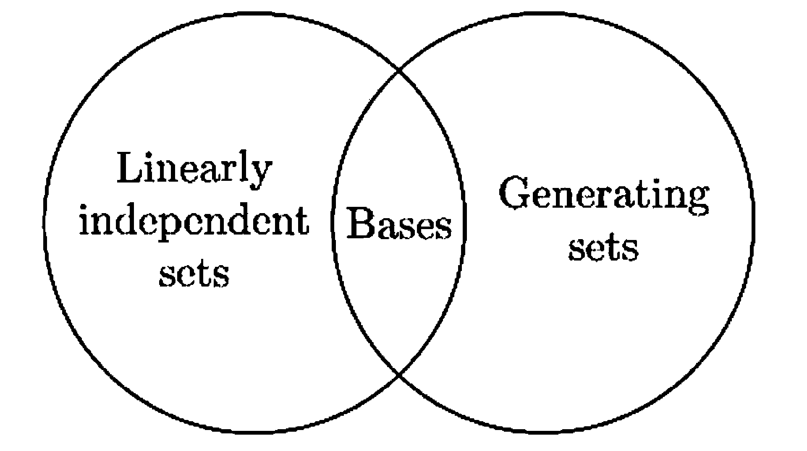

# § 6. Bases and Dimension

## Bases

!!! definition "Definition 6.1 : Basis"
    A **basis** $\beta$ for a vector space $V$ is a linearly independent subset of $V$ that generates $V$.
    If $\beta$ is a basis for $V$, we also say that the vectors of $\beta$ form a basis for $V$.

!!! theorem "Theorem 6.2 : A set is a basis if and only if every vector has a unique linear representation."
    Let $V$ be a vector space and $\beta=\left\{u_{1}, u_{2}, \ldots, u_{n}\right\}$ be a subset of $V$.
    Then $\beta$ is a basis for $V$ if and only if each $v \in V$ can be uniquely expressed as a linear combination of vectors of $\beta$, that is, can be expressed in the form
    
    $$
    v=a_{1} u_{1}+a_{2} u_{2}+\cdots+a_{n} u_{n}
    $$
    
    for unique scalars $a_{1}, a_{2}, \ldots, a_{n}$.

    !!! proof
        Let $\beta$ be a basis for $V$.
        If $v \in V$, then $v \in \operatorname{span}(\beta)$ because $\operatorname{span}(\beta)=V$.
        Thus $v$ is a linear combination of the vectors of $\beta$.
        Suppose that

        $$
        v=a_{1} u_{1}+a_{2} u_{2}+\cdots+a_{n} u_{n} \quad \text { and } \quad v=b_{1} u_{1}+b_{2} u_{2}+\cdots+b_{n} u_{n}
        $$

        are two such representations of $v$.
        Subtracting the second equation from the first gives

        $$
        0=\left(a_{1}-b_{1}\right) u_{1}+\left(a_{2}-b_{2}\right) u_{2}+\cdots+\left(a_{n}-b_{n}\right) u_{n}
        $$

        Since $\beta$ is linearly independent, it follows that $a_{1}-b_{1}=a_{2}-b_{2}=\cdots=a_{n}-b_{n}=0$.
        Hence $a_{1}=b_{1}, a_{2}=b_{2}, \cdots, a_{n}=b_{n}$, and so $v$ is uniquely expressible as a linear combination of the vectors of $\beta$.

        Conversely, assume that each $v\in V$ can be uniquely expressed as a linear combination of vectors of $\beta$.

        First, this assumption implies that every $v\in V$ can be written in the form

        $$
        v=a_{1}u_{1}+a_{2}u_{2}+\cdots+a_{n}u_{n}
        $$

        for some scalars $a_{1},\ldots,a_{n}$. Hence $v\in \operatorname{span}(\beta)$ for all $v\in V$, so

        $$
        V\subseteq \operatorname{span}(\beta).
        $$

        Since $\operatorname{span}(\beta)\subseteq V$ always holds, we conclude that

        $$
        \operatorname{span}(\beta)=V,
        $$

        so $\beta$ spans $V$.

        Next we show that $\beta$ is linearly independent. Suppose

        $$
        0=c_{1}u_{1}+c_{2}u_{2}+\cdots+c_{n}u_{n}.
        $$

        But $0\in V$, and by assumption it has a unique representation as a linear combination of vectors of $\beta$.
        One such representation is

        $$
        0=0u_{1}+0u_{2}+\cdots+0u_{n}.
        $$

        By uniqueness, we must have $c_{1}=c_{2}=\cdots=c_{n}=0$. Therefore $\beta$ is linearly independent.

        Since $\beta$ spans $V$ and is linearly independent, it is a basis for $V$.

!!! theorem "Theorem 6.3 : A finite generating set can be reduced to a basis."
    If a vector space $V$ is generated by a finite set $S$, then some subset of $S$ is a basis for $V$.
    Hence $V$ has a finite basis.

    !!! proof
        If $S=\varnothing$ or $S=\{0\}$, then $V=\{0\}$ and $\varnothing$ is a subset of $S$ that is a basis for $V$.
        
        Otherwise $S$ contains a nonzero vector $u_{1}$.
        By item 2 of **Concept 5.3**, $\left\{u_{1}\right\}$ is a linearly independent set.
        Continue, if possible, choosing vectors $u_{2}, \ldots, u_{k}$ in $S$ such that $\left\{u_{1}, u_{2}, \ldots, u_{k}\right\}$ is linearly independent. Since $S$ is a finite set, we must eventually reach a stage at which $\beta=\left\{u_{1}, u_{2}, \ldots, u_{k}\right\}$ is a linearly independent subset of $S$, but adjoining to $\beta$ any vector in $S$ not in $\beta$ produces a linearly dependent set.

        We claim that $\beta$ is a basis for $V$.
        Because $\beta$ is linearly independent by construction, it suffices to show that $\beta$ spans $V$.
        By **Theorem 4.3** we need to show that $S \subseteq \operatorname{span}(\beta)$.
        Let $v \in S$.
        If $v \in \beta$, then clearly $v \in \operatorname{span}(\beta)$.
        Otherwise, if $v \notin \beta$, then the preceding construction shows that $\beta \cup\{v\}$ is linearly dependent.
        So $v \in \operatorname{span}(\beta)$ by **Theorem 5.9**.
        Thus $S \subseteq \operatorname{span}(\beta)$.

!!! example "Example 6.4 : Reducing a finite generating set to a basis."
    Let

    $$
    S=\{(2,-3,5),(8,-12,20),(1,0,-2),(0,2,-1),(7,2,0)\}
    $$

    It can be shown that $S$ generates $\mathbb{R}^{3}$.
    We can select a basis for $\mathbb{R}^{3}$ that is a subset of $S$ by the technique used in proving **Theorem 6.3**.
    To start, select any nonzero vector in $S$, say $(2,-3,5)$, to be a vector in the basis.
    Since $4(2,-3,5)=(8,-12,20)$, the set $\{(2,-3,5),(8,-12,20)\}$ is linearly dependent by **Exercise 5.9**.
    Hence we do not include $(8,-12,20)$ in our basis.
    On the other hand, $(1,0,-2)$ is not a multiple of $(2,-3,5)$ and vice versa, so that the set $\{(2,-3,5),(1,0,-2)\}$ is linearly independent.
    Thus we include $(1,0,-2)$ as part of our basis.

    Now we consider the set $\{(2,-3,5),(1,0,-2),(0,2,-1)\}$ obtained by adjoining another vector in $S$ to the two vectors that we have already included in our basis.
    As before, we include $(0,2,-1)$ in our basis or exclude it from the basis according to whether $\{(2,-3,5),(1,0,-2),(0,2,-1)\}$ is linearly independent or linearly dependent.
    An easy calculation shows that this set is linearly independent, and so we include $(0,2,-1)$ in our basis.
    In a similar fashion the final vector in $S$ is included or excluded from our basis according to whether the set

    $$
    \{(2,-3,5),(1,0,-2),(0,2,-1),(7,2,0)\}
    $$

    is linearly independent or linearly dependent. Because
    
    $$
    2(2,-3,5)+3(1,0,-2)+4(0,2,-1)-(7,2,0)=(0,0,0)
    $$
    
    we exclude $(7,2,0)$ from our basis. We conclude that
    
    $$
    \{(2,-3,5),(1,0,-2),(0,2,-1)\}
    $$
    
    is a subset of $S$ that is a basis for $\mathbb{R}^{3}$.

## Dimension

!!! theorem "Theorem 6.5 : Replacement theorem"
    Let $V$ be a vector space that is generated by a set $G$ containing exactly $n$ vectors, and let $L$ be a linearly independent subset of $V$ containing exactly $m$ vectors.
    Then $m \leq n$ and there exists a subset $H$ of $G$ containing exactly $n-m$ vectors such that $L \cup H$ generates $V$.
    
    In other words, the size of any finite generating set is equal or larger than the size of any finite linearly independent set.
    Also, it is possible to replace $m$ vectors of $G$ with $L$ so that it still generates $V$.

    !!! proof
        The proof is by mathematical induction on $m$.
        The induction begins with $m=0$; for in this case $L=\varnothing$, and so taking $H=G$ gives the desired result.

        Now suppose that the theorem is true for some integer $m \geq 0$.
        We prove that the theorem is true for $m+1$.
        Let $L=\left\{v_{1}, v_{2}, \ldots, v_{m+1}\right\}$ be a linearly independent subset of V consisting of $m+1$ vectors.
        By the **Corollary 5.8**, $\left\{v_{1}, v_{2}, \ldots, v_{m}\right\}$ is linearly independent, and so we may apply the induction hypothesis to conclude that $m \leq n$ and that there is a subset $\left\{u_{1}, u_{2}, \ldots, u_{n-m}\right\}$ of $G$ such that $\left\{v_{1}, v_{2}, \ldots, v_{m}\right\} \cup\left\{u_{1}, u_{2}, \ldots, u_{n-m}\right\}$ generates $V$.
        Thus there exist scalars $a_{1}, a_{2}, \ldots, a_{m}, b_{1}, b_{2}, \ldots, b_{n-m}$ such that

        $$
        \begin{equation*}
        a_{1} v_{1}+a_{2} v_{2}+\cdots+a_{m} v_{m}+b_{1} u_{1}+b_{2} u_{2}+\cdots+b_{n-m} u_{n-m}=v_{m+1}
        \end{equation*}
        $$

        Note that $n-m>0$, let $v_{m+1}$ be a linear combination of $v_{1}, v_{2}, \ldots, v_{m}$, which by **Theorem 5.9** contradicts the assumption that $L$ is linearly independent.
        Hence $n>m$; that is, $n \geq m+1$.
        Moreover, some $b_{i}$, say $b_{1}$, is nonzero, for otherwise we obtain the same contradiction.
        
        Solving for $u_{1}$ gives

        $$
        \begin{gathered}
        u_{1}=\left(-b_{1}^{-1} a_{1}\right) v_{1}+\left(-b_{1}^{-1} a_{2}\right) v_{2}+\cdots+\left(-b_{1}^{-1} a_{m}\right) v_{m}+\left(b_{1}^{-1}\right) v_{m+1} \\
        +\left(-b_{1}^{-1} b_{2}\right) u_{2}+\cdots+\left(-b_{1}^{-1} b_{n-m}\right) u_{n-m} .
        \end{gathered}
        $$

        Let $H=\left\{u_{2}, \ldots, u_{n-m}\right\}$.
        Then $u_{1} \in \operatorname{span}(L \cup H)$, and because $v_{1}, v_{2}, \ldots, v_{m}$, $u_{2}, \ldots, u_{n-m}$ are clearly in $\operatorname{span}(L \cup H)$, it follows that

        $$
        \left\{v_{1}, v_{2}, \ldots, v_{m}, u_{1}, u_{2}, \ldots, u_{n-m}\right\} \subseteq \operatorname{span}(L \cup H)
        $$

        Because $\left\{v_{1}, v_{2}, \ldots, v_{m}, u_{1}, u_{2}, \ldots, u_{n-m}\right\}$ generates $V$, **Theorem 4.3** implies that $\operatorname{span}(L \cup H)=V$.
        Since $H$ is a subset of $G$ that contains $(n-m)-1=n-(m+1)$ vectors, the theorem is true for $m+1$.
        This completes the induction.

!!! corollary "Corollary 6.6 : Every finite basis has the same size."
    Let $V$ be a vector space having a finite basis.
    Then every basis for $V$ contains the same number of vectors.

    !!! proof
        Suppose that $\beta$ is a finite basis for $V$ that contains exactly $n$ vectors, and let $\gamma$ be any other basis for $V$.
        If $\gamma$ contains more than $n$ vectors, then we can select a subset $S$ of $\gamma$ containing exactly $n+1$ vectors.
        Since $S$ is linearly independent and $\beta$ generates $V$, the replacement theorem (**Theorem 6.5**) implies that $n+1 \leq n$, a contradiction.
        Therefore $\gamma$ is finite, and the number $m$ of vectors in $\gamma$ satisfies $m \leq n$.
        Reversing the roles of $\beta$ and $\gamma$ and arguing as above, we obtain $n \leq m$.
        Hence $m=n$.

!!! definition "Definition 6.7 : Dimension"
    A vector space is called **finite-dimensional** if it has a basis consisting of a finite number of vectors.
    The unique number of vectors in each basis for $V$ is called the **dimension** of $V$ and is denoted by $\operatorname{dim}(V)$.
    $A$ vector space that is not finite-dimensional is called **infinite-dimensional**.

!!! example "Example 6.8 : Basis for $\{0\}$"
    Recalling that $\operatorname{span}(\varnothing)=\{0\}$ and $\varnothing$ is linearly independent, we see that $\varnothing$ is a basis for the zero vector space.

    The vector space $\{0\}$ has dimension zero.

!!! example "Example 6.9 : Standard basis for $F^{n}$"
    In $F^{n}$, let $e_{1}=(1,0,0, \ldots, 0), e_{2}=(0,1,0, \ldots, 0), \ldots, e_{n}=(0,0, \ldots, 0,1)$; $\left\{e_{1}, e_{2}, \ldots, e_{n}\right\}$ is readily seen to be a basis for $F^{n}$ and is called the **standard basis** for $F^{n}$.

    The vector space $F^{n}$ has dimension $n$.

!!! example "Example 6.10 : Basis for $\mathrm{M}_{m \times n}(F)$"
    In $\mathrm{M}_{m \times n}(F)$, let $E^{i j}$ denote the matrix whose only nonzero entry is a $1$ in the $i$ th row and $j$ th column.
    Then $\left\{E^{i j}: 1 \leq i \leq m, 1 \leq j \leq n\right\}$ is a basis for $\mathrm{M}_{m \times n}(F)$.

    The vector space $\mathrm{M}_{m \times n}(F)$ has dimension $m n$.

!!! example "Example 6.11 : Standard basis for $\mathrm{P}_{n}(F)$"
    In $\mathrm{P}_{n}(F)$ the set $\left\{1, x, x^{2}, \ldots, x^{n}\right\}$ is a basis.
    We call this basis the **standard basis** for $\mathrm{P}_{n}(F)$.

    The vector space $\mathrm{P}_{n}(F)$ has dimension $n+1$.

!!! example "Example 6.12 : Basis for $\mathrm{P}(F)$"
    In $\mathrm{P}(F)$ the set $\left\{1, x, x^{2}, \ldots\right\}$ is a basis.

    In the terminology of dimension, the first conclusion in the replacement theorem (**Theorem 6.5**) states that if $V$ is a finite-dimensional vector space, then no linearly independent subset of $V$ can contain more than $\operatorname{dim}(V)$ vectors.
    From this fact it follows that the vector space $\mathrm{P}(F)$ is infinite-dimensional because it has an infinite linearly independent set, namely $\left\{1, x, x^{2}, \ldots\right\}$.
    
    This set is, in fact, a basis for $\mathrm{P}(F)$.
    Yet nothing that we have proved in this section guarantees an infinite-dimensional vector space must have a basis.
    In Section 7 it is shown, however, that every vector space has a basis.

!!! corollary "Corollary 6.13"
    Let $V$ be a vector space with dimension $n$.

    - (a) Any finite generating set for $V$ contains at least $n$ vectors, and a generating set for $V$ that contains exactly $n$ vectors is a basis for $V$.
    - (b) Any linearly independent subset of $V$ that contains exactly $n$ vectors is a basis for $V$.
    - (c) Every linearly independent subset of $V$ can be extended to a basis for $V$.

    !!! proof
        Let $\beta$ be a basis for $V$.
        
        - (a)  
            Let $G$ be a finite generating set for $V$.
            By **Theorem 6.3** some subset $H$ of $G$ is a basis for $V$.
            **Corollary 6.6** implies that $H$ contains exactly $n$ vectors.
            Since a subset of $G$ contains $n$ vectors, $G$ must contain at least $n$ vectors.
            Moreover, if $G$ contains exactly $n$ vectors, then we must have $H=G$, so that $G$ is a basis for $V$.
        
        - (b)  
            Let $L$ be a linearly independent subset of $V$ containing exactly $n$ vectors.
            It follows from the replacement theorem (**Theorem 6.5**) that there is a subset $H$ of $\beta$ containing $n-n=0$ vectors such that $L \cup H$ generates $V$.
            Thus $H=\varnothing$, and $L$ generates $V$.
            Since $L$ is also linearly independent, $L$ is a basis for $V$.

        - (c)  
            If $L$ is a linearly independent subset of $V$ containing $m$ vectors, then the replacement theorem (**Theorem 6.5**) asserts that there is a subset $H$ of $\beta$ containing exactly $n-m$ vectors such that $L \cup H$ generates $V$.
            Now $L \cup H$ contains at most $n$ vectors; therefore (a) implies that $L \cup H$ contains exactly $n$ vectors and that $L \cup H$ is a basis for $V$.

## Summary on Bases, Generating Sets, Linearly Independent Sets, and Dimension

A basis for a vector space $V$ is a linearly independent subset of $V$ that generates $V$.
If $V$ has a finite basis, then every basis for $V$ contains the same number of vectors.
This number is called the dimension of $V$, and $V$ is said to be finite-dimensional.
Thus if the dimension of $V$ is $n$, every basis for $V$ contains exactly $n$ vectors.
Moreover, every linearly independent subset of $V$ contains no more than $n$ vectors and can be extended to a basis for $V$ by including appropriately chosen vectors. 
Also, each generating set for $V$ contains at least $n$ vectors and can be reduced to a basis for $V$ by excluding appropriately chosen vectors.

{: .center style="width:60%;"}
/// caption
Figure 6.1.
///

## Dimension of Subspaces

!!! theorem "Theorem 6.14 : Dimension of a subspace is smaller than the dimension of a finite-dimensional vector space."
    Let $W$ be a subspace of a finite-dimensional vector space $V$.
    Then $W$ is finite-dimensional and $\operatorname{dim}(W) \leq \operatorname{dim}(V)$.
    Moreover, if $\operatorname{dim}(W)=\operatorname{dim}(V)$, then $V=W$.

    !!! proof
        Let $\operatorname{dim}(V)=n$.
        If $W=\{0\}$, then $W$ is finite-dimensional and $\operatorname{dim}(W)=0 \leq n$.
        Otherwise, $W$ contains a nonzero vector $x_{1}$; so $\left\{x_{1}\right\}$ is a linearly independent set.
        Continue choosing vectors, $x_{1}, x_{2}, \ldots, x_{k}$ in $W$ such that $\left\{x_{1}, x_{2}, \ldots, x_{k}\right\}$ is linearly independent.
        Since no linearly independent subset of $V$ can contain more than $n$ vectors, this process must stop at a stage where $k \leq n$ and $\left\{x_{1}, x_{2}, \ldots, x_{k}\right\}$ is linearly independent but adjoining any other vector from $W$ produces a linearly dependent set.
        **Theorem 5.9** implies that $\left\{x_{1}, x_{2}, \ldots, x_{k}\right\}$ generates $W$, and hence it is a basis for $W$.
        Therefore $\operatorname{dim}(W)=k \leq n$.

        If $\operatorname{dim}(W)=n$, then a basis for $W$ is a linearly independent subset of $V$ containing $n$ vectors.
        But **Corollary 6.13** implies that this basis for $W$ is also a basis for $V$; so $W=V$.

!!! corollary "Corollary 6.15"
    If $W$ is a subspace of a finite-dimensional vector space $V$, then any basis for $W$ can be extended to a basis for $V$.

    !!! proof
        Let $S$ be a basis for $W$.
        Because $S$ is a linearly independent subset of $V$, **Corollary 6.13** guarantees that $S$ can be extended to a basis for $V$.

!!! concept "Concept 6.16 : Subspaces of $\mathbb{R}^2, \mathbb{R}^3$"
    We can apply **Theorem 6.14** to determine the subspaces of $\mathbb{R}^{2}$ and $\mathbb{R}^{3}$.
    Since $\mathbb{R}^{2}$ has dimension $2$, subspaces of $\mathbb{R}^{2}$ can be of dimensions $0$, $1$, or $2$ only.
    The only subspaces of dimension $0$ or $2$ are $\{0\}$ and $\mathbb{R}^{2}$ respectively.
    Any subspace of $\mathbb{R}^{2}$ having dimension $1$ consists of all scalar multiples of some nonzero vector in $\mathbb{R}^{2}$ (**Exercise 4.11**).

    If a point of $\mathbb{R}^{2}$ is identified in the natural way with a point in the Euclidean plane, then it is possible to describe the subspaces of $\mathbb{R}^{2}$ geometrically: $A$ subspace of $\mathbb{R}^{2}$ having dimension $0$ consists of the origin of the Euclidean plane, a subspace of $\mathbb{R}^{2}$ with dimension $1$ consists of a line through the origin, and a subspace of $\mathbb{R}^{2}$ having dimension $2$ is the entire Euclidean plane.

    Similarly, the subspaces of $\mathbb{R}^{3}$ must have dimensions $0$, $1$, $2$, or $3$.
    Interpreting these possibilities geometrically, we see that a subspace of dimension zero must be the origin of Euclidean 3 space, a subspace of dimension $1$ is a line through the origin, a subspace of dimension $2$ is a plane through the origin, and a subspace of dimension $3$ is Euclidean 3-space itself.

## Lagrange Interpolation Formula

!!! concept "Concept 6.17 : Lagrange interpolation formula"
    Let $c_{0}, c_{1}, \ldots, c_{n}$ be distinct scalars in an infinite field $F$. 
    The polynomials $f_{0}(x), f_{1}(x), \ldots f_{n}(x)$ defined by
    
    $$
    f_{i}(x)=\frac{\left(x-c_{0}\right) \cdots\left(x-c_{i-1}\right)\left(x-c_{i+1}\right) \cdots\left(x-c_{n}\right)}{\left(c_{i}-c_{0}\right) \cdots\left(c_{i}-c_{i-1}\right)\left(c_{i}-c_{i+1}\right) \cdots\left(c_{i}-c_{n}\right)}=\prod_{\substack{k=0 \\ k \neq i}}^{n} \frac{x-c_{k}}{c_{i}-c_{k}}
    $$

    are called the **Lagrange polynomials** (associated with $c_{0}, c_{1}, \ldots, c_{n}$).
    Note that each $f_{i}(x)$ is a polynomial of degree $n$ and hence is in $\mathrm{P}_{n}(F)$.
    By regarding $f_{i}(x)$ as a polynomial function $f_{i}: F \rightarrow F$, we see that

    $$
    f_{i}\left(c_{j}\right)= \begin{cases}0 & \text { if } i \neq j \\ 1 & \text { if } i=j\end{cases}
    $$

    This property of Lagrange polynomials can be used to show that $\beta=\left\{f_{0}, f_{1}, \ldots, f_{n}\right\}$ is a linearly independent subset of $\mathrm{P}_{n}(F)$.

    !!! proof
        Suppose that
        
        $$
        \sum_{i=0}^{n} a_{i} f_{i}=0 \quad \text { for some scalars } a_{0}, a_{1}, \ldots, a_{n}
        $$
        
        where $0$ denotes the zero function. Then
        
        $$
        \sum_{i=0}^{n} a_{i} f_{i}\left(c_{j}\right)=0 \quad \text { for } j=0,1, \ldots, n
        $$

        But also
        
        $$
        \sum_{i=0}^{n} a_{i} f_{i}\left(c_{j}\right)=a_{j}
        $$
        
        by the property above.
        Hence $a_{j}=0$ for $j=0,1, \ldots, n$; so $\beta$ is linearly independent.
    
    Since the dimension of $\mathrm{P}_{n}(F)$ is $n+1$, it follows from **Corollary 6.13** that $\beta$ is a basis for $\mathrm{P}_{n}(F)$.

    Because $\beta$ is a basis for $\mathrm{P}_{n}(F)$, every polynomial function $g$ in $\mathrm{P}_{n}(F)$ is a linear combination of polynomial functions of $\beta$, say,

    $$
    g=\sum_{i=0}^{n} b_{i} f_{i}
    $$

    It follows that
    
    $$
    g\left(c_{j}\right)=\sum_{i=0}^{n} b_{i} f_{i}\left(c_{j}\right)=b_{j}
    $$
    
    so
    
    $$
    g=\sum_{i=0}^{n} g\left(c_{i}\right) f_{i}
    $$
    
    is the unique representation of $g$ as a linear combination of elements of $\beta$. This representation is called the **Lagrange interpolation formula**. 
    Notice that the preceding argument shows that if $b_{0}, b_{1}, \ldots, b_{n}$ are any $n+1$ scalars in $F$ (not necessarily distinct), then the polynomial function
        
    $$
    g=\sum_{i=0}^{n} b_{i} f_{i}
    $$

    is the unique polynomial in $\mathrm{P}_{n}(F)$ such that $g\left(c_{j}\right)=b_{j}$.
    Thus we have found the unique polynomial of degree not exceeding $n$ that has specified values $b_{j}$ at given points $c_{j}$ in its domain $(j=0,1, \ldots, n)$.

    An important consequence of the Lagrange interpolation formula is the following result: If $f \in \mathrm{P}_{n}(F)$ and $f\left(c_{i}\right)=0$ for $n+1$ distinct scalars $c_{0}, c_{1}, \ldots, c_{n}$ in $F$, then $f$ is the zero function.

!!! example "Example 6.18 : Computation of the Lagrange interpolation formula"
    Let us construct the real polynomial $g$ of degree at most $2$ whose graph contains the points $(1,8),(2,5)$, and $(3,-4)$.
    (Thus, in the notation above, $c_{0}=1, c_{1}=2$, $c_{2}=3, b_{0}=8, b_{1}=5$, and $b_{2}=-4$.)
    The Lagrange polynomials associated with $c_{0}, c_{1}$, and $c_{2}$ are
    
    $$
    \begin{aligned}
    & f_{0}(x)=\frac{(x-2)(x-3)}{(1-2)(1-3)}=\frac{1}{2}\left(x^{2}-5 x+6\right) \\
    & f_{1}(x)=\frac{(x-1)(x-3)}{(2-1)(2-3)}=-1\left(x^{2}-4 x+3\right)
    \end{aligned}
    $$

    and
    
    $$
    f_{2}(x)=\frac{(x-1)(x-2)}{(3-1)(3-2)}=\frac{1}{2}\left(x^{2}-3 x+2\right) .
    $$
    
    Hence the desired polynomial is

    $$
    \begin{aligned}
    g(x) & =\sum_{i=0}^{2} b_{i} f_{i}(x)=8 f_{0}(x)+5 f_{1}(x)-4 f_{2}(x) \\
    & =4\left(x^{2}-5 x+6\right)-5\left(x^{2}-4 x+3\right)-2\left(x^{2}-3 x+2\right) \\
    & =-3 x^{2}+6 x+5
    \end{aligned}
    $$

## Exercise

!!! exercise "Exercise 6.20"
    Let $V$ be a vector space having dimension $n$, and let $S$ be a subset of $V$ that generates $V$.

    - (a) Prove that there is a subset of $S$ that is a basis for $V$. (Be careful not to assume that $S$ is finite.)
    - (b) Prove that $S$ contains at least $n$ vectors.

!!! exercise "Exercise 6.29"
    - (a)
        Prove that if $W_{1}$ and $W_{2}$ are finite-dimensional subspaces of a vector space $V$, then the subspace $W_{1}+W_{2}$ is finite-dimensional, and $\operatorname{dim}\left(W_{1}+W_{2}\right)=\operatorname{dim}\left(W_{1}\right)+\operatorname{dim}\left(W_{2}\right)-\operatorname{dim}\left(W_{1} \cap W_{2}\right)$.  
        Hint: Start with a basis $\left\{u_{1}, u_{2}, \ldots, u_{k}\right\}$ for $W_{1} \cap W_{2}$ and extend this set to a basis $\left\{u_{1}, u_{2}, \ldots, u_{k}, v_{1}, v_{2}, \ldots v_{m}\right\}$ for $W_{1}$ and to a basis $\left\{u_{1}, u_{2}, \ldots, u_{k}, w_{1}, w_{2}, \ldots w_{p}\right\}$ for $W_{2}$.
    - (b)
        Let $W_{1}$ and $W_{2}$ be finite-dimensional subspaces of a vector space $V$, and let $V=W_{1}+W_{2}$.
        Deduce that $V$ is the direct sum of $W_{1}$ and $W_{2}$ if and only if $\operatorname{dim}(V)=\operatorname{dim}\left(W_{1}\right)+\operatorname{dim}\left(W_{2}\right)$.

!!! exercise "Exercise 6.31"
    Let $W_{1}$ and $W_{2}$ be subspaces of a vector space $V$ having dimensions $m$ and $n$, respectively, where $m \geq n$.
    
    - (a) Prove that $\operatorname{dim}\left(W_{1} \cap W_{2}\right) \leq n$.
    - (b) Prove that $\operatorname{dim}\left(W_{1}+W_{2}\right) \leq m+n$.

!!! exercise "Exercise 6.33"
    - (a)
        Let $W_{1}$ and $W_{2}$ be subspaces of a vector space $V$ such that $V=W_{1} \oplus W_{2}$.
        If $\beta_{1}$ and $\beta_{2}$ are bases for $W_{1}$ and $W_{2}$, respectively, show that $\beta_{1} \cap \beta_{2}=\varnothing$ and $\beta_{1} \cup \beta_{2}$ is a basis for $V$.
    - (b)
        Conversely, let $\beta_{1}$ and $\beta_{2}$ be disjoint bases for subspaces $W_{1}$ and $W_{2}$, respectively, of a vector space $V$.
        Prove that if $\beta_{1} \cup \beta_{2}$ is a basis for $V$, then $V=W_{1} \oplus W_{2}$.
    
!!! exercise "Exercise 6.35"
    Let $W$ be a subspace of a finite-dimensional vector space $V$, and consider the basis $\left\{u_{1}, u_{2}, \ldots, u_{k}\right\}$ for $W$.
    Let $\left\{u_{1}, u_{2}, \ldots, u_{k}, u_{k+1}, \ldots, u_{n}\right\}$ be an extension of this basis to a basis for $V$.
    
    - (a) Prove that $\left\{u_{k+1}+W, u_{k+2}+W, \ldots, u_{n}+W\right\}$ is a basis for $V / W$.
    - (b) Derive a formula relating $\operatorname{dim}(V), \operatorname{dim}(W)$, and $\operatorname{dim}(V / W)$.
