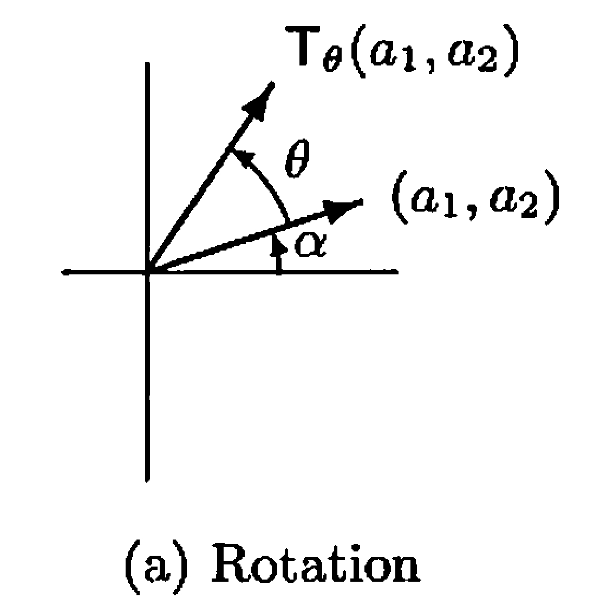
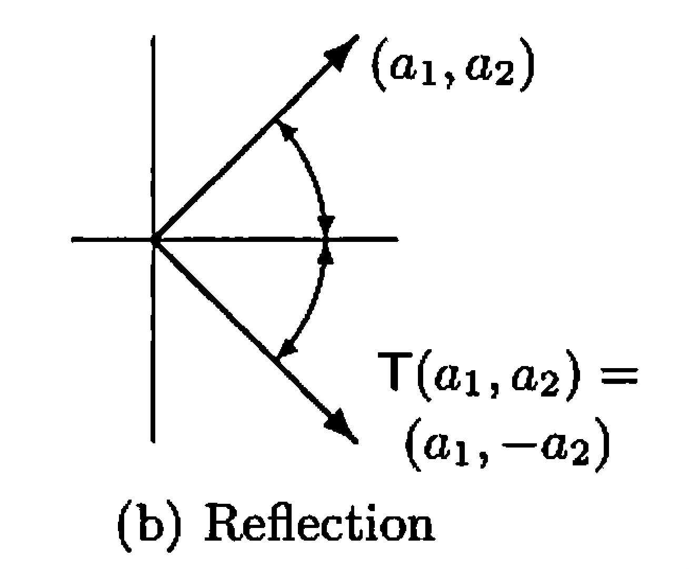
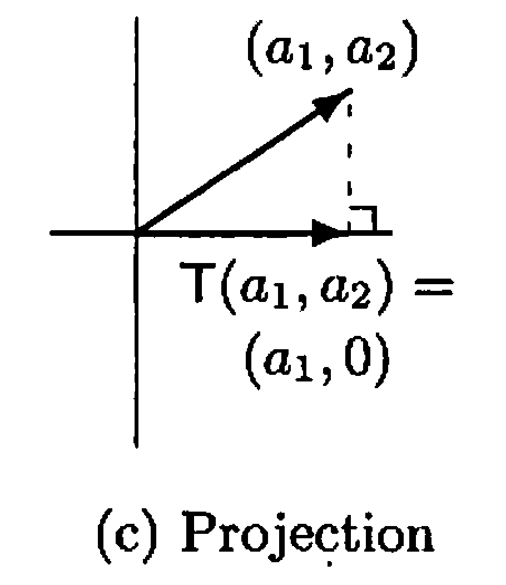

# § 8. Linear Transformations, Null Spaces, and Ranges

## Definition and Examples of Linear Transformation

!!! definition "Definition 8.1 : Linear Transformation"
    Let $V$ and $W$ be vector spaces (over $F$).
    We call a function $T: V \rightarrow W$ a **linear transformation** from $V$ to $W$ if, for all $x, y \in V$ and $c \in F$, we have

    - (a) $T(x+y)=T(x)+T(y)$ and
    - (b) $T(c x)=c T(x)$.

    We often simply call $T$ **linear**.

!!! concept "Concept 8.2 : Properties of linear transformation"
    1. If $T$ is linear, then $T(0)=0$.
    2. $T$ is linear if and only if $T(c x+y)=c T(x)+T(y)$ for all $x, y \in V$ and $c \in F$.
    3. If $T$ is linear, then $T(x-y)=T(x)-T(y)$ for all $x, y \in V$.
    4. $T$ is linear if and only if, for $x_{1}, x_{2} \ldots, x_{n} \in V$ and $a_{1}, a_{2}, \ldots, a_{n} \in F$, we have

        $$
        T\left(\sum_{i=1}^{n} a_{i} x_{i}\right)=\sum_{i=1}^{n} a_{i} T\left(x_{i}\right)
        $$

    We generally use **property 2** to prove that a given transformation is linear.

!!! example "Example 8.3 : Rotation by $\theta$ is linear."
    {: .center style="width:30%;"}
    /// caption
    Figure 8.1.
    ///

    For any angle $\theta$, define $T_{\theta}: \mathbb{R}^2 \rightarrow \mathbb{R}^2$ by the rule: $T_{\theta}\left(a_{1}, a_{2}\right)$ is the vector obtained by rotating ( $a_{1}, a_{2}$ ) counterclockwise by $\theta$ if ( $a_{1}, a_{2}$ ) $\neq(0,0)$, and $T_{\theta}(0,0)=(0,0)$.
    Then $T_{\theta}: \mathbb{R}^2 \rightarrow \mathbb{R}^2$ is a linear transformation that is called the **rotation by $\theta$**.

    We determine an explicit formula for $T_{\theta}$.
    Fix a nonzero vector $\left(a_{1}, a_{2}\right) \in$ $\mathbb{R}^{2}$.
    Let $\alpha$ be the angle that $( $a_{1}, a_{2}$ )$ makes with the positive $x$-axis, and let $r=\sqrt{a_{1}^{2}+a_{2}^{2}}$.
    Then $a_{1}=r \cos \alpha$ and $a_{2}=r \sin \alpha$.
    Also, $T_{\theta}\left(a_{1}, a_{2}\right)$ has length $r$ and makes an angle $\alpha+\theta$ with the positive $x$-axis.
    It follows that

    $$
    \begin{aligned}
    T_{\theta}\left(a_{1}, a_{2}\right) & =(r \cos (\alpha+\theta), r \sin (\alpha+\theta)) \\
    & =(r \cos \alpha \cos \theta-r \sin \alpha \sin \theta, r \cos \alpha \sin \theta+r \sin \alpha \cos \theta) \\
    & =\left(a_{1} \cos \theta-a_{2} \sin \theta, a_{1} \sin \theta+a_{2} \cos \theta\right)
    \end{aligned}
    $$

    Finally, observe that this same formula is valid for $\left(a_{1}, a_{2}\right)=(0,0)$.
    It is now easy to show that $T_{\theta}$ is linear.

    $$
    \begin{aligned}
    T_{\theta}\left(c (a_{1}, a_{2}) + (b_{1}, b_{2})\right) & = \left((c a_{1} + b_{1}) \cos \theta-(c a_{2} + b_{2}) \sin \theta, (c a_{1} + b_{1}) \sin \theta+(c a_{2} + b_{2}) \cos \theta\right) \\
    & = c \left(a_{1} \cos \theta-a_{2} \sin \theta, a_{1} \sin \theta+a_{2} \cos \theta\right) + \left(b_{1} \cos \theta-b_{2} \sin \theta, b_{1} \sin \theta+b_{2} \cos \theta\right) \\
    & = c T_{\theta}\left(a_{1}, a_{2}\right) + T_{\theta}\left(b_{1}, b_{2}\right)
    \end{aligned}
    $$

!!! example "Example 8.4 : Reflection about the $x$-axis is linear."
    {: .center style="width:35%;"}
    /// caption
    Figure 8.2.
    ///

    Define $T: \mathbb{R}^2 \rightarrow \mathbb{R}^2$ by $T\left(a_{1}, a_{2}\right)=\left(a_{1},-a_{2}\right)$.
    $T$ is called the **reflection about the $x$-axis**.
    It can be shown that $T$ is also a linear transformation.

!!! example "Example 8.5 : Projection on the $x$-axis is linear."
    {: .center style="width:25%;"}
    /// caption
    Figure 8.3.
    ///

    Define $T: \mathbb{R}^2 \rightarrow \mathbb{R}^2$ by $T\left(a_{1}, a_{2}\right)=\left(a_{1}, 0\right)$.
    $T$ is called the **projection on the $x$-axis**.
    It can be shown that $T$ is also a linear transformation.

!!! example "Example 8.6 : Taking derivative of polynomials are linear."
    Define $T: \mathrm{P}_{n}(\mathbb{R}) \rightarrow \mathrm{P}_{n-1}(\mathbb{R})$ by $T(f(x))=f^{\prime}(x)$, where $f^{\prime}(x)$ denotes the derivative of $f(x)$.
    To show that $T$ is linear, let $g(x), h(x) \in \mathrm{P}_{n}(\mathbb{R})$ and $a \in \mathbb{R}$.
    Now $T$ is linear since

    $$
    T(a g(x)+h(x))=(a g(x)+h(x))^{\prime}=a g^{\prime}(x)+h^{\prime}(x)=a T(g(x))+T(h(x))
    $$

!!! example "Example 8.7 : Taking the definite integral of functions is linear."
    Let $V=\mathcal{C}(\mathbb{R})$, the vector space of continuous real-valued functions on $\mathbb{R}$.
    Let $a, b \in \mathbb{R}, a<b$.
    Define $T: V \rightarrow \mathbb{R}$ by

    $$
    T(f)=\int_{a}^{b} f(t) d t
    $$

    for all $f \in V$.
    Then $T$ is a linear transformation because the definite integral of a linear combination of functions is the same as the linear combination of the definite integrals of the functions.

## Null Space and Range

!!! definition "Definition 8.8 : Identity Transformation / Zero Transformation"
    For vector spaces $V$ and $W$ (over $F$), we define the **identity transformation** $I_{V}: V \rightarrow V$ by $I_{V}(x)=x$ for all $x \in V$ and the **zero transformation** $T_{0}: V \rightarrow W$ by $T_{0}(x)=0$ for all $x \in V$.
    It is clear that both of these transformations are linear.
    We often write $I$ instead of $I_{V}$.

!!! definition "Definition 8.9 : Null Space / Range"
    Let $V$ and $W$ be vector spaces, and let $T: V \rightarrow W$ be linear.
    We define the **null space** (or **kernel**) $N(T)$ of $T$ to be the set of all vectors $x$ in $V$ such that $T(x)=0$; that is, $N(T)=\{x \in V: T(x)=0\}$.

    We define the **range** (or **image**) $R(T)$ of $T$ to be the subset of $W$ consisting of all images (under $T$) of vectors in $V$; that is, $R(T)=\{T(x): x \in V\}$.

!!! theorem "Theorem 8.10 : Null space and range are subspaces."
    Let $V$ and $W$ be vector spaces and $T: V \rightarrow W$ be linear.
    Then $N(T)$ and $R(T)$ are subspaces of $V$ and $W$, respectively.

    !!! proof
        To clarify the notation, we use the symbols $0_{V}$ and $0_{W}$ to denote the zero vectors of $V$ and $W$, respectively.

        Since $T\left(0_{V}\right)=0_{W}$, we have that $0_{V} \in N(T)$.
        Let $x, y \in N(T)$ and $c \in F$.
        Then $T(x+y)=T(x)+T(y)=0_{W}+0_{W}=0_{W}$, and $T(c x)=c T(x)=c 0_{W}=$ $0_{W}$.
        Hence $x+y \in N(T)$ and $c x \in N(T)$, so that $N(T)$ is a subspace of $V$.

        Because $T\left(0_{V}\right)=0_{W}$, we have that $0_{W} \in R(T)$.
        Now let $x, y \in R(T)$ and $c \in F$.
        Then there exist $v$ and $w$ in $V$ such that $T(v)=x$ and $T(w)=y$.
        So $T(v+w)=T(v)+T(w)=x+y$, and $T(c v)=c T(v)=c x$.
        Thus $x+y \in R(T)$ and $c x \in R(T)$, so $R(T)$ is a subspace of $W$.

!!! theorem "Theorem 8.11 : Range is spanned by images of a basis."
    Let $V$ and $W$ be vector spaces, and let $T: V \rightarrow W$ be linear.
    If $\beta=\left\{v_{1}, v_{2}, \ldots, v_{n}\right\}$ is a basis for $V$, then

    $$
    R(T)=\operatorname{span}(T(\beta))=\operatorname{span}\left(\left\{T\left(v_{1}\right), T\left(v_{2}\right), \ldots, T\left(v_{n}\right)\right\}\right)
    $$

    !!! proof
        Clearly $T\left(v_{i}\right) \in R(T)$ for each $i$.
        Because $R(T)$ is a subspace, $R(T)$ contains $\operatorname{span}\left(\left\{T\left(v_{1}\right), T\left(v_{2}\right), \ldots, T\left(v_{n}\right)\right\}\right)=\operatorname{span}(T(\beta))$ by **Theorem 4.3**.

        Now suppose that $w \in R(T)$.
        Then $w=T(v)$ for some $v \in V$.
        Because $\beta$ is a basis for $V$, we have

        $$
        v=\sum_{i=1}^{n} a_{i} v_{i} \quad \text { for some } a_{1}, a_{2}, \ldots, a_{n} \in F
        $$

        Since $T$ is linear, it follows that

        $$
        w=T(v)=\sum_{i=1}^{n} a_{i} T\left(v_{i}\right) \in \operatorname{span}(T(\beta))
        $$

        So $R(T)$ is contained in $\operatorname{span}(T(\beta))$.

Note that **Theorem 8.11** can be generalized to the case of infinite basis. (**Exercise 8.33**)

!!! definition "Definition 8.12 : Nullity, Rank"
    Let $V$ and $W$ be vector spaces, and let $T: V \rightarrow W$ be linear.
    If $N(T)$ and $R(T)$ are finite-dimensional, then we define the **nullity** of $T$, denoted $\operatorname{nullity}(T)$, and the **rank** of $T$, denoted $\operatorname{rank}(T)$, to be the dimensions of $N(T)$ and $R(T)$, respectively.

!!! theorem "Theorem 8.13 : Dimension Theorem"
    Let $V$ and $W$ be vector spaces, and let $T: V \rightarrow W$ be linear.
    If $V$ is finite-dimensional, then

    $$
    \operatorname{nullity}(T)+\operatorname{rank}(T)=\operatorname{dim}(V)
    $$

    !!! proof
        Suppose that $\operatorname{dim}(V)=n, \operatorname{dim}(N(T))=k$, and $\left\{v_{1}, v_{2}, \ldots, v_{k}\right\}$ is a basis for $N(T)$.
        By **Corollary 6.15**, we may extend $\left\{v_{1}, v_{2}, \ldots, v_{k}\right\}$ to a basis $\beta=\left\{v_{1}, v_{2}, \ldots, v_{n}\right\}$ for $V$.
        We claim that $S=$ $\left\{T\left(v_{k+1}\right), T\left(v_{k+2}\right), \ldots, T\left(v_{n}\right)\right\}$ is a basis for $R(T)$.

        First we prove that $S$ generates $R(T)$.
        Using **Theorem 8.11** and the fact that $T\left(v_{i}\right)=0$ for $1 \leq i \leq k$, we have

        $$
        \begin{aligned}
        R(T) & =\operatorname{span}\left(\left\{T\left(v_{1}\right), T\left(v_{2}\right), \ldots, T\left(v_{n}\right)\right\}\right. \\
        & =\operatorname{span}\left(\left\{T\left(v_{k+1}\right), T\left(v_{k+2}\right), \ldots, T\left(v_{n}\right)\right\}=\operatorname{span}(S) .\right.
        \end{aligned}
        $$

        Now we prove that $S$ is linearly independent. Suppose that

        $$
        \sum_{i=k+1}^{n} b_{i} T\left(v_{i}\right)=0 \quad \text { for } b_{k+1}, b_{k+2}, \ldots, b_{n} \in F
        $$

        Using the fact that $T$ is linear, we have

        $$
        T\left(\sum_{i=k+1}^{n} b_{i} v_{i}\right)=0
        $$

        So

        $$
        \sum_{i=k+1}^{n} b_{i} v_{i} \in N(T)
        $$

        Hence there exist $c_{1}, c_{2}, \ldots, c_{k} \in F$ such that

        $$
        \sum_{i=k+1}^{n} b_{i} v_{i}=\sum_{i=1}^{k} c_{i} v_{i} \quad \text { or } \quad \sum_{i=1}^{k}\left(-c_{i}\right) v_{i}+\sum_{i=k+1}^{n} b_{i} v_{i}=0
        $$

        Since $\beta$ is a basis for $V$, we have $b_{i}=0$ for all $i$.
        Hence $S$ is linearly independent.
        Notice that this argument also shows that $T\left(v_{k+1}\right), T\left(v_{k+2}\right), \ldots, T\left(v_{n}\right)$ are distinct; therefore $\operatorname{rank}(T)=n-k$.

## Relation of One-to-One and Onto with Rank and Nullity

!!! theorem "Theorem 8.14 : One-to-one iff null space is trivial."
    Let $V$ and $W$ be vector spaces, and let $T: V \rightarrow W$ be linear.
    Then $T$ is one-to-one if and only if $N(T)=\{0\}$.

    !!! proof
        Suppose that $T$ is one-to-one and $x \in N(T)$.
        Then $T(x)=0=$ $T(0)$.
        Since $T$ is one-to-one, we have $x=0$.
        Hence $N(T)=\{0\}$.

        Now assume that $N(T)=\{0\}$, and suppose that $T(x)=T(y)$.
        Then $0=T(x)-T(y)=T(x-y)$ by **Concept 8.2**.
        Therefore $x-y \in$ $N(T)=\{0\}$.
        So $x-y=0$, or $x=y$.
        This means that $T$ is one-to-one.

!!! theorem "Theorem 8.15 : One-to-one, onto, and full rank in equal finite dimensions."
    Let $V$ and $W$ be vector spaces of equal (finite) dimension, and let $T: V \rightarrow W$ be linear.
    Then the following are equivalent.

    - (a) $T$ is one-to-one.
    - (b) $T$ is onto.
    - (c) $\operatorname{rank}(T)=\operatorname{dim}(V)$.

    !!! proof
        From the dimension theorem, we have

        $$
        \operatorname{nullity}(T)+\operatorname{rank}(T)=\operatorname{dim}(V)
        $$

        Now, with the use of **Theorem 8.14**, we have that $T$ is one-to-one if and only if $N(T)=\{0\}$, if and only if nullity $(T)=0$, if and only if $\operatorname{rank}(T)=\operatorname{dim}(V)$, if and only if $\operatorname{rank}(T)=\operatorname{dim}(W)$, and if and only if $\operatorname{dim}(R(T))=\operatorname{dim}(W)$.
        By **Theorem 6.14**, this equality is equivalent to $R(T)=W$, the definition of $T$ being onto.

We note that if $V$ is not finite-dimensional and $T: V \rightarrow V$ is linear, then it does not follow that one-to-one and onto are equivalent. (See **Exercise 8.15**, **Exercise 8.16**, and **Exercise 8.21**.)

!!! theorem "Theorem 8.16 : One-to-one maps preserve linear independence."
    Let $V$ and $W$ be vector spaces over a field $F$, and let $T : V \to W$ be linear.

    - (a) 
        $T$ is one-to-one if and only if $T$ carries linearly independent subsets of $V$ onto linearly independent subsets of $W$.

    - (b) 
        Suppose that $T$ is one-to-one and that $S \subseteq V$.
        Then $S$ is linearly independent if and only if $T(S)$ is linearly independent.

    - (c) 
        Suppose $\beta = \{v_1, v_2, \ldots, v_n\}$ is a basis for $V$ and $T$ is one-to-one and onto.
        Then

        $$
        T(\beta) = \{T(v_1), T(v_2), \ldots, T(v_n)\}
        $$

        is a basis for $W$.

    !!! proof
        - (a)  
            First suppose that $T$ is one-to-one.
            Let $S = \{v_1, \ldots, v_k\}$ be a linearly independent subset of $V$.
            To show that $T(S)$ is linearly independent, consider a linear relation

            $$
            a_1 T(v_1) + \cdots + a_k T(v_k) = 0
            $$

            for some scalars $a_1, \ldots, a_k \in F$.
            By linearity of $T$,

            $$
            T(a_1 v_1 + \cdots + a_k v_k) = a_1 T(v_1) + \cdots + a_k T(v_k) = 0.
            $$

            Since $T$ is one-to-one, $N(T)=\{0\}$, so

            $$
            a_1 v_1 + \cdots + a_k v_k = 0.
            $$

            Because $S$ is linearly independent, we must have $a_1 = \cdots = a_k = 0$.
            Hence $T(S)$ is linearly independent.

            Conversely, suppose that $T$ carries every linearly independent subset of $V$ onto a linearly independent subset of $W$.
            We show that $T$ is one-to-one.
            Let $v \in V$ satisfy $T(v) = 0$.
            If $v \neq 0$, then the singleton set $\{v\}$ is linearly independent in $V$.
            By assumption, $T(\{v\}) = \{T(v)\} = \{0\}$ must be linearly independent in $W$, which is impossible because $\{0\}$ is linearly dependent.
            Thus $v$ must be $0$, and so $N(T) = \{0\}$.
            Therefore, $T$ is one-to-one.

        - (b)  
            Now assume that $T$ is one-to-one and let $S \subseteq V$.

            If $S$ is linearly independent, then by part (a) $T(S)$ is linearly independent.

            Conversely, suppose $T(S)$ is linearly independent and assume, for contradiction, that $S$ is linearly dependent.
            Then there exist distinct vectors $v_1, \ldots, v_k \in S$ and scalars $a_1, \ldots, a_k$, not all zero, such that

            $$
            a_1 v_1 + \cdots + a_k v_k = 0.
            $$

            Applying $T$ and using linearity,

            $$
            a_1 T(v_1) + \cdots + a_k T(v_k) = T(a_1 v_1 + \cdots + a_k v_k) = T(0) = 0.
            $$

            This is a nontrivial linear relation among the vectors $T(v_1), \ldots, T(v_k)$, so $T(S)$ is linearly dependent, contradicting our assumption.
            Hence $S$ must be linearly independent.

            Therefore, when $T$ is one-to-one, $S$ is linearly independent if and only if $T(S)$ is linearly independent.

        - (c)
            Suppose now that $\beta = \{v_1, \ldots, v_n\}$ is a basis for $V$ and that $T$ is one-to-one and onto.

            By part (b), since $\beta$ is linearly independent and $T$ is one-to-one, the set

            $$
            T(\beta) = \{T(v_1), \ldots, T(v_n)\}
            $$

            is linearly independent in $W$.

            To show that $T(\beta)$ spans $W$, let $w \in W$.
            Because $T$ is onto, there exists $v \in V$ such that $T(v) = w$.
            Since $\beta$ is a basis for $V$, we can write

            $$
            v = a_1 v_1 + \cdots + a_n v_n
            $$

            for some scalars $a_1, \ldots, a_n \in F$.
            Applying $T$ and using linearity,

            $$
            w = T(v) = T(a_1 v_1 + \cdots + a_n v_n) = a_1 T(v_1) + \cdots + a_n T(v_n).
            $$

            Thus $w$ is in the span of $T(\beta)$.

            Therefore $T(\beta)$ is linearly independent and spans $W$, so it is a basis for $W$.

## Describing Linear Transformation by its Action on a Basis

!!! theorem "Theorem 8.17 : Linear transformation is completely determined by its action on a basis."
    Let $V$ and $W$ be vector spaces over $F$, and suppose that $\left\{v_{1}, v_{2}, \ldots, v_{n}\right\}$ is a basis for $V$.
    For $w_{1}, w_{2}, \ldots, w_{n}$ in $W$, there exists exactly one linear transformation $T: V \rightarrow W$ such that $T\left(v_{i}\right)=w_{i}$ for $i=1,2, \ldots, n$.

    !!! proof
        Let $x \in V$. Then

        $$
        x=\sum_{i=1}^{n} a_{i} v_{i}
        $$

        where $a_{1}, a_{2}, \ldots, a_{n}$ are unique scalars.
        Define

        $$
        T: V \rightarrow W \quad \text { by } \quad T(x)=\sum_{i=1}^{n} a_{i} w_{i}
        $$

        - (a)  
            $T$ is linear: Suppose that $u, v \in V$ and $d \in F$. Then we may write

            $$
            u=\sum_{i=1}^{n} b_{i} v_{i} \quad \text { and } \quad v=\sum_{i=1}^{n} c_{i} v_{i}
            $$

            for some scalars $b_{1}, b_{2}, \ldots, b_{n}, c_{1}, c_{2}, \ldots, c_{n}$.
            Thus

            $$
            d u+v=\sum_{i=1}^{n}\left(d b_{i}+c_{i}\right) v_{i}
            $$

            So

            $$
            T(d u+v)=\sum_{i=1}^{n}\left(d b_{i}+c_{i}\right) w_{i}=d \sum_{i=1}^{n} b_{i} w_{i}+\sum_{i=1}^{n} c_{i} w_{i}=d T(u)+T(v)
            $$

        - (b)  
            Clearly

            $$
            T\left(v_{i}\right)=w_{i} \quad \text { for } i=1,2, \ldots, n
            $$

        - (c)  
            $T$ is unique: Suppose that $U: V \rightarrow W$ is linear and $U\left(v_{i}\right)=w_{i}$ for $i=1,2, \ldots, n$. Then for $x \in V$ with

            $$
            x=\sum_{i=1}^{n} a_{i} v_{i}
            $$

            we have

            $$
            U(x)=\sum_{i=1}^{n} a_{i} U\left(v_{i}\right)=\sum_{i=1}^{n} a_{i} w_{i}=T(x) .
            $$

            Hence $U=T$.

Note that **Theorem 8.17** can be generalized to the case of infinite basis. (**Exercise 8.34**)

!!! corollary "Corollary 8.18"
    Let $V$ and $W$ be vector spaces, and suppose that $V$ has a finite basis $\left\{v_{1}, v_{2}, \ldots, v_{n}\right\}$.
    If $U, T: V \rightarrow W$ are linear and $U\left(v_{i}\right)=T\left(v_{i}\right)$ for $i=1,2, \ldots, n$, then $U=T$.

## Exercise

!!! exercise "Exercise 8.15"
    Define

    $$
    T: \mathrm{P}(\mathbb{R}) \rightarrow \mathrm{P}(\mathbb{R}) \quad \text { by } \quad T(f(x))=\int_{0}^{x} f(t) d t
    $$

    Prove that $T$ is linear and one-to-one, but not onto.

!!! exercise "Exercise 8.16"
    Let $T: \mathrm{P}(\mathbb{R}) \rightarrow \mathrm{P}(\mathbb{R})$ be defined by $T(f(x))=f^{\prime}(x)$.
    Recall that $T$ is linear.
    Prove that $T$ is onto, but not one-to-one.

!!! exercise "Exercise 8.21"
    Let $V$ be the vector space of sequences described in **Example 2.6**.
    Define the functions $T, U: V \rightarrow V$ by

    $$
    T\left(a_{1}, a_{2}, \ldots\right)=\left(a_{2}, a_{3}, \ldots\right) \quad \text { and } \quad U\left(a_{1}, a_{2}, \ldots\right)=\left(0, a_{1}, a_{2}, \ldots\right) .
    $$

    $T$ and $U$ are called the left shift and right shift operators on $V$, respectively.

    - (a) Prove that $T$ and $U$ are linear.
    - (b) Prove that $T$ is onto, but not one-to-one.
    - (c) Prove that $U$ is one-to-one, but not onto.

!!! definition "Definition 8.19 : Projection on $W_{1}$ along $W_{2}$"
    Let $V$ be a vector space and $W_{1}$ and $W_{2}$ be subspaces of V such that $V=W_{1} \oplus W_{2}$.
    A function $T: V \rightarrow V$ is called the **projection on $W_{1}$ along $W_{2}$** if, for $x=x_{1}+x_{2}$ with $x_{1} \in W_{1}$ and $x_{2} \in W_{2}$, we have $T(x)=x_{1}$.

!!! exercise "Exercise 8.26"
    Using the notation in **Definition 8.19**, assume that $T: V \rightarrow V$ is the projection on $W_{1}$ along $W_{2}$.

    - (a) Prove that $T$ is linear and $\mathrm{W}_{1}=\{x \in \mathrm{V}: \mathrm{T}(x)=x\}$.
    - (b) Prove that $W_{1}=R(T)$ and $W_{2}=N(T)$.
    - (c) Describe $T$ if $\mathrm{W}_{1}=\mathrm{V}$.
    - (d) Describe $T$ if $W_{1}$ is the zero subspace.

!!! definition "Definition 8.20 : $T$-Invariant / Restriction of $T$ on $W$"
    Let $V$ be a vector space, and let $T: V \rightarrow V$ be linear.
    A subspace $W$ of $V$ is said to be **$T$-invariant** if $T(x) \in W$ for every $x \in W$, that is, $T(W) \subseteq W$.
    If $W$ is $T$-invariant, we define the **restriction of $T$ on $W$** to be the function $T_{W}: W \rightarrow W$ defined by $T_{W}(x)=T(x)$ for all $x \in W$.

!!! exercise "Exercise 8.31"
    Suppose that $V=R(T) \oplus W$ and $W$ is $T$-invariant.

    - (a) Prove that $W \subseteq N(T)$.
    - (b) Show that if $V$ is finite-dimensional, then $W=N(T)$.
    - (c) Show by example that the conclusion of (b) is not necessarily true if $V$ is not finite-dimensional.

!!! exercise "Exercise 8.32"
    Suppose that $W$ is $T$-invariant.
    Prove that $N\left(T_{W}\right)=N(T) \cap W$ and $R\left(T_{W}\right)=T(W)$.

!!! exercise "Exercise 8.33"
    Prove **Theorem 8.11** for the case that $\beta$ is infinite, that is, $R(T)=$ $\operatorname{span}(\{T(v): v \in \beta\})$.

!!! exercise "Exercise 8.34"
    Prove the following generalization (infinite basis version) of **Theorem 8.17**: Let $V$ and $W$ be vector spaces over a common field, and let $\beta$ be a basis for $V$.
    Then for any function $f: \beta \rightarrow W$ there exists exactly one linear transformation $T: V \rightarrow W$ such that $T(x)=f(x)$ for all $x \in \beta$.

!!! exercise "Exercise 8.37"
    A function $T: V \rightarrow W$ between vector spaces $V$ and $W$ is called **additive** if $T(x+y)=T(x)+T(y)$ for all $x, y \in V$.
    Prove that if $V$ and $W$ are vector spaces over the field of rational numbers, then any additive function from $V$ into $W$ is a linear transformation.

!!! exercise "Exercise 8.39"
    Prove that there is an additive function $T: \mathbb{R} \rightarrow \mathbb{R}$ (as defined in **Exercise 8.37**) that is not linear.

    Hint: Let $V$ be the set of real numbers regarded as a vector space over the field of rational numbers.
    By the corollary to **Theorem 7.9**, $V$ has a basis $\beta$.
    Let $x$ and $y$ be two distinct vectors in $\beta$, and define $f: \beta \rightarrow V$ by $f(x)=y, f(y)=x$, and $f(z)=z$ otherwise.
    By **Exercise 8.34**, there exists a linear transformation $T: V \rightarrow V$ such that $T(u)=f(u)$ for all $u \in \beta$.
    Then $T$ is additive, but for $c=y / x, T(c x) \neq c T(x)$.

!!! exercise "Exercise 8.40"
    Let $V$ be a vector space and $W$ be a subspace of $V$.
    Define the mapping $\eta: V \rightarrow V / W$ by $\eta(v)=v+W$ for $v \in V$.

    - (a) Prove that $\eta$ is a linear transformation from $V$ onto $V / W$ and that $N(\eta)=W$.
    - (b) Suppose that $V$ is finite-dimensional.
        Use (a) and the dimension theorem to derive a formula relating $\operatorname{dim}(V), \operatorname{dim}(W)$, and $\operatorname{dim}(V / W)$.
    - (c) Read the proof of the dimension theorem.
        Compare the method of solving (b) with the method of deriving the same result as outlined in **Exercise 6.35**.
