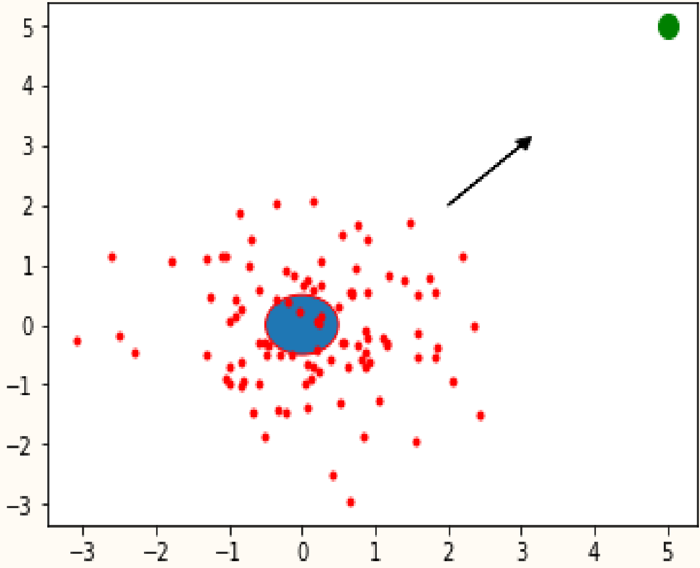
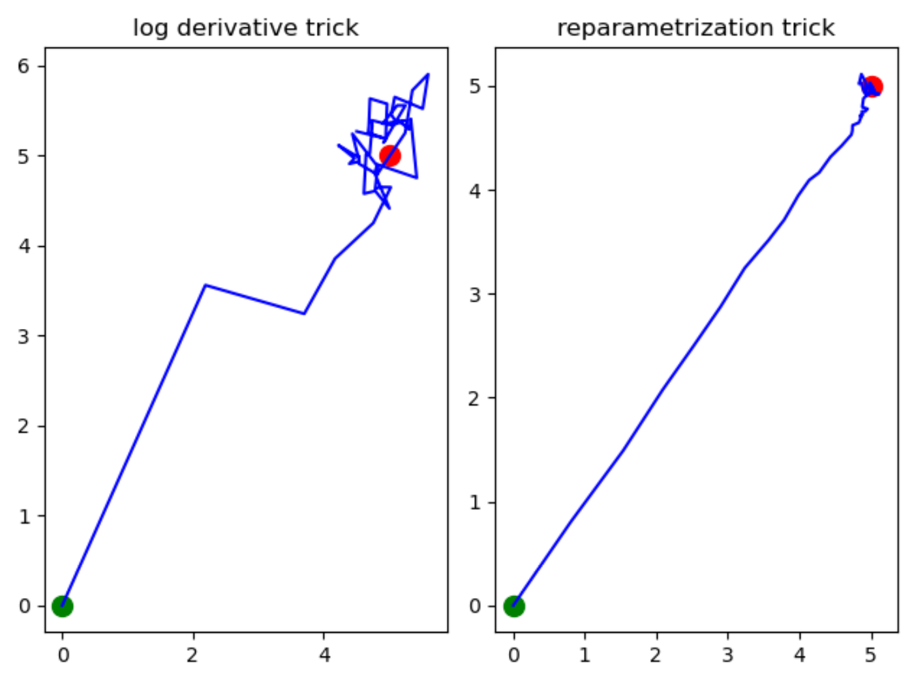

# § 13. Basics of Monte Carlo

## Monte Carlo Estimation

!!! definition "Definition 13.1 : Monte Carlo Estimation"
    Consider IID data $X_{1}, \ldots, X_{N} \sim f$.
    Let $\phi(X) \geq 0$ be some function. (The assumption $\phi(X) \geq 0$ can be relaxed.)
    Consider the problem of estimating

    $$
    I=\mathbb{E}_{X \sim f}[\phi(X)]=\int \phi(x) f(x) d x
    $$

    One commonly uses

    $$
    \hat{I}_{N}=\frac{1}{N} \sum_{i=1}^{N} \phi\left(X_{i}\right)
    $$

    to estimate $I$, which is called **monte carlo estimation**.
    After all, $\mathbb{E}\left[\hat{I}_{N}\right]=I$ and $\hat{I}_{N} \rightarrow I$ by the law of large numbers.
    (Convergence in probability by weak law of large numbers and almost sure convergence by strong law of large numbers.)

!!! concept "Concept 13.2 : Evidence of Convergence for Monte Carlo Estimation"
    We can quantify convergence with variance:

    $$
    \operatorname{Var}_{X \sim f}\left(\hat{I}_{N}\right)=\sum_{i=1}^{N} \operatorname{Var}_{X_{i} \sim f}\left(\frac{\phi\left(X_{i}\right)}{N}\right)=\frac{1}{N} \operatorname{Var}_{X \sim f}(\phi(X))
    $$

    In other words

    $$
    \mathbb{E}\left[\left(\hat{I}_{N}-I\right)^{2}\right]=\frac{1}{N} \operatorname{Var}_{X \sim f}(\phi(X))
    $$

    and

    $$
    \mathbb{E}\left[\left(\hat{I}_{N}-I\right)^{2}\right] \rightarrow 0
    $$

    as $N \rightarrow \infty$.
    So, $\hat{I}_{N} \rightarrow I$ in $L^2$ provided that $\operatorname{Var}_{X \sim f}(\phi(X)) < \infty$.

!!! definition "Definition 13.3 : Empirical Risk Minimization (ERM)"
    In machine learning and statistics, we often wish to solve

    $$
    \underset{\theta \in \Theta}{\operatorname{minimize}} \quad \mathcal{L}(\theta)
    $$

    where the objective function

    $$
    \mathcal{L}(\theta)=\mathbb{E}_{X \sim p_{X}}\left[\ell\left(f_{\theta}(X), f_{\star}(X)\right)\right]
    $$

    Is the (true) risk. However, the evaluation of $\mathbb{E}_{X \sim p_{X}}$ is impossible (if $p_{X}$ is unknown) or intractable (if $p_{X}$ is known but the expectation has no closed-form solution). Therefore, we define the proxy loss function

    $$
    \mathcal{L}_{N}(\theta)=\frac{1}{N} \sum_{i=1}^{N} \ell\left(f_{\theta}\left(X_{i}\right), f_{\star}\left(X_{i}\right)\right)
    $$

    which we call the empirical risk, and solve

    $$
    \underset{\theta \in \Theta}{\operatorname{minimize}} \quad \mathcal{L}_{N}(\theta)
    $$

    This is called **empirical risk minimization (ERM)**. The idea is that

    $$
    \mathcal{L}_{N}(\theta) \approx \mathcal{L}(\theta)
    $$

    with high probability, so minimizing $\mathcal{L}_{N}(\theta)$ should be similar to minimizing $\mathcal{L}(\theta)$.

!!! concept "Concept 13.4 : Evidence of Convergence for Empirical Risk Minimization"
    Technical note) The law of large numbers tells us that

    $$
    \mathbb{P}\left(\left|\mathcal{L}_{N}(\theta)-\mathcal{L}(\theta)\right|>\varepsilon\right)=\text { small }
    $$

    for any given $\theta$, but we need

    $$
    \mathbb{P}\left(\sup _{\theta \in \Theta}\left|\mathcal{L}_{N}(\theta)-\mathcal{L}(\theta)\right|>\varepsilon\right)=\text { small }
    $$

    for all compact $\Theta$ in order to conclude that the argmins of the two losses to be similar. These types of results are established by a uniform law of large numbers.

## Importance Sampling

!!! definition "Definition 13.5 : Importance Sampling (IS)"
    **Importance sampling (IS)** is a technique for reducing the variance of a Monte Carlo estimator.

    Key insight of important sampling:

    $$
    I=\mathbb{E}_{X \sim f}[\phi(X)]=\int \phi(x) f(x) d x=\int \frac{\phi(x) f(x)}{g(x)} g(x) d x=\mathbb{E}_{X \sim g}\left[\frac{\phi(X) f(X)}{g(X)}\right]
    $$

    (We do have to be mindful of division by 0.) Then

    $$
    \hat{I}_{N}=\frac{1}{N} \sum_{i=1}^{N} \phi\left(X_{i}\right) \frac{f\left(X_{i}\right)}{g\left(X_{i}\right)}
    $$

    with $X_{1}, \ldots, X_{N} \sim g$ is also an estimator of $I$.
    Indeed, $\mathbb{E}\left[\hat{I}_{N}\right]=I$ and $\hat{I}_{N} \rightarrow I$.
    The weight $\frac{f(x)}{g(x)}$ is called the **likelihood ratio** or the **Radon-Nikodym derivative**.

    So we can use samples from $g$ to compute expectation with respect to $f$.

!!! example "Example 13.6 : IS Example"
    Consider the setup of estimating the probability

    $$
    \mathbb{P}(X>3)=0.00135
    $$

    where $X \sim \mathcal{N}(0,1)$. If we use the regular Monte Carlo estimator

    $$
    \hat{I}_{N}=\frac{1}{N} \sum_{i=1}^{N} \mathbf{1}_{\left\{X_{i}>3\right\}}
    $$

    where $X_{i} \sim \mathcal{N}(0,1)$, if $N$ is not sufficiently large, we can have $\hat{I}_{N}=0$. Inaccurate estimate.

    If we use the IS estimator

    $$
    \hat{I}_{N}=\frac{1}{N} \sum_{i=1}^{N} \mathbf{1}_{\left\{Y_{i}>3\right\}} \exp \left(\frac{\left(Y_{i}-3\right)^{2}-Y_{i}^{2}}{2}\right)
    $$

    where $Y_{i} \sim \mathcal{N}(3,1)$, having $\hat{I}_{N}=0$ is much less likely. Estimate is much more accurate.

!!! concept "Concept 13.7 : Optimal Sampling Distribution"
    Benefit of IS quantified by with variance:

    $$
    \operatorname{Var}_{X \sim g}\left(\hat{I}_{N}\right)=\sum_{i=1}^{N} \operatorname{Var}_{X \sim g}\left(\frac{\phi\left(X_{i}\right) f\left(X_{i}\right)}{n g\left(X_{i}\right)}\right)=\frac{1}{N} \operatorname{Var}_{X \sim g}\left(\frac{\phi(X) f(X)}{g(X)}\right)
    $$

    If $\operatorname{Var}_{X \sim g}\left(\frac{\phi(X) f(X)}{g(X)}\right)<\operatorname{Var}_{X \sim f}(\phi(X))$, then IS provides variance reduction.

    We call $g$ the importance or sampling distribution. Choosing $g$ poorly can increase the variance. What is the best choice of $g$ ?

    ---

    The sampling distribution

    $$
    g(x)=\frac{\phi(x) f(x)}{I}
    $$

    makes $\operatorname{Var}_{X \sim g}\left(\frac{\phi(X) f(X)}{g(X)}\right)=\operatorname{Var}_{X \sim g}(I)=0$ and therefore is optimal. ($I$ serves as the normalizing factor that ensures the density $g$ integrates to 1.)

    Problem: Since we do not know the normalizing factor $I$, the answer we wish to estimate, sampling from $g$ is usually difficult.

!!! concept "Concept 13.8 : Optimized / Trained Sampling Distribution"
    Instead, we consider the optimization problem

    $$
    \underset{g \in \mathcal{G}}{\operatorname{minimize}} \quad D_{\mathrm{KL}}\left(g \| \frac{\phi f}{I}\right)
    $$

    and compute a suboptimal, but good, sampling distribution within a class of sampling distributions $\mathcal{G}$. (In ML, $\mathcal{G}=\left\{g_{\theta} \mid \theta \in \Theta\right\}$ is parameterized by neural networks.)

    Importantly, this optimization problem does not require knowledge of $I$.

    $$
    \begin{aligned}
    D_{\mathrm{KL}}\left(g_{\theta} \| \phi f / I\right) & =\mathbb{E}_{X \sim g_{\theta}}\left[\log \left(\frac{I g_{\theta}(X)}{\phi(X) f(X)}\right)\right] \\
    & =\mathbb{E}_{X \sim g_{\theta}}\left[\log \left(\frac{g_{\theta}(X)}{\phi(X) f(X)}\right)\right]+\log I \\
    & =\mathbb{E}_{X \sim g_{\theta}}\left[\log \left(\frac{g_{\theta}(X)}{\phi(X) f(X)}\right)\right]+\text { constant independent of } \theta
    \end{aligned}
    $$

    How do we compute stochastic gradients?

## Log-Derivative Trick

!!! definition "Definition 13.9 : Log-Derivative Trick"
    Generally, consider the setup where we wish to solve

    $$
    \underset{\theta \in \mathbb{R}^{p}}{\operatorname{minimize}} \mathbb{E}_{X \sim f_{\theta}}[\phi(X)]
    $$

    with SGD.
    (Previous situation ([Concept 13.8](./13.md#concept-13-8)) had $\theta$-dependence both on and inside the expectation. For now, let's simplify the problem so that $\phi$ does not depend on $\theta$.)

    Incorrect gradient computation:

    $$
    \nabla_{\theta} \mathbb{E}_{X \sim f_{\theta}}[\phi(X)] \stackrel{?}{=} \mathbb{E}_{X \sim f_{\theta}}\left[\nabla_{\theta} \phi(X)\right]=\mathbb{E}_{X \sim f_{\theta}}[0]=0
    $$

    Correct gradient computation:

    $$
    \begin{aligned}
    \nabla_{\theta} \mathbb{E}_{X \sim f_{\theta}}[\phi(X)] & =\nabla_{\theta} \int \phi(x) f_{\theta}(x) d x=\int \phi(x) \nabla_{\theta} f_{\theta}(x) d x \\
    & =\int \phi(x) \frac{\nabla_{\theta} f_{\theta}(x)}{f_{\theta}(x)} f_{\theta}(x) d x=\mathbb{E}_{X \sim f_{\theta}}\left[\phi(X) \frac{\nabla_{\theta} f_{\theta}(X)}{f_{\theta}(X)}\right] \\
    & =\mathbb{E}_{X \sim f_{\theta}}\left[\phi(X) \nabla_{\theta} \log \left(f_{\theta}(X)\right)\right]
    \end{aligned}
    $$

    Therefore, $\phi(X) \nabla_{\theta} \log \left(f_{\theta}(X)\right)$ with $X \sim f_{\theta}$ is a stochastic gradient of the loss function. This technique is called the log-derivative trick, the likelihood ratio gradient$^{\#}$, or REINFORCE$^{\star}$.

    Formula with the log-derivative $\left(\nabla_{\theta} \log (\cdot)\right)$ is convenient when dealing with Gaussians, or more generally exponential families, since the densities are of the form

    $$
    f_{\theta}(x)=h(x) \exp (\text {function of } \theta)
    $$

    (${}^{\#}$P. W. Glynn, Likelihood ratio gradient estimation for stochastic systems, Communications of the ACM, 1990.  
    ${}^{\star}$R. J. Williams, Simple statistical gradient-following algorithms for connectionist reinforcement learning. Machine Learning, 1992.)

!!! example "Example 13.10 : Log-Derivative Trick Example"
    Learn $\mu \in \mathbb{R}^{2}$ to minimize the objective below.

    $$
    \underset{\mu \in \mathbb{R}^{2}}{\operatorname{minimize}} \mathbb{E}_{X \sim \mathcal{N}(\mu, I)}\left\|X-\binom{5}{5}\right\|^{2}
    $$

    Then the loss function is

    $$
    \mathcal{L}(\mu)=\mathbb{E}_{X \sim \mathcal{N}(\mu, I)}\left\|X-\binom{5}{5}\right\|^{2}=\int\left\|x-\binom{5}{5}\right\|^{2} \frac{1}{2 \pi} \exp \left(-\frac{1}{2}\|x-\mu\|^{2}\right) d x
    $$

    And, using $X_{1}, \ldots, X_{B} \sim \mathcal{N}(\mu, I)$, we have stochastic gradients

    $$
    \nabla_{\mu} \mathcal{L}(\mu)=\mathbb{E}_{X \sim \mathcal{N}(\mu, I)}\left[\left\|x-\binom{5}{5}\right\|^{2} \nabla_{\mu}\left(-\frac{1}{2}\|x-\mu\|^{2}\right)\right] \approx \frac{1}{B} \sum_{i=1}^{B}\left\|X_{i}-\binom{5}{5}\right\|^{2}\left(X_{i}-\mu\right)
    $$

    These stochastic gradients have large variance and thus SGD is slow.

    

    {: width="50%"}
    

## Reparameterization Trick

!!! definition "Definition 13.11 : Reparameterization Trick"
    The reparameterization trick (RT) or the pathwise derivative (PD) relies on the key insight.

    $$
    \mathbb{E}_{X \sim \mathcal{N}\left(\mu, \sigma^{2}\right)}[\phi(X)]=\mathbb{E}_{Y \sim \mathcal{N}(0,1)}[\phi(\mu+\sigma Y)]
    $$

    Gradient computation:

    $$
    \begin{aligned}
    \nabla_{\mu, \sigma} \mathbb{E}_{X \sim \mathcal{N}\left(\mu, \sigma^{2}\right)}[\phi(X)] & =\mathbb{E}_{Y \sim \mathcal{N}(0,1)}\left[\nabla_{\mu, \sigma} \phi(\mu+\sigma Y)\right]=\mathbb{E}_{Y \sim \mathcal{N}(0,1)}\left[\phi^{\prime}(\mu+\sigma Y)\left[\begin{array}{c}
    1 \\
    Y
    \end{array}\right]\right] \\
    & \approx \frac{1}{B} \sum_{i=1}^{B} \phi^{\prime}\left(\mu+\sigma Y_{i}\right)\left[\begin{array}{c}
    1 \\
    Y_{i}
    \end{array}\right], \quad Y_{1}, \ldots, Y_{B} \sim \mathcal{N}(0, I)
    \end{aligned}
    $$

    RT is less general than log-derivative trick, but it usually produces stochastic gradients with lower variance.

!!! example "Example 13.12 : Reparameterization Trick Example"
    Consider the same example as before

    $$
    \mathcal{L}(\mu)=\mathbb{E}_{X \sim \mathcal{N}(\mu, I)}\left\|X-\binom{5}{5}\right\|^{2}=\mathbb{E}_{Y \sim \mathcal{N}(0, I)}\left\|Y+\mu-\binom{5}{5}\right\|^{2}
    $$

    Gradient computation:

    $$
    \begin{aligned}
    \nabla_{\mu} \mathcal{L}(\mu) & =\mathbb{E}_{Y \sim \mathcal{N}(0, I)} \nabla_{\mu}\left\|Y+\mu-\binom{5}{5}\right\|^{2}=2 \mathbb{E}_{Y \sim \mathcal{N}(0, I)}\left(Y+\mu-\binom{5}{5}\right) \\
    & \approx \frac{2}{B} \sum_{i=1}^{B}\left(Y_{i}+\mu-\binom{5}{5}\right), \quad Y_{1}, \ldots, Y_{B} \sim \mathcal{N}(0, I)
    \end{aligned}
    $$

    These stochastic gradients have smaller variance and thus SGD is faster.

!!! example "Example 13.13 : Log Derivative Trick vs Reparameterization Trick"
    The image below is the result of SGD with the computed gradients by [Example 13.10](./13.md#example-13-10) and [Example 13.12](./13.md#example-13-12).

    

    {: width="100%"}
    

