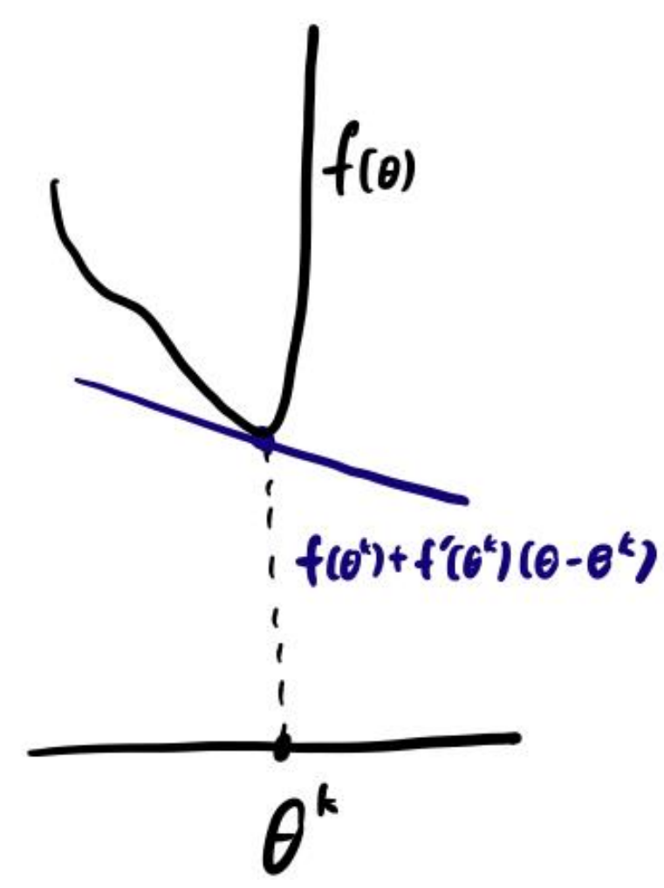
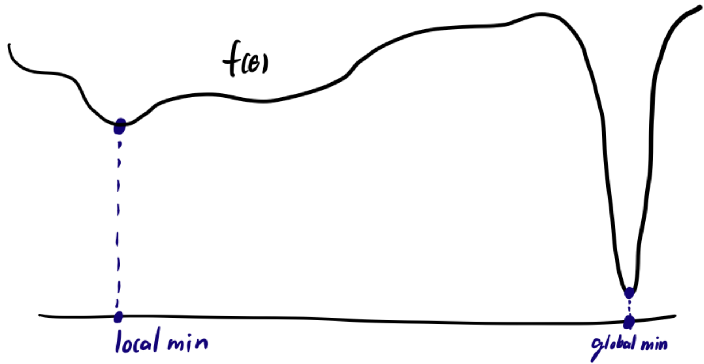

# § 2. Gradient Descent

## Gradient Descent

!!! definition "Definition 2.1 : Gradient Descent"
    Consider the unconstrained optimization problem

    $$
    \underset{\theta \in \mathbb{R}^{P}}{\operatorname{minimize}} f(\theta)
    $$

    where $f$ is differentiable.

    **Gradient Descent (GD)** algorithm:

    $$
    \theta^{k+1}=\theta^{k}-\alpha_{k} \nabla f\left(\theta^{k}\right) \quad \text { for } k=0,1, \ldots,
    $$

    where $\theta^{0} \in \mathbb{R}^{p}$ is the **initial point** and $\alpha_{k}>0$ is the **learning rate** or the **stepsize**.

    The terminology learning rate is common in the machine learning literature while stepsize is more common in the optimization literature.

In math, a function is "differentiable" if its derivative exists everywhere.

In deep learning (DL), a function is often said to be differentiable if its derivative exists almost everywhere and the function is nice.
ReLU activation functions are said to be differentiable.

!!! concept "Concept 2.2 : Efficiency of gradient descent can be expected using the first-order Taylor expansion of $f$."
    $$
    \theta^{k+1}=\theta^{k}-\alpha_{k} \nabla f\left(\theta^{k}\right)
    $$

    Taylor expansion of $f$ about $\theta^{k}$ :

    $$
    f(\theta)=f\left(\theta^{k}\right)+\nabla f\left(\theta^{k}\right)^{\top}\left(\theta-\theta^{k}\right)+\mathcal{O}\left(\left\|\theta-\theta^{k}\right\|^{2}\right)
    $$

    Plug in $\theta^{k+1}$ :

    $$
    f\left(\theta^{k+1}\right)=f\left(\theta^{k}\right)-\alpha_{k}\left\|\nabla f\left(\theta^{k}\right)\right\|^{2}+\mathcal{O}\left(\alpha_{k}^{2}\right)
    $$

    $-\nabla f\left(\theta^{k}\right)$ is steepest descent direction. For small (cautious) $\alpha_{k}$, GD step reduces function value.

However, note that a step of GD need not result in descent, i.e., $f\left(\theta^{k+1}\right)>f\left(\theta^{k}\right)$ is possible.

{: width="40%"}

We need an assumption that ensures the first-order Taylor expansion is a good approximation within a sufficiently large neighborhood.

## Convergence of Gradient Descent

Without further assumptions, there is no hope of finding the global minimum.

We cannot prove the function value converges to global optimum. We instead prove $\nabla f\left(\theta^{k}\right) \rightarrow 0$. Roughly speaking, this is similar, but weaker than proving that $\theta^{k}$ converges to a local minimum.

{: width="70%"}

Without further assumptions, we cannot show that $\theta^{k}$ converges to a limit, and even $\theta^{k}$ does converge to a limit, we cannot guarantee that that limit is not a saddle point or even a local maximum. Nevertheless, people commonly use the argument that $\theta^{k}$ usually converges and that it is unlikely that the limit is a local maximum or a saddle point.

!!! definition "Definition 2.3 : $L$-Lipschitz"
    We say $\nabla f: \mathbb{R}^{p} \rightarrow \mathbb{R}^{p}$ is $L$-Lipschitz if

    $$
    \|\nabla f(x)-\nabla f(y)\| \leq L\|x-y\| \quad \forall x, y \in \mathbb{R}^{p} .
    $$

    Roughly, this means $\nabla f$ does not change rapidly. As a consequence, we can trust the first-order Taylor expansion on a non-infinitesimal neighborhood.

!!! theorem "Theorem 2.4 : Lipschitz Gradient Lemma"
    Let $f: \mathbb{R}^{p} \rightarrow \mathbb{R}$ be differentiable and $\nabla f: \mathbb{R}^{p} \rightarrow \mathbb{R}^{p}$ be L-Lipschitz. Then
    
    $$
    f(\theta+\delta) \leq f(\theta)+\nabla f(\theta)^{\top} \delta+\frac{L}{2}\|\delta\|^{2} \quad \forall \theta, \delta \in \mathbb{R}^{p}
    $$

    ---

    $f(\theta)+\nabla f(\theta)^{\top} \delta-\frac{L}{2}\|\delta\|^{2} \leq f(\theta+\delta)$ is also true, but we do not need this other direction. Together the inequalities imply
    
    $$
    \left|f(\theta+\delta)-\left(f(\theta)+\nabla f(\theta)^{\top} \delta\right)\right| \leq \frac{L}{2}\|\delta\|^{2} \quad \forall \theta, \delta \in \mathbb{R}^{p}
    $$

    !!! proof
        Define $g: \mathbb{R} \rightarrow \mathbb{R}$ as $g(t)=f(\theta+t \delta)$. Then $g$ is differentiable and
        
        $$
        g^{\prime}(t)=\nabla f(\theta+t \delta)^{\top} \delta
        $$

        Note $g^{\prime}$ is $\left(L\|\delta\|^{2}\right)$-Lipschitz continuous since
        
        $$
        \begin{gathered}
        \left|g^{\prime}\left(t_{1}\right)-g^{\prime}\left(t_{0}\right)\right|=\left|\left(\nabla f\left(\theta+t_{1} \delta\right)-\nabla f\left(\theta+t_{0} \delta\right)\right)^{\top} \delta\right| \\
        \leq\left\|\nabla f\left(\theta+t_{1} \delta\right)-\nabla f\left(\theta+t_{0} \delta\right)\right\|\| \| \delta \| \\
        \leq L\left\|t_{1} \delta-t_{0} \delta\right\|\|\delta\| \\
        =L\|\delta\|^{2}\left|t_{1}-t_{0}\right|
        \end{gathered}
        $$

        Finally, we conclude with
        
        $$
        \begin{gathered}
        f(\theta+\delta)=g(1)=g(0)+\int_{0}^{1} g^{\prime}(t) \mathrm{d} t \\
        \leq f(\theta)+\int_{0}^{1}\left(g^{\prime}(0)+L\|\delta\|^{2} t\right) \mathrm{d} t \\
        =f(\theta)+\nabla f(\theta)^{\top} \delta+\frac{L}{2}\|\delta\|^{2}
        \end{gathered}
        $$

!!! theorem "Theorem 2.5 : Summability Lemma"
    Let $V^{0}, V^{1}, \ldots \in \mathbb{R}$ and $S^{0}, S^{1}, \ldots \in \mathbb{R}$ be nonnegative sequences satisfying
    
    $$
    V^{k+1} \leq V^{k}-S^{k}
    $$

    for $k=0,1,2, \ldots$ Then $S^{k} \rightarrow 0$.

    !!! proof
        Key idea. $S^{k}$ measures progress (decrease) made in iteration $k$. Since $V^{k} \geq 0, V^{k}$ cannot decrease forever, so the progress (magnitude of $S^{k}$ ) must diminish to 0.
        
        Sum the inequality from $i=0$ to $k$

        $$
        V^{k+1}+\sum_{i=0}^{k} S^{i} \leq V^{0}
        $$

        Let $k \rightarrow \infty$

        $$
        \sum_{i=0}^{\infty} S^{i} \leq V^{0}-\lim _{k \rightarrow \infty} V^{k} \leq V^{0}
        $$

        Since $\sum_{i=0}^{\infty} S^{i}<\infty, S^{i} \rightarrow 0$.

!!! theorem "Theorem 2.6 : Convergence of GD"
    Assume $f: \mathbb{R}^{p} \rightarrow \mathbb{R}$ is differentiable, $\nabla f$ is $L$-Lipschitz continuous, and $\inf _{\theta \in \mathbb{R}^{p}} f(\theta)>-\infty$. Then
    
    $$
    \theta^{k+1}=\theta^{k}-\alpha \nabla f\left(\theta^{k}\right)
    $$

    with $\alpha \in\left(0, \frac{2}{L}\right)$ satisfies $\nabla f\left(\theta^{k}\right) \rightarrow 0$.

    !!! proof        
        Use Lipschitz gradient lemma with $\theta=\theta^{k}$ and $\delta=-\alpha \nabla f\left(\theta^{k}\right)$ to get
        
        $$
        f\left(\theta^{k+1}\right) \leq f\left(\theta^{k}\right)-\alpha\left(1-\frac{\alpha L}{2}\right)\left\|\nabla f\left(\theta^{k}\right)\right\|^{2}
        $$
        
        and
        
        $$
        \left(f\left(\theta^{k+1}\right)-\inf _{\theta} f(\theta)\right) \leq\left(f\left(\theta^{k}\right)-\inf _{\theta} f(\theta)\right)-\alpha\left(1-\frac{\alpha L}{2}\right)\left\|\nabla f\left(\theta^{k}\right)\right\|^{2} \\
        $$

        $$
        \left(f\left(\theta^{k+1}\right)-\inf _{\theta} f(\theta)\right) \ge 0, 
        \left(f\left(\theta^{k}\right)-\inf _{\theta} f(\theta)\right) \ge 0, 
        \alpha\left(1-\frac{\alpha L}{2}\right)\left\|\nabla f\left(\theta^{k}\right)\right\|^{2} > 0 \text{ for } \alpha \in\left(0, \frac{2}{L}\right)
        $$

        By the summability lemma, $\left\|\nabla f\left(\theta^{k}\right)\right\|^{2} \rightarrow 0$ and thus $\nabla f\left(\theta^{k}\right) \rightarrow 0$.

In deep learning, the condition that $\nabla f$ is $L$-Lipschitz is usually not true (due to the use of ReLU activation functions).

Rather, the purpose of these mathematical analyses is to obtain qualitative insights; this convergence proof are meant to provide you with intuition on the training dynamics of GD and SGD.

Because analyzing deep learning systems as is rigorously is usually difficult, people usually analyze modified (simplified) setups rigorously or analyze the full setup heuristically.

In both cases, the goal is to obtain qualitative insights, rather than theoretical guarantees.

## Stochastic Gradient Descent

!!! definition "Definition 2.7 : Finite-Sum Optimization Problem"
    A **finite-sum optimization problem** has the structure

    $$
    \underset{\theta \in \mathbb{R}^{p}}{\operatorname{minimize}} \frac{1}{N} \sum_{i=1}^{N} f_{i}(\theta):=F(\theta)
    $$

    Finite-sum is ubiquitous in ML. $N$ usually corresponds to the number of data points.

In finite-sum problem, using GD

$$
\theta^{k+1}=\theta^{k}-\frac{\alpha_{k}}{N} \sum_{i=1}^{N} \nabla f_{i}\left(\theta^{k}\right)
$$

is impractical when $N$ is large since $\frac{1}{N} \sum_{i=1}^{N} \nabla f_{i}\left(\theta^{k}\right)$ takes too long to compute.

!!! concept "Concept 2.8 : Finite-sum problem can be reformulated with expectation."
    Although the finite-sum optimization problem has no inherent randomness, we can reformulate this problem with randomness:
    
    $$
    \operatorname{minimize}_{\theta \in \mathbb{R}^{p}} \quad \mathbb{E}_{I}\left[f_{I}(\theta)\right]
    $$
    
    where $I \sim$ Uniform $\{1, \ldots, N\}$. To see the equivalence,
    
    $$
    \mathbb{E}_{I}\left[f_{I}(\theta)\right]=\sum_{i=1}^{N} f_{i}(\theta) \mathbb{P}(I=i)=\frac{1}{N} \sum_{i=1}^{N} f_{i}(\theta)=F(\theta)
    $$

!!! definition "Definition 2.9 : Stochastic Gradient Descent"
    **Stochastic gradient descent (SGD)**

    $$
    \begin{gathered}
    i(k) \sim \operatorname{Uniform}\{1, \ldots, N\} \\
    \theta^{k+1}=\theta^{k}-\alpha_{k} \nabla f_{i(k)}\left(\theta^{k}\right)
    \end{gathered}
    $$

    for $k=0,1, \ldots$, where $\theta^{0} \in \mathbb{R}^{p}$ is the **initial point** and $\alpha_{k}>0$ is the **learning rate**.

    $\nabla f_{i(k)}\left(\theta^{k}\right)$ is a stochastic gradient of $F$ at $\theta^{k}$, i.e.,
    
    $$
    \mathbb{E}\left[\nabla f_{i(k)}\left(\theta^{k}\right)\right]=\nabla \mathbb{E}\left[f_{i(k)}\left(\theta^{k}\right)\right]=\nabla F\left(\theta^{k}\right)
    $$

!!! concept "Concept 2.10 : SGD is more efficient than GD."
    GD uses all indices $i=1, \ldots, N$ every iteration

    $$
    \theta^{k+1}=\theta^{k}-\frac{\alpha_{k}}{N} \sum_{i=1}^{N} \nabla f_{i}\left(\theta^{k}\right)
    $$

    SGD uses only a single random index $i(k)$ every iteration

    $$
    \begin{gathered}
    i(k) \sim \text { Uniform }\{1, \ldots, N\} \\
    \theta^{k+1}=\theta^{k}-\alpha_{k} \nabla f_{i(k)}\left(\theta^{k}\right)
    \end{gathered}
    $$

    When size of the data $N$ is large, SGD is often more effective than GD.

!!! concept "Concept 2.11 : Efficiency of stochastic gradient descent can be expected using the first-order Taylor expansion of $F$."
    Plug $\theta^{k+1}$ into Taylor expansion of $F$ about $\theta^{k}$ :
    
    $$
    F\left(\theta^{k+1}\right)=F\left(\theta^{k}\right)-\alpha_{k} \nabla F\left(\theta^{k}\right)^{\top} \nabla f_{i(k)}\left(\theta^{k}\right)+\mathcal{O}\left(\alpha_{k}^{2}\right)
    $$

    Take expectation on both sides:
    
    $$
    \mathbb{E}_{k}\left[F\left(\theta^{k+1}\right)\right]=F\left(\theta^{k}\right)-\alpha_{k}\left\|\nabla F\left(\theta^{k}\right)\right\|^{2}+\mathcal{O}\left(\alpha_{k}^{2}\right)
    $$
    
    ( $\mathbb{E}_{k}$ is expectation conditioned on $\theta^{k}$ )

    $-\nabla f_{i(k)}\left(\theta^{k}\right)$ is descent direction in expectation. For small (cautious) $\alpha_{k}$, SGD step reduces function value in expectation.

## Variants of Stochastic Gradient Descent

Consider

$$
\underset{\theta \in \mathbb{R}^{p}}{\operatorname{minimize}} \frac{1}{N} \sum_{i=1}^{N} f_{i}(\theta)
$$

SGD can be generalized to

$$
\theta^{k+1}=\theta^{k}-\alpha_{k} g^{k}
$$

where $g^{k}$ is a stochastic gradient. The choice $g^{k}=\nabla f_{i(k)}\left(\theta^{k}\right)$ is just one option.

!!! theorem "Theorem 2.12 : Sampling with Replacement Lemma"
    Let $X_{1}, \ldots, X_{N} \in \mathbb{R}^{p}$ be given (non-random) vectors. Let $\frac{1}{N} \sum_{i=1}^{N} X_{i}=\mu$. Let $i(1), \ldots, i(B) \subseteq\{1, \ldots, N\}$ be random indices. Then
    
    $$
    \mathbb{E} \frac{1}{B} \sum_{b=1}^{B} X_{i(b)}=\mu
    $$

    !!! proof
        $$
        \mathbb{E} \frac{1}{B} \sum_{b=1}^{B} X_{i(b)}=\frac{1}{B} \sum_{b=1}^{B} \mathbb{E} X_{i(b)}=\frac{1}{B} \sum_{b=1}^{B} \mu=\mu
        $$

!!! definition "Definition 2.13 : Minibatch SGD with Replacement"
    **Minibatch SGD with replacement**

    $$
    \begin{gathered}
    i(k, 1), \ldots, i(k, B) \sim \text { Uniform }\{1, \ldots, N\} \\
    \theta^{k+1}=\theta^{k}-\frac{\alpha_{k}}{B} \sum_{b=1}^{B} \nabla f_{i(k, b)}\left(\theta^{k}\right)
    \end{gathered}
    $$

    To clarify, we sample $B$ out of $N$ indices with replacement, i.e., the same index can be sampled multiple times.

    By **Theorem 2.12**, $\frac{1}{B} \sum_{b=1}^{B} \nabla f_{i(k, b)}\left(\theta^{k}\right)$ is a stochastic gradient of $F$ at $\theta^{k}$.

!!! theorem "Theorem 2.14  : Sampling without Replacement Lemma"
    Let $X_{1}, \ldots, X_{N} \in \mathbb{R}^{p}$ be given (non-random) vectors. Let $\frac{1}{N} \sum_{i=1}^{N} X_{i}=\mu$. Let $\sigma$ be a random permutation. Then
    
    $$
    \mathbb{E} \frac{1}{B} \sum_{b=1}^{B} X_{\sigma(b)}=\mu
    $$

    !!! proof
        $$
        \mathbb{E} \frac{1}{B} \sum_{b=1}^{B} X_{\sigma(b)}=\frac{1}{B} \sum_{b=1}^{B} \mathbb{E} X_{\sigma(b)}=\frac{1}{B} \sum_{b=1}^{B} \mu=\mu
        $$

!!! definition "Definition 2.15 : Minibatch SGD without Replacement"
    **Minibatch SGD without replacement**

    $$
    \begin{gathered}
    \sigma^{k} \sim \operatorname{permutation}(N) \\
    \theta^{k+1}=\theta^{k}-\frac{\alpha_{k}}{B} \sum_{b=1}^{B} \nabla f_{\sigma^{k}(b)}\left(\theta^{k}\right)
    \end{gathered}
    $$

    We assume $B \leq N$. To clarify, we sample $B$ out of $N$ indices without replacement, i.e., the same index cannot be sampled multiple times.

    By **Theorem 2.14**, $\frac{1}{B} \sum_{b=1}^{B} \nabla f_{\sigma^{k}(b)}\left(\theta^{k}\right)$ is a stochastic gradient of $F$ at $\theta^{k}$.

!!! concept "Concept 2.16 : How to choose batch size $B$?"
    Note $B=1$ minibatch SGD becomes SGD.

    Mathematically (measuring performance per iteration)

    - Use large batch is when noise/randomness is large.
    - Use small batch is when noise/randomness is small.

    Practically (measuring performance per unit time)

    - Large batch allows more efficient computation on GPUs.
    - Often best to increase batch size up to the GPU memory limit.

In DL, SGD is applied to nice continuous but non-differentiable functions that are differentiable almost everywhere.

In this case, if we choose $\theta^{0} \in \mathbb{R}^{n}$ randomly and run

$$
\theta^{k+1}=\theta^{k}-\alpha_{k} \nabla f\left(\theta^{k}\right)
$$

the algorithm is usually well-defined, i.e., $\theta^{k}$ never hits a point of non-differentiability.

With a proof or not, GD and SGD are applied to non-differentiable minimization in ML. The absence of differentiability does not seem to cause serious problems.

!!! definition "Definition 2.17 : Cyclic SGD"
    Consider the sequence of indices

    $$
    \{\bmod (k, N)+1\}_{k=0,1, \ldots}=1,2, \ldots, N, 1,2, \ldots, N, \ldots
    $$

    Here, $\bmod (k, N)$ is the remainder of $k$ when divided by $N$.

    **Cyclic SGD**:

    $$
    \theta^{k+1}=\theta^{k}-\alpha_{\mathbf{k}} \nabla f_{\bmod (k, N)+1}\left(\theta^{k}\right)
    $$

    To clarify, this samples the indices in a (deterministic) cyclic order.

!!! concept "Concept 2.18 : Pros and Cons of Cyclic SGD"
    Strictly speaking, cyclic SGD is not an instance of SGD as unbiased estimation property lost.

    Advantage:

    - Uses all indices (data) every $N$ iterations.

    Disadvantage:

    - Worse than SGD in some cases, theoretically and empirically.
    - In DL, neural networks can learn to anticipate cyclic order.

!!! definition "Definition 2.19 : Shuffled Cyclic SGD"
    **Shuffled Cyclic SGD**:

    $$
    \theta^{k+1}=\theta^{k}-\alpha_{k} \nabla f_{\sigma^{\left \lfloor \frac{k}{N} \right \rfloor} (\bmod (k, N)+1)}\left(\theta^{k}\right)
    $$

    where $\sigma^{0}, \sigma^{1}, \ldots$ is a sequence of random permutations, i.e., we shuffle the order every cycle.

!!! concept "Concept 2.19 : Pros and Cons of Shuffled Cyclic SGD"
    Again, strictly speaking, shuffled cyclic SGD is not an instance of SGD as unbiased estimation property lost.

    Advantages :
    
    - Uses all indices (data) every $N$ iterations.
    - Neural network cannot learn to anticipate data order.
    - Empirically best performance.

    Disadvantages:
    - Theory not as strong as regular SGD.

!!! concept "Concept 2.20 : Which variant of SGD to use?"
    Theoretical comparison of SGD variants:

    - Not that easy.
    - Result does not strongly correlate with practical performance in DL.

    In DL, the most common choice is

    - shuffled cyclic minibatch SGD (without replacement) and
    - batchsize $B$ is as large as possible within the GPU memory limit.

    One can generally consider this to be the default option.

!!! definition "Definition 2.21 : Epoch in finite-sum optimization and machine learning training"
    An **epoch** is loosely defined as the unit of optimization or training progress of processing all indices or data once.

    - 1 iteration of GD constitutes an epoch.
    - $N$ iterations of SGD, cyclic SGD, or shuffled cyclic SGD constitute an epoch.
    - $N / B$ iterations of minibatch SGD constitute an epoch.

    Epoch is often a convenient unit for counting iterations compared to directly counting the iteration number.

!!! concept "Concept 2.22 : SGD with General Expectation"
    Consider an optimization problem with its objective defined with a general expectation
    
    $$
    \operatorname{minimize}_{\theta \in \mathbb{R}^{p}} \quad \mathbb{E}_{\omega}\left[f_{\omega}(\theta)\right]:=F(\theta)
    $$

    Here, $\omega$ is a random variable. We will encounter these expectations (non-finite sum) when we talk about generative models.

    For this setup, the SGD algorithm is
    
    $$
    \theta^{k+1}=\theta^{k}-\alpha_{k} \nabla f_{\omega^{k}}\left(\theta^{k}\right)
    $$
    
    where $\omega^{0}, \omega^{1}, \ldots$ are IID random samples of $\omega$. If $\nabla_{\theta} \mathbb{E}_{\omega}\left[f_{\omega}(\theta)\right]=\mathbb{E}_{\omega}\left[\nabla_{\theta} f_{\omega}(\theta)\right]$, then $\nabla f_{\omega^{k}}\left(\theta^{k}\right)$ is a stochastic gradient of $F(\theta)$ at $\theta^{k}$. (Make sure you understand why the previous SGD for the finite-sum setup is a special case of this.)

    GD for this setup is
    
    $$
    \theta^{k+1}=\theta^{k}-\alpha_{k} \mathbb{E}_{\omega}\left[\nabla_{\theta} f_{\omega}\left(\theta^{k}\right)\right]
    $$

    However, if the expectation is difficult to compute GD is impractical and SGD is preferred.