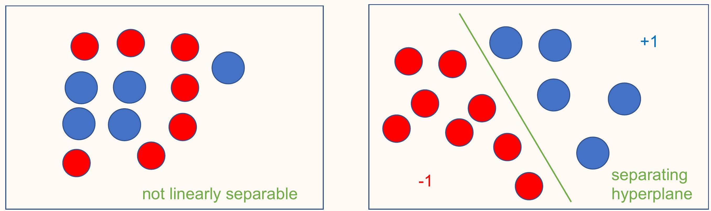

# § 3. Shallow Neural Networks

## Supervised Learning Problem

!!! definition "Definition 3.1 : Supervised Learning Setup"
    We have data $X_{1}, \ldots, X_{N} \in \mathcal{X}$ and corresponding labels $Y_{1}, \ldots, Y_{N} \in \mathcal{Y}$.

    - Example) $X_{i}$ is the $i$ th email and $Y_{i} \in\{-1,+1\}$ denotes whether $X_{i}$ is a spam email.
    - Example) $X_{i}$ is the $i$ th image and $Y_{i} \in\{0, \ldots, 9\}$ denotes handwritten digit.

    Assume there is a true unknown function

    $$
    f_{\star}: x \rightarrow y
    $$
    
    mapping data to its label. In particular, $Y_{i}=f_{\star}\left(X_{i}\right)$ for $i=1, \ldots, N$.

    The goal of supervised learning is to use $X_{1}, \ldots, X_{N}$ and $Y_{1}, \ldots, Y_{N}$ to find $f \approx f_{\star}$.

!!! definition "Definition 3.2 : Supervised Learning Objective"
    Assume a loss function such that $\ell\left(y_{1}, y_{2}\right)=0$ if $y_{1}=y_{2}$ and $\ell\left(y_{1}, y_{2}\right)>0$ if $y_{1} \neq y_{2}$.

    Restrict search to a class of parametrized functions $f_{\theta}(x)$ where $\theta \in \Theta \subseteq \mathbb{R}^{p}$, i.e., only consider $f \in\left\{f_{\theta} \mid \theta \in \Theta\right\}$ where $\Theta \subseteq \mathbb{R}^{p}$.

    Take a finite sample $X_{1}, \ldots, X_{N} \in \mathcal{X}$ and corresponding labels $Y_{1}, \ldots, Y_{N} \in \mathcal{Y}$. Then solve
    
    $$
    \underset{\theta \in \Theta}{\operatorname{minimize}} \frac{1}{N} \sum_{i=1}^{N} \ell\left(f_{\theta}\left(X_{i}\right), f_{\star}\left(X_{i}\right)\right)
    $$

    which is equivalent to
    
    $$
    \underset{\theta \in \Theta}{\operatorname{minimize}} \frac{1}{N} \sum_{i=1}^{N} \ell\left(f_{\theta}\left(X_{i}\right), Y_{i}\right)
    $$

    This is the standard form of the optimization problem (except regularizers) we consider in the supervised learning. We will talk about regularizers later.

!!! concept "Concept 3.3 : Training is optimization."
    In machine learning, the anthropomorphized word "**training**" refers to solving an optimization problem such as
    
    $$
    \underset{\theta \in \Theta}{\operatorname{minimize}} \frac{1}{N} \sum_{i=1}^{N} \ell\left(f_{\theta}\left(X_{i}\right), Y_{i}\right)
    $$

    In most cases, SGD or variants of SGD are used.

    We call $f_{\theta}$ the **machine learning model** or the **neural network**.

!!! example "Example 3.4 : Least-Squares Regression"
    In LS, $\mathcal{X}=\mathbb{R}^{p}, \mathcal{Y}=\mathbb{R}, \Theta=\mathbb{R}^{p}, f_{\theta}(x)=x^{\top} \theta$, and $\ell\left(y_{1}, y_{2}\right)=\frac{1}{2}\left(y_{1}-y_{2}\right)^{2}$.
    
    So we solve
    
    $$
    \underset{\theta \in \mathbb{R}^{p}}{\operatorname{minimize}} \frac{1}{N} \sum_{i=1}^{N} \frac{1}{2}\left(f_{\theta}\left(X_{i}\right)-Y_{i}\right)^{2}=\frac{1}{N} \sum_{i=1}^{N} \frac{1}{2}\left(X_{i}^{\top} \theta-Y_{i}\right)^{2}=\frac{1}{2 N}\|X \theta-Y\|^{2}
    $$
    
    where $X=\left[\begin{array}{c}X_{1}^{\top} \\ \vdots \\ X_{N}^{\top}\end{array}\right]$ and $Y=\left[\begin{array}{c}Y_{1} \\ \vdots \\ Y_{N}\end{array}\right]$.

    The model $f_{\theta}(x)=x^{\top} \theta$ is a shallow neural network. (The terminology will makes sense when contrasted with deep neural networks.)

## Linear Classification

!!! definition "Definition 3.5 : Binary Classification and Linear Separability"
    In **binary classification**, we have $\mathcal{X}=\mathbb{R}^{p}$ and $\mathcal{Y}=\{-1,+1\}$.

    The data is **linearly separable** if there is a hyperplane defined by $(a_{\text {true }}, b_{\text {true }} )$ such that
    
    $$
    y=\left\{\begin{array}{cl}
    1 & \text { if } a_{\text {true }}^{\top} x+b_{\text {true }}>0 \\
    -1 & \text { otherwise. }
    \end{array}\right.
    $$

    

    {: width="100%"}
    

### Support Vector Machine   

Consider linear (affine) models

$$
f_{a, b}(x)= \begin{cases}+1 & \text { if } a^{\top} x+b>0 \\ -1 & \text { otherwise }\end{cases}
$$

Consider the loss function

$$
\ell\left(y_{1}, y_{2}\right)=\frac{1}{2}\left|1-y_{1} y_{2}\right|= \begin{cases}0 & \text { if } y_{1}=y_{2} \\ 1 & \text { if } y_{1} \neq y_{2}\end{cases}
$$

The optimization problem

$$
\underset{a \in \mathbb{R}^{p}, b \in \mathbb{R}}{\operatorname{minimize}} \frac{1}{N} \sum_{i=1}^{N} \ell\left(f_{a, b}\left(X_{i}\right), Y_{i}\right)
$$

has a solution with optimal value 0 when the data is linearly separable.

Problem: Optimization problem is discontinuous and thus cannot be solved with SGD.

---

**Motivation for SVM**

Even if the underlying function or phenomenon to approximate is discontinuous, the model needs to be continuous in its parameters. The loss function also needs to be continuous. (The prediction need not be continuous.)

We consider a relaxation, is a continuous proxy of the discontinuous thing. Specifically, consider

$$
f_{a, b}(x)=a^{\top} x+b
$$

Once trained, $f_{a, b}(x)>0$ means the neural network is predicting $y=+1$ to be "more likely", and $f_{a, b}(x)<0$ means the neural network is predicting $y=-1$ to be "more likely".

Therefore, we train the model to satisfy

$$
Y_{i} f_{a, b}\left(X_{i}\right)>0 \text { for } i=1, \ldots, N .
$$

Problem with strict inequality $Y_{i} f_{a, b}\left(X_{i}\right)>0$ :

- Strict inequality has numerical problems with round-off error.
- The magnitude $\left|f_{a, b}(x)\right|$ can be viewed as the confidence of the prediction, but having a small positive value for $Y_{i} f_{a, b}\left(X_{i}\right)$ indicates small confidence of the neural network.

We modify our model's desired goal to be $Y_{i} f_{a, b}\left(X_{i}\right) \geq 1$.

To train the neural network to satisfy

$$
0 \geq 1-Y_{i} f_{a, b}\left(X_{i}\right) \text { for } i=1, \ldots, N .
$$

we minimize the excess positive component of the RHS

$$
\underset{a \in \mathbb{R}^{p}, b \in \mathbb{R}}{\operatorname{minimize}} \frac{1}{N} \sum_{i=1}^{N} \max \left\{0,1-Y_{i} f_{a, b}\left(X_{i}\right)\right\}
$$

which is equivalent to

$$
\underset{a \in \mathbb{R}^{p}, b \in \mathbb{R}}{\operatorname{minimize}} \frac{1}{N} \sum_{i=1}^{N} \max \left\{0,1-Y_{i}\left(a^{\top} X_{i}+b\right)\right\}
$$

If the optimal value is 0, then the data is linearly separable.

!!! definition "Definition 3.6 : Support Vector Machine (SVM)"
    Use the model

    $$
    f_{a, b}(x)=a^{\top} x+b
    $$

    This following formulation is called the **support vector machine (SVM)**
    
    $$
    \underset{a \in \mathbb{R}^{p}, b \in \mathbb{R}}{\operatorname{minimize}} \frac{1}{N} \sum_{i=1}^{N} \max \left\{0,1-Y_{i} f_{a, b}\left(X_{i}\right)\right\}
    $$

    $$
    \underset{a \in \mathbb{R}^{p}, b \in \mathbb{R}}{\operatorname{minimize}} \frac{1}{N} \sum_{i=1}^{N} \max \left\{0,1-Y_{i}\left(a^{\top} X_{i}+b\right)\right\}
    $$

    It is also common to add a regularizer
    
    $$
    \underset{a \in \mathbb{R}^{p}, b \in \mathbb{R}}{\operatorname{minimize}} \frac{1}{N} \sum_{i=1}^{N} \max \left\{0,1-Y_{i}\left(a^{\top} X_{i}+b\right)\right\}+\frac{\lambda}{2}\|a\|^{2}
    $$

!!! concept "Concept 3.7 : Prediction with SVM"
    Once the SVM is trained, make predictions with

    $$
    \operatorname{sign}\left(f_{a, b}(x)\right)=\operatorname{sign}\left(a^{\top} x+b\right)
    $$

    when $f_{a, b}(x)=0$, we assign $\operatorname{sign}\left(f_{a, b}(x)\right)$ arbitrarily.

    Note that the prediction is discontinuous, but predictions are in $\{-1,+1\}$ so it must be discontinuous.

    If $\sum_{i=1}^{N} \max \left\{0,1-Y_{i} f_{a, b}\left(X_{i}\right)\right\}=0$, then $\operatorname{sign}\left(f_{a, b}\left(X_{i}\right)\right)=Y_{i}$ for $i=1, \ldots, N$, i.e., the neural network predicts the known labels perfectly.
    Of course, it is a priori not clear how accurate the prediction will be for new unseen data.

### Logistic Regression

!!! concept "Concept 3.8 : Relaxed Supervised Learning Setup"
    We relax the supervised learning setup to predict probabilities, rather than make point predictions.
    So, labels are generated based on data, perhaps randomly.
    Consider data $X_{1}, \ldots, X_{N} \in \mathcal{X}$ and labels $Y_{1}, \ldots, Y_{N} \in \mathcal{Y}$. Assume there exists a function
    
    $$
    f_{\star}: \mathcal{X} \rightarrow \mathcal{P}(\mathcal{Y})
    $$

    where $\mathcal{P}(\mathcal{Y})$ denotes the set of probability distributions on $\mathcal{Y}$.
    Assume the generation of $Y_{i}$ given $X_{i}$ is independent of $Y_{j}$ and $X_{j}$ for $j \neq i$.

    - Example) $f(X)=\left[\begin{array}{l}0.8 \\ 0.2\end{array}\right]$ in dog vs. cat classifier.
    - Example) An email saying "Buy this thing at our store!" may be spam to some people, but it may not be spam to others.

    The relaxed SL setup is more general and further realistic.

!!! definition "Definition 3.9 : Empirical Distribution for Binary Classification"
    In basic binary classification, define the **empirical distribution**

    $$
    \mathcal{P}(y)= \begin{cases}{\left[\begin{array}{l}
    1 \\
    0
    \end{array}\right]} & \text { if } y=-1 \\
    {\left[\begin{array}{l}
    0 \\
    1
    \end{array}\right]} & \text { if } y=+1\end{cases}
    $$

    More generally, the **empirical distribution** describes the data we have seen.
    In this context, we have only seen one label per datapoint, so our empirical distributions are one-hot vectors.
    
    (If there are multiple annotations per data point $x$ and they don't agree, then the empirical distribution may not be one-hot vectors.
    For example, given the same email, some users may flag it as spam while others consider it useful information.)

!!! definition "Definition 3.10 : KL-Divergence, Cross Entropy"
    Let $p, q \in \mathbb{R}^{n}$ represent probability masses, i.e., $p_{i} \geq 0$ for $i=1, \ldots, n$ and $\sum_{i=1}^{n} p_{i}=1$ and the same for $q$.
    The **Kullback-Leibler-divergence (KL-divergence)** from $q$ to $p$ is
        
    $$
    \begin{array}{ll}
    D_{\mathrm{KL}}(p \| q)=\displaystyle \sum_{i=1}^{n} p_{i} \log \left(\frac{p_{i}}{q_{i}}\right)= & -\displaystyle \sum_{i=1}^{n} p_{i} \log \left(q_{i}\right) & +\displaystyle \sum_{i=1}^{n} p_{i} \log \left(p_{i}\right) \\
    & =H(p, q) & =-H(p) \\
    & \text { cross entropy of } q & =-H \\
    & \text { relative to } p & \text { entropy of } p
    \end{array}
    $$

    The **cross entropy of $q$ relative to $p$** is

    $$
    H(p, q) = -\sum_{i=1}^{n} p_{i} \log \left(q_{i}\right)
    $$

!!! theorem "Theorem 3.11 : Properties of KL-Divergence"
    $$
    D_{\mathrm{KL}}(p \| q)=\sum_{i=1}^{n} p_{i} \log \left(\frac{p_{i}}{q_{i}}\right)
    $$
    
    - Not symmetric, i.e., $D_{\mathrm{KL}}(p \| q) \neq D_{\mathrm{KL}}(q \| p)$.
    - $D_{\mathrm{KL}}(p \| q)>0$ if $p \neq q$ and $D_{\mathrm{KL}}(p \| q)=0$ if $p=q$.
    - $D_{\mathrm{KL}}(p \| q)=\infty$ is possible. (Further detail below.)

    Often used as a "distance" between $p$ and $q$ despite not being a metric.

    ---

    Clarification: Use the convention

    - $0 \log \left(\frac{0}{0}\right)=0\left(\right.$ when $\left.p_{i}=q_{i}=0\right)$
    - $0 \log \left(\frac{0}{q_{i}}\right)=0$ if $q_{i}>0$
    - $p_{i} \log \left(\frac{p_{i}}{0}\right)=\infty$ if $p_{i}>0$

    ---

    Probabilistic interpretation:

    $$
    D_{\mathrm{KL}}(p \| q)=\mathbb{E}_{I}\left[\log \left(\frac{p_{I}}{q_{I}}\right)\right]
    $$

    with the random variable $I$ such that $\mathbb{P}(I=i)=p_{i}$.

!!! definition "Definition 3.12 : Logistic Regression (LR)"
    **Logistic regression (LR)**, is another model for binary classification:

    Use the model
    
    $$
    f_{a, b}(x)=
    \mu\left(\left[\begin{array}{c}0 \\
    a^{\top} x+b
    \end{array}\right]\right)
    = \left[\begin{array}{c}
    \frac{1}{1+e^{a^{\top} x+b}} \\
    \frac{e^{a^{\top} x+b}}{1+e^{a^{\top} x+b}}
    \end{array}\right]=\left[\begin{array}{c}
    \frac{1}{1+e^{a^{\top} x+b}} \\
    \frac{1}{1+e^{-\left(a^{\top} x+b\right)}}
    \end{array}\right]\begin{array}{c}
    = \mathbb{P}(y=-1) \\
    = \mathbb{P}(y=+1)
    \end{array}
    $$

    Minimize KL-Divergence (or cross entropy) from the model $f_{a, b}\left(X_{i}\right)$ output probabilities to the empirical distribution $\mathcal{P}\left(Y_{i}\right)$.
    
    $$
    \underset{a \in \mathbb{R}^{p}, b \in \mathbb{R}}{\operatorname{minimize}} \sum_{i=1}^{N} D_{\mathrm{KL}}\left(\mathcal{P}\left(Y_{i}\right) \| f_{a, b}\left(X_{i}\right)\right)
    $$

!!! concept "Concept 3.13 : Other Expression of Logistic Regression"
    $$
    \begin{gathered}
    \underset{a \in \mathbb{R}^{p}, b \in \mathbb{R}}{\operatorname{minimize}} \sum_{i=1}^{N} D_{\mathrm{KL}}\left(\mathcal{P}\left(Y_{i}\right) \| f_{a, b}\left(X_{i}\right)\right) \\
    \mathbb{\Updownarrow} \\
    \underset{a \in \mathbb{R}^{p}, b \in \mathbb{R}}{\operatorname{minimize}} \sum_{i=1}^{N} H\left(\mathcal{P}\left(Y_{i}\right), f_{a, b}\left(X_{i}\right)\right)+(\text { terms independent of } a, b) \\
    \mathbb{\Updownarrow} \\
    \underset{a \in \mathbb{R}^{p}, b \in \mathbb{R}}{\operatorname{minimize}} \sum_{i=1}^{N} \log \left(1+\exp \left(-Y_{i}\left(a^{\top} X_{i}+b\right)\right)\right) \\
    \mathbb{\Updownarrow} \\
    \underset{a \in \mathbb{R}^{p}, b \in \mathbb{R}}{\operatorname{minimize}} \frac{1}{N} \sum_{i=1}^{N} \ell\left(Y_{i}\left(a^{\top} X_{i}+b\right)\right)
    \end{gathered}
    $$
    
    where $\ell(z)=\log \left(1+e^{-z}\right)$.

!!! concept "Concept 3.14 : Prediction with LR"
    When performing point prediction with $\mathrm{LR}, a^{\top} x+b>0$ means $\mathbb{P}(y=+1)>0.5$ and vice versa.

    Once the LR is trained, make predictions with
    
    $$
    \operatorname{sign}\left(a^{\top} x+b\right)
    $$
    
    when $a^{\top} x+b=0$, we assign $\operatorname{sign}\left(a^{\top} x+b\right)$ arbitrarily. This is the same as SVM.

    Again, it is a priori not clear how accurate the prediction will be for new unseen data.

!!! concept "Concept 3.15 : SVM vs LR"
    Both support vector machine and logistic regression can be written as

    $$
    \underset{a \in \mathbb{R}^{p}, b \in \mathbb{R}}{\operatorname{minimize}} \frac{1}{N} \sum_{i=1}^{N} \ell\left(Y_{i}\left(a^{\top} X_{i}+b\right)\right)
    $$

    - SVM uses $\ell(z)=\max \{0,1-z\}$. Obtained from relaxing the discontinuous prediction loss.
    - LR uses $\ell(z)=\log \left(1+e^{-z}\right)$. Obtained from relaxing the supervised learning setup from predicting the label to predicting the label probabilities.

    

    {: width="75%"}
    

    SVM and LR are both "linear" classifiers:
    
    - Decision boundary $a^{\top} x+b=0$ is linear.
    - Model completely ignores information perpendicular to $a$.

    LR naturally generalizes to multi-class classification via softmax regression. Generalizing SVM to multi-class classification is trickier and less common.

!!! concept "Concept 3.16 : Maximum Likelihood Estimation $\cong$ minimizing KL divergence"
    Consider the setup where you have IID discrete random variables $X_{1}, \ldots, X_{N}$ that can take values $1, \ldots, k$. We model the probability masses with $\mathbb{P}_{\theta}(X=1), \ldots, \mathbb{P}_{\theta}(X=k)$. The **maximum likelihood estimation (MLE)** is obtained by solving
    
    $$
    \underset{\theta}{\operatorname{maximize}} \frac{1}{N} \sum_{i=1}^{N} \log \left(\mathbb{P}_{\theta}\left(X_{i}\right)\right)
    $$

    Next, define
    
    $$
    f_{\theta}=\left[\begin{array}{c}
    \mathbb{P}_{\theta}(X=1) \\
    \vdots \\
    \mathbb{P}_{\theta}(X=k)
    \end{array}\right], \quad \mathcal{P}\left(X_{1}, \ldots, X_{N}\right)=\frac{1}{N}\left[\begin{array}{c}
    \#\left(X_{i}=1\right) \\
    \vdots \\
    \#\left(X_{i}=k\right)
    \end{array}\right] .
    $$

    Then MLE is equivalent to minimizing the KL divergence from the model to the empirical distribution.
    
    $$
    \begin{gathered}
    \text{MLE} \\
    \mathbb{\Updownarrow} \\
    \underset{\theta}{\operatorname{minimize}} H \left( \mathcal{P}\left(X_{1}, \ldots, X_{N}\right), f_{\theta}\right) \\
    \mathbb{\Updownarrow} \\
    \underset{\theta}{\operatorname{minimize}} D_{\mathrm{KL}} \left( \mathcal{P}\left(X_{1}, \ldots, X_{N}\right), f_{\theta}\right) \\
    \end{gathered}
    $$

    One can also derive LR equivalently as the MLE.

    Generally, one can view the MLE as minimizing the KL divergence between the model and the empirical distribution. (For continuous random variables like the Gaussian, this requires extra work, since we haven't defined the KL divergence for continuous random variables.)

    In deep learning, the distance measure need not be KL divergence.

## Prediction

!!! definition "Definition 3.17 : Estimation, Prediction"
    Finding $f \approx f_{\star}$ for unknown
    
    $$
    f_{\star}: \mathcal{X} \rightarrow \mathcal{P}(\mathcal{Y})
    $$

    is called **estimation**. When we consider a parameterized model $f_{\theta}$, finding $\theta$ is the estimation. However, estimation is usually not the end goal.

    The end goal is **prediction**. It is to use $f_{\theta} \approx f_{\star}$ on new data $X_{1}^{\prime}, \ldots, X_{M}^{\prime} \in \mathcal{X}$ to find labels $Y_{1}^{\prime}, \ldots, Y_{M}^{\prime} \in \mathcal{Y}$.

!!! concept "Concept 3.18 : Is prediction possible?"
    In the worst hypotheticals, prediction is impossible.

    - Even though smoking is harmful for every other human being, how can we be 100% sure that this one person is not a mutant who benefits from the chemicals of a cigarette?
    - Water freezes at $0^{\circ}$, but will the same be true tomorrow? How can we be 100% sure that the laws of physics will not suddenly change tomorrow?

    Of course, prediction is possible in practice.

    Theoretically, prediction requires assumptions on the distribution of $X$ and the model of $f_{\star}$ is needed. This is in the realm of statistics of statistical learning theory.

    For now, we will take the view that if we predict known labels of the training data, we can reasonably hope to do well on the new data. (We will discuss the issue of generalization and overfitting later.)

!!! concept "Concept 3.19 : Training Data vs Test Data"
    When testing a machine learning model, it is **essential that one separates the training data with the test data**.

    In other classical disciplines using data, one performs a statistical hypothesis test to obtain a $p$-value. In ML, people do not do that.

    The only sure way to ensure that the model is doing well is to assess its performance on new data.

    Usually, training data and test data is collected together. This ensures that they have the same statistical properties. The assumption is that this test data will be representative of the actual data one intends to use machine learning on.

## Datasets

!!! concept "Concept 3.20 : MNIST"
    Images of hand-written digits with $28 \times 28=784$ pixels and integervalued intensity between 0 and 255 . Every digit has a label in $\{0,1, \ldots, 8,9\}$.

    70,000 images (60,000 for training / 10,000 testing) of 10 almost balanced classes.

    One of the simplest data set used in machine learning.
    
    

    {: width="75%"}
    

    The USA government needed a standardized test to assess handwriting recognition software being sold to the government. So the NIST (National Institute of Standards and Technology) created the dataset in the 1990s. In 1990, NIST Special Database 1 distributed on CD-ROMs by mail. NIST SD 3 (1992) and SD 19 (1995) were improvements.

    Humans were instructed to fill out handwriting sample forms. However, humans cannot be trusted to follow instructions, so a lab technician performed "human ground truth adjudication".

    In 1998, Man LeCun, Corinna Cortes, Christopher J. C. Barges took the NIST dataset and modified it to create the MNIST dataset.

!!! concept "Concept 3.21 : CIFAR10"
    
    60,000 $32 \times 32$ color images in 10 (perfectly) balanced classes.

    

    {: width="75%"}
    

    (There is no overlap between automobiles and trucks. “Automobile” includes sedans, SUVs, things of that sort. “Truck” includes only big trucks. Neither includes pickup trucks.)

    In 2008, a MIT and NYU team created the 80 million tiny images data set by searching on Google, Flickr, and Altavista for every non-abstract English noun and downscaled the images to $32 \times 32$. The search term provided an unreliable label for the image. This dataset was not very easy to use since the classes were too numerous.

    In 2009, Alex Krizhevsky published the CIFAR10, by distilling just a few classes and cleaning up the labels. Students were paid to verify the labels.

    The dataset was named CIFAR-10 after the funding agency Canadian Institute For Advanced Research.
    
    There is also a CIFAR-100 with 100 classes.

!!! concept "Concept 3.22 : Roles of Datasets in ML Research"
    An often underappreciated contribution.

    Good datasets play a crucial role in driving progress in ML research.

    Thinking about the dataset is the essential first step of understanding the feasibility of a ML task.

    Accounting for the cost of producing datasets and leveraging freely available data as much as possible (semi-supervised learning) is a recent trend in machine learning.