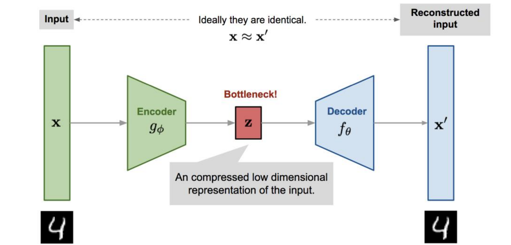
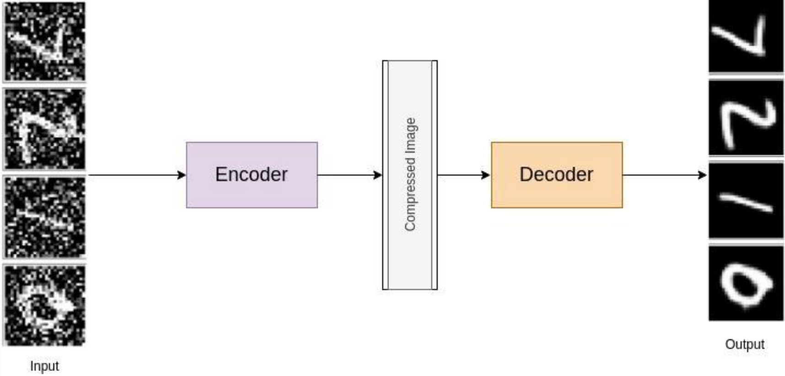
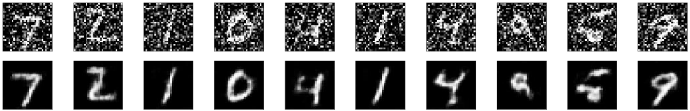
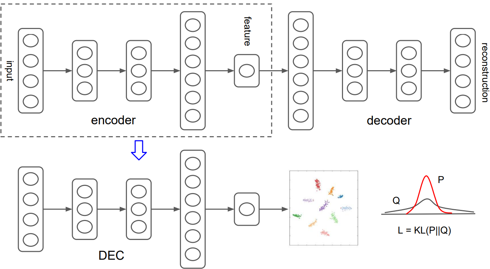
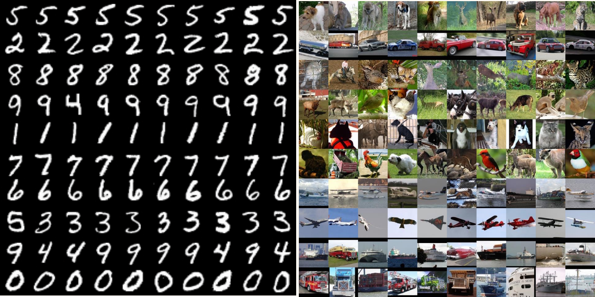

# § 9. Autoencoder

## Unsupervised Learning

!!! definition "Definition 9.1 : Unsupervised Learning"
    **Unsupervised learning** utilizes data $X_{1}, \ldots, X_{N}$ to learn the "structure" of the data. No labels are utilized.

    There are a wide range of unsupervised learning tasks. In this class, we discuss just a few.

    Generally, unsupervised learning tasks tend to have more mathematical complexity.

!!! concept "Concept 9.2 : Many data has low-dimensional latent representation, and the task is to find it."
    Many high-dimensional data has some underlying low-dimensional structure.
    (One can model this assumption as data residing in a low dimensional manifold and utilize ideas from differential geometry. We won’t pursue this direction)

    If you randomly generate the pixels of a color image $X \in \mathbb{R}^{3 \times m \times n}$, it will likely make no sense. Only a very small subset of pixel values correspond to meaningful images.

    In machine learning, especially in unsupervised learning, finding a "meaningful" low dimensional latent representation is of interest.

    A good lower-dimensional representation of the data implies you have a good understanding of the data.

## Definition of Autoencoder

!!! definition "Definition 9.3 : Autoencoder"
    An **autoencoder (AE)** has encoder $E_{\theta}: \mathbb{R}^{n} \rightarrow \mathbb{R}^{r}$ and decoder $D_{\varphi}: \mathbb{R}^{r} \rightarrow \mathbb{R}^{n}$ networks, where $r \ll n$. (If $r \geq n$, AE learns identity mapping, so pointless.) The two networks are trained through the loss
    
    $$
    \mathcal{L}(\theta, \varphi)=\sum_{i=1}^{N}\left\|X_{i}-D_{\varphi}\left(E_{\theta}\left(X_{i}\right)\right)\right\|^{2}
    $$

    The low-dimensional output $E_{\theta}(X)$ is the latent vector. The encoder performs dimensionality reduction.

    The autoencoder can be thought of as a deep non-linear generalization of the principle component analysis (PCA).

    

    {: width="80%"}
    

    (G. E. Hinton and R. R. Salakhutdinov, Reducing the dimensionality of data with neural networks, Science, 2006.)

## Applications of Autoencoder

!!! concept "Concept 9.4 : Applications of AE: Denoising"
    Autoencoders can be used to denoise or reconstruct corrupted images.
    
    

    {: width="70%"}
    {: width="100%"}
    

    (P. Vincent, H. Larochelle, I. Lajoie, Y. Bengio, and P.-A. Manzagol, Stacked denoising autoencoders: Learning useful representations in a deep network with a local denoising criterion, JMLR, 2010.
    G. Nishad, Reconstruct corrupted data using Denoising Autoencoder, Medium, 2020.)

!!! concept "Concept 9.5 : Applications of AE: Compression"
    Once an AE has been trained, storing the latent variable representation, rather than the original image can be used as a compression mechanism.

    More generally, latent variable representations can be used for video compression.
    ([link](https://youtu.be/NqmMnjJ6GEg))

!!! concept "Concept 9.6 : Applications of AE: Clustering"
    Train an AE and then perform clustering on the latent variables. For the clustering algorithm, one can use things like k-means, which groups together.
    
    Clustering is also referred to as unsupervised classification. Without labels, we want the group "similar" data.
    
    

    {: width="70%"}
    {: width="100%"}
    

    (J. Xie, R. Girshick, and A. Farhadi, Unsupervised deep embedding for clustering analysis, ICML, 2016.)

!!! concept "Concept 9.7 : Anomaly/Outlier Detection"
    **Problem**: detecting data that is significantly different from the data seen during training.

    **Insight**: AE should not be able to faithfully reconstruct novel data.

    **Solution**: Train an AE and define the score function to be the reconstruction loss:
    
    $$
    s(X)=\left\|X-D_{\varphi}\left(E_{\theta}(X)\right)\right\|^{2}
    $$

    If score is high, determine the datapoint to be an outliner.

    (S. Hawkins, H. He, G. Williams, and R. Baxter, Outlier detection using replicator neural networks, DaWaK, 2002.)
