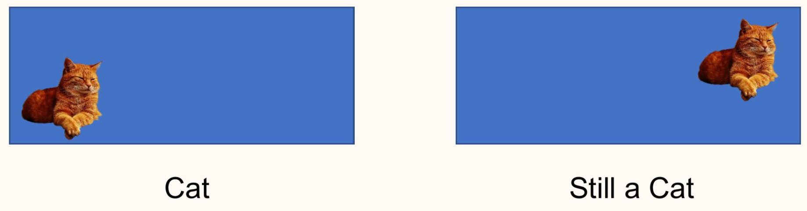
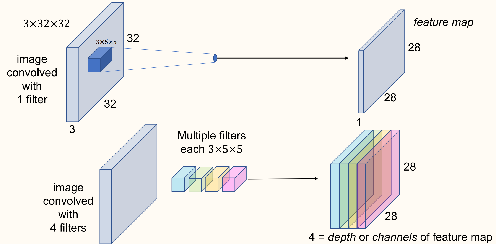
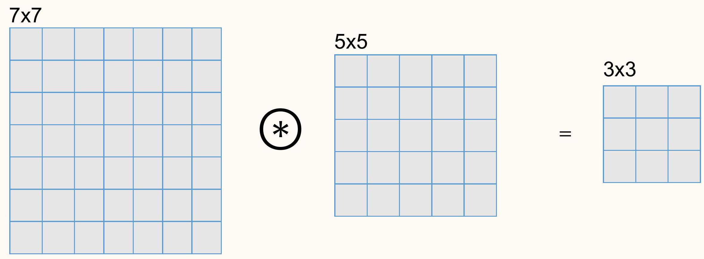
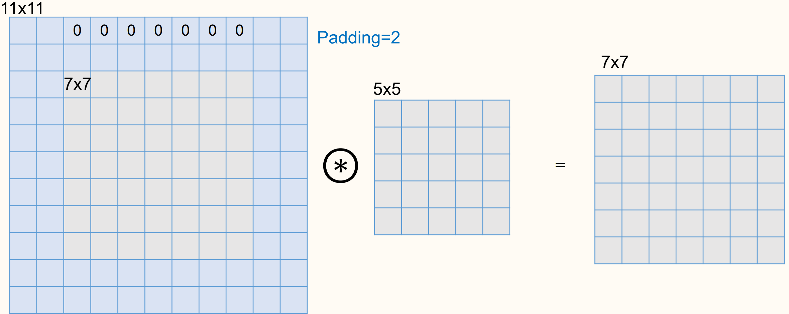
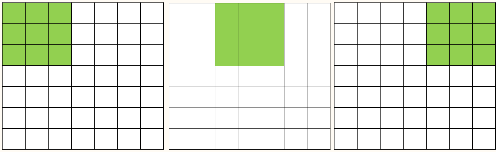
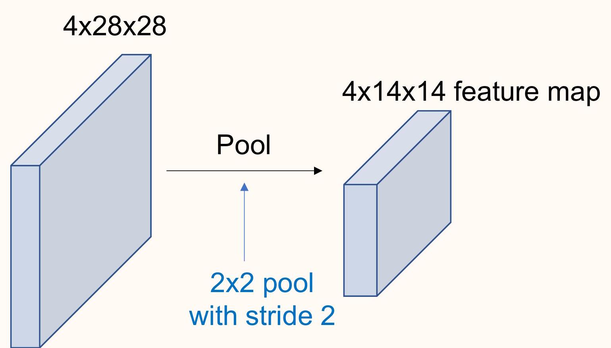
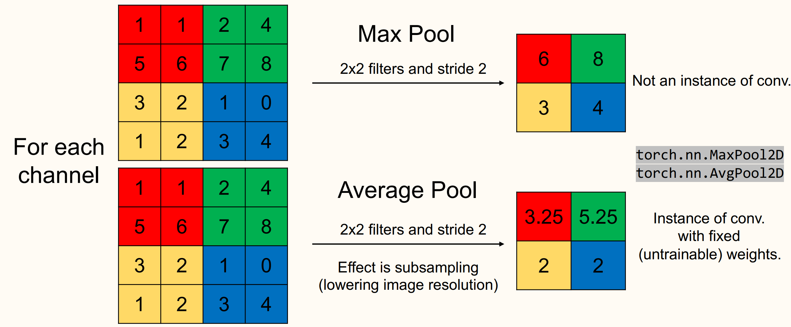

# § 5. Convolutional Neural Networks

## Convolutional Layers

!!! concept "Concept 5.1 : Pros and Cons of Fully Connected Layers"
    Advantages of fully connected layers:

    - Simple.
    - Very general, in theory. (Sufficiently large MLPs can learn any function, in theory.)

    Disadvantage of fully connected layers:

    - Too many trainable parameters.
    - Does not encode shift equivariance/invariance and therefore has poor inductive bias. (More on this later.)

!!! concept "Concept 5.2 : Shift Equivarience/Invariance in Vision"
    Many tasks in vision are equivariant/invariant with respect shifts/translations.

    

    {: width="75%"}
    

    Roughly speaking, equivariance/invariance means shifting the object does not change the meaning (it only changes the position).

    Logistic regression (with a single fully connected layer) does not encode shift invariance.

    Since convolution is equivariant with respect to translations, constructing neural network layers with them is a natural choice.

!!! definition "Definition 5.3 : 2D Convolutional Layer"
    - $B$ : batch size
    - $C_{\text{in}}$ : # of input channels
    - $C_{\text{out}}$ : # of output channels
    - $m, n$ : # of vertical and horizontal indices of input
    - $f_1, f_2$ : # of vertical and horizontal indices of filter

    ---

    - Input tensor : $X \in \mathbb{R}^{B \times C_{\text {in }} \times m \times n}$
    - Output tensor : $Y \in \mathbb{R}^{B \times C_{\text {out }} \times\left(m-f_{1}+1\right) \times\left(n-f_{2}+1\right)}$
    - Filter : $w \in \mathbb{R}^{C_{\text {out }} \times C_{\text {in }} \times f_{1} \times f_{2}}$
    - Bias : $b \in \mathbb{R}^{C_{\text{out}}}$

    ---

    For $k = 1, \dots, B, \quad \ell = 1, \dots, C_{\text{out}}, \quad i = 1, \dots, m-f_1+1, \quad j = 1, \dots, n-f_2+1$:

    $$
    Y_{k, \ell, i, j}=\sum_{\gamma=1}^{c_{\text {in }}} \sum_{\alpha=1}^{f_{1}} \sum_{\beta=1}^{f_{2}} w_{\ell, \gamma, \alpha, \beta} X_{k, \gamma, i+\alpha-1, j+\beta-1}+b_{\ell}
    $$

    Operation is independent across elements of the batch.
    The vertical and horizontal indices are referred to as spatial dimensions.
    If `bias=False`, then $b=0$.

    ---

    Convolve a filter with an image : slide the filter spatially over the image and compute dot products.

    Take a $C_{\text {in }} \times f_{1} \times f_{2}$ chunk of the image and take the inner product with $w$ and add bias $b$.

!!! example "Example 5.4 : Example of 2D Convolutional Layer"
    

    {: width="100%"}
    

    - $B = 1, C_{\text{in}} = 3, C_{\text{out}} = 4, m=n=32, f_1=f_2=5$
    - Input tensor : $X \in \mathbb{R}^{1 \times 3 \times 32 \times 32}$
    - Output tensor : $Y \in \mathbb{R}^{1 \times 4 \times 28 \times 28}$
    - Filter : $w \in \mathbb{R}^{4 \times 3 \times 5 \times 5}$
    - Bias : $b \in \mathbb{R}^{4}$

!!! concept "Concept 5.5 : Zero Padding"
    - **Problem**

    Spatial dimension is reduced when passed through convolutional layers.

    

    {: width="100%"}
    

    $(C \times 7 \times 7$ image$) \circledast(C \times 5 \times 5$ filter$)=(1 \times 3 \times 3$ feature map$)$.
    Spatial dimension 7 reduced to 3.

    ---

    - **Solution**

    **Zero padding** on boundaries can preserve spatial dimension through convolutional layers.

    

    {: width="100%"}
    

    $(C \times 7 \times 7$ image with zero padding $=2) \circledast(C \times 5 \times 5$ filter$)=(1 \times 7 \times 7$ feature map$)$.
    Spatial dimension is preserved.

!!! concept "Concept 5.6 : Stride"
    The horizontal/vertical distance of two adjacent inner product calculations with the filter when sliding it across the image is called **stride**.
    It is originally set to 1, but can be adjusted.

    - $(7 \times 7$ image$) \circledast(3 \times 3$ filter$)$ with stride $1=($output $5 \times 5)$
    - $(7 \times 7$ image$) \circledast(3 \times 3$ filter$)$ with stride $2=($output $3 \times 3)$

        

        {: width="100%"}
        

    - $(7 \times 7$ image with zero padding $=1) \circledast(3 \times 3$ filter$)$ with stride $3=($output $3 \times 3)$

!!! concept "Concept 5.7 : Convolution Summary"
    - Input tensor : $C_{\text {in}} \times W_{\text {in}} \times H_{\text {in}}$
    - Convolution Layer parameters

        - $C_{\text {out}}$ filters, each of $C_{\text {in}} \times F \times F$
        - Stride : $S$
        - Padding : $P$

    - Output tensor : $C_{\text {out}} \times W_{\text {out}} \times H_{\text {out}}$

        $$
        \begin{aligned}
        & W_{\text{out}}=\left\lfloor\frac{W_{\text{in}}-F+2 P}{S}+1\right\rfloor \\
        & H_{\text{out}}=\left\lfloor\frac{H_{\text{in}}-F+2 P}{S}+1\right\rfloor
        \end{aligned}
        $$

        To avoid the complication of this floor operation, it is best to ensure the formula inside evaluates to an integer.

    - Number of trainable parameters : $F^2 C_{\text{in}} C_{\text{out}}$ (filters) $+ C_{\text{out}}$ (biases)

!!! concept "Concept 5.8 : Pooling"
    **Pooling** is primarily used to reduce spatial dimension.
    Similar to convolution.
    Pooling operates over each channel independently.

    

    {: width="50%"}
    

    

    {: width="100%"}
    

!!! concept "Concept 5.9 : Weight Sharing"
    In neural networks, weight sharing is a way to reduce the number of parameters by reusing the same parameter in multiple operations. Convolutional layers are the primary example.

    $$
    A_{w}=\left[\begin{array}{cccccccc}
    w_{1} & \cdots & w_{r} & 0 & \cdots & & & 0 \\
    0 & w_{1} & \cdots & w_{r} & 0 & \cdots & & 0 \\
    0 & 0 & w_{1} & \cdots & w_{r} & 0 & \cdots & 0 \\
    \vdots & & & \ddots & & \ddots & & \vdots \\
    0 & & \cdots & 0 & w_{1} & \cdots & w_{r} & 0 \\
    0 & & \cdots & 0 & 0 & w_{1} & \cdots & w_{r}
    \end{array}\right]
    $$

    If we consider convolution with filter $w$ as a linear operator, the components of $w$ appear may times in the matrix representation.
    This is because the same $w$ is reused for every patch in the convolution.
    Weight sharing in convolution may now seem obvious, but it was a key contribution back when the LeNet architecture was presented.

    Some models (not studied in this course) use weight sharing more explicitly in other ways.

!!! concept "Concept 5.10 : Geometric Deep Learning"
    More generally, given a group $\mathcal{G}$ encoding a symmetry or invariance, one can define operations "equivariant" with respect $\mathcal{G}$ and construct equivariant neural networks.

    This is the subject of geometric deep learning, and its formulation utilizes graph theory and group theory.

    Geometric deep learning is particularly useful for non-Euclidean data. Examples include as protein molecule data and social network service connections.
