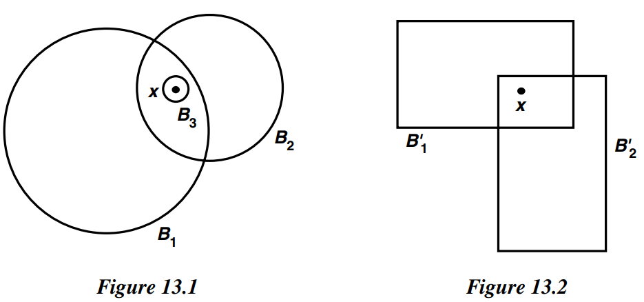
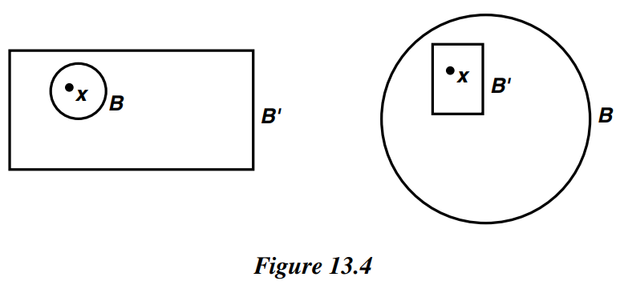

# § 13. Basis for a Topology

!!! definition "Definition 13.1 : Basis / Topology Generated by Basis"
    If $X$ is a set, a **basis** for a topology on $X$ is a collection $\mathcal{B}$ of subsets of $X$ (called **basis elements**) such that

    1. For each $x \in X$, there is at least one basis element $B$ containing $x$.
    2. If $x$ belongs to the intersection of two basis elements $B_{1}$ and $B_{2}$, then there is a basis element $B_{3}$ containing $x$ such that $B_{3} \subset B_{1} \cap B_{2}$.

    (Basis $\Rightarrow$ Topology)  
    If $\mathcal{B}$ satisfies these two conditions, then we define the **topology $\mathcal{T}$ generated by $\mathcal{B}$** as follows:  
    A subset $U$ of $X$ is said to be open in $X$ (that is, to be an element of $\mathcal{T}$ ) if for each $x \in U$, there is a basis element $B \in \mathcal{B}$ such that $x \in B$ and $B \subset U$.
    Note that each basis element is itself an element of $\mathcal{T}$.

!!! example
    {: .center style="width:60%;"}

    1. Let $\mathcal{B}$ be the collection of all circular regions (interiors of circles) in the plane.
      Then $\mathcal{B}$ satisfies both conditions for a basis.
      The second condition is illustrated in Figure 13.1.
      In the topology generated by $\mathcal{B}$, a subset $U$ of the plane is open if every $x$ in $U$ lies in some circular region contained in $U$.

    2. Let $\mathcal{B}^{\prime}$ be the collection of all rectangular regions (interiors of rectangles) in the plane, where the rectangles have sides parallel to the coordinate axes.
      Then $\mathcal{B}^{\prime}$ satisfies both conditions for a basis.
      The second condition is illustrated in Figure 13.2; in this case, the condition is trivial, because the intersection of any two basis elements is itself a basis element (or empty).

!!! theorem "Theorem 13.0"
    The collection $\mathcal{T}$ generated by the basis $\mathcal{B}$ is, in fact, a topology on $X$.

    !!! proof
        If $U$ is the empty set, it satisfies the defining condition of openness vacuously.
        Likewise, $X$ is in $\mathcal{T}$, since for each $x \in X$ there is some basis element $B$ containing $x$ and contained in $X$.
        
        Now let us take an indexed family $\left\{U_{\alpha}\right\}_{\alpha \in J}$, of elements of $\mathcal{T}$ and show that

        $$
        U=\bigcup_{\alpha \in J} U_{\alpha}
        $$

        belongs to $\mathcal{T}$.
        Given $x \in U$, there is an index $\alpha$ such that $x \in U_{\alpha}$.
        Since $U_{\alpha}$ is open, there is a basis element $B$ such that $x \in B \subset U_{\alpha}$.
        Then $x \in B$ and $B \subset U$, so that $U$ is open, by definition.

        Now let us take **two** elements $U_{1}$ and $U_{2}$ of $\mathcal{T}$ and show that $U_{1} \cap U_{2}$ belongs to $\mathcal{T}$.
        Given $x \in U_{1} \cap U_{2}$, choose a basis element $B_{1}$ containing $x$ such that $B_{1} \subset U_{1}$; choose also a basis element $B_{2}$ containing $x$ such that $B_{2} \subset U_{2}$.
        The second condition for a basis enables us to choose a basis element $B_{3}$ containing $x$ such that $B_{3} \subset B_{1} \cap B_{2}$.
        Then $x \in B_{3}$ and $B_{3} \subset U_{1} \cap U_{2}$, so $U_{1} \cap U_{2}$ belongs to $\mathcal{T}$, by definition.

        Finally, we show by induction that any finite intersection $U_{1} \cap \cdots \cap U_{n}$ of elements of $\mathcal{T}$ is in $\mathcal{T}$. This fact is trivial for $n=1$; we suppose it true for $n-1$ and prove it for $n$. Now

        $$
        \left(U_{1} \cap \cdots \cap U_{n}\right)=\left(U_{1} \cap \cdots \cap U_{n-1}\right) \cap U_{n} .
        $$

        By hypothesis, $U_{1} \cap \cdots \cap U_{n-1}$ belongs to $\mathcal{T}$; by the result just proved, the intersection of $U_{1} \cap \cdots \cap U_{n-1}$ and $U_{n}$ also belongs to $\mathcal{T}$.

        Thus we have checked that collection of open sets generated by a basis $\mathcal{B}$ is, in fact, a topology.

!!! property "Lemma 13.1"
    (Basis $\Rightarrow$ Topology)  
    Let $X$ be a set; let $\mathcal{B}$ be a basis for a topology $\mathcal{T}$ on $X$. Then $\mathcal{T}$ equals the collection of all unions of elements of $\mathcal{B}$.

    !!! proof 
        Given a collection of elements of $\mathcal{B}$, they are also elements of $\mathcal{T}$.
        Because $\mathcal{T}$ is a topology, their union is in $\mathcal{T}$.  
        Conversely, given $U \in \mathcal{T}$, choose for each $x \in U$ an element $B_{x}$ of $\mathcal{B}$ such that $x \in B_{x} \subset U$. Then $U=\bigcup_{x \in U} B_{x}$, so $U$ equals a union of elements of $\mathcal{B}$.

!!! property "Lemma 13.2"
    (Topology $\Rightarrow$ Basis)  
    Let $X$ be a topological space.
    Suppose that $C$ is a collection of open sets of $X$ such that for each open set $U$ of $X$ and each $x$ in $U$, there is an element $C$ of $\mathcal{C}$ such that $x \in C \subset U$.
    Then $\mathcal{C}$ is a basis for the topology of $X$.

    !!! proof
        We must show that $\mathcal{C}$ is a basis.
        The first condition for a basis is easy: Given $x \in X$, since $X$ is itself an open set, there is by hypothesis an element $C$ of $\mathcal{C}$ such that $x \in C \subset X$.
        To check the second condition, let $x$ belong to $C_{1} \cap C_{2}$, where $C_{1}$ and $C_{2}$ are elements of $C$. Since $C_{1}$ and $C_{2}$ are open, so is $C_{1} \cap C_{2}$. Therefore, there exists by hypothesis an element $C_{3}$ in $C$ such that $x \in C_{3} \subset C_{1} \cap C_{2}$.

        Let $\mathcal{T}$ be the collection of open sets of $X$; we must show that the topology $\mathcal{T}^{\prime}$ generated by $\mathcal{C}$ equals the topology $\mathcal{T}$.
        First, note that if $U$ belongs to $\mathcal{T}$ and if $x \in U$, then there is by hypothesis an element $C$ of $\mathcal{C}$ such that $x \in C \subset U$.
        It follows that $U$ belongs to the topology $\mathcal{T}^{\prime}$, by definition.
        Conversely, if $W$ belongs to the topology $\mathcal{T}^{\prime}$, then $W$ equals a union of elements of $\mathcal{C}$, by **Lemma 13.1**.
        Since each element of $\mathcal{C}$ belongs to $\mathcal{T}$ and $\mathcal{T}$ is a topology, $W$ also belongs to $\mathcal{T}$.

!!! property "Lemma 13.3"
    Let $\mathcal{B}$ and $\mathcal{B}^{\prime}$ be bases for the topologies $\mathcal{T}$ and $\mathcal{T}^{\prime}$, respectively, on $X$. Then the following are equivalent:

    1. $\mathcal{T}^{\prime}$ is finer than $\mathcal{T}$. ($\mathcal{T}^{\prime} \supset \mathcal{T}$)
    2. For each $x \in X$ and each basis element $B \in \mathcal{B}$ containing $x$, there is a basis element $B^{\prime} \in \mathcal{B}^{\prime}$ such that $x \in B^{\prime} \subset B$.

    !!! proof
        (2) $\Longrightarrow$ (1).  
        Given an element $U$ of $\mathcal{T}$, we wish to show that $U \in \mathcal{T}^{\prime}$. Let $x \in U$. Since $\mathcal{B}$ generates $\mathcal{T}$, there is an element $B \in \mathcal{B}$ such that $x \in B \subset U$. Condition (2) tells us there exists an element $B^{\prime} \in \mathcal{B}^{\prime}$ such that $x \in B^{\prime} \subset B$. Then $x \in B^{\prime} \subset U$, so $U \in \mathcal{T}$, by definition.

        (1) $\Longrightarrow$ (2).  
        We are given $x \in X$ and $B \in \mathcal{B}$, with $x \in B$. Now $B$ belongs to $\mathcal{T}$ by definition and $\mathcal{T} \subset \mathcal{T}^{\prime}$ by condition (1); therefore, $B \in \mathcal{T}^{\prime}$. Since $\mathcal{T}^{\prime}$ is generated by $\mathcal{B}^{\prime}$, there is an element $B^{\prime} \in \mathcal{B}^{\prime}$ such that $x \in B^{\prime} \subset B$.
    
!!! example
    {: .center style="width:50%;"}
    
    One can now see that the collection $\mathcal{B}$ of all circular regions in the plane generates the same topology as the collection $\mathcal{B}^{\prime}$ of all rectangular regions; Figure 13.4 illustrates the proof.

!!! definition "Definition 13.2 : Standard Topology"
    If $\mathcal{B}$ is the collection of all open intervals in the real line,

    $$
    (a, b)=\{x \mid a<x<b\}
    $$

    the topology generated by $\mathcal{B}$ is called the **standard topology** on the real line. Whenever we consider $\mathbb{R}$, we shall suppose it is given this topology unless we specifically state otherwise.
    
!!! definition "Definition 13.3 : Lower Limit Topology"
    If $\mathcal{B}^{\prime}$ is the collection of all half-open intervals of the form

    $$
    [a, b)=\{x \mid a \leq x<b\}
    $$

    where $a<b$, the topology generated by $\mathcal{B}^{\prime}$ is called the **lower limit topology** on $\mathbb{R}$.
    When $\mathbb{R}$ is given the lower limit topology, we denote it by $\mathbb{R}_{\ell}$.

!!! definition "Definition 13.4 : K - Topology"
    Finally let $K$ denote the set of all numbers of the form $1 / n$, for $n \in \mathbb{Z}_{+}$, and let $\mathcal{B}^{\prime \prime}$ be the collection of all open intervals $(a, b)$, along with all sets of the form $(a, b)-K$.  
    The topology generated by $\mathcal{B}^{\prime \prime}$ will be called the **${K}$-topology** on $\mathbb{R}$.
    When $\mathbb{R}$ is given this topology, we denote it by $\mathbb{R}_{K}$.

!!! theorem "Lemma 13.4"
    The topologies of $\mathbb{R}_{\ell}$ and $\mathbb{R}_{K}$ are strictly finer than the standard topology on $\mathbb{R}$, but are not comparable with one another.

    !!! proof
        Let $\mathcal{T}, \mathcal{T}^{\prime}$, and $\mathcal{T}^{\prime \prime}$ be the topologies of $\mathbb{R}, \mathbb{R}_{\ell}$, and $\mathbb{R}_{K}$, respectively. Given a basis element $(a, b)$ for $\mathcal{T}$ and a point $x$ of $(a, b)$, the basis element $[x, b)$ for $\mathcal{T}^{\prime}$ contains $x$ and lies in $(a, b)$. On the other hand, given the basis element $[x, d)$ for $\mathcal{T}^{\prime}$, there is no open interval $(a, b)$ that contains $x$ and lies in $[x, d)$. Thus $\mathcal{T}^{\prime}$ is strictly finer than $\mathcal{T}$.

        A similar argument applies to $\mathbb{R}_{K}$. Given a basis element $(a, b)$ for $\mathcal{T}$ and a point $x$ of $(a, b)$, this same interval is a basis element for $\mathcal{T}^{\prime \prime}$ that contains $x$. On the other hand, given the basis element $B=(-1,1)-K$ for $\mathcal{T}^{\prime \prime}$ and the point 0 of $B$, there is no open interval that contains 0 and lies in $B$.

        Same examples can be applied to show that $\mathbb{R}_{\ell}$ and $\mathbb{R}_{K}$ are not comparable with one another.

!!! definition "Definition 13.5 : Subbasis / Topology Generated by Subbasis"
    A **subbasis** $S$ for a topology on $X$ is a collection of subsets of $X$ whose union equals $X$.
    The **topology generated by the subbasis $S$** is defined to be the collection $\mathcal{T}$ of all unions of finite intersections of elements of $S$.

!!! theorem "Theorem 13.5"
    $\mathcal{T}$, the topology generated by the subbasis $S$ is a topology.

    !!! proof
        For this purpose it will suffice to show that the collection $\mathcal{B}$ of all finite intersections of elements of $\mathcal{S}$ is a basis, for then the collection $\mathcal{T}$ of all unions of elements of $\mathscr{B}$ is a topology, by **Lemma 13.1**.
        
        Given $x \in X$, it belongs to an element of $\mathcal{S}$ and hence to an element of $\mathscr{B}$; this is the first condition for a basis.
        
        To check the second condition, let

        $$
        B_{1}=S_{1} \cap \cdots \cap S_{m} \quad \text { and } \quad B_{2}=S_{1}^{\prime} \cap \cdots \cap S_{n}^{\prime}
        $$

        be two elements of $\mathscr{B}$. Their intersection

        $$
        B_{1} \cap B_{2}=\left(S_{1} \cap \cdots \cap S_{m}\right) \cap\left(S_{1}^{\prime} \cap \cdots \cap S_{n}^{\prime}\right)
        $$

        is also a finite intersection of elements of $\mathcal{S}$, so it belongs to $\mathcal{B}$.