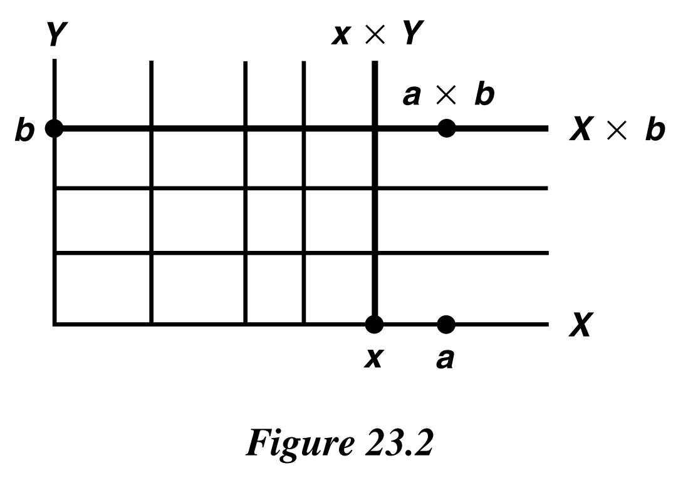

# § 23. Connected Spaces

!!! definition "Definition 23.1 : Connected Space / Separation"
    Let $X$ be a topological space.
    A **separation** of $X$ is a pair $U, V$ of disjoint nonempty open subsets of $X$ whose union is $X$.
    The space $X$ is said to be **connected** if there does not exist a separation of $X$.

!!! theorem "Theorem 23.0"
    A space $X$ is connected if and only if the only subsets of $X$ that are both open and closed in $X$ are the empty set and $X$ itself.

    !!! proof
        For if $A$ is a nonempty proper subset of $X$ that is both open and closed in $X$, then the sets $U=A$ and $V=X-A$ constitute a separation of $X$, for they are open, disjoint, and nonempty, and their union is $X$.
        
        Conversely, if $U$ and $V$ form a separation of $X$, then $U$ is nonempty and different from $X$, and it is both open and closed in $X$.

!!! theorem "Lemma 23.1"
    If $Y$ is a subspace of $X$, a separation of $Y$ is a pair of disjoint nonempty sets $A$ and $B$ whose union is $Y$, neither of which contains a limit point of the other.
    The space $Y$ is connected if there exists no separation of $Y$.

    !!! proof
        Suppose first that $A$ and $B$ form a separation of $Y$.
        Then $A$ is both open and closed in $Y$.
        The closure of $A$ in $Y$ is the set $\bar{A} \cap Y$ (where $\bar{A}$ as usual denotes the closure of $A$ in $X$ ).
        Since $A$ is closed in $Y, A=\bar{A} \cap Y$; or to say the same thing, $\bar{A} \cap B=\varnothing$.
        Since $\bar{A}$ is the union of $A$ and its limit points, $B$ contains no limit points of $A$.
        A similar argument shows that $A$ contains no limit points of $B$.

        Conversely, suppose that $A$ and $B$ are disjoint nonempty sets whose union is $Y$, neither of which contains a limit point of the other.
        Then $\bar{A} \cap B=\varnothing$ and $A \cap \bar{B}=\varnothing$; therefore, we conclude that $\bar{A} \cap Y=A$ and $\bar{B} \cap Y=B$.
        Thus both $A$ and $B$ are closed in $Y$, and since $A=Y-B$ and $B=Y-A$, they are open in $Y$ as well.

!!! theorem "Lemma 23.2"
    If the sets $C$ and $D$ form a separation of $X$, and if $Y$ is a connected subspace of $X$, then $Y$ lies entirely within either $C$ or $D$.

    !!! proof
        Since $C$ and $D$ are both open in $X$, the sets $C \cap Y$ and $D \cap Y$ are open in $Y$.
        These two sets are disjoint and their union is $Y$; if they were both nonempty, they would constitute a separation of $Y$.
        Therefore, one of them is empty.
        Hence $Y$ must lie entirely in $C$ or in $D$.

!!! theorem "Theorem 23.3"
    The union of a collection of connected subspaces of $X$ that have a point in common is connected.

    !!! proof
        Let $\left\{A_{\alpha}\right\}$ be a collection of connected subspaces of a space $X$; let $p$ be a point of $\bigcap A_{\alpha}$.
        We prove that the space $Y=\bigcup A_{\alpha}$ is connected.
        Suppose that $Y=C \cup D$ is a separation of $Y$.
        The point $p$ is in one of the sets $C$ or $D$; suppose $p \in C$.
        Since $A_{\alpha}$ is connected, it must lie entirely in either $C$ or $D$ (by **Lemma 23.2**), and it cannot lie in $D$ because it contains the point $p$ of $C$.
        Hence $A_{\alpha} \subset C$ for every $\alpha$, so that $\bigcup A_{\alpha} \subset C$, contradicting the fact that $D$ is nonempty.

!!! theorem "Theorem 23.4"
    Let $A$ be a connected subspace of $X$.
    If $A \subset B \subset \bar{A}$, then $B$ is also connected.

    Said differently: If $B$ is formed by adjoining to the connected subspace $A$ some or all of its limit points, then $B$ is connected.

    !!! proof
        Let $A$ be connected and let $A \subset B \subset \bar{A}$.
        Suppose that $B=C \cup D$ is a separation of $B$.
        By **Lemma 23.2**, the set $A$ must lie entirely in $C$ or in $D$; suppose that $A \subset C$.
        Then $\bar{A} \subset \bar{C}$; since $\bar{C}$ and $D$ are disjoint, $B$ cannot intersect $D$.
        This contradicts the fact that $D$ is a nonempty subset of $B$.

!!! theorem "Theorem 23.5"
    The image of a connected space under a continuous map is connected.

    !!! proof
        Let $f: X \rightarrow Y$ be a continuous map; let $X$ be connected.
        We wish to prove the image space $Z=f(X)$ is connected.
        Since the map obtained from $f$ by restricting its range to the space $Z$ is also continuous, it suffices to consider the case of a continuous surjective map

        $$
        g: X \rightarrow Z
        $$

        Suppose that $Z=A \cup B$ is a separation of $Z$ into two disjoint nonempty sets open in $Z$.
        Then $g^{-1}(A)$ and $g^{-1}(B)$ are disjoint sets whose union is $X$; they are open in $X$ because $g$ is continuous, and nonempty because $g$ is surjective.
        Therefore, they form a separation of $X$, contradicting the assumption that $X$ is connected.

!!! theorem "Theorem 23.6"
    A finite cartesian product of connected spaces is connected.

    !!! proof
        We prove the theorem first for the product of two connected spaces $X$ and $Y$.
        This proof is easy to visualize.
        Choose a "base point" $a \times b$ in the product $X \times Y$.
        Note that the "horizontal slice" $X \times b$ is connected, being homeomorphic with $X$, and each "vertical slice" $x \times Y$ is connected, being homeomorphic with $Y$.
        As a result, each "T-shaped" space

        $$
        T_{x}=(X \times b) \cup(x \times Y)
        $$

        is connected, being the union of two connected spaces that have the point $x \times b$ in common.
        See Figure 23.2.
        Now form the union $\bigcup_{x \in X} T_{x}$ of all these T-shaped spaces.
        This union is connected because it is the union of a collection of connected spaces that have the point $a \times b$ in common.
        Since this union equals $X \times Y$, the space $X \times Y$ is connected.

        The proof for any finite product of connected spaces follows by induction, using the fact (easily proved) that $X_{1} \times \cdots \times X_{n}$ is homeomorphic with $\left(X_{1} \times \cdots \times X_{n-1}\right) \times$ $X_{n}$.
        
        {: .center style="width:40%;"}