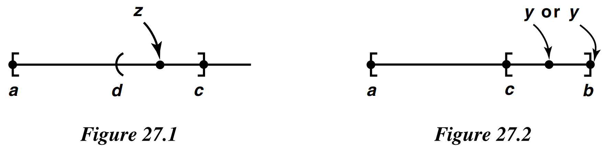
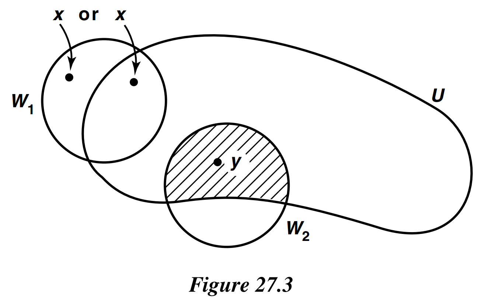

# § 27. Compact Spaces of the Real Line

!!! theorem "Theorem 27.1"
    Let $X$ be a simply ordered set having the least upper bound property.
    In the order topology, each closed interval in $X$ is compact.

    !!! proof
        Step 1.  
        Given $a<b$, let $\mathcal{A}$ be a covering of $[a, b]$ by sets open in $[a, b]$ in the subspace topology (which is the same as the order topology).
        We wish to prove the existence of a finite subcollection of $\mathcal{A}$ covering $[a, b]$.
        First we prove the following: If $x$ is a point of $[a, b]$ different from $b$, then there is a point $y>x$ of $[a, b]$ such that the interval $[x, y]$ can be covered by at most two elements of $\mathcal{A}$.

        If $x$ has an immediate successor in $X$, let $y$ be this immediate successor.
        Then $[x, y]$ consists of the two points $x$ and $y$, so that it can be covered by at most two elements of $\mathcal{A}$.
        If $x$ has no immediate successor in $X$, choose an element $A$ of $\mathcal{A}$ containing $x$.
        Because $x \neq b$ and $A$ is open, $A$ contains an interval of the form $[x, c)$, for some $c$ in $[a, b]$.
        Choose a point $y$ in $(x, c)$; then the interval $[x, y]$ is covered by the single element $A$ of $\mathcal{A}$.

        Step 2.  
        Let $C$ be the set of all points $y>a$ of $[a, b]$ such that the interval $[a, y]$ can be covered by finitely many elements of $\mathcal{A}$.
        Applying Step 1 to the case $x=a$, we see that there exists at least one such $y$, so $C$ is not empty.
        Let $c$ be the least upper bound of the set $C$; then $a<c \leq b$.

        Step 3.  
        We show that $c$ belongs to $C$; that is, we show that the interval $[a, c]$ can be covered by finitely many elements of $\mathcal{A}$.
        Choose an element $A$ of $\mathcal{A}$ containing $c$; since $A$ is open, it contains an interval of the form $(d, c]$ for some $d$ in $[a, b]$.
        If $c$ is not in $C$, there must be a point $z$ of $C$ lying in the interval $(d, c)$, because otherwise $d$ would be a smaller upper bound on $C$ than $c$.
        See Figure 27.1. Since $z$ is in $C$, the interval $[a, z]$ can be covered by finitely many, say $n$, elements of $\mathcal{A}$.
        Now $[z, c]$ lies in the single element $A$ of $\mathcal{A}$, hence $[a, c]=[a, z] \cup[z, c]$ can be covered by $n+1$ elements of $\mathcal{A}$.
        Thus $c$ is in $C$, contrary to assumption.

        Step 4.  
        Finally, we show that $c=b$, and our theorem is proved.
        Suppose that $c<b$.
        Applying Step 1 to the case $x=c$, we conclude that there exists a point $y>c$ of $[a, b]$ such that the interval $[c, y]$ can be covered by finitely many elements of $\mathcal{A}$.
        See Figure 27.2.
        We proved in Step 3 that $c$ is in $C$, so $[a, c]$ can be covered by finitely many elements of $\mathcal{A}$.
        Therefore, the interval

        $$
        [a, y]=[a, c] \cup[c, y]
        $$

        can also be covered by finitely many elements of $\mathcal{A}$.
        This means that $y$ is in $C$, contradicting the fact that $c$ is an upper bound on $C$.

        {: .center style="width:60%;"}

!!! theorem "Corollary 27.2"
    Every closed interval in $\mathbb{R}$ is compact.

!!! theorem "Theorem 27.3"
    A subspace $A$ of $\mathbb{R}^{n}$ is compact if and only if it is closed and is bounded in the euclidean metric $d$ or the square metric $\rho$.

    !!! proof
        It will suffice to consider only the metric $\rho$; the inequalities

        $$
        \rho(x, y) \leq d(x, y) \leq \sqrt{n} \rho(x, y)
        $$

        imply that $A$ is bounded under $d$ if and only if is is bounded under $\rho$.

        Suppose that $A$ is compact.
        Then, by **Theorem 26.3**, it is closed.
        Consider the collection of open sets

        $$
        \left\{B_{\rho}(\mathbf{0}, m) \mid m \in \mathbb{Z}_{+}\right\}
        $$

        whose union is all of $\mathbb{R}^{n}$.
        Some finite subcollection covers $A$.
        It follows that $A \subset$ $B_{\rho}(\mathbf{0}, M)$ for some $M$.
        Therefore, for any two points $x$ and $y$ of $A$, we have $\rho(x, y) \leq$ $2 M$.
        Thus $A$ is bounded under $\rho$.

        Conversely, suppose that $A$ is closed and bounded under $\rho$; suppose that $\rho(x, y) \leq$ $N$ for every pair $x, y$ of points of $A$.
        Choose a point $x_{0}$ of $A$, and let $\rho\left(x_{0}, \mathbf{0}\right)=b$.
        The triangle inequality implies that $\rho(x, \mathbf{0}) \leq N+b$ for every $x$ in $A$.
        If $P=N+b$, then $A$ is a subset of the cube $[-P, P]^{n}$, which is compact.
        Being closed, $A$ is also compact.

!!! theorem "Theorem 27.4 : Extreme Value Theorem"
    Let $f: X \rightarrow Y$ be continuous, where $Y$ is an ordered set in the order topology.
    If $X$ is compact, then there exist points $c$ and $d$ in $X$ such that $f(c) \leq f(x) \leq f(d)$ for every $x \in X$.

    The extreme value theorem of calculus is the special case of this theorem that occurs when we take $X$ to be a closed interval in $\mathbb{R}$ and $Y$ to be $\mathbb{R}$.

    !!! proof
        Since $f$ is continuous and $X$ is compact, the set $A=f(X)$ is compact.
        We show that $A$ has a largest element $M$ and a smallest element $m$.
        Then since $m$ and $M$ belong to $A$, we must have $m=f(c)$ and $M=f(d)$ for some points $c$ and $d$ of $X$.

        If $A$ has no largest element, then the collection

        $$
        \{(-\infty, a) \mid a \in A\}
        $$

        forms an open covering of $A$.
        Since $A$ is compact, some finite subcollection

        $$
        \left\{\left(-\infty, a_{1}\right), \ldots,\left(-\infty, a_{n}\right)\right\}
        $$

        covers $A$.
        If $a_{i}$ is the largest of the elements $a_{1}, \ldots a_{n}$, then $a_{i}$ belongs to none of these sets, contrary to the fact that they cover $A$.

        A similar argument shows that $A$ has a smallest element.

!!! definition "Definition 27.1 : Distance from x to A"
    Let $(X, d)$ be a metric space; let $A$ be a nonempty subset of $X$. For each $x \in X$, we define the **distance from $x$ to $A$** by the equation

    $$
    d(x, A)=\inf \{d(x, a) \mid a \in A\}
    $$

!!! theorem "Theorem 27.4.1"
    For fixed $A$, the function $d(x, A)$ is a continuous function of $x$.
    
    !!! proof
        Given $x, y \in X$, one has the inequalities

        $$
        d(x, A) \leq d(x, a) \leq d(x, y)+d(y, a),
        $$

        for each $a \in A$. It follows that

        $$
        d(x, A)-d(x, y) \leq \inf d(y, a)=d(y, A)
        $$

        so that

        $$
        d(x, A)-d(y, A) \leq d(x, y) .
        $$

        The same inequality holds with $x$ and $y$ interchanged; continuity of the function $d(x, A)$ follows.

!!! theorem "Lemma 27.5 : The Lebesgue Number Lemma"
    Let $\mathcal{A}$ be an open covering of the metric space $(X, d)$.
    If $X$ is compact, there is a $\delta>0$ such that for each subset of $X$ having diameter less than $\delta$, there exists an element of $\mathcal{A}$ containing it.

    The number $\delta$ is called a Lebesgue number for the covering $\mathcal{A}$.

    !!! proof
        Let $\mathcal{A}$ be an open covering of $X$.
        If $X$ itself is an element of $\mathcal{A}$, then any positive number is a Lebesgue number for $\mathcal{A}$.
        So assume $X$ is not an element of $\mathcal{A}$.

        Choose a finite subcollection $\left\{A_{1}, \ldots, A_{n}\right\}$ of $\mathcal{A}$ that covers $X$.
        For each $i$, set $C_{i}=X-A_{i}$, and define $f: X \rightarrow \mathbb{R}$ by letting $f(x)$ be the average of the numbers $d\left(x, C_{i}\right)$.
        That is,

        $$
        f(x)=\frac{1}{n} \sum_{i=1}^{n} d\left(x, C_{i}\right)
        $$

        We show that $f(x)>0$ for all $x$.
        Given $x \in X$, choose $i$ so that $x \in A_{i}$.
        Then choose $\epsilon$ so the $\epsilon$-neighborhood of $x$ lies in $A_{i}$.
        Then $d\left(x, C_{i}\right) \geq \epsilon$, so that $f(x) \geq \epsilon / n$.

        Since $f$ is continuous, it has a minimum value $\delta$; we show that $\delta$ is our required Lebesgue number.
        Let $B$ be a subset of $X$ of diameter less than $\delta$.
        Choose a point $x_{0}$ of $B$; then $B$ lies in the $\delta$-neighborhood of $x_{0}$.
        Now

        $$
        \delta \leq f\left(x_{0}\right) \leq d\left(x_{0}, C_{m}\right)
        $$

        where $d\left(x_{0}, C_{m}\right)$ is the largest of the numbers $d\left(x_{0}, C_{i}\right)$.
        Then the $\delta$-neighborhood of $x_{0}$ is contained in the element $A_{m}=X-C_{m}$ of the covering $\mathcal{A}$.

!!! definition "Definition 27.2 : Uniformly Continuous"
    A function $f$ from the metric space $\left(X, d_{X}\right)$ to the metric space $\left(Y, d_{Y}\right)$ is said to be **uniformly continuous** if given $\epsilon>0$, there is a $\delta>0$ such that for every pair of points $x_{0}, x_{1}$ of $X$,

    $$
    d_{X}\left(x_{0}, x_{1}\right)<\delta \Longrightarrow d_{Y}\left(f\left(x_{0}\right), f\left(x_{1}\right)\right)<\epsilon
    $$

!!! theorem "Theorem 27.6 : Uniform Continuity Theorem"
    Let $f: X \rightarrow Y$ be a continuous map of the compact metric space $\left(X, d_{X}\right)$ to the metric space $\left(Y, d_{Y}\right)$.
    Then $f$ is uniformly continuous.

    !!! proof
        Given $\epsilon>0$, take the open covering of $Y$ by balls $B(y, \epsilon / 2)$ of radius $\epsilon / 2$.
        Let $\mathcal{A}$ be the open covering of $X$ by the inverse images of these balls under $f$.
        Choose $\delta$ to be a Lebesgue number for the covering $\mathcal{A}$.
        Then if $x_{1}$ and $x_{2}$ are two points of $X$ such that $d_{X}\left(x_{1}, x_{2}\right)<\delta$, the two-point set $\left\{x_{1}, x_{2}\right\}$ has diameter less than $\delta$, so that its image $\left\{f\left(x_{1}\right), f\left(x_{2}\right)\right\}$ lies in some ball $B(y, \epsilon / 2)$.
        Then $d_{Y}\left(f\left(x_{1}\right), f\left(x_{2}\right)\right)<\epsilon$, as desired.

!!! definition "Definition 27.3 : Isolated Point"
    If $X$ is a space, a point $x$ of $X$ is said to be an **isolated point** of $X$ if the one-point set $\{x\}$ is open in $X$.

!!! theorem "Theorem 27.7"
    Let $X$ be a nonempty compact Hausdorff space.
    If $X$ has no isolated points, then $X$ is uncountable.

    !!! proof
        Step 1.  
        We show first that given any nonempty open set $U$ of $X$ and any point $x$ of $X$, there exists a nonempty open set $V$ contained in $U$ such that $x \notin \bar{V}$.

        Choose a point $y$ of $U$ different from $x$; this is possible if $x$ is in $U$ because $x$ is not an isolated point of $X$ and it is possible if $x$ is not in $U$ simply because $U$ is nonempty.
        Now choose disjoint open sets $W_{1}$ and $W_{2}$ about $x$ and $y$, respectively.
        Then the set $V=W_{2} \cap U$ is the desired open set; it is contained in $U$, it is nonempty because it contains $y$, and its closure does not contain $x$.
        See Figure 27.3.

        {: .center style="width:60%;"}
        
        Step 2.  
        We show that given $f: \mathbb{Z}_{+} \rightarrow X$, the function $f$ is not surjective.
        It follows that $X$ is uncountable.
        Let $x_{n}=f(n)$.
        Apply Step 1 to the nonempty open set $U=X$ to choose a nonempty open set $V_{1} \subset X$ such that $\bar{V}_{1}$ does not contain $x_{1}$.
        In general, given $V_{n-1}$ open and nonempty, choose $V_{n}$ to be a nonempty open set such that $V_{n} \subset V_{n-1}$ and $\bar{V}_{n}$ does not contain $x_{n}$.
        Consider the nested sequence

        $$
        \bar{V}_{1} \supset \bar{V}_{2} \supset \cdots
        $$

        of nonempty closed sets of $X$.
        Because $X$ is compact, there is a point $x \in \cap \bar{V}_{n}$, by **Theorem 26.9**.
        Now $x$ cannot equal $x_{n}$ for any $n$, since $x$ belongs to $\bar{V}_{n}$ and $x_{n}$ does not.

!!! theorem "Corollary 27.8"
    Every closed interval in $\mathbb{R}$ is uncountable.