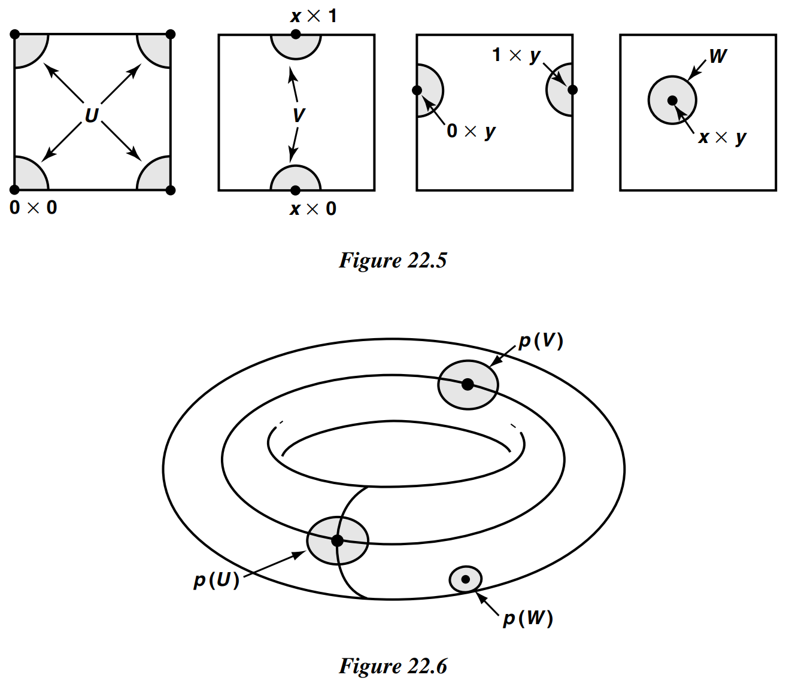
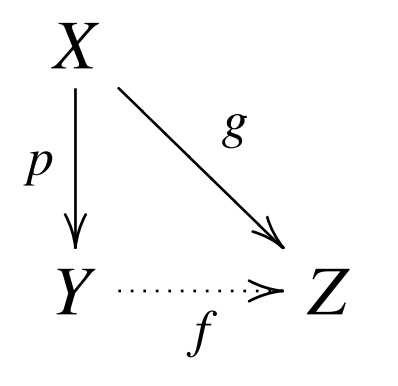
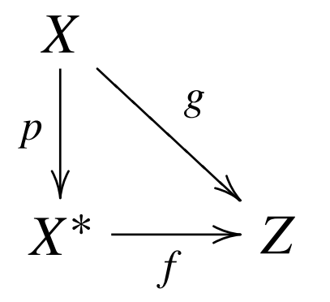
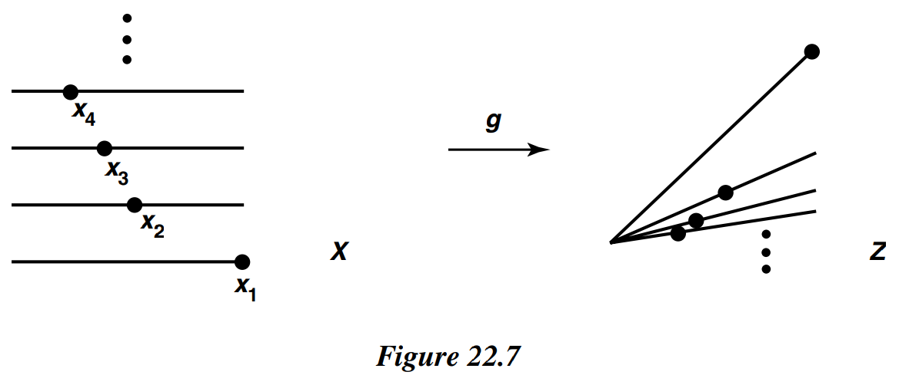
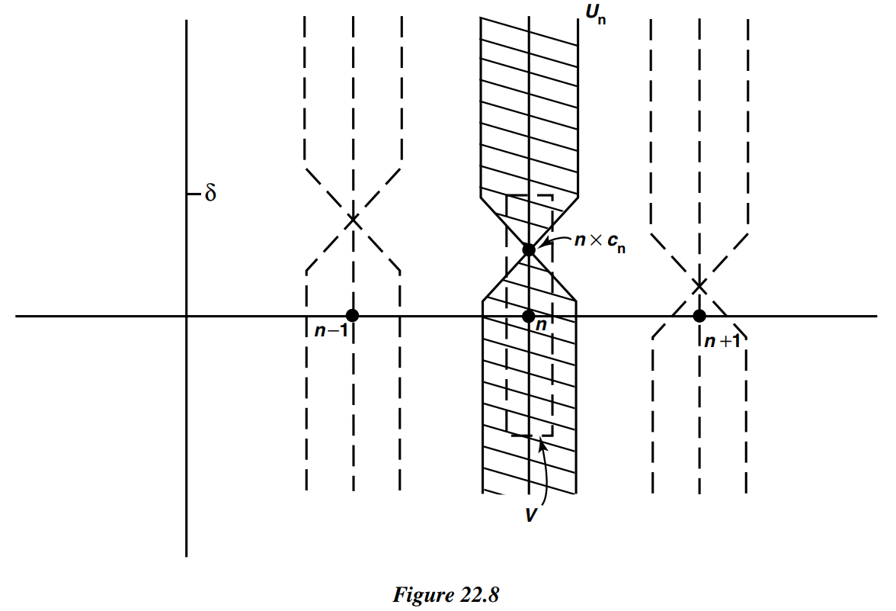

# § 22. The Quotient Topology

!!! definition "Definition 22.1 : Quotient Map"
    Let $X$ and $Y$ be topological spaces; let $p: X \rightarrow Y$ be a surjective map.
    The map $p$ is said to be a **quotient map** provided a subset $U$ of $Y$ is open in $Y$ if and only if $p^{-1}(U)$ is open in $X$.

    An equivalent condition is to require that a subset $A$ of $Y$ be closed in $Y$ if and only if $p^{-1}(A)$ is closed in $X$.

    To say that $p$ is a quotient map is equivalent to saying that $p$ is continuous and $p$ maps saturated open sets of $X$ to open sets of $Y$ (or saturated closed sets of $X$ to closed sets of $Y$ ).

!!! definition "Definition 22.2 : Saturated Subset"
    We say that a subset $C$ of $X$ is **saturated** (with respect to the surjective map $p: X \rightarrow Y$ ) if $C$ contains every set $p^{-1}(\{y\})$ that it intersects.
    Thus $C$ is **saturated** if it equals the complete inverse image of a subset of $Y$.

!!! definition "Definition 22.3 : Open Map / Closed Map"
    A map $f: X \rightarrow Y$ is said to be an **open map** if for each open set $U$ of $X$, the set $f(U)$ is open in $Y$.
    
    It is said to be a **closed map** if for each closed set $A$ of $X$, the set $f(A)$ is closed in $Y$.
    
    It follows immediately from the definition that if $p: X \rightarrow Y$ is a surjective continuous map that is either open or closed, then $p$ is a quotient map.

!!! definition "Definition 22.4 : Quotient Topology"
    If $X$ is a space and $A$ is a set and if $p: X \rightarrow A$ is a surjective map, then there exists exactly one topology $\mathcal{T}$ on $A$ relative to which $p$ is a quotient map; it is called the **quotient topology** induced by $p$.

    The topology $\mathcal{T}$ is of course defined by letting it consist of those subsets $U$ of $A$ such that $p^{-1}(U)$ is open in $X$.

!!! theorem "Theorem 22.0"
    If $X$ is a space and $A$ is a set and if $p: X \rightarrow A$ is a surjective map, the topology $\mathcal{T}$ defined by letting it consist of those subsets $U$ of $A$ such that $p^{-1}(U)$ is open in $X$, is indeed a topology.

    !!! proof
        The sets $\varnothing$ and $A$ are open because $p^{-1}(\varnothing)=\varnothing$ and $p^{-1}(A)=X$. The other two conditions follow from the equations

        $$
        \begin{aligned}
        p^{-1}\left(\bigcup_{\alpha \in J} U_{\alpha}\right) & =\bigcup_{\alpha \in J} p^{-1}\left(U_{\alpha}\right) \\
        p^{-1}\left(\bigcap_{i=1}^{n} U_{i}\right) & =\bigcap_{i=1}^{n} p^{-1}\left(U_{i}\right)
        \end{aligned}
        $$

!!! definition "Definition 22.5 : Quotient Space"
    Let $X$ be a topological space, and let $X^{*}$ be a partition of $X$ into disjoint subsets whose union is $X$.
    Let $p: X \rightarrow X^{*}$ be the surjective map that carries each point of $X$ to the element of $X^{*}$ containing it.
    In the quotient topology induced by $p$, the space $X^{*}$ is called a **quotient space** of $X$.

    Given $X^{*}$, there is an equivalence relation on $X$ of which the elements of $X^{*}$ are the equivalence classes.
    One can think of $X^{*}$ as having been obtained by "identifying" each pair of equivalent points.
    For this reason, the quotient space $X^{*}$ is often called an identification space, or a decomposition space, of the space $X$.

    We can describe the topology of $X^{*}$ in another way.
    A subset $U$ of $X^{*}$ is a collection of equivalence classes, and the set $p^{-1}(U)$ is just the union of the equivalence classes belonging to $U$.
    Thus the typical open set of $X^{*}$ is a collection of equivalence classes whose union is an open set of $X$.

!!! example
    Let $X$ be the rectangle $[0,1] \times[0,1]$.
    Define a partition $X^{*}$ of $X$ as follows: It consists of all the one-point sets $\{x \times y\}$ where $0<x<1$ and $0<y<1$, the following types of two-point sets:

    $$
    \begin{aligned}
    & \{x \times 0, x \times 1\} \quad \text { where } 0<x<1 \\
    & \{0 \times y, 1 \times y\} \quad \text { where } 0<y<1
    \end{aligned}
    $$

    and the four-point set

    $$
    \{0 \times 0,0 \times 1,1 \times 0,1 \times 1\} .
    $$

    Typical saturated open sets in $X$ are pictured by the shaded regions in Figure 22.5; each is an open set of $X$ that equals a union of elements of $X^{*}$.
    The image of each of these sets under $p$ is an open set of $X^{*}$, as indicated in Figure 22.6.
    This description of $X^{*}$ is just the mathematical way of saying what we expressed in pictures when we pasted the edges of a rectangle together to form a torus.

    

    {width=70%}
    

!!! theorem "Theorem 22.1"
    Let $p: X \rightarrow Y$ be a quotient map; let $A$ be a subspace of $X$ that is saturated with respect to $p$; let $q: A \rightarrow p(A)$ be the map obtained by restricting $p$.

    1. If $A$ is either open or closed in $X$, then $q$ is a quotient map.

    2. If $p$ is either an open map or a closed map, then $q$ is a quotient map.
    
    !!! proof
        Step 1.
        We verify first the following two equations:

        $$
        \begin{aligned}
        q^{-1}(V) & =p^{-1}(V) & & \text { if } V \subset p(A) ; \\
        p(U \cap A) & =p(U) \cap p(A) & & \text { if } U \subset X .
        \end{aligned}
        $$

        To check the first equation, we note that since $V \subset p(A)$ and $A$ is saturated, $p^{-1}(V)$ is contained in $A$.
        It follows that both $p^{-1}(V)$ and $q^{-1}(V)$ equal all points of $A$ that are mapped by $p$ into $V$.
        To check the second equation, we note that for any two subsets $U$ and $A$ of $X$, we have the inclusion

        $$
        p(U \cap A) \subset p(U) \cap p(A) .
        $$

        To prove the reverse inclusion, suppose $y=p(u)=p(a)$, for $u \in U$ and $a \in A$. Since $A$ is saturated, $A$ contains the set $p^{-1}(p(a))$, so that in particular $A$ contains $u$.
        Then $y=p(u)$, where $u \in U \cap A$.

        Step 2.
        Now suppose $A$ is open or $p$ is open.
        Given the subset $V$ of $p(A)$, we assume that $q^{-1}(V)$ is open in $A$ and show that $V$ is open in $p(A)$.

        Suppose first that $A$ is open.
        Since $q^{-1}(V)$ is open in $A$ and $A$ is open in $X$, the set $q^{-1}(V)$ is open in $X$.
        Since $q^{-1}(V)=p^{-1}(V)$, the latter set is open in $X$, so that $V$ is open in $Y$ because $p$ is a quotient map.
        In particular, $V$ is open in $p(A)$.

        Now suppose $p$ is open.
        Since $q^{-1}(V)=p^{-1}(V)$ and $q^{-1}(V)$ is open in $A$, we have $p^{-1}(V)=U \cap A$ for some set $U$ open in $X$.
        Now $p\left(p^{-1}(V)\right)=V$ because $p$ is surjective; then

        $$
        V=p\left(p^{-1}(V)\right)=p(U \cap A)=p(U) \cap p(A)
        $$

        The set $p(U)$ is open in $Y$ because $p$ is an open map; hence $V$ is open in $p(A)$.

        Step 3.
        The proof when $A$ or $p$ is closed is obtained by replacing the word "open" by the word "closed" throughout Step 2.

!!! theorem "Theorem 22.1.1"
    The composite of two quotient maps is a quotient map; this fact follows from the equation

    $$
    p^{-1}\left(q^{-1}(U)\right)=(q \circ p)^{-1}(U)
    $$

    On the other hand, products of maps, and the Hausdorff condition does not behave well.

!!! theorem "Theorem 22.2"
    Let $p: X \rightarrow Y$ be a quotient map.
    Let $Z$ be a space and let $g: X \rightarrow Z$ be a map that is constant on each set $p^{-1}(\{y\})$, for $y \in Y$.

    Then $g$ induces a map $f: Y \rightarrow Z$ such that $f \circ p=g$.  
    The induced map $f$ is continuous if and only if $g$ is continuous.  
    $f$ is a quotient map if and only if $g$ is a quotient map.

    

    {width=20%}
    

    !!! proof
        For each $y \in Y$, the set $g\left(p^{-1}(\{y\})\right)$ is a one-point set in $Z$ (since $g$ is constant on $p^{-1}(\{y\}))$.
        If we let $f(y)$ denote this point, then we have defined a map $f: Y \rightarrow Z$ such that for each $x \in X, f(p(x))=g(x)$.
        If $f$ is continuous, then $g=f \circ p$ is continuous.
        Conversely, suppose $g$ is continuous.
        Given an open set $V$ of $Z, g^{-1}(V)$ is open in $X$.
        But $g^{-1}(V)=p^{-1}\left(f^{-1}(V)\right)$; because $p$ is a quotient map, it follows that $f^{-1}(V)$ is open in $Y$.
        Hence $f$ is continuous.

        If $f$ is a quotient map, then $g$ is the composite of two quotient maps and is thus a quotient map.
        Conversely, suppose that $g$ is a quotient map.
        Since $g$ is surjective, so is $f$.
        Let $V$ be a subset of $Z$; we show that $V$ is open in $Z$ if $f^{-1}(V)$ is open in $Y$.
        Now the set $p^{-1}\left(f^{-1}(V)\right)$ is open in $X$ because $p$ is continuous.
        Since this set equals $g^{-1}(V)$, the latter is open in $X$.
        Then because $g$ is a quotient map, $V$ is open in $Z$.

!!! theorem "Corollary 22.3"
    Let $g: X \rightarrow Z$ be a surjective continuous map.
    Let $X^{*}$ be the following collection of subsets of $X$ :

    $$
    X^{*}=\left\{g^{-1}(\{z\}) \mid z \in Z\right\} .
    $$

    Give $X^{*}$ the quotient topology.

    1. The map $g$ induces a bijective continuous map $f: X^{*} \rightarrow Z$, which is a homeomorphism if and only if $g$ is a quotient map.
    2. If $Z$ is Hausdorff, so is $X^{*}$.

    

    {width=20%}
    

    !!! proof
        By **Theorem 22.2**, $g$ induces a continuous map $f: X^{*} \rightarrow Z$; it is clear that $f$ is bijective.
        Suppose that $f$ is a homeomorphism.
        Then both $f$ and the projection map $p: X \rightarrow X^{*}$ are quotient maps, so that their composite $q$ is a quotient map.
        Conversely, suppose that $g$ is a quotient map.
        Then it follows from the preceding theorem that $f$ is a quotient map.
        Being bijective, $f$ is thus a homeomorphism.

        Suppose $Z$ is Hausdorff. Given distinct points of $X^{*}$, their images under $f$ are distinct and thus possess disjoint neighborhoods $U$ and $V$. Then $f^{-1}(U)$ and $f^{-1}(V)$ are disjoint neighborhoods of the two given points of $X^{*}$.

!!! example
    Let $X$ be the subspace of $\mathbb{R}^{2}$ that is the union of the line segments $[0,1] \times$ $\{n\}$, for $n \in \mathbb{Z}_{+}$, and let $Z$ be the subspace of $\mathbb{R}^{2}$ consisting of all points of the form $x \times(x / n)$ for $x \in[0,1]$ and $n \in \mathbb{Z}_{+}$.
    Then $X$ is the union of countably many disjoint line segments, and $Z$ is the union of countably many line segments having an end point in common.

    Define a map $g: X \rightarrow Z$ by the equation $g(x \times n)=x \times(x / n)$; then $g$ is surjective and continuous.
    The quotient space $X^{*}$ whose elements are the sets $g^{-1}(\{z\})$ is simply the space obtained from $X$ by identifying the subset $\{0\} \times \mathbb{Z}_{+}$to a point.
    The map $g$ induces a bijective continuous map $f: X^{*} \rightarrow Z$.
    But $f$ is not a homeomorphism.

    To verify this fact, it suffices to show that $g$ is not a quotient map.
    Consider the sequence of points $x_{n}=(1 / n) \times n$ of $X$.
    The set $A=\left\{x_{n}\right\}$ is a closed subset of $X$ because it has no limit points.
    Also, it is saturated with respect to $g$.
    On the other hand, the set $g(A)$ is not closed in $Z$, for it consists of the points $z_{n}=(1 / n) \times\left(1 / n^{2}\right)$; this set has the origin as a limit point.

    

    {width=80%}
    

!!! example
    The product of two quotient maps need not be a quotient map.

    Let $X=\mathbb{R}$ and let $X^{*}$ be the quotient space obtained from $X$ by identifying the subset $\mathbb{Z}_{+}$to a point $b$; let $p: X \rightarrow X^{*}$ be the quotient map.
    Let $\mathbb{Q}$ be the subspace of $\mathbb{R}$ consisting of the rational numbers; let $i: \mathbb{Q} \rightarrow \mathbb{Q}$ be the identity map.
    We show that

    $$
    p \times i: X \times \mathbb{Q} \rightarrow X^{*} \times \mathbb{Q}
    $$

    is not a quotient map.

    For each $n$, let $c_{n}=\sqrt{2} / n$, and consider the straight lines in $\mathbb{R}^{2}$ with slopes 1 and -1 , respectively, through the point $n \times c_{n}$.
    Let $U_{n}$ consist of all points of $X \times \mathbb{Q}$ that lie above both of these lines or beneath both of them, and also between the vertical lines $x=n-1 / 4$ and $x=n+1 / 4$.
    Then $U_{n}$ is open in $X \times \mathbb{Q}$; it contains the set $\{n\} \times \mathbb{Q}$ because $c_{n}$ is not rational.

    Let $U$ be the union of the sets $U_{n}$; then $U$ is open in $X \times \mathbb{Q}$.
    It is saturated with respect to $p \times i$ because it contains the entire set $\mathbb{Z}_{+} \times\{q\}$ for each $q \in \mathbb{Q}$.
    We assume that $U^{\prime}=(p \times i)(U)$ is open in $X^{*} \times \mathbb{Q}$ and derive a contradiction.

    Because $U$ contains, in particular, the set $\mathbb{Z}_{+} \times 0$, the set $U^{\prime}$ contains the point $b \times 0$.
    Hence $U^{\prime}$ contains an open set of the form $W \times I_{\delta}$, where $W$ is a neighborhood of $b$ in $X^{*}$ and $I_{\delta}$ consists of all rational numbers $y$ with $|y|<\delta$.
    Then

    $$
    p^{-1}(W) \times I_{\delta} \subset U .
    $$

    Choose $n$ large enough that $c_{n}<\delta$.
    Then since $p^{-1}(W)$ is open in $X$ and contains $\mathbb{Z}_{+}$, we can choose $\epsilon<1 / 4$ so that the interval $(n-\epsilon, n+\epsilon)$ is contained in $p^{-1}(W)$.
    Then $U$ contains the subset $V=(n-\epsilon, n+\epsilon) \times I_{\delta}$ of $X \times \mathbb{Q}$.
    But the figure makes clear that there are many points $x \times y$ of $V$ that do not lie in $U$ ! (One such is the point $x \times y$, where $x=n+\frac{1}{2} \epsilon$ and $y$ is a rational number with $\left|y-c_{n}\right|<\frac{1}{2} \epsilon$.)
    
    

    {width=80%}
    
